Bike Sharing
================
Ramaa Nathan
7/25/2018

-   [Exploratory Data Analysis](#exploratory-data-analysis)
    -   [Plots](#plots)
-   [Data Modeling](#data-modeling)

    Project Goal
    You are provided hourly rental data spanning two years. For this competition, the training set (train.csv) is comprised of the first 19 days of each month, while the test set (test.csv) is the 20th to the end of the month. You must predict the total count of bikes rented during each hour covered by the test set, using only information available prior to the rental period.

Exploratory Data Analysis
-------------------------

``` r
bikeTrain = read.csv("train.csv",header=TRUE,sep=",")
str(bikeTrain)
```

    ## 'data.frame':    10886 obs. of  12 variables:
    ##  $ datetime  : Factor w/ 10886 levels "2011-01-01 00:00:00",..: 1 2 3 4 5 6 7 8 9 10 ...
    ##  $ season    : int  1 1 1 1 1 1 1 1 1 1 ...
    ##  $ holiday   : int  0 0 0 0 0 0 0 0 0 0 ...
    ##  $ workingday: int  0 0 0 0 0 0 0 0 0 0 ...
    ##  $ weather   : int  1 1 1 1 1 2 1 1 1 1 ...
    ##  $ temp      : num  9.84 9.02 9.02 9.84 9.84 ...
    ##  $ atemp     : num  14.4 13.6 13.6 14.4 14.4 ...
    ##  $ humidity  : int  81 80 80 75 75 75 80 86 75 76 ...
    ##  $ windspeed : num  0 0 0 0 0 ...
    ##  $ casual    : int  3 8 5 3 0 0 2 1 1 8 ...
    ##  $ registered: int  13 32 27 10 1 1 0 2 7 6 ...
    ##  $ count     : int  16 40 32 13 1 1 2 3 8 14 ...

``` r
bikeTest = read.csv("test.csv",header=TRUE,sep=",")
str(bikeTest)
```

    ## 'data.frame':    6493 obs. of  9 variables:
    ##  $ datetime  : Factor w/ 6493 levels "2011-01-20 00:00:00",..: 1 2 3 4 5 6 7 8 9 10 ...
    ##  $ season    : int  1 1 1 1 1 1 1 1 1 1 ...
    ##  $ holiday   : int  0 0 0 0 0 0 0 0 0 0 ...
    ##  $ workingday: int  1 1 1 1 1 1 1 1 1 1 ...
    ##  $ weather   : int  1 1 1 1 1 1 1 1 1 2 ...
    ##  $ temp      : num  10.7 10.7 10.7 10.7 10.7 ...
    ##  $ atemp     : num  11.4 13.6 13.6 12.9 12.9 ...
    ##  $ humidity  : int  56 56 56 56 56 60 60 55 55 52 ...
    ##  $ windspeed : num  26 0 0 11 11 ...

    Data Descriptions:
       1. datetime - hourly date + timestamp  
       2. season - (actually categorical - ordinal) 
          1 = spring, 2 = summer, 3 = fall, 4 = winter 
       3. holiday - whether the day is considered a holiday
       4. workingday - whether the day is neither a weekend nor holiday
       5. weather - (categorical - ordinal)
          1: Clear, Few clouds, Partly cloudy, Partly cloudy 
          2: Mist + Cloudy, Mist + Broken clouds, Mist + Few clouds, Mist 
          3: Light Snow, Light Rain + Thunderstorm + Scattered clouds, Light Rain + Scattered clouds 
          4: Heavy Rain + Ice Pallets + Thunderstorm + Mist, Snow + Fog 
       6. temp - temperature in Celsius
       7. atemp - "feels like" temperature in Celsius (function of humidity and windspeed)
       8. humidity - relative humidity
       9. windspeed - wind speed
       10. casual - number of non-registered user rentals initiated
       11. registered - number of registered user rentals initiated
       12. count - number of total rentals

    Casual, Registered, and Count are all response variables. Count is sum of Casual+Registered

    The  pair of indicator variables, holiday and working day, together indicate if the day is a working day, holiday, or a weekend.

``` r
#For data exploration purposes, we will combine the training and test data sets.
bikeRentals = as.data.frame(rbind(bikeTrain[,1:9],bikeTest[]))
str(bikeRentals)
```

    ## 'data.frame':    17379 obs. of  9 variables:
    ##  $ datetime  : Factor w/ 17379 levels "2011-01-01 00:00:00",..: 1 2 3 4 5 6 7 8 9 10 ...
    ##  $ season    : int  1 1 1 1 1 1 1 1 1 1 ...
    ##  $ holiday   : int  0 0 0 0 0 0 0 0 0 0 ...
    ##  $ workingday: int  0 0 0 0 0 0 0 0 0 0 ...
    ##  $ weather   : int  1 1 1 1 1 2 1 1 1 1 ...
    ##  $ temp      : num  9.84 9.02 9.02 9.84 9.84 ...
    ##  $ atemp     : num  14.4 13.6 13.6 14.4 14.4 ...
    ##  $ humidity  : int  81 80 80 75 75 75 80 86 75 76 ...
    ##  $ windspeed : num  0 0 0 0 0 ...

Check for missing data

``` r
summary(bikeRentals)
```

    ##                 datetime         season         holiday       
    ##  2011-01-01 00:00:00:    1   Min.   :1.000   Min.   :0.00000  
    ##  2011-01-01 01:00:00:    1   1st Qu.:2.000   1st Qu.:0.00000  
    ##  2011-01-01 02:00:00:    1   Median :3.000   Median :0.00000  
    ##  2011-01-01 03:00:00:    1   Mean   :2.502   Mean   :0.02877  
    ##  2011-01-01 04:00:00:    1   3rd Qu.:3.000   3rd Qu.:0.00000  
    ##  2011-01-01 05:00:00:    1   Max.   :4.000   Max.   :1.00000  
    ##  (Other)            :17373                                    
    ##    workingday        weather           temp           atemp      
    ##  Min.   :0.0000   Min.   :1.000   Min.   : 0.82   Min.   : 0.00  
    ##  1st Qu.:0.0000   1st Qu.:1.000   1st Qu.:13.94   1st Qu.:16.66  
    ##  Median :1.0000   Median :1.000   Median :20.50   Median :24.24  
    ##  Mean   :0.6827   Mean   :1.425   Mean   :20.38   Mean   :23.79  
    ##  3rd Qu.:1.0000   3rd Qu.:2.000   3rd Qu.:27.06   3rd Qu.:31.06  
    ##  Max.   :1.0000   Max.   :4.000   Max.   :41.00   Max.   :50.00  
    ##                                                                  
    ##     humidity        windspeed     
    ##  Min.   :  0.00   Min.   : 0.000  
    ##  1st Qu.: 48.00   1st Qu.: 7.002  
    ##  Median : 63.00   Median :12.998  
    ##  Mean   : 62.72   Mean   :12.737  
    ##  3rd Qu.: 78.00   3rd Qu.:16.998  
    ##  Max.   :100.00   Max.   :56.997  
    ## 

``` r
#check for na
any(is.na(bikeRentals))
```

    ## [1] FALSE

``` r
#check for duplicates
any(duplicated(bikeRentals))
```

    ## [1] FALSE

``` r
#check distribution of all the numeric data in the combined data sets
par(mfrow=c(3,3))
for (i in which(sapply(bikeRentals,is.numeric))) {
  hist(bikeRentals[,i],freq=TRUE,xlab=colnames(bikeRentals)[i],main="")
}
par(mfrow=c(1,1))
```


``` r
#check for combinations of holiday and workginday
with(bikeRentals,unique(cbind(holiday,workingday)))
```

    ##      holiday workingday
    ## [1,]       0          0
    ## [2,]       0          1
    ## [3,]       1          0

``` r
#number of entries for holiday (note this includes multiple entries per day)
with(bikeRentals,sum(holiday))
```

    ## [1] 500

``` r
#number of entries for holiday (note this includes multiple entries per day)
with(bikeRentals,sum(workingday))
```

    ## [1] 11865

Season is categorical (nominal) varaible indicate the four seasons. Holiday - Binary variable - is it a public holiday? - Does not include weekends Working Day - one of the five working days in a week, which are not holidays. So, a day that is neither a holiday nor a working day can be considered to be a weekend

``` r
#separate out the time from timestamp
#extract the hour in each observation
bikeTrain$datetime <- strptime(bikeTrain$datetime, format="%Y-%m-%d %H:%M:%S")
bikeTrain$hour = bikeTrain$datetime$hour

#put hours into bins
bikeTrain$hourBins = cut(bikeTrain$hour,c(0,6,10,13,16,20,24),labels=c("0-5","6-9","10-12","13-15","16-19","20-24"),right=FALSE)
```

### Plots

``` r
ggplot(bikeTrain,aes(x=season,y=count)) + 
  geom_point() + 
  ggtitle("Rental vs Season") +  
  scale_x_discrete(limits=c("Spring","Summer","Fall","Winter"))+
  labs(x="Season", y="Count of bikes rented")
```


    observation - bikes are rented every season - though there seem to be a few days in the fall when more bikes are rented.

``` r
ggplot(bikeTrain,aes(x=weather,y=count)) + 
  geom_point() + 
  ggtitle("Rental vs Weather") +  
  scale_x_discrete(limits=c("Clear","Cloudy","Light Rain/Snow", "Snow/Heavy Rain")) +
  labs(x="Weather", y="Count of bikes rented")
```


    observation - bike rental very much depends on weather. Highest bike rentals occur during clear weather and almost no bikes are rented during really bad or inclement weather

``` r
# - 1:weekend; 2:holiday; 3:workingday
ggplot(bikeTrain,aes(x=holiday+(2*workingday)+1,y=count)) + 
  geom_point() + 
  ggtitle("Rental vs Type of Day") +  
  scale_x_discrete(limits=c("Weekend","Holiday","Working Day")) +
  labs(x="Type of Day", y="Count of bikes rented")
```


    observation:  many more bikes are rented on working days than on a weekend. Least number of bikes are rented on holidays.

``` r
ggplot(bikeTrain,aes(x=temp,y=atemp)) + 
  geom_point() + 
  ggtitle("Actual Temp vs Feel Temp") +
  labs(x="Actual Temperature", y="Feeling Temperature") 
```

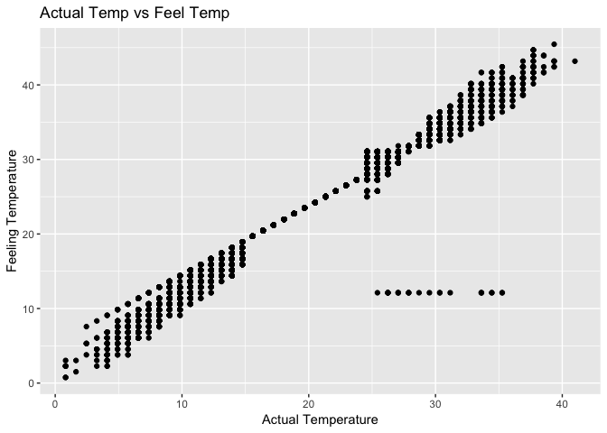

``` r
ggplot(bikeTrain,aes(x=atemp,y=count,colour=bikeTrain$hourBins)) + 
  geom_point() + 
  ggtitle("Count vs Feel Temp") +
  labs(x="Actual Temperature", y="Count") 
```


    observation: When the temperature is between 15degC and 25 degC, there is no difference between the actual and feeling temperature. There is a variation between the two types of temperature at higher and lower temperatures. But, it also evident that the two temperatures are highly correlated. So, while modeling, we should consider only one of them. As the bike sharing is an outdoor activity, it may make sense to use the atemp or feeling temperature.

``` r
ggplot(bikeTrain,aes(x=casual,y=registered)) + 
  geom_point() + 
  ggtitle("Casual vs Registered Renters") +
  labs(x="Unregistered Renters", y="Registered Renters") 
```


``` r
#bikeTrain$Hour = substr(bikeTrain$datetime, 12, 13) # extract Hour of rental
bikeTrain$TypeOfDay = bikeTrain$holiday+(2*bikeTrain$workingday)+1
bikeTrain$TypeOfDay = as.factor(bikeTrain$TypeOfDay)
levels(bikeTrain$TypeOfDay)=c("Weekend","Holiday","Working Day")
ggplot(bikeTrain,aes(x=hour,y=count,colour=TypeOfDay)) + 
  geom_point() + 
  ggtitle("Rental by Time of Day") +
  labs(x="Hour of Day", y="Count of bikes rented") 
```


    Observation: When observed by the hour of the day, bikes are rented at all hours of the day with the highest number of bikes being rented at the 8am hour and from 5pm to 7pm on working days. This clearly indicates that bikes are rented as commutes to and from work.

``` r
weatherF = as.factor(bikeTrain$weather)
levels(weatherF)=c("Clear","Cloudy","Light Rain/Snow", "Snow/Heavy Rain")
ggplot(bikeTrain,aes(x=hour,y=count,colour=weatherF)) + 
  geom_point() + 
  ggtitle("Rental by Time of Day") +
  labs(x="Hour of Day", y="Count of bikes rented") 
```


    Observation: When observed by the hour of the day, bikes are rented during late hours of the day when the weather is either clear or cloudy. Bikes are rented during light rain only during the middle of the day.

``` r
seasonF = as.factor(bikeTrain$season)
levels(seasonF)=c("Spring","Summer","Fall","Winter")
ggplot(bikeTrain,aes(x=hour,y=count,colour=seasonF)) + 
  geom_point() + 
  ggtitle("Rental by Time of Day") +
  labs(x="Hour of Day", y="Count of bikes rented") 
```


    Observation - It seems counter-intuitive that mode number of bikes are rented during the winter than in spring

    Based on all the observations, there seems to be an interaction between the hours of the day, the weather, and whether it is a holiday. This will need to be verified using the different models

    Approaches:
       1. Multiple Linear Regression
          a. Do Residual Analysis
       2. Feature Reductin - using subseet regression
       3. Apply Regularization 
          a. Ridge
          b. Lasso
       4. PCR
       5. PLS
       6. Random Forests
       7. Boosting
       8. Additive Models
       
    In all cases, apply cross validation and pick the best values.
    Compare all the errors and determine the accuracy

    *B IMportant to note that we can predict only using the previous training values *B

``` r
#extract the dates -- playing around with the strptime function - this subsection not needed for analysis
dates = substr(bikeTrain$datetime, 1, 10) # extract Hour of rental
uniqueDates = unique(dates) 
#uniqueDates

bikeTrain$datetime <- strptime(bikeTrain$datetime, format="%Y-%m-%d %H:%M:%S")

bikeTrain$year = bikeTrain$datetime$year
bikeTrain$mon = bikeTrain$datetime$mon #Jan is represented as 0, Dec as 11 - months() - prints name
bikeTrain$mday = bikeTrain$datetime$mday #0-31 -- 
bikeTrain$hour = bikeTrain$datetime$hour #0-23 hours 
#head(bikeTrain$datetime$min) #0-59  minutes
#head(bikeTrain$datetime$sec) #0-61 seconds
bikeTrain$wday = bikeTrain$datetime$wday #0-6 das of the week: weekdays() prints name
```

``` r
#Check correlations between the numeric variables.
 cor(cbind(temp=bikeTrain$temp,atemp=bikeTrain$atemp,humidity=bikeTrain$humidity,windspeed=bikeTrain$windspeed))
```

    ##                  temp       atemp    humidity   windspeed
    ## temp       1.00000000  0.98494811 -0.06494877 -0.01785201
    ## atemp      0.98494811  1.00000000 -0.04353571 -0.05747300
    ## humidity  -0.06494877 -0.04353571  1.00000000 -0.31860699
    ## windspeed -0.01785201 -0.05747300 -0.31860699  1.00000000

    Observation: Temp and atemp are highy correlated - causing multicollinearity. So, we would not want to include both variables in the model. As perople tend to do outdoor activities by the "feeling temperature" rather the actual, we will only use atemp.

Data Modeling
-------------

``` r
bikeTrain = read.csv("train.csv",header=TRUE,sep=",")
bikeTest = read.csv("test.csv",header=TRUE,sep=",")
str(bikeTrain)
```

    ## 'data.frame':    10886 obs. of  12 variables:
    ##  $ datetime  : Factor w/ 10886 levels "2011-01-01 00:00:00",..: 1 2 3 4 5 6 7 8 9 10 ...
    ##  $ season    : int  1 1 1 1 1 1 1 1 1 1 ...
    ##  $ holiday   : int  0 0 0 0 0 0 0 0 0 0 ...
    ##  $ workingday: int  0 0 0 0 0 0 0 0 0 0 ...
    ##  $ weather   : int  1 1 1 1 1 2 1 1 1 1 ...
    ##  $ temp      : num  9.84 9.02 9.02 9.84 9.84 ...
    ##  $ atemp     : num  14.4 13.6 13.6 14.4 14.4 ...
    ##  $ humidity  : int  81 80 80 75 75 75 80 86 75 76 ...
    ##  $ windspeed : num  0 0 0 0 0 ...
    ##  $ casual    : int  3 8 5 3 0 0 2 1 1 8 ...
    ##  $ registered: int  13 32 27 10 1 1 0 2 7 6 ...
    ##  $ count     : int  16 40 32 13 1 1 2 3 8 14 ...

Extract the details of the time variables

``` r
bikeTrain$datetime <- strptime(bikeTrain$datetime, format="%Y-%m-%d %H:%M:%S")
bikeTrain$year = bikeTrain$datetime$year
bikeTrain$mon = bikeTrain$datetime$mon #Jan is represented as 0, Dec as 11 - months() - prints name
#create factor variables of year and month
bikeTrain$yearf=as.factor(bikeTrain$year)
bikeTrain$monf=as.factor(bikeTrain$mon)
bikeTrain$hour = as.factor(bikeTrain$datetime$hour)
bikeTrain$mday = as.factor(bikeTrain$datetime$mday) #0-31 -- 
#bikeTrain$mday = bikeTrain$datetime$mday
bikeTrain$hour = as.factor(bikeTrain$datetime$hour) #0-23 hours 
#head(bikeTrain$datetime$min) #0-59  minutes
#head(bikeTrain$datetime$sec) #0-61 seconds
bikeTrain$wday = as.factor(bikeTrain$datetime$wday) #0-6 das of the week: weekdays() prints name
```

Convert categorical predictors from numerical to factor data type

``` r
#additional columns
#create factor variables for train set
bikeTrain$typeofday = as.factor(bikeTrain$holiday+(2*bikeTrain$workingday)+1)
levels(bikeTrain$typeofday)=c("Weekend","Holiday","Working Day")
bikeTrain$season = factor(bikeTrain$season)
levels(bikeTrain$season)=c("Spring","Summer","Fall","Winter")
bikeTrain$weather = as.factor(bikeTrain$weather)
levels(bikeTrain$weather)=c("Clear","Cloudy","Light Rain/Snow", "Snow/Heavy Rain")
#str(bikeTrain)
#remove unwanted columns
bikeTrain = within(bikeTrain,rm(holiday,workingday,casual,registered,datetime,temp))
bikeTrain$name = ""
str(bikeTrain)
```

    ## 'data.frame':    10886 obs. of  15 variables:
    ##  $ season   : Factor w/ 4 levels "Spring","Summer",..: 1 1 1 1 1 1 1 1 1 1 ...
    ##  $ weather  : Factor w/ 4 levels "Clear","Cloudy",..: 1 1 1 1 1 2 1 1 1 1 ...
    ##  $ atemp    : num  14.4 13.6 13.6 14.4 14.4 ...
    ##  $ humidity : int  81 80 80 75 75 75 80 86 75 76 ...
    ##  $ windspeed: num  0 0 0 0 0 ...
    ##  $ count    : int  16 40 32 13 1 1 2 3 8 14 ...
    ##  $ year     : int  111 111 111 111 111 111 111 111 111 111 ...
    ##  $ mon      : int  0 0 0 0 0 0 0 0 0 0 ...
    ##  $ yearf    : Factor w/ 2 levels "111","112": 1 1 1 1 1 1 1 1 1 1 ...
    ##  $ monf     : Factor w/ 12 levels "0","1","2","3",..: 1 1 1 1 1 1 1 1 1 1 ...
    ##  $ hour     : Factor w/ 24 levels "0","1","2","3",..: 1 2 3 4 5 6 7 8 9 10 ...
    ##  $ mday     : Factor w/ 19 levels "1","2","3","4",..: 1 1 1 1 1 1 1 1 1 1 ...
    ##  $ wday     : Factor w/ 7 levels "0","1","2","3",..: 7 7 7 7 7 7 7 7 7 7 ...
    ##  $ typeofday: Factor w/ 3 levels "Weekend","Holiday",..: 1 1 1 1 1 1 1 1 1 1 ...
    ##  $ name     : chr  "" "" "" "" ...

``` r
#knit_exit()
```

Create and transform the test dataset now

``` r
#remove entry with first in the year 2011
bikeTest=bikeTest[-which(row.names(bikeTest)==586),]

bikeTest$datetime <- strptime(bikeTest$datetime, format="%Y-%m-%d %H:%M:%S")
bikeTest$year = bikeTest$datetime$year
bikeTest$mon = bikeTest$datetime$mon #Jan is represented as 0, Dec as 11 - months() - prints name
#create factor variables of year and month
bikeTest$yearf=as.factor(bikeTest$year)
bikeTest$monf=as.factor(bikeTest$mon)
bikeTest$mday = as.factor(bikeTest$datetime$mday) #0-31 -- 
#bikeTest$mday = bikeTest$datetime$mday #0-31 -- 
bikeTest$hour = as.factor(bikeTest$datetime$hour) #0-23 hours 
#head(bikeTest$datetime$min) #0-59  minutes
#head(bikeTest$datetime$sec) #0-61 seconds
bikeTest$wday = as.factor(bikeTest$datetime$wday) #0-6 das of the week: weekdays() prints name

#Convert categorical predictors from numerical to factor data type
#additional columns
#create factor variables for Test set
bikeTest$typeofday = as.factor(bikeTest$holiday+(2*bikeTest$workingday)+1)
levels(bikeTest$typeofday)=c("Weekend","Holiday","Working Day")
bikeTest$season = factor(bikeTest$season)
levels(bikeTest$season)=c("Spring","Summer","Fall","Winter")
bikeTest$weather = as.factor(bikeTest$weather)
levels(bikeTest$weather)=c("Clear","Cloudy","Light Rain/Snow", "Snow/Heavy Rain")
#remove unwanted columns
bikeTest = within(bikeTest,rm(holiday,workingday,casual,registered,datetime,temp))
```

    ## Warning in rm(holiday, workingday, casual, registered, datetime, temp):
    ## object 'casual' not found

    ## Warning in rm(holiday, workingday, casual, registered, datetime, temp):
    ## object 'registered' not found

``` r
bikeTest$name = ""
bikeTest$count = rep(0,nrow(bikeTest))
#str(bikeTest)
```

``` r
#read the data from the UCI dataset that contains the counts for the testset too
fulldata = read.csv("hour_fullset.csv",header=TRUE,sep=",",stringsAsFactors=FALSE)
bikeTest2 = fulldata[which(strptime(fulldata$datetime, format="%Y-%m-%d %H:%M:%S")$mday > 19),]
#remove entry with snow in the first month of 2011
bikeTest2=bikeTest2[-which(row.names(bikeTest2)==586),]


#Create and transform the new test dataset now
bikeTest2$datetime <- strptime(bikeTest2$datetime, format="%Y-%m-%d %H:%M:%S")
bikeTest2$year = bikeTest2$datetime$year
bikeTest2$mon = bikeTest2$datetime$mon #Jan is represented as 0, Dec as 11 - months() - prints name
#create factor variables of year and month
bikeTest2$yearf=as.factor(bikeTest2$year)
bikeTest2$monf=as.factor(bikeTest2$mon)
bikeTest2$hour = as.factor(bikeTest2$datetime$hour)
bikeTest2$mday = as.factor(bikeTest2$datetime$mday) #0-31 -- 
#bikeTest2$mday = bikeTest2$datetime$mday #0-31 -- 
bikeTest2$hour = as.factor(bikeTest2$datetime$hour) #0-23 hours 
#head(bikeTest2$datetime$min) #0-59  minutes
#head(bikeTest2$datetime$sec) #0-61 seconds
bikeTest2$wday = as.factor(bikeTest2$datetime$wday) #0-6 das of the week: weekdays() prints name

#Convert categorical predictors from numerical to factor data type
#additional columns
#create factor variables for Test set
bikeTest2$typeofday = as.factor(bikeTest2$holiday+(2*bikeTest2$workingday)+1)
levels(bikeTest2$typeofday)=c("Weekend","Holiday","Working Day")
bikeTest2$season = factor(bikeTest2$season)
levels(bikeTest2$season)=c("Spring","Summer","Fall","Winter")
bikeTest2$weather = as.factor(bikeTest2$weather)
levels(bikeTest2$weather)=c("Clear","Cloudy","Light Rain/Snow", "Snow/Heavy Rain")
#remove unwanted columns
bikeTest2 = within(bikeTest2,rm(holiday,workingday,casual,registered,datetime,temp))
#remove row with snow in jan 2011


str(bikeTest2)
```

    ## 'data.frame':    6492 obs. of  14 variables:
    ##  $ season   : Factor w/ 4 levels "Spring","Summer",..: 1 1 1 1 1 1 1 1 1 1 ...
    ##  $ weather  : Factor w/ 4 levels "Clear","Cloudy",..: 1 1 1 1 1 1 1 1 1 2 ...
    ##  $ atemp    : num  0.227 0.273 0.273 0.258 0.258 ...
    ##  $ humidity : num  0.56 0.56 0.56 0.56 0.56 0.6 0.6 0.55 0.55 0.52 ...
    ##  $ windspeed: num  0.388 0 0 0.164 0.164 ...
    ##  $ count    : int  13 5 2 1 1 6 35 101 249 143 ...
    ##  $ year     : int  111 111 111 111 111 111 111 111 111 111 ...
    ##  $ mon      : int  0 0 0 0 0 0 0 0 0 0 ...
    ##  $ yearf    : Factor w/ 2 levels "111","112": 1 1 1 1 1 1 1 1 1 1 ...
    ##  $ monf     : Factor w/ 12 levels "0","1","2","3",..: 1 1 1 1 1 1 1 1 1 1 ...
    ##  $ hour     : Factor w/ 24 levels "0","1","2","3",..: 1 2 3 4 5 6 7 8 9 10 ...
    ##  $ mday     : Factor w/ 12 levels "20","21","22",..: 1 1 1 1 1 1 1 1 1 1 ...
    ##  $ wday     : Factor w/ 7 levels "0","1","2","3",..: 5 5 5 5 5 5 5 5 5 5 ...
    ##  $ typeofday: Factor w/ 3 levels "Weekend","Holiday",..: 3 3 3 3 3 3 3 3 3 3 ...

``` r
#knit_exit()
```

``` r
#create the multiple datasets
unique(bikeTrain$yearf)
```

    ## [1] 111 112
    ## Levels: 111 112

``` r
unique(bikeTrain$monf)
```

    ##  [1] 0  1  2  3  4  5  6  7  8  9  10 11
    ## Levels: 0 1 2 3 4 5 6 7 8 9 10 11

``` r
#split the train data by the factor variables yearf, monf
bikeTrainSets = split(bikeTrain,list(bikeTrain$yearf,bikeTrain$monf))

#create the strings on which the split was done to help build the growing sets of datasets
#combine year and mon - cannot use factor variables directly in cbind
yearmon = cbind(bikeTrain$year,bikeTrain$mon)
#yearmon = cbind(levels(bikeTrain$yearf),levels(bikeTrain$monf))
#order the columsn first by year and then by column
yearmons = unique(yearmon[order(yearmon[,1],yearmon[,2],decreasing = FALSE),])
#yearmons
#combine the ordered entries into a string
splitString=paste(yearmons[,1],'.',yearmons[,2],sep="")
#splitString

#create an incremental list of dataframes - incremental in the data elements
bikeTrainIncrList = list() 
prevBikeTrain = data.frame()
for(i in splitString) {
  #print(bikeTrainSets[[i]])
  bikeTrainIncrList[[i]] = rbind(prevBikeTrain,bikeTrainSets[[i]])
  prevBikeTrain = bikeTrainIncrList[[i]]
  bikeTrainIncrList[[i]]$name = i
}

#check that each element in the list is a dataframe and combines the data from the previous months
# start of print functions
#sapply(bikeTrainIncrList,FUN=str)
#sapply(bikeTrainIncrList,FUN=function(x) unique(cbind(x$yearf,x$monf)))
#length(bikeTrainIncrList)
#end of print functions
#knit_exit()
```

``` r
#for each entry in biketest, determine the corresponding model that needs to be used
getYearMon = function(x) {
  #print(paste(trimws(x["year"]),'.',trimws(x["mon"]),sep=""))
  return(paste(trimws(x["year"]),'.',trimws(x["mon"]),sep=""))
}
set.seed(1)
testSample = bikeTest[sample(nrow(bikeTest),30),]
#apply(testSample, MARGIN=1, FUN=function(x) getYearMon(x))
matchTrainList = apply(testSample, MARGIN=1, FUN=function(x) bikeTrainIncrList[[getYearMon(x)]])

#start of print functions....
#str(matchTrainList)
#sapply(seq(30),FUN=function(x) cbind(testSample$year[x],testSample$mon[x],unique(cbind(matchTrainList[[x]]$year,matchTrainList[[x]]$mon))))#
#end of print functions...

#check the same for bikeTest2
testSample2 = bikeTest2[sample(nrow(bikeTest2),30),]
matchTrainList2 = apply(testSample2, MARGIN=1, FUN=function(x) bikeTrainIncrList[[getYearMon(x)]])

#start of print functions....
#str(matchTrainList)
#sapply(seq(30),FUN=function(x) cbind(testSample2$year[x],testSample2$mon[x],unique(cbind(matchTrainList2[[x]]$year,matchTrainList2[[x]]$mon))))#
#end of print functions ....
#knit_exit()
```

``` r
#apply data models  - lm
 func_fit_lm = function(trainset,testset,factorpreds,dname) {
   #create the formula string
   formula_string = paste("count~",factorpreds,"+atemp+humidity+windspeed",sep="")
   print(formula_string)
  fit_lm = lm(as.formula(formula_string),data=trainset)
  trainerror = mean((trainset$count - predict(fit_lm,newdata=trainset))^2)
  testerror = mean((testset$count - predict(fit_lm,newdata=testset))^2)
  #print(c(trainerror,testerror))
  cat("dataset=",dname,"model=lm","trainerror=",trainerror,"testerror=",testerror)
  
  #analyse the result
  summary(fit_lm)
  #vif(fit_lm)
  anova(fit_lm)
  par(mfrow=c(2,2))
  plot(fit_lm)
  par(mfrow=c(1,1))
  #print(list("model"="lm","trainerror"=trainerror,"testerror"=testerror))
  return(list("dataset"=unique(trainset$name),"model"="lm","trainerror"=trainerror,"testerror"=testerror,"fit"=fit_lm))
    
 }
```

``` r
 func_fit_gam_lm = function(trainset,testset,factorpreds,dname) {
   #print(dim(trainset))
   #create the formula string
   formula_string = paste("count~",factorpreds,"+atemp+humidity+windspeed",sep="")
   print(formula_string)
   
   fit_gam_lm = gam(as.formula(formula_string),data=trainset)
   print(summary(fit_gam_lm))
   
   trainerror = mean((trainset$count - predict(fit_gam_lm,newdata=trainset)) ^2)
   testerror = mean((testset$count - predict(fit_gam_lm,newdata=testset))^2)
 
   cat("dataset=",dname,"model=gam_lm","trainerror=",trainerror,"testerror=",testerror)
   plot.Gam(fit_gam_lm, se=TRUE, col="green")

   return(list("dataset"=unique(trainset$name),"model"="gam_lm","trainerror"=trainerror,"testerror"=testerror,"fit"=fit_gam_lm))
 }
```

``` r
 func_fit_gam_poly = function(trainset,testset,factorpreds,dname) {
   print(dim(trainset))
   formula_string_2 = paste("count~",factorpreds,"+poly(atemp,2)+poly(humidity,2)+poly(windspeed,2)",sep="")
   fit_gam_poly_2 = gam(as.formula(formula_string_2),data=trainset)
   
   formula_string_3 = paste("count~",factorpreds,"+poly(atemp,3)+poly(humidity,3)+poly(windspeed,3)",sep="")
   fit_gam_poly_3 = gam(as.formula(formula_string_3),data=trainset)
  
    formula_string_4 = paste("count~",factorpreds,"+poly(atemp,4)+poly(humidity,4)+poly(windspeed,4)",sep="")
   fit_gam_poly_4 = gam(as.formula(formula_string_4),data=trainset)
   
   formula_string_5 = paste("count~",factorpreds,"+poly(atemp,5)+poly(humidity,5)+poly(windspeed,5)",sep="")
   fit_gam_poly_5 = gam(as.formula(formula_string_5),data=trainset)
   
   #compare the different poly models
   print(summary(fit_gam_poly_2))
   print(summary(fit_gam_poly_3))
   print(summary(fit_gam_poly_4))
   print(summary(fit_gam_poly_5))
   print(anova(fit_gam_poly_2,fit_gam_poly_3,fit_gam_poly_4,fit_gam_poly_5))
   #observation - ploy_3 seems to be the best fit in general

   trainerror = mean((trainset$count - predict(fit_gam_poly_3,newdata=trainset))^2)
   testerror = mean((testset$count - predict(fit_gam_poly_3,newdata=testset))^2)

  cat("dataset=",dname,"model=gam_poly","trainerror=",trainerror,"testerror=",testerror)

   return(list("dataset"=unique(trainset$name),"model"="gam_poly","trainerror"=trainerror,"testerror"=testerror,"fit"=fit_gam_poly_3))
}
```

``` r
 func_fit_gam_s = function(trainset,testset,factorpreds,dname) {
    formula_string = paste("count~",factorpreds,"+s(atemp)+s(humidity)+s(windspeed)",sep="")
  print(formula_string)
    fit_gam_s = gam(as.formula(formula_string),data=trainset)
   trainerror = mean((trainset$count-predict(fit_gam_s,newdata=trainset))^2)
   testerror = mean((testset$count-predict(fit_gam_s,newdata=testset))^2)
   #print(head(cbind(trainset$mday,trainset$hour,trainset$count,predict(fit_gam_s,newdata=trainset))),20)
   #print(head(cbind(testset$mday,testset$hour,testset$count,predict(fit_gam_s,newdata=testset))),20)
   
   cat("dataset=",dname,"model=gam_s","trainerror=",trainerror,"testerror=",testerror)
   
   #analyse the results
   print(summary(fit_gam_s))
   plot.Gam(fit_gam_s, se=TRUE, col="green")
   
   return(list("dataset"=unique(trainset$name),"model"="gam_s","trainerror"=trainerror,"testerror"=testerror,"fit"=fit_gam_s))
 }
```

``` r
func_fit_rf = function(trainset,testset,factorpreds,dname) {
    formula_string = paste("count~",factorpreds,"+atemp+humidity+windspeed",sep="")
    print(formula_string)
    fit_rf = randomForest(as.formula(formula_string),data=trainset,importance=TRUE)
  print(importance(fit_rf))
  varImpPlot(fit_rf)
   trainerror = mean((trainset$count-predict(fit_rf,newdata=trainset))^2)
   testerror = mean((testset$count-predict(fit_rf,newdata=testset))^2)
  
   cat("dataset=",dname,"model=rf","trainerror=",trainerror,"testerror=",testerror)
   return(list("dataset"=unique(trainset$name),"model"="rf","trainerror"=trainerror,"testerror"=testerror,"fit"=fit_rf))
 }
```

``` r
func_fit_boost = function(trainset,testset,factorpreds,dname) {
    formula_string = paste("count~",factorpreds,"+atemp+humidity+windspeed",sep="")
    fit_boost = gbm(as.formula(formula_string),data=trainset,distribution="gaussian",n.trees=5000,interaction.depth=4)
print(summary(fit_boost))
 trainerror = mean((trainset$count-predict(fit_boost,newdata=trainset,n.trees=5000))^2)
 testerror = mean((testset$count-predict(fit_boost,newdata=testset,n.trees=5000))^2)
  
  cat("dataset=",dname,"model=boost","trainerror=",trainerror,"testerror=",testerror)
  
   return(list("dataset"=unique(trainset$name),"model"="boost","trainerror"=trainerror,"testerror"=testerror,"fit"=fit_boost))
 }
```

``` r
 func_fit_models = function(dataset) {

  #create new variable for purposes of data partitioning
   #create stratified partition based on weather, type of day, month and hour
  dataset$partgroup = paste(dataset$weather,dataset$typeofday,dataset$mon,sep="_")
  sample =createDataPartition(dataset$partgroup,p=0.7,list=F)
  trainset = dataset[sample,]
  testset = dataset[-sample,]

  #Note: we compared model results (train and test errors) between using year and mon as numeric varaibles vs using them as factor variables (as they should be). There was a big improvement with using them as factor variables. But, for the smaller datasets where all entries all belong to the same month or year, we need to ignore the year or month factor variable.
  
  #select factor predictors for this dataset. We only want to include predictors that have at least two entries. Specifically check for season, year and mon
  dataset_name = unique(dataset$name)
   factorPreds = "weather+typeofday+wday+hour"
  #if(sum(table(dataset$season)>0)>1) {
    #factorPreds = paste(factorPreds,"season",sep="+")
  #} 
  if(sum(table(dataset$yearf)>0)>1) {
    factorPreds = paste(factorPreds,"yearf",sep="+")
  }
  if(sum(table(dataset$monf)>0)>1) {
    factorPreds = paste(factorPreds,"monf",sep="+")
  }  

  print(factorPreds)
  
  #fit lm
  #model_perf = data.frame(stringsAsFactors = FALSE)
  model_perf=list()
  model_perf = rbind(model_perf,func_fit_lm(trainset,testset,factorPreds,dataset_name))
  model_perf = rbind(model_perf,func_fit_gam_lm(trainset,testset,factorPreds,dataset_name))
  model_perf = rbind(model_perf,func_fit_gam_poly(trainset,testset,factorPreds,dataset_name))
  model_perf = rbind(model_perf,func_fit_gam_s(trainset,testset,factorPreds,dataset_name))
  model_perf = rbind(model_perf,func_fit_rf(trainset,testset,factorPreds,dataset_name))
 model_perf = rbind(model_perf,func_fit_boost(trainset,testset,factorPreds,dataset_name))
  model_perf = as.data.frame(model_perf)
  print(dim(dataset))
  print(unique(dataset$name))
  with(model_perf,print(cbind(dataset,model,trainerror,testerror)))
  #find the model that has the lowest test error
  print("model with lowest test error")
  print(model_perf[which.min(model_perf$testerror),c("dataset","model","trainerror","testerror")])
  return(model_perf[which.min(model_perf$testerror),])
 }
```

``` r
bikeTrainFitList_models = do.call(rbind,lapply(bikeTrainIncrList,FUN=function(x) func_fit_models(x)))
```

    ## Warning in createDataPartition(dataset$partgroup, p = 0.7, list = F): Some
    ## classes have a single record ( Clear_Holiday_0 ) and these will be selected
    ## for the sample

    ## [1] "weather+typeofday+wday+hour"
    ## [1] "count~weather+typeofday+wday+hour+atemp+humidity+windspeed"

    ## Warning in predict.lm(fit_lm, newdata = trainset): prediction from a rank-
    ## deficient fit may be misleading

    ## Warning in predict.lm(fit_lm, newdata = testset): prediction from a rank-
    ## deficient fit may be misleading

    ## dataset= 111.0 model=lm trainerror= 757.8373 testerror= 691.606

    ## [1] "count~weather+typeofday+wday+hour+atemp+humidity+windspeed"
    ## 
    ## Call: gam(formula = as.formula(formula_string), data = trainset)
    ## Deviance Residuals:
    ##      Min       1Q   Median       3Q      Max 
    ## -113.984  -13.130   -1.084   15.979   76.590 
    ## 
    ## (Dispersion Parameter for gaussian family taken to be 859.2579)
    ## 
    ##     Null Deviance: 717117.3 on 304 degrees of freedom
    ## Residual Deviance: 231140.4 on 269 degrees of freedom
    ## AIC: 2961.845 
    ## 
    ## Number of Local Scoring Iterations: 2 
    ## 
    ## Anova for Parametric Effects
    ##            Df Sum Sq Mean Sq F value    Pr(>F)    
    ## weather     2  20851 10425.6 12.1333 9.013e-06 ***
    ## typeofday   2  17155  8577.3  9.9822 6.578e-05 ***
    ## wday        5   5593  1118.6  1.3018   0.26338    
    ## hour       23 435835 18949.3 22.0531 < 2.2e-16 ***
    ## atemp       1   2635  2635.0  3.0666   0.08106 .  
    ## humidity    1   3770  3770.2  4.3877   0.03713 *  
    ## windspeed   1    138   138.4  0.1610   0.68853    
    ## Residuals 269 231140   859.3                      
    ## ---
    ## Signif. codes:  0 '***' 0.001 '**' 0.01 '*' 0.05 '.' 0.1 ' ' 1

    ## Warning in predict.lm(object, newdata, se.fit, scale = 1, type =
    ## ifelse(type == : prediction from a rank-deficient fit may be misleading

    ## Warning in predict.lm(object, newdata, se.fit, scale = 1, type =
    ## ifelse(type == : prediction from a rank-deficient fit may be misleading


    ## dataset= 111.0 model=gam_lm trainerror= 757.8373 testerror= 691.606


    ## [1] 305  16
    ## 
    ## Call: gam(formula = as.formula(formula_string_2), data = trainset)
    ## Deviance Residuals:
    ##      Min       1Q   Median       3Q      Max 
    ## -115.773  -12.490   -1.025   15.659   77.809 
    ## 
    ## (Dispersion Parameter for gaussian family taken to be 854.853)
    ## 
    ##     Null Deviance: 717117.3 on 304 degrees of freedom
    ## Residual Deviance: 227390.9 on 266 degrees of freedom
    ## AIC: 2962.857 
    ## 
    ## Number of Local Scoring Iterations: 2 
    ## 
    ## Anova for Parametric Effects
    ##                     Df Sum Sq Mean Sq F value    Pr(>F)    
    ## weather              2  20851 10425.6 12.1958 8.558e-06 ***
    ## typeofday            2  17155  8577.3 10.0336 6.295e-05 ***
    ## wday                 5   5593  1118.6  1.3085   0.26060    
    ## hour                23 435835 18949.3 22.1668 < 2.2e-16 ***
    ## poly(atemp, 2)       2   6682  3340.9  3.9082   0.02124 *  
    ## poly(humidity, 2)    2   2408  1204.2  1.4087   0.24628    
    ## poly(windspeed, 2)   2   1203   601.3  0.7034   0.49580    
    ## Residuals          266 227391   854.9                      
    ## ---
    ## Signif. codes:  0 '***' 0.001 '**' 0.01 '*' 0.05 '.' 0.1 ' ' 1
    ## 
    ## 
    ## Call: gam(formula = as.formula(formula_string_3), data = trainset)
    ## Deviance Residuals:
    ##      Min       1Q   Median       3Q      Max 
    ## -115.044  -12.764   -1.165   15.922   77.234 
    ## 
    ## (Dispersion Parameter for gaussian family taken to be 862.6289)
    ## 
    ##     Null Deviance: 717117.3 on 304 degrees of freedom
    ## Residual Deviance: 226871.4 on 263 degrees of freedom
    ## AIC: 2968.16 
    ## 
    ## Number of Local Scoring Iterations: 2 
    ## 
    ## Anova for Parametric Effects
    ##                     Df Sum Sq Mean Sq F value    Pr(>F)    
    ## weather              2  20851 10425.6 12.0859 9.518e-06 ***
    ## typeofday            2  17155  8577.3  9.9432 6.874e-05 ***
    ## wday                 5   5593  1118.6  1.2967   0.26562    
    ## hour                23 435835 18949.3 21.9670 < 2.2e-16 ***
    ## poly(atemp, 3)       3   6790  2263.2  2.6236   0.05101 .  
    ## poly(humidity, 3)    3   3141  1046.9  1.2136   0.30519    
    ## poly(windspeed, 3)   3    882   294.0  0.3409   0.79580    
    ## Residuals          263 226871   862.6                      
    ## ---
    ## Signif. codes:  0 '***' 0.001 '**' 0.01 '*' 0.05 '.' 0.1 ' ' 1
    ## 
    ## 
    ## Call: gam(formula = as.formula(formula_string_4), data = trainset)
    ## Deviance Residuals:
    ##       Min        1Q    Median        3Q       Max 
    ## -115.7047  -12.8524   -0.6623   15.1433   76.1325 
    ## 
    ## (Dispersion Parameter for gaussian family taken to be 851.6374)
    ## 
    ##     Null Deviance: 717117.3 on 304 degrees of freedom
    ## Residual Deviance: 221425.7 on 260 degrees of freedom
    ## AIC: 2966.749 
    ## 
    ## Number of Local Scoring Iterations: 2 
    ## 
    ## Anova for Parametric Effects
    ##                     Df Sum Sq Mean Sq F value    Pr(>F)    
    ## weather              2  20851 10425.6 12.2419 8.300e-06 ***
    ## typeofday            2  17155  8577.3 10.0715 6.126e-05 ***
    ## wday                 5   5593  1118.6  1.3134   0.25861    
    ## hour                23 435835 18949.3 22.2505 < 2.2e-16 ***
    ## poly(atemp, 4)       4  10714  2678.6  3.1452   0.01504 *  
    ## poly(humidity, 4)    4   3298   824.4  0.9681   0.42551    
    ## poly(windspeed, 4)   4   2246   561.5  0.6593   0.62078    
    ## Residuals          260 221426   851.6                      
    ## ---
    ## Signif. codes:  0 '***' 0.001 '**' 0.01 '*' 0.05 '.' 0.1 ' ' 1
    ## 
    ## 
    ## Call: gam(formula = as.formula(formula_string_5), data = trainset)
    ## Deviance Residuals:
    ##       Min        1Q    Median        3Q       Max 
    ## -119.7384  -12.2892   -0.3945   15.3050   79.0958 
    ## 
    ## (Dispersion Parameter for gaussian family taken to be 847.2311)
    ## 
    ##     Null Deviance: 717117.3 on 304 degrees of freedom
    ## Residual Deviance: 217738.4 on 257 degrees of freedom
    ## AIC: 2967.628 
    ## 
    ## Number of Local Scoring Iterations: 2 
    ## 
    ## Anova for Parametric Effects
    ##                     Df Sum Sq Mean Sq F value    Pr(>F)    
    ## weather              2  20851 10425.6 12.3056 7.878e-06 ***
    ## typeofday            2  17155  8577.3 10.1239 5.859e-05 ***
    ## wday                 5   5593  1118.6  1.3203  0.255826    
    ## hour                23 435835 18949.3 22.3662 < 2.2e-16 ***
    ## poly(atemp, 5)       5  13097  2619.4  3.0917  0.009949 ** 
    ## poly(humidity, 5)    5   3984   796.7  0.9404  0.455329    
    ## poly(windspeed, 5)   5   2865   573.0  0.6763  0.641770    
    ## Residuals          257 217738   847.2                      
    ## ---
    ## Signif. codes:  0 '***' 0.001 '**' 0.01 '*' 0.05 '.' 0.1 ' ' 1
    ## 
    ## Analysis of Deviance Table
    ## 
    ## Model 1: count ~ weather + typeofday + wday + hour + poly(atemp, 2) + 
    ##     poly(humidity, 2) + poly(windspeed, 2)
    ## Model 2: count ~ weather + typeofday + wday + hour + poly(atemp, 3) + 
    ##     poly(humidity, 3) + poly(windspeed, 3)
    ## Model 3: count ~ weather + typeofday + wday + hour + poly(atemp, 4) + 
    ##     poly(humidity, 4) + poly(windspeed, 4)
    ## Model 4: count ~ weather + typeofday + wday + hour + poly(atemp, 5) + 
    ##     poly(humidity, 5) + poly(windspeed, 5)
    ##   Resid. Df Resid. Dev Df Deviance Pr(>Chi)  
    ## 1       266     227391                       
    ## 2       263     226871  3    519.5  0.89341  
    ## 3       260     221426  3   5445.7  0.09256 .
    ## 4       257     217738  3   3687.3  0.22586  
    ## ---
    ## Signif. codes:  0 '***' 0.001 '**' 0.01 '*' 0.05 '.' 0.1 ' ' 1

    ## Warning in predict.lm(object, newdata, se.fit, scale = 1, type =
    ## ifelse(type == : prediction from a rank-deficient fit may be misleading

    ## Warning in predict.lm(object, newdata, se.fit, scale = 1, type =
    ## ifelse(type == : prediction from a rank-deficient fit may be misleading

    ## dataset= 111.0 model=gam_poly trainerror= 743.8407 testerror= 746.5166[1] "count~weather+typeofday+wday+hour+s(atemp)+s(humidity)+s(windspeed)"

    ## Warning in predict.lm(object, newdata, se.fit, scale = 1, type =
    ## ifelse(type == : prediction from a rank-deficient fit may be misleading

    ## Warning in predict.lm(object, newdata, se.fit, scale = 1, type =
    ## ifelse(type == : prediction from a rank-deficient fit may be misleading


    ## dataset= 111.0 model=gam_s trainerror= 727.6329 testerror= 731.8908
    ## Call: gam(formula = as.formula(formula_string), data = trainset)
    ## Deviance Residuals:
    ##       Min        1Q    Median        3Q       Max 
    ## -115.6663  -12.2605   -0.9796   15.6834   76.9997 
    ## 
    ## (Dispersion Parameter for gaussian family taken to be 853.5772)
    ## 
    ##     Null Deviance: 717117.3 on 304 degrees of freedom
    ## Residual Deviance: 221929.6 on 259.9995 degrees of freedom
    ## AIC: 2967.444 
    ## 
    ## Number of Local Scoring Iterations: 2 
    ## 
    ## Anova for Parametric Effects
    ##               Df Sum Sq Mean Sq F value    Pr(>F)    
    ## weather        2  18788  9393.8 11.0052 2.583e-05 ***
    ## typeofday      2  10820  5409.8  6.3378  0.002054 ** 
    ## wday           5   6829  1365.8  1.6001  0.160399    
    ## hour          23 427805 18600.2 21.7909 < 2.2e-16 ***
    ## s(atemp)       1   2392  2392.0  2.8023  0.095332 .  
    ## s(humidity)    1   1680  1679.6  1.9677  0.161883    
    ## s(windspeed)   1   1411  1410.9  1.6529  0.199706    
    ## Residuals    260 221930   853.6                      
    ## ---
    ## Signif. codes:  0 '***' 0.001 '**' 0.01 '*' 0.05 '.' 0.1 ' ' 1
    ## 
    ## Anova for Nonparametric Effects
    ##              Npar Df  Npar F   Pr(F)  
    ## (Intercept)                           
    ## weather                               
    ## typeofday                             
    ## wday                                  
    ## hour                                  
    ## s(atemp)           3 2.82664 0.03911 *
    ## s(humidity)        3 0.52231 0.66731  
    ## s(windspeed)       3 0.47112 0.70268  
    ## ---
    ## Signif. codes:  0 '***' 0.001 '**' 0.01 '*' 0.05 '.' 0.1 ' ' 1

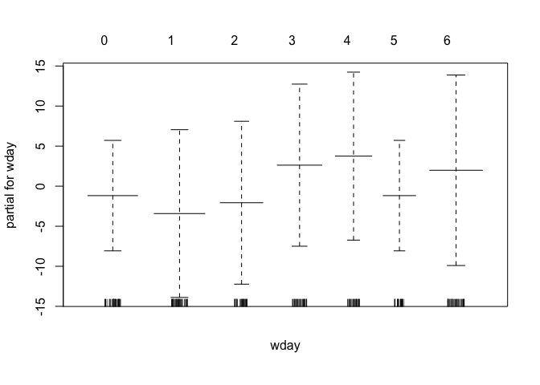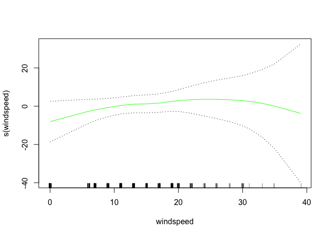

    ## [1] "count~weather+typeofday+wday+hour+atemp+humidity+windspeed"
    ##             %IncMSE IncNodePurity
    ## weather    5.430482      18551.02
    ## typeofday 18.947106      27888.50
    ## wday       9.966655      48741.11
    ## hour      48.363670     395528.26
    ## atemp     11.698849      60899.59
    ## humidity  15.003041      70471.26
    ## windspeed  9.230217      42509.09

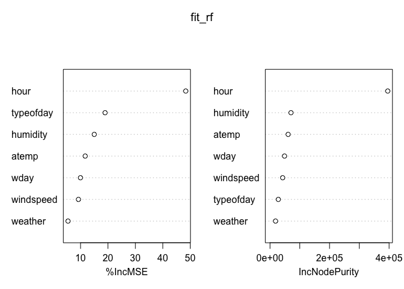

    ## dataset= 111.0 model=rf trainerror= 169.0977 testerror= 510.1114

    ##                 var   rel.inf
    ## hour           hour 73.538492
    ## wday           wday  9.608354
    ## typeofday typeofday  7.023901
    ## atemp         atemp  3.578125
    ## humidity   humidity  3.451985
    ## windspeed windspeed  1.764453
    ## weather     weather  1.034690
    ## dataset= 111.0 model=boost trainerror= 0.03246349 testerror= 257.1362[1] 431  16
    ## [1] "111.0"
    ##      dataset model      trainerror testerror
    ## [1,] "111.0" "lm"       757.8373   691.606  
    ## [2,] "111.0" "gam_lm"   757.8373   691.606  
    ## [3,] "111.0" "gam_poly" 743.8407   746.5166 
    ## [4,] "111.0" "gam_s"    727.6329   731.8908 
    ## [5,] "111.0" "rf"       169.0977   510.1114 
    ## [6,] "111.0" "boost"    0.03246349 257.1362 
    ## [1] "model with lowest test error"
    ##   dataset model trainerror testerror
    ## 6   111.0 boost 0.03246349  257.1362

    ## Warning in createDataPartition(dataset$partgroup, p = 0.7, list = F): Some
    ## classes have a single record ( Clear_Holiday_0 ) and these will be selected
    ## for the sample

    ## [1] "weather+typeofday+wday+hour+monf"
    ## [1] "count~weather+typeofday+wday+hour+monf+atemp+humidity+windspeed"

    ## Warning in predict.lm(fit_lm, newdata = trainset): prediction from a rank-
    ## deficient fit may be misleading

    ## Warning in predict.lm(fit_lm, newdata = testset): prediction from a rank-
    ## deficient fit may be misleading


    ## dataset= 111.1 model=lm trainerror= 1030.045 testerror= 849.1654

    ## [1] "count~weather+typeofday+wday+hour+monf+atemp+humidity+windspeed"
    ## 
    ## Call: gam(formula = as.formula(formula_string), data = trainset)
    ## Deviance Residuals:
    ##       Min        1Q    Median        3Q       Max 
    ## -130.4255  -17.3748   -0.1089   17.0816  107.7377 
    ## 
    ## (Dispersion Parameter for gaussian family taken to be 1095.304)
    ## 
    ##     Null Deviance: 2083979 on 620 degrees of freedom
    ## Residual Deviance: 639657.7 on 584 degrees of freedom
    ## AIC: 6146.421 
    ## 
    ## Number of Local Scoring Iterations: 2 
    ## 
    ## Anova for Parametric Effects
    ##            Df  Sum Sq Mean Sq F value    Pr(>F)    
    ## weather     2   56426   28213 25.7582 1.903e-11 ***
    ## typeofday   2   57581   28791 26.2854 1.173e-11 ***
    ## wday        5   17286    3457  3.1564  0.008042 ** 
    ## hour       23 1173305   51013 46.5745 < 2.2e-16 ***
    ## monf        1   49879   49879 45.5393 3.612e-11 ***
    ## atemp       1   79566   79566 72.6424 < 2.2e-16 ***
    ## humidity    1    9649    9649  8.8099  0.003119 ** 
    ## windspeed   1     629     629  0.5742  0.448906    
    ## Residuals 584  639658    1095                      
    ## ---
    ## Signif. codes:  0 '***' 0.001 '**' 0.01 '*' 0.05 '.' 0.1 ' ' 1

    ## Warning in predict.lm(object, newdata, se.fit, scale = 1, type =
    ## ifelse(type == : prediction from a rank-deficient fit may be misleading

    ## Warning in predict.lm(object, newdata, se.fit, scale = 1, type =
    ## ifelse(type == : prediction from a rank-deficient fit may be misleading


    ## dataset= 111.1 model=gam_lm trainerror= 1030.045 testerror= 849.1654


    ## [1] 621  16
    ## 
    ## Call: gam(formula = as.formula(formula_string_2), data = trainset)
    ## Deviance Residuals:
    ##       Min        1Q    Median        3Q       Max 
    ## -130.6076  -16.1655   -0.8785   17.4355  112.2525 
    ## 
    ## (Dispersion Parameter for gaussian family taken to be 1077.782)
    ## 
    ##     Null Deviance: 2083979 on 620 degrees of freedom
    ## Residual Deviance: 626191 on 581 degrees of freedom
    ## AIC: 6139.207 
    ## 
    ## Number of Local Scoring Iterations: 2 
    ## 
    ## Anova for Parametric Effects
    ##                     Df  Sum Sq Mean Sq F value    Pr(>F)    
    ## weather              2   56426   28213 26.1770 1.303e-11 ***
    ## typeofday            2   57581   28791 26.7128 7.972e-12 ***
    ## wday                 5   17286    3457  3.2077  0.007249 ** 
    ## hour                23 1173305   51013 47.3317 < 2.2e-16 ***
    ## monf                 1   49879   49879 46.2797 2.555e-11 ***
    ## poly(atemp, 2)       2   90472   45236 41.9715 < 2.2e-16 ***
    ## poly(humidity, 2)    2    7976    3988  3.7000  0.025307 *  
    ## poly(windspeed, 2)   2    4863    2431  2.2559  0.105697    
    ## Residuals          581  626191    1078                      
    ## ---
    ## Signif. codes:  0 '***' 0.001 '**' 0.01 '*' 0.05 '.' 0.1 ' ' 1
    ## 
    ## 
    ## Call: gam(formula = as.formula(formula_string_3), data = trainset)
    ## Deviance Residuals:
    ##      Min       1Q   Median       3Q      Max 
    ## -129.173  -16.161   -1.172   17.134  112.006 
    ## 
    ## (Dispersion Parameter for gaussian family taken to be 1081.022)
    ## 
    ##     Null Deviance: 2083979 on 620 degrees of freedom
    ## Residual Deviance: 624830.5 on 578 degrees of freedom
    ## AIC: 6143.856 
    ## 
    ## Number of Local Scoring Iterations: 2 
    ## 
    ## Anova for Parametric Effects
    ##                     Df  Sum Sq Mean Sq F value    Pr(>F)    
    ## weather              2   56426   28213 26.0985 1.408e-11 ***
    ## typeofday            2   57581   28791 26.6327 8.627e-12 ***
    ## wday                 5   17286    3457  3.1981  0.007395 ** 
    ## hour                23 1173305   51013 47.1898 < 2.2e-16 ***
    ## monf                 1   49879   49879 46.1410 2.741e-11 ***
    ## poly(atemp, 3)       3   91213   30404 28.1257 < 2.2e-16 ***
    ## poly(humidity, 3)    3    8929    2976  2.7532  0.041899 *  
    ## poly(windspeed, 3)   3    4529    1510  1.3965  0.242877    
    ## Residuals          578  624830    1081                      
    ## ---
    ## Signif. codes:  0 '***' 0.001 '**' 0.01 '*' 0.05 '.' 0.1 ' ' 1
    ## 
    ## 
    ## Call: gam(formula = as.formula(formula_string_4), data = trainset)
    ## Deviance Residuals:
    ##      Min       1Q   Median       3Q      Max 
    ## -129.283  -16.313   -1.134   16.462  107.937 
    ## 
    ## (Dispersion Parameter for gaussian family taken to be 1083.129)
    ## 
    ##     Null Deviance: 2083979 on 620 degrees of freedom
    ## Residual Deviance: 622799.2 on 575 degrees of freedom
    ## AIC: 6147.834 
    ## 
    ## Number of Local Scoring Iterations: 2 
    ## 
    ## Anova for Parametric Effects
    ##                     Df  Sum Sq Mean Sq F value    Pr(>F)    
    ## weather              2   56426   28213 26.0478 1.483e-11 ***
    ## typeofday            2   57581   28791 26.5809 9.098e-12 ***
    ## wday                 5   17286    3457  3.1919  0.007492 ** 
    ## hour                23 1173305   51013 47.0980 < 2.2e-16 ***
    ## monf                 1   49879   49879 46.0512 2.873e-11 ***
    ## poly(atemp, 4)       4   93496   23374 21.5802 < 2.2e-16 ***
    ## poly(humidity, 4)    4    8650    2163  1.9966  0.093609 .  
    ## poly(windspeed, 4)   4    4556    1139  1.0516  0.379847    
    ## Residuals          575  622799    1083                      
    ## ---
    ## Signif. codes:  0 '***' 0.001 '**' 0.01 '*' 0.05 '.' 0.1 ' ' 1
    ## 
    ## 
    ## Call: gam(formula = as.formula(formula_string_5), data = trainset)
    ## Deviance Residuals:
    ##      Min       1Q   Median       3Q      Max 
    ## -130.027  -16.638   -0.559   15.946  109.907 
    ## 
    ## (Dispersion Parameter for gaussian family taken to be 1086.378)
    ## 
    ##     Null Deviance: 2083979 on 620 degrees of freedom
    ## Residual Deviance: 621408.2 on 572 degrees of freedom
    ## AIC: 6152.446 
    ## 
    ## Number of Local Scoring Iterations: 2 
    ## 
    ## Anova for Parametric Effects
    ##                     Df  Sum Sq Mean Sq F value    Pr(>F)    
    ## weather              2   56426   28213 25.9699 1.601e-11 ***
    ## typeofday            2   57581   28791 26.5014 9.841e-12 ***
    ## wday                 5   17286    3457  3.1824  0.007641 ** 
    ## hour                23 1173305   51013 46.9572 < 2.2e-16 ***
    ## monf                 1   49879   49879 45.9135 3.080e-11 ***
    ## poly(atemp, 5)       5   94852   18970 17.4620 4.141e-16 ***
    ## poly(humidity, 5)    5    8650    1730  1.5925  0.160241    
    ## poly(windspeed, 5)   5    4592     918  0.8453  0.517924    
    ## Residuals          572  621408    1086                      
    ## ---
    ## Signif. codes:  0 '***' 0.001 '**' 0.01 '*' 0.05 '.' 0.1 ' ' 1
    ## 
    ## Analysis of Deviance Table
    ## 
    ## Model 1: count ~ weather + typeofday + wday + hour + monf + poly(atemp, 
    ##     2) + poly(humidity, 2) + poly(windspeed, 2)
    ## Model 2: count ~ weather + typeofday + wday + hour + monf + poly(atemp, 
    ##     3) + poly(humidity, 3) + poly(windspeed, 3)
    ## Model 3: count ~ weather + typeofday + wday + hour + monf + poly(atemp, 
    ##     4) + poly(humidity, 4) + poly(windspeed, 4)
    ## Model 4: count ~ weather + typeofday + wday + hour + monf + poly(atemp, 
    ##     5) + poly(humidity, 5) + poly(windspeed, 5)
    ##   Resid. Df Resid. Dev Df Deviance Pr(>Chi)
    ## 1       581     626191                     
    ## 2       578     624830  3   1360.6   0.7405
    ## 3       575     622799  3   2031.3   0.5999
    ## 4       572     621408  3   1391.0   0.7338

    ## Warning in predict.lm(object, newdata, se.fit, scale = 1, type =
    ## ifelse(type == : prediction from a rank-deficient fit may be misleading

    ## Warning in predict.lm(object, newdata, se.fit, scale = 1, type =
    ## ifelse(type == : prediction from a rank-deficient fit may be misleading

    ## dataset= 111.1 model=gam_poly trainerror= 1006.168 testerror= 851.5704[1] "count~weather+typeofday+wday+hour+monf+s(atemp)+s(humidity)+s(windspeed)"

    ## Warning in predict.lm(object, newdata, se.fit, scale = 1, type =
    ## ifelse(type == : prediction from a rank-deficient fit may be misleading

    ## Warning in predict.lm(object, newdata, se.fit, scale = 1, type =
    ## ifelse(type == : prediction from a rank-deficient fit may be misleading


    ## dataset= 111.1 model=gam_s trainerror= 995.109 testerror= 850.2752
    ## Call: gam(formula = as.formula(formula_string), data = trainset)
    ## Deviance Residuals:
    ##      Min       1Q   Median       3Q      Max 
    ## -130.219  -15.925   -1.276   16.897  108.638 
    ## 
    ## (Dispersion Parameter for gaussian family taken to be 1074.719)
    ## 
    ##     Null Deviance: 2083979 on 620 degrees of freedom
    ## Residual Deviance: 617963 on 574.9998 degrees of freedom
    ## AIC: 6142.994 
    ## 
    ## Number of Local Scoring Iterations: 2 
    ## 
    ## Anova for Parametric Effects
    ##               Df  Sum Sq Mean Sq F value    Pr(>F)    
    ## weather        2   49518   24759 23.0378 2.374e-10 ***
    ## typeofday      2   50476   25238 23.4832 1.572e-10 ***
    ## wday           5   15532    3106  2.8905  0.013751 *  
    ## hour          23 1178040   51219 47.6582 < 2.2e-16 ***
    ## monf           1   54808   54808 50.9972 2.807e-12 ***
    ## s(atemp)       1   84412   84412 78.5434 < 2.2e-16 ***
    ## s(humidity)    1    7561    7561  7.0357  0.008211 ** 
    ## s(windspeed)   1    2600    2600  2.4192  0.120404    
    ## Residuals    575  617963    1075                      
    ## ---
    ## Signif. codes:  0 '***' 0.001 '**' 0.01 '*' 0.05 '.' 0.1 ' ' 1
    ## 
    ## Anova for Nonparametric Effects
    ##              Npar Df Npar F   Pr(F)   
    ## (Intercept)                           
    ## weather                               
    ## typeofday                             
    ## wday                                  
    ## hour                                  
    ## monf                                  
    ## s(atemp)           3 4.8120 0.00256 **
    ## s(humidity)        3 0.9890 0.39755   
    ## s(windspeed)       3 1.1965 0.31035   
    ## ---
    ## Signif. codes:  0 '***' 0.001 '**' 0.01 '*' 0.05 '.' 0.1 ' ' 1


    ## [1] "count~weather+typeofday+wday+hour+monf+atemp+humidity+windspeed"
    ##             %IncMSE IncNodePurity
    ## weather    9.286607      39534.39
    ## typeofday 24.917472      63868.80
    ## wday      19.864357     131844.52
    ## hour      62.400211    1061924.48
    ## monf       9.379097      44132.32
    ## atemp     25.781650     244105.38
    ## humidity  20.622602     214147.34
    ## windspeed 10.458658     109804.54


    ## dataset= 111.1 model=rf trainerror= 209.6725 testerror= 624.4406

    ##                 var    rel.inf
    ## hour           hour 63.1149292
    ## atemp         atemp 10.9396248
    ## typeofday typeofday  9.5377104
    ## wday           wday  7.0610156
    ## humidity   humidity  4.9654044
    ## windspeed windspeed  1.9618918
    ## monf           monf  1.6005181
    ## weather     weather  0.8189058
    ## dataset= 111.1 model=boost trainerror= 0.5988702 testerror= 306.663[1] 877  16
    ## [1] "111.1"
    ##      dataset model      trainerror testerror
    ## [1,] "111.1" "lm"       1030.045   849.1654 
    ## [2,] "111.1" "gam_lm"   1030.045   849.1654 
    ## [3,] "111.1" "gam_poly" 1006.168   851.5704 
    ## [4,] "111.1" "gam_s"    995.109    850.2752 
    ## [5,] "111.1" "rf"       209.6725   624.4406 
    ## [6,] "111.1" "boost"    0.5988702  306.663  
    ## [1] "model with lowest test error"
    ##   dataset model trainerror testerror
    ## 6   111.1 boost  0.5988702   306.663

    ## Warning in createDataPartition(dataset$partgroup, p = 0.7, list = F): Some
    ## classes have a single record ( Clear_Holiday_0 ) and these will be selected
    ## for the sample

    ## [1] "weather+typeofday+wday+hour+monf"
    ## [1] "count~weather+typeofday+wday+hour+monf+atemp+humidity+windspeed"

    ## Warning in predict.lm(fit_lm, newdata = trainset): prediction from a rank-
    ## deficient fit may be misleading

    ## Warning in predict.lm(fit_lm, newdata = testset): prediction from a rank-
    ## deficient fit may be misleading


    ## dataset= 111.2 model=lm trainerror= 1278.588 testerror= 1610.644

    ## [1] "count~weather+typeofday+wday+hour+monf+atemp+humidity+windspeed"
    ## 
    ## Call: gam(formula = as.formula(formula_string), data = trainset)
    ## Deviance Residuals:
    ##      Min       1Q   Median       3Q      Max 
    ## -156.490  -19.076   -2.444   18.222  198.802 
    ## 
    ## (Dispersion Parameter for gaussian family taken to be 1332.693)
    ## 
    ##     Null Deviance: 3895960 on 935 degrees of freedom
    ## Residual Deviance: 1196759 on 898 degrees of freedom
    ## AIC: 9429.94 
    ## 
    ## Number of Local Scoring Iterations: 2 
    ## 
    ## Anova for Parametric Effects
    ##            Df  Sum Sq Mean Sq F value    Pr(>F)    
    ## weather     2  183328   91664 68.7810 < 2.2e-16 ***
    ## typeofday   2   27338   13669 10.2569 3.941e-05 ***
    ## wday        5   43457    8691  6.5217 5.719e-06 ***
    ## hour       23 2182855   94907 71.2142 < 2.2e-16 ***
    ## monf        2  144423   72212 54.1847 < 2.2e-16 ***
    ## atemp       1  117779  117779 88.3765 < 2.2e-16 ***
    ## humidity    1      14      14  0.0106    0.9179    
    ## windspeed   1       7       7  0.0051    0.9433    
    ## Residuals 898 1196759    1333                      
    ## ---
    ## Signif. codes:  0 '***' 0.001 '**' 0.01 '*' 0.05 '.' 0.1 ' ' 1

    ## Warning in predict.lm(object, newdata, se.fit, scale = 1, type =
    ## ifelse(type == : prediction from a rank-deficient fit may be misleading

    ## Warning in predict.lm(object, newdata, se.fit, scale = 1, type =
    ## ifelse(type == : prediction from a rank-deficient fit may be misleading


    ## dataset= 111.2 model=gam_lm trainerror= 1278.588 testerror= 1610.644


    ## [1] 936  16
    ## 
    ## Call: gam(formula = as.formula(formula_string_2), data = trainset)
    ## Deviance Residuals:
    ##      Min       1Q   Median       3Q      Max 
    ## -140.308  -17.563   -1.385   18.157  190.913 
    ## 
    ## (Dispersion Parameter for gaussian family taken to be 1227.836)
    ## 
    ##     Null Deviance: 3895960 on 935 degrees of freedom
    ## Residual Deviance: 1098913 on 895 degrees of freedom
    ## AIC: 9356.103 
    ## 
    ## Number of Local Scoring Iterations: 2 
    ## 
    ## Anova for Parametric Effects
    ##                     Df  Sum Sq Mean Sq F value    Pr(>F)    
    ## weather              2  183328   91664 74.6549 < 2.2e-16 ***
    ## typeofday            2   27338   13669 11.1328 1.676e-05 ***
    ## wday                 5   43457    8691  7.0787 1.673e-06 ***
    ## hour                23 2182855   94907 77.2960 < 2.2e-16 ***
    ## monf                 2  144423   72212 58.8121 < 2.2e-16 ***
    ## poly(atemp, 2)       2  154001   77000 62.7123 < 2.2e-16 ***
    ## poly(humidity, 2)    2   60228   30114 24.5261 4.267e-11 ***
    ## poly(windspeed, 2)   2    1417     708  0.5770    0.5618    
    ## Residuals          895 1098913    1228                      
    ## ---
    ## Signif. codes:  0 '***' 0.001 '**' 0.01 '*' 0.05 '.' 0.1 ' ' 1
    ## 
    ## 
    ## Call: gam(formula = as.formula(formula_string_3), data = trainset)
    ## Deviance Residuals:
    ##       Min        1Q    Median        3Q       Max 
    ## -138.1646  -17.4412   -0.9325   18.1406  188.7537 
    ## 
    ## (Dispersion Parameter for gaussian family taken to be 1222.506)
    ## 
    ##     Null Deviance: 3895960 on 935 degrees of freedom
    ## Residual Deviance: 1090476 on 892 degrees of freedom
    ## AIC: 9354.889 
    ## 
    ## Number of Local Scoring Iterations: 2 
    ## 
    ## Anova for Parametric Effects
    ##                     Df  Sum Sq Mean Sq F value    Pr(>F)    
    ## weather              2  183328   91664 74.9803 < 2.2e-16 ***
    ## typeofday            2   27338   13669 11.1813 1.599e-05 ***
    ## wday                 5   43457    8691  7.1095 1.564e-06 ***
    ## hour                23 2182855   94907 77.6329 < 2.2e-16 ***
    ## monf                 2  144423   72212 59.0685 < 2.2e-16 ***
    ## poly(atemp, 3)       3  154037   51346 42.0003 < 2.2e-16 ***
    ## poly(humidity, 3)    3   66740   22247 18.1977 1.818e-11 ***
    ## poly(windspeed, 3)   3    3306    1102  0.9013      0.44    
    ## Residuals          892 1090476    1223                      
    ## ---
    ## Signif. codes:  0 '***' 0.001 '**' 0.01 '*' 0.05 '.' 0.1 ' ' 1
    ## 
    ## 
    ## Call: gam(formula = as.formula(formula_string_4), data = trainset)
    ## Deviance Residuals:
    ##      Min       1Q   Median       3Q      Max 
    ## -138.533  -17.916   -1.045   18.166  187.450 
    ## 
    ## (Dispersion Parameter for gaussian family taken to be 1220.158)
    ## 
    ##     Null Deviance: 3895960 on 935 degrees of freedom
    ## Residual Deviance: 1084721 on 889 degrees of freedom
    ## AIC: 9355.937 
    ## 
    ## Number of Local Scoring Iterations: 2 
    ## 
    ## Anova for Parametric Effects
    ##                     Df  Sum Sq Mean Sq F value    Pr(>F)    
    ## weather              2  183328   91664 75.1246 < 2.2e-16 ***
    ## typeofday            2   27338   13669 11.2028 1.567e-05 ***
    ## wday                 5   43457    8691  7.1232 1.519e-06 ***
    ## hour                23 2182855   94907 77.7823 < 2.2e-16 ***
    ## monf                 2  144423   72212 59.1822 < 2.2e-16 ***
    ## poly(atemp, 4)       4  154761   38690 31.7092 < 2.2e-16 ***
    ## poly(humidity, 4)    4   70993   17748 14.5459 1.636e-11 ***
    ## poly(windspeed, 4)   4    4084    1021  0.8367    0.5019    
    ## Residuals          889 1084721    1220                      
    ## ---
    ## Signif. codes:  0 '***' 0.001 '**' 0.01 '*' 0.05 '.' 0.1 ' ' 1
    ## 
    ## 
    ## Call: gam(formula = as.formula(formula_string_5), data = trainset)
    ## Deviance Residuals:
    ##      Min       1Q   Median       3Q      Max 
    ## -139.838  -18.138   -1.178   17.719  179.897 
    ## 
    ## (Dispersion Parameter for gaussian family taken to be 1208.692)
    ## 
    ##     Null Deviance: 3895960 on 935 degrees of freedom
    ## Residual Deviance: 1070901 on 886 degrees of freedom
    ## AIC: 9349.935 
    ## 
    ## Number of Local Scoring Iterations: 2 
    ## 
    ## Anova for Parametric Effects
    ##                     Df  Sum Sq Mean Sq F value    Pr(>F)    
    ## weather              2  183328   91664 75.8373 < 2.2e-16 ***
    ## typeofday            2   27338   13669 11.3091 1.413e-05 ***
    ## wday                 5   43457    8691  7.1908 1.309e-06 ***
    ## hour                23 2182855   94907 78.5202 < 2.2e-16 ***
    ## monf                 2  144423   72212 59.7436 < 2.2e-16 ***
    ## poly(atemp, 5)       5  159820   31964 26.4452 < 2.2e-16 ***
    ## poly(humidity, 5)    5   80171   16034 13.2657 1.747e-12 ***
    ## poly(windspeed, 5)   5    3666     733  0.6066    0.6949    
    ## Residuals          886 1070901    1209                      
    ## ---
    ## Signif. codes:  0 '***' 0.001 '**' 0.01 '*' 0.05 '.' 0.1 ' ' 1
    ## 
    ## Analysis of Deviance Table
    ## 
    ## Model 1: count ~ weather + typeofday + wday + hour + monf + poly(atemp, 
    ##     2) + poly(humidity, 2) + poly(windspeed, 2)
    ## Model 2: count ~ weather + typeofday + wday + hour + monf + poly(atemp, 
    ##     3) + poly(humidity, 3) + poly(windspeed, 3)
    ## Model 3: count ~ weather + typeofday + wday + hour + monf + poly(atemp, 
    ##     4) + poly(humidity, 4) + poly(windspeed, 4)
    ## Model 4: count ~ weather + typeofday + wday + hour + monf + poly(atemp, 
    ##     5) + poly(humidity, 5) + poly(windspeed, 5)
    ##   Resid. Df Resid. Dev Df Deviance Pr(>Chi)   
    ## 1       895    1098913                        
    ## 2       892    1090476  3   8437.3 0.072523 . 
    ## 3       889    1084721  3   5754.9 0.190139   
    ## 4       886    1070901  3  13819.5 0.009599 **
    ## ---
    ## Signif. codes:  0 '***' 0.001 '**' 0.01 '*' 0.05 '.' 0.1 ' ' 1

    ## Warning in predict.lm(object, newdata, se.fit, scale = 1, type =
    ## ifelse(type == : prediction from a rank-deficient fit may be misleading

    ## Warning in predict.lm(object, newdata, se.fit, scale = 1, type =
    ## ifelse(type == : prediction from a rank-deficient fit may be misleading

    ## dataset= 111.2 model=gam_poly trainerror= 1165.038 testerror= 1567.203[1] "count~weather+typeofday+wday+hour+monf+s(atemp)+s(humidity)+s(windspeed)"

    ## Warning in predict.lm(object, newdata, se.fit, scale = 1, type =
    ## ifelse(type == : prediction from a rank-deficient fit may be misleading

    ## Warning in predict.lm(object, newdata, se.fit, scale = 1, type =
    ## ifelse(type == : prediction from a rank-deficient fit may be misleading


    ## dataset= 111.2 model=gam_s trainerror= 1147.528 testerror= 1532.547
    ## Call: gam(formula = as.formula(formula_string), data = trainset)
    ## Deviance Residuals:
    ##       Min        1Q    Median        3Q       Max 
    ## -139.8585  -17.3358   -0.9985   18.1860  184.9562 
    ## 
    ## (Dispersion Parameter for gaussian family taken to be 1208.195)
    ## 
    ##     Null Deviance: 3895960 on 935 degrees of freedom
    ## Residual Deviance: 1074085 on 888.9999 degrees of freedom
    ## AIC: 9346.714 
    ## 
    ## Number of Local Scoring Iterations: 2 
    ## 
    ## Anova for Parametric Effects
    ##               Df  Sum Sq Mean Sq  F value    Pr(>F)    
    ## weather        2   49916   24958  20.6572 1.702e-09 ***
    ## typeofday      2   33855   16928  14.0107 1.021e-06 ***
    ## wday           5   38595    7719   6.3889 7.679e-06 ***
    ## hour          23 2226105   96787  80.1089 < 2.2e-16 ***
    ## monf           2  211766  105883  87.6372 < 2.2e-16 ***
    ## s(atemp)       1  137960  137960 114.1873 < 2.2e-16 ***
    ## s(humidity)    1    1621    1621   1.3414    0.2471    
    ## s(windspeed)   1    2041    2041   1.6892    0.1940    
    ## Residuals    889 1074085    1208                       
    ## ---
    ## Signif. codes:  0 '***' 0.001 '**' 0.01 '*' 0.05 '.' 0.1 ' ' 1
    ## 
    ## Anova for Nonparametric Effects
    ##              Npar Df  Npar F     Pr(F)    
    ## (Intercept)                               
    ## weather                                   
    ## typeofday                                 
    ## wday                                      
    ## hour                                      
    ## monf                                      
    ## s(atemp)           3 10.5719 7.790e-07 ***
    ## s(humidity)        3 19.4233 3.328e-12 ***
    ## s(windspeed)       3  0.9552    0.4133    
    ## ---
    ## Signif. codes:  0 '***' 0.001 '**' 0.01 '*' 0.05 '.' 0.1 ' ' 1


    ## [1] "count~weather+typeofday+wday+hour+monf+atemp+humidity+windspeed"
    ##            %IncMSE IncNodePurity
    ## weather   24.53553     124000.36
    ## typeofday 24.33297      98277.09
    ## wday      24.62083     228683.83
    ## hour      70.53766    1935557.39
    ## monf      22.39747     137471.45
    ## atemp     35.89200     556520.28
    ## humidity  26.56188     362396.28
    ## windspeed 12.96197     202285.44


    ## dataset= 111.2 model=rf trainerror= 207.9446 testerror= 1034.716

    ##                 var   rel.inf
    ## hour           hour 59.740902
    ## atemp         atemp 12.914703
    ## wday           wday  6.737155
    ## typeofday typeofday  6.625558
    ## humidity   humidity  5.932296
    ## monf           monf  3.220450
    ## weather     weather  2.712263
    ## windspeed windspeed  2.116674
    ## dataset= 111.2 model=boost trainerror= 2.29308 testerror= 493.8521[1] 1323   16
    ## [1] "111.2"
    ##      dataset model      trainerror testerror
    ## [1,] "111.2" "lm"       1278.588   1610.644 
    ## [2,] "111.2" "gam_lm"   1278.588   1610.644 
    ## [3,] "111.2" "gam_poly" 1165.038   1567.203 
    ## [4,] "111.2" "gam_s"    1147.528   1532.547 
    ## [5,] "111.2" "rf"       207.9446   1034.716 
    ## [6,] "111.2" "boost"    2.29308    493.8521 
    ## [1] "model with lowest test error"
    ##   dataset model trainerror testerror
    ## 6   111.2 boost    2.29308  493.8521

    ## Warning in createDataPartition(dataset$partgroup, p = 0.7, list = F): Some
    ## classes have a single record ( Clear_Holiday_0 ) and these will be selected
    ## for the sample

    ## [1] "weather+typeofday+wday+hour+monf"
    ## [1] "count~weather+typeofday+wday+hour+monf+atemp+humidity+windspeed"

    ## Warning in predict.lm(fit_lm, newdata = trainset): prediction from a rank-
    ## deficient fit may be misleading

    ## Warning in predict.lm(fit_lm, newdata = testset): prediction from a rank-
    ## deficient fit may be misleading


    ## dataset= 111.3 model=lm trainerror= 2049.313 testerror= 2084.34

    ## [1] "count~weather+typeofday+wday+hour+monf+atemp+humidity+windspeed"
    ## 
    ## Call: gam(formula = as.formula(formula_string), data = trainset)
    ## Deviance Residuals:
    ##       Min        1Q    Median        3Q       Max 
    ## -172.6255  -25.0868   -0.4905   21.2847  226.2325 
    ## 
    ## (Dispersion Parameter for gaussian family taken to be 2114.878)
    ## 
    ##     Null Deviance: 7764046 on 1257 degrees of freedom
    ## Residual Deviance: 2578036 on 1219 degrees of freedom
    ## AIC: 13242.63 
    ## 
    ## Number of Local Scoring Iterations: 2 
    ## 
    ## Anova for Parametric Effects
    ##             Df  Sum Sq Mean Sq  F value  Pr(>F)    
    ## weather      2  208712  104356  49.3437 < 2e-16 ***
    ## typeofday    2   14828    7414   3.5056 0.03033 *  
    ## wday         5   28235    5647   2.6701 0.02077 *  
    ## hour        23 4037641  175550  83.0070 < 2e-16 ***
    ## monf         3  695117  231706 109.5598 < 2e-16 ***
    ## atemp        1  185288  185288  87.6118 < 2e-16 ***
    ## humidity     1   13724   13724   6.4892 0.01098 *  
    ## windspeed    1    2465    2465   1.1658 0.28049    
    ## Residuals 1219 2578036    2115                     
    ## ---
    ## Signif. codes:  0 '***' 0.001 '**' 0.01 '*' 0.05 '.' 0.1 ' ' 1

    ## Warning in predict.lm(object, newdata, se.fit, scale = 1, type =
    ## ifelse(type == : prediction from a rank-deficient fit may be misleading

    ## Warning in predict.lm(object, newdata, se.fit, scale = 1, type =
    ## ifelse(type == : prediction from a rank-deficient fit may be misleading


    ## dataset= 111.3 model=gam_lm trainerror= 2049.313 testerror= 2084.34

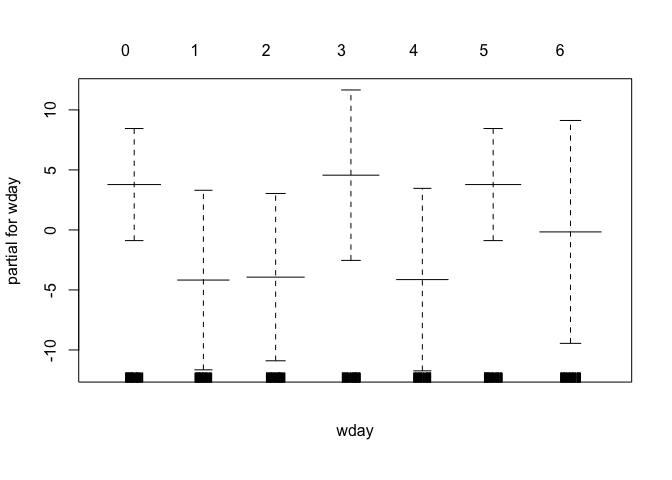

    ## [1] 1258   16
    ## 
    ## Call: gam(formula = as.formula(formula_string_2), data = trainset)
    ## Deviance Residuals:
    ##     Min      1Q  Median      3Q     Max 
    ## -188.78  -22.45   -1.50   19.51  222.20 
    ## 
    ## (Dispersion Parameter for gaussian family taken to be 2008.318)
    ## 
    ##     Null Deviance: 7764046 on 1257 degrees of freedom
    ## Residual Deviance: 2442115 on 1216 degrees of freedom
    ## AIC: 13180.49 
    ## 
    ## Number of Local Scoring Iterations: 2 
    ## 
    ## Anova for Parametric Effects
    ##                      Df  Sum Sq Mean Sq  F value    Pr(>F)    
    ## weather               2  208712  104356  51.9618 < 2.2e-16 ***
    ## typeofday             2   14828    7414   3.6916   0.02521 *  
    ## wday                  5   28235    5647   2.8118   0.01564 *  
    ## hour                 23 4037641  175550  87.4112 < 2.2e-16 ***
    ## monf                  3  695117  231706 115.3729 < 2.2e-16 ***
    ## poly(atemp, 2)        2  261164  130582  65.0205 < 2.2e-16 ***
    ## poly(humidity, 2)     2   62039   31020  15.4456 2.376e-07 ***
    ## poly(windspeed, 2)    2   14196    7098   3.5343   0.02948 *  
    ## Residuals          1216 2442115    2008                       
    ## ---
    ## Signif. codes:  0 '***' 0.001 '**' 0.01 '*' 0.05 '.' 0.1 ' ' 1
    ## 
    ## 
    ## Call: gam(formula = as.formula(formula_string_3), data = trainset)
    ## Deviance Residuals:
    ##      Min       1Q   Median       3Q      Max 
    ## -190.229  -22.587   -1.377   19.370  220.556 
    ## 
    ## (Dispersion Parameter for gaussian family taken to be 2007.457)
    ## 
    ##     Null Deviance: 7764046 on 1257 degrees of freedom
    ## Residual Deviance: 2435045 on 1213 degrees of freedom
    ## AIC: 13182.84 
    ## 
    ## Number of Local Scoring Iterations: 2 
    ## 
    ## Anova for Parametric Effects
    ##                      Df  Sum Sq Mean Sq  F value    Pr(>F)    
    ## weather               2  208712  104356  51.9841 < 2.2e-16 ***
    ## typeofday             2   14828    7414   3.6932   0.02517 *  
    ## wday                  5   28235    5647   2.8130   0.01560 *  
    ## hour                 23 4037641  175550  87.4488 < 2.2e-16 ***
    ## monf                  3  695117  231706 115.4224 < 2.2e-16 ***
    ## poly(atemp, 3)        3  263664   87888  43.7808 < 2.2e-16 ***
    ## poly(humidity, 3)     3   63280   21093  10.5076  7.97e-07 ***
    ## poly(windspeed, 3)    3   17524    5841   2.9099   0.03353 *  
    ## Residuals          1213 2435045    2007                       
    ## ---
    ## Signif. codes:  0 '***' 0.001 '**' 0.01 '*' 0.05 '.' 0.1 ' ' 1
    ## 
    ## 
    ## Call: gam(formula = as.formula(formula_string_4), data = trainset)
    ## Deviance Residuals:
    ##      Min       1Q   Median       3Q      Max 
    ## -195.421  -22.790   -1.841   20.176  215.660 
    ## 
    ## (Dispersion Parameter for gaussian family taken to be 1995.218)
    ## 
    ##     Null Deviance: 7764046 on 1257 degrees of freedom
    ## Residual Deviance: 2414214 on 1210 degrees of freedom
    ## AIC: 13178.03 
    ## 
    ## Number of Local Scoring Iterations: 2 
    ## 
    ## Anova for Parametric Effects
    ##                      Df  Sum Sq Mean Sq  F value    Pr(>F)    
    ## weather               2  208712  104356  52.3030 < 2.2e-16 ***
    ## typeofday             2   14828    7414   3.7159   0.02461 *  
    ## wday                  5   28235    5647   2.8302   0.01507 *  
    ## hour                 23 4037641  175550  87.9852 < 2.2e-16 ***
    ## monf                  3  695117  231706 116.1304 < 2.2e-16 ***
    ## poly(atemp, 4)        4  273222   68306  34.2346 < 2.2e-16 ***
    ## poly(humidity, 4)     4   75310   18828   9.4363 1.639e-07 ***
    ## poly(windspeed, 4)    4   16767    4192   2.1009   0.07856 .  
    ## Residuals          1210 2414214    1995                       
    ## ---
    ## Signif. codes:  0 '***' 0.001 '**' 0.01 '*' 0.05 '.' 0.1 ' ' 1
    ## 
    ## 
    ## Call: gam(formula = as.formula(formula_string_5), data = trainset)
    ## Deviance Residuals:
    ##      Min       1Q   Median       3Q      Max 
    ## -190.539  -22.558   -1.574   20.873  219.411 
    ## 
    ## (Dispersion Parameter for gaussian family taken to be 1995.262)
    ## 
    ##     Null Deviance: 7764046 on 1257 degrees of freedom
    ## Residual Deviance: 2408282 on 1207 degrees of freedom
    ## AIC: 13180.94 
    ## 
    ## Number of Local Scoring Iterations: 2 
    ## 
    ## Anova for Parametric Effects
    ##                      Df  Sum Sq Mean Sq  F value    Pr(>F)    
    ## weather               2  208712  104356  52.3018 < 2.2e-16 ***
    ## typeofday             2   14828    7414   3.7158   0.02461 *  
    ## wday                  5   28235    5647   2.8302   0.01507 *  
    ## hour                 23 4037641  175550  87.9832 < 2.2e-16 ***
    ## monf                  3  695117  231706 116.1279 < 2.2e-16 ***
    ## poly(atemp, 5)        5  273228   54646  27.3876 < 2.2e-16 ***
    ## poly(humidity, 5)     5   76163   15233   7.6344 4.483e-07 ***
    ## poly(windspeed, 5)    5   21842    4368   2.1893   0.05318 .  
    ## Residuals          1207 2408282    1995                       
    ## ---
    ## Signif. codes:  0 '***' 0.001 '**' 0.01 '*' 0.05 '.' 0.1 ' ' 1
    ## 
    ## Analysis of Deviance Table
    ## 
    ## Model 1: count ~ weather + typeofday + wday + hour + monf + poly(atemp, 
    ##     2) + poly(humidity, 2) + poly(windspeed, 2)
    ## Model 2: count ~ weather + typeofday + wday + hour + monf + poly(atemp, 
    ##     3) + poly(humidity, 3) + poly(windspeed, 3)
    ## Model 3: count ~ weather + typeofday + wday + hour + monf + poly(atemp, 
    ##     4) + poly(humidity, 4) + poly(windspeed, 4)
    ## Model 4: count ~ weather + typeofday + wday + hour + monf + poly(atemp, 
    ##     5) + poly(humidity, 5) + poly(windspeed, 5)
    ##   Resid. Df Resid. Dev Df Deviance Pr(>Chi)  
    ## 1      1216    2442115                       
    ## 2      1213    2435045  3   7070.3  0.31516  
    ## 3      1210    2414214  3  20830.6  0.01517 *
    ## 4      1207    2408282  3   5932.6  0.39575  
    ## ---
    ## Signif. codes:  0 '***' 0.001 '**' 0.01 '*' 0.05 '.' 0.1 ' ' 1

    ## Warning in predict.lm(object, newdata, se.fit, scale = 1, type =
    ## ifelse(type == : prediction from a rank-deficient fit may be misleading

    ## Warning in predict.lm(object, newdata, se.fit, scale = 1, type =
    ## ifelse(type == : prediction from a rank-deficient fit may be misleading

    ## dataset= 111.3 model=gam_poly trainerror= 1935.648 testerror= 1982.96[1] "count~weather+typeofday+wday+hour+monf+s(atemp)+s(humidity)+s(windspeed)"

    ## Warning in predict.lm(object, newdata, se.fit, scale = 1, type =
    ## ifelse(type == : prediction from a rank-deficient fit may be misleading

    ## Warning in predict.lm(object, newdata, se.fit, scale = 1, type =
    ## ifelse(type == : prediction from a rank-deficient fit may be misleading


    ## dataset= 111.3 model=gam_s trainerror= 1902.629 testerror= 1940.035
    ## Call: gam(formula = as.formula(formula_string), data = trainset)
    ## Deviance Residuals:
    ##      Min       1Q   Median       3Q      Max 
    ## -191.169  -22.587   -1.583   19.991  214.915 
    ## 
    ## (Dispersion Parameter for gaussian family taken to be 1978.096)
    ## 
    ##     Null Deviance: 7764046 on 1257 degrees of freedom
    ## Residual Deviance: 2393497 on 1210 degrees of freedom
    ## AIC: 13167.19 
    ## 
    ## Number of Local Scoring Iterations: 2 
    ## 
    ## Anova for Parametric Effects
    ##                Df  Sum Sq Mean Sq  F value    Pr(>F)    
    ## weather         2   81756   40878  20.6653 1.496e-09 ***
    ## typeofday       2    4911    2456   1.2414  0.289339    
    ## wday            5   35163    7033   3.5553  0.003391 ** 
    ## hour           23 4047187  175965  88.9566 < 2.2e-16 ***
    ## monf            3  784478  261493 132.1942 < 2.2e-16 ***
    ## s(atemp)        1  178098  178098  90.0349 < 2.2e-16 ***
    ## s(humidity)     1   12817   12817   6.4797  0.011035 *  
    ## s(windspeed)    1   12416   12416   6.2766  0.012365 *  
    ## Residuals    1210 2393497    1978                       
    ## ---
    ## Signif. codes:  0 '***' 0.001 '**' 0.01 '*' 0.05 '.' 0.1 ' ' 1
    ## 
    ## Anova for Nonparametric Effects
    ##              Npar Df  Npar F     Pr(F)    
    ## (Intercept)                               
    ## weather                                   
    ## typeofday                                 
    ## wday                                      
    ## hour                                      
    ## monf                                      
    ## s(atemp)           3 15.5680 6.129e-10 ***
    ## s(humidity)        3 11.1665 3.132e-07 ***
    ## s(windspeed)       3  2.1156   0.09649 .  
    ## ---
    ## Signif. codes:  0 '***' 0.001 '**' 0.01 '*' 0.05 '.' 0.1 ' ' 1


    ## [1] "count~weather+typeofday+wday+hour+monf+atemp+humidity+windspeed"
    ##            %IncMSE IncNodePurity
    ## weather   24.83883      212634.4
    ## typeofday 28.93217      187442.8
    ## wday      28.10019      446196.6
    ## hour      73.11784     3547723.3
    ## monf      30.62956      505038.7
    ## atemp     43.83618     1183292.6
    ## humidity  31.68641      781839.1
    ## windspeed 13.84992      387554.0


    ## dataset= 111.3 model=rf trainerror= 335.3653 testerror= 1204.085

    ##                 var   rel.inf
    ## hour           hour 56.086802
    ## atemp         atemp 12.249600
    ## monf           monf  7.336139
    ## wday           wday  6.922861
    ## humidity   humidity  6.064528
    ## typeofday typeofday  5.371233
    ## weather     weather  3.255924
    ## windspeed windspeed  2.712915
    ## dataset= 111.3 model=boost trainerror= 7.096305 testerror= 590.2429[1] 1778   16
    ## [1] "111.3"
    ##      dataset model      trainerror testerror
    ## [1,] "111.3" "lm"       2049.313   2084.34  
    ## [2,] "111.3" "gam_lm"   2049.313   2084.34  
    ## [3,] "111.3" "gam_poly" 1935.648   1982.96  
    ## [4,] "111.3" "gam_s"    1902.629   1940.035 
    ## [5,] "111.3" "rf"       335.3653   1204.085 
    ## [6,] "111.3" "boost"    7.096305   590.2429 
    ## [1] "model with lowest test error"
    ##   dataset model trainerror testerror
    ## 6   111.3 boost   7.096305  590.2429

    ## Warning in createDataPartition(dataset$partgroup, p = 0.7, list = F): Some
    ## classes have a single record ( Clear_Holiday_0 ) and these will be selected
    ## for the sample

    ## [1] "weather+typeofday+wday+hour+monf"
    ## [1] "count~weather+typeofday+wday+hour+monf+atemp+humidity+windspeed"

    ## Warning in predict.lm(fit_lm, newdata = trainset): prediction from a rank-
    ## deficient fit may be misleading

    ## Warning in predict.lm(fit_lm, newdata = testset): prediction from a rank-
    ## deficient fit may be misleading


    ## dataset= 111.4 model=lm trainerror= 3408.844 testerror= 3182.312

    ## [1] "count~weather+typeofday+wday+hour+monf+atemp+humidity+windspeed"
    ## 
    ## Call: gam(formula = as.formula(formula_string), data = trainset)
    ## Deviance Residuals:
    ##      Min       1Q   Median       3Q      Max 
    ## -208.270  -32.777   -1.741   27.174  255.861 
    ## 
    ## (Dispersion Parameter for gaussian family taken to be 3497.328)
    ## 
    ##     Null Deviance: 16952007 on 1580 degrees of freedom
    ## Residual Deviance: 5389382 on 1541 degrees of freedom
    ## AIC: 17428.74 
    ## 
    ## Number of Local Scoring Iterations: 2 
    ## 
    ## Anova for Parametric Effects
    ##             Df  Sum Sq Mean Sq  F value    Pr(>F)    
    ## weather      2  299880  149940  42.8727 < 2.2e-16 ***
    ## typeofday    2   35026   17513   5.0075  0.006797 ** 
    ## wday         5   49043    9809   2.8046  0.015781 *  
    ## hour        23 7822643  340115  97.2499 < 2.2e-16 ***
    ## monf         4 2980674  745169 213.0680 < 2.2e-16 ***
    ## atemp        1  346179  346179  98.9838 < 2.2e-16 ***
    ## humidity     1   22638   22638   6.4728  0.011051 *  
    ## windspeed    1    6542    6542   1.8706  0.171603    
    ## Residuals 1541 5389382    3497                       
    ## ---
    ## Signif. codes:  0 '***' 0.001 '**' 0.01 '*' 0.05 '.' 0.1 ' ' 1

    ## Warning in predict.lm(object, newdata, se.fit, scale = 1, type =
    ## ifelse(type == : prediction from a rank-deficient fit may be misleading

    ## Warning in predict.lm(object, newdata, se.fit, scale = 1, type =
    ## ifelse(type == : prediction from a rank-deficient fit may be misleading


    ## dataset= 111.4 model=gam_lm trainerror= 3408.844 testerror= 3182.312


    ## [1] 1581   16
    ## 
    ## Call: gam(formula = as.formula(formula_string_2), data = trainset)
    ## Deviance Residuals:
    ##      Min       1Q   Median       3Q      Max 
    ## -208.922  -29.873   -1.233   26.429  232.986 
    ## 
    ## (Dispersion Parameter for gaussian family taken to be 3170.974)
    ## 
    ##     Null Deviance: 16952007 on 1580 degrees of freedom
    ## Residual Deviance: 4876957 on 1538 degrees of freedom
    ## AIC: 17276.78 
    ## 
    ## Number of Local Scoring Iterations: 2 
    ## 
    ## Anova for Parametric Effects
    ##                      Df  Sum Sq Mean Sq  F value    Pr(>F)    
    ## weather               2  299880  149940  47.2851 < 2.2e-16 ***
    ## typeofday             2   35026   17513   5.5229  0.004074 ** 
    ## wday                  5   49043    9809   3.0933  0.008769 ** 
    ## hour                 23 7822643  340115 107.2588 < 2.2e-16 ***
    ## monf                  4 2980674  745169 234.9968 < 2.2e-16 ***
    ## poly(atemp, 2)        2  671038  335519 105.8094 < 2.2e-16 ***
    ## poly(humidity, 2)     2  175214   87607  27.6278 1.629e-12 ***
    ## poly(windspeed, 2)    2   41531   20766   6.5487  0.001472 ** 
    ## Residuals          1538 4876957    3171                       
    ## ---
    ## Signif. codes:  0 '***' 0.001 '**' 0.01 '*' 0.05 '.' 0.1 ' ' 1
    ## 
    ## 
    ## Call: gam(formula = as.formula(formula_string_3), data = trainset)
    ## Deviance Residuals:
    ##      Min       1Q   Median       3Q      Max 
    ## -209.162  -29.299   -1.513   26.099  228.527 
    ## 
    ## (Dispersion Parameter for gaussian family taken to be 3167.855)
    ## 
    ##     Null Deviance: 16952007 on 1580 degrees of freedom
    ## Residual Deviance: 4862657 on 1535 degrees of freedom
    ## AIC: 17278.14 
    ## 
    ## Number of Local Scoring Iterations: 2 
    ## 
    ## Anova for Parametric Effects
    ##                      Df  Sum Sq Mean Sq  F value    Pr(>F)    
    ## weather               2  299880  149940  47.3317 < 2.2e-16 ***
    ## typeofday             2   35026   17513   5.5283  0.004052 ** 
    ## wday                  5   49043    9809   3.0963  0.008714 ** 
    ## hour                 23 7822643  340115 107.3644 < 2.2e-16 ***
    ## monf                  4 2980674  745169 235.2282 < 2.2e-16 ***
    ## poly(atemp, 3)        3  691398  230466  72.7515 < 2.2e-16 ***
    ## poly(humidity, 3)     3  173300   57767  18.2352 1.256e-11 ***
    ## poly(windspeed, 3)    3   37386   12462   3.9339  0.008251 ** 
    ## Residuals          1535 4862657    3168                       
    ## ---
    ## Signif. codes:  0 '***' 0.001 '**' 0.01 '*' 0.05 '.' 0.1 ' ' 1
    ## 
    ## 
    ## Call: gam(formula = as.formula(formula_string_4), data = trainset)
    ## Deviance Residuals:
    ##      Min       1Q   Median       3Q      Max 
    ## -207.677  -28.134   -1.751   25.520  233.097 
    ## 
    ## (Dispersion Parameter for gaussian family taken to be 3140.253)
    ## 
    ##     Null Deviance: 16952007 on 1580 degrees of freedom
    ## Residual Deviance: 4810868 on 1532 degrees of freedom
    ## AIC: 17267.21 
    ## 
    ## Number of Local Scoring Iterations: 2 
    ## 
    ## Anova for Parametric Effects
    ##                      Df  Sum Sq Mean Sq  F value    Pr(>F)    
    ## weather               2  299880  149940  47.7477 < 2.2e-16 ***
    ## typeofday             2   35026   17513   5.5769  0.003861 ** 
    ## wday                  5   49043    9809   3.1235  0.008241 ** 
    ## hour                 23 7822643  340115 108.3081 < 2.2e-16 ***
    ## monf                  4 2980674  745169 237.2957 < 2.2e-16 ***
    ## poly(atemp, 4)        4  708741  177185  56.4239 < 2.2e-16 ***
    ## poly(humidity, 4)     4  197449   49362  15.7192 1.298e-12 ***
    ## poly(windspeed, 4)    4   47683   11921   3.7961  0.004459 ** 
    ## Residuals          1532 4810868    3140                       
    ## ---
    ## Signif. codes:  0 '***' 0.001 '**' 0.01 '*' 0.05 '.' 0.1 ' ' 1
    ## 
    ## 
    ## Call: gam(formula = as.formula(formula_string_5), data = trainset)
    ## Deviance Residuals:
    ##      Min       1Q   Median       3Q      Max 
    ## -207.906  -28.274   -1.487   25.477  228.699 
    ## 
    ## (Dispersion Parameter for gaussian family taken to be 3135.96)
    ## 
    ##     Null Deviance: 16952007 on 1580 degrees of freedom
    ## Residual Deviance: 4794883 on 1529 degrees of freedom
    ## AIC: 17267.95 
    ## 
    ## Number of Local Scoring Iterations: 2 
    ## 
    ## Anova for Parametric Effects
    ##                      Df  Sum Sq Mean Sq  F value    Pr(>F)    
    ## weather               2  299880  149940  47.8131 < 2.2e-16 ***
    ## typeofday             2   35026   17513   5.5846  0.003832 ** 
    ## wday                  5   49043    9809   3.1278  0.008169 ** 
    ## hour                 23 7822643  340115 108.4564 < 2.2e-16 ***
    ## monf                  4 2980674  745169 237.6205 < 2.2e-16 ***
    ## poly(atemp, 5)        5  734623  146925  46.8515 < 2.2e-16 ***
    ## poly(humidity, 5)     5  193716   38743  12.3545 9.064e-12 ***
    ## poly(windspeed, 5)    5   41518    8304   2.6479  0.021615 *  
    ## Residuals          1529 4794883    3136                       
    ## ---
    ## Signif. codes:  0 '***' 0.001 '**' 0.01 '*' 0.05 '.' 0.1 ' ' 1
    ## 
    ## Analysis of Deviance Table
    ## 
    ## Model 1: count ~ weather + typeofday + wday + hour + monf + poly(atemp, 
    ##     2) + poly(humidity, 2) + poly(windspeed, 2)
    ## Model 2: count ~ weather + typeofday + wday + hour + monf + poly(atemp, 
    ##     3) + poly(humidity, 3) + poly(windspeed, 3)
    ## Model 3: count ~ weather + typeofday + wday + hour + monf + poly(atemp, 
    ##     4) + poly(humidity, 4) + poly(windspeed, 4)
    ## Model 4: count ~ weather + typeofday + wday + hour + monf + poly(atemp, 
    ##     5) + poly(humidity, 5) + poly(windspeed, 5)
    ##   Resid. Df Resid. Dev Df Deviance  Pr(>Chi)    
    ## 1      1538    4876957                          
    ## 2      1535    4862657  3    14300 0.2069922    
    ## 3      1532    4810868  3    51790 0.0008892 ***
    ## 4      1529    4794883  3    15984 0.1648278    
    ## ---
    ## Signif. codes:  0 '***' 0.001 '**' 0.01 '*' 0.05 '.' 0.1 ' ' 1

    ## Warning in predict.lm(object, newdata, se.fit, scale = 1, type =
    ## ifelse(type == : prediction from a rank-deficient fit may be misleading

    ## Warning in predict.lm(object, newdata, se.fit, scale = 1, type =
    ## ifelse(type == : prediction from a rank-deficient fit may be misleading

    ## dataset= 111.4 model=gam_poly trainerror= 3075.684 testerror= 3072.377[1] "count~weather+typeofday+wday+hour+monf+s(atemp)+s(humidity)+s(windspeed)"

    ## Warning in predict.lm(object, newdata, se.fit, scale = 1, type =
    ## ifelse(type == : prediction from a rank-deficient fit may be misleading

    ## Warning in predict.lm(object, newdata, se.fit, scale = 1, type =
    ## ifelse(type == : prediction from a rank-deficient fit may be misleading


    ## dataset= 111.4 model=gam_s trainerror= 3032.967 testerror= 3029.391
    ## Call: gam(formula = as.formula(formula_string), data = trainset)
    ## Deviance Residuals:
    ##      Min       1Q   Median       3Q      Max 
    ## -209.570  -28.984   -1.738   26.277  229.408 
    ## 
    ## (Dispersion Parameter for gaussian family taken to be 3129.976)
    ## 
    ##     Null Deviance: 16952007 on 1580 degrees of freedom
    ## Residual Deviance: 4795121 on 1532 degrees of freedom
    ## AIC: 17262.03 
    ## 
    ## Number of Local Scoring Iterations: 2 
    ## 
    ## Anova for Parametric Effects
    ##                Df  Sum Sq Mean Sq  F value    Pr(>F)    
    ## weather         2  111177   55588  17.7600 2.371e-08 ***
    ## typeofday       2   12616    6308   2.0154  0.133624    
    ## wday            5   28355    5671   1.8119  0.107421    
    ## hour           23 7628383  331669 105.9653 < 2.2e-16 ***
    ## monf            4 2983016  745754 238.2619 < 2.2e-16 ***
    ## s(atemp)        1  368747  368747 117.8115 < 2.2e-16 ***
    ## s(humidity)     1   19455   19455   6.2158  0.012767 *  
    ## s(windspeed)    1   23314   23314   7.4486  0.006421 ** 
    ## Residuals    1532 4795121    3130                       
    ## ---
    ## Signif. codes:  0 '***' 0.001 '**' 0.01 '*' 0.05 '.' 0.1 ' ' 1
    ## 
    ## Anova for Nonparametric Effects
    ##              Npar Df Npar F     Pr(F)    
    ## (Intercept)                              
    ## weather                                  
    ## typeofday                                
    ## wday                                     
    ## hour                                     
    ## monf                                     
    ## s(atemp)           3 36.626 < 2.2e-16 ***
    ## s(humidity)        3 18.289 1.164e-11 ***
    ## s(windspeed)       3  4.061  0.006923 ** 
    ## ---
    ## Signif. codes:  0 '***' 0.001 '**' 0.01 '*' 0.05 '.' 0.1 ' ' 1


    ## [1] "count~weather+typeofday+wday+hour+monf+atemp+humidity+windspeed"
    ##            %IncMSE IncNodePurity
    ## weather   23.95515      409214.6
    ## typeofday 29.75787      334573.7
    ## wday      29.51897      832028.8
    ## hour      80.60695     6990202.2
    ## monf      38.12407     2015268.7
    ## atemp     45.08653     3463223.2
    ## humidity  30.43925     1197367.3
    ## windspeed 11.66650      700058.2


    ## dataset= 111.4 model=rf trainerror= 504.7525 testerror= 1748.945

    ##                 var   rel.inf
    ## hour           hour 51.313822
    ## atemp         atemp 18.664974
    ## monf           monf 11.424045
    ## wday           wday  7.272181
    ## humidity   humidity  4.308679
    ## typeofday typeofday  3.116515
    ## windspeed windspeed  2.041990
    ## weather     weather  1.857793
    ## dataset= 111.4 model=boost trainerror= 18.38722 testerror= 992.506[1] 2234   16
    ## [1] "111.4"
    ##      dataset model      trainerror testerror
    ## [1,] "111.4" "lm"       3408.844   3182.312 
    ## [2,] "111.4" "gam_lm"   3408.844   3182.312 
    ## [3,] "111.4" "gam_poly" 3075.684   3072.377 
    ## [4,] "111.4" "gam_s"    3032.967   3029.391 
    ## [5,] "111.4" "rf"       504.7525   1748.945 
    ## [6,] "111.4" "boost"    18.38722   992.506  
    ## [1] "model with lowest test error"
    ##   dataset model trainerror testerror
    ## 6   111.4 boost   18.38722   992.506

    ## Warning in createDataPartition(dataset$partgroup, p = 0.7, list = F): Some
    ## classes have a single record ( Clear_Holiday_0 ) and these will be selected
    ## for the sample

    ## [1] "weather+typeofday+wday+hour+monf"
    ## [1] "count~weather+typeofday+wday+hour+monf+atemp+humidity+windspeed"

    ## Warning in predict.lm(fit_lm, newdata = trainset): prediction from a rank-
    ## deficient fit may be misleading

    ## Warning in predict.lm(fit_lm, newdata = testset): prediction from a rank-
    ## deficient fit may be misleading


    ## dataset= 111.5 model=lm trainerror= 4294.22 testerror= 4416.719

    ## [1] "count~weather+typeofday+wday+hour+monf+atemp+humidity+windspeed"
    ## 
    ## Call: gam(formula = as.formula(formula_string), data = trainset)
    ## Deviance Residuals:
    ##      Min       1Q   Median       3Q      Max 
    ## -227.600  -39.602   -3.495   33.544  262.882 
    ## 
    ## (Dispersion Parameter for gaussian family taken to be 4388.827)
    ## 
    ##     Null Deviance: 26625092 on 1901 degrees of freedom
    ## Residual Deviance: 8167607 on 1861 degrees of freedom
    ## AIC: 21391.92 
    ## 
    ## Number of Local Scoring Iterations: 2 
    ## 
    ## Anova for Parametric Effects
    ##             Df   Sum Sq Mean Sq  F value    Pr(>F)    
    ## weather      2   345387  172693  39.3484 < 2.2e-16 ***
    ## typeofday    2    53829   26914   6.1325  0.002215 ** 
    ## wday         5    29821    5964   1.3590  0.236902    
    ## hour        23 12062469  524455 119.4978 < 2.2e-16 ***
    ## monf         5  5544966 1108993 252.6856 < 2.2e-16 ***
    ## atemp        1   323600  323600  73.7327 < 2.2e-16 ***
    ## humidity     1    95372   95372  21.7306  3.36e-06 ***
    ## windspeed    1     2041    2041   0.4650  0.495358    
    ## Residuals 1861  8167607    4389                       
    ## ---
    ## Signif. codes:  0 '***' 0.001 '**' 0.01 '*' 0.05 '.' 0.1 ' ' 1

    ## Warning in predict.lm(object, newdata, se.fit, scale = 1, type =
    ## ifelse(type == : prediction from a rank-deficient fit may be misleading

    ## Warning in predict.lm(object, newdata, se.fit, scale = 1, type =
    ## ifelse(type == : prediction from a rank-deficient fit may be misleading


    ## dataset= 111.5 model=gam_lm trainerror= 4294.22 testerror= 4416.719


    ## [1] 1902   16
    ## 
    ## Call: gam(formula = as.formula(formula_string_2), data = trainset)
    ## Deviance Residuals:
    ##      Min       1Q   Median       3Q      Max 
    ## -230.590  -36.235   -2.847   31.803  276.791 
    ## 
    ## (Dispersion Parameter for gaussian family taken to be 4228.009)
    ## 
    ##     Null Deviance: 26625092 on 1901 degrees of freedom
    ## Residual Deviance: 7855640 on 1858 degrees of freedom
    ## AIC: 21323.85 
    ## 
    ## Number of Local Scoring Iterations: 2 
    ## 
    ## Anova for Parametric Effects
    ##                      Df   Sum Sq Mean Sq  F value    Pr(>F)    
    ## weather               2   345387  172693  40.8451 < 2.2e-16 ***
    ## typeofday             2    53829   26914   6.3657  0.001757 ** 
    ## wday                  5    29821    5964   1.4106  0.217275    
    ## hour                 23 12062469  524455 124.0431 < 2.2e-16 ***
    ## monf                  5  5544966 1108993 262.2968 < 2.2e-16 ***
    ## poly(atemp, 2)        2   527441  263721  62.3747 < 2.2e-16 ***
    ## poly(humidity, 2)     2   200483  100242  23.7089   6.8e-11 ***
    ## poly(windspeed, 2)    2     5056    2528   0.5979  0.550055    
    ## Residuals          1858  7855640    4228                       
    ## ---
    ## Signif. codes:  0 '***' 0.001 '**' 0.01 '*' 0.05 '.' 0.1 ' ' 1
    ## 
    ## 
    ## Call: gam(formula = as.formula(formula_string_3), data = trainset)
    ## Deviance Residuals:
    ##      Min       1Q   Median       3Q      Max 
    ## -229.772  -37.440   -3.191   31.134  267.688 
    ## 
    ## (Dispersion Parameter for gaussian family taken to be 4170.546)
    ## 
    ##     Null Deviance: 26625092 on 1901 degrees of freedom
    ## Residual Deviance: 7736362 on 1855 degrees of freedom
    ## AIC: 21300.75 
    ## 
    ## Number of Local Scoring Iterations: 2 
    ## 
    ## Anova for Parametric Effects
    ##                      Df   Sum Sq Mean Sq  F value    Pr(>F)    
    ## weather               2   345387  172693  41.4079 < 2.2e-16 ***
    ## typeofday             2    53829   26914   6.4534  0.001611 ** 
    ## wday                  5    29821    5964   1.4301  0.210262    
    ## hour                 23 12062469  524455 125.7522 < 2.2e-16 ***
    ## monf                  5  5544966 1108993 265.9108 < 2.2e-16 ***
    ## poly(atemp, 3)        3   653882  217961  52.2619 < 2.2e-16 ***
    ## poly(humidity, 3)     3   179131   59710  14.3171 3.184e-09 ***
    ## poly(windspeed, 3)    3    19246    6415   1.5382  0.202670    
    ## Residuals          1855  7736362    4171                       
    ## ---
    ## Signif. codes:  0 '***' 0.001 '**' 0.01 '*' 0.05 '.' 0.1 ' ' 1
    ## 
    ## 
    ## Call: gam(formula = as.formula(formula_string_4), data = trainset)
    ## Deviance Residuals:
    ##      Min       1Q   Median       3Q      Max 
    ## -226.863  -36.518   -2.118   31.593  260.335 
    ## 
    ## (Dispersion Parameter for gaussian family taken to be 4084.453)
    ## 
    ##     Null Deviance: 26625092 on 1901 degrees of freedom
    ## Residual Deviance: 7564407 on 1852 degrees of freedom
    ## AIC: 21264 
    ## 
    ## Number of Local Scoring Iterations: 2 
    ## 
    ## Anova for Parametric Effects
    ##                      Df   Sum Sq Mean Sq  F value    Pr(>F)    
    ## weather               2   345387  172693  42.2807 < 2.2e-16 ***
    ## typeofday             2    53829   26914   6.5895  0.001407 ** 
    ## wday                  5    29821    5964   1.4602  0.199769    
    ## hour                 23 12062469  524455 128.4028 < 2.2e-16 ***
    ## monf                  5  5544966 1108993 271.5157 < 2.2e-16 ***
    ## poly(atemp, 4)        4   840241  210060  51.4292 < 2.2e-16 ***
    ## poly(humidity, 4)     4   160675   40169   9.8346 7.144e-08 ***
    ## poly(windspeed, 4)    4    23297    5824   1.4260  0.222851    
    ## Residuals          1852  7564407    4084                       
    ## ---
    ## Signif. codes:  0 '***' 0.001 '**' 0.01 '*' 0.05 '.' 0.1 ' ' 1
    ## 
    ## 
    ## Call: gam(formula = as.formula(formula_string_5), data = trainset)
    ## Deviance Residuals:
    ##      Min       1Q   Median       3Q      Max 
    ## -229.026  -35.654   -2.877   31.286  255.391 
    ## 
    ## (Dispersion Parameter for gaussian family taken to be 4074.744)
    ## 
    ##     Null Deviance: 26625092 on 1901 degrees of freedom
    ## Residual Deviance: 7534201 on 1849 degrees of freedom
    ## AIC: 21262.38 
    ## 
    ## Number of Local Scoring Iterations: 2 
    ## 
    ## Anova for Parametric Effects
    ##                      Df   Sum Sq Mean Sq  F value    Pr(>F)    
    ## weather               2   345387  172693  42.3814 < 2.2e-16 ***
    ## typeofday             2    53829   26914   6.6052  0.001386 ** 
    ## wday                  5    29821    5964   1.4637  0.198588    
    ## hour                 23 12062469  524455 128.7088 < 2.2e-16 ***
    ## monf                  5  5544966 1108993 272.1627 < 2.2e-16 ***
    ## poly(atemp, 5)        5   855934  171187  42.0117 < 2.2e-16 ***
    ## poly(humidity, 5)     5   170454   34091   8.3664 7.792e-08 ***
    ## poly(windspeed, 5)    5    28031    5606   1.3758  0.230336    
    ## Residuals          1849  7534201    4075                       
    ## ---
    ## Signif. codes:  0 '***' 0.001 '**' 0.01 '*' 0.05 '.' 0.1 ' ' 1
    ## 
    ## Analysis of Deviance Table
    ## 
    ## Model 1: count ~ weather + typeofday + wday + hour + monf + poly(atemp, 
    ##     2) + poly(humidity, 2) + poly(windspeed, 2)
    ## Model 2: count ~ weather + typeofday + wday + hour + monf + poly(atemp, 
    ##     3) + poly(humidity, 3) + poly(windspeed, 3)
    ## Model 3: count ~ weather + typeofday + wday + hour + monf + poly(atemp, 
    ##     4) + poly(humidity, 4) + poly(windspeed, 4)
    ## Model 4: count ~ weather + typeofday + wday + hour + monf + poly(atemp, 
    ##     5) + poly(humidity, 5) + poly(windspeed, 5)
    ##   Resid. Df Resid. Dev Df Deviance  Pr(>Chi)    
    ## 1      1858    7855640                          
    ## 2      1855    7736362  3   119278 1.963e-06 ***
    ## 3      1852    7564407  3   171955 3.638e-09 ***
    ## 4      1849    7534201  3    30206   0.05983 .  
    ## ---
    ## Signif. codes:  0 '***' 0.001 '**' 0.01 '*' 0.05 '.' 0.1 ' ' 1

    ## Warning in predict.lm(object, newdata, se.fit, scale = 1, type =
    ## ifelse(type == : prediction from a rank-deficient fit may be misleading

    ## Warning in predict.lm(object, newdata, se.fit, scale = 1, type =
    ## ifelse(type == : prediction from a rank-deficient fit may be misleading

    ## dataset= 111.5 model=gam_poly trainerror= 4067.488 testerror= 4126.58[1] "count~weather+typeofday+wday+hour+monf+s(atemp)+s(humidity)+s(windspeed)"

    ## Warning in predict.lm(object, newdata, se.fit, scale = 1, type =
    ## ifelse(type == : prediction from a rank-deficient fit may be misleading

    ## Warning in predict.lm(object, newdata, se.fit, scale = 1, type =
    ## ifelse(type == : prediction from a rank-deficient fit may be misleading


    ## dataset= 111.5 model=gam_s trainerror= 4015.076 testerror= 4102.792
    ## Call: gam(formula = as.formula(formula_string), data = trainset)
    ## Deviance Residuals:
    ##      Min       1Q   Median       3Q      Max 
    ## -230.000  -37.235   -2.972   31.063  265.897 
    ## 
    ## (Dispersion Parameter for gaussian family taken to be 4123.459)
    ## 
    ##     Null Deviance: 26625092 on 1901 degrees of freedom
    ## Residual Deviance: 7636646 on 1852 degrees of freedom
    ## AIC: 21282.07 
    ## 
    ## Number of Local Scoring Iterations: 2 
    ## 
    ## Anova for Parametric Effects
    ##                Df   Sum Sq Mean Sq  F value    Pr(>F)    
    ## weather         2   138810   69405  16.8318 5.698e-08 ***
    ## typeofday       2    63738   31869   7.7287 0.0004544 ***
    ## wday            5    26441    5288   1.2825 0.2686440    
    ## hour           23 11968842  520384 126.2010 < 2.2e-16 ***
    ## monf            5  5457073 1091415 264.6842 < 2.2e-16 ***
    ## s(atemp)        1   463353  463353 112.3700 < 2.2e-16 ***
    ## s(humidity)     1    75385   75385  18.2821 2.002e-05 ***
    ## s(windspeed)    1     4907    4907   1.1899 0.2754892    
    ## Residuals    1852  7636646    4123                       
    ## ---
    ## Signif. codes:  0 '***' 0.001 '**' 0.01 '*' 0.05 '.' 0.1 ' ' 1
    ## 
    ## Anova for Nonparametric Effects
    ##              Npar Df  Npar F     Pr(F)    
    ## (Intercept)                               
    ## weather                                   
    ## typeofday                                 
    ## wday                                      
    ## hour                                      
    ## monf                                      
    ## s(atemp)           3 27.3967 < 2.2e-16 ***
    ## s(humidity)        3 10.4233  8.43e-07 ***
    ## s(windspeed)       3  1.1126    0.3427    
    ## ---
    ## Signif. codes:  0 '***' 0.001 '**' 0.01 '*' 0.05 '.' 0.1 ' ' 1


    ## [1] "count~weather+typeofday+wday+hour+monf+atemp+humidity+windspeed"
    ##            %IncMSE IncNodePurity
    ## weather   21.17100      458308.1
    ## typeofday 30.43985      513807.4
    ## wday      30.64588     1195816.7
    ## hour      84.31759    11425253.2
    ## monf      36.76283     3341348.2
    ## atemp     53.10930     5398931.2
    ## humidity  29.88061     1938516.8
    ## windspeed 16.22023      974315.7


    ## dataset= 111.5 model=rf trainerror= 550.4974 testerror= 1899.182

    ##                 var   rel.inf
    ## hour           hour 53.070993
    ## atemp         atemp 18.505440
    ## monf           monf 12.292805
    ## wday           wday  6.090073
    ## humidity   humidity  3.829400
    ## typeofday typeofday  3.470323
    ## windspeed windspeed  1.728387
    ## weather     weather  1.012580
    ## dataset= 111.5 model=boost trainerror= 29.98883 testerror= 901.9305[1] 2690   16
    ## [1] "111.5"
    ##      dataset model      trainerror testerror
    ## [1,] "111.5" "lm"       4294.22    4416.719 
    ## [2,] "111.5" "gam_lm"   4294.22    4416.719 
    ## [3,] "111.5" "gam_poly" 4067.488   4126.58  
    ## [4,] "111.5" "gam_s"    4015.076   4102.792 
    ## [5,] "111.5" "rf"       550.4974   1899.182 
    ## [6,] "111.5" "boost"    29.98883   901.9305 
    ## [1] "model with lowest test error"
    ##   dataset model trainerror testerror
    ## 6   111.5 boost   29.98883  901.9305

    ## Warning in createDataPartition(dataset$partgroup, p = 0.7, list = F): Some
    ## classes have a single record ( Clear_Holiday_0 ) and these will be selected
    ## for the sample

    ## [1] "weather+typeofday+wday+hour+monf"
    ## [1] "count~weather+typeofday+wday+hour+monf+atemp+humidity+windspeed"

    ## Warning in predict.lm(fit_lm, newdata = trainset): prediction from a rank-
    ## deficient fit may be misleading

    ## Warning in predict.lm(fit_lm, newdata = testset): prediction from a rank-
    ## deficient fit may be misleading


    ## dataset= 111.6 model=lm trainerror= 4827.456 testerror= 5193.947

    ## [1] "count~weather+typeofday+wday+hour+monf+atemp+humidity+windspeed"
    ## 
    ## Call: gam(formula = as.formula(formula_string), data = trainset)
    ## Deviance Residuals:
    ##      Min       1Q   Median       3Q      Max 
    ## -244.804  -44.103   -4.039   39.798  251.298 
    ## 
    ## (Dispersion Parameter for gaussian family taken to be 4920.334)
    ## 
    ##     Null Deviance: 36436847 on 2224 degrees of freedom
    ## Residual Deviance: 10741089 on 2183 degrees of freedom
    ## AIC: 25272.89 
    ## 
    ## Number of Local Scoring Iterations: 2 
    ## 
    ## Anova for Parametric Effects
    ##             Df   Sum Sq Mean Sq  F value    Pr(>F)    
    ## weather      2   780414  390207  79.3050 < 2.2e-16 ***
    ## typeofday    2     7727    3863   0.7852  0.456172    
    ## wday         5    79891   15978   3.2474  0.006327 ** 
    ## hour        23 17031220  740488 150.4954 < 2.2e-16 ***
    ## monf         6  7407397 1234566 250.9111 < 2.2e-16 ***
    ## atemp        1   273294  273294  55.5438 1.310e-13 ***
    ## humidity     1    85742   85742  17.4261 3.104e-05 ***
    ## windspeed    1    30072   30072   6.1119  0.013503 *  
    ## Residuals 2183 10741089    4920                       
    ## ---
    ## Signif. codes:  0 '***' 0.001 '**' 0.01 '*' 0.05 '.' 0.1 ' ' 1

    ## Warning in predict.lm(object, newdata, se.fit, scale = 1, type =
    ## ifelse(type == : prediction from a rank-deficient fit may be misleading

    ## Warning in predict.lm(object, newdata, se.fit, scale = 1, type =
    ## ifelse(type == : prediction from a rank-deficient fit may be misleading

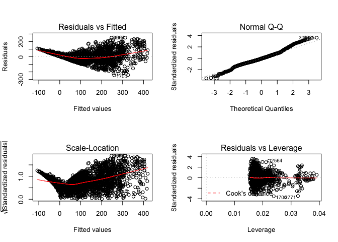

    ## dataset= 111.6 model=gam_lm trainerror= 4827.456 testerror= 5193.947

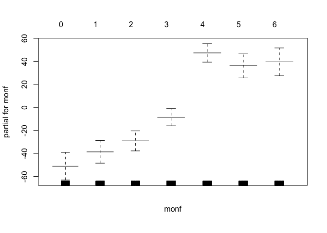

    ## [1] 2225   16
    ## 
    ## Call: gam(formula = as.formula(formula_string_2), data = trainset)
    ## Deviance Residuals:
    ##      Min       1Q   Median       3Q      Max 
    ## -232.644  -40.991   -4.667   36.478  262.003 
    ## 
    ## (Dispersion Parameter for gaussian family taken to be 4774.818)
    ## 
    ##     Null Deviance: 36436847 on 2224 degrees of freedom
    ## Residual Deviance: 10409102 on 2180 degrees of freedom
    ## AIC: 25209.04 
    ## 
    ## Number of Local Scoring Iterations: 2 
    ## 
    ## Anova for Parametric Effects
    ##                      Df   Sum Sq Mean Sq  F value    Pr(>F)    
    ## weather               2   780414  390207  81.7218 < 2.2e-16 ***
    ## typeofday             2     7727    3863   0.8091 0.4453935    
    ## wday                  5    79891   15978   3.3464 0.0051499 ** 
    ## hour                 23 17031220  740488 155.0819 < 2.2e-16 ***
    ## monf                  6  7407397 1234566 258.5578 < 2.2e-16 ***
    ## poly(atemp, 2)        2   474584  237292  49.6965 < 2.2e-16 ***
    ## poly(humidity, 2)     2   171264   85632  17.9341 1.882e-08 ***
    ## poly(windspeed, 2)    2    75248   37624   7.8797 0.0003892 ***
    ## Residuals          2180 10409102    4775                       
    ## ---
    ## Signif. codes:  0 '***' 0.001 '**' 0.01 '*' 0.05 '.' 0.1 ' ' 1
    ## 
    ## 
    ## Call: gam(formula = as.formula(formula_string_3), data = trainset)
    ## Deviance Residuals:
    ##     Min      1Q  Median      3Q     Max 
    ## -237.75  -41.55   -5.02   36.07  260.38 
    ## 
    ## (Dispersion Parameter for gaussian family taken to be 4706.901)
    ## 
    ##     Null Deviance: 36436847 on 2224 degrees of freedom
    ## Residual Deviance: 10246923 on 2177 degrees of freedom
    ## AIC: 25180.1 
    ## 
    ## Number of Local Scoring Iterations: 2 
    ## 
    ## Anova for Parametric Effects
    ##                      Df   Sum Sq Mean Sq  F value    Pr(>F)    
    ## weather               2   780414  390207  82.9010 < 2.2e-16 ***
    ## typeofday             2     7727    3863   0.8208  0.440228    
    ## wday                  5    79891   15978   3.3946  0.004656 ** 
    ## hour                 23 17031220  740488 157.3196 < 2.2e-16 ***
    ## monf                  6  7407397 1234566 262.2886 < 2.2e-16 ***
    ## poly(atemp, 3)        3   632309  210770  44.7789 < 2.2e-16 ***
    ## poly(humidity, 3)     3   148142   49381  10.4911 7.511e-07 ***
    ## poly(windspeed, 3)    3   102824   34275   7.2818 7.383e-05 ***
    ## Residuals          2177 10246923    4707                       
    ## ---
    ## Signif. codes:  0 '***' 0.001 '**' 0.01 '*' 0.05 '.' 0.1 ' ' 1
    ## 
    ## 
    ## Call: gam(formula = as.formula(formula_string_4), data = trainset)
    ## Deviance Residuals:
    ##     Min      1Q  Median      3Q     Max 
    ## -241.40  -39.75   -3.46   35.50  264.43 
    ## 
    ## (Dispersion Parameter for gaussian family taken to be 4614.035)
    ## 
    ##     Null Deviance: 36436847 on 2224 degrees of freedom
    ## Residual Deviance: 10030912 on 2174 degrees of freedom
    ## AIC: 25138.69 
    ## 
    ## Number of Local Scoring Iterations: 2 
    ## 
    ## Anova for Parametric Effects
    ##                      Df   Sum Sq Mean Sq  F value    Pr(>F)    
    ## weather               2   780414  390207  84.5696 < 2.2e-16 ***
    ## typeofday             2     7727    3863   0.8373  0.433021    
    ## wday                  5    79891   15978   3.4630  0.004035 ** 
    ## hour                 23 17031220  740488 160.4860 < 2.2e-16 ***
    ## monf                  6  7407397 1234566 267.5676 < 2.2e-16 ***
    ## poly(atemp, 4)        4   896905  224226  48.5966 < 2.2e-16 ***
    ## poly(humidity, 4)     4   120536   30134   6.5309 3.194e-05 ***
    ## poly(windspeed, 4)    4    81845   20461   4.4346  0.001429 ** 
    ## Residuals          2174 10030912    4614                       
    ## ---
    ## Signif. codes:  0 '***' 0.001 '**' 0.01 '*' 0.05 '.' 0.1 ' ' 1
    ## 
    ## 
    ## Call: gam(formula = as.formula(formula_string_5), data = trainset)
    ## Deviance Residuals:
    ##      Min       1Q   Median       3Q      Max 
    ## -240.232  -39.403   -4.717   34.657  268.053 
    ## 
    ## (Dispersion Parameter for gaussian family taken to be 4602.694)
    ## 
    ##     Null Deviance: 36436847 on 2224 degrees of freedom
    ## Residual Deviance: 9992450 on 2171 degrees of freedom
    ## AIC: 25136.14 
    ## 
    ## Number of Local Scoring Iterations: 2 
    ## 
    ## Anova for Parametric Effects
    ##                      Df   Sum Sq Mean Sq  F value    Pr(>F)    
    ## weather               2   780414  390207  84.7779 < 2.2e-16 ***
    ## typeofday             2     7727    3863   0.8394 0.4321295    
    ## wday                  5    79891   15978   3.4715 0.0039640 ** 
    ## hour                 23 17031220  740488 160.8814 < 2.2e-16 ***
    ## monf                  6  7407397 1234566 268.2268 < 2.2e-16 ***
    ## poly(atemp, 5)        5   927872  185574  40.3186 < 2.2e-16 ***
    ## poly(humidity, 5)     5   117824   23565   5.1198 0.0001132 ***
    ## poly(windspeed, 5)    5    92052   18410   3.9999 0.0012926 ** 
    ## Residuals          2171  9992450    4603                       
    ## ---
    ## Signif. codes:  0 '***' 0.001 '**' 0.01 '*' 0.05 '.' 0.1 ' ' 1
    ## 
    ## Analysis of Deviance Table
    ## 
    ## Model 1: count ~ weather + typeofday + wday + hour + monf + poly(atemp, 
    ##     2) + poly(humidity, 2) + poly(windspeed, 2)
    ## Model 2: count ~ weather + typeofday + wday + hour + monf + poly(atemp, 
    ##     3) + poly(humidity, 3) + poly(windspeed, 3)
    ## Model 3: count ~ weather + typeofday + wday + hour + monf + poly(atemp, 
    ##     4) + poly(humidity, 4) + poly(windspeed, 4)
    ## Model 4: count ~ weather + typeofday + wday + hour + monf + poly(atemp, 
    ##     5) + poly(humidity, 5) + poly(windspeed, 5)
    ##   Resid. Df Resid. Dev Df Deviance  Pr(>Chi)    
    ## 1      2180   10409102                          
    ## 2      2177   10246923  3   162179 1.086e-07 ***
    ## 3      2174   10030912  3   216011 3.594e-10 ***
    ## 4      2171    9992450  3    38462   0.03919 *  
    ## ---
    ## Signif. codes:  0 '***' 0.001 '**' 0.01 '*' 0.05 '.' 0.1 ' ' 1

    ## Warning in predict.lm(object, newdata, se.fit, scale = 1, type =
    ## ifelse(type == : prediction from a rank-deficient fit may be misleading

    ## Warning in predict.lm(object, newdata, se.fit, scale = 1, type =
    ## ifelse(type == : prediction from a rank-deficient fit may be misleading

    ## dataset= 111.6 model=gam_poly trainerror= 4605.358 testerror= 4894.241[1] "count~weather+typeofday+wday+hour+monf+s(atemp)+s(humidity)+s(windspeed)"

    ## Warning in predict.lm(object, newdata, se.fit, scale = 1, type =
    ## ifelse(type == : prediction from a rank-deficient fit may be misleading

    ## Warning in predict.lm(object, newdata, se.fit, scale = 1, type =
    ## ifelse(type == : prediction from a rank-deficient fit may be misleading

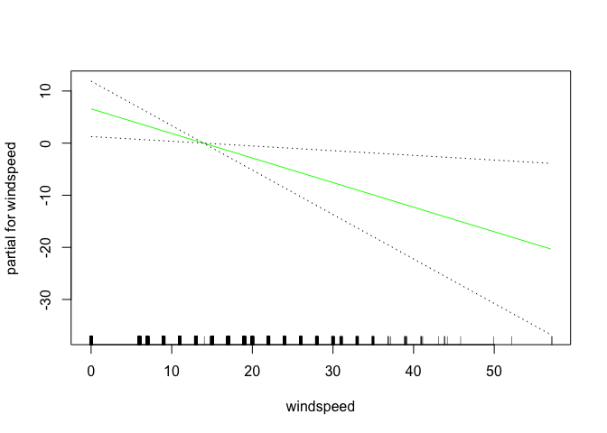

    ## dataset= 111.6 model=gam_s trainerror= 4544.605 testerror= 4851.055
    ## Call: gam(formula = as.formula(formula_string), data = trainset)
    ## Deviance Residuals:
    ##      Min       1Q   Median       3Q      Max 
    ## -235.975  -40.666   -4.417   35.591  261.429 
    ## 
    ## (Dispersion Parameter for gaussian family taken to be 4651.193)
    ## 
    ##     Null Deviance: 36436847 on 2224 degrees of freedom
    ## Residual Deviance: 10111694 on 2174 degrees of freedom
    ## AIC: 25156.54 
    ## 
    ## Number of Local Scoring Iterations: 2 
    ## 
    ## Anova for Parametric Effects
    ##                Df   Sum Sq Mean Sq  F value    Pr(>F)    
    ## weather         2   474592  237296  51.0183 < 2.2e-16 ***
    ## typeofday       2    17437    8719   1.8745  0.153684    
    ## wday            5    64688   12938   2.7816  0.016435 *  
    ## hour           23 16702824  726210 156.1341 < 2.2e-16 ***
    ## monf            6  7320947 1220158 262.3323 < 2.2e-16 ***
    ## s(atemp)        1   506809  506809 108.9632 < 2.2e-16 ***
    ## s(humidity)     1    74895   74895  16.1022 6.204e-05 ***
    ## s(windspeed)    1    36684   36684   7.8869  0.005024 ** 
    ## Residuals    2174 10111694    4651                       
    ## ---
    ## Signif. codes:  0 '***' 0.001 '**' 0.01 '*' 0.05 '.' 0.1 ' ' 1
    ## 
    ## Anova for Nonparametric Effects
    ##              Npar Df  Npar F     Pr(F)    
    ## (Intercept)                               
    ## weather                                   
    ## typeofday                                 
    ## wday                                      
    ## hour                                      
    ## monf                                      
    ## s(atemp)           3 30.1901 < 2.2e-16 ***
    ## s(humidity)        3  6.5033 0.0002231 ***
    ## s(windspeed)       3  4.1302 0.0062524 ** 
    ## ---
    ## Signif. codes:  0 '***' 0.001 '**' 0.01 '*' 0.05 '.' 0.1 ' ' 1


    ## [1] "count~weather+typeofday+wday+hour+monf+atemp+humidity+windspeed"
    ##            %IncMSE IncNodePurity
    ## weather   22.45476      598458.9
    ## typeofday 37.86704      787934.9
    ## wday      31.96639     1483443.7
    ## hour      89.32831    15691496.6
    ## monf      36.53039     4590000.7
    ## atemp     53.17022     7352893.5
    ## humidity  33.14352     2837784.1
    ## windspeed 15.96523     1253852.7


    ## dataset= 111.6 model=rf trainerror= 563.753 testerror= 2194.225

    ##                 var   rel.inf
    ## hour           hour 54.308121
    ## atemp         atemp 18.352581
    ## monf           monf 11.934647
    ## typeofday typeofday  5.548140
    ## wday           wday  4.646446
    ## humidity   humidity  2.538479
    ## windspeed windspeed  1.535712
    ## weather     weather  1.135875
    ## dataset= 111.6 model=boost trainerror= 49.19071 testerror= 1276.791[1] 3146   16
    ## [1] "111.6"
    ##      dataset model      trainerror testerror
    ## [1,] "111.6" "lm"       4827.456   5193.947 
    ## [2,] "111.6" "gam_lm"   4827.456   5193.947 
    ## [3,] "111.6" "gam_poly" 4605.358   4894.241 
    ## [4,] "111.6" "gam_s"    4544.605   4851.055 
    ## [5,] "111.6" "rf"       563.753    2194.225 
    ## [6,] "111.6" "boost"    49.19071   1276.791 
    ## [1] "model with lowest test error"
    ##   dataset model trainerror testerror
    ## 6   111.6 boost   49.19071  1276.791

    ## Warning in createDataPartition(dataset$partgroup, p = 0.7, list = F): Some
    ## classes have a single record ( Clear_Holiday_0 ) and these will be selected
    ## for the sample

    ## [1] "weather+typeofday+wday+hour+monf"
    ## [1] "count~weather+typeofday+wday+hour+monf+atemp+humidity+windspeed"

    ## Warning in predict.lm(fit_lm, newdata = trainset): prediction from a rank-
    ## deficient fit may be misleading

    ## Warning in predict.lm(fit_lm, newdata = testset): prediction from a rank-
    ## deficient fit may be misleading


    ## dataset= 111.7 model=lm trainerror= 5032.442 testerror= 5256.239

    ## [1] "count~weather+typeofday+wday+hour+monf+atemp+humidity+windspeed"
    ## 
    ## Call: gam(formula = as.formula(formula_string), data = trainset)
    ## Deviance Residuals:
    ##      Min       1Q   Median       3Q      Max 
    ## -263.286  -45.453   -7.157   40.577  238.415 
    ## 
    ## (Dispersion Parameter for gaussian family taken to be 5118.861)
    ## 
    ##     Null Deviance: 43847443 on 2546 degrees of freedom
    ## Residual Deviance: 12817629 on 2504 degrees of freedom
    ## AIC: 29025.84 
    ## 
    ## Number of Local Scoring Iterations: 2 
    ## 
    ## Anova for Parametric Effects
    ##             Df   Sum Sq Mean Sq  F value    Pr(>F)    
    ## weather      2   749621  374811  73.2215 < 2.2e-16 ***
    ## typeofday    2    16757    8378   1.6368  0.194818    
    ## wday         5    92446   18489   3.6120  0.002939 ** 
    ## hour        23 21513705  935378 182.7318 < 2.2e-16 ***
    ## monf         7  8195684 1170812 228.7251 < 2.2e-16 ***
    ## atemp        1   258317  258317  50.4638 1.575e-12 ***
    ## humidity     1   196267  196267  38.3419 6.918e-10 ***
    ## windspeed    1     7018    7018   1.3710  0.241752    
    ## Residuals 2504 12817629    5119                       
    ## ---
    ## Signif. codes:  0 '***' 0.001 '**' 0.01 '*' 0.05 '.' 0.1 ' ' 1

    ## Warning in predict.lm(object, newdata, se.fit, scale = 1, type =
    ## ifelse(type == : prediction from a rank-deficient fit may be misleading

    ## Warning in predict.lm(object, newdata, se.fit, scale = 1, type =
    ## ifelse(type == : prediction from a rank-deficient fit may be misleading


    ## dataset= 111.7 model=gam_lm trainerror= 5032.442 testerror= 5256.239


    ## [1] 2547   16
    ## 
    ## Call: gam(formula = as.formula(formula_string_2), data = trainset)
    ## Deviance Residuals:
    ##      Min       1Q   Median       3Q      Max 
    ## -255.591  -41.382   -6.909   37.198  247.481 
    ## 
    ## (Dispersion Parameter for gaussian family taken to be 4957.552)
    ## 
    ##     Null Deviance: 43847443 on 2546 degrees of freedom
    ## Residual Deviance: 12398837 on 2501 degrees of freedom
    ## AIC: 28947.23 
    ## 
    ## Number of Local Scoring Iterations: 2 
    ## 
    ## Anova for Parametric Effects
    ##                      Df   Sum Sq Mean Sq  F value    Pr(>F)    
    ## weather               2   749621  374811  75.6040 < 2.2e-16 ***
    ## typeofday             2    16757    8378   1.6900 0.1847271    
    ## wday                  5    92446   18489   3.7295 0.0022916 ** 
    ## hour                 23 21513705  935378 188.6775 < 2.2e-16 ***
    ## monf                  7  8195684 1170812 236.1674 < 2.2e-16 ***
    ## poly(atemp, 2)        2   566133  283067  57.0981 < 2.2e-16 ***
    ## poly(humidity, 2)     2   244888  122444  24.6985 2.389e-11 ***
    ## poly(windspeed, 2)    2    69373   34686   6.9967 0.0009329 ***
    ## Residuals          2501 12398837    4958                       
    ## ---
    ## Signif. codes:  0 '***' 0.001 '**' 0.01 '*' 0.05 '.' 0.1 ' ' 1
    ## 
    ## 
    ## Call: gam(formula = as.formula(formula_string_3), data = trainset)
    ## Deviance Residuals:
    ##      Min       1Q   Median       3Q      Max 
    ## -256.628  -43.160   -6.688   37.569  240.393 
    ## 
    ## (Dispersion Parameter for gaussian family taken to be 4876.052)
    ## 
    ##     Null Deviance: 43847443 on 2546 degrees of freedom
    ## Residual Deviance: 12180378 on 2498 degrees of freedom
    ## AIC: 28907.95 
    ## 
    ## Number of Local Scoring Iterations: 2 
    ## 
    ## Anova for Parametric Effects
    ##                      Df   Sum Sq Mean Sq  F value    Pr(>F)    
    ## weather               2   749621  374811  76.8676 < 2.2e-16 ***
    ## typeofday             2    16757    8378   1.7183 0.1795892    
    ## wday                  5    92446   18489   3.7918 0.0020073 ** 
    ## hour                 23 21513705  935378 191.8311 < 2.2e-16 ***
    ## monf                  7  8195684 1170812 240.1148 < 2.2e-16 ***
    ## poly(atemp, 3)        3   777768  259256  53.1693 < 2.2e-16 ***
    ## poly(humidity, 3)     3   223316   74439  15.2662 7.634e-10 ***
    ## poly(windspeed, 3)    3    97768   32589   6.6836 0.0001718 ***
    ## Residuals          2498 12180378    4876                       
    ## ---
    ## Signif. codes:  0 '***' 0.001 '**' 0.01 '*' 0.05 '.' 0.1 ' ' 1
    ## 
    ## 
    ## Call: gam(formula = as.formula(formula_string_4), data = trainset)
    ## Deviance Residuals:
    ##     Min      1Q  Median      3Q     Max 
    ## -260.45  -42.00   -6.43   37.55  245.81 
    ## 
    ## (Dispersion Parameter for gaussian family taken to be 4812.746)
    ## 
    ##     Null Deviance: 43847443 on 2546 degrees of freedom
    ## Residual Deviance: 12007801 on 2495 degrees of freedom
    ## AIC: 28877.61 
    ## 
    ## Number of Local Scoring Iterations: 2 
    ## 
    ## Anova for Parametric Effects
    ##                      Df   Sum Sq Mean Sq  F value    Pr(>F)    
    ## weather               2   749621  374811  77.8787 < 2.2e-16 ***
    ## typeofday             2    16757    8378   1.7409 0.1755815    
    ## wday                  5    92446   18489   3.8417 0.0018051 ** 
    ## hour                 23 21513705  935378 194.3544 < 2.2e-16 ***
    ## monf                  7  8195684 1170812 243.2732 < 2.2e-16 ***
    ## poly(atemp, 4)        4   984899  246225  51.1610 < 2.2e-16 ***
    ## poly(humidity, 4)     4   190307   47577   9.8856 6.192e-08 ***
    ## poly(windspeed, 4)    4    96223   24056   4.9984 0.0005175 ***
    ## Residuals          2495 12007801    4813                       
    ## ---
    ## Signif. codes:  0 '***' 0.001 '**' 0.01 '*' 0.05 '.' 0.1 ' ' 1
    ## 
    ## 
    ## Call: gam(formula = as.formula(formula_string_5), data = trainset)
    ## Deviance Residuals:
    ##      Min       1Q   Median       3Q      Max 
    ## -261.046  -41.388   -6.228   36.897  251.739 
    ## 
    ## (Dispersion Parameter for gaussian family taken to be 4798.477)
    ## 
    ##     Null Deviance: 43847443 on 2546 degrees of freedom
    ## Residual Deviance: 11957805 on 2492 degrees of freedom
    ## AIC: 28872.98 
    ## 
    ## Number of Local Scoring Iterations: 2 
    ## 
    ## Anova for Parametric Effects
    ##                      Df   Sum Sq Mean Sq  F value    Pr(>F)    
    ## weather               2   749621  374811  78.1103 < 2.2e-16 ***
    ## typeofday             2    16757    8378   1.7460 0.1746764    
    ## wday                  5    92446   18489   3.8531 0.0017617 ** 
    ## hour                 23 21513705  935378 194.9324 < 2.2e-16 ***
    ## monf                  7  8195684 1170812 243.9966 < 2.2e-16 ***
    ## poly(atemp, 5)        5  1022613  204523  42.6224 < 2.2e-16 ***
    ## poly(humidity, 5)     5   193254   38651   8.0548  1.51e-07 ***
    ## poly(windspeed, 5)    5   105558   21112   4.3996 0.0005435 ***
    ## Residuals          2492 11957805    4798                       
    ## ---
    ## Signif. codes:  0 '***' 0.001 '**' 0.01 '*' 0.05 '.' 0.1 ' ' 1
    ## 
    ## Analysis of Deviance Table
    ## 
    ## Model 1: count ~ weather + typeofday + wday + hour + monf + poly(atemp, 
    ##     2) + poly(humidity, 2) + poly(windspeed, 2)
    ## Model 2: count ~ weather + typeofday + wday + hour + monf + poly(atemp, 
    ##     3) + poly(humidity, 3) + poly(windspeed, 3)
    ## Model 3: count ~ weather + typeofday + wday + hour + monf + poly(atemp, 
    ##     4) + poly(humidity, 4) + poly(windspeed, 4)
    ## Model 4: count ~ weather + typeofday + wday + hour + monf + poly(atemp, 
    ##     5) + poly(humidity, 5) + poly(windspeed, 5)
    ##   Resid. Df Resid. Dev Df Deviance  Pr(>Chi)    
    ## 1      2501   12398837                          
    ## 2      2498   12180378  3   218459 7.150e-10 ***
    ## 3      2495   12007801  3   172576 7.618e-08 ***
    ## 4      2492   11957805  3    49996   0.01532 *  
    ## ---
    ## Signif. codes:  0 '***' 0.001 '**' 0.01 '*' 0.05 '.' 0.1 ' ' 1

    ## Warning in predict.lm(object, newdata, se.fit, scale = 1, type =
    ## ifelse(type == : prediction from a rank-deficient fit may be misleading

    ## Warning in predict.lm(object, newdata, se.fit, scale = 1, type =
    ## ifelse(type == : prediction from a rank-deficient fit may be misleading

    ## dataset= 111.7 model=gam_poly trainerror= 4782.245 testerror= 5098.905[1] "count~weather+typeofday+wday+hour+monf+s(atemp)+s(humidity)+s(windspeed)"

    ## Warning in predict.lm(object, newdata, se.fit, scale = 1, type =
    ## ifelse(type == : prediction from a rank-deficient fit may be misleading

    ## Warning in predict.lm(object, newdata, se.fit, scale = 1, type =
    ## ifelse(type == : prediction from a rank-deficient fit may be misleading


    ## dataset= 111.7 model=gam_s trainerror= 4741.438 testerror= 5013.451
    ## Call: gam(formula = as.formula(formula_string), data = trainset)
    ## Deviance Residuals:
    ##      Min       1Q   Median       3Q      Max 
    ## -257.863  -41.989   -6.359   37.629  243.321 
    ## 
    ## (Dispersion Parameter for gaussian family taken to be 4840.236)
    ## 
    ##     Null Deviance: 43847443 on 2546 degrees of freedom
    ## Residual Deviance: 12076391 on 2495 degrees of freedom
    ## AIC: 28892.11 
    ## 
    ## Number of Local Scoring Iterations: 2 
    ## 
    ## Anova for Parametric Effects
    ##                Df   Sum Sq Mean Sq  F value    Pr(>F)    
    ## weather         2   435674  217837  45.0054 < 2.2e-16 ***
    ## typeofday       2      516     258   0.0533  0.948091    
    ## wday            5    90871   18174   3.7548  0.002172 ** 
    ## hour           23 21085868  916777 189.4075 < 2.2e-16 ***
    ## monf            7  8222613 1174659 242.6863 < 2.2e-16 ***
    ## s(atemp)        1   531650  531650 109.8398 < 2.2e-16 ***
    ## s(humidity)     1   156851  156851  32.4056 1.398e-08 ***
    ## s(windspeed)    1    16905   16905   3.4926  0.061761 .  
    ## Residuals    2495 12076391    4840                       
    ## ---
    ## Signif. codes:  0 '***' 0.001 '**' 0.01 '*' 0.05 '.' 0.1 ' ' 1
    ## 
    ## Anova for Nonparametric Effects
    ##              Npar Df Npar F     Pr(F)    
    ## (Intercept)                              
    ## weather                                  
    ## typeofday                                
    ## wday                                     
    ## hour                                     
    ## monf                                     
    ## s(atemp)           3 33.526 < 2.2e-16 ***
    ## s(humidity)        3  7.611 4.586e-05 ***
    ## s(windspeed)       3  5.214  0.001372 ** 
    ## ---
    ## Signif. codes:  0 '***' 0.001 '**' 0.01 '*' 0.05 '.' 0.1 ' ' 1


    ## [1] "count~weather+typeofday+wday+hour+monf+atemp+humidity+windspeed"
    ##            %IncMSE IncNodePurity
    ## weather   21.42731      623185.0
    ## typeofday 38.63638      971675.8
    ## wday      35.77514     1794761.1
    ## hour      90.66948    20032522.1
    ## monf      40.03666     5834750.9
    ## atemp     47.53079     7723337.5
    ## humidity  35.46328     3478147.4
    ## windspeed 18.64642     1530417.5


    ## dataset= 111.7 model=rf trainerror= 555.357 testerror= 2068.001

    ##                 var   rel.inf
    ## hour           hour 54.638201
    ## atemp         atemp 16.544579
    ## monf           monf 12.378672
    ## typeofday typeofday  5.848090
    ## wday           wday  4.283819
    ## humidity   humidity  3.492053
    ## windspeed windspeed  1.626733
    ## weather     weather  1.187853
    ## dataset= 111.7 model=boost trainerror= 62.08596 testerror= 1152.208[1] 3602   16
    ## [1] "111.7"
    ##      dataset model      trainerror testerror
    ## [1,] "111.7" "lm"       5032.442   5256.239 
    ## [2,] "111.7" "gam_lm"   5032.442   5256.239 
    ## [3,] "111.7" "gam_poly" 4782.245   5098.905 
    ## [4,] "111.7" "gam_s"    4741.438   5013.451 
    ## [5,] "111.7" "rf"       555.357    2068.001 
    ## [6,] "111.7" "boost"    62.08596   1152.208 
    ## [1] "model with lowest test error"
    ##   dataset model trainerror testerror
    ## 6   111.7 boost   62.08596  1152.208

    ## Warning in createDataPartition(dataset$partgroup, p = 0.7, list = F): Some
    ## classes have a single record ( Clear_Holiday_0 ) and these will be selected
    ## for the sample

    ## [1] "weather+typeofday+wday+hour+monf"
    ## [1] "count~weather+typeofday+wday+hour+monf+atemp+humidity+windspeed"

    ## Warning in predict.lm(fit_lm, newdata = trainset): prediction from a rank-
    ## deficient fit may be misleading

    ## Warning in predict.lm(fit_lm, newdata = testset): prediction from a rank-
    ## deficient fit may be misleading


    ## dataset= 111.8 model=lm trainerror= 5389.089 testerror= 5267.839

    ## [1] "count~weather+typeofday+wday+hour+monf+atemp+humidity+windspeed"
    ## 
    ## Call: gam(formula = as.formula(formula_string), data = trainset)
    ## Deviance Residuals:
    ##      Min       1Q   Median       3Q      Max 
    ## -257.474  -46.902   -6.045   41.065  253.446 
    ## 
    ## (Dispersion Parameter for gaussian family taken to be 5473.026)
    ## 
    ##     Null Deviance: 52189707 on 2868 degrees of freedom
    ## Residual Deviance: 15461298 on 2825 degrees of freedom
    ## AIC: 32882.7 
    ## 
    ## Number of Local Scoring Iterations: 2 
    ## 
    ## Anova for Parametric Effects
    ##             Df   Sum Sq Mean Sq  F value    Pr(>F)    
    ## weather      2  1017084  508542  92.9179 < 2.2e-16 ***
    ## typeofday    2    35122   17561   3.2087   0.04056 *  
    ## wday         5    74008   14802   2.7045   0.01914 *  
    ## hour        23 26301561 1143546 208.9422 < 2.2e-16 ***
    ## monf         8  8706894 1088362 198.8592 < 2.2e-16 ***
    ## atemp        1   322258  322258  58.8812 2.290e-14 ***
    ## humidity     1   266855  266855  48.7582 3.595e-12 ***
    ## windspeed    1     4627    4627   0.8453   0.35796    
    ## Residuals 2825 15461298    5473                       
    ## ---
    ## Signif. codes:  0 '***' 0.001 '**' 0.01 '*' 0.05 '.' 0.1 ' ' 1

    ## Warning in predict.lm(object, newdata, se.fit, scale = 1, type =
    ## ifelse(type == : prediction from a rank-deficient fit may be misleading

    ## Warning in predict.lm(object, newdata, se.fit, scale = 1, type =
    ## ifelse(type == : prediction from a rank-deficient fit may be misleading


    ## dataset= 111.8 model=gam_lm trainerror= 5389.089 testerror= 5267.839


    ## [1] 2869   16
    ## 
    ## Call: gam(formula = as.formula(formula_string_2), data = trainset)
    ## Deviance Residuals:
    ##      Min       1Q   Median       3Q      Max 
    ## -249.492  -43.168   -5.698   37.564  255.328 
    ## 
    ## (Dispersion Parameter for gaussian family taken to be 5296.612)
    ## 
    ##     Null Deviance: 52189707 on 2868 degrees of freedom
    ## Residual Deviance: 14947038 on 2822 degrees of freedom
    ## AIC: 32791.65 
    ## 
    ## Number of Local Scoring Iterations: 2 
    ## 
    ## Anova for Parametric Effects
    ##                      Df   Sum Sq Mean Sq  F value    Pr(>F)    
    ## weather               2  1017084  508542  96.0127 < 2.2e-16 ***
    ## typeofday             2    35122   17561   3.3155  0.036456 *  
    ## wday                  5    74008   14802   2.7946  0.015958 *  
    ## hour                 23 26301561 1143546 215.9014 < 2.2e-16 ***
    ## monf                  8  8706894 1088362 205.4826 < 2.2e-16 ***
    ## poly(atemp, 2)        2   603233  301616  56.9452 < 2.2e-16 ***
    ## poly(humidity, 2)     2   438133  219067  41.3598 < 2.2e-16 ***
    ## poly(windspeed, 2)    2    66633   33316   6.2901  0.001881 ** 
    ## Residuals          2822 14947038    5297                       
    ## ---
    ## Signif. codes:  0 '***' 0.001 '**' 0.01 '*' 0.05 '.' 0.1 ' ' 1
    ## 
    ## 
    ## Call: gam(formula = as.formula(formula_string_3), data = trainset)
    ## Deviance Residuals:
    ##      Min       1Q   Median       3Q      Max 
    ## -252.583  -44.272   -6.278   38.849  250.797 
    ## 
    ## (Dispersion Parameter for gaussian family taken to be 5239.245)
    ## 
    ##     Null Deviance: 52189707 on 2868 degrees of freedom
    ## Residual Deviance: 14769433 on 2819 degrees of freedom
    ## AIC: 32763.35 
    ## 
    ## Number of Local Scoring Iterations: 2 
    ## 
    ## Anova for Parametric Effects
    ##                      Df   Sum Sq Mean Sq  F value    Pr(>F)    
    ## weather               2  1017084  508542  97.0640 < 2.2e-16 ***
    ## typeofday             2    35122   17561   3.3518  0.035159 *  
    ## wday                  5    74008   14802   2.8252  0.014999 *  
    ## hour                 23 26301561 1143546 218.2654 < 2.2e-16 ***
    ## monf                  8  8706894 1088362 207.7325 < 2.2e-16 ***
    ## poly(atemp, 3)        3   816934  272311  51.9753 < 2.2e-16 ***
    ## poly(humidity, 3)     3   384149  128050  24.4405 1.309e-15 ***
    ## poly(windspeed, 3)    3    84521   28174   5.3774  0.001087 ** 
    ## Residuals          2819 14769433    5239                       
    ## ---
    ## Signif. codes:  0 '***' 0.001 '**' 0.01 '*' 0.05 '.' 0.1 ' ' 1
    ## 
    ## 
    ## Call: gam(formula = as.formula(formula_string_4), data = trainset)
    ## Deviance Residuals:
    ##      Min       1Q   Median       3Q      Max 
    ## -256.305  -43.546   -5.101   37.838  258.375 
    ## 
    ## (Dispersion Parameter for gaussian family taken to be 5169.993)
    ## 
    ##     Null Deviance: 52189707 on 2868 degrees of freedom
    ## Residual Deviance: 14558700 on 2816 degrees of freedom
    ## AIC: 32728.12 
    ## 
    ## Number of Local Scoring Iterations: 2 
    ## 
    ## Anova for Parametric Effects
    ##                      Df   Sum Sq Mean Sq  F value    Pr(>F)    
    ## weather               2  1017084  508542  98.3642 < 2.2e-16 ***
    ## typeofday             2    35122   17561   3.3967  0.033619 *  
    ## wday                  5    74008   14802   2.8630  0.013889 *  
    ## hour                 23 26301561 1143546 221.1891 < 2.2e-16 ***
    ## monf                  8  8706894 1088362 210.5151 < 2.2e-16 ***
    ## poly(atemp, 4)        4  1066794  266698  51.5858 < 2.2e-16 ***
    ## poly(humidity, 4)     4   359044   89761  17.3619 4.418e-14 ***
    ## poly(windspeed, 4)    4    70500   17625   3.4091  0.008656 ** 
    ## Residuals          2816 14558700    5170                       
    ## ---
    ## Signif. codes:  0 '***' 0.001 '**' 0.01 '*' 0.05 '.' 0.1 ' ' 1
    ## 
    ## 
    ## Call: gam(formula = as.formula(formula_string_5), data = trainset)
    ## Deviance Residuals:
    ##      Min       1Q   Median       3Q      Max 
    ## -253.180  -43.064   -4.791   37.136  265.085 
    ## 
    ## (Dispersion Parameter for gaussian family taken to be 5152.839)
    ## 
    ##     Null Deviance: 52189707 on 2868 degrees of freedom
    ## Residual Deviance: 14494937 on 2813 degrees of freedom
    ## AIC: 32721.53 
    ## 
    ## Number of Local Scoring Iterations: 2 
    ## 
    ## Anova for Parametric Effects
    ##                      Df   Sum Sq Mean Sq  F value    Pr(>F)    
    ## weather               2  1017084  508542  98.6917 < 2.2e-16 ***
    ## typeofday             2    35122   17561   3.4081  0.033242 *  
    ## wday                  5    74008   14802   2.8725  0.013623 *  
    ## hour                 23 26301561 1143546 221.9254 < 2.2e-16 ***
    ## monf                  8  8706894 1088362 211.2159 < 2.2e-16 ***
    ## poly(atemp, 5)        5  1131036  226207  43.8995 < 2.2e-16 ***
    ## poly(humidity, 5)     5   350825   70165  13.6168 3.717e-13 ***
    ## poly(windspeed, 5)    5    78240   15648   3.0368  0.009736 ** 
    ## Residuals          2813 14494937    5153                       
    ## ---
    ## Signif. codes:  0 '***' 0.001 '**' 0.01 '*' 0.05 '.' 0.1 ' ' 1
    ## 
    ## Analysis of Deviance Table
    ## 
    ## Model 1: count ~ weather + typeofday + wday + hour + monf + poly(atemp, 
    ##     2) + poly(humidity, 2) + poly(windspeed, 2)
    ## Model 2: count ~ weather + typeofday + wday + hour + monf + poly(atemp, 
    ##     3) + poly(humidity, 3) + poly(windspeed, 3)
    ## Model 3: count ~ weather + typeofday + wday + hour + monf + poly(atemp, 
    ##     4) + poly(humidity, 4) + poly(windspeed, 4)
    ## Model 4: count ~ weather + typeofday + wday + hour + monf + poly(atemp, 
    ##     5) + poly(humidity, 5) + poly(windspeed, 5)
    ##   Resid. Df Resid. Dev Df Deviance  Pr(>Chi)    
    ## 1      2822   14947038                          
    ## 2      2819   14769433  3   177605 1.578e-07 ***
    ## 3      2816   14558700  3   210733 6.878e-09 ***
    ## 4      2813   14494937  3    63763  0.006205 ** 
    ## ---
    ## Signif. codes:  0 '***' 0.001 '**' 0.01 '*' 0.05 '.' 0.1 ' ' 1

    ## Warning in predict.lm(object, newdata, se.fit, scale = 1, type =
    ## ifelse(type == : prediction from a rank-deficient fit may be misleading

    ## Warning in predict.lm(object, newdata, se.fit, scale = 1, type =
    ## ifelse(type == : prediction from a rank-deficient fit may be misleading

    ## dataset= 111.8 model=gam_poly trainerror= 5147.938 testerror= 4972.261[1] "count~weather+typeofday+wday+hour+monf+s(atemp)+s(humidity)+s(windspeed)"

    ## Warning in predict.lm(object, newdata, se.fit, scale = 1, type =
    ## ifelse(type == : prediction from a rank-deficient fit may be misleading

    ## Warning in predict.lm(object, newdata, se.fit, scale = 1, type =
    ## ifelse(type == : prediction from a rank-deficient fit may be misleading


    ## dataset= 111.8 model=gam_s trainerror= 5088.669 testerror= 4921.443
    ## Call: gam(formula = as.formula(formula_string), data = trainset)
    ## Deviance Residuals:
    ##      Min       1Q   Median       3Q      Max 
    ## -249.393  -43.222   -5.983   37.933  255.619 
    ## 
    ## (Dispersion Parameter for gaussian family taken to be 5184.418)
    ## 
    ##     Null Deviance: 52189707 on 2868 degrees of freedom
    ## Residual Deviance: 14599323 on 2816 degrees of freedom
    ## AIC: 32736.12 
    ## 
    ## Number of Local Scoring Iterations: 2 
    ## 
    ## Anova for Parametric Effects
    ##                Df   Sum Sq Mean Sq  F value    Pr(>F)    
    ## weather         2   594597  297299  57.3446 < 2.2e-16 ***
    ## typeofday       2    17960    8980   1.7321   0.17709    
    ## wday            5    68167   13633   2.6297   0.02224 *  
    ## hour           23 25780773 1120903 216.2062 < 2.2e-16 ***
    ## monf            8  8733914 1091739 210.5809 < 2.2e-16 ***
    ## s(atemp)        1   496367  496367  95.7421 < 2.2e-16 ***
    ## s(humidity)     1   241713  241713  46.6230  1.05e-11 ***
    ## s(windspeed)    1     8113    8113   1.5648   0.21107    
    ## Residuals    2816 14599323    5184                       
    ## ---
    ## Signif. codes:  0 '***' 0.001 '**' 0.01 '*' 0.05 '.' 0.1 ' ' 1
    ## 
    ## Anova for Nonparametric Effects
    ##              Npar Df  Npar F     Pr(F)    
    ## (Intercept)                               
    ## weather                                   
    ## typeofday                                 
    ## wday                                      
    ## hour                                      
    ## monf                                      
    ## s(atemp)           3 30.1829 < 2.2e-16 ***
    ## s(humidity)        3 14.6568 1.801e-09 ***
    ## s(windspeed)       3  4.3679  0.004476 ** 
    ## ---
    ## Signif. codes:  0 '***' 0.001 '**' 0.01 '*' 0.05 '.' 0.1 ' ' 1


    ## [1] "count~weather+typeofday+wday+hour+monf+atemp+humidity+windspeed"
    ##             %IncMSE IncNodePurity
    ## weather    23.71203      823861.2
    ## typeofday  41.65772     1327734.3
    ## wday       38.71569     2131646.6
    ## hour      100.11038    24029139.7
    ## monf       39.18198     6547727.3
    ## atemp      47.80972     8954869.9
    ## humidity   41.93170     4247420.9
    ## windspeed  20.28972     1838864.5


    ## dataset= 111.8 model=rf trainerror= 594.8048 testerror= 2112.652

    ##                 var   rel.inf
    ## hour           hour 54.934285
    ## atemp         atemp 14.011200
    ## monf           monf 13.046509
    ## typeofday typeofday  6.795542
    ## wday           wday  4.440406
    ## humidity   humidity  4.219479
    ## weather     weather  1.282517
    ## windspeed windspeed  1.270062
    ## dataset= 111.8 model=boost trainerror= 87.8401 testerror= 1107.617[1] 4055   16
    ## [1] "111.8"
    ##      dataset model      trainerror testerror
    ## [1,] "111.8" "lm"       5389.089   5267.839 
    ## [2,] "111.8" "gam_lm"   5389.089   5267.839 
    ## [3,] "111.8" "gam_poly" 5147.938   4972.261 
    ## [4,] "111.8" "gam_s"    5088.669   4921.443 
    ## [5,] "111.8" "rf"       594.8048   2112.652 
    ## [6,] "111.8" "boost"    87.8401    1107.617 
    ## [1] "model with lowest test error"
    ##   dataset model trainerror testerror
    ## 6   111.8 boost    87.8401  1107.617

    ## Warning in createDataPartition(dataset$partgroup, p = 0.7, list = F): Some
    ## classes have a single record ( Clear_Holiday_0 ) and these will be selected
    ## for the sample

    ## [1] "weather+typeofday+wday+hour+monf"
    ## [1] "count~weather+typeofday+wday+hour+monf+atemp+humidity+windspeed"

    ## Warning in predict.lm(fit_lm, newdata = trainset): prediction from a rank-
    ## deficient fit may be misleading

    ## Warning in predict.lm(fit_lm, newdata = testset): prediction from a rank-
    ## deficient fit may be misleading


    ## dataset= 111.9 model=lm trainerror= 5414.248 testerror= 5760.918

    ## [1] "count~weather+typeofday+wday+hour+monf+atemp+humidity+windspeed"
    ## 
    ## Call: gam(formula = as.formula(formula_string), data = trainset)
    ## Deviance Residuals:
    ##      Min       1Q   Median       3Q      Max 
    ## -261.272  -44.866   -8.601   38.672  257.450 
    ## 
    ## (Dispersion Parameter for gaussian family taken to be 5491.717)
    ## 
    ##     Null Deviance: 57272904 on 3189 degrees of freedom
    ## Residual Deviance: 17271450 on 3145 degrees of freedom
    ## AIC: 36568.59 
    ## 
    ## Number of Local Scoring Iterations: 2 
    ## 
    ## Anova for Parametric Effects
    ##             Df   Sum Sq Mean Sq  F value    Pr(>F)    
    ## weather      2  1260670  630335 114.7792 < 2.2e-16 ***
    ## typeofday    2    32366   16183   2.9468   0.05265 .  
    ## wday         5    57536   11507   2.0954   0.06310 .  
    ## hour        23 29017912 1261648 229.7366 < 2.2e-16 ***
    ## monf         9  8937573  993064 180.8293 < 2.2e-16 ***
    ## atemp        1   370334  370334  67.4351 3.143e-16 ***
    ## humidity     1   313582  313582  57.1008 5.397e-14 ***
    ## windspeed    1    11481   11481   2.0906   0.14831    
    ## Residuals 3145 17271450    5492                       
    ## ---
    ## Signif. codes:  0 '***' 0.001 '**' 0.01 '*' 0.05 '.' 0.1 ' ' 1

    ## Warning in predict.lm(object, newdata, se.fit, scale = 1, type =
    ## ifelse(type == : prediction from a rank-deficient fit may be misleading

    ## Warning in predict.lm(object, newdata, se.fit, scale = 1, type =
    ## ifelse(type == : prediction from a rank-deficient fit may be misleading

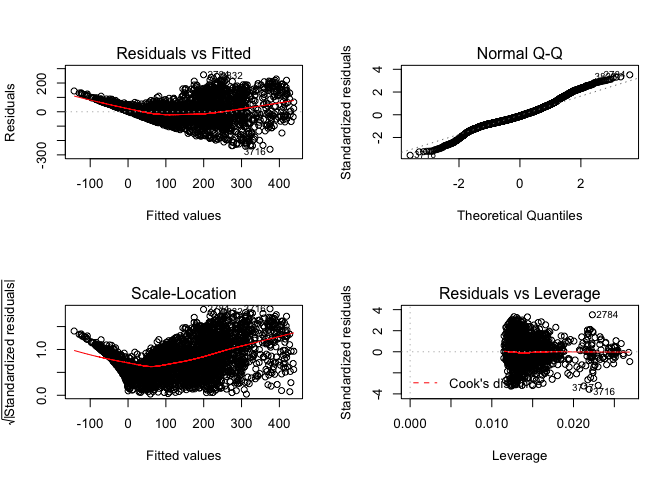

    ## dataset= 111.9 model=gam_lm trainerror= 5414.248 testerror= 5760.918


    ## [1] 3190   16
    ## 
    ## Call: gam(formula = as.formula(formula_string_2), data = trainset)
    ## Deviance Residuals:
    ##      Min       1Q   Median       3Q      Max 
    ## -247.640  -42.325   -7.601   37.866  254.273 
    ## 
    ## (Dispersion Parameter for gaussian family taken to be 5309.338)
    ## 
    ##     Null Deviance: 57272904 on 3189 degrees of freedom
    ## Residual Deviance: 16681941 on 3142 degrees of freedom
    ## AIC: 36463.8 
    ## 
    ## Number of Local Scoring Iterations: 2 
    ## 
    ## Anova for Parametric Effects
    ##                      Df   Sum Sq Mean Sq  F value    Pr(>F)    
    ## weather               2  1260670  630335 118.7219 < 2.2e-16 ***
    ## typeofday             2    32366   16183   3.0481  0.047591 *  
    ## wday                  5    57536   11507   2.1673  0.055000 .  
    ## hour                 23 29017912 1261648 237.6282 < 2.2e-16 ***
    ## monf                  9  8937573  993064 187.0409 < 2.2e-16 ***
    ## poly(atemp, 2)        2   674281  337141  63.4996 < 2.2e-16 ***
    ## poly(humidity, 2)     2   552146  276073  51.9976 < 2.2e-16 ***
    ## poly(windspeed, 2)    2    58480   29240   5.5072  0.004097 ** 
    ## Residuals          3142 16681941    5309                       
    ## ---
    ## Signif. codes:  0 '***' 0.001 '**' 0.01 '*' 0.05 '.' 0.1 ' ' 1
    ## 
    ## 
    ## Call: gam(formula = as.formula(formula_string_3), data = trainset)
    ## Deviance Residuals:
    ##      Min       1Q   Median       3Q      Max 
    ## -252.273  -44.498   -7.176   38.663  253.200 
    ## 
    ## (Dispersion Parameter for gaussian family taken to be 5214.115)
    ## 
    ##     Null Deviance: 57272904 on 3189 degrees of freedom
    ## Residual Deviance: 16367106 on 3139 degrees of freedom
    ## AIC: 36409.02 
    ## 
    ## Number of Local Scoring Iterations: 2 
    ## 
    ## Anova for Parametric Effects
    ##                      Df   Sum Sq Mean Sq  F value    Pr(>F)    
    ## weather               2  1260670  630335 120.8901 < 2.2e-16 ***
    ## typeofday             2    32366   16183   3.1037 0.0450193 *  
    ## wday                  5    57536   11507   2.2069 0.0509744 .  
    ## hour                 23 29017912 1261648 241.9679 < 2.2e-16 ***
    ## monf                  9  8937573  993064 190.4568 < 2.2e-16 ***
    ## poly(atemp, 3)        3  1026019  342006  65.5924 < 2.2e-16 ***
    ## poly(humidity, 3)     3   486142  162047  31.0786 < 2.2e-16 ***
    ## poly(windspeed, 3)    3    87580   29193   5.5989 0.0007938 ***
    ## Residuals          3139 16367106    5214                       
    ## ---
    ## Signif. codes:  0 '***' 0.001 '**' 0.01 '*' 0.05 '.' 0.1 ' ' 1
    ## 
    ## 
    ## Call: gam(formula = as.formula(formula_string_4), data = trainset)
    ## Deviance Residuals:
    ##      Min       1Q   Median       3Q      Max 
    ## -250.588  -43.258   -6.351   37.606  251.518 
    ## 
    ## (Dispersion Parameter for gaussian family taken to be 5155.131)
    ## 
    ##     Null Deviance: 57272904 on 3189 degrees of freedom
    ## Residual Deviance: 16166490 on 3136 degrees of freedom
    ## AIC: 36375.68 
    ## 
    ## Number of Local Scoring Iterations: 2 
    ## 
    ## Anova for Parametric Effects
    ##                      Df   Sum Sq Mean Sq  F value  Pr(>F)    
    ## weather               2  1260670  630335 122.2733 < 2e-16 ***
    ## typeofday             2    32366   16183   3.1392 0.04345 *  
    ## wday                  5    57536   11507   2.2322 0.04855 *  
    ## hour                 23 29017912 1261648 244.7364 < 2e-16 ***
    ## monf                  9  8937573  993064 192.6360 < 2e-16 ***
    ## poly(atemp, 4)        4  1288229  322057  62.4732 < 2e-16 ***
    ## poly(humidity, 4)     4   449439  112360  21.7957 < 2e-16 ***
    ## poly(windspeed, 4)    4    62689   15672   3.0401 0.01633 *  
    ## Residuals          3136 16166490    5155                     
    ## ---
    ## Signif. codes:  0 '***' 0.001 '**' 0.01 '*' 0.05 '.' 0.1 ' ' 1
    ## 
    ## 
    ## Call: gam(formula = as.formula(formula_string_5), data = trainset)
    ## Deviance Residuals:
    ##      Min       1Q   Median       3Q      Max 
    ## -248.497  -43.548   -6.539   37.561  249.043 
    ## 
    ## (Dispersion Parameter for gaussian family taken to be 5150.384)
    ## 
    ##     Null Deviance: 57272904 on 3189 degrees of freedom
    ## Residual Deviance: 16136154 on 3133 degrees of freedom
    ## AIC: 36375.69 
    ## 
    ## Number of Local Scoring Iterations: 2 
    ## 
    ## Anova for Parametric Effects
    ##                      Df   Sum Sq Mean Sq  F value  Pr(>F)    
    ## weather               2  1260670  630335 122.3860 < 2e-16 ***
    ## typeofday             2    32366   16183   3.1421 0.04333 *  
    ## wday                  5    57536   11507   2.2342 0.04836 *  
    ## hour                 23 29017912 1261648 244.9620 < 2e-16 ***
    ## monf                  9  8937573  993064 192.8135 < 2e-16 ***
    ## poly(atemp, 5)        5  1326671  265334  51.5174 < 2e-16 ***
    ## poly(humidity, 5)     5   438067   87613  17.0110 < 2e-16 ***
    ## poly(windspeed, 5)    5    65955   13191   2.5612 0.02547 *  
    ## Residuals          3133 16136154    5150                     
    ## ---
    ## Signif. codes:  0 '***' 0.001 '**' 0.01 '*' 0.05 '.' 0.1 ' ' 1
    ## 
    ## Analysis of Deviance Table
    ## 
    ## Model 1: count ~ weather + typeofday + wday + hour + monf + poly(atemp, 
    ##     2) + poly(humidity, 2) + poly(windspeed, 2)
    ## Model 2: count ~ weather + typeofday + wday + hour + monf + poly(atemp, 
    ##     3) + poly(humidity, 3) + poly(windspeed, 3)
    ## Model 3: count ~ weather + typeofday + wday + hour + monf + poly(atemp, 
    ##     4) + poly(humidity, 4) + poly(windspeed, 4)
    ## Model 4: count ~ weather + typeofday + wday + hour + monf + poly(atemp, 
    ##     5) + poly(humidity, 5) + poly(windspeed, 5)
    ##   Resid. Df Resid. Dev Df Deviance  Pr(>Chi)    
    ## 1      3142   16681941                          
    ## 2      3139   16367106  3   314834 3.374e-13 ***
    ## 3      3136   16166490  3   200617 1.777e-08 ***
    ## 4      3133   16136154  3    30335    0.1171    
    ## ---
    ## Signif. codes:  0 '***' 0.001 '**' 0.01 '*' 0.05 '.' 0.1 ' ' 1

    ## Warning in predict.lm(object, newdata, se.fit, scale = 1, type =
    ## ifelse(type == : prediction from a rank-deficient fit may be misleading

    ## Warning in predict.lm(object, newdata, se.fit, scale = 1, type =
    ## ifelse(type == : prediction from a rank-deficient fit may be misleading

    ## dataset= 111.9 model=gam_poly trainerror= 5130.754 testerror= 5524.624[1] "count~weather+typeofday+wday+hour+monf+s(atemp)+s(humidity)+s(windspeed)"

    ## Warning in predict.lm(object, newdata, se.fit, scale = 1, type =
    ## ifelse(type == : prediction from a rank-deficient fit may be misleading

    ## Warning in predict.lm(object, newdata, se.fit, scale = 1, type =
    ## ifelse(type == : prediction from a rank-deficient fit may be misleading


    ## dataset= 111.9 model=gam_s trainerror= 5093.099 testerror= 5447.912
    ## Call: gam(formula = as.formula(formula_string), data = trainset)
    ## Deviance Residuals:
    ##      Min       1Q   Median       3Q      Max 
    ## -250.141  -43.774   -7.182   37.422  250.006 
    ## 
    ## (Dispersion Parameter for gaussian family taken to be 5180.784)
    ## 
    ##     Null Deviance: 57272904 on 3189 degrees of freedom
    ## Residual Deviance: 16246942 on 3136 degrees of freedom
    ## AIC: 36391.52 
    ## 
    ## Number of Local Scoring Iterations: 2 
    ## 
    ## Anova for Parametric Effects
    ##                Df   Sum Sq Mean Sq  F value    Pr(>F)    
    ## weather         2   731230  365615  70.5714 < 2.2e-16 ***
    ## typeofday       2    46277   23139   4.4662   0.01156 *  
    ## wday            5    51924   10385   2.0045   0.07492 .  
    ## hour           23 28690201 1247400 240.7744 < 2.2e-16 ***
    ## monf            9  9060299 1006700 194.3142 < 2.2e-16 ***
    ## s(atemp)        1   590295  590295 113.9392 < 2.2e-16 ***
    ## s(humidity)     1   277085  277085  53.4833 3.295e-13 ***
    ## s(windspeed)    1    16674   16674   3.2183   0.07291 .  
    ## Residuals    3136 16246942    5181                       
    ## ---
    ## Signif. codes:  0 '***' 0.001 '**' 0.01 '*' 0.05 '.' 0.1 ' ' 1
    ## 
    ## Anova for Nonparametric Effects
    ##              Npar Df Npar F     Pr(F)    
    ## (Intercept)                              
    ## weather                                  
    ## typeofday                                
    ## wday                                     
    ## hour                                     
    ## monf                                     
    ## s(atemp)           3 38.073 < 2.2e-16 ***
    ## s(humidity)        3 16.679 9.486e-11 ***
    ## s(windspeed)       3  3.777   0.01015 *  
    ## ---
    ## Signif. codes:  0 '***' 0.001 '**' 0.01 '*' 0.05 '.' 0.1 ' ' 1


    ## [1] "count~weather+typeofday+wday+hour+monf+atemp+humidity+windspeed"
    ##             %IncMSE IncNodePurity
    ## weather    26.51998      961547.2
    ## typeofday  42.78700     1411292.1
    ## wday       36.14876     2200324.5
    ## hour      104.11610    27643904.5
    ## monf       44.62564     6905899.0
    ## atemp      50.99299     9061136.2
    ## humidity   44.15936     4706043.8
    ## windspeed  22.39881     1870227.7


    ## dataset= 111.9 model=rf trainerror= 563.1927 testerror= 2070.087

    ##                 var   rel.inf
    ## hour           hour 57.105381
    ## monf           monf 13.557294
    ## atemp         atemp 11.637262
    ## typeofday typeofday  7.021369
    ## humidity   humidity  4.391968
    ## wday           wday  3.718487
    ## windspeed windspeed  1.320828
    ## weather     weather  1.247411
    ## dataset= 111.9 model=boost trainerror= 100.951 testerror= 1141.685[1] 4510   16
    ## [1] "111.9"
    ##      dataset model      trainerror testerror
    ## [1,] "111.9" "lm"       5414.248   5760.918 
    ## [2,] "111.9" "gam_lm"   5414.248   5760.918 
    ## [3,] "111.9" "gam_poly" 5130.754   5524.624 
    ## [4,] "111.9" "gam_s"    5093.099   5447.912 
    ## [5,] "111.9" "rf"       563.1927   2070.087 
    ## [6,] "111.9" "boost"    100.951    1141.685 
    ## [1] "model with lowest test error"
    ##   dataset model trainerror testerror
    ## 6   111.9 boost    100.951  1141.685

    ## Warning in createDataPartition(dataset$partgroup, p = 0.7, list = F): Some
    ## classes have a single record ( Clear_Holiday_0 ) and these will be selected
    ## for the sample

    ## [1] "weather+typeofday+wday+hour+monf"
    ## [1] "count~weather+typeofday+wday+hour+monf+atemp+humidity+windspeed"

    ## Warning in predict.lm(fit_lm, newdata = trainset): prediction from a rank-
    ## deficient fit may be misleading

    ## Warning in predict.lm(fit_lm, newdata = testset): prediction from a rank-
    ## deficient fit may be misleading


    ## dataset= 111.10 model=lm trainerror= 5368.135 testerror= 5684.151

    ## [1] "count~weather+typeofday+wday+hour+monf+atemp+humidity+windspeed"
    ## 
    ## Call: gam(formula = as.formula(formula_string), data = trainset)
    ## Deviance Residuals:
    ##      Min       1Q   Median       3Q      Max 
    ## -255.153  -45.737   -8.973   40.105  254.307 
    ## 
    ## (Dispersion Parameter for gaussian family taken to be 5439.38)
    ## 
    ##     Null Deviance: 63182234 on 3511 degrees of freedom
    ## Residual Deviance: 18852891 on 3466 degrees of freedom
    ## AIC: 40222.51 
    ## 
    ## Number of Local Scoring Iterations: 2 
    ## 
    ## Anova for Parametric Effects
    ##             Df   Sum Sq Mean Sq  F value    Pr(>F)    
    ## weather      2  1216636  608318 111.8359 < 2.2e-16 ***
    ## typeofday    2    29146   14573   2.6791  0.068765 .  
    ## wday         5   100606   20121   3.6992  0.002427 ** 
    ## hour        23 32908495 1430804 263.0454 < 2.2e-16 ***
    ## monf        10  9166519  916652 168.5214 < 2.2e-16 ***
    ## atemp        1   536533  536533  98.6386 < 2.2e-16 ***
    ## humidity     1   322880  322880  59.3597 1.703e-14 ***
    ## windspeed    1    48528   48528   8.9217  0.002838 ** 
    ## Residuals 3466 18852891    5439                       
    ## ---
    ## Signif. codes:  0 '***' 0.001 '**' 0.01 '*' 0.05 '.' 0.1 ' ' 1

    ## Warning in predict.lm(object, newdata, se.fit, scale = 1, type =
    ## ifelse(type == : prediction from a rank-deficient fit may be misleading

    ## Warning in predict.lm(object, newdata, se.fit, scale = 1, type =
    ## ifelse(type == : prediction from a rank-deficient fit may be misleading


    ## dataset= 111.10 model=gam_lm trainerror= 5368.135 testerror= 5684.151


    ## [1] 3512   16
    ## 
    ## Call: gam(formula = as.formula(formula_string_2), data = trainset)
    ## Deviance Residuals:
    ##      Min       1Q   Median       3Q      Max 
    ## -243.221  -42.951   -8.323   38.467  252.686 
    ## 
    ## (Dispersion Parameter for gaussian family taken to be 5328.342)
    ## 
    ##     Null Deviance: 63182234 on 3511 degrees of freedom
    ## Residual Deviance: 18452049 on 3463 degrees of freedom
    ## AIC: 40153.03 
    ## 
    ## Number of Local Scoring Iterations: 2 
    ## 
    ## Anova for Parametric Effects
    ##                      Df   Sum Sq Mean Sq  F value    Pr(>F)    
    ## weather               2  1216636  608318 114.1665 < 2.2e-16 ***
    ## typeofday             2    29146   14573   2.7350 0.0650369 .  
    ## wday                  5   100606   20121   3.7762 0.0020603 ** 
    ## hour                 23 32908495 1430804 268.5271 < 2.2e-16 ***
    ## monf                 10  9166519  916652 172.0332 < 2.2e-16 ***
    ## poly(atemp, 2)        2   803787  401893  75.4256 < 2.2e-16 ***
    ## poly(humidity, 2)     2   414020  207010  38.8508 < 2.2e-16 ***
    ## poly(windspeed, 2)    2    90976   45488   8.5370 0.0002002 ***
    ## Residuals          3463 18452049    5328                       
    ## ---
    ## Signif. codes:  0 '***' 0.001 '**' 0.01 '*' 0.05 '.' 0.1 ' ' 1
    ## 
    ## 
    ## Call: gam(formula = as.formula(formula_string_3), data = trainset)
    ## Deviance Residuals:
    ##      Min       1Q   Median       3Q      Max 
    ## -248.577  -43.973   -8.443   38.760  249.711 
    ## 
    ## (Dispersion Parameter for gaussian family taken to be 5256.775)
    ## 
    ##     Null Deviance: 63182234 on 3511 degrees of freedom
    ## Residual Deviance: 18188441 on 3460 degrees of freedom
    ## AIC: 40108.5 
    ## 
    ## Number of Local Scoring Iterations: 2 
    ## 
    ## Anova for Parametric Effects
    ##                      Df   Sum Sq Mean Sq  F value    Pr(>F)    
    ## weather               2  1216636  608318 115.7208 < 2.2e-16 ***
    ## typeofday             2    29146   14573   2.7722  0.062664 .  
    ## wday                  5   100606   20121   3.8277  0.001846 ** 
    ## hour                 23 32908495 1430804 272.1829 < 2.2e-16 ***
    ## monf                 10  9166519  916652 174.3753 < 2.2e-16 ***
    ## poly(atemp, 3)        3  1092483  364161  69.2746 < 2.2e-16 ***
    ## poly(humidity, 3)     3   354873  118291  22.5026 1.999e-14 ***
    ## poly(windspeed, 3)    3   125034   41678   7.9285 2.875e-05 ***
    ## Residuals          3460 18188441    5257                       
    ## ---
    ## Signif. codes:  0 '***' 0.001 '**' 0.01 '*' 0.05 '.' 0.1 ' ' 1
    ## 
    ## 
    ## Call: gam(formula = as.formula(formula_string_4), data = trainset)
    ## Deviance Residuals:
    ##      Min       1Q   Median       3Q      Max 
    ## -245.420  -43.704   -7.581   38.975  248.246 
    ## 
    ## (Dispersion Parameter for gaussian family taken to be 5211.418)
    ## 
    ##     Null Deviance: 63182234 on 3511 degrees of freedom
    ## Residual Deviance: 18015872 on 3457 degrees of freedom
    ## AIC: 40081.02 
    ## 
    ## Number of Local Scoring Iterations: 2 
    ## 
    ## Anova for Parametric Effects
    ##                      Df   Sum Sq Mean Sq  F value    Pr(>F)    
    ## weather               2  1216636  608318 116.7279 < 2.2e-16 ***
    ## typeofday             2    29146   14573   2.7963  0.061172 .  
    ## wday                  5   100606   20121   3.8610  0.001719 ** 
    ## hour                 23 32908495 1430804 274.5518 < 2.2e-16 ***
    ## monf                 10  9166519  916652 175.8930 < 2.2e-16 ***
    ## poly(atemp, 4)        4  1319160  329790  63.2822 < 2.2e-16 ***
    ## poly(humidity, 4)     4   332305   83076  15.9412 6.153e-13 ***
    ## poly(windspeed, 4)    4    93495   23374   4.4851  0.001291 ** 
    ## Residuals          3457 18015872    5211                       
    ## ---
    ## Signif. codes:  0 '***' 0.001 '**' 0.01 '*' 0.05 '.' 0.1 ' ' 1
    ## 
    ## 
    ## Call: gam(formula = as.formula(formula_string_5), data = trainset)
    ## Deviance Residuals:
    ##      Min       1Q   Median       3Q      Max 
    ## -246.245  -43.457   -7.693   38.941  245.435 
    ## 
    ## (Dispersion Parameter for gaussian family taken to be 5199.654)
    ## 
    ##     Null Deviance: 63182234 on 3511 degrees of freedom
    ## Residual Deviance: 17959603 on 3454 degrees of freedom
    ## AIC: 40076.03 
    ## 
    ## Number of Local Scoring Iterations: 2 
    ## 
    ## Anova for Parametric Effects
    ##                      Df   Sum Sq Mean Sq  F value    Pr(>F)    
    ## weather               2  1216636  608318 116.9920 < 2.2e-16 ***
    ## typeofday             2    29146   14573   2.8026  0.060787 .  
    ## wday                  5   100606   20121   3.8697  0.001688 ** 
    ## hour                 23 32908495 1430804 275.1730 < 2.2e-16 ***
    ## monf                 10  9166519  916652 176.2910 < 2.2e-16 ***
    ## poly(atemp, 5)        5  1385685  277137  53.2991 < 2.2e-16 ***
    ## poly(humidity, 5)     5   321840   64368  12.3793 6.316e-12 ***
    ## poly(windspeed, 5)    5    93704   18741   3.6042  0.002969 ** 
    ## Residuals          3454 17959603    5200                       
    ## ---
    ## Signif. codes:  0 '***' 0.001 '**' 0.01 '*' 0.05 '.' 0.1 ' ' 1
    ## 
    ## Analysis of Deviance Table
    ## 
    ## Model 1: count ~ weather + typeofday + wday + hour + monf + poly(atemp, 
    ##     2) + poly(humidity, 2) + poly(windspeed, 2)
    ## Model 2: count ~ weather + typeofday + wday + hour + monf + poly(atemp, 
    ##     3) + poly(humidity, 3) + poly(windspeed, 3)
    ## Model 3: count ~ weather + typeofday + wday + hour + monf + poly(atemp, 
    ##     4) + poly(humidity, 4) + poly(windspeed, 4)
    ## Model 4: count ~ weather + typeofday + wday + hour + monf + poly(atemp, 
    ##     5) + poly(humidity, 5) + poly(windspeed, 5)
    ##   Resid. Df Resid. Dev Df Deviance  Pr(>Chi)    
    ## 1      3463   18452049                          
    ## 2      3460   18188441  3   263608 5.675e-11 ***
    ## 3      3457   18015872  3   172570 2.939e-07 ***
    ## 4      3454   17959603  3    56269   0.01273 *  
    ## ---
    ## Signif. codes:  0 '***' 0.001 '**' 0.01 '*' 0.05 '.' 0.1 ' ' 1

    ## Warning in predict.lm(object, newdata, se.fit, scale = 1, type =
    ## ifelse(type == : prediction from a rank-deficient fit may be misleading

    ## Warning in predict.lm(object, newdata, se.fit, scale = 1, type =
    ## ifelse(type == : prediction from a rank-deficient fit may be misleading

    ## dataset= 111.10 model=gam_poly trainerror= 5178.941 testerror= 5390.503[1] "count~weather+typeofday+wday+hour+monf+s(atemp)+s(humidity)+s(windspeed)"

    ## Warning in predict.lm(object, newdata, se.fit, scale = 1, type =
    ## ifelse(type == : prediction from a rank-deficient fit may be misleading

    ## Warning in predict.lm(object, newdata, se.fit, scale = 1, type =
    ## ifelse(type == : prediction from a rank-deficient fit may be misleading


    ## dataset= 111.10 model=gam_s trainerror= 5148.818 testerror= 5372.9
    ## Call: gam(formula = as.formula(formula_string), data = trainset)
    ## Deviance Residuals:
    ##      Min       1Q   Median       3Q      Max 
    ## -243.235  -43.587   -8.212   38.788  247.280 
    ## 
    ## (Dispersion Parameter for gaussian family taken to be 5230.719)
    ## 
    ##     Null Deviance: 63182234 on 3511 degrees of freedom
    ## Residual Deviance: 18082597 on 3457 degrees of freedom
    ## AIC: 40094 
    ## 
    ## Number of Local Scoring Iterations: 2 
    ## 
    ## Anova for Parametric Effects
    ##                Df   Sum Sq Mean Sq  F value    Pr(>F)    
    ## weather         2   820903  410452  78.4694 < 2.2e-16 ***
    ## typeofday       2    32682   16341   3.1241 0.0441018 *  
    ## wday            5    84835   16967   3.2437 0.0063283 ** 
    ## hour           23 32542095 1414874 270.4931 < 2.2e-16 ***
    ## monf           10  9587743  958774 183.2968 < 2.2e-16 ***
    ## s(atemp)        1   775592  775592 148.2764 < 2.2e-16 ***
    ## s(humidity)     1   258312  258312  49.3836 2.524e-12 ***
    ## s(windspeed)    1    62314   62314  11.9131 0.0005641 ***
    ## Residuals    3457 18082597    5231                       
    ## ---
    ## Signif. codes:  0 '***' 0.001 '**' 0.01 '*' 0.05 '.' 0.1 ' ' 1
    ## 
    ## Anova for Nonparametric Effects
    ##              Npar Df  Npar F     Pr(F)    
    ## (Intercept)                               
    ## weather                                   
    ## typeofday                                 
    ## wday                                      
    ## hour                                      
    ## monf                                      
    ## s(atemp)           3 30.9140 < 2.2e-16 ***
    ## s(humidity)        3  9.4985 3.019e-06 ***
    ## s(windspeed)       3  3.0434   0.02774 *  
    ## ---
    ## Signif. codes:  0 '***' 0.001 '**' 0.01 '*' 0.05 '.' 0.1 ' ' 1


    ## [1] "count~weather+typeofday+wday+hour+monf+atemp+humidity+windspeed"
    ##             %IncMSE IncNodePurity
    ## weather    29.65294       1079852
    ## typeofday  41.85849       1567977
    ## wday       40.50296       2585527
    ## hour      111.80875      31169722
    ## monf       53.32643       7560521
    ## atemp      53.62808       9254511
    ## humidity   45.29231       5158607
    ## windspeed  22.28499       1961905


    ## dataset= 111.10 model=rf trainerror= 577.081 testerror= 2199.739

    ##                 var   rel.inf
    ## hour           hour 57.769094
    ## monf           monf 15.675905
    ## atemp         atemp  8.814875
    ## typeofday typeofday  6.307652
    ## wday           wday  4.413071
    ## humidity   humidity  3.966121
    ## weather     weather  1.840637
    ## windspeed windspeed  1.212644
    ## dataset= 111.10 model=boost trainerror= 115.4716 testerror= 1151.632[1] 4966   16
    ## [1] "111.10"
    ##      dataset  model      trainerror testerror
    ## [1,] "111.10" "lm"       5368.135   5684.151 
    ## [2,] "111.10" "gam_lm"   5368.135   5684.151 
    ## [3,] "111.10" "gam_poly" 5178.941   5390.503 
    ## [4,] "111.10" "gam_s"    5148.818   5372.9   
    ## [5,] "111.10" "rf"       577.081    2199.739 
    ## [6,] "111.10" "boost"    115.4716   1151.632 
    ## [1] "model with lowest test error"
    ##   dataset model trainerror testerror
    ## 6  111.10 boost   115.4716  1151.632

    ## Warning in createDataPartition(dataset$partgroup, p = 0.7, list =
    ## F): Some classes have a single record ( Clear_Holiday_0, Light Rain/
    ## Snow_Weekend_11 ) and these will be selected for the sample

    ## [1] "weather+typeofday+wday+hour+monf"
    ## [1] "count~weather+typeofday+wday+hour+monf+atemp+humidity+windspeed"

    ## Warning in predict.lm(fit_lm, newdata = trainset): prediction from a rank-
    ## deficient fit may be misleading

    ## Warning in predict.lm(fit_lm, newdata = testset): prediction from a rank-
    ## deficient fit may be misleading


    ## dataset= 111.11 model=lm trainerror= 5203.057 testerror= 5805.046

    ## [1] "count~weather+typeofday+wday+hour+monf+atemp+humidity+windspeed"
    ## 
    ## Call: gam(formula = as.formula(formula_string), data = trainset)
    ## Deviance Residuals:
    ##      Min       1Q   Median       3Q      Max 
    ## -249.970  -43.360   -7.689   36.695  254.060 
    ## 
    ## (Dispersion Parameter for gaussian family taken to be 5267.631)
    ## 
    ##     Null Deviance: 65998105 on 3833 degrees of freedom
    ## Residual Deviance: 19948519 on 3787 degrees of freedom
    ## AIC: 43783.96 
    ## 
    ## Number of Local Scoring Iterations: 2 
    ## 
    ## Anova for Parametric Effects
    ##             Df   Sum Sq Mean Sq  F value    Pr(>F)    
    ## weather      2  1231616  615808 116.9041 < 2.2e-16 ***
    ## typeofday    2    41506   20753   3.9397   0.01953 *  
    ## wday         5    40726    8145   1.5463   0.17196    
    ## hour        23 34967678 1520334 288.6181 < 2.2e-16 ***
    ## monf        11  8939370  812670 154.2762 < 2.2e-16 ***
    ## atemp        1   535596  535596 101.6767 < 2.2e-16 ***
    ## humidity     1   269238  269238  51.1117 1.042e-12 ***
    ## windspeed    1    23856   23856   4.5289   0.03339 *  
    ## Residuals 3787 19948519    5268                       
    ## ---
    ## Signif. codes:  0 '***' 0.001 '**' 0.01 '*' 0.05 '.' 0.1 ' ' 1

    ## Warning in predict.lm(object, newdata, se.fit, scale = 1, type =
    ## ifelse(type == : prediction from a rank-deficient fit may be misleading

    ## Warning in predict.lm(object, newdata, se.fit, scale = 1, type =
    ## ifelse(type == : prediction from a rank-deficient fit may be misleading


    ## dataset= 111.11 model=gam_lm trainerror= 5203.057 testerror= 5805.046

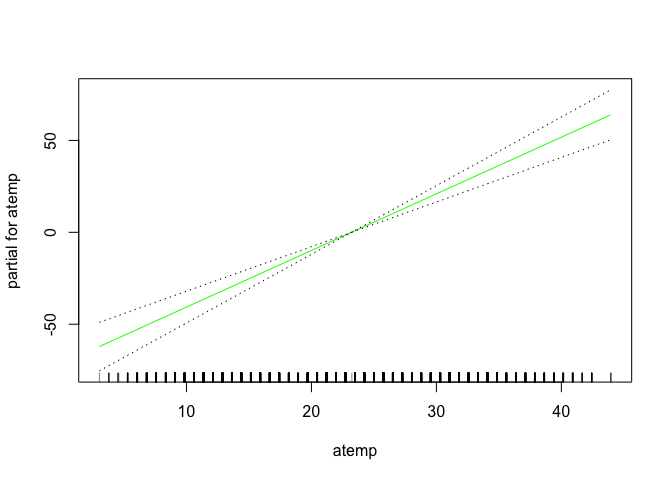

    ## [1] 3834   16
    ## 
    ## Call: gam(formula = as.formula(formula_string_2), data = trainset)
    ## Deviance Residuals:
    ##      Min       1Q   Median       3Q      Max 
    ## -252.527  -41.165   -6.669   35.574  251.692 
    ## 
    ## (Dispersion Parameter for gaussian family taken to be 5157.927)
    ## 
    ##     Null Deviance: 65998105 on 3833 degrees of freedom
    ## Residual Deviance: 19517595 on 3784 degrees of freedom
    ## AIC: 43706.24 
    ## 
    ## Number of Local Scoring Iterations: 2 
    ## 
    ## Anova for Parametric Effects
    ##                      Df   Sum Sq Mean Sq  F value    Pr(>F)    
    ## weather               2  1231616  615808 119.3906 < 2.2e-16 ***
    ## typeofday             2    41506   20753   4.0235  0.017967 *  
    ## wday                  5    40726    8145   1.5792  0.162363    
    ## hour                 23 34967678 1520334 294.7568 < 2.2e-16 ***
    ## monf                 11  8939370  812670 157.5575 < 2.2e-16 ***
    ## poly(atemp, 2)        2   799574  399787  77.5092 < 2.2e-16 ***
    ## poly(humidity, 2)     2   396136  198068  38.4007 < 2.2e-16 ***
    ## poly(windspeed, 2)    2    63905   31952   6.1948  0.002061 ** 
    ## Residuals          3784 19517595    5158                       
    ## ---
    ## Signif. codes:  0 '***' 0.001 '**' 0.01 '*' 0.05 '.' 0.1 ' ' 1
    ## 
    ## 
    ## Call: gam(formula = as.formula(formula_string_3), data = trainset)
    ## Deviance Residuals:
    ##      Min       1Q   Median       3Q      Max 
    ## -256.018  -41.863   -7.184   35.533  250.595 
    ## 
    ## (Dispersion Parameter for gaussian family taken to be 5077.816)
    ## 
    ##     Null Deviance: 65998105 on 3833 degrees of freedom
    ## Residual Deviance: 19199223 on 3781 degrees of freedom
    ## AIC: 43649.18 
    ## 
    ## Number of Local Scoring Iterations: 2 
    ## 
    ## Anova for Parametric Effects
    ##                      Df   Sum Sq Mean Sq  F value    Pr(>F)    
    ## weather               2  1231616  615808 121.2741 < 2.2e-16 ***
    ## typeofday             2    41506   20753   4.0870 0.0168640 *  
    ## wday                  5    40726    8145   1.6041 0.1554082    
    ## hour                 23 34967678 1520334 299.4070 < 2.2e-16 ***
    ## monf                 11  8939370  812670 160.0432 < 2.2e-16 ***
    ## poly(atemp, 3)        3  1140389  380130  74.8608 < 2.2e-16 ***
    ## poly(humidity, 3)     3   344258  114753  22.5988 1.693e-14 ***
    ## poly(windspeed, 3)    3    93340   31113   6.1273 0.0003743 ***
    ## Residuals          3781 19199223    5078                       
    ## ---
    ## Signif. codes:  0 '***' 0.001 '**' 0.01 '*' 0.05 '.' 0.1 ' ' 1
    ## 
    ## 
    ## Call: gam(formula = as.formula(formula_string_4), data = trainset)
    ## Deviance Residuals:
    ##      Min       1Q   Median       3Q      Max 
    ## -260.755  -41.494   -6.222   35.887  248.974 
    ## 
    ## (Dispersion Parameter for gaussian family taken to be 5041.718)
    ## 
    ##     Null Deviance: 65998105 on 3833 degrees of freedom
    ## Residual Deviance: 19047610 on 3778 degrees of freedom
    ## AIC: 43624.78 
    ## 
    ## Number of Local Scoring Iterations: 2 
    ## 
    ## Anova for Parametric Effects
    ##                      Df   Sum Sq Mean Sq  F value    Pr(>F)    
    ## weather               2  1231616  615808 122.1425 < 2.2e-16 ***
    ## typeofday             2    41506   20753   4.1162  0.016379 *  
    ## wday                  5    40726    8145   1.6156  0.152292    
    ## hour                 23 34967678 1520334 301.5508 < 2.2e-16 ***
    ## monf                 11  8939370  812670 161.1891 < 2.2e-16 ***
    ## poly(atemp, 4)        4  1346207  336552  66.7534 < 2.2e-16 ***
    ## poly(humidity, 4)     4   302516   75629  15.0007 3.612e-12 ***
    ## poly(windspeed, 4)    4    80875   20219   4.0103  0.003004 ** 
    ## Residuals          3778 19047610    5042                       
    ## ---
    ## Signif. codes:  0 '***' 0.001 '**' 0.01 '*' 0.05 '.' 0.1 ' ' 1
    ## 
    ## 
    ## Call: gam(formula = as.formula(formula_string_5), data = trainset)
    ## Deviance Residuals:
    ##     Min      1Q  Median      3Q     Max 
    ## -258.40  -41.20   -6.53   35.31  246.66 
    ## 
    ## (Dispersion Parameter for gaussian family taken to be 5029.272)
    ## 
    ##     Null Deviance: 65998105 on 3833 degrees of freedom
    ## Residual Deviance: 18985501 on 3775 degrees of freedom
    ## AIC: 43618.26 
    ## 
    ## Number of Local Scoring Iterations: 2 
    ## 
    ## Anova for Parametric Effects
    ##                      Df   Sum Sq Mean Sq  F value    Pr(>F)    
    ## weather               2  1231616  615808 122.4447 < 2.2e-16 ***
    ## typeofday             2    41506   20753   4.1264  0.016213 *  
    ## wday                  5    40726    8145   1.6196  0.151220    
    ## hour                 23 34967678 1520334 302.2970 < 2.2e-16 ***
    ## monf                 11  8939370  812670 161.5880 < 2.2e-16 ***
    ## poly(atemp, 5)        5  1413443  282689  56.2086 < 2.2e-16 ***
    ## poly(humidity, 5)     5   296298   59260  11.7829 2.501e-11 ***
    ## poly(windspeed, 5)    5    81968   16394   3.2596  0.006115 ** 
    ## Residuals          3775 18985501    5029                       
    ## ---
    ## Signif. codes:  0 '***' 0.001 '**' 0.01 '*' 0.05 '.' 0.1 ' ' 1
    ## 
    ## Analysis of Deviance Table
    ## 
    ## Model 1: count ~ weather + typeofday + wday + hour + monf + poly(atemp, 
    ##     2) + poly(humidity, 2) + poly(windspeed, 2)
    ## Model 2: count ~ weather + typeofday + wday + hour + monf + poly(atemp, 
    ##     3) + poly(humidity, 3) + poly(windspeed, 3)
    ## Model 3: count ~ weather + typeofday + wday + hour + monf + poly(atemp, 
    ##     4) + poly(humidity, 4) + poly(windspeed, 4)
    ## Model 4: count ~ weather + typeofday + wday + hour + monf + poly(atemp, 
    ##     5) + poly(humidity, 5) + poly(windspeed, 5)
    ##   Resid. Df Resid. Dev Df Deviance  Pr(>Chi)    
    ## 1      3784   19517595                          
    ## 2      3781   19199223  3   318372 1.156e-13 ***
    ## 3      3778   19047610  3   151613 1.286e-06 ***
    ## 4      3775   18985501  3    62109  0.006277 ** 
    ## ---
    ## Signif. codes:  0 '***' 0.001 '**' 0.01 '*' 0.05 '.' 0.1 ' ' 1

    ## Warning in predict.lm(object, newdata, se.fit, scale = 1, type =
    ## ifelse(type == : prediction from a rank-deficient fit may be misleading

    ## Warning in predict.lm(object, newdata, se.fit, scale = 1, type =
    ## ifelse(type == : prediction from a rank-deficient fit may be misleading

    ## dataset= 111.11 model=gam_poly trainerror= 5007.622 testerror= 5618.93[1] "count~weather+typeofday+wday+hour+monf+s(atemp)+s(humidity)+s(windspeed)"

    ## Warning in predict.lm(object, newdata, se.fit, scale = 1, type =
    ## ifelse(type == : prediction from a rank-deficient fit may be misleading

    ## Warning in predict.lm(object, newdata, se.fit, scale = 1, type =
    ## ifelse(type == : prediction from a rank-deficient fit may be misleading


    ## dataset= 111.11 model=gam_s trainerror= 4988.148 testerror= 5579.213
    ## Call: gam(formula = as.formula(formula_string), data = trainset)
    ## Deviance Residuals:
    ##      Min       1Q   Median       3Q      Max 
    ## -255.384  -41.122   -6.636   35.157  247.931 
    ## 
    ## (Dispersion Parameter for gaussian family taken to be 5062.104)
    ## 
    ##     Null Deviance: 65998105 on 3833 degrees of freedom
    ## Residual Deviance: 19124626 on 3778 degrees of freedom
    ## AIC: 43640.25 
    ## 
    ## Number of Local Scoring Iterations: 2 
    ## 
    ## Anova for Parametric Effects
    ##                Df   Sum Sq Mean Sq  F value    Pr(>F)    
    ## weather         2   795914  397957  78.6150 < 2.2e-16 ***
    ## typeofday       2    38908   19454   3.8431  0.021511 *  
    ## wday            5    37053    7411   1.4639  0.198210    
    ## hour           23 34929162 1518659 300.0056 < 2.2e-16 ***
    ## monf           11  9244038  840367 166.0114 < 2.2e-16 ***
    ## s(atemp)        1   840123  840123 165.9633 < 2.2e-16 ***
    ## s(humidity)     1   206026  206026  40.6996  1.99e-10 ***
    ## s(windspeed)    1    37605   37605   7.4287  0.006449 ** 
    ## Residuals    3778 19124626    5062                       
    ## ---
    ## Signif. codes:  0 '***' 0.001 '**' 0.01 '*' 0.05 '.' 0.1 ' ' 1
    ## 
    ## Anova for Nonparametric Effects
    ##              Npar Df Npar F     Pr(F)    
    ## (Intercept)                              
    ## weather                                  
    ## typeofday                                
    ## wday                                     
    ## hour                                     
    ## monf                                     
    ## s(atemp)           3 35.557 < 2.2e-16 ***
    ## s(humidity)        3 10.409  8.08e-07 ***
    ## s(windspeed)       3  3.016   0.02877 *  
    ## ---
    ## Signif. codes:  0 '***' 0.001 '**' 0.01 '*' 0.05 '.' 0.1 ' ' 1


    ## [1] "count~weather+typeofday+wday+hour+monf+atemp+humidity+windspeed"
    ##             %IncMSE IncNodePurity
    ## weather    32.40031       1219007
    ## typeofday  43.31054       1732423
    ## wday       40.90645       2686671
    ## hour      115.51690      33015297
    ## monf       62.76200       7719401
    ## atemp      49.90184       9569956
    ## humidity   44.19173       5240304
    ## windspeed  20.63566       2045904


    ## dataset= 111.11 model=rf trainerror= 536.6615 testerror= 2171.408

    ##                 var   rel.inf
    ## hour           hour 57.807626
    ## monf           monf 15.425976
    ## atemp         atemp  8.636512
    ## typeofday typeofday  7.396906
    ## wday           wday  3.976771
    ## humidity   humidity  3.404048
    ## weather     weather  2.215102
    ## windspeed windspeed  1.137058
    ## dataset= 111.11 model=boost trainerror= 121.5477 testerror= 1087.168[1] 5422   16
    ## [1] "111.11"
    ##      dataset  model      trainerror testerror
    ## [1,] "111.11" "lm"       5203.057   5805.046 
    ## [2,] "111.11" "gam_lm"   5203.057   5805.046 
    ## [3,] "111.11" "gam_poly" 5007.622   5618.93  
    ## [4,] "111.11" "gam_s"    4988.148   5579.213 
    ## [5,] "111.11" "rf"       536.6615   2171.408 
    ## [6,] "111.11" "boost"    121.5477   1087.168 
    ## [1] "model with lowest test error"
    ##   dataset model trainerror testerror
    ## 6  111.11 boost   121.5477  1087.168

    ## Warning in createDataPartition(dataset$partgroup, p = 0.7, list = F):
    ## Some classes have a single record ( Light Rain/Snow_Weekend_11, Snow/Heavy
    ## Rain_Working Day_0 ) and these will be selected for the sample

    ## [1] "weather+typeofday+wday+hour+yearf+monf"
    ## [1] "count~weather+typeofday+wday+hour+yearf+monf+atemp+humidity+windspeed"

    ## Warning in predict.lm(fit_lm, newdata = trainset): prediction from a rank-
    ## deficient fit may be misleading

    ## Warning in predict.lm(fit_lm, newdata = testset): prediction from a rank-
    ## deficient fit may be misleading


    ## dataset= 112.0 model=lm trainerror= 5334.018 testerror= 5462.205

    ## Warning in sqrt(crit * p * (1 - hh)/hh): NaNs produced

    ## Warning in sqrt(crit * p * (1 - hh)/hh): NaNs produced

    ## [1] "count~weather+typeofday+wday+hour+yearf+monf+atemp+humidity+windspeed"
    ## 
    ## Call: gam(formula = as.formula(formula_string), data = trainset)
    ## Deviance Residuals:
    ##      Min       1Q   Median       3Q      Max 
    ## -250.956  -43.985   -7.275   38.884  306.121 
    ## 
    ## (Dispersion Parameter for gaussian family taken to be 5397.689)
    ## 
    ##     Null Deviance: 73716973 on 4153 degrees of freedom
    ## Residual Deviance: 22157511 on 4105 degrees of freedom
    ## AIC: 47537.59 
    ## 
    ## Number of Local Scoring Iterations: 2 
    ## 
    ## Anova for Parametric Effects
    ##             Df   Sum Sq Mean Sq  F value    Pr(>F)    
    ## weather      3  1381830  460610  85.3346 < 2.2e-16 ***
    ## typeofday    2    19084    9542   1.7678 0.1708382    
    ## wday         5   138763   27753   5.1416 0.0001049 ***
    ## hour        23 39518253 1718185 318.3186 < 2.2e-16 ***
    ## yearf        1   140245  140245  25.9824 3.601e-07 ***
    ## monf        11  9243920  840356 155.6882 < 2.2e-16 ***
    ## atemp        1   794197  794197 147.1366 < 2.2e-16 ***
    ## humidity     1   307102  307102  56.8951 5.627e-14 ***
    ## windspeed    1    16068   16068   2.9769 0.0845358 .  
    ## Residuals 4105 22157511    5398                       
    ## ---
    ## Signif. codes:  0 '***' 0.001 '**' 0.01 '*' 0.05 '.' 0.1 ' ' 1

    ## Warning in predict.lm(object, newdata, se.fit, scale = 1, type =
    ## ifelse(type == : prediction from a rank-deficient fit may be misleading

    ## Warning in predict.lm(object, newdata, se.fit, scale = 1, type =
    ## ifelse(type == : prediction from a rank-deficient fit may be misleading


    ## dataset= 112.0 model=gam_lm trainerror= 5334.018 testerror= 5462.205


    ## [1] 4154   16
    ## 
    ## Call: gam(formula = as.formula(formula_string_2), data = trainset)
    ## Deviance Residuals:
    ##      Min       1Q   Median       3Q      Max 
    ## -249.992  -42.396   -7.061   37.885  311.778 
    ## 
    ## (Dispersion Parameter for gaussian family taken to be 5278.588)
    ## 
    ##     Null Deviance: 73716973 on 4153 degrees of freedom
    ## Residual Deviance: 21652768 on 4102 degrees of freedom
    ## AIC: 47447.87 
    ## 
    ## Number of Local Scoring Iterations: 2 
    ## 
    ## Anova for Parametric Effects
    ##                      Df   Sum Sq Mean Sq  F value    Pr(>F)    
    ## weather               3  1381830  460610  87.2600 < 2.2e-16 ***
    ## typeofday             2    19084    9542   1.8077 0.1641639    
    ## wday                  5   138763   27753   5.2576 8.111e-05 ***
    ## hour                 23 39518253 1718185 325.5008 < 2.2e-16 ***
    ## yearf                 1   140245  140245  26.5686 2.663e-07 ***
    ## monf                 11  9243920  840356 159.2010 < 2.2e-16 ***
    ## poly(atemp, 2)        2  1135248  567624 107.5333 < 2.2e-16 ***
    ## poly(humidity, 2)     2   401529  200765  38.0338 < 2.2e-16 ***
    ## poly(windspeed, 2)    2    85333   42667   8.0830 0.0003137 ***
    ## Residuals          4102 21652768    5279                       
    ## ---
    ## Signif. codes:  0 '***' 0.001 '**' 0.01 '*' 0.05 '.' 0.1 ' ' 1
    ## 
    ## 
    ## Call: gam(formula = as.formula(formula_string_3), data = trainset)
    ## Deviance Residuals:
    ##      Min       1Q   Median       3Q      Max 
    ## -252.935  -43.541   -7.291   37.980  306.689 
    ## 
    ## (Dispersion Parameter for gaussian family taken to be 5246.023)
    ## 
    ##     Null Deviance: 73716973 on 4153 degrees of freedom
    ## Residual Deviance: 21503450 on 4099 degrees of freedom
    ## AIC: 47425.12 
    ## 
    ## Number of Local Scoring Iterations: 2 
    ## 
    ## Anova for Parametric Effects
    ##                      Df   Sum Sq Mean Sq  F value    Pr(>F)    
    ## weather               3  1381830  460610  87.8017 < 2.2e-16 ***
    ## typeofday             2    19084    9542   1.8189 0.1623338    
    ## wday                  5   138763   27753   5.2902 7.544e-05 ***
    ## hour                 23 39518253 1718185 327.5214 < 2.2e-16 ***
    ## yearf                 1   140245  140245  26.7335 2.447e-07 ***
    ## monf                 11  9243920  840356 160.1892 < 2.2e-16 ***
    ## poly(atemp, 3)        3  1296363  432121  82.3711 < 2.2e-16 ***
    ## poly(humidity, 3)     3   374436  124812  23.7917 2.921e-15 ***
    ## poly(windspeed, 3)    3   100631   33544   6.3941 0.0002558 ***
    ## Residuals          4099 21503450    5246                       
    ## ---
    ## Signif. codes:  0 '***' 0.001 '**' 0.01 '*' 0.05 '.' 0.1 ' ' 1
    ## 
    ## 
    ## Call: gam(formula = as.formula(formula_string_4), data = trainset)
    ## Deviance Residuals:
    ##      Min       1Q   Median       3Q      Max 
    ## -257.619  -42.979   -6.895   37.938  313.377 
    ## 
    ## (Dispersion Parameter for gaussian family taken to be 5197.818)
    ## 
    ##     Null Deviance: 73716973 on 4153 degrees of freedom
    ## Residual Deviance: 21290263 on 4096 degrees of freedom
    ## AIC: 47389.73 
    ## 
    ## Number of Local Scoring Iterations: 2 
    ## 
    ## Anova for Parametric Effects
    ##                      Df   Sum Sq Mean Sq  F value    Pr(>F)    
    ## weather               3  1381830  460610  88.6160 < 2.2e-16 ***
    ## typeofday             2    19084    9542   1.8358  0.159621    
    ## wday                  5   138763   27753   5.3393 6.764e-05 ***
    ## hour                 23 39518253 1718185 330.5589 < 2.2e-16 ***
    ## yearf                 1   140245  140245  26.9815 2.154e-07 ***
    ## monf                 11  9243920  840356 161.6748 < 2.2e-16 ***
    ## poly(atemp, 4)        4  1563079  390770  75.1796 < 2.2e-16 ***
    ## poly(humidity, 4)     4   327739   81935  15.7633 8.285e-13 ***
    ## poly(windspeed, 4)    4    93797   23449   4.5114  0.001228 ** 
    ## Residuals          4096 21290263    5198                       
    ## ---
    ## Signif. codes:  0 '***' 0.001 '**' 0.01 '*' 0.05 '.' 0.1 ' ' 1
    ## 
    ## 
    ## Call: gam(formula = as.formula(formula_string_5), data = trainset)
    ## Deviance Residuals:
    ##     Min      1Q  Median      3Q     Max 
    ## -255.30  -42.85   -6.56   37.77  316.54 
    ## 
    ## (Dispersion Parameter for gaussian family taken to be 5179.647)
    ## 
    ##     Null Deviance: 73716973 on 4153 degrees of freedom
    ## Residual Deviance: 21200294 on 4093 degrees of freedom
    ## AIC: 47378.14 
    ## 
    ## Number of Local Scoring Iterations: 2 
    ## 
    ## Anova for Parametric Effects
    ##                      Df   Sum Sq Mean Sq  F value    Pr(>F)    
    ## weather               3  1381830  460610  88.9269 < 2.2e-16 ***
    ## typeofday             2    19084    9542   1.8422  0.158597    
    ## wday                  5   138763   27753   5.3580 6.488e-05 ***
    ## hour                 23 39518253 1718185 331.7186 < 2.2e-16 ***
    ## yearf                 1   140245  140245  27.0761 2.052e-07 ***
    ## monf                 11  9243920  840356 162.2420 < 2.2e-16 ***
    ## poly(atemp, 5)        5  1652877  330575  63.8220 < 2.2e-16 ***
    ## poly(humidity, 5)     5   316011   63202  12.2020 9.214e-12 ***
    ## poly(windspeed, 5)    5   105697   21139   4.0812  0.001068 ** 
    ## Residuals          4093 21200294    5180                       
    ## ---
    ## Signif. codes:  0 '***' 0.001 '**' 0.01 '*' 0.05 '.' 0.1 ' ' 1
    ## 
    ## Analysis of Deviance Table
    ## 
    ## Model 1: count ~ weather + typeofday + wday + hour + yearf + monf + poly(atemp, 
    ##     2) + poly(humidity, 2) + poly(windspeed, 2)
    ## Model 2: count ~ weather + typeofday + wday + hour + yearf + monf + poly(atemp, 
    ##     3) + poly(humidity, 3) + poly(windspeed, 3)
    ## Model 3: count ~ weather + typeofday + wday + hour + yearf + monf + poly(atemp, 
    ##     4) + poly(humidity, 4) + poly(windspeed, 4)
    ## Model 4: count ~ weather + typeofday + wday + hour + yearf + monf + poly(atemp, 
    ##     5) + poly(humidity, 5) + poly(windspeed, 5)
    ##   Resid. Df Resid. Dev Df Deviance  Pr(>Chi)    
    ## 1      4102   21652768                          
    ## 2      4099   21503450  3   149319 2.434e-06 ***
    ## 3      4096   21290263  3   213187 6.052e-09 ***
    ## 4      4093   21200294  3    89969 0.0005931 ***
    ## ---
    ## Signif. codes:  0 '***' 0.001 '**' 0.01 '*' 0.05 '.' 0.1 ' ' 1

    ## Warning in predict.lm(object, newdata, se.fit, scale = 1, type =
    ## ifelse(type == : prediction from a rank-deficient fit may be misleading

    ## Warning in predict.lm(object, newdata, se.fit, scale = 1, type =
    ## ifelse(type == : prediction from a rank-deficient fit may be misleading

    ## dataset= 112.0 model=gam_poly trainerror= 5176.565 testerror= 5331.284[1] "count~weather+typeofday+wday+hour+yearf+monf+s(atemp)+s(humidity)+s(windspeed)"

    ## Warning in predict.lm(object, newdata, se.fit, scale = 1, type =
    ## ifelse(type == : prediction from a rank-deficient fit may be misleading

    ## Warning in predict.lm(object, newdata, se.fit, scale = 1, type =
    ## ifelse(type == : prediction from a rank-deficient fit may be misleading


    ## dataset= 112.0 model=gam_s trainerror= 5140.638 testerror= 5315.241
    ## Call: gam(formula = as.formula(formula_string), data = trainset)
    ## Deviance Residuals:
    ##      Min       1Q   Median       3Q      Max 
    ## -253.615  -42.785   -6.839   37.849  314.112 
    ## 
    ## (Dispersion Parameter for gaussian family taken to be 5213.42)
    ## 
    ##     Null Deviance: 73716973 on 4153 degrees of freedom
    ## Residual Deviance: 21354171 on 4096 degrees of freedom
    ## AIC: 47402.18 
    ## 
    ## Number of Local Scoring Iterations: 2 
    ## 
    ## Anova for Parametric Effects
    ##                Df   Sum Sq Mean Sq  F value    Pr(>F)    
    ## weather         3   878323  292774  56.1578 < 2.2e-16 ***
    ## typeofday       2    35332   17666   3.3885   0.03385 *  
    ## wday            5   143417   28683   5.5019 4.709e-05 ***
    ## hour           23 39208822 1704731 326.9891 < 2.2e-16 ***
    ## yearf           1   196258  196258  37.6448 9.291e-10 ***
    ## monf           11  9247902  840718 161.2604 < 2.2e-16 ***
    ## s(atemp)        1  1201863 1201863 230.5325 < 2.2e-16 ***
    ## s(humidity)     1   229666  229666  44.0528 3.614e-11 ***
    ## s(windspeed)    1    21878   21878   4.1965   0.04057 *  
    ## Residuals    4096 21354171    5213                       
    ## ---
    ## Signif. codes:  0 '***' 0.001 '**' 0.01 '*' 0.05 '.' 0.1 ' ' 1
    ## 
    ## Anova for Nonparametric Effects
    ##              Npar Df Npar F     Pr(F)    
    ## (Intercept)                              
    ## weather                                  
    ## typeofday                                
    ## wday                                     
    ## hour                                     
    ## yearf                                    
    ## monf                                     
    ## s(atemp)           3 31.674 < 2.2e-16 ***
    ## s(humidity)        3  9.433 3.288e-06 ***
    ## s(windspeed)       3  5.385  0.001069 ** 
    ## ---
    ## Signif. codes:  0 '***' 0.001 '**' 0.01 '*' 0.05 '.' 0.1 ' ' 1

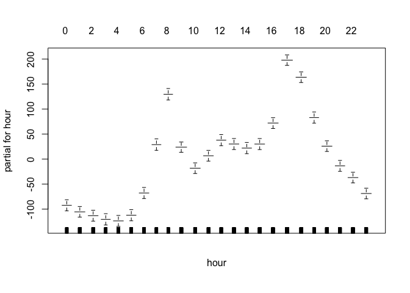

    ## [1] "count~weather+typeofday+wday+hour+yearf+monf+atemp+humidity+windspeed"
    ##             %IncMSE IncNodePurity
    ## weather    33.57787     1285886.0
    ## typeofday  48.20539     2391911.7
    ## wday       44.84553     3185564.1
    ## hour      150.05592    38910707.7
    ## yearf      29.70168      590359.9
    ## monf       61.51053     7722601.2
    ## atemp      57.93976    10574679.1
    ## humidity   46.12230     5352190.7
    ## windspeed  21.81859     1965026.0


    ## dataset= 112.0 model=rf trainerror= 410.9575 testerror= 1726.128

    ##                 var    rel.inf
    ## hour           hour 58.2948776
    ## monf           monf 13.3182751
    ## atemp         atemp  9.5027718
    ## typeofday typeofday  7.2964691
    ## wday           wday  3.7775281
    ## humidity   humidity  3.5266234
    ## weather     weather  2.2929139
    ## windspeed windspeed  1.1025023
    ## yearf         yearf  0.8880386
    ## dataset= 112.0 model=boost trainerror= 146.5463 testerror= 1201.142[1] 5875   16
    ## [1] "112.0"
    ##      dataset model      trainerror testerror
    ## [1,] "112.0" "lm"       5334.018   5462.205 
    ## [2,] "112.0" "gam_lm"   5334.018   5462.205 
    ## [3,] "112.0" "gam_poly" 5176.565   5331.284 
    ## [4,] "112.0" "gam_s"    5140.638   5315.241 
    ## [5,] "112.0" "rf"       410.9575   1726.128 
    ## [6,] "112.0" "boost"    146.5463   1201.142 
    ## [1] "model with lowest test error"
    ##   dataset model trainerror testerror
    ## 6   112.0 boost   146.5463  1201.142

    ## Warning in createDataPartition(dataset$partgroup, p = 0.7, list = F):
    ## Some classes have a single record ( Light Rain/Snow_Weekend_11, Snow/Heavy
    ## Rain_Working Day_0 ) and these will be selected for the sample

    ## [1] "weather+typeofday+wday+hour+yearf+monf"
    ## [1] "count~weather+typeofday+wday+hour+yearf+monf+atemp+humidity+windspeed"

    ## Warning in predict.lm(fit_lm, newdata = trainset): prediction from a rank-
    ## deficient fit may be misleading

    ## Warning in predict.lm(fit_lm, newdata = testset): prediction from a rank-
    ## deficient fit may be misleading

    ## dataset= 112.1 model=lm trainerror= 5385.275 testerror= 5486.682

    ## Warning: not plotting observations with leverage one:
    ##   3996


    ## Warning: not plotting observations with leverage one:
    ##   3996

    ## [1] "count~weather+typeofday+wday+hour+yearf+monf+atemp+humidity+windspeed"
    ## 
    ## Call: gam(formula = as.formula(formula_string), data = trainset)
    ## Deviance Residuals:
    ##     Min      1Q  Median      3Q     Max 
    ## -258.55  -43.20   -7.48   37.85  302.09 
    ## 
    ## (Dispersion Parameter for gaussian family taken to be 5444.949)
    ## 
    ##     Null Deviance: 78006604 on 4470 degrees of freedom
    ## Residual Deviance: 24077566 on 4422 degrees of freedom
    ## AIC: 51200.4 
    ## 
    ## Number of Local Scoring Iterations: 2 
    ## 
    ## Anova for Parametric Effects
    ##             Df   Sum Sq Mean Sq  F value    Pr(>F)    
    ## weather      3  1538861  512954  94.2072 < 2.2e-16 ***
    ## typeofday    2    12948    6474   1.1890   0.30462    
    ## wday         5   165457   33091   6.0774 1.291e-05 ***
    ## hour        23 41623601 1809722 332.3671 < 2.2e-16 ***
    ## yearf        1    32976   32976   6.0563   0.01389 *  
    ## monf        11  9404408  854946 157.0164 < 2.2e-16 ***
    ## atemp        1   824842  824842 151.4875 < 2.2e-16 ***
    ## humidity     1   290356  290356  53.3258 3.334e-13 ***
    ## windspeed    1    35589   35589   6.5362   0.01060 *  
    ## Residuals 4422 24077566    5445                       
    ## ---
    ## Signif. codes:  0 '***' 0.001 '**' 0.01 '*' 0.05 '.' 0.1 ' ' 1

    ## Warning in predict.lm(object, newdata, se.fit, scale = 1, type =
    ## ifelse(type == : prediction from a rank-deficient fit may be misleading

    ## Warning in predict.lm(object, newdata, se.fit, scale = 1, type =
    ## ifelse(type == : prediction from a rank-deficient fit may be misleading


    ## dataset= 112.1 model=gam_lm trainerror= 5385.275 testerror= 5486.682


    ## [1] 4471   16
    ## 
    ## Call: gam(formula = as.formula(formula_string_2), data = trainset)
    ## Deviance Residuals:
    ##      Min       1Q   Median       3Q      Max 
    ## -262.123  -41.755   -6.986   36.704  305.930 
    ## 
    ## (Dispersion Parameter for gaussian family taken to be 5342.882)
    ## 
    ##     Null Deviance: 78006604 on 4470 degrees of freedom
    ## Residual Deviance: 23610195 on 4419 degrees of freedom
    ## AIC: 51118.76 
    ## 
    ## Number of Local Scoring Iterations: 2 
    ## 
    ## Anova for Parametric Effects
    ##                      Df   Sum Sq Mean Sq  F value    Pr(>F)    
    ## weather               3  1538861  512954  96.0069 < 2.2e-16 ***
    ## typeofday             2    12948    6474   1.2117   0.29778    
    ## wday                  5   165457   33091   6.1935 9.937e-06 ***
    ## hour                 23 41623601 1809722 338.7164 < 2.2e-16 ***
    ## yearf                 1    32976   32976   6.1720   0.01302 *  
    ## monf                 11  9404408  854946 160.0159 < 2.2e-16 ***
    ## poly(atemp, 2)        2  1041614  520807  97.4768 < 2.2e-16 ***
    ## poly(humidity, 2)     2   454719  227360  42.5538 < 2.2e-16 ***
    ## poly(windspeed, 2)    2   121825   60913  11.4007 1.152e-05 ***
    ## Residuals          4419 23610195    5343                       
    ## ---
    ## Signif. codes:  0 '***' 0.001 '**' 0.01 '*' 0.05 '.' 0.1 ' ' 1
    ## 
    ## 
    ## Call: gam(formula = as.formula(formula_string_3), data = trainset)
    ## Deviance Residuals:
    ##      Min       1Q   Median       3Q      Max 
    ## -278.330  -42.993   -6.601   36.837  299.925 
    ## 
    ## (Dispersion Parameter for gaussian family taken to be 5314.945)
    ## 
    ##     Null Deviance: 78006604 on 4470 degrees of freedom
    ## Residual Deviance: 23470798 on 4416 degrees of freedom
    ## AIC: 51098.29 
    ## 
    ## Number of Local Scoring Iterations: 2 
    ## 
    ## Anova for Parametric Effects
    ##                      Df   Sum Sq Mean Sq  F value    Pr(>F)    
    ## weather               3  1538861  512954  96.5115 < 2.2e-16 ***
    ## typeofday             2    12948    6474   1.2181   0.29589    
    ## wday                  5   165457   33091   6.2261 9.233e-06 ***
    ## hour                 23 41623601 1809722 340.4968 < 2.2e-16 ***
    ## yearf                 1    32976   32976   6.2044   0.01278 *  
    ## monf                 11  9404408  854946 160.8570 < 2.2e-16 ***
    ## poly(atemp, 3)        3  1179581  393194  73.9789 < 2.2e-16 ***
    ## poly(humidity, 3)     3   426279  142093  26.7346 < 2.2e-16 ***
    ## poly(windspeed, 3)    3   151695   50565   9.5137 2.918e-06 ***
    ## Residuals          4416 23470798    5315                       
    ## ---
    ## Signif. codes:  0 '***' 0.001 '**' 0.01 '*' 0.05 '.' 0.1 ' ' 1
    ## 
    ## 
    ## Call: gam(formula = as.formula(formula_string_4), data = trainset)
    ## Deviance Residuals:
    ##      Min       1Q   Median       3Q      Max 
    ## -267.419  -42.206   -6.111   36.925  304.301 
    ## 
    ## (Dispersion Parameter for gaussian family taken to be 5270.423)
    ## 
    ##     Null Deviance: 78006604 on 4470 degrees of freedom
    ## Residual Deviance: 23258379 on 4413 degrees of freedom
    ## AIC: 51063.64 
    ## 
    ## Number of Local Scoring Iterations: 2 
    ## 
    ## Anova for Parametric Effects
    ##                      Df   Sum Sq Mean Sq  F value    Pr(>F)    
    ## weather               3  1538861  512954  97.3268 < 2.2e-16 ***
    ## typeofday             2    12948    6474   1.2284 0.2928655    
    ## wday                  5   165457   33091   6.2787 8.199e-06 ***
    ## hour                 23 41623601 1809722 343.3731 < 2.2e-16 ***
    ## yearf                 1    32976   32976   6.2568 0.0124075 *  
    ## monf                 11  9404408  854946 162.2158 < 2.2e-16 ***
    ## poly(atemp, 4)        4  1457125  364281  69.1180 < 2.2e-16 ***
    ## poly(humidity, 4)     4   391668   97917  18.5786 3.730e-15 ***
    ## poly(windspeed, 4)    4   121182   30295   5.7482 0.0001303 ***
    ## Residuals          4413 23258379    5270                       
    ## ---
    ## Signif. codes:  0 '***' 0.001 '**' 0.01 '*' 0.05 '.' 0.1 ' ' 1
    ## 
    ## 
    ## Call: gam(formula = as.formula(formula_string_5), data = trainset)
    ## Deviance Residuals:
    ##      Min       1Q   Median       3Q      Max 
    ## -265.763  -41.524   -6.779   37.055  307.511 
    ## 
    ## (Dispersion Parameter for gaussian family taken to be 5254.932)
    ## 
    ##     Null Deviance: 78006604 on 4470 degrees of freedom
    ## Residual Deviance: 23174249 on 4410 degrees of freedom
    ## AIC: 51053.44 
    ## 
    ## Number of Local Scoring Iterations: 2 
    ## 
    ## Anova for Parametric Effects
    ##                      Df   Sum Sq Mean Sq  F value    Pr(>F)    
    ## weather               3  1538861  512954  97.6137 < 2.2e-16 ***
    ## typeofday             2    12948    6474   1.2320 0.2918075    
    ## wday                  5   165457   33091   6.2972 7.863e-06 ***
    ## hour                 23 41623601 1809722 344.3854 < 2.2e-16 ***
    ## yearf                 1    32976   32976   6.2753 0.0122792 *  
    ## monf                 11  9404408  854946 162.6941 < 2.2e-16 ***
    ## poly(atemp, 5)        5  1552426  310485  59.0845 < 2.2e-16 ***
    ## poly(humidity, 5)     5   378189   75638  14.3937 5.209e-14 ***
    ## poly(windspeed, 5)    5   123490   24698   4.7000 0.0002774 ***
    ## Residuals          4410 23174249    5255                       
    ## ---
    ## Signif. codes:  0 '***' 0.001 '**' 0.01 '*' 0.05 '.' 0.1 ' ' 1
    ## 
    ## Analysis of Deviance Table
    ## 
    ## Model 1: count ~ weather + typeofday + wday + hour + yearf + monf + poly(atemp, 
    ##     2) + poly(humidity, 2) + poly(windspeed, 2)
    ## Model 2: count ~ weather + typeofday + wday + hour + yearf + monf + poly(atemp, 
    ##     3) + poly(humidity, 3) + poly(windspeed, 3)
    ## Model 3: count ~ weather + typeofday + wday + hour + yearf + monf + poly(atemp, 
    ##     4) + poly(humidity, 4) + poly(windspeed, 4)
    ## Model 4: count ~ weather + typeofday + wday + hour + yearf + monf + poly(atemp, 
    ##     5) + poly(humidity, 5) + poly(windspeed, 5)
    ##   Resid. Df Resid. Dev Df Deviance  Pr(>Chi)    
    ## 1      4419   23610195                          
    ## 2      4416   23470798  3   139396 7.398e-06 ***
    ## 3      4413   23258379  3   212419 8.668e-09 ***
    ## 4      4410   23174249  3    84130  0.001129 ** 
    ## ---
    ## Signif. codes:  0 '***' 0.001 '**' 0.01 '*' 0.05 '.' 0.1 ' ' 1

    ## Warning in predict.lm(object, newdata, se.fit, scale = 1, type =
    ## ifelse(type == : prediction from a rank-deficient fit may be misleading

    ## Warning in predict.lm(object, newdata, se.fit, scale = 1, type =
    ## ifelse(type == : prediction from a rank-deficient fit may be misleading

    ## dataset= 112.1 model=gam_poly trainerror= 5249.564 testerror= 5389.844[1] "count~weather+typeofday+wday+hour+yearf+monf+s(atemp)+s(humidity)+s(windspeed)"

    ## Warning in predict.lm(object, newdata, se.fit, scale = 1, type =
    ## ifelse(type == : prediction from a rank-deficient fit may be misleading

    ## Warning in predict.lm(object, newdata, se.fit, scale = 1, type =
    ## ifelse(type == : prediction from a rank-deficient fit may be misleading


    ## dataset= 112.1 model=gam_s trainerror= 5217.551 testerror= 5368.059
    ## Call: gam(formula = as.formula(formula_string), data = trainset)
    ## Deviance Residuals:
    ##      Min       1Q   Median       3Q      Max 
    ## -264.255  -42.280   -6.415   36.911  305.022 
    ## 
    ## (Dispersion Parameter for gaussian family taken to be 5286.111)
    ## 
    ##     Null Deviance: 78006604 on 4470 degrees of freedom
    ## Residual Deviance: 23327609 on 4413 degrees of freedom
    ## AIC: 51076.93 
    ## 
    ## Number of Local Scoring Iterations: 2 
    ## 
    ## Anova for Parametric Effects
    ##                Df   Sum Sq Mean Sq  F value    Pr(>F)    
    ## weather         3  1087885  362628  68.6002 < 2.2e-16 ***
    ## typeofday       2    21314   10657   2.0160  0.133307    
    ## wday            5   176596   35319   6.6815 3.291e-06 ***
    ## hour           23 41771901 1816170 343.5739 < 2.2e-16 ***
    ## yearf           1    44745   44745   8.4646  0.003639 ** 
    ## monf           11  9253375  841216 159.1370 < 2.2e-16 ***
    ## s(atemp)        1  1217113 1217113 230.2473 < 2.2e-16 ***
    ## s(humidity)     1   233997  233997  44.2663 3.216e-11 ***
    ## s(windspeed)    1    46497   46497   8.7960  0.003035 ** 
    ## Residuals    4413 23327609    5286                       
    ## ---
    ## Signif. codes:  0 '***' 0.001 '**' 0.01 '*' 0.05 '.' 0.1 ' ' 1
    ## 
    ## Anova for Nonparametric Effects
    ##              Npar Df  Npar F     Pr(F)    
    ## (Intercept)                               
    ## weather                                   
    ## typeofday                                 
    ## wday                                      
    ## hour                                      
    ## yearf                                     
    ## monf                                      
    ## s(atemp)           3 24.2527 1.443e-15 ***
    ## s(humidity)        3 12.7878 2.563e-08 ***
    ## s(windspeed)       3  5.4145  0.001025 ** 
    ## ---
    ## Signif. codes:  0 '***' 0.001 '**' 0.01 '*' 0.05 '.' 0.1 ' ' 1


    ## [1] "count~weather+typeofday+wday+hour+yearf+monf+atemp+humidity+windspeed"
    ##             %IncMSE IncNodePurity
    ## weather    34.07909       1425952
    ## typeofday  51.20094       2734400
    ## wday       47.53419       3631105
    ## hour      156.76918      41972080
    ## yearf      47.94367       1203582
    ## monf       54.45585       7406098
    ## atemp      56.51300      10107824
    ## humidity   49.42393       5579784
    ## windspeed  21.53206       1983076


    ## dataset= 112.1 model=rf trainerror= 409.2133 testerror= 1709.794

    ##                 var   rel.inf
    ## hour           hour 58.982853
    ## monf           monf 11.135489
    ## atemp         atemp  9.238322
    ## typeofday typeofday  6.982700
    ## humidity   humidity  4.196658
    ## wday           wday  3.993642
    ## weather     weather  2.181690
    ## yearf         yearf  2.093905
    ## windspeed windspeed  1.194741
    ## dataset= 112.1 model=boost trainerror= 172.2793 testerror= 1102.949[1] 6330   16
    ## [1] "112.1"
    ##      dataset model      trainerror testerror
    ## [1,] "112.1" "lm"       5385.275   5486.682 
    ## [2,] "112.1" "gam_lm"   5385.275   5486.682 
    ## [3,] "112.1" "gam_poly" 5249.564   5389.844 
    ## [4,] "112.1" "gam_s"    5217.551   5368.059 
    ## [5,] "112.1" "rf"       409.2133   1709.794 
    ## [6,] "112.1" "boost"    172.2793   1102.949 
    ## [1] "model with lowest test error"
    ##   dataset model trainerror testerror
    ## 6   112.1 boost   172.2793  1102.949

    ## Warning in createDataPartition(dataset$partgroup, p = 0.7, list = F):
    ## Some classes have a single record ( Light Rain/Snow_Weekend_11, Snow/Heavy
    ## Rain_Working Day_0 ) and these will be selected for the sample

    ## [1] "weather+typeofday+wday+hour+yearf+monf"
    ## [1] "count~weather+typeofday+wday+hour+yearf+monf+atemp+humidity+windspeed"

    ## Warning in predict.lm(fit_lm, newdata = trainset): prediction from a rank-
    ## deficient fit may be misleading

    ## Warning in predict.lm(fit_lm, newdata = testset): prediction from a rank-
    ## deficient fit may be misleading


    ## dataset= 112.2 model=lm trainerror= 5801.076 testerror= 6229.651

    ## Warning in sqrt(crit * p * (1 - hh)/hh): NaNs produced

    ## Warning in sqrt(crit * p * (1 - hh)/hh): NaNs produced

    ## [1] "count~weather+typeofday+wday+hour+yearf+monf+atemp+humidity+windspeed"
    ## 
    ## Call: gam(formula = as.formula(formula_string), data = trainset)
    ## Deviance Residuals:
    ##      Min       1Q   Median       3Q      Max 
    ## -265.569  -44.739   -7.351   40.684  410.391 
    ## 
    ## (Dispersion Parameter for gaussian family taken to be 5861.032)
    ## 
    ##     Null Deviance: 89462072 on 4789 degrees of freedom
    ## Residual Deviance: 27787152 on 4741 degrees of freedom
    ## AIC: 55202.61 
    ## 
    ## Number of Local Scoring Iterations: 2 
    ## 
    ## Anova for Parametric Effects
    ##             Df   Sum Sq Mean Sq  F value    Pr(>F)    
    ## weather      3  1687330  562443  95.9632 < 2.2e-16 ***
    ## typeofday    2    39950   19975   3.4081   0.03319 *  
    ## wday         5   201552   40310   6.8777 2.099e-06 ***
    ## hour        23 47455438 2063280 352.0336 < 2.2e-16 ***
    ## yearf        1   107992  107992  18.4255 1.802e-05 ***
    ## monf        11 10638015  967092 165.0038 < 2.2e-16 ***
    ## atemp        1  1321542 1321542 225.4794 < 2.2e-16 ***
    ## humidity     1   184894  184894  31.5463 2.059e-08 ***
    ## windspeed    1    38207   38207   6.5188   0.01070 *  
    ## Residuals 4741 27787152    5861                       
    ## ---
    ## Signif. codes:  0 '***' 0.001 '**' 0.01 '*' 0.05 '.' 0.1 ' ' 1

    ## Warning in predict.lm(object, newdata, se.fit, scale = 1, type =
    ## ifelse(type == : prediction from a rank-deficient fit may be misleading

    ## Warning in predict.lm(object, newdata, se.fit, scale = 1, type =
    ## ifelse(type == : prediction from a rank-deficient fit may be misleading


    ## dataset= 112.2 model=gam_lm trainerror= 5801.076 testerror= 6229.651

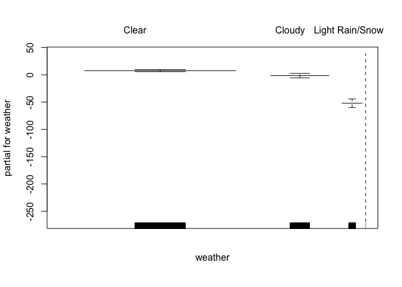

    ## [1] 4790   16
    ## 
    ## Call: gam(formula = as.formula(formula_string_2), data = trainset)
    ## Deviance Residuals:
    ##      Min       1Q   Median       3Q      Max 
    ## -270.381  -43.079   -7.099   39.204  395.563 
    ## 
    ## (Dispersion Parameter for gaussian family taken to be 5770.343)
    ## 
    ##     Null Deviance: 89462072 on 4789 degrees of freedom
    ## Residual Deviance: 27339886 on 4738 degrees of freedom
    ## AIC: 55130.88 
    ## 
    ## Number of Local Scoring Iterations: 2 
    ## 
    ## Anova for Parametric Effects
    ##                      Df   Sum Sq Mean Sq  F value    Pr(>F)    
    ## weather               3  1687330  562443  97.4714 < 2.2e-16 ***
    ## typeofday             2    39950   19975   3.4617 0.0314569 *  
    ## wday                  5   201552   40310   6.9858 1.641e-06 ***
    ## hour                 23 47455438 2063280 357.5662 < 2.2e-16 ***
    ## yearf                 1   107992  107992  18.7150 1.549e-05 ***
    ## monf                 11 10638015  967092 167.5970 < 2.2e-16 ***
    ## poly(atemp, 2)        2  1586474  793237 137.4679 < 2.2e-16 ***
    ## poly(humidity, 2)     2   322974  161487  27.9857 8.264e-13 ***
    ## poly(windspeed, 2)    2    82461   41231   7.1453 0.0007971 ***
    ## Residuals          4738 27339886    5770                       
    ## ---
    ## Signif. codes:  0 '***' 0.001 '**' 0.01 '*' 0.05 '.' 0.1 ' ' 1
    ## 
    ## 
    ## Call: gam(formula = as.formula(formula_string_3), data = trainset)
    ## Deviance Residuals:
    ##      Min       1Q   Median       3Q      Max 
    ## -289.366  -44.000   -7.204   39.909  378.354 
    ## 
    ## (Dispersion Parameter for gaussian family taken to be 5712.43)
    ## 
    ##     Null Deviance: 89462072 on 4789 degrees of freedom
    ## Residual Deviance: 27048358 on 4735 degrees of freedom
    ## AIC: 55085.53 
    ## 
    ## Number of Local Scoring Iterations: 2 
    ## 
    ## Anova for Parametric Effects
    ##                      Df   Sum Sq Mean Sq  F value    Pr(>F)    
    ## weather               3  1687330  562443  98.4596 < 2.2e-16 ***
    ## typeofday             2    39950   19975   3.4968   0.03037 *  
    ## wday                  5   201552   40310   7.0566 1.396e-06 ***
    ## hour                 23 47455438 2063280 361.1913 < 2.2e-16 ***
    ## yearf                 1   107992  107992  18.9048 1.403e-05 ***
    ## monf                 11 10638015  967092 169.2961 < 2.2e-16 ***
    ## poly(atemp, 3)        3  1861067  620356 108.5975 < 2.2e-16 ***
    ## poly(humidity, 3)     3   298270   99423  17.4047 3.094e-11 ***
    ## poly(windspeed, 3)    3   124100   41367   7.2415 7.614e-05 ***
    ## Residuals          4735 27048358    5712                       
    ## ---
    ## Signif. codes:  0 '***' 0.001 '**' 0.01 '*' 0.05 '.' 0.1 ' ' 1
    ## 
    ## 
    ## Call: gam(formula = as.formula(formula_string_4), data = trainset)
    ## Deviance Residuals:
    ##     Min      1Q  Median      3Q     Max 
    ## -277.22  -44.13   -6.27   38.87  368.68 
    ## 
    ## (Dispersion Parameter for gaussian family taken to be 5649.138)
    ## 
    ##     Null Deviance: 89462072 on 4789 degrees of freedom
    ## Residual Deviance: 26731719 on 4732 degrees of freedom
    ## AIC: 55035.12 
    ## 
    ## Number of Local Scoring Iterations: 2 
    ## 
    ## Anova for Parametric Effects
    ##                      Df   Sum Sq Mean Sq  F value    Pr(>F)    
    ## weather               3  1687330  562443  99.5627 < 2.2e-16 ***
    ## typeofday             2    39950   19975   3.5359  0.029209 *  
    ## wday                  5   201552   40310   7.1357 1.165e-06 ***
    ## hour                 23 47455438 2063280 365.2380 < 2.2e-16 ***
    ## yearf                 1   107992  107992  19.1166 1.256e-05 ***
    ## monf                 11 10638015  967092 171.1929 < 2.2e-16 ***
    ## poly(atemp, 4)        4  2250745  562686  99.6057 < 2.2e-16 ***
    ## poly(humidity, 4)     4   244549   61137  10.8224 9.856e-09 ***
    ## poly(windspeed, 4)    4   104783   26196   4.6371  0.000978 ***
    ## Residuals          4732 26731719    5649                       
    ## ---
    ## Signif. codes:  0 '***' 0.001 '**' 0.01 '*' 0.05 '.' 0.1 ' ' 1
    ## 
    ## 
    ## Call: gam(formula = as.formula(formula_string_5), data = trainset)
    ## Deviance Residuals:
    ##      Min       1Q   Median       3Q      Max 
    ## -276.160  -43.579   -6.613   39.403  371.332 
    ## 
    ## (Dispersion Parameter for gaussian family taken to be 5636.113)
    ## 
    ##     Null Deviance: 89462072 on 4789 degrees of freedom
    ## Residual Deviance: 26653180 on 4729 degrees of freedom
    ## AIC: 55027.03 
    ## 
    ## Number of Local Scoring Iterations: 2 
    ## 
    ## Anova for Parametric Effects
    ##                      Df   Sum Sq Mean Sq  F value    Pr(>F)    
    ## weather               3  1687330  562443  99.7928 < 2.2e-16 ***
    ## typeofday             2    39950   19975   3.5441 0.0289712 *  
    ## wday                  5   201552   40310   7.1522 1.122e-06 ***
    ## hour                 23 47455438 2063280 366.0821 < 2.2e-16 ***
    ## yearf                 1   107992  107992  19.1608 1.228e-05 ***
    ## monf                 11 10638015  967092 171.5885 < 2.2e-16 ***
    ## poly(atemp, 5)        5  2324795  464959  82.4964 < 2.2e-16 ***
    ## poly(humidity, 5)     5   236781   47356   8.4023 6.349e-08 ***
    ## poly(windspeed, 5)    5   117039   23408   4.1532 0.0009121 ***
    ## Residuals          4729 26653180    5636                       
    ## ---
    ## Signif. codes:  0 '***' 0.001 '**' 0.01 '*' 0.05 '.' 0.1 ' ' 1
    ## 
    ## Analysis of Deviance Table
    ## 
    ## Model 1: count ~ weather + typeofday + wday + hour + yearf + monf + poly(atemp, 
    ##     2) + poly(humidity, 2) + poly(windspeed, 2)
    ## Model 2: count ~ weather + typeofday + wday + hour + yearf + monf + poly(atemp, 
    ##     3) + poly(humidity, 3) + poly(windspeed, 3)
    ## Model 3: count ~ weather + typeofday + wday + hour + yearf + monf + poly(atemp, 
    ##     4) + poly(humidity, 4) + poly(windspeed, 4)
    ## Model 4: count ~ weather + typeofday + wday + hour + yearf + monf + poly(atemp, 
    ##     5) + poly(humidity, 5) + poly(windspeed, 5)
    ##   Resid. Df Resid. Dev Df Deviance  Pr(>Chi)    
    ## 1      4738   27339886                          
    ## 2      4735   27048358  3   291528 3.428e-11 ***
    ## 3      4732   26731719  3   316639 3.845e-12 ***
    ## 4      4729   26653180  3    78539  0.002995 ** 
    ## ---
    ## Signif. codes:  0 '***' 0.001 '**' 0.01 '*' 0.05 '.' 0.1 ' ' 1

    ## Warning in predict.lm(object, newdata, se.fit, scale = 1, type =
    ## ifelse(type == : prediction from a rank-deficient fit may be misleading

    ## Warning in predict.lm(object, newdata, se.fit, scale = 1, type =
    ## ifelse(type == : prediction from a rank-deficient fit may be misleading

    ## dataset= 112.2 model=gam_poly trainerror= 5646.839 testerror= 6066.046[1] "count~weather+typeofday+wday+hour+yearf+monf+s(atemp)+s(humidity)+s(windspeed)"

    ## Warning in predict.lm(object, newdata, se.fit, scale = 1, type =
    ## ifelse(type == : prediction from a rank-deficient fit may be misleading

    ## Warning in predict.lm(object, newdata, se.fit, scale = 1, type =
    ## ifelse(type == : prediction from a rank-deficient fit may be misleading


    ## dataset= 112.2 model=gam_s trainerror= 5610.216 testerror= 6052.81
    ## Call: gam(formula = as.formula(formula_string), data = trainset)
    ## Deviance Residuals:
    ##      Min       1Q   Median       3Q      Max 
    ## -274.775  -43.351   -6.753   39.238  379.132 
    ## 
    ## (Dispersion Parameter for gaussian family taken to be 5678.963)
    ## 
    ##     Null Deviance: 89462072 on 4789 degrees of freedom
    ## Residual Deviance: 26872857 on 4732 degrees of freedom
    ## AIC: 55060.35 
    ## 
    ## Number of Local Scoring Iterations: 2 
    ## 
    ## Anova for Parametric Effects
    ##                Df   Sum Sq Mean Sq  F value    Pr(>F)    
    ## weather         3  1149703  383234  67.4832 < 2.2e-16 ***
    ## typeofday       2    53998   26999   4.7542 0.0086568 ** 
    ## wday            5   232707   46541   8.1954 1.023e-07 ***
    ## hour           23 47482038 2064436 363.5235 < 2.2e-16 ***
    ## yearf           1   125214  125214  22.0488 2.733e-06 ***
    ## monf           11 10769156  979014 172.3931 < 2.2e-16 ***
    ## s(atemp)        1  1934150 1934150 340.5815 < 2.2e-16 ***
    ## s(humidity)     1   122445  122445  21.5612 3.520e-06 ***
    ## s(windspeed)    1    63694   63694  11.2157 0.0008174 ***
    ## Residuals    4732 26872857    5679                       
    ## ---
    ## Signif. codes:  0 '***' 0.001 '**' 0.01 '*' 0.05 '.' 0.1 ' ' 1
    ## 
    ## Anova for Nonparametric Effects
    ##              Npar Df Npar F     Pr(F)    
    ## (Intercept)                              
    ## weather                                  
    ## typeofday                                
    ## wday                                     
    ## hour                                     
    ## yearf                                    
    ## monf                                     
    ## s(atemp)           3 36.655 < 2.2e-16 ***
    ## s(humidity)        3 10.447 7.563e-07 ***
    ## s(windspeed)       3  2.992    0.0297 *  
    ## ---
    ## Signif. codes:  0 '***' 0.001 '**' 0.01 '*' 0.05 '.' 0.1 ' ' 1

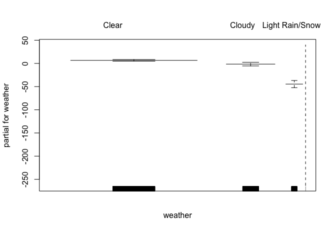

    ## [1] "count~weather+typeofday+wday+hour+yearf+monf+atemp+humidity+windspeed"
    ##             %IncMSE IncNodePurity
    ## weather    39.75188       1766155
    ## typeofday  52.52919       3277651
    ## wday       43.48091       4132268
    ## hour      168.99362      47340863
    ## yearf      48.50849       2273795
    ## monf       53.64588       7302217
    ## atemp      70.41283      12892143
    ## humidity   46.15653       5996029
    ## windspeed  18.98282       2231895


    ## dataset= 112.2 model=rf trainerror= 439.2002 testerror= 2103.937

    ##                 var   rel.inf
    ## hour           hour 57.931948
    ## atemp         atemp 11.264377
    ## monf           monf  9.535786
    ## typeofday typeofday  7.570185
    ## wday           wday  3.871097
    ## humidity   humidity  3.201238
    ## yearf         yearf  3.062005
    ## weather     weather  2.497007
    ## windspeed windspeed  1.066357
    ## dataset= 112.2 model=boost trainerror= 186.0541 testerror= 1289.816[1] 6785   16
    ## [1] "112.2"
    ##      dataset model      trainerror testerror
    ## [1,] "112.2" "lm"       5801.076   6229.651 
    ## [2,] "112.2" "gam_lm"   5801.076   6229.651 
    ## [3,] "112.2" "gam_poly" 5646.839   6066.046 
    ## [4,] "112.2" "gam_s"    5610.216   6052.81  
    ## [5,] "112.2" "rf"       439.2002   2103.937 
    ## [6,] "112.2" "boost"    186.0541   1289.816 
    ## [1] "model with lowest test error"
    ##   dataset model trainerror testerror
    ## 6   112.2 boost   186.0541  1289.816

    ## Warning in createDataPartition(dataset$partgroup, p = 0.7, list = F):
    ## Some classes have a single record ( Light Rain/Snow_Weekend_11, Snow/Heavy
    ## Rain_Working Day_0 ) and these will be selected for the sample

    ## [1] "weather+typeofday+wday+hour+yearf+monf"
    ## [1] "count~weather+typeofday+wday+hour+yearf+monf+atemp+humidity+windspeed"

    ## Warning in predict.lm(fit_lm, newdata = trainset): prediction from a rank-
    ## deficient fit may be misleading

    ## Warning in predict.lm(fit_lm, newdata = testset): prediction from a rank-
    ## deficient fit may be misleading

    ## dataset= 112.3 model=lm trainerror= 6470.235 testerror= 6970.362

    ## Warning: not plotting observations with leverage one:
    ##   3968


    ## Warning: not plotting observations with leverage one:
    ##   3968

    ## [1] "count~weather+typeofday+wday+hour+yearf+monf+atemp+humidity+windspeed"
    ## 
    ## Call: gam(formula = as.formula(formula_string), data = trainset)
    ## Deviance Residuals:
    ##      Min       1Q   Median       3Q      Max 
    ## -314.135  -46.689   -8.307   41.172  401.661 
    ## 
    ## (Dispersion Parameter for gaussian family taken to be 6532.928)
    ## 
    ##     Null Deviance: 107748759 on 5105 degrees of freedom
    ## Residual Deviance: 33037019 on 5057 degrees of freedom
    ## AIC: 59395.19 
    ## 
    ## Number of Local Scoring Iterations: 2 
    ## 
    ## Anova for Parametric Effects
    ##             Df   Sum Sq Mean Sq  F value    Pr(>F)    
    ## weather      3  2315578  771859 118.1491 < 2.2e-16 ***
    ## typeofday    2    15127    7564   1.1578  0.314266    
    ## wday         5   115528   23106   3.5368  0.003407 ** 
    ## hour        23 57025914 2479388 379.5216 < 2.2e-16 ***
    ## yearf        1  1491229 1491229 228.2634 < 2.2e-16 ***
    ## monf        11 11870120 1079102 165.1789 < 2.2e-16 ***
    ## atemp        1  1569613 1569613 240.2617 < 2.2e-16 ***
    ## humidity     1   285719  285719  43.7353 4.148e-11 ***
    ## windspeed    1    22912   22912   3.5072  0.061160 .  
    ## Residuals 5057 33037019    6533                       
    ## ---
    ## Signif. codes:  0 '***' 0.001 '**' 0.01 '*' 0.05 '.' 0.1 ' ' 1

    ## Warning in predict.lm(object, newdata, se.fit, scale = 1, type =
    ## ifelse(type == : prediction from a rank-deficient fit may be misleading

    ## Warning in predict.lm(object, newdata, se.fit, scale = 1, type =
    ## ifelse(type == : prediction from a rank-deficient fit may be misleading


    ## dataset= 112.3 model=gam_lm trainerror= 6470.235 testerror= 6970.362


    ## [1] 5106   16
    ## 
    ## Call: gam(formula = as.formula(formula_string_2), data = trainset)
    ## Deviance Residuals:
    ##      Min       1Q   Median       3Q      Max 
    ## -307.715  -46.142   -7.052   40.740  387.708 
    ## 
    ## (Dispersion Parameter for gaussian family taken to be 6454.084)
    ## 
    ##     Null Deviance: 107748759 on 5105 degrees of freedom
    ## Residual Deviance: 32618941 on 5054 degrees of freedom
    ## AIC: 59336.16 
    ## 
    ## Number of Local Scoring Iterations: 2 
    ## 
    ## Anova for Parametric Effects
    ##                      Df   Sum Sq Mean Sq  F value    Pr(>F)    
    ## weather               3  2315578  771859 119.5924 < 2.2e-16 ***
    ## typeofday             2    15127    7564   1.1719  0.309855    
    ## wday                  5   115528   23106   3.5800  0.003109 ** 
    ## hour                 23 57025914 2479388 384.1579 < 2.2e-16 ***
    ## yearf                 1  1491229 1491229 231.0519 < 2.2e-16 ***
    ## monf                 11 11870120 1079102 167.1967 < 2.2e-16 ***
    ## poly(atemp, 2)        2  1957707  978853 151.6642 < 2.2e-16 ***
    ## poly(humidity, 2)     2   261863  130932  20.2866 1.678e-09 ***
    ## poly(windspeed, 2)    2    76753   38376   5.9461  0.002634 ** 
    ## Residuals          5054 32618941    6454                       
    ## ---
    ## Signif. codes:  0 '***' 0.001 '**' 0.01 '*' 0.05 '.' 0.1 ' ' 1
    ## 
    ## 
    ## Call: gam(formula = as.formula(formula_string_3), data = trainset)
    ## Deviance Residuals:
    ##      Min       1Q   Median       3Q      Max 
    ## -312.897  -46.928   -7.043   41.432  370.456 
    ## 
    ## (Dispersion Parameter for gaussian family taken to be 6372.014)
    ## 
    ##     Null Deviance: 107748759 on 5105 degrees of freedom
    ## Residual Deviance: 32185041 on 5051 degrees of freedom
    ## AIC: 59273.78 
    ## 
    ## Number of Local Scoring Iterations: 2 
    ## 
    ## Anova for Parametric Effects
    ##                      Df   Sum Sq Mean Sq  F value    Pr(>F)    
    ## weather               3  2315578  771859 121.1327 < 2.2e-16 ***
    ## typeofday             2    15127    7564   1.1870  0.305215    
    ## wday                  5   115528   23106   3.6261  0.002819 ** 
    ## hour                 23 57025914 2479388 389.1058 < 2.2e-16 ***
    ## yearf                 1  1491229 1491229 234.0278 < 2.2e-16 ***
    ## monf                 11 11870120 1079102 169.3502 < 2.2e-16 ***
    ## poly(atemp, 3)        3  2373426  791142 124.1589 < 2.2e-16 ***
    ## poly(humidity, 3)     3   231179   77060  12.0934 6.947e-08 ***
    ## poly(windspeed, 3)    3   125617   41872   6.5713  0.000198 ***
    ## Residuals          5051 32185041    6372                       
    ## ---
    ## Signif. codes:  0 '***' 0.001 '**' 0.01 '*' 0.05 '.' 0.1 ' ' 1
    ## 
    ## 
    ## Call: gam(formula = as.formula(formula_string_4), data = trainset)
    ## Deviance Residuals:
    ##      Min       1Q   Median       3Q      Max 
    ## -308.496  -46.827   -6.636   40.458  365.374 
    ## 
    ## (Dispersion Parameter for gaussian family taken to be 6319.84)
    ## 
    ##     Null Deviance: 107748759 on 5105 degrees of freedom
    ## Residual Deviance: 31902551 on 5048 degrees of freedom
    ## AIC: 59234.77 
    ## 
    ## Number of Local Scoring Iterations: 2 
    ## 
    ## Anova for Parametric Effects
    ##                      Df   Sum Sq Mean Sq  F value    Pr(>F)    
    ## weather               3  2315578  771859 122.1327 < 2.2e-16 ***
    ## typeofday             2    15127    7564   1.1968  0.302240    
    ## wday                  5   115528   23106   3.6560  0.002646 ** 
    ## hour                 23 57025914 2479388 392.3181 < 2.2e-16 ***
    ## yearf                 1  1491229 1491229 235.9599 < 2.2e-16 ***
    ## monf                 11 11870120 1079102 170.7483 < 2.2e-16 ***
    ## poly(atemp, 4)        4  2697640  674410 106.7131 < 2.2e-16 ***
    ## poly(humidity, 4)     4   205319   51330   8.1220 1.592e-06 ***
    ## poly(windspeed, 4)    4   109754   27438   4.3416  0.001660 ** 
    ## Residuals          5048 31902551    6320                       
    ## ---
    ## Signif. codes:  0 '***' 0.001 '**' 0.01 '*' 0.05 '.' 0.1 ' ' 1
    ## 
    ## 
    ## Call: gam(formula = as.formula(formula_string_5), data = trainset)
    ## Deviance Residuals:
    ##      Min       1Q   Median       3Q      Max 
    ## -306.093  -46.583   -6.827   40.787  363.832 
    ## 
    ## (Dispersion Parameter for gaussian family taken to be 6313.909)
    ## 
    ##     Null Deviance: 107748759 on 5105 degrees of freedom
    ## Residual Deviance: 31853670 on 5045 degrees of freedom
    ## AIC: 59232.94 
    ## 
    ## Number of Local Scoring Iterations: 2 
    ## 
    ## Anova for Parametric Effects
    ##                      Df   Sum Sq Mean Sq  F value    Pr(>F)    
    ## weather               3  2315578  771859 122.2475 < 2.2e-16 ***
    ## typeofday             2    15127    7564   1.1979  0.301901    
    ## wday                  5   115528   23106   3.6595  0.002627 ** 
    ## hour                 23 57025914 2479388 392.6866 < 2.2e-16 ***
    ## yearf                 1  1491229 1491229 236.1815 < 2.2e-16 ***
    ## monf                 11 11870120 1079102 170.9087 < 2.2e-16 ***
    ## poly(atemp, 5)        5  2705835  541167  85.7103 < 2.2e-16 ***
    ## poly(humidity, 5)     5   213706   42741   6.7694 2.677e-06 ***
    ## poly(windspeed, 5)    5   142052   28410   4.4997  0.000429 ***
    ## Residuals          5045 31853670    6314                       
    ## ---
    ## Signif. codes:  0 '***' 0.001 '**' 0.01 '*' 0.05 '.' 0.1 ' ' 1
    ## 
    ## Analysis of Deviance Table
    ## 
    ## Model 1: count ~ weather + typeofday + wday + hour + yearf + monf + poly(atemp, 
    ##     2) + poly(humidity, 2) + poly(windspeed, 2)
    ## Model 2: count ~ weather + typeofday + wday + hour + yearf + monf + poly(atemp, 
    ##     3) + poly(humidity, 3) + poly(windspeed, 3)
    ## Model 3: count ~ weather + typeofday + wday + hour + yearf + monf + poly(atemp, 
    ##     4) + poly(humidity, 4) + poly(windspeed, 4)
    ## Model 4: count ~ weather + typeofday + wday + hour + yearf + monf + poly(atemp, 
    ##     5) + poly(humidity, 5) + poly(windspeed, 5)
    ##   Resid. Df Resid. Dev Df Deviance  Pr(>Chi)    
    ## 1      5054   32618941                          
    ## 2      5051   32185041  3   433900 8.018e-15 ***
    ## 3      5048   31902551  3   282491 1.050e-09 ***
    ## 4      5045   31853670  3    48881   0.05166 .  
    ## ---
    ## Signif. codes:  0 '***' 0.001 '**' 0.01 '*' 0.05 '.' 0.1 ' ' 1

    ## Warning in predict.lm(object, newdata, se.fit, scale = 1, type =
    ## ifelse(type == : prediction from a rank-deficient fit may be misleading

    ## Warning in predict.lm(object, newdata, se.fit, scale = 1, type =
    ## ifelse(type == : prediction from a rank-deficient fit may be misleading

    ## dataset= 112.3 model=gam_poly trainerror= 6303.377 testerror= 6821.498[1] "count~weather+typeofday+wday+hour+yearf+monf+s(atemp)+s(humidity)+s(windspeed)"

    ## Warning in predict.lm(object, newdata, se.fit, scale = 1, type =
    ## ifelse(type == : prediction from a rank-deficient fit may be misleading

    ## Warning in predict.lm(object, newdata, se.fit, scale = 1, type =
    ## ifelse(type == : prediction from a rank-deficient fit may be misleading


    ## dataset= 112.3 model=gam_s trainerror= 6270.43 testerror= 6779.015
    ## Call: gam(formula = as.formula(formula_string), data = trainset)
    ## Deviance Residuals:
    ##      Min       1Q   Median       3Q      Max 
    ## -310.691  -46.401   -6.919   40.709  370.653 
    ## 
    ## (Dispersion Parameter for gaussian family taken to be 6342.461)
    ## 
    ##     Null Deviance: 107748759 on 5105 degrees of freedom
    ## Residual Deviance: 32016745 on 5048.001 degrees of freedom
    ## AIC: 59253.01 
    ## 
    ## Number of Local Scoring Iterations: 2 
    ## 
    ## Anova for Parametric Effects
    ##                Df   Sum Sq Mean Sq  F value    Pr(>F)    
    ## weather         3  1806598  602199  94.9473 < 2.2e-16 ***
    ## typeofday       2    37182   18591   2.9312 0.0534220 .  
    ## wday            5   139334   27867   4.3937 0.0005405 ***
    ## hour           23 57129594 2483895 391.6296 < 2.2e-16 ***
    ## yearf           1  1808168 1808168 285.0894 < 2.2e-16 ***
    ## monf           11 12756885 1159717 182.8497 < 2.2e-16 ***
    ## s(atemp)        1  2175438 2175438 342.9959 < 2.2e-16 ***
    ## s(humidity)     1   177485  177485  27.9836 1.275e-07 ***
    ## s(windspeed)    1    45496   45496   7.1733 0.0074237 ** 
    ## Residuals    5048 32016745    6342                       
    ## ---
    ## Signif. codes:  0 '***' 0.001 '**' 0.01 '*' 0.05 '.' 0.1 ' ' 1
    ## 
    ## Anova for Nonparametric Effects
    ##              Npar Df Npar F     Pr(F)    
    ## (Intercept)                              
    ## weather                                  
    ## typeofday                                
    ## wday                                     
    ## hour                                     
    ## yearf                                    
    ## monf                                     
    ## s(atemp)           3 44.053 < 2.2e-16 ***
    ## s(humidity)        3  3.868  0.008926 ** 
    ## s(windspeed)       3  4.304  0.004866 ** 
    ## ---
    ## Signif. codes:  0 '***' 0.001 '**' 0.01 '*' 0.05 '.' 0.1 ' ' 1


    ## [1] "count~weather+typeofday+wday+hour+yearf+monf+atemp+humidity+windspeed"
    ##             %IncMSE IncNodePurity
    ## weather    37.01141       2040664
    ## typeofday  48.90698       3348951
    ## wday       49.14695       4999918
    ## hour      161.98811      56895008
    ## yearf      61.32738       4445898
    ## monf       53.40828       7850033
    ## atemp      70.62096      14056515
    ## humidity   44.00348       8407315
    ## windspeed  21.87508       2864507


    ## dataset= 112.3 model=rf trainerror= 505.3446 testerror= 2156.476

    ##                 var   rel.inf
    ## hour           hour 58.019758
    ## atemp         atemp 10.974981
    ## monf           monf  8.821223
    ## typeofday typeofday  6.903067
    ## yearf         yearf  5.086362
    ## wday           wday  3.853562
    ## humidity   humidity  3.173987
    ## weather     weather  2.033495
    ## windspeed windspeed  1.133565
    ## dataset= 112.3 model=boost trainerror= 210.0447 testerror= 1379.03[1] 7239   16
    ## [1] "112.3"
    ##      dataset model      trainerror testerror
    ## [1,] "112.3" "lm"       6470.235   6970.362 
    ## [2,] "112.3" "gam_lm"   6470.235   6970.362 
    ## [3,] "112.3" "gam_poly" 6303.377   6821.498 
    ## [4,] "112.3" "gam_s"    6270.43    6779.015 
    ## [5,] "112.3" "rf"       505.3446   2156.476 
    ## [6,] "112.3" "boost"    210.0447   1379.03  
    ## [1] "model with lowest test error"
    ##   dataset model trainerror testerror
    ## 6   112.3 boost   210.0447   1379.03

    ## Warning in createDataPartition(dataset$partgroup, p = 0.7, list = F):
    ## Some classes have a single record ( Light Rain/Snow_Weekend_11, Snow/Heavy
    ## Rain_Working Day_0 ) and these will be selected for the sample

    ## [1] "weather+typeofday+wday+hour+yearf+monf"
    ## [1] "count~weather+typeofday+wday+hour+yearf+monf+atemp+humidity+windspeed"

    ## Warning in predict.lm(fit_lm, newdata = trainset): prediction from a rank-
    ## deficient fit may be misleading

    ## Warning in predict.lm(fit_lm, newdata = testset): prediction from a rank-
    ## deficient fit may be misleading

    ## dataset= 112.4 model=lm trainerror= 7166.05 testerror= 7266.983

    ## Warning: not plotting observations with leverage one:
    ##   3956


    ## Warning: not plotting observations with leverage one:
    ##   3956

    ## [1] "count~weather+typeofday+wday+hour+yearf+monf+atemp+humidity+windspeed"
    ## 
    ## Call: gam(formula = as.formula(formula_string), data = trainset)
    ## Deviance Residuals:
    ##      Min       1Q   Median       3Q      Max 
    ## -307.743  -48.699   -6.863   44.151  389.727 
    ## 
    ## (Dispersion Parameter for gaussian family taken to be 7231.366)
    ## 
    ##     Null Deviance: 125665105 on 5424 degrees of freedom
    ## Residual Deviance: 38875823 on 5376 degrees of freedom
    ## AIC: 63653.8 
    ## 
    ## Number of Local Scoring Iterations: 2 
    ## 
    ## Anova for Parametric Effects
    ##             Df   Sum Sq Mean Sq  F value    Pr(>F)    
    ## weather      3  2956621  985540 136.2869 < 2.2e-16 ***
    ## typeofday    2     4106    2053   0.2839 0.7528693    
    ## wday         5   175647   35129   4.8579 0.0001951 ***
    ## hour        23 63697294 2769448 382.9771 < 2.2e-16 ***
    ## yearf        1  3557399 3557399 491.9401 < 2.2e-16 ***
    ## monf        11 14018342 1274395 176.2315 < 2.2e-16 ***
    ## atemp        1  1965925 1965925 271.8608 < 2.2e-16 ***
    ## humidity     1   319965  319965  44.2469 3.182e-11 ***
    ## windspeed    1    93984   93984  12.9967 0.0003149 ***
    ## Residuals 5376 38875823    7231                       
    ## ---
    ## Signif. codes:  0 '***' 0.001 '**' 0.01 '*' 0.05 '.' 0.1 ' ' 1

    ## Warning in predict.lm(object, newdata, se.fit, scale = 1, type =
    ## ifelse(type == : prediction from a rank-deficient fit may be misleading

    ## Warning in predict.lm(object, newdata, se.fit, scale = 1, type =
    ## ifelse(type == : prediction from a rank-deficient fit may be misleading


    ## dataset= 112.4 model=gam_lm trainerror= 7166.05 testerror= 7266.983


    ## [1] 5425   16
    ## 
    ## Call: gam(formula = as.formula(formula_string_2), data = trainset)
    ## Deviance Residuals:
    ##      Min       1Q   Median       3Q      Max 
    ## -304.418  -47.890   -5.739   43.016  377.181 
    ## 
    ## (Dispersion Parameter for gaussian family taken to be 7146.893)
    ## 
    ##     Null Deviance: 125665105 on 5424 degrees of freedom
    ## Residual Deviance: 38400254 on 5373 degrees of freedom
    ## AIC: 63593.03 
    ## 
    ## Number of Local Scoring Iterations: 2 
    ## 
    ## Anova for Parametric Effects
    ##                      Df   Sum Sq Mean Sq  F value    Pr(>F)    
    ## weather               3  2956621  985540 137.8977 < 2.2e-16 ***
    ## typeofday             2     4106    2053   0.2872 0.7503477    
    ## wday                  5   175647   35129   4.9153 0.0001719 ***
    ## hour                 23 63697294 2769448 387.5037 < 2.2e-16 ***
    ## yearf                 1  3557399 3557399 497.7546 < 2.2e-16 ***
    ## monf                 11 14018342 1274395 178.3145 < 2.2e-16 ***
    ## poly(atemp, 2)        2  2443099 1221550 170.9204 < 2.2e-16 ***
    ## poly(humidity, 2)     2   251255  125628  17.5779 2.460e-08 ***
    ## poly(windspeed, 2)    2   161088   80544  11.2698 1.306e-05 ***
    ## Residuals          5373 38400254    7147                       
    ## ---
    ## Signif. codes:  0 '***' 0.001 '**' 0.01 '*' 0.05 '.' 0.1 ' ' 1
    ## 
    ## 
    ## Call: gam(formula = as.formula(formula_string_3), data = trainset)
    ## Deviance Residuals:
    ##     Min      1Q  Median      3Q     Max 
    ## -310.63  -48.70   -5.19   44.31  362.68 
    ## 
    ## (Dispersion Parameter for gaussian family taken to be 7082.609)
    ## 
    ##     Null Deviance: 125665105 on 5424 degrees of freedom
    ## Residual Deviance: 38033609 on 5370 degrees of freedom
    ## AIC: 63546.98 
    ## 
    ## Number of Local Scoring Iterations: 2 
    ## 
    ## Anova for Parametric Effects
    ##                      Df   Sum Sq Mean Sq  F value    Pr(>F)    
    ## weather               3  2956621  985540 139.1493 < 2.2e-16 ***
    ## typeofday             2     4106    2053   0.2898 0.7483943    
    ## wday                  5   175647   35129   4.9600 0.0001557 ***
    ## hour                 23 63697294 2769448 391.0208 < 2.2e-16 ***
    ## yearf                 1  3557399 3557399 502.2724 < 2.2e-16 ***
    ## monf                 11 14018342 1274395 179.9330 < 2.2e-16 ***
    ## poly(atemp, 3)        3  2787031  929010 131.1678 < 2.2e-16 ***
    ## poly(humidity, 3)     3   229019   76340  10.7785 4.655e-07 ***
    ## poly(windspeed, 3)    3   206038   68679   9.6969 2.223e-06 ***
    ## Residuals          5370 38033609    7083                       
    ## ---
    ## Signif. codes:  0 '***' 0.001 '**' 0.01 '*' 0.05 '.' 0.1 ' ' 1
    ## 
    ## 
    ## Call: gam(formula = as.formula(formula_string_4), data = trainset)
    ## Deviance Residuals:
    ##      Min       1Q   Median       3Q      Max 
    ## -302.529  -48.939   -5.206   44.299  366.752 
    ## 
    ## (Dispersion Parameter for gaussian family taken to be 7008.917)
    ## 
    ##     Null Deviance: 125665105 on 5424 degrees of freedom
    ## Residual Deviance: 37616856 on 5367 degrees of freedom
    ## AIC: 63493.21 
    ## 
    ## Number of Local Scoring Iterations: 2 
    ## 
    ## Anova for Parametric Effects
    ##                      Df   Sum Sq Mean Sq  F value    Pr(>F)    
    ## weather               3  2956621  985540 140.6123 < 2.2e-16 ***
    ## typeofday             2     4106    2053   0.2929 0.7461173    
    ## wday                  5   175647   35129   5.0121 0.0001388 ***
    ## hour                 23 63697294 2769448 395.1320 < 2.2e-16 ***
    ## yearf                 1  3557399 3557399 507.5533 < 2.2e-16 ***
    ## monf                 11 14018342 1274395 181.8248 < 2.2e-16 ***
    ## poly(atemp, 4)        4  3214634  803659 114.6623 < 2.2e-16 ***
    ## poly(humidity, 4)     4   235690   58923   8.4068 9.309e-07 ***
    ## poly(windspeed, 4)    4   188516   47129   6.7242 2.147e-05 ***
    ## Residuals          5367 37616856    7009                       
    ## ---
    ## Signif. codes:  0 '***' 0.001 '**' 0.01 '*' 0.05 '.' 0.1 ' ' 1
    ## 
    ## 
    ## Call: gam(formula = as.formula(formula_string_5), data = trainset)
    ## Deviance Residuals:
    ##      Min       1Q   Median       3Q      Max 
    ## -298.375  -48.757   -5.702   44.228  369.183 
    ## 
    ## (Dispersion Parameter for gaussian family taken to be 6985.071)
    ## 
    ##     Null Deviance: 125665105 on 5424 degrees of freedom
    ## Residual Deviance: 37467920 on 5364 degrees of freedom
    ## AIC: 63477.69 
    ## 
    ## Number of Local Scoring Iterations: 2 
    ## 
    ## Anova for Parametric Effects
    ##                      Df   Sum Sq Mean Sq  F value    Pr(>F)    
    ## weather               3  2956621  985540 141.0924 < 2.2e-16 ***
    ## typeofday             2     4106    2053   0.2939 0.7453718    
    ## wday                  5   175647   35129   5.0292 0.0001336 ***
    ## hour                 23 63697294 2769448 396.4810 < 2.2e-16 ***
    ## yearf                 1  3557399 3557399 509.2860 < 2.2e-16 ***
    ## monf                 11 14018342 1274395 182.4455 < 2.2e-16 ***
    ## poly(atemp, 5)        5  3266865  653373  93.5385 < 2.2e-16 ***
    ## poly(humidity, 5)     5   277555   55511   7.9471 1.798e-07 ***
    ## poly(windspeed, 5)    5   243357   48671   6.9679 1.698e-06 ***
    ## Residuals          5364 37467920    6985                       
    ## ---
    ## Signif. codes:  0 '***' 0.001 '**' 0.01 '*' 0.05 '.' 0.1 ' ' 1
    ## 
    ## Analysis of Deviance Table
    ## 
    ## Model 1: count ~ weather + typeofday + wday + hour + yearf + monf + poly(atemp, 
    ##     2) + poly(humidity, 2) + poly(windspeed, 2)
    ## Model 2: count ~ weather + typeofday + wday + hour + yearf + monf + poly(atemp, 
    ##     3) + poly(humidity, 3) + poly(windspeed, 3)
    ## Model 3: count ~ weather + typeofday + wday + hour + yearf + monf + poly(atemp, 
    ##     4) + poly(humidity, 4) + poly(windspeed, 4)
    ## Model 4: count ~ weather + typeofday + wday + hour + yearf + monf + poly(atemp, 
    ##     5) + poly(humidity, 5) + poly(windspeed, 5)
    ##   Resid. Df Resid. Dev Df Deviance  Pr(>Chi)    
    ## 1      5373   38400254                          
    ## 2      5370   38033609  3   366646 2.355e-11 ***
    ## 3      5367   37616856  3   416753 6.937e-13 ***
    ## 4      5364   37467920  3   148936 9.025e-05 ***
    ## ---
    ## Signif. codes:  0 '***' 0.001 '**' 0.01 '*' 0.05 '.' 0.1 ' ' 1

    ## Warning in predict.lm(object, newdata, se.fit, scale = 1, type =
    ## ifelse(type == : prediction from a rank-deficient fit may be misleading

    ## Warning in predict.lm(object, newdata, se.fit, scale = 1, type =
    ## ifelse(type == : prediction from a rank-deficient fit may be misleading

    ## dataset= 112.4 model=gam_poly trainerror= 7010.803 testerror= 7052.494[1] "count~weather+typeofday+wday+hour+yearf+monf+s(atemp)+s(humidity)+s(windspeed)"

    ## Warning in predict.lm(object, newdata, se.fit, scale = 1, type =
    ## ifelse(type == : prediction from a rank-deficient fit may be misleading

    ## Warning in predict.lm(object, newdata, se.fit, scale = 1, type =
    ## ifelse(type == : prediction from a rank-deficient fit may be misleading


    ## dataset= 112.4 model=gam_s trainerror= 6954.833 testerror= 7006.917
    ## Call: gam(formula = as.formula(formula_string), data = trainset)
    ## Deviance Residuals:
    ##      Min       1Q   Median       3Q      Max 
    ## -305.768  -48.164   -5.624   43.764  366.440 
    ## 
    ## (Dispersion Parameter for gaussian family taken to be 7029.998)
    ## 
    ##     Null Deviance: 125665105 on 5424 degrees of freedom
    ## Residual Deviance: 37730001 on 5367 degrees of freedom
    ## AIC: 63509.5 
    ## 
    ## Number of Local Scoring Iterations: 2 
    ## 
    ## Anova for Parametric Effects
    ##                Df   Sum Sq Mean Sq  F value    Pr(>F)    
    ## weather         3  2384982  794994 113.0859 < 2.2e-16 ***
    ## typeofday       2    19979    9989   1.4210    0.2416    
    ## wday            5   213879   42776   6.0848 1.260e-05 ***
    ## hour           23 63152311 2745753 390.5766 < 2.2e-16 ***
    ## yearf           1  3948840 3948840 561.7129 < 2.2e-16 ***
    ## monf           11 14601769 1327434 188.8242 < 2.2e-16 ***
    ## s(atemp)        1  2685705 2685705 382.0349 < 2.2e-16 ***
    ## s(humidity)     1   190990  190990  27.1679 1.935e-07 ***
    ## s(windspeed)    1   119921  119921  17.0585 3.680e-05 ***
    ## Residuals    5367 37730001    7030                       
    ## ---
    ## Signif. codes:  0 '***' 0.001 '**' 0.01 '*' 0.05 '.' 0.1 ' ' 1
    ## 
    ## Anova for Nonparametric Effects
    ##              Npar Df Npar F     Pr(F)    
    ## (Intercept)                              
    ## weather                                  
    ## typeofday                                
    ## wday                                     
    ## hour                                     
    ## yearf                                    
    ## monf                                     
    ## s(atemp)           3 43.292 < 2.2e-16 ***
    ## s(humidity)        3  4.884  0.002159 ** 
    ## s(windspeed)       3  5.085  0.001626 ** 
    ## ---
    ## Signif. codes:  0 '***' 0.001 '**' 0.01 '*' 0.05 '.' 0.1 ' ' 1


    ## [1] "count~weather+typeofday+wday+hour+yearf+monf+atemp+humidity+windspeed"
    ##             %IncMSE IncNodePurity
    ## weather    37.74654       2342758
    ## typeofday  53.66814       3897213
    ## wday       49.16656       5538054
    ## hour      155.09061      64655966
    ## yearf      76.72238       5921682
    ## monf       50.26998       9679977
    ## atemp      66.99026      17888648
    ## humidity   47.04668       9358523
    ## windspeed  20.77670       3108093


    ## dataset= 112.4 model=rf trainerror= 542.8665 testerror= 2204.465

    ##                 var   rel.inf
    ## hour           hour 56.761099
    ## atemp         atemp 11.528612
    ## monf           monf  8.162860
    ## typeofday typeofday  6.556657
    ## yearf         yearf  5.936552
    ## wday           wday  4.466109
    ## humidity   humidity  3.235281
    ## weather     weather  2.184269
    ## windspeed windspeed  1.168563
    ## dataset= 112.4 model=boost trainerror= 251.4983 testerror= 1506.033[1] 7695   16
    ## [1] "112.4"
    ##      dataset model      trainerror testerror
    ## [1,] "112.4" "lm"       7166.05    7266.983 
    ## [2,] "112.4" "gam_lm"   7166.05    7266.983 
    ## [3,] "112.4" "gam_poly" 7010.803   7052.494 
    ## [4,] "112.4" "gam_s"    6954.833   7006.917 
    ## [5,] "112.4" "rf"       542.8665   2204.465 
    ## [6,] "112.4" "boost"    251.4983   1506.033 
    ## [1] "model with lowest test error"
    ##   dataset model trainerror testerror
    ## 6   112.4 boost   251.4983  1506.033

    ## Warning in createDataPartition(dataset$partgroup, p = 0.7, list = F):
    ## Some classes have a single record ( Light Rain/Snow_Weekend_11, Snow/Heavy
    ## Rain_Working Day_0 ) and these will be selected for the sample

    ## [1] "weather+typeofday+wday+hour+yearf+monf"
    ## [1] "count~weather+typeofday+wday+hour+yearf+monf+atemp+humidity+windspeed"

    ## Warning in predict.lm(fit_lm, newdata = trainset): prediction from a rank-
    ## deficient fit may be misleading

    ## Warning in predict.lm(fit_lm, newdata = testset): prediction from a rank-
    ## deficient fit may be misleading

    ## dataset= 112.5 model=lm trainerror= 7827.079 testerror= 8025.914

    ## Warning: not plotting observations with leverage one:
    ##   3989


    ## Warning: not plotting observations with leverage one:
    ##   3989

    ## [1] "count~weather+typeofday+wday+hour+yearf+monf+atemp+humidity+windspeed"
    ## 
    ## Call: gam(formula = as.formula(formula_string), data = trainset)
    ## Deviance Residuals:
    ##      Min       1Q   Median       3Q      Max 
    ## -314.590  -50.801   -7.244   44.578  385.942 
    ## 
    ## (Dispersion Parameter for gaussian family taken to be 7894.423)
    ## 
    ##     Null Deviance: 147467202 on 5743 degrees of freedom
    ## Residual Deviance: 44958742 on 5695 degrees of freedom
    ## AIC: 67897.71 
    ## 
    ## Number of Local Scoring Iterations: 2 
    ## 
    ## Anova for Parametric Effects
    ##             Df   Sum Sq Mean Sq  F value    Pr(>F)    
    ## weather      3  3635809 1211936 153.5180 < 2.2e-16 ***
    ## typeofday    2    39428   19714   2.4972 0.0824034 .  
    ## wday         5   104014   20803   2.6351 0.0218906 *  
    ## hour        23 75370598 3276983 415.1009 < 2.2e-16 ***
    ## yearf        1  5718357 5718357 724.3539 < 2.2e-16 ***
    ## monf        11 15280433 1389130 175.9635 < 2.2e-16 ***
    ## atemp        1  1904181 1904181 241.2058 < 2.2e-16 ***
    ## humidity     1   357292  357292  45.2588 1.895e-11 ***
    ## windspeed    1    98348   98348  12.4579 0.0004195 ***
    ## Residuals 5695 44958742    7894                       
    ## ---
    ## Signif. codes:  0 '***' 0.001 '**' 0.01 '*' 0.05 '.' 0.1 ' ' 1

    ## Warning in predict.lm(object, newdata, se.fit, scale = 1, type =
    ## ifelse(type == : prediction from a rank-deficient fit may be misleading

    ## Warning in predict.lm(object, newdata, se.fit, scale = 1, type =
    ## ifelse(type == : prediction from a rank-deficient fit may be misleading


    ## dataset= 112.5 model=gam_lm trainerror= 7827.079 testerror= 8025.914


    ## [1] 5744   16
    ## 
    ## Call: gam(formula = as.formula(formula_string_2), data = trainset)
    ## Deviance Residuals:
    ##      Min       1Q   Median       3Q      Max 
    ## -309.646  -50.554   -5.726   44.498  375.874 
    ## 
    ## (Dispersion Parameter for gaussian family taken to be 7815.016)
    ## 
    ##     Null Deviance: 147467202 on 5743 degrees of freedom
    ## Residual Deviance: 44483072 on 5692 degrees of freedom
    ## AIC: 67842.61 
    ## 
    ## Number of Local Scoring Iterations: 2 
    ## 
    ## Anova for Parametric Effects
    ##                      Df   Sum Sq Mean Sq  F value    Pr(>F)    
    ## weather               3  3635809 1211936 155.0779 < 2.2e-16 ***
    ## typeofday             2    39428   19714   2.5226   0.08034 .  
    ## wday                  5   104014   20803   2.6619   0.02075 *  
    ## hour                 23 75370598 3276983 419.3187 < 2.2e-16 ***
    ## yearf                 1  5718357 5718357 731.7140 < 2.2e-16 ***
    ## monf                 11 15280433 1389130 177.7514 < 2.2e-16 ***
    ## poly(atemp, 2)        2  2436761 1218381 155.9025 < 2.2e-16 ***
    ## poly(humidity, 2)     2   232822  116411  14.8958 3.529e-07 ***
    ## poly(windspeed, 2)    2   165909   82954  10.6147 2.504e-05 ***
    ## Residuals          5692 44483072    7815                       
    ## ---
    ## Signif. codes:  0 '***' 0.001 '**' 0.01 '*' 0.05 '.' 0.1 ' ' 1
    ## 
    ## 
    ## Call: gam(formula = as.formula(formula_string_3), data = trainset)
    ## Deviance Residuals:
    ##      Min       1Q   Median       3Q      Max 
    ## -322.971  -51.459   -5.352   44.966  357.473 
    ## 
    ## (Dispersion Parameter for gaussian family taken to be 7727.842)
    ## 
    ##     Null Deviance: 147467202 on 5743 degrees of freedom
    ## Residual Deviance: 43963691 on 5689 degrees of freedom
    ## AIC: 67781.15 
    ## 
    ## Number of Local Scoring Iterations: 2 
    ## 
    ## Anova for Parametric Effects
    ##                      Df   Sum Sq Mean Sq  F value    Pr(>F)    
    ## weather               3  3635809 1211936 156.8273 < 2.2e-16 ***
    ## typeofday             2    39428   19714   2.5511   0.07809 .  
    ## wday                  5   104014   20803   2.6919   0.01953 *  
    ## hour                 23 75370598 3276983 424.0489 < 2.2e-16 ***
    ## yearf                 1  5718357 5718357 739.9682 < 2.2e-16 ***
    ## monf                 11 15280433 1389130 179.7566 < 2.2e-16 ***
    ## poly(atemp, 3)        3  2932405  977468 126.4866 < 2.2e-16 ***
    ## poly(humidity, 3)     3   186383   62128   8.0395 2.416e-05 ***
    ## poly(windspeed, 3)    3   236083   78694  10.1832 1.099e-06 ***
    ## Residuals          5689 43963691    7728                       
    ## ---
    ## Signif. codes:  0 '***' 0.001 '**' 0.01 '*' 0.05 '.' 0.1 ' ' 1
    ## 
    ## 
    ## Call: gam(formula = as.formula(formula_string_4), data = trainset)
    ## Deviance Residuals:
    ##      Min       1Q   Median       3Q      Max 
    ## -310.104  -52.007   -4.216   45.362  358.447 
    ## 
    ## (Dispersion Parameter for gaussian family taken to be 7629.818)
    ## 
    ##     Null Deviance: 147467202 on 5743 degrees of freedom
    ## Residual Deviance: 43383144 on 5686 degrees of freedom
    ## AIC: 67710.79 
    ## 
    ## Number of Local Scoring Iterations: 2 
    ## 
    ## Anova for Parametric Effects
    ##                      Df   Sum Sq Mean Sq  F value    Pr(>F)    
    ## weather               3  3635809 1211936 158.8421 < 2.2e-16 ***
    ## typeofday             2    39428   19714   2.5838 0.0755731 .  
    ## wday                  5   104014   20803   2.7265 0.0182135 *  
    ## hour                 23 75370598 3276983 429.4968 < 2.2e-16 ***
    ## yearf                 1  5718357 5718357 749.4749 < 2.2e-16 ***
    ## monf                 11 15280433 1389130 182.0660 < 2.2e-16 ***
    ## poly(atemp, 4)        4  3574438  893609 117.1207 < 2.2e-16 ***
    ## poly(humidity, 4)     4   165752   41438   5.4311 0.0002314 ***
    ## poly(windspeed, 4)    4   195230   48807   6.3969 3.927e-05 ***
    ## Residuals          5686 43383144    7630                       
    ## ---
    ## Signif. codes:  0 '***' 0.001 '**' 0.01 '*' 0.05 '.' 0.1 ' ' 1
    ## 
    ## 
    ## Call: gam(formula = as.formula(formula_string_5), data = trainset)
    ## Deviance Residuals:
    ##      Min       1Q   Median       3Q      Max 
    ## -305.754  -51.975   -4.364   44.692  358.877 
    ## 
    ## (Dispersion Parameter for gaussian family taken to be 7619.645)
    ## 
    ##     Null Deviance: 147467202 on 5743 degrees of freedom
    ## Residual Deviance: 43302445 on 5683 degrees of freedom
    ## AIC: 67706.1 
    ## 
    ## Number of Local Scoring Iterations: 2 
    ## 
    ## Anova for Parametric Effects
    ##                      Df   Sum Sq Mean Sq  F value    Pr(>F)    
    ## weather               3  3635809 1211936 159.0541 < 2.2e-16 ***
    ## typeofday             2    39428   19714   2.5873 0.0753132 .  
    ## wday                  5   104014   20803   2.7302 0.0180801 *  
    ## hour                 23 75370598 3276983 430.0702 < 2.2e-16 ***
    ## yearf                 1  5718357 5718357 750.4754 < 2.2e-16 ***
    ## monf                 11 15280433 1389130 182.3090 < 2.2e-16 ***
    ## poly(atemp, 5)        5  3647223  729445  95.7321 < 2.2e-16 ***
    ## poly(humidity, 5)     5   168256   33651   4.4164 0.0005134 ***
    ## poly(windspeed, 5)    5   200639   40128   5.2664 7.882e-05 ***
    ## Residuals          5683 43302445    7620                       
    ## ---
    ## Signif. codes:  0 '***' 0.001 '**' 0.01 '*' 0.05 '.' 0.1 ' ' 1
    ## 
    ## Analysis of Deviance Table
    ## 
    ## Model 1: count ~ weather + typeofday + wday + hour + yearf + monf + poly(atemp, 
    ##     2) + poly(humidity, 2) + poly(windspeed, 2)
    ## Model 2: count ~ weather + typeofday + wday + hour + yearf + monf + poly(atemp, 
    ##     3) + poly(humidity, 3) + poly(windspeed, 3)
    ## Model 3: count ~ weather + typeofday + wday + hour + yearf + monf + poly(atemp, 
    ##     4) + poly(humidity, 4) + poly(windspeed, 4)
    ## Model 4: count ~ weather + typeofday + wday + hour + yearf + monf + poly(atemp, 
    ##     5) + poly(humidity, 5) + poly(windspeed, 5)
    ##   Resid. Df Resid. Dev Df Deviance  Pr(>Chi)    
    ## 1      5692   44483072                          
    ## 2      5689   43963691  3   519380 1.056e-14 ***
    ## 3      5686   43383144  3   580548 < 2.2e-16 ***
    ## 4      5683   43302445  3    80698   0.01416 *  
    ## ---
    ## Signif. codes:  0 '***' 0.001 '**' 0.01 '*' 0.05 '.' 0.1 ' ' 1

    ## Warning in predict.lm(object, newdata, se.fit, scale = 1, type =
    ## ifelse(type == : prediction from a rank-deficient fit may be misleading

    ## Warning in predict.lm(object, newdata, se.fit, scale = 1, type =
    ## ifelse(type == : prediction from a rank-deficient fit may be misleading

    ## dataset= 112.5 model=gam_poly trainerror= 7653.846 testerror= 7859.722[1] "count~weather+typeofday+wday+hour+yearf+monf+s(atemp)+s(humidity)+s(windspeed)"

    ## Warning in predict.lm(object, newdata, se.fit, scale = 1, type =
    ## ifelse(type == : prediction from a rank-deficient fit may be misleading

    ## Warning in predict.lm(object, newdata, se.fit, scale = 1, type =
    ## ifelse(type == : prediction from a rank-deficient fit may be misleading


    ## dataset= 112.5 model=gam_s trainerror= 7585.398 testerror= 7791.563
    ## Call: gam(formula = as.formula(formula_string), data = trainset)
    ## Deviance Residuals:
    ##     Min      1Q  Median      3Q     Max 
    ## -309.92  -50.97   -5.21   44.20  359.16 
    ## 
    ## (Dispersion Parameter for gaussian family taken to be 7662.79)
    ## 
    ##     Null Deviance: 147467202 on 5743 degrees of freedom
    ## Residual Deviance: 43570628 on 5686 degrees of freedom
    ## AIC: 67735.56 
    ## 
    ## Number of Local Scoring Iterations: 2 
    ## 
    ## Anova for Parametric Effects
    ##                Df   Sum Sq Mean Sq  F value    Pr(>F)    
    ## weather         3  3046808 1015603 132.5369 < 2.2e-16 ***
    ## typeofday       2    74922   37461   4.8887  0.007563 ** 
    ## wday            5   115561   23112   3.0162  0.010089 *  
    ## hour           23 74064035 3220175 420.2354 < 2.2e-16 ***
    ## yearf           1  6003794 6003794 783.4997 < 2.2e-16 ***
    ## monf           11 16274568 1479506 193.0767 < 2.2e-16 ***
    ## s(atemp)        1  2562902 2562902 334.4606 < 2.2e-16 ***
    ## s(humidity)     1   190241  190241  24.8265 6.458e-07 ***
    ## s(windspeed)    1   134831  134831  17.5955 2.774e-05 ***
    ## Residuals    5686 43570628    7663                       
    ## ---
    ## Signif. codes:  0 '***' 0.001 '**' 0.01 '*' 0.05 '.' 0.1 ' ' 1
    ## 
    ## Anova for Nonparametric Effects
    ##              Npar Df Npar F   Pr(F)    
    ## (Intercept)                            
    ## weather                                
    ## typeofday                              
    ## wday                                   
    ## hour                                   
    ## yearf                                  
    ## monf                                   
    ## s(atemp)           3 55.740 < 2e-16 ***
    ## s(humidity)        3  1.263 0.28528    
    ## s(windspeed)       3  3.197 0.02247 *  
    ## ---
    ## Signif. codes:  0 '***' 0.001 '**' 0.01 '*' 0.05 '.' 0.1 ' ' 1


    ## [1] "count~weather+typeofday+wday+hour+yearf+monf+atemp+humidity+windspeed"
    ##             %IncMSE IncNodePurity
    ## weather    41.32648       2900291
    ## typeofday  57.45179       4766848
    ## wday       50.28291       6652483
    ## hour      161.24212      74651131
    ## yearf      96.21044       8492437
    ## monf       48.64118      11470719
    ## atemp      73.26907      21511494
    ## humidity   43.08640      10332520
    ## windspeed  20.41164       3442137


    ## dataset= 112.5 model=rf trainerror= 539.0356 testerror= 2260.71

    ##                 var    rel.inf
    ## hour           hour 56.6868674
    ## atemp         atemp 11.1856923
    ## monf           monf  8.8777458
    ## typeofday typeofday  6.8464078
    ## yearf         yearf  6.5324416
    ## wday           wday  3.4687238
    ## humidity   humidity  2.8191869
    ## weather     weather  2.6076538
    ## windspeed windspeed  0.9752805
    ## dataset= 112.5 model=boost trainerror= 273.9256 testerror= 1471.695[1] 8151   16
    ## [1] "112.5"
    ##      dataset model      trainerror testerror
    ## [1,] "112.5" "lm"       7827.079   8025.914 
    ## [2,] "112.5" "gam_lm"   7827.079   8025.914 
    ## [3,] "112.5" "gam_poly" 7653.846   7859.722 
    ## [4,] "112.5" "gam_s"    7585.398   7791.563 
    ## [5,] "112.5" "rf"       539.0356   2260.71  
    ## [6,] "112.5" "boost"    273.9256   1471.695 
    ## [1] "model with lowest test error"
    ##   dataset model trainerror testerror
    ## 6   112.5 boost   273.9256  1471.695

    ## Warning in createDataPartition(dataset$partgroup, p = 0.7, list = F):
    ## Some classes have a single record ( Light Rain/Snow_Weekend_11, Snow/Heavy
    ## Rain_Working Day_0 ) and these will be selected for the sample

    ## [1] "weather+typeofday+wday+hour+yearf+monf"
    ## [1] "count~weather+typeofday+wday+hour+yearf+monf+atemp+humidity+windspeed"

    ## Warning in predict.lm(fit_lm, newdata = trainset): prediction from a rank-
    ## deficient fit may be misleading

    ## Warning in predict.lm(fit_lm, newdata = testset): prediction from a rank-
    ## deficient fit may be misleading


    ## dataset= 112.6 model=lm trainerror= 8283.862 testerror= 8575.529

    ## Warning in sqrt(crit * p * (1 - hh)/hh): NaNs produced

    ## Warning in sqrt(crit * p * (1 - hh)/hh): NaNs produced

    ## [1] "count~weather+typeofday+wday+hour+yearf+monf+atemp+humidity+windspeed"
    ## 
    ## Call: gam(formula = as.formula(formula_string), data = trainset)
    ## Deviance Residuals:
    ##      Min       1Q   Median       3Q      Max 
    ## -325.996  -52.533   -8.237   46.209  405.565 
    ## 
    ## (Dispersion Parameter for gaussian family taken to be 8351.345)
    ## 
    ##     Null Deviance: 165721068 on 6063 degrees of freedom
    ## Residual Deviance: 50233341 on 6015 degrees of freedom
    ## AIC: 72018.69 
    ## 
    ## Number of Local Scoring Iterations: 2 
    ## 
    ## Anova for Parametric Effects
    ##             Df   Sum Sq Mean Sq  F value    Pr(>F)    
    ## weather      3  4185389 1395130 167.0545 < 2.2e-16 ***
    ## typeofday    2    38383   19192   2.2980   0.10054    
    ## wday         5   100095   20019   2.3971   0.03511 *  
    ## hour        23 83727601 3640330 435.8975 < 2.2e-16 ***
    ## yearf        1  8215762 8215762 983.7651 < 2.2e-16 ***
    ## monf        11 16949306 1540846 184.5027 < 2.2e-16 ***
    ## atemp        1  1823287 1823287 218.3226 < 2.2e-16 ***
    ## humidity     1   405415  405415  48.5449 3.573e-12 ***
    ## windspeed    1    42489   42489   5.0877   0.02413 *  
    ## Residuals 6015 50233341    8351                       
    ## ---
    ## Signif. codes:  0 '***' 0.001 '**' 0.01 '*' 0.05 '.' 0.1 ' ' 1

    ## Warning in predict.lm(object, newdata, se.fit, scale = 1, type =
    ## ifelse(type == : prediction from a rank-deficient fit may be misleading

    ## Warning in predict.lm(object, newdata, se.fit, scale = 1, type =
    ## ifelse(type == : prediction from a rank-deficient fit may be misleading


    ## dataset= 112.6 model=gam_lm trainerror= 8283.862 testerror= 8575.529


    ## [1] 6064   16
    ## 
    ## Call: gam(formula = as.formula(formula_string_2), data = trainset)
    ## Deviance Residuals:
    ##      Min       1Q   Median       3Q      Max 
    ## -322.775  -51.866   -7.226   45.608  400.055 
    ## 
    ## (Dispersion Parameter for gaussian family taken to be 8311.86)
    ## 
    ##     Null Deviance: 165721068 on 6063 degrees of freedom
    ## Residual Deviance: 49970905 on 6012 degrees of freedom
    ## AIC: 71992.92 
    ## 
    ## Number of Local Scoring Iterations: 2 
    ## 
    ## Anova for Parametric Effects
    ##                      Df   Sum Sq Mean Sq  F value    Pr(>F)    
    ## weather               3  4185389 1395130 167.8481 < 2.2e-16 ***
    ## typeofday             2    38383   19192   2.3089  0.099454 .  
    ## wday                  5   100095   20019   2.4085  0.034333 *  
    ## hour                 23 83727601 3640330 437.9682 < 2.2e-16 ***
    ## yearf                 1  8215762 8215762 988.4384 < 2.2e-16 ***
    ## monf                 11 16949306 1540846 185.3792 < 2.2e-16 ***
    ## poly(atemp, 2)        2  2094713 1047356 126.0074 < 2.2e-16 ***
    ## poly(humidity, 2)     2   316304  158152  19.0273 5.789e-09 ***
    ## poly(windspeed, 2)    2   122610   61305   7.3756  0.000632 ***
    ## Residuals          6012 49970905    8312                       
    ## ---
    ## Signif. codes:  0 '***' 0.001 '**' 0.01 '*' 0.05 '.' 0.1 ' ' 1
    ## 
    ## 
    ## Call: gam(formula = as.formula(formula_string_3), data = trainset)
    ## Deviance Residuals:
    ##      Min       1Q   Median       3Q      Max 
    ## -329.875  -53.212   -6.923   46.321  378.709 
    ## 
    ## (Dispersion Parameter for gaussian family taken to be 8208.833)
    ## 
    ##     Null Deviance: 165721068 on 6063 degrees of freedom
    ## Residual Deviance: 49326877 on 6009 degrees of freedom
    ## AIC: 71920.26 
    ## 
    ## Number of Local Scoring Iterations: 2 
    ## 
    ## Anova for Parametric Effects
    ##                      Df   Sum Sq Mean Sq   F value    Pr(>F)    
    ## weather               3  4185389 1395130  169.9547 < 2.2e-16 ***
    ## typeofday             2    38383   19192    2.3379   0.09662 .  
    ## wday                  5   100095   20019    2.4387   0.03235 *  
    ## hour                 23 83727601 3640330  443.4650 < 2.2e-16 ***
    ## yearf                 1  8215762 8215762 1000.8441 < 2.2e-16 ***
    ## monf                 11 16949306 1540846  187.7059 < 2.2e-16 ***
    ## poly(atemp, 3)        3  2675587  891862  108.6466 < 2.2e-16 ***
    ## poly(humidity, 3)     3   279818   93273   11.3625 1.987e-07 ***
    ## poly(windspeed, 3)    3   222250   74083    9.0248 5.842e-06 ***
    ## Residuals          6009 49326877    8209                        
    ## ---
    ## Signif. codes:  0 '***' 0.001 '**' 0.01 '*' 0.05 '.' 0.1 ' ' 1
    ## 
    ## 
    ## Call: gam(formula = as.formula(formula_string_4), data = trainset)
    ## Deviance Residuals:
    ##      Min       1Q   Median       3Q      Max 
    ## -320.509  -53.387   -4.955   45.660  375.783 
    ## 
    ## (Dispersion Parameter for gaussian family taken to be 8143.093)
    ## 
    ##     Null Deviance: 165721068 on 6063 degrees of freedom
    ## Residual Deviance: 48907418 on 6006 degrees of freedom
    ## AIC: 71874.48 
    ## 
    ## Number of Local Scoring Iterations: 2 
    ## 
    ## Anova for Parametric Effects
    ##                      Df   Sum Sq Mean Sq   F value    Pr(>F)    
    ## weather               3  4185389 1395130  171.3267 < 2.2e-16 ***
    ## typeofday             2    38383   19192    2.3568 0.0948105 .  
    ## wday                  5   100095   20019    2.4584 0.0311153 *  
    ## hour                 23 83727601 3640330  447.0452 < 2.2e-16 ***
    ## yearf                 1  8215762 8215762 1008.9240 < 2.2e-16 ***
    ## monf                 11 16949306 1540846  189.2212 < 2.2e-16 ***
    ## poly(atemp, 4)        4  3112911  778228   95.5691 < 2.2e-16 ***
    ## poly(humidity, 4)     4   301848   75462    9.2670 1.836e-07 ***
    ## poly(windspeed, 4)    4   182355   45589    5.5984 0.0001702 ***
    ## Residuals          6006 48907418    8143                        
    ## ---
    ## Signif. codes:  0 '***' 0.001 '**' 0.01 '*' 0.05 '.' 0.1 ' ' 1
    ## 
    ## 
    ## Call: gam(formula = as.formula(formula_string_5), data = trainset)
    ## Deviance Residuals:
    ##      Min       1Q   Median       3Q      Max 
    ## -320.533  -53.537   -5.288   45.538  375.442 
    ## 
    ## (Dispersion Parameter for gaussian family taken to be 8141.313)
    ## 
    ##     Null Deviance: 165721068 on 6063 degrees of freedom
    ## Residual Deviance: 48872304 on 6003 degrees of freedom
    ## AIC: 71876.12 
    ## 
    ## Number of Local Scoring Iterations: 2 
    ## 
    ## Anova for Parametric Effects
    ##                      Df   Sum Sq Mean Sq   F value    Pr(>F)    
    ## weather               3  4185389 1395130  171.3642 < 2.2e-16 ***
    ## typeofday             2    38383   19192    2.3573 0.0947617 .  
    ## wday                  5   100095   20019    2.4589 0.0310824 *  
    ## hour                 23 83727601 3640330  447.1429 < 2.2e-16 ***
    ## yearf                 1  8215762 8215762 1009.1445 < 2.2e-16 ***
    ## monf                 11 16949306 1540846  189.2626 < 2.2e-16 ***
    ## poly(atemp, 5)        5  3119907  623981   76.6438 < 2.2e-16 ***
    ## poly(humidity, 5)     5   307736   61547    7.5599 4.354e-07 ***
    ## poly(windspeed, 5)    5   204585   40917    5.0258 0.0001343 ***
    ## Residuals          6003 48872304    8141                        
    ## ---
    ## Signif. codes:  0 '***' 0.001 '**' 0.01 '*' 0.05 '.' 0.1 ' ' 1
    ## 
    ## Analysis of Deviance Table
    ## 
    ## Model 1: count ~ weather + typeofday + wday + hour + yearf + monf + poly(atemp, 
    ##     2) + poly(humidity, 2) + poly(windspeed, 2)
    ## Model 2: count ~ weather + typeofday + wday + hour + yearf + monf + poly(atemp, 
    ##     3) + poly(humidity, 3) + poly(windspeed, 3)
    ## Model 3: count ~ weather + typeofday + wday + hour + yearf + monf + poly(atemp, 
    ##     4) + poly(humidity, 4) + poly(windspeed, 4)
    ## Model 4: count ~ weather + typeofday + wday + hour + yearf + monf + poly(atemp, 
    ##     5) + poly(humidity, 5) + poly(windspeed, 5)
    ##   Resid. Df Resid. Dev Df Deviance  Pr(>Chi)    
    ## 1      6012   49970905                          
    ## 2      6009   49326877  3   644028 < 2.2e-16 ***
    ## 3      6006   48907418  3   419459 3.786e-11 ***
    ## 4      6003   48872304  3    35114    0.2296    
    ## ---
    ## Signif. codes:  0 '***' 0.001 '**' 0.01 '*' 0.05 '.' 0.1 ' ' 1

    ## Warning in predict.lm(object, newdata, se.fit, scale = 1, type =
    ## ifelse(type == : prediction from a rank-deficient fit may be misleading

    ## Warning in predict.lm(object, newdata, se.fit, scale = 1, type =
    ## ifelse(type == : prediction from a rank-deficient fit may be misleading

    ## dataset= 112.6 model=gam_poly trainerror= 8134.379 testerror= 8355.733[1] "count~weather+typeofday+wday+hour+yearf+monf+s(atemp)+s(humidity)+s(windspeed)"

    ## Warning in predict.lm(object, newdata, se.fit, scale = 1, type =
    ## ifelse(type == : prediction from a rank-deficient fit may be misleading

    ## Warning in predict.lm(object, newdata, se.fit, scale = 1, type =
    ## ifelse(type == : prediction from a rank-deficient fit may be misleading


    ## dataset= 112.6 model=gam_s trainerror= 8086.01 testerror= 8305.856
    ## Call: gam(formula = as.formula(formula_string), data = trainset)
    ## Deviance Residuals:
    ##     Min      1Q  Median      3Q     Max 
    ## -319.09  -52.76   -6.02   45.60  381.20 
    ## 
    ## (Dispersion Parameter for gaussian family taken to be 8164.083)
    ## 
    ##     Null Deviance: 165721068 on 6063 degrees of freedom
    ## Residual Deviance: 49033482 on 6006 degrees of freedom
    ## AIC: 71890.09 
    ## 
    ## Number of Local Scoring Iterations: 2 
    ## 
    ## Anova for Parametric Effects
    ##                Df   Sum Sq Mean Sq   F value    Pr(>F)    
    ## weather         3  3659888 1219963  149.4305 < 2.2e-16 ***
    ## typeofday       2    45390   22695    2.7798  0.062129 .  
    ## wday            5   110889   22178    2.7165  0.018580 *  
    ## hour           23 82885156 3603702  441.4093 < 2.2e-16 ***
    ## yearf           1  8264676 8264676 1012.3215 < 2.2e-16 ***
    ## monf           11 17544901 1594991  195.3668 < 2.2e-16 ***
    ## s(atemp)        1  2472023 2472023  302.7925 < 2.2e-16 ***
    ## s(humidity)     1   282149  282149   34.5598 4.356e-09 ***
    ## s(windspeed)    1    81734   81734   10.0114  0.001563 ** 
    ## Residuals    6006 49033482    8164                        
    ## ---
    ## Signif. codes:  0 '***' 0.001 '**' 0.01 '*' 0.05 '.' 0.1 ' ' 1
    ## 
    ## Anova for Nonparametric Effects
    ##              Npar Df Npar F     Pr(F)    
    ## (Intercept)                              
    ## weather                                  
    ## typeofday                                
    ## wday                                     
    ## hour                                     
    ## yearf                                    
    ## monf                                     
    ## s(atemp)           3 43.043 < 2.2e-16 ***
    ## s(humidity)        3  1.649  0.175884    
    ## s(windspeed)       3  4.301  0.004882 ** 
    ## ---
    ## Signif. codes:  0 '***' 0.001 '**' 0.01 '*' 0.05 '.' 0.1 ' ' 1

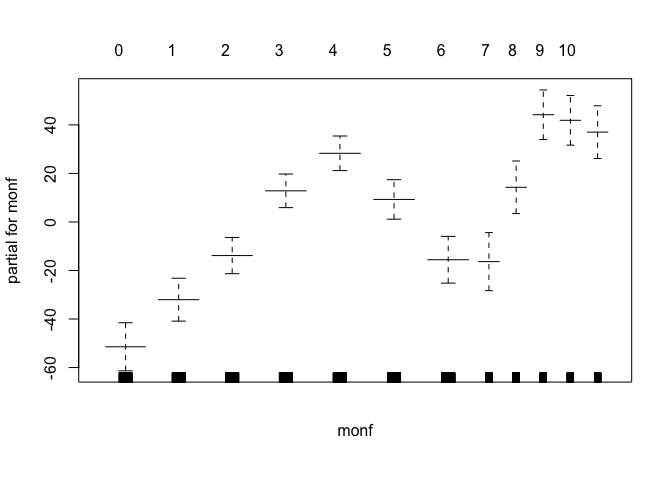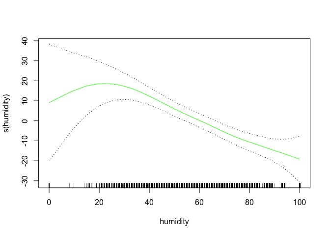

    ## [1] "count~weather+typeofday+wday+hour+yearf+monf+atemp+humidity+windspeed"
    ##             %IncMSE IncNodePurity
    ## weather    44.56910       3291422
    ## typeofday  56.22691       5461633
    ## wday       49.39893       7168380
    ## hour      163.83063      83726482
    ## yearf     108.05947       9305735
    ## monf       51.53548      13357983
    ## atemp      68.96929      23816959
    ## humidity   48.53365      12293394
    ## windspeed  21.06006       3762287


    ## dataset= 112.6 model=rf trainerror= 574.6565 testerror= 2314.116

    ##                 var   rel.inf
    ## hour           hour 56.854495
    ## atemp         atemp 12.724364
    ## monf           monf  7.898436
    ## yearf         yearf  6.535071
    ## typeofday typeofday  5.638818
    ## wday           wday  3.857065
    ## humidity   humidity  2.893689
    ## weather     weather  2.474577
    ## windspeed windspeed  1.123486
    ## dataset= 112.6 model=boost trainerror= 314.8866 testerror= 1550.333[1] 8607   16
    ## [1] "112.6"
    ##      dataset model      trainerror testerror
    ## [1,] "112.6" "lm"       8283.862   8575.529 
    ## [2,] "112.6" "gam_lm"   8283.862   8575.529 
    ## [3,] "112.6" "gam_poly" 8134.379   8355.733 
    ## [4,] "112.6" "gam_s"    8086.01    8305.856 
    ## [5,] "112.6" "rf"       574.6565   2314.116 
    ## [6,] "112.6" "boost"    314.8866   1550.333 
    ## [1] "model with lowest test error"
    ##   dataset model trainerror testerror
    ## 6   112.6 boost   314.8866  1550.333

    ## Warning in createDataPartition(dataset$partgroup, p = 0.7, list = F):
    ## Some classes have a single record ( Light Rain/Snow_Weekend_11, Snow/Heavy
    ## Rain_Working Day_0 ) and these will be selected for the sample

    ## [1] "weather+typeofday+wday+hour+yearf+monf"
    ## [1] "count~weather+typeofday+wday+hour+yearf+monf+atemp+humidity+windspeed"

    ## Warning in predict.lm(fit_lm, newdata = trainset): prediction from a rank-
    ## deficient fit may be misleading

    ## Warning in predict.lm(fit_lm, newdata = testset): prediction from a rank-
    ## deficient fit may be misleading

    ## dataset= 112.7 model=lm trainerror= 8871.169 testerror= 8940.888

    ## Warning: not plotting observations with leverage one:
    ##   3984


    ## Warning: not plotting observations with leverage one:
    ##   3984

    ## [1] "count~weather+typeofday+wday+hour+yearf+monf+atemp+humidity+windspeed"
    ## 
    ## Call: gam(formula = as.formula(formula_string), data = trainset)
    ## Deviance Residuals:
    ##      Min       1Q   Median       3Q      Max 
    ## -338.186  -56.066   -6.763   47.854  448.921 
    ## 
    ## (Dispersion Parameter for gaussian family taken to be 8939.786)
    ## 
    ##     Null Deviance: 185478470 on 6383 degrees of freedom
    ## Residual Deviance: 56633546 on 6335 degrees of freedom
    ## AIC: 76251.15 
    ## 
    ## Number of Local Scoring Iterations: 2 
    ## 
    ## Anova for Parametric Effects
    ##             Df   Sum Sq  Mean Sq   F value    Pr(>F)    
    ## weather      3  3714998  1238333  138.5193 < 2.2e-16 ***
    ## typeofday    2    57423    28711    3.2116   0.04036 *  
    ## wday         5   257546    51509    5.7618 2.595e-05 ***
    ## hour        23 93742846  4075776  455.9142 < 2.2e-16 ***
    ## yearf        1 10512637 10512637 1175.9383 < 2.2e-16 ***
    ## monf        11 18501485  1681953  188.1424 < 2.2e-16 ***
    ## atemp        1  1413134  1413134  158.0725 < 2.2e-16 ***
    ## humidity     1   608648   608648   68.0831 < 2.2e-16 ***
    ## windspeed    1    36207    36207    4.0501   0.04421 *  
    ## Residuals 6335 56633546     8940                        
    ## ---
    ## Signif. codes:  0 '***' 0.001 '**' 0.01 '*' 0.05 '.' 0.1 ' ' 1

    ## Warning in predict.lm(object, newdata, se.fit, scale = 1, type =
    ## ifelse(type == : prediction from a rank-deficient fit may be misleading

    ## Warning in predict.lm(object, newdata, se.fit, scale = 1, type =
    ## ifelse(type == : prediction from a rank-deficient fit may be misleading


    ## dataset= 112.7 model=gam_lm trainerror= 8871.169 testerror= 8940.888


    ## [1] 6384   16
    ## 
    ## Call: gam(formula = as.formula(formula_string_2), data = trainset)
    ## Deviance Residuals:
    ##      Min       1Q   Median       3Q      Max 
    ## -356.636  -55.407   -5.971   47.329  436.660 
    ## 
    ## (Dispersion Parameter for gaussian family taken to be 8879.281)
    ## 
    ##     Null Deviance: 185478470 on 6383 degrees of freedom
    ## Residual Deviance: 56223609 on 6332 degrees of freedom
    ## AIC: 76210.78 
    ## 
    ## Number of Local Scoring Iterations: 2 
    ## 
    ## Anova for Parametric Effects
    ##                      Df   Sum Sq  Mean Sq   F value    Pr(>F)    
    ## weather               3  3714998  1238333  139.4632 < 2.2e-16 ***
    ## typeofday             2    57423    28711    3.2335  0.039483 *  
    ## wday                  5   257546    51509    5.8010 2.376e-05 ***
    ## hour                 23 93742846  4075776  459.0209 < 2.2e-16 ***
    ## yearf                 1 10512637 10512637 1183.9514 < 2.2e-16 ***
    ## monf                 11 18501485  1681953  189.4245 < 2.2e-16 ***
    ## poly(atemp, 2)        2  1819932   909966  102.4819 < 2.2e-16 ***
    ## poly(humidity, 2)     2   545164   272582   30.6987 5.395e-14 ***
    ## poly(windspeed, 2)    2   102829    51415    5.7904  0.003073 ** 
    ## Residuals          6332 56223609     8879                        
    ## ---
    ## Signif. codes:  0 '***' 0.001 '**' 0.01 '*' 0.05 '.' 0.1 ' ' 1
    ## 
    ## 
    ## Call: gam(formula = as.formula(formula_string_3), data = trainset)
    ## Deviance Residuals:
    ##      Min       1Q   Median       3Q      Max 
    ## -340.557  -56.499   -5.413   48.611  437.691 
    ## 
    ## (Dispersion Parameter for gaussian family taken to be 8794.53)
    ## 
    ##     Null Deviance: 185478470 on 6383 degrees of freedom
    ## Residual Deviance: 55660580 on 6329 degrees of freedom
    ## AIC: 76152.52 
    ## 
    ## Number of Local Scoring Iterations: 2 
    ## 
    ## Anova for Parametric Effects
    ##                      Df   Sum Sq  Mean Sq   F value    Pr(>F)    
    ## weather               3  3714998  1238333  140.8072 < 2.2e-16 ***
    ## typeofday             2    57423    28711    3.2647 0.0382732 *  
    ## wday                  5   257546    51509    5.8570 2.095e-05 ***
    ## hour                 23 93742846  4075776  463.4444 < 2.2e-16 ***
    ## yearf                 1 10512637 10512637 1195.3609 < 2.2e-16 ***
    ## monf                 11 18501485  1681953  191.2499 < 2.2e-16 ***
    ## poly(atemp, 3)        3  2381884   793961   90.2790 < 2.2e-16 ***
    ## poly(humidity, 3)     3   496530   165510   18.8197 3.783e-12 ***
    ## poly(windspeed, 3)    3   152542    50847    5.7817 0.0006065 ***
    ## Residuals          6329 55660580     8795                        
    ## ---
    ## Signif. codes:  0 '***' 0.001 '**' 0.01 '*' 0.05 '.' 0.1 ' ' 1
    ## 
    ## 
    ## Call: gam(formula = as.formula(formula_string_4), data = trainset)
    ## Deviance Residuals:
    ##      Min       1Q   Median       3Q      Max 
    ## -348.842  -56.625   -4.367   47.654  431.697 
    ## 
    ## (Dispersion Parameter for gaussian family taken to be 8722.197)
    ## 
    ##     Null Deviance: 185478470 on 6383 degrees of freedom
    ## Residual Deviance: 55176615 on 6326 degrees of freedom
    ## AIC: 76102.77 
    ## 
    ## Number of Local Scoring Iterations: 2 
    ## 
    ## Anova for Parametric Effects
    ##                      Df   Sum Sq  Mean Sq   F value    Pr(>F)    
    ## weather               3  3714998  1238333  141.9749 < 2.2e-16 ***
    ## typeofday             2    57423    28711    3.2918  0.037252 *  
    ## wday                  5   257546    51509    5.9055 1.878e-05 ***
    ## hour                 23 93742846  4075776  467.2878 < 2.2e-16 ***
    ## yearf                 1 10512637 10512637 1205.2741 < 2.2e-16 ***
    ## monf                 11 18501485  1681953  192.8360 < 2.2e-16 ***
    ## poly(atemp, 4)        4  2937874   734468   84.2068 < 2.2e-16 ***
    ## poly(humidity, 4)     4   451757   112939   12.9485 1.679e-10 ***
    ## poly(windspeed, 4)    4   125289    31322    3.5911  0.006257 ** 
    ## Residuals          6326 55176615     8722                        
    ## ---
    ## Signif. codes:  0 '***' 0.001 '**' 0.01 '*' 0.05 '.' 0.1 ' ' 1
    ## 
    ## 
    ## Call: gam(formula = as.formula(formula_string_5), data = trainset)
    ## Deviance Residuals:
    ##      Min       1Q   Median       3Q      Max 
    ## -354.558  -56.770   -4.621   47.511  427.980 
    ## 
    ## (Dispersion Parameter for gaussian family taken to be 8712.168)
    ## 
    ##     Null Deviance: 185478470 on 6383 degrees of freedom
    ## Residual Deviance: 55087041 on 6323 degrees of freedom
    ## AIC: 76098.4 
    ## 
    ## Number of Local Scoring Iterations: 2 
    ## 
    ## Anova for Parametric Effects
    ##                      Df   Sum Sq  Mean Sq   F value    Pr(>F)    
    ## weather               3  3714998  1238333  142.1383 < 2.2e-16 ***
    ## typeofday             2    57423    28711    3.2956   0.03711 *  
    ## wday                  5   257546    51509    5.9123 1.850e-05 ***
    ## hour                 23 93742846  4075776  467.8257 < 2.2e-16 ***
    ## yearf                 1 10512637 10512637 1206.6614 < 2.2e-16 ***
    ## monf                 11 18501485  1681953  193.0579 < 2.2e-16 ***
    ## poly(atemp, 5)        5  3011639   602328   69.1364 < 2.2e-16 ***
    ## poly(humidity, 5)     5   464838    92968   10.6710 3.142e-10 ***
    ## poly(windspeed, 5)    5   128018    25604    2.9388   0.01182 *  
    ## Residuals          6323 55087041     8712                        
    ## ---
    ## Signif. codes:  0 '***' 0.001 '**' 0.01 '*' 0.05 '.' 0.1 ' ' 1
    ## 
    ## Analysis of Deviance Table
    ## 
    ## Model 1: count ~ weather + typeofday + wday + hour + yearf + monf + poly(atemp, 
    ##     2) + poly(humidity, 2) + poly(windspeed, 2)
    ## Model 2: count ~ weather + typeofday + wday + hour + yearf + monf + poly(atemp, 
    ##     3) + poly(humidity, 3) + poly(windspeed, 3)
    ## Model 3: count ~ weather + typeofday + wday + hour + yearf + monf + poly(atemp, 
    ##     4) + poly(humidity, 4) + poly(windspeed, 4)
    ## Model 4: count ~ weather + typeofday + wday + hour + yearf + monf + poly(atemp, 
    ##     5) + poly(humidity, 5) + poly(windspeed, 5)
    ##   Resid. Df Resid. Dev Df Deviance  Pr(>Chi)    
    ## 1      6332   56223609                          
    ## 2      6329   55660580  3   563030 6.032e-14 ***
    ## 3      6326   55176615  3   483964 5.239e-12 ***
    ## 4      6323   55087041  3    89575   0.01632 *  
    ## ---
    ## Signif. codes:  0 '***' 0.001 '**' 0.01 '*' 0.05 '.' 0.1 ' ' 1

    ## Warning in predict.lm(object, newdata, se.fit, scale = 1, type =
    ## ifelse(type == : prediction from a rank-deficient fit may be misleading

    ## Warning in predict.lm(object, newdata, se.fit, scale = 1, type =
    ## ifelse(type == : prediction from a rank-deficient fit may be misleading

    ## dataset= 112.7 model=gam_poly trainerror= 8718.762 testerror= 8804.575[1] "count~weather+typeofday+wday+hour+yearf+monf+s(atemp)+s(humidity)+s(windspeed)"

    ## Warning in predict.lm(object, newdata, se.fit, scale = 1, type =
    ## ifelse(type == : prediction from a rank-deficient fit may be misleading

    ## Warning in predict.lm(object, newdata, se.fit, scale = 1, type =
    ## ifelse(type == : prediction from a rank-deficient fit may be misleading


    ## dataset= 112.7 model=gam_s trainerror= 8667.892 testerror= 8753.304
    ## Call: gam(formula = as.formula(formula_string), data = trainset)
    ## Deviance Residuals:
    ##      Min       1Q   Median       3Q      Max 
    ## -344.199  -56.420   -4.801   47.314  434.306 
    ## 
    ## (Dispersion Parameter for gaussian family taken to be 8747.35)
    ## 
    ##     Null Deviance: 185478470 on 6383 degrees of freedom
    ## Residual Deviance: 55335736 on 6326 degrees of freedom
    ## AIC: 76121.16 
    ## 
    ## Number of Local Scoring Iterations: 2 
    ## 
    ## Anova for Parametric Effects
    ##                Df   Sum Sq  Mean Sq   F value    Pr(>F)    
    ## weather         3  3068602  1022867  116.9345 < 2.2e-16 ***
    ## typeofday       2    77125    38562    4.4085  0.012211 *  
    ## wday            5   304437    60887    6.9607 1.714e-06 ***
    ## hour           23 93029831  4044775  462.4001 < 2.2e-16 ***
    ## yearf           1 10207105 10207105 1166.8798 < 2.2e-16 ***
    ## monf           11 19124684  1738608  198.7582 < 2.2e-16 ***
    ## s(atemp)        1  2017242  2017242  230.6118 < 2.2e-16 ***
    ## s(humidity)     1   434055   434055   49.6213 2.062e-12 ***
    ## s(windspeed)    1    60071    60071    6.8674  0.008799 ** 
    ## Residuals    6326 55335736     8747                        
    ## ---
    ## Signif. codes:  0 '***' 0.001 '**' 0.01 '*' 0.05 '.' 0.1 ' ' 1
    ## 
    ## Anova for Nonparametric Effects
    ##              Npar Df Npar F   Pr(F)    
    ## (Intercept)                            
    ## weather                                
    ## typeofday                              
    ## wday                                   
    ## hour                                   
    ## yearf                                  
    ## monf                                   
    ## s(atemp)           3 40.530 < 2e-16 ***
    ## s(humidity)        3  3.592 0.01305 *  
    ## s(windspeed)       3  2.849 0.03604 *  
    ## ---
    ## Signif. codes:  0 '***' 0.001 '**' 0.01 '*' 0.05 '.' 0.1 ' ' 1

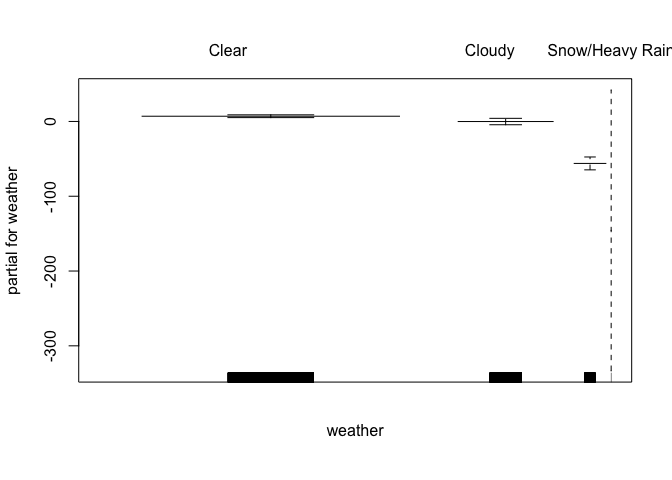

    ## [1] "count~weather+typeofday+wday+hour+yearf+monf+atemp+humidity+windspeed"
    ##             %IncMSE IncNodePurity
    ## weather    41.35852       3191804
    ## typeofday  56.82013       5906737
    ## wday       52.38582       8245479
    ## hour      162.85461      93217634
    ## yearf     117.55714      10743502
    ## monf       53.05207      14860757
    ## atemp      74.36304      27103961
    ## humidity   48.86707      13798452
    ## windspeed  21.68336       4333665


    ## dataset= 112.7 model=rf trainerror= 608.7361 testerror= 2351.148

    ##                 var    rel.inf
    ## hour           hour 54.7238831
    ## atemp         atemp 12.2064266
    ## monf           monf  8.2160435
    ## yearf         yearf  7.5082070
    ## typeofday typeofday  6.8940721
    ## wday           wday  4.1538478
    ## humidity   humidity  3.0211043
    ## weather     weather  2.3064934
    ## windspeed windspeed  0.9699222
    ## dataset= 112.7 model=boost trainerror= 340.2438 testerror= 1524.786[1] 9063   16
    ## [1] "112.7"
    ##      dataset model      trainerror testerror
    ## [1,] "112.7" "lm"       8871.169   8940.888 
    ## [2,] "112.7" "gam_lm"   8871.169   8940.888 
    ## [3,] "112.7" "gam_poly" 8718.762   8804.575 
    ## [4,] "112.7" "gam_s"    8667.892   8753.304 
    ## [5,] "112.7" "rf"       608.7361   2351.148 
    ## [6,] "112.7" "boost"    340.2438   1524.786 
    ## [1] "model with lowest test error"
    ##   dataset model trainerror testerror
    ## 6   112.7 boost   340.2438  1524.786

    ## Warning in createDataPartition(dataset$partgroup, p = 0.7, list = F):
    ## Some classes have a single record ( Light Rain/Snow_Weekend_11, Snow/Heavy
    ## Rain_Working Day_0 ) and these will be selected for the sample

    ## [1] "weather+typeofday+wday+hour+yearf+monf"
    ## [1] "count~weather+typeofday+wday+hour+yearf+monf+atemp+humidity+windspeed"

    ## Warning in predict.lm(fit_lm, newdata = trainset): prediction from a rank-
    ## deficient fit may be misleading

    ## Warning in predict.lm(fit_lm, newdata = testset): prediction from a rank-
    ## deficient fit may be misleading

    ## dataset= 112.8 model=lm trainerror= 9302.836 testerror= 10218.79

    ## Warning: not plotting observations with leverage one:
    ##   3994


    ## Warning: not plotting observations with leverage one:
    ##   3994

    ## [1] "count~weather+typeofday+wday+hour+yearf+monf+atemp+humidity+windspeed"
    ## 
    ## Call: gam(formula = as.formula(formula_string), data = trainset)
    ## Deviance Residuals:
    ##     Min      1Q  Median      3Q     Max 
    ## -341.59  -59.44   -6.27   49.26  409.86 
    ## 
    ## (Dispersion Parameter for gaussian family taken to be 9371.373)
    ## 
    ##     Null Deviance: 206809505 on 6699 degrees of freedom
    ## Residual Deviance: 62329004 on 6651 degrees of freedom
    ## AIC: 80338.88 
    ## 
    ## Number of Local Scoring Iterations: 2 
    ## 
    ## Anova for Parametric Effects
    ##             Df    Sum Sq  Mean Sq   F value    Pr(>F)    
    ## weather      3   4249412  1416471  151.1487 < 2.2e-16 ***
    ## typeofday    2     12403     6201    0.6617 0.5159889    
    ## wday         5     92430    18486    1.9726 0.0793611 .  
    ## hour        23 105311141  4578745  488.5885 < 2.2e-16 ***
    ## yearf        1  13761391 13761391 1468.4497 < 2.2e-16 ***
    ## monf        11  18800450  1709132  182.3779 < 2.2e-16 ***
    ## atemp        1   1464689  1464689  156.2940 < 2.2e-16 ***
    ## humidity     1    679554   679554   72.5138 < 2.2e-16 ***
    ## windspeed    1    109032   109032   11.6345 0.0006512 ***
    ## Residuals 6651  62329004     9371                        
    ## ---
    ## Signif. codes:  0 '***' 0.001 '**' 0.01 '*' 0.05 '.' 0.1 ' ' 1

    ## Warning in predict.lm(object, newdata, se.fit, scale = 1, type =
    ## ifelse(type == : prediction from a rank-deficient fit may be misleading

    ## Warning in predict.lm(object, newdata, se.fit, scale = 1, type =
    ## ifelse(type == : prediction from a rank-deficient fit may be misleading


    ## dataset= 112.8 model=gam_lm trainerror= 9302.836 testerror= 10218.79


    ## [1] 6700   16
    ## 
    ## Call: gam(formula = as.formula(formula_string_2), data = trainset)
    ## Deviance Residuals:
    ##      Min       1Q   Median       3Q      Max 
    ## -361.610  -57.130   -5.239   49.131  402.242 
    ## 
    ## (Dispersion Parameter for gaussian family taken to be 9288.564)
    ## 
    ##     Null Deviance: 206809505 on 6699 degrees of freedom
    ## Residual Deviance: 61750376 on 6648 degrees of freedom
    ## AIC: 80282.39 
    ## 
    ## Number of Local Scoring Iterations: 2 
    ## 
    ## Anova for Parametric Effects
    ##                      Df    Sum Sq  Mean Sq   F value    Pr(>F)    
    ## weather               3   4249412  1416471  152.4962 < 2.2e-16 ***
    ## typeofday             2     12403     6201    0.6676   0.51295    
    ## wday                  5     92430    18486    1.9902   0.07679 .  
    ## hour                 23 105311141  4578745  492.9443 < 2.2e-16 ***
    ## yearf                 1  13761391 13761391 1481.5412 < 2.2e-16 ***
    ## monf                 11  18800450  1709132  184.0039 < 2.2e-16 ***
    ## poly(atemp, 2)        2   2026503  1013252  109.0859 < 2.2e-16 ***
    ## poly(humidity, 2)     2    577325   288663   31.0772 3.682e-14 ***
    ## poly(windspeed, 2)    2    228074   114037   12.2772 4.763e-06 ***
    ## Residuals          6648  61750376     9289                        
    ## ---
    ## Signif. codes:  0 '***' 0.001 '**' 0.01 '*' 0.05 '.' 0.1 ' ' 1
    ## 
    ## 
    ## Call: gam(formula = as.formula(formula_string_3), data = trainset)
    ## Deviance Residuals:
    ##      Min       1Q   Median       3Q      Max 
    ## -342.014  -58.679   -5.375   49.577  386.068 
    ## 
    ## (Dispersion Parameter for gaussian family taken to be 9201.474)
    ## 
    ##     Null Deviance: 206809505 on 6699 degrees of freedom
    ## Residual Deviance: 61143793 on 6645 degrees of freedom
    ## AIC: 80222.25 
    ## 
    ## Number of Local Scoring Iterations: 2 
    ## 
    ## Anova for Parametric Effects
    ##                      Df    Sum Sq  Mean Sq  F value    Pr(>F)    
    ## weather               3   4249412  1416471  153.940 < 2.2e-16 ***
    ## typeofday             2     12403     6201    0.674   0.50972    
    ## wday                  5     92430    18486    2.009   0.07411 .  
    ## hour                 23 105311141  4578745  497.610 < 2.2e-16 ***
    ## yearf                 1  13761391 13761391 1495.564 < 2.2e-16 ***
    ## monf                 11  18800450  1709132  185.745 < 2.2e-16 ***
    ## poly(atemp, 3)        3   2595129   865043   94.011 < 2.2e-16 ***
    ## poly(humidity, 3)     3    516639   172213   18.716 4.378e-12 ***
    ## poly(windspeed, 3)    3    326717   108906   11.836 9.954e-08 ***
    ## Residuals          6645  61143793     9201                       
    ## ---
    ## Signif. codes:  0 '***' 0.001 '**' 0.01 '*' 0.05 '.' 0.1 ' ' 1
    ## 
    ## 
    ## Call: gam(formula = as.formula(formula_string_4), data = trainset)
    ## Deviance Residuals:
    ##      Min       1Q   Median       3Q      Max 
    ## -351.976  -58.066   -4.343   50.155  381.362 
    ## 
    ## (Dispersion Parameter for gaussian family taken to be 9119.352)
    ## 
    ##     Null Deviance: 206809505 on 6699 degrees of freedom
    ## Residual Deviance: 60570735 on 6642 degrees of freedom
    ## AIC: 80165.16 
    ## 
    ## Number of Local Scoring Iterations: 2 
    ## 
    ## Anova for Parametric Effects
    ##                      Df    Sum Sq  Mean Sq   F value    Pr(>F)    
    ## weather               3   4249412  1416471  155.3258 < 2.2e-16 ***
    ## typeofday             2     12403     6201    0.6800   0.50664    
    ## wday                  5     92430    18486    2.0271   0.07163 .  
    ## hour                 23 105311141  4578745  502.0911 < 2.2e-16 ***
    ## yearf                 1  13761391 13761391 1509.0317 < 2.2e-16 ***
    ## monf                 11  18800450  1709132  187.4181 < 2.2e-16 ***
    ## poly(atemp, 4)        4   3251882   812971   89.1478 < 2.2e-16 ***
    ## poly(humidity, 4)     4    496513   124128   13.6115 4.705e-11 ***
    ## poly(windspeed, 4)    4    263148    65787    7.2140 8.592e-06 ***
    ## Residuals          6642  60570735     9119                        
    ## ---
    ## Signif. codes:  0 '***' 0.001 '**' 0.01 '*' 0.05 '.' 0.1 ' ' 1
    ## 
    ## 
    ## Call: gam(formula = as.formula(formula_string_5), data = trainset)
    ## Deviance Residuals:
    ##      Min       1Q   Median       3Q      Max 
    ## -353.993  -57.518   -4.287   50.003  383.380 
    ## 
    ## (Dispersion Parameter for gaussian family taken to be 9118.293)
    ## 
    ##     Null Deviance: 206809505 on 6699 degrees of freedom
    ## Residual Deviance: 60536348 on 6639 degrees of freedom
    ## AIC: 80167.35 
    ## 
    ## Number of Local Scoring Iterations: 2 
    ## 
    ## Anova for Parametric Effects
    ##                      Df    Sum Sq  Mean Sq   F value    Pr(>F)    
    ## weather               3   4249412  1416471  155.3438 < 2.2e-16 ***
    ## typeofday             2     12403     6201    0.6801    0.5066    
    ## wday                  5     92430    18486    2.0274    0.0716 .  
    ## hour                 23 105311141  4578745  502.1494 < 2.2e-16 ***
    ## yearf                 1  13761391 13761391 1509.2069 < 2.2e-16 ***
    ## monf                 11  18800450  1709132  187.4399 < 2.2e-16 ***
    ## poly(atemp, 5)        5   3263797   652759   71.5879 < 2.2e-16 ***
    ## poly(humidity, 5)     5    509139   101828   11.1674 9.749e-11 ***
    ## poly(windspeed, 5)    5    272995    54599    5.9878 1.558e-05 ***
    ## Residuals          6639  60536348     9118                        
    ## ---
    ## Signif. codes:  0 '***' 0.001 '**' 0.01 '*' 0.05 '.' 0.1 ' ' 1
    ## 
    ## Analysis of Deviance Table
    ## 
    ## Model 1: count ~ weather + typeofday + wday + hour + yearf + monf + poly(atemp, 
    ##     2) + poly(humidity, 2) + poly(windspeed, 2)
    ## Model 2: count ~ weather + typeofday + wday + hour + yearf + monf + poly(atemp, 
    ##     3) + poly(humidity, 3) + poly(windspeed, 3)
    ## Model 3: count ~ weather + typeofday + wday + hour + yearf + monf + poly(atemp, 
    ##     4) + poly(humidity, 4) + poly(windspeed, 4)
    ## Model 4: count ~ weather + typeofday + wday + hour + yearf + monf + poly(atemp, 
    ##     5) + poly(humidity, 5) + poly(windspeed, 5)
    ##   Resid. Df Resid. Dev Df Deviance  Pr(>Chi)    
    ## 1      6648   61750376                          
    ## 2      6645   61143793  3   606583 2.368e-14 ***
    ## 3      6642   60570735  3   573059 1.448e-13 ***
    ## 4      6639   60536348  3    34386    0.2873    
    ## ---
    ## Signif. codes:  0 '***' 0.001 '**' 0.01 '*' 0.05 '.' 0.1 ' ' 1

    ## Warning in predict.lm(object, newdata, se.fit, scale = 1, type =
    ## ifelse(type == : prediction from a rank-deficient fit may be misleading

    ## Warning in predict.lm(object, newdata, se.fit, scale = 1, type =
    ## ifelse(type == : prediction from a rank-deficient fit may be misleading

    ## dataset= 112.8 model=gam_poly trainerror= 9125.939 testerror= 10103.48[1] "count~weather+typeofday+wday+hour+yearf+monf+s(atemp)+s(humidity)+s(windspeed)"

    ## Warning in predict.lm(object, newdata, se.fit, scale = 1, type =
    ## ifelse(type == : prediction from a rank-deficient fit may be misleading

    ## Warning in predict.lm(object, newdata, se.fit, scale = 1, type =
    ## ifelse(type == : prediction from a rank-deficient fit may be misleading


    ## dataset= 112.8 model=gam_s trainerror= 9061.964 testerror= 10050.88
    ## Call: gam(formula = as.formula(formula_string), data = trainset)
    ## Deviance Residuals:
    ##      Min       1Q   Median       3Q      Max 
    ## -345.087  -57.615   -5.155   49.576  386.201 
    ## 
    ## (Dispersion Parameter for gaussian family taken to be 9141.076)
    ## 
    ##     Null Deviance: 206809505 on 6699 degrees of freedom
    ## Residual Deviance: 60715031 on 6642 degrees of freedom
    ## AIC: 80181.1 
    ## 
    ## Number of Local Scoring Iterations: 2 
    ## 
    ## Anova for Parametric Effects
    ##                Df    Sum Sq  Mean Sq   F value    Pr(>F)    
    ## weather         3   3546150  1182050  129.3119 < 2.2e-16 ***
    ## typeofday       2     38727    19364    2.1183   0.12032    
    ## wday            5    117838    23568    2.5782   0.02451 *  
    ## hour           23 103740491  4510456  493.4273 < 2.2e-16 ***
    ## yearf           1  13380074 13380074 1463.7308 < 2.2e-16 ***
    ## monf           11  19830681  1802789  197.2185 < 2.2e-16 ***
    ## s(atemp)        1   2120643  2120643  231.9905 < 2.2e-16 ***
    ## s(humidity)     1    483035   483035   52.8423 4.028e-13 ***
    ## s(windspeed)    1    153268   153268   16.7669 4.277e-05 ***
    ## Residuals    6642  60715031     9141                        
    ## ---
    ## Signif. codes:  0 '***' 0.001 '**' 0.01 '*' 0.05 '.' 0.1 ' ' 1
    ## 
    ## Anova for Nonparametric Effects
    ##              Npar Df Npar F     Pr(F)    
    ## (Intercept)                              
    ## weather                                  
    ## typeofday                                
    ## wday                                     
    ## hour                                     
    ## yearf                                    
    ## monf                                     
    ## s(atemp)           3 49.753 < 2.2e-16 ***
    ## s(humidity)        3  2.882  0.034471 *  
    ## s(windspeed)       3  4.263  0.005144 ** 
    ## ---
    ## Signif. codes:  0 '***' 0.001 '**' 0.01 '*' 0.05 '.' 0.1 ' ' 1


    ## [1] "count~weather+typeofday+wday+hour+yearf+monf+atemp+humidity+windspeed"
    ##             %IncMSE IncNodePurity
    ## weather    42.76042       3498310
    ## typeofday  58.09512       6395959
    ## wday       53.83627       8810594
    ## hour      161.76252     103362495
    ## yearf     126.63560      13518374
    ## monf       47.34817      16165387
    ## atemp      73.38458      31557412
    ## humidity   43.89587      14363363
    ## windspeed  19.32208       4478570


    ## dataset= 112.8 model=rf trainerror= 606.7941 testerror= 2669.373

    ##                 var    rel.inf
    ## hour           hour 56.5582941
    ## atemp         atemp 12.3559537
    ## monf           monf  8.1108137
    ## yearf         yearf  8.0426204
    ## typeofday typeofday  6.1236380
    ## wday           wday  3.2386455
    ## humidity   humidity  2.5528910
    ## weather     weather  2.0953509
    ## windspeed windspeed  0.9217928
    ## dataset= 112.8 model=boost trainerror= 354.628 testerror= 1598.125[1] 9519   16
    ## [1] "112.8"
    ##      dataset model      trainerror testerror
    ## [1,] "112.8" "lm"       9302.836   10218.79 
    ## [2,] "112.8" "gam_lm"   9302.836   10218.79 
    ## [3,] "112.8" "gam_poly" 9125.939   10103.48 
    ## [4,] "112.8" "gam_s"    9061.964   10050.88 
    ## [5,] "112.8" "rf"       606.7941   2669.373 
    ## [6,] "112.8" "boost"    354.628    1598.125 
    ## [1] "model with lowest test error"
    ##   dataset model trainerror testerror
    ## 6   112.8 boost    354.628  1598.125

    ## Warning in createDataPartition(dataset$partgroup, p = 0.7, list = F):
    ## Some classes have a single record ( Light Rain/Snow_Weekend_11, Snow/Heavy
    ## Rain_Working Day_0 ) and these will be selected for the sample

    ## [1] "weather+typeofday+wday+hour+yearf+monf"
    ## [1] "count~weather+typeofday+wday+hour+yearf+monf+atemp+humidity+windspeed"

    ## Warning in predict.lm(fit_lm, newdata = trainset): prediction from a rank-
    ## deficient fit may be misleading

    ## Warning in predict.lm(fit_lm, newdata = testset): prediction from a rank-
    ## deficient fit may be misleading

    ## dataset= 112.9 model=lm trainerror= 9988.283 testerror= 10004.14

    ## Warning: not plotting observations with leverage one:
    ##   3948


    ## Warning: not plotting observations with leverage one:
    ##   3948

    ## [1] "count~weather+typeofday+wday+hour+yearf+monf+atemp+humidity+windspeed"
    ## 
    ## Call: gam(formula = as.formula(formula_string), data = trainset)
    ## Deviance Residuals:
    ##      Min       1Q   Median       3Q      Max 
    ## -350.094  -61.226   -6.554   51.234  425.838 
    ## 
    ## (Dispersion Parameter for gaussian family taken to be 10058.48)
    ## 
    ##     Null Deviance: 228060400 on 7020 degrees of freedom
    ## Residual Deviance: 70127735 on 6972 degrees of freedom
    ## AIC: 84682.3 
    ## 
    ## Number of Local Scoring Iterations: 2 
    ## 
    ## Anova for Parametric Effects
    ##             Df    Sum Sq  Mean Sq   F value    Pr(>F)    
    ## weather      3   3915084  1305028  129.7440 < 2.2e-16 ***
    ## typeofday    2    115414    57707    5.7372  0.003239 ** 
    ## wday         5    302962    60592    6.0240 1.434e-05 ***
    ## hour        23 115299334  5013015  498.3868 < 2.2e-16 ***
    ## yearf        1  16603849 16603849 1650.7312 < 2.2e-16 ***
    ## monf        11  18821186  1711017  170.1069 < 2.2e-16 ***
    ## atemp        1   1978023  1978023  196.6523 < 2.2e-16 ***
    ## humidity     1    860984   860984   85.5978 < 2.2e-16 ***
    ## windspeed    1     35829    35829    3.5621  0.059155 .  
    ## Residuals 6972  70127735    10058                        
    ## ---
    ## Signif. codes:  0 '***' 0.001 '**' 0.01 '*' 0.05 '.' 0.1 ' ' 1

    ## Warning in predict.lm(object, newdata, se.fit, scale = 1, type =
    ## ifelse(type == : prediction from a rank-deficient fit may be misleading

    ## Warning in predict.lm(object, newdata, se.fit, scale = 1, type =
    ## ifelse(type == : prediction from a rank-deficient fit may be misleading


    ## dataset= 112.9 model=gam_lm trainerror= 9988.283 testerror= 10004.14


    ## [1] 7021   16
    ## 
    ## Call: gam(formula = as.formula(formula_string_2), data = trainset)
    ## Deviance Residuals:
    ##      Min       1Q   Median       3Q      Max 
    ## -367.248  -60.099   -5.582   50.567  425.466 
    ## 
    ## (Dispersion Parameter for gaussian family taken to be 9988.871)
    ## 
    ##     Null Deviance: 228060400 on 7020 degrees of freedom
    ## Residual Deviance: 69612440 on 6969 degrees of freedom
    ## AIC: 84636.52 
    ## 
    ## Number of Local Scoring Iterations: 2 
    ## 
    ## Anova for Parametric Effects
    ##                      Df    Sum Sq  Mean Sq   F value    Pr(>F)    
    ## weather               3   3915084  1305028  130.6482 < 2.2e-16 ***
    ## typeofday             2    115414    57707    5.7771  0.003112 ** 
    ## wday                  5    302962    60592    6.0660 1.305e-05 ***
    ## hour                 23 115299334  5013015  501.8600 < 2.2e-16 ***
    ## yearf                 1  16603849 16603849 1662.2349 < 2.2e-16 ***
    ## monf                 11  18821186  1711017  171.2923 < 2.2e-16 ***
    ## poly(atemp, 2)        2   2518912  1259456  126.0859 < 2.2e-16 ***
    ## poly(humidity, 2)     2    760794   380397   38.0821 < 2.2e-16 ***
    ## poly(windspeed, 2)    2    110425    55213    5.5274  0.003994 ** 
    ## Residuals          6969  69612440     9989                        
    ## ---
    ## Signif. codes:  0 '***' 0.001 '**' 0.01 '*' 0.05 '.' 0.1 ' ' 1
    ## 
    ## 
    ## Call: gam(formula = as.formula(formula_string_3), data = trainset)
    ## Deviance Residuals:
    ##      Min       1Q   Median       3Q      Max 
    ## -353.920  -61.333   -5.857   51.085  420.444 
    ## 
    ## (Dispersion Parameter for gaussian family taken to be 9898.727)
    ## 
    ##     Null Deviance: 228060400 on 7020 degrees of freedom
    ## Residual Deviance: 68954530 on 6966 degrees of freedom
    ## AIC: 84575.85 
    ## 
    ## Number of Local Scoring Iterations: 2 
    ## 
    ## Anova for Parametric Effects
    ##                      Df    Sum Sq  Mean Sq   F value    Pr(>F)    
    ## weather               3   3915084  1305028  131.8380 < 2.2e-16 ***
    ## typeofday             2    115414    57707    5.8298  0.002953 ** 
    ## wday                  5    302962    60592    6.1212 1.151e-05 ***
    ## hour                 23 115299334  5013015  506.4302 < 2.2e-16 ***
    ## yearf                 1  16603849 16603849 1677.3722 < 2.2e-16 ***
    ## monf                 11  18821186  1711017  172.8522 < 2.2e-16 ***
    ## poly(atemp, 3)        3   3164838  1054946  106.5739 < 2.2e-16 ***
    ## poly(humidity, 3)     3    709933   236644   23.9065 2.185e-15 ***
    ## poly(windspeed, 3)    3    173269    57756    5.8347  0.000562 ***
    ## Residuals          6966  68954530     9899                        
    ## ---
    ## Signif. codes:  0 '***' 0.001 '**' 0.01 '*' 0.05 '.' 0.1 ' ' 1
    ## 
    ## 
    ## Call: gam(formula = as.formula(formula_string_4), data = trainset)
    ## Deviance Residuals:
    ##      Min       1Q   Median       3Q      Max 
    ## -360.362  -61.777   -5.127   50.982  417.292 
    ## 
    ## (Dispersion Parameter for gaussian family taken to be 9841.462)
    ## 
    ##     Null Deviance: 228060400 on 7020 degrees of freedom
    ## Residual Deviance: 68526099 on 6963 degrees of freedom
    ## AIC: 84538.09 
    ## 
    ## Number of Local Scoring Iterations: 2 
    ## 
    ## Anova for Parametric Effects
    ##                      Df    Sum Sq  Mean Sq   F value    Pr(>F)    
    ## weather               3   3915084  1305028  132.6051 < 2.2e-16 ***
    ## typeofday             2    115414    57707    5.8637  0.002855 ** 
    ## wday                  5    302962    60592    6.1569 1.062e-05 ***
    ## hour                 23 115299334  5013015  509.3770 < 2.2e-16 ***
    ## yearf                 1  16603849 16603849 1687.1324 < 2.2e-16 ***
    ## monf                 11  18821186  1711017  173.8580 < 2.2e-16 ***
    ## poly(atemp, 4)        4   3660209   915052   92.9793 < 2.2e-16 ***
    ## poly(humidity, 4)     4    682221   170555   17.3303 3.712e-14 ***
    ## poly(windspeed, 4)    4    134042    33511    3.4050  0.008654 ** 
    ## Residuals          6963  68526099     9841                        
    ## ---
    ## Signif. codes:  0 '***' 0.001 '**' 0.01 '*' 0.05 '.' 0.1 ' ' 1
    ## 
    ## 
    ## Call: gam(formula = as.formula(formula_string_5), data = trainset)
    ## Deviance Residuals:
    ##      Min       1Q   Median       3Q      Max 
    ## -365.377  -61.230   -4.905   50.693  421.738 
    ## 
    ## (Dispersion Parameter for gaussian family taken to be 9834.185)
    ## 
    ##     Null Deviance: 228060400 on 7020 degrees of freedom
    ## Residual Deviance: 68445930 on 6960 degrees of freedom
    ## AIC: 84535.87 
    ## 
    ## Number of Local Scoring Iterations: 2 
    ## 
    ## Anova for Parametric Effects
    ##                      Df    Sum Sq  Mean Sq   F value    Pr(>F)    
    ## weather               3   3915084  1305028  132.7032 < 2.2e-16 ***
    ## typeofday             2    115414    57707    5.8680  0.002842 ** 
    ## wday                  5    302962    60592    6.1614 1.051e-05 ***
    ## hour                 23 115299334  5013015  509.7539 < 2.2e-16 ***
    ## yearf                 1  16603849 16603849 1688.3808 < 2.2e-16 ***
    ## monf                 11  18821186  1711017  173.9866 < 2.2e-16 ***
    ## poly(atemp, 5)        5   3688644   737729   75.0168 < 2.2e-16 ***
    ## poly(humidity, 5)     5    714219   142844   14.5252 3.459e-14 ***
    ## poly(windspeed, 5)    5    153778    30756    3.1274  0.008007 ** 
    ## Residuals          6960  68445930     9834                        
    ## ---
    ## Signif. codes:  0 '***' 0.001 '**' 0.01 '*' 0.05 '.' 0.1 ' ' 1
    ## 
    ## Analysis of Deviance Table
    ## 
    ## Model 1: count ~ weather + typeofday + wday + hour + yearf + monf + poly(atemp, 
    ##     2) + poly(humidity, 2) + poly(windspeed, 2)
    ## Model 2: count ~ weather + typeofday + wday + hour + yearf + monf + poly(atemp, 
    ##     3) + poly(humidity, 3) + poly(windspeed, 3)
    ## Model 3: count ~ weather + typeofday + wday + hour + yearf + monf + poly(atemp, 
    ##     4) + poly(humidity, 4) + poly(windspeed, 4)
    ## Model 4: count ~ weather + typeofday + wday + hour + yearf + monf + poly(atemp, 
    ##     5) + poly(humidity, 5) + poly(windspeed, 5)
    ##   Resid. Df Resid. Dev Df Deviance  Pr(>Chi)    
    ## 1      6969   69612440                          
    ## 2      6966   68954530  3   657910 1.967e-14 ***
    ## 3      6963   68526099  3   428432 1.866e-09 ***
    ## 4      6960   68445930  3    80168   0.04297 *  
    ## ---
    ## Signif. codes:  0 '***' 0.001 '**' 0.01 '*' 0.05 '.' 0.1 ' ' 1

    ## Warning in predict.lm(object, newdata, se.fit, scale = 1, type =
    ## ifelse(type == : prediction from a rank-deficient fit may be misleading

    ## Warning in predict.lm(object, newdata, se.fit, scale = 1, type =
    ## ifelse(type == : prediction from a rank-deficient fit may be misleading

    ## dataset= 112.9 model=gam_poly trainerror= 9821.184 testerror= 9839.348[1] "count~weather+typeofday+wday+hour+yearf+monf+s(atemp)+s(humidity)+s(windspeed)"

    ## Warning in predict.lm(object, newdata, se.fit, scale = 1, type =
    ## ifelse(type == : prediction from a rank-deficient fit may be misleading

    ## Warning in predict.lm(object, newdata, se.fit, scale = 1, type =
    ## ifelse(type == : prediction from a rank-deficient fit may be misleading


    ## dataset= 112.9 model=gam_s trainerror= 9771.09 testerror= 9776.987
    ## Call: gam(formula = as.formula(formula_string), data = trainset)
    ## Deviance Residuals:
    ##      Min       1Q   Median       3Q      Max 
    ## -358.107  -60.872   -5.359   51.107  420.498 
    ## 
    ## (Dispersion Parameter for gaussian family taken to be 9852.461)
    ## 
    ##     Null Deviance: 228060400 on 7020 degrees of freedom
    ## Residual Deviance: 68602692 on 6963 degrees of freedom
    ## AIC: 84545.93 
    ## 
    ## Number of Local Scoring Iterations: 2 
    ## 
    ## Anova for Parametric Effects
    ##                Df    Sum Sq  Mean Sq   F value    Pr(>F)    
    ## weather         3   3239849  1079950  109.6122 < 2.2e-16 ***
    ## typeofday       2    132199    66100    6.7089  0.001228 ** 
    ## wday            5    321695    64339    6.5302 4.556e-06 ***
    ## hour           23 113966781  4955077  502.9279 < 2.2e-16 ***
    ## yearf           1  16437674 16437674 1668.3824 < 2.2e-16 ***
    ## monf           11  20095684  1826880  185.4238 < 2.2e-16 ***
    ## s(atemp)        1   2599244  2599244  263.8167 < 2.2e-16 ***
    ## s(humidity)     1    667441   667441   67.7436 < 2.2e-16 ***
    ## s(windspeed)    1     58443    58443    5.9318  0.014895 *  
    ## Residuals    6963  68602692     9852                        
    ## ---
    ## Signif. codes:  0 '***' 0.001 '**' 0.01 '*' 0.05 '.' 0.1 ' ' 1
    ## 
    ## Anova for Nonparametric Effects
    ##              Npar Df Npar F     Pr(F)    
    ## (Intercept)                              
    ## weather                                  
    ## typeofday                                
    ## wday                                     
    ## hour                                     
    ## yearf                                    
    ## monf                                     
    ## s(atemp)           3 41.754 < 2.2e-16 ***
    ## s(humidity)        3  4.417  0.004145 ** 
    ## s(windspeed)       3  3.273  0.020221 *  
    ## ---
    ## Signif. codes:  0 '***' 0.001 '**' 0.01 '*' 0.05 '.' 0.1 ' ' 1


    ## [1] "count~weather+typeofday+wday+hour+yearf+monf+atemp+humidity+windspeed"
    ##             %IncMSE IncNodePurity
    ## weather    39.42960       3781082
    ## typeofday  57.88044       7521783
    ## wday       53.57689       9813132
    ## hour      177.35545     117446116
    ## yearf     137.46315      16307501
    ## monf       54.17830      18557993
    ## atemp      62.45177      29598421
    ## humidity   50.34011      15548389
    ## windspeed  20.48232       4839932


    ## dataset= 112.9 model=rf trainerror= 628.2482 testerror= 2513.686

    ##                 var    rel.inf
    ## hour           hour 55.7601601
    ## atemp         atemp 11.0065362
    ## yearf         yearf  8.7059566
    ## monf           monf  7.9823415
    ## typeofday typeofday  7.9338343
    ## wday           wday  3.0425269
    ## humidity   humidity  2.6971379
    ## weather     weather  2.0417872
    ## windspeed windspeed  0.8297192
    ## dataset= 112.9 model=boost trainerror= 367.8099 testerror= 1647.938[1] 9975   16
    ## [1] "112.9"
    ##      dataset model      trainerror testerror
    ## [1,] "112.9" "lm"       9988.283   10004.14 
    ## [2,] "112.9" "gam_lm"   9988.283   10004.14 
    ## [3,] "112.9" "gam_poly" 9821.184   9839.348 
    ## [4,] "112.9" "gam_s"    9771.09    9776.987 
    ## [5,] "112.9" "rf"       628.2482   2513.686 
    ## [6,] "112.9" "boost"    367.8099   1647.938 
    ## [1] "model with lowest test error"
    ##   dataset model trainerror testerror
    ## 6   112.9 boost   367.8099  1647.938

    ## Warning in createDataPartition(dataset$partgroup, p = 0.7, list = F): Some
    ## classes have a single record ( Light Rain/Snow_Holiday_10, Light Rain/
    ## Snow_Weekend_11, Snow/Heavy Rain_Working Day_0 ) and these will be selected
    ## for the sample

    ## [1] "weather+typeofday+wday+hour+yearf+monf"
    ## [1] "count~weather+typeofday+wday+hour+yearf+monf+atemp+humidity+windspeed"

    ## Warning in predict.lm(fit_lm, newdata = trainset): prediction from a rank-
    ## deficient fit may be misleading

    ## Warning in predict.lm(fit_lm, newdata = testset): prediction from a rank-
    ## deficient fit may be misleading


    ## dataset= 112.10 model=lm trainerror= 9968.828 testerror= 10210.16

    ## Warning in sqrt(crit * p * (1 - hh)/hh): NaNs produced

    ## Warning in sqrt(crit * p * (1 - hh)/hh): NaNs produced

    ## [1] "count~weather+typeofday+wday+hour+yearf+monf+atemp+humidity+windspeed"
    ## 
    ## Call: gam(formula = as.formula(formula_string), data = trainset)
    ## Deviance Residuals:
    ##     Min      1Q  Median      3Q     Max 
    ## -353.58  -60.95   -6.67   49.98  425.32 
    ## 
    ## (Dispersion Parameter for gaussian family taken to be 10035.82)
    ## 
    ##     Null Deviance: 242162218 on 7339 degrees of freedom
    ## Residual Deviance: 73171196 on 7291 degrees of freedom
    ## AIC: 88511 
    ## 
    ## Number of Local Scoring Iterations: 2 
    ## 
    ## Anova for Parametric Effects
    ##             Df    Sum Sq  Mean Sq   F value    Pr(>F)    
    ## weather      3   4293011  1431004  142.5895 < 2.2e-16 ***
    ## typeofday    2    101585    50793    5.0611  0.006361 ** 
    ## wday         5    317204    63441    6.3214 7.309e-06 ***
    ## hour        23 124299294  5404317  538.5026 < 2.2e-16 ***
    ## yearf        1  16530837 16530837 1647.1827 < 2.2e-16 ***
    ## monf        11  20261589  1841963  183.5387 < 2.2e-16 ***
    ## atemp        1   2371260  2371260  236.2796 < 2.2e-16 ***
    ## humidity     1    739269   739269   73.6630 < 2.2e-16 ***
    ## windspeed    1     76973    76973    7.6699  0.005629 ** 
    ## Residuals 7291  73171196    10036                        
    ## ---
    ## Signif. codes:  0 '***' 0.001 '**' 0.01 '*' 0.05 '.' 0.1 ' ' 1

    ## Warning in predict.lm(object, newdata, se.fit, scale = 1, type =
    ## ifelse(type == : prediction from a rank-deficient fit may be misleading

    ## Warning in predict.lm(object, newdata, se.fit, scale = 1, type =
    ## ifelse(type == : prediction from a rank-deficient fit may be misleading


    ## dataset= 112.10 model=gam_lm trainerror= 9968.828 testerror= 10210.16


    ## [1] 7340   16
    ## 
    ## Call: gam(formula = as.formula(formula_string_2), data = trainset)
    ## Deviance Residuals:
    ##      Min       1Q   Median       3Q      Max 
    ## -370.890  -60.339   -6.708   49.812  426.672 
    ## 
    ## (Dispersion Parameter for gaussian family taken to be 9975.205)
    ## 
    ##     Null Deviance: 242162218 on 7339 degrees of freedom
    ## Residual Deviance: 72699296 on 7288 degrees of freedom
    ## AIC: 88469.51 
    ## 
    ## Number of Local Scoring Iterations: 2 
    ## 
    ## Anova for Parametric Effects
    ##                      Df    Sum Sq  Mean Sq   F value    Pr(>F)    
    ## weather               3   4293011  1431004  143.4561 < 2.2e-16 ***
    ## typeofday             2    101585    50793    5.0919 0.0061683 ** 
    ## wday                  5    317204    63441    6.3599 6.699e-06 ***
    ## hour                 23 124299294  5404317  541.7750 < 2.2e-16 ***
    ## yearf                 1  16530837 16530837 1657.1926 < 2.2e-16 ***
    ## monf                 11  20261589  1841963  184.6541 < 2.2e-16 ***
    ## poly(atemp, 2)        2   2762004  1381002  138.4435 < 2.2e-16 ***
    ## poly(humidity, 2)     2    714069   357035   35.7922 3.400e-16 ***
    ## poly(windspeed, 2)    2    183330    91665    9.1893 0.0001033 ***
    ## Residuals          7288  72699296     9975                        
    ## ---
    ## Signif. codes:  0 '***' 0.001 '**' 0.01 '*' 0.05 '.' 0.1 ' ' 1
    ## 
    ## 
    ## Call: gam(formula = as.formula(formula_string_3), data = trainset)
    ## Deviance Residuals:
    ##      Min       1Q   Median       3Q      Max 
    ## -353.715  -60.866   -6.794   50.213  420.784 
    ## 
    ## (Dispersion Parameter for gaussian family taken to be 9850.754)
    ## 
    ##     Null Deviance: 242162218 on 7339 degrees of freedom
    ## Residual Deviance: 71762739 on 7285 degrees of freedom
    ## AIC: 88380.34 
    ## 
    ## Number of Local Scoring Iterations: 2 
    ## 
    ## Anova for Parametric Effects
    ##                      Df    Sum Sq  Mean Sq   F value    Pr(>F)    
    ## weather               3   4293011  1431004  145.2684 < 2.2e-16 ***
    ## typeofday             2    101585    50793    5.1562  0.005784 ** 
    ## wday                  5    317204    63441    6.4402 5.582e-06 ***
    ## hour                 23 124299294  5404317  548.6197 < 2.2e-16 ***
    ## yearf                 1  16530837 16530837 1678.1292 < 2.2e-16 ***
    ## monf                 11  20261589  1841963  186.9870 < 2.2e-16 ***
    ## poly(atemp, 3)        3   3551405  1183802  120.1737 < 2.2e-16 ***
    ## poly(humidity, 3)     3    751947   250649   25.4447 2.276e-16 ***
    ## poly(windspeed, 3)    3    292607    97536    9.9013 1.638e-06 ***
    ## Residuals          7285  71762739     9851                        
    ## ---
    ## Signif. codes:  0 '***' 0.001 '**' 0.01 '*' 0.05 '.' 0.1 ' ' 1
    ## 
    ## 
    ## Call: gam(formula = as.formula(formula_string_4), data = trainset)
    ## Deviance Residuals:
    ##      Min       1Q   Median       3Q      Max 
    ## -361.215  -60.986   -6.199   50.258  418.229 
    ## 
    ## (Dispersion Parameter for gaussian family taken to be 9806.764)
    ## 
    ##     Null Deviance: 242162218 on 7339 degrees of freedom
    ## Residual Deviance: 71412854 on 7282 degrees of freedom
    ## AIC: 88350.46 
    ## 
    ## Number of Local Scoring Iterations: 2 
    ## 
    ## Anova for Parametric Effects
    ##                      Df    Sum Sq  Mean Sq   F value    Pr(>F)    
    ## weather               3   4293011  1431004  145.9201 < 2.2e-16 ***
    ## typeofday             2    101585    50793    5.1794  0.005652 ** 
    ## wday                  5    317204    63441    6.4691 5.228e-06 ***
    ## hour                 23 124299294  5404317  551.0806 < 2.2e-16 ***
    ## yearf                 1  16530837 16530837 1685.6567 < 2.2e-16 ***
    ## monf                 11  20261589  1841963  187.8257 < 2.2e-16 ***
    ## poly(atemp, 4)        4   3976983   994246  101.3837 < 2.2e-16 ***
    ## poly(humidity, 4)     4    726345   181586   18.5164 3.749e-15 ***
    ## poly(windspeed, 4)    4    242517    60629    6.1824 5.804e-05 ***
    ## Residuals          7282  71412854     9807                        
    ## ---
    ## Signif. codes:  0 '***' 0.001 '**' 0.01 '*' 0.05 '.' 0.1 ' ' 1
    ## 
    ## 
    ## Call: gam(formula = as.formula(formula_string_5), data = trainset)
    ## Deviance Residuals:
    ##      Min       1Q   Median       3Q      Max 
    ## -363.931  -60.649   -5.982   50.611  418.708 
    ## 
    ## (Dispersion Parameter for gaussian family taken to be 9800.504)
    ## 
    ##     Null Deviance: 242162218 on 7339 degrees of freedom
    ## Residual Deviance: 71337873 on 7279 degrees of freedom
    ## AIC: 88348.75 
    ## 
    ## Number of Local Scoring Iterations: 2 
    ## 
    ## Anova for Parametric Effects
    ##                      Df    Sum Sq  Mean Sq   F value    Pr(>F)    
    ## weather               3   4293011  1431004  146.0133 < 2.2e-16 ***
    ## typeofday             2    101585    50793    5.1827  0.005634 ** 
    ## wday                  5    317204    63441    6.4732 5.179e-06 ***
    ## hour                 23 124299294  5404317  551.4325 < 2.2e-16 ***
    ## yearf                 1  16530837 16530837 1686.7332 < 2.2e-16 ***
    ## monf                 11  20261589  1841963  187.9457 < 2.2e-16 ***
    ## poly(atemp, 5)        5   3986756   797351   81.3582 < 2.2e-16 ***
    ## poly(humidity, 5)     5    734359   146872   14.9861 1.148e-14 ***
    ## poly(windspeed, 5)    5    299711    59942    6.1162 1.163e-05 ***
    ## Residuals          7279  71337873     9801                        
    ## ---
    ## Signif. codes:  0 '***' 0.001 '**' 0.01 '*' 0.05 '.' 0.1 ' ' 1
    ## 
    ## Analysis of Deviance Table
    ## 
    ## Model 1: count ~ weather + typeofday + wday + hour + yearf + monf + poly(atemp, 
    ##     2) + poly(humidity, 2) + poly(windspeed, 2)
    ## Model 2: count ~ weather + typeofday + wday + hour + yearf + monf + poly(atemp, 
    ##     3) + poly(humidity, 3) + poly(windspeed, 3)
    ## Model 3: count ~ weather + typeofday + wday + hour + yearf + monf + poly(atemp, 
    ##     4) + poly(humidity, 4) + poly(windspeed, 4)
    ## Model 4: count ~ weather + typeofday + wday + hour + yearf + monf + poly(atemp, 
    ##     5) + poly(humidity, 5) + poly(windspeed, 5)
    ##   Resid. Df Resid. Dev Df Deviance  Pr(>Chi)    
    ## 1      7288   72699296                          
    ## 2      7285   71762739  3   936556 < 2.2e-16 ***
    ## 3      7282   71412854  3   349886 8.662e-08 ***
    ## 4      7279   71337873  3    74981   0.05381 .  
    ## ---
    ## Signif. codes:  0 '***' 0.001 '**' 0.01 '*' 0.05 '.' 0.1 ' ' 1

    ## Warning in predict.lm(object, newdata, se.fit, scale = 1, type =
    ## ifelse(type == : prediction from a rank-deficient fit may be misleading

    ## Warning in predict.lm(object, newdata, se.fit, scale = 1, type =
    ## ifelse(type == : prediction from a rank-deficient fit may be misleading

    ## dataset= 112.10 model=gam_poly trainerror= 9776.94 testerror= 10091.6[1] "count~weather+typeofday+wday+hour+yearf+monf+s(atemp)+s(humidity)+s(windspeed)"

    ## Warning in predict.lm(object, newdata, se.fit, scale = 1, type =
    ## ifelse(type == : prediction from a rank-deficient fit may be misleading

    ## Warning in predict.lm(object, newdata, se.fit, scale = 1, type =
    ## ifelse(type == : prediction from a rank-deficient fit may be misleading


    ## dataset= 112.10 model=gam_s trainerror= 9741.302 testerror= 10037.96
    ## Call: gam(formula = as.formula(formula_string), data = trainset)
    ## Deviance Residuals:
    ##      Min       1Q   Median       3Q      Max 
    ## -357.841  -60.569   -6.227   49.992  419.347 
    ## 
    ## (Dispersion Parameter for gaussian family taken to be 9818.876)
    ## 
    ##     Null Deviance: 242162218 on 7339 degrees of freedom
    ## Residual Deviance: 71501057 on 7282 degrees of freedom
    ## AIC: 88359.52 
    ## 
    ## Number of Local Scoring Iterations: 2 
    ## 
    ## Anova for Parametric Effects
    ##                Df    Sum Sq  Mean Sq   F value    Pr(>F)    
    ## weather         3   3694931  1231644  125.4363 < 2.2e-16 ***
    ## typeofday       2     88964    44482    4.5303 0.0108081 *  
    ## wday            5    361495    72299    7.3633 6.781e-07 ***
    ## hour           23 123546756  5371598  547.0685 < 2.2e-16 ***
    ## yearf           1  16596593 16596593 1690.2743 < 2.2e-16 ***
    ## monf           11  21157828  1923439  195.8920 < 2.2e-16 ***
    ## s(atemp)        1   3132540  3132540  319.0325 < 2.2e-16 ***
    ## s(humidity)     1    588882   588882   59.9745 1.091e-14 ***
    ## s(windspeed)    1    125371   125371   12.7684 0.0003548 ***
    ## Residuals    7282  71501057     9819                        
    ## ---
    ## Signif. codes:  0 '***' 0.001 '**' 0.01 '*' 0.05 '.' 0.1 ' ' 1
    ## 
    ## Anova for Nonparametric Effects
    ##              Npar Df Npar F     Pr(F)    
    ## (Intercept)                              
    ## weather                                  
    ## typeofday                                
    ## wday                                     
    ## hour                                     
    ## yearf                                    
    ## monf                                     
    ## s(atemp)           3 41.279 < 2.2e-16 ***
    ## s(humidity)        3  8.400  1.43e-05 ***
    ## s(windspeed)       3  4.883  0.002156 ** 
    ## ---
    ## Signif. codes:  0 '***' 0.001 '**' 0.01 '*' 0.05 '.' 0.1 ' ' 1


    ## [1] "count~weather+typeofday+wday+hour+yearf+monf+atemp+humidity+windspeed"
    ##             %IncMSE IncNodePurity
    ## weather    41.49524       3769196
    ## typeofday  56.27980       7924110
    ## wday       52.13725      10356719
    ## hour      173.08170     124664049
    ## yearf     148.94610      17931340
    ## monf       57.20476      20116081
    ## atemp      59.57335      30836795
    ## humidity   51.26478      16453202
    ## windspeed  20.78393       5111747


    ## dataset= 112.10 model=rf trainerror= 606.6367 testerror= 2622.588

    ##                 var    rel.inf
    ## hour           hour 57.8295070
    ## atemp         atemp  9.4070079
    ## monf           monf  8.8352146
    ## yearf         yearf  8.3771963
    ## typeofday typeofday  6.4266224
    ## wday           wday  3.6035735
    ## humidity   humidity  2.9550610
    ## weather     weather  1.7572056
    ## windspeed windspeed  0.8086116
    ## dataset= 112.10 model=boost trainerror= 408.5594 testerror= 1613.078[1] 10430    16
    ## [1] "112.10"
    ##      dataset  model      trainerror testerror
    ## [1,] "112.10" "lm"       9968.828   10210.16 
    ## [2,] "112.10" "gam_lm"   9968.828   10210.16 
    ## [3,] "112.10" "gam_poly" 9776.94    10091.6  
    ## [4,] "112.10" "gam_s"    9741.302   10037.96 
    ## [5,] "112.10" "rf"       606.6367   2622.588 
    ## [6,] "112.10" "boost"    408.5594   1613.078 
    ## [1] "model with lowest test error"
    ##   dataset model trainerror testerror
    ## 6  112.10 boost   408.5594  1613.078

    ## Warning in createDataPartition(dataset$partgroup, p = 0.7, list = F):
    ## Some classes have a single record ( Light Rain/Snow_Holiday_10, Snow/Heavy
    ## Rain_Working Day_0 ) and these will be selected for the sample

    ## [1] "weather+typeofday+wday+hour+yearf+monf"
    ## [1] "count~weather+typeofday+wday+hour+yearf+monf+atemp+humidity+windspeed"

    ## Warning in predict.lm(fit_lm, newdata = trainset): prediction from a rank-
    ## deficient fit may be misleading

    ## Warning in predict.lm(fit_lm, newdata = testset): prediction from a rank-
    ## deficient fit may be misleading

    ## dataset= 112.11 model=lm trainerror= 10130.91 testerror= 9839.084

    ## Warning: not plotting observations with leverage one:
    ##   3971


    ## Warning: not plotting observations with leverage one:
    ##   3971

    ## [1] "count~weather+typeofday+wday+hour+yearf+monf+atemp+humidity+windspeed"
    ## 
    ## Call: gam(formula = as.formula(formula_string), data = trainset)
    ## Deviance Residuals:
    ##      Min       1Q   Median       3Q      Max 
    ## -356.707  -61.341   -7.534   50.688  440.770 
    ## 
    ## (Dispersion Parameter for gaussian family taken to be 10196.14)
    ## 
    ##     Null Deviance: 251016062 on 7658 degrees of freedom
    ## Residual Deviance: 77592638 on 7610 degrees of freedom
    ## AIC: 92476.91 
    ## 
    ## Number of Local Scoring Iterations: 2 
    ## 
    ## Anova for Parametric Effects
    ##             Df    Sum Sq  Mean Sq   F value    Pr(>F)    
    ## weather      3   4399887  1466629  143.8416 < 2.2e-16 ***
    ## typeofday    2     68103    34051    3.3396  0.035502 *  
    ## wday         5    293120    58624    5.7496 2.656e-05 ***
    ## hour        23 129486104  5629831  552.1530 < 2.2e-16 ***
    ## yearf        1  16862145 16862145 1653.7771 < 2.2e-16 ***
    ## monf        11  19205430  1745948  171.2362 < 2.2e-16 ***
    ## atemp        1   2191787  2191787  214.9624 < 2.2e-16 ***
    ## humidity     1    838228   838228   82.2103 < 2.2e-16 ***
    ## windspeed    1     78620    78620    7.7108  0.005503 ** 
    ## Residuals 7610  77592638    10196                        
    ## ---
    ## Signif. codes:  0 '***' 0.001 '**' 0.01 '*' 0.05 '.' 0.1 ' ' 1

    ## Warning in predict.lm(object, newdata, se.fit, scale = 1, type =
    ## ifelse(type == : prediction from a rank-deficient fit may be misleading

    ## Warning in predict.lm(object, newdata, se.fit, scale = 1, type =
    ## ifelse(type == : prediction from a rank-deficient fit may be misleading


    ## dataset= 112.11 model=gam_lm trainerror= 10130.91 testerror= 9839.084


    ## [1] 7659   16
    ## 
    ## Call: gam(formula = as.formula(formula_string_2), data = trainset)
    ## Deviance Residuals:
    ##      Min       1Q   Median       3Q      Max 
    ## -381.098  -60.916   -7.059   50.007  440.093 
    ## 
    ## (Dispersion Parameter for gaussian family taken to be 10136.51)
    ## 
    ##     Null Deviance: 251016062 on 7658 degrees of freedom
    ## Residual Deviance: 77108459 on 7607 degrees of freedom
    ## AIC: 92434.97 
    ## 
    ## Number of Local Scoring Iterations: 2 
    ## 
    ## Anova for Parametric Effects
    ##                      Df    Sum Sq  Mean Sq   F value    Pr(>F)    
    ## weather               3   4399887  1466629  144.6877 < 2.2e-16 ***
    ## typeofday             2     68103    34051    3.3593 0.0348116 *  
    ## wday                  5    293120    58624    5.7834 2.461e-05 ***
    ## hour                 23 129486104  5629831  555.4011 < 2.2e-16 ***
    ## yearf                 1  16862145 16862145 1663.5054 < 2.2e-16 ***
    ## monf                 11  19205430  1745948  172.2435 < 2.2e-16 ***
    ## poly(atemp, 2)        2   2600055  1300027  128.2519 < 2.2e-16 ***
    ## poly(humidity, 2)     2    832653   416327   41.0720 < 2.2e-16 ***
    ## poly(windspeed, 2)    2    160106    80053    7.8975 0.0003747 ***
    ## Residuals          7607  77108459    10137                        
    ## ---
    ## Signif. codes:  0 '***' 0.001 '**' 0.01 '*' 0.05 '.' 0.1 ' ' 1
    ## 
    ## 
    ## Call: gam(formula = as.formula(formula_string_3), data = trainset)
    ## Deviance Residuals:
    ##      Min       1Q   Median       3Q      Max 
    ## -351.600  -62.133   -7.612   51.249  433.483 
    ## 
    ## (Dispersion Parameter for gaussian family taken to be 10008.56)
    ## 
    ##     Null Deviance: 251016062 on 7658 degrees of freedom
    ## Residual Deviance: 76105059 on 7604 degrees of freedom
    ## AIC: 92340.65 
    ## 
    ## Number of Local Scoring Iterations: 2 
    ## 
    ## Anova for Parametric Effects
    ##                      Df    Sum Sq  Mean Sq   F value    Pr(>F)    
    ## weather               3   4399887  1466629  146.5375 < 2.2e-16 ***
    ## typeofday             2     68103    34051    3.4022   0.03335 *  
    ## wday                  5    293120    58624    5.8574 2.084e-05 ***
    ## hour                 23 129486104  5629831  562.5018 < 2.2e-16 ***
    ## yearf                 1  16862145 16862145 1684.7730 < 2.2e-16 ***
    ## monf                 11  19205430  1745948  174.4456 < 2.2e-16 ***
    ## poly(atemp, 3)        3   3512882  1170961  116.9960 < 2.2e-16 ***
    ## poly(humidity, 3)     3    829515   276505   27.6269 < 2.2e-16 ***
    ## poly(windspeed, 3)    3    253817    84606    8.4533 1.324e-05 ***
    ## Residuals          7604  76105059    10009                        
    ## ---
    ## Signif. codes:  0 '***' 0.001 '**' 0.01 '*' 0.05 '.' 0.1 ' ' 1
    ## 
    ## 
    ## Call: gam(formula = as.formula(formula_string_4), data = trainset)
    ## Deviance Residuals:
    ##      Min       1Q   Median       3Q      Max 
    ## -361.545  -61.509   -7.279   50.686  429.589 
    ## 
    ## (Dispersion Parameter for gaussian family taken to be 9951.621)
    ## 
    ##     Null Deviance: 251016062 on 7658 degrees of freedom
    ## Residual Deviance: 75642271 on 7601 degrees of freedom
    ## AIC: 92299.93 
    ## 
    ## Number of Local Scoring Iterations: 2 
    ## 
    ## Anova for Parametric Effects
    ##                      Df    Sum Sq  Mean Sq   F value    Pr(>F)    
    ## weather               3   4399887  1466629  147.3759 < 2.2e-16 ***
    ## typeofday             2     68103    34051    3.4217 0.0327072 *  
    ## wday                  5    293120    58624    5.8909 1.932e-05 ***
    ## hour                 23 129486104  5629831  565.7200 < 2.2e-16 ***
    ## yearf                 1  16862145 16862145 1694.4119 < 2.2e-16 ***
    ## monf                 11  19205430  1745948  175.4436 < 2.2e-16 ***
    ## poly(atemp, 4)        4   4080112  1020028  102.4987 < 2.2e-16 ***
    ## poly(humidity, 4)     4    769627   192407   19.3342 7.683e-16 ***
    ## poly(windspeed, 4)    4    209263    52316    5.2570 0.0003164 ***
    ## Residuals          7601  75642271     9952                        
    ## ---
    ## Signif. codes:  0 '***' 0.001 '**' 0.01 '*' 0.05 '.' 0.1 ' ' 1
    ## 
    ## 
    ## Call: gam(formula = as.formula(formula_string_5), data = trainset)
    ## Deviance Residuals:
    ##      Min       1Q   Median       3Q      Max 
    ## -361.853  -61.460   -7.542   51.025  432.836 
    ## 
    ## (Dispersion Parameter for gaussian family taken to be 9947.339)
    ## 
    ##     Null Deviance: 251016062 on 7658 degrees of freedom
    ## Residual Deviance: 75579885 on 7598 degrees of freedom
    ## AIC: 92299.61 
    ## 
    ## Number of Local Scoring Iterations: 2 
    ## 
    ## Anova for Parametric Effects
    ##                      Df    Sum Sq  Mean Sq   F value    Pr(>F)    
    ## weather               3   4399887  1466629  147.4393 < 2.2e-16 ***
    ## typeofday             2     68103    34051    3.4232 0.0326591 *  
    ## wday                  5    293120    58624    5.8934 1.921e-05 ***
    ## hour                 23 129486104  5629831  565.9635 < 2.2e-16 ***
    ## yearf                 1  16862145 16862145 1695.1412 < 2.2e-16 ***
    ## monf                 11  19205430  1745948  175.5191 < 2.2e-16 ***
    ## poly(atemp, 5)        5   4084072   816814   82.1138 < 2.2e-16 ***
    ## poly(humidity, 5)     5    805370   161074   16.1927 6.436e-16 ***
    ## poly(windspeed, 5)    5    231947    46389    4.6635 0.0002976 ***
    ## Residuals          7598  75579885     9947                        
    ## ---
    ## Signif. codes:  0 '***' 0.001 '**' 0.01 '*' 0.05 '.' 0.1 ' ' 1
    ## 
    ## Analysis of Deviance Table
    ## 
    ## Model 1: count ~ weather + typeofday + wday + hour + yearf + monf + poly(atemp, 
    ##     2) + poly(humidity, 2) + poly(windspeed, 2)
    ## Model 2: count ~ weather + typeofday + wday + hour + yearf + monf + poly(atemp, 
    ##     3) + poly(humidity, 3) + poly(windspeed, 3)
    ## Model 3: count ~ weather + typeofday + wday + hour + yearf + monf + poly(atemp, 
    ##     4) + poly(humidity, 4) + poly(windspeed, 4)
    ## Model 4: count ~ weather + typeofday + wday + hour + yearf + monf + poly(atemp, 
    ##     5) + poly(humidity, 5) + poly(windspeed, 5)
    ##   Resid. Df Resid. Dev Df Deviance  Pr(>Chi)    
    ## 1      7607   77108459                          
    ## 2      7604   76105059  3  1003399 < 2.2e-16 ***
    ## 3      7601   75642271  3   462788 4.388e-10 ***
    ## 4      7598   75579885  3    62386   0.09912 .  
    ## ---
    ## Signif. codes:  0 '***' 0.001 '**' 0.01 '*' 0.05 '.' 0.1 ' ' 1

    ## Warning in predict.lm(object, newdata, se.fit, scale = 1, type =
    ## ifelse(type == : prediction from a rank-deficient fit may be misleading

    ## Warning in predict.lm(object, newdata, se.fit, scale = 1, type =
    ## ifelse(type == : prediction from a rank-deficient fit may be misleading

    ## dataset= 112.11 model=gam_poly trainerror= 9936.684 testerror= 9744.095[1] "count~weather+typeofday+wday+hour+yearf+monf+s(atemp)+s(humidity)+s(windspeed)"

    ## Warning in predict.lm(object, newdata, se.fit, scale = 1, type =
    ## ifelse(type == : prediction from a rank-deficient fit may be misleading

    ## Warning in predict.lm(object, newdata, se.fit, scale = 1, type =
    ## ifelse(type == : prediction from a rank-deficient fit may be misleading


    ## dataset= 112.11 model=gam_s trainerror= 9899.001 testerror= 9699.562
    ## Call: gam(formula = as.formula(formula_string), data = trainset)
    ## Deviance Residuals:
    ##      Min       1Q   Median       3Q      Max 
    ## -355.175  -61.212   -7.377   50.596  432.719 
    ## 
    ## (Dispersion Parameter for gaussian family taken to be 9974.558)
    ## 
    ##     Null Deviance: 251016062 on 7658 degrees of freedom
    ## Residual Deviance: 75816608 on 7601 degrees of freedom
    ## AIC: 92317.57 
    ## 
    ## Number of Local Scoring Iterations: 2 
    ## 
    ## Anova for Parametric Effects
    ##                Df    Sum Sq  Mean Sq   F value    Pr(>F)    
    ## weather         3   3732372  1244124  124.7297 < 2.2e-16 ***
    ## typeofday       2     83303    41652    4.1758  0.015398 *  
    ## wday            5    330499    66100    6.6268 3.647e-06 ***
    ## hour           23 129341086  5623525  563.7870 < 2.2e-16 ***
    ## yearf           1  17255845 17255845 1729.9860 < 2.2e-16 ***
    ## monf           11  20003135  1818467  182.3105 < 2.2e-16 ***
    ## s(atemp)        1   2994524  2994524  300.2162 < 2.2e-16 ***
    ## s(humidity)     1    669609   669609   67.1317 2.956e-16 ***
    ## s(windspeed)    1    125729   125729   12.6050  0.000387 ***
    ## Residuals    7601  75816608     9975                        
    ## ---
    ## Signif. codes:  0 '***' 0.001 '**' 0.01 '*' 0.05 '.' 0.1 ' ' 1
    ## 
    ## Anova for Nonparametric Effects
    ##              Npar Df Npar F     Pr(F)    
    ## (Intercept)                              
    ## weather                                  
    ## typeofday                                
    ## wday                                     
    ## hour                                     
    ## yearf                                    
    ## monf                                     
    ## s(atemp)           3 46.326 < 2.2e-16 ***
    ## s(humidity)        3  7.135  8.79e-05 ***
    ## s(windspeed)       3  3.067   0.02678 *  
    ## ---
    ## Signif. codes:  0 '***' 0.001 '**' 0.01 '*' 0.05 '.' 0.1 ' ' 1


    ## [1] "count~weather+typeofday+wday+hour+yearf+monf+atemp+humidity+windspeed"
    ##             %IncMSE IncNodePurity
    ## weather    40.29884       3789783
    ## typeofday  54.53304       8207372
    ## wday       50.94101      10821788
    ## hour      182.49239     131903519
    ## yearf     151.46070      19350472
    ## monf       72.66881      20103395
    ## atemp      64.10683      29376052
    ## humidity   51.82366      17064816
    ## windspeed  21.41918       5320099


    ## dataset= 112.11 model=rf trainerror= 611.4098 testerror= 2626.856


    ##                 var    rel.inf
    ## hour           hour 57.8496306
    ## monf           monf  9.3906831
    ## yearf         yearf  8.9480516
    ## atemp         atemp  7.7586151
    ## typeofday typeofday  7.3535178
    ## wday           wday  3.3707788
    ## humidity   humidity  2.7885245
    ## weather     weather  1.7898437
    ## windspeed windspeed  0.7503547
    ## dataset= 112.11 model=boost trainerror= 407.3492 testerror= 1796.85[1] 10886    16
    ## [1] "112.11"
    ##      dataset  model      trainerror testerror
    ## [1,] "112.11" "lm"       10130.91   9839.084 
    ## [2,] "112.11" "gam_lm"   10130.91   9839.084 
    ## [3,] "112.11" "gam_poly" 9936.684   9744.095 
    ## [4,] "112.11" "gam_s"    9899.001   9699.562 
    ## [5,] "112.11" "rf"       611.4098   2626.856 
    ## [6,] "112.11" "boost"    407.3492   1796.85  
    ## [1] "model with lowest test error"
    ##   dataset model trainerror testerror
    ## 6  112.11 boost   407.3492   1796.85

``` r
bikeTrainFitList_models[,1:4]
```

    ##        dataset model trainerror testerror
    ## 111.0    111.0 boost 0.03246349  257.1362
    ## 111.1    111.1 boost  0.5988702   306.663
    ## 111.2    111.2 boost    2.29308  493.8521
    ## 111.3    111.3 boost   7.096305  590.2429
    ## 111.4    111.4 boost   18.38722   992.506
    ## 111.5    111.5 boost   29.98883  901.9305
    ## 111.6    111.6 boost   49.19071  1276.791
    ## 111.7    111.7 boost   62.08596  1152.208
    ## 111.8    111.8 boost    87.8401  1107.617
    ## 111.9    111.9 boost    100.951  1141.685
    ## 111.10  111.10 boost   115.4716  1151.632
    ## 111.11  111.11 boost   121.5477  1087.168
    ## 112.0    112.0 boost   146.5463  1201.142
    ## 112.1    112.1 boost   172.2793  1102.949
    ## 112.2    112.2 boost   186.0541  1289.816
    ## 112.3    112.3 boost   210.0447   1379.03
    ## 112.4    112.4 boost   251.4983  1506.033
    ## 112.5    112.5 boost   273.9256  1471.695
    ## 112.6    112.6 boost   314.8866  1550.333
    ## 112.7    112.7 boost   340.2438  1524.786
    ## 112.8    112.8 boost    354.628  1598.125
    ## 112.9    112.9 boost   367.8099  1647.938
    ## 112.10  112.10 boost   408.5594  1613.078
    ## 112.11  112.11 boost   407.3492   1796.85

``` r
#str(bikeTrainFitList_models )
# mse_plot <- ggplot(data=bikeTrainFitList_models)+ #,aes(x=seq(nrow(bikeTrainFitList_models))) +
#    geom_line(aes(y=trainerror,colour="2")) +
#    geom_line(aes(y=testerror,colour="3")) +
#   scale_color_discrete(name = "Errors", labels = c("Train", "Test")) +
#    ggtitle("Variation in Prediction Error") +
#    xlab("Number of Months") +
#    ylab("Prediction Error: MSE") +
#   theme(legend.position="top")
#   plot(mse_plot)
plot(unlist(bikeTrainFitList_models$trainerror),type="l",col=1,xlab="Months",ylab="MSE")
lines(unlist(bikeTrainFitList_models$testerror),col=2)
```


``` r
#match the model with the record
matchModelList = apply(bikeTest2, MARGIN=1, FUN=function(x) bikeTrainFitList_models[which(bikeTrainFitList_models$dataset==getYearMon(x)),])
length(matchModelList)
```

    ## [1] 6492

``` r
#str(matchModelList)
matchModelList[[1]]$dataset
```

    ## [[1]]
    ## [1] "111.0"

``` r
testpred2 = do.call(rbind,lapply(seq(nrow(bikeTest2)),FUN=function(x) as.data.frame(c(bikeTest2$year[x],bikeTest2$mon[x],bikeTest2$mday[x],bikeTest2$hour[x], matchModelList[[x]]$dataset,bikeTest2$count[x],
      predict(matchModelList[[x]]$fit,newdata=bikeTest2[x,],n.trees=5000)),
      col.names=c("year","month","mday","hour","dataset","actual_count","predicted_count"))))

#predict with test.csv
#testpred = do.call(rbind,lapply(seq(nrow(bikeTest)),FUN=function(x) #as.data.frame(c(bikeTest$year[x],bikeTest$mon[x],
#      matchModelList[[x]]$dataset,bikeTest$count[x],
#      predict(matchModelList[[x]]$fit,newdata=bikeTest[x,],n.trees=5000)),
#      col.names=c("year","month","dataset","actual_count","predicted_count"#))))

#print(head(testpred))
print(testpred2)
```

    ##      year month mday hour dataset actual_count predicted_count
    ## 1     111     0    1    1   111.0           13      9.36184314
    ## 2     111     0    1    2   111.0            5     -2.39817759
    ## 3     111     0    1    3   111.0            2     -0.54506332
    ## 4     111     0    1    4   111.0            1     -1.18073442
    ## 5     111     0    1    5   111.0            1      3.98431364
    ## 6     111     0    1    6   111.0            6     -4.90054227
    ## 7     111     0    1    7   111.0           35     20.85297343
    ## 8     111     0    1    8   111.0          101     77.00942069
    ## 9     111     0    1    9   111.0          249    194.87818445
    ## 10    111     0    1   10   111.0          143    134.51693927
    ## 11    111     0    1   11   111.0           57     35.29306711
    ## 12    111     0    1   12   111.0           68     25.45040053
    ## 13    111     0    1   13   111.0           84     56.72029665
    ## 14    111     0    1   14   111.0           98     70.44221687
    ## 15    111     0    1   15   111.0           81     70.53391543
    ## 16    111     0    1   16   111.0           70     57.03209813
    ## 17    111     0    1   17   111.0           91     78.35527039
    ## 18    111     0    1   18   111.0          215    157.31193723
    ## 19    111     0    1   19   111.0          185    131.67637410
    ## 20    111     0    1   20   111.0          152     94.77970443
    ## 21    111     0    1   21   111.0          126     79.95971487
    ## 22    111     0    1   22   111.0           57     48.89366330
    ## 23    111     0    1   23   111.0           56     32.48945044
    ## 24    111     0    1   24   111.0           31     10.97248152
    ## 25    111     0    2    1   111.0           21     20.05932726
    ## 26    111     0    2    2   111.0            6      9.32974182
    ## 27    111     0    2    3   111.0            2     -5.04268508
    ## 28    111     0    2    4   111.0            1     -4.36350391
    ## 29    111     0    2    5   111.0            1      8.24024278
    ## 30    111     0    2    6   111.0            5      2.88714960
    ## 31    111     0    2    7   111.0           27     10.52700919
    ## 32    111     0    2    8   111.0           68     78.14214313
    ## 33    111     0    2    9   111.0          217    164.26429465
    ## 34    111     0    2   10   111.0          166     98.19620065
    ## 35    111     0    2   11   111.0           63     37.27388555
    ## 36    111     0    2   12   111.0           59     33.86786295
    ## 37    111     0    2   13   111.0           78     51.63423622
    ## 38    111     0    2   14   111.0           73     54.48493295
    ## 39    111     0    2   15   111.0           62     48.34991647
    ## 40    111     0    2   16   111.0           65     39.48319845
    ## 41    111     0    2   17   111.0           97     69.53499975
    ## 42    111     0    2   18   111.0          161    144.53964854
    ## 43    111     0    2   19   111.0          120     98.45319432
    ## 44    111     0    2   20   111.0           96     84.57369483
    ## 45    111     0    2   21   111.0           53     57.47646818
    ## 46    111     0    2   22   111.0           41     40.39584435
    ## 47    111     0    2   23   111.0           34     26.62658013
    ## 48    111     0    2   24   111.0           27      5.16132230
    ## 49    111     0    3    1   111.0           13     12.02573817
    ## 50    111     0    3    2   111.0           12     15.48996468
    ## 51    111     0    3    3   111.0           11      8.71479888
    ## 52    111     0    3    4   111.0            7      1.16709713
    ## 53    111     0    3    5   111.0            3      5.54288842
    ## 54    111     0    3    7   111.0            2    -14.17247287
    ## 55    111     0    3    8   111.0            8      2.27841060
    ## 56    111     0    3    9   111.0           27     19.65478459
    ## 57    111     0    3   10   111.0           40     23.80906681
    ## 58    111     0    3   11   111.0           53     48.99196121
    ## 59    111     0    3   12   111.0           63     40.96917134
    ## 60    111     0    3   13   111.0           70     76.05854583
    ## 61    111     0    3   14   111.0           84     80.42731974
    ## 62    111     0    3   15   111.0           75     81.11812864
    ## 63    111     0    3   16   111.0          103     74.77382739
    ## 64    111     0    3   17   111.0           83     68.18838453
    ## 65    111     0    3   18   111.0           67     45.98815132
    ## 66    111     0    3   19   111.0           54     39.31357477
    ## 67    111     0    3   20   111.0           59     35.45921678
    ## 68    111     0    3   21   111.0           45     24.16613284
    ## 69    111     0    3   22   111.0           39     32.81819567
    ## 70    111     0    3   23   111.0           30     21.16279391
    ## 71    111     0    3   24   111.0           33     10.68738894
    ## 72    111     0    4    1   111.0           22     28.41375052
    ## 73    111     0    4    2   111.0           13     11.53980806
    ## 74    111     0    4    3   111.0           18     14.90627184
    ## 75    111     0    4    4   111.0            5      5.26835039
    ## 76    111     0    4    6   111.0            3     -2.33333307
    ## 77    111     0    4    7   111.0            1     -5.40911793
    ## 78    111     0    4    8   111.0            2      2.71662601
    ## 79    111     0    4    9   111.0           19      6.33224684
    ## 80    111     0    4   10   111.0           28     13.59621713
    ## 81    111     0    4   11   111.0           58     53.70881550
    ## 82    111     0    4   12   111.0           99     43.70743661
    ## 83    111     0    4   13   111.0          116     84.15633769
    ## 84    111     0    4   14   111.0           87     96.47630457
    ## 85    111     0    4   15   111.0          110     70.06316802
    ## 86    111     0    4   16   111.0           77     77.66153776
    ## 87    111     0    4   17   111.0           65     77.05977048
    ## 88    111     0    4   18   111.0           55     48.16920686
    ## 89    111     0    4   19   111.0           49     39.36791270
    ## 90    111     0    4   20   111.0           50     41.43516833
    ## 91    111     0    4   21   111.0           35     44.23290145
    ## 92    111     0    4   22   111.0           25     22.32593978
    ## 93    111     0    4   23   111.0           28     13.58147508
    ## 94    111     0    4   24   111.0           21      4.43693714
    ## 95    111     0    5    1   111.0            7     13.37908420
    ## 96    111     0    5    2   111.0            1      1.46536747
    ## 97    111     0    5    4   111.0            1      4.20800870
    ## 98    111     0    5    5   111.0            1      0.87258556
    ## 99    111     0    5    6   111.0            5     -0.38522185
    ## 100   111     0    5    7   111.0           15     11.87941840
    ## 101   111     0    5    8   111.0           84     53.06610122
    ## 102   111     0    5    9   111.0          177    121.93020540
    ## 103   111     0    5   10   111.0          102     91.75787642
    ## 104   111     0    5   11   111.0           40     36.96789210
    ## 105   111     0    5   12   111.0           46     31.19803948
    ## 106   111     0    5   13   111.0           63     46.12197406
    ## 107   111     0    5   14   111.0           60     53.74686443
    ## 108   111     0    5   15   111.0           45     55.13907064
    ## 109   111     0    5   16   111.0           57     41.92585380
    ## 110   111     0    5   17   111.0           70     67.71839827
    ## 111   111     0    5   18   111.0          184    141.50413361
    ## 112   111     0    5   19   111.0          153    120.06690872
    ## 113   111     0    5   20   111.0          106     83.90672750
    ## 114   111     0    5   21   111.0           81     54.77884801
    ## 115   111     0    5   22   111.0           59     39.83816144
    ## 116   111     0    5   23   111.0           35     17.22228296
    ## 117   111     0    5   24   111.0           24      4.72509519
    ## 118   111     0    6    1   111.0            9     17.46792643
    ## 119   111     0    6    2   111.0            5      7.59042498
    ## 120   111     0    6    3   111.0            2     -0.21603016
    ## 121   111     0    6    5   111.0            1      4.43868629
    ## 122   111     0    6    6   111.0            9     -1.58081061
    ## 123   111     0    6    7   111.0           36     21.21183372
    ## 124   111     0    6    8   111.0          108    105.00698489
    ## 125   111     0    6    9   111.0          238    187.27468382
    ## 126   111     0    6   10   111.0          144    115.85707531
    ## 127   111     0    6   11   111.0           55     40.03534929
    ## 128   111     0    6   12   111.0           61     13.74508730
    ## 129   111     0    6   13   111.0          106     35.40887927
    ## 130   111     0    6   14   111.0           93     45.70757698
    ## 131   111     0    6   15   111.0           68     50.14873500
    ## 132   111     0    6   16   111.0           84     43.62559760
    ## 133   111     0    6   17   111.0          116     77.30684125
    ## 134   111     0    6   18   111.0          222    169.66641122
    ## 135   111     0    6   19   111.0          225    130.81806995
    ## 136   111     0    6   20   111.0          146     87.79014989
    ## 137   111     0    6   21   111.0          119     49.50977473
    ## 138   111     0    6   22   111.0           45     36.18946137
    ## 139   111     0    6   23   111.0           53     26.32481573
    ## 140   111     0    6   24   111.0           40      7.38422666
    ## 141   111     0    7    1   111.0           17      9.13972001
    ## 142   111     0    7    2   111.0            5      7.53834737
    ## 143   111     0    7    3   111.0           10      0.37442828
    ## 144   111     0    7    6   111.0            1     -3.63872775
    ## 145   111     0    7    7   111.0            8     11.07847362
    ## 146   111     0    7    8   111.0           30     67.20521896
    ## 147   111     0    7    9   111.0           72    153.38342015
    ## 148   111     0    7   10   111.0           58     94.60691206
    ## 149   111     0    7   11   111.0           28     31.90932367
    ## 150   111     0    7   12   111.0           41     20.61882410
    ## 151   111     0    7   13   111.0           48     60.52772410
    ## 152   111     0    7   14   111.0           47     42.08601170
    ## 153   111     0    7   15   111.0           36     52.15812705
    ## 154   111     0    7   16   111.0           43     48.97421536
    ## 155   111     0    7   18   111.0           26    135.69609959
    ## 156   111     0    8   17   111.0           24     63.14622726
    ## 157   111     0    8   18   111.0           84    152.20725803
    ## 158   111     0    8   19   111.0          104    125.67376307
    ## 159   111     0    8   20   111.0           79     94.77970443
    ## 160   111     0    8   21   111.0           59     58.62354251
    ## 161   111     0    8   22   111.0           38     42.23734264
    ## 162   111     0    8   23   111.0           27     28.49150431
    ## 163   111     0    8   24   111.0           16      4.80984560
    ## 164   111     0    9    1   111.0            9     20.05932726
    ## 165   111     0    9    2   111.0            3      9.32974182
    ## 166   111     0    9    3   111.0            2     -2.09963219
    ## 167   111     0    9    4   111.0            1     -1.25688067
    ## 168   111     0    9    6   111.0            4      4.10636343
    ## 169   111     0    9    7   111.0           16     11.86986698
    ## 170   111     0    9    8   111.0           60     77.40029967
    ## 171   111     0    9    9   111.0          157    197.63175639
    ## 172   111     0    9   10   111.0          101     96.15947339
    ## 173   111     0    9   11   111.0           49     34.10212513
    ## 174   111     0    9   12   111.0           30     30.73173689
    ## 175   111     0    9   13   111.0           29     46.71374709
    ## 176   111     0    9   14   111.0           31     48.46333970
    ## 177   111     0    9   15   111.0           38     45.75364594
    ## 178   111     0    9   16   111.0           41     52.28682816
    ## 179   111     0    9   17   111.0           80     69.53499975
    ## 180   111     0    9   18   111.0          149    144.53964854
    ## 181   111     0    9   19   111.0          109     98.45319432
    ## 182   111     0    9   20   111.0           89     84.78089822
    ## 183   111     0    9   21   111.0           62     77.14612620
    ## 184   111     0    9   22   111.0           58     46.17946202
    ## 185   111     0    9   23   111.0           26     26.62658013
    ## 186   111     0    9   24   111.0           23      5.16132230
    ## 187   111     0   10    1   111.0           28     12.02573817
    ## 188   111     0   10    2   111.0           20      6.60269337
    ## 189   111     0   10    3   111.0           15      8.17293135
    ## 190   111     0   10    4   111.0            8      0.74699860
    ## 191   111     0   10    5   111.0            3     -0.92259023
    ## 192   111     0   10    7   111.0            2    -14.30751496
    ## 193   111     0   10    8   111.0            5      2.27841060
    ## 194   111     0   10    9   111.0           34     19.65478459
    ## 195   111     0   10   10   111.0           34     23.80906681
    ## 196   111     0   10   11   111.0           55     48.99196121
    ## 197   111     0   10   12   111.0           64     40.96917134
    ## 198   111     0   10   13   111.0           78     76.05854583
    ## 199   111     0   10   14   111.0           65     90.11587567
    ## 200   111     0   10   15   111.0           99     87.69482000
    ## 201   111     0   10   16   111.0          120     74.77382739
    ## 202   111     0   10   17   111.0          107     68.18838453
    ## 203   111     0   10   18   111.0           91     45.98815132
    ## 204   111     0   10   19   111.0           68     39.31357477
    ## 205   111     0   10   20   111.0           58     42.45770337
    ## 206   111     0   10   21   111.0           43     24.16613284
    ## 207   111     0   10   22   111.0           36     32.81819567
    ## 208   111     0   10   23   111.0           32     21.16279391
    ## 209   111     0   10   24   111.0           33     10.68738894
    ## 210   111     0   11    1   111.0           33     28.41375052
    ## 211   111     0   11    2   111.0           29     11.53980806
    ## 212   111     0   11    3   111.0           11     14.90627184
    ## 213   111     0   11    4   111.0            8      5.26835039
    ## 214   111     0   11    5   111.0            1      4.08153768
    ## 215   111     0   11    6   111.0            3     -3.79013091
    ## 216   111     0   11    8   111.0            3      2.71662601
    ## 217   111     0   11    9   111.0           12     38.09651287
    ## 218   111     0   11   10   111.0           38     25.48854202
    ## 219   111     0   11   11   111.0           64     53.74692696
    ## 220   111     0   11   12   111.0           59     43.70743661
    ## 221   111     0   11   13   111.0           97     84.15633769
    ## 222   111     0   11   14   111.0           84     96.47630457
    ## 223   111     0   11   15   111.0          122     70.06316802
    ## 224   111     0   11   16   111.0          109     77.66153776
    ## 225   111     0   11   17   111.0          123     77.05977048
    ## 226   111     0   11   18   111.0           77     48.16920686
    ## 227   111     0   11   19   111.0           65     39.36791270
    ## 228   111     0   11   20   111.0           55     41.43516833
    ## 229   111     0   11   21   111.0           33     62.34855898
    ## 230   111     0   11   22   111.0           28     24.39758046
    ## 231   111     0   11   23   111.0           21     12.40518353
    ## 232   111     0   11   24   111.0           21      9.94491388
    ## 233   111     0   12    1   111.0            7     19.09708462
    ## 234   111     0   12    2   111.0            7      1.46536747
    ## 235   111     0   12    3   111.0            1     -1.41931918
    ## 236   111     0   12    4   111.0            2      4.20800870
    ## 237   111     0   12    5   111.0            2      0.87258556
    ## 238   111     0   12    6   111.0            8     -0.38522185
    ## 239   111     0   12    7   111.0           37     11.87941840
    ## 240   111     0   12    8   111.0           72     48.90532373
    ## 241   111     0   12    9   111.0          185    156.71629128
    ## 242   111     0   12   10   111.0          112    100.69292070
    ## 243   111     0   12   11   111.0           69     36.29432376
    ## 244   111     0   12   12   111.0           48     28.93270081
    ## 245   111     0   12   13   111.0           68     46.12197406
    ## 246   111     0   12   14   111.0           54     53.74686443
    ## 247   111     0   12   15   111.0           86     55.13907064
    ## 248   111     0   12   16   111.0           44     53.38304772
    ## 249   111     0   12   17   111.0           86     81.06831172
    ## 250   111     0   12   18   111.0          161    141.31288729
    ## 251   111     0   12   19   111.0          156    125.27099073
    ## 252   111     0   12   20   111.0          111     83.90672750
    ## 253   111     0   12   21   111.0           78     52.21249621
    ## 254   111     0   12   22   111.0           56     37.32448949
    ## 255   111     0   12   23   111.0           34     17.22228296
    ## 256   111     0   12   24   111.0           17      4.72509519
    ## 257   111     1    1    1   111.1           17     30.45154766
    ## 258   111     1    1    2   111.1           16     15.71989237
    ## 259   111     1    1    3   111.1           17     24.82353416
    ## 260   111     1    1    4   111.1           18     12.43808996
    ## 261   111     1    1    5   111.1            1      5.10734368
    ## 262   111     1    1    7   111.1            2     -3.90544153
    ## 263   111     1    1    8   111.1            2     10.78362440
    ## 264   111     1    1    9   111.1           24     57.70308693
    ## 265   111     1    1   10   111.1           55     29.75813675
    ## 266   111     1    1   11   111.1          104     66.09160583
    ## 267   111     1    1   12   111.1          161     65.76842822
    ## 268   111     1    1   13   111.1          182    104.13612503
    ## 269   111     1    1   14   111.1          198    127.98633977
    ## 270   111     1    1   15   111.1          212    100.29243580
    ## 271   111     1    1   16   111.1          168     84.03648161
    ## 272   111     1    1   17   111.1          147     83.88841872
    ## 273   111     1    1   18   111.1          146     80.27146754
    ## 274   111     1    1   19   111.1          101     67.17495099
    ## 275   111     1    1   20   111.1           42     66.86647888
    ## 276   111     1    1   21   111.1           42     65.18678257
    ## 277   111     1    1   22   111.1           56     55.03846510
    ## 278   111     1    1   23   111.1           47     36.87195416
    ## 279   111     1    1   24   111.1           54     16.35434422
    ## 280   111     1    2    1   111.1           37     12.45108514
    ## 281   111     1    2    2   111.1           13      5.75190173
    ## 282   111     1    2    3   111.1            4     10.92349292
    ## 283   111     1    2    4   111.1            5      6.47307140
    ## 284   111     1    2    5   111.1            1      1.34744705
    ## 285   111     1    2    6   111.1            3      9.83069023
    ## 286   111     1    2    7   111.1            8     10.17357152
    ## 287   111     1    2    8   111.1           19     23.12035652
    ## 288   111     1    2    9   111.1           63    101.18655240
    ## 289   111     1    2   10   111.1           57     44.97158596
    ## 290   111     1    2   11   111.1           81     60.54251995
    ## 291   111     1    2   12   111.1           90     58.77171653
    ## 292   111     1    2   13   111.1           93     83.91764207
    ## 293   111     1    2   14   111.1          103     81.15061784
    ## 294   111     1    2   15   111.1          116     95.69533586
    ## 295   111     1    2   16   111.1           87     79.85694379
    ## 296   111     1    2   17   111.1           56     64.85167072
    ## 297   111     1    2   18   111.1           80     79.01522592
    ## 298   111     1    2   19   111.1           66     92.79498635
    ## 299   111     1    2   20   111.1           49     86.70191893
    ## 300   111     1    2   21   111.1           29     46.95910154
    ## 301   111     1    2   22   111.1           34     53.49129014
    ## 302   111     1    2   23   111.1           11     30.33929453
    ## 303   111     1    2   24   111.1            2     10.72116983
    ## 304   111     1    3    7   111.1            7     32.50264349
    ## 305   111     1    3    8   111.1           40     97.67494517
    ## 306   111     1    3    9   111.1          114    230.06504878
    ## 307   111     1    3   10   111.1          106    101.90176653
    ## 308   111     1    3   11   111.1           44     56.71374600
    ## 309   111     1    3   12   111.1           50     53.40737945
    ## 310   111     1    3   13   111.1           55     60.61447665
    ## 311   111     1    3   14   111.1           55     88.40051521
    ## 312   111     1    3   15   111.1           58     81.65560106
    ## 313   111     1    3   16   111.1           69     62.20607251
    ## 314   111     1    3   17   111.1           86     91.74349173
    ## 315   111     1    3   18   111.1          196    187.21114706
    ## 316   111     1    3   19   111.1          167    179.25349841
    ## 317   111     1    3   20   111.1          118    129.72928551
    ## 318   111     1    3   21   111.1          105     85.61508904
    ## 319   111     1    3   22   111.1           82     73.13353048
    ## 320   111     1    3   23   111.1           77     38.51426767
    ## 321   111     1    3   24   111.1           21     23.24285982
    ## 322   111     1    4    1   111.1            6      7.14420711
    ## 323   111     1    4    2   111.1            4     -0.40345605
    ## 324   111     1    4    3   111.1            1      7.07683256
    ## 325   111     1    4    4   111.1            2      1.30149385
    ## 326   111     1    4    6   111.1            8     10.29418200
    ## 327   111     1    4    7   111.1           36     20.53029427
    ## 328   111     1    4    8   111.1           96     74.77891601
    ## 329   111     1    4    9   111.1          235    206.80517805
    ## 330   111     1    4   10   111.1          139     94.97899180
    ## 331   111     1    4   11   111.1           51     47.26811397
    ## 332   111     1    4   12   111.1           69     33.78044449
    ## 333   111     1    4   13   111.1           67     73.83774604
    ## 334   111     1    4   14   111.1           87     84.47110841
    ## 335   111     1    4   15   111.1           78     57.67167171
    ## 336   111     1    4   16   111.1           72     71.17353513
    ## 337   111     1    4   17   111.1           94     75.17128462
    ## 338   111     1    4   18   111.1          222    178.19746521
    ## 339   111     1    4   19   111.1          209    171.24570294
    ## 340   111     1    4   20   111.1          141    133.92754578
    ## 341   111     1    4   21   111.1          109     94.10224607
    ## 342   111     1    4   22   111.1           91     77.29415284
    ## 343   111     1    4   23   111.1           61     44.91905635
    ## 344   111     1    4   24   111.1           39     24.47804818
    ## 345   111     1    5    1   111.1           11      4.06119289
    ## 346   111     1    5    2   111.1            7     -4.58427766
    ## 347   111     1    5    3   111.1            4      7.64745276
    ## 348   111     1    5    4   111.1            2      5.88199082
    ## 349   111     1    5    6   111.1            4     15.17892383
    ## 350   111     1    5    7   111.1           58     18.99673502
    ## 351   111     1    5    8   111.1          104     80.75583233
    ## 352   111     1    5    9   111.1          252    209.52311916
    ## 353   111     1    5   10   111.1          137    120.63260722
    ## 354   111     1    5   11   111.1           57     50.06967686
    ## 355   111     1    5   12   111.1           79     54.01853736
    ## 356   111     1    5   13   111.1           95     64.80344456
    ## 357   111     1    5   14   111.1           88     74.35733173
    ## 358   111     1    5   15   111.1           69     70.89695851
    ## 359   111     1    5   16   111.1           63     54.99059087
    ## 360   111     1    5   17   111.1           71     67.35446687
    ## 361   111     1    5   18   111.1          177    160.82374961
    ## 362   111     1    5   19   111.1          137    160.33764891
    ## 363   111     1    5   20   111.1          115     95.99537097
    ## 364   111     1    5   21   111.1           89     91.26592712
    ## 365   111     1    5   22   111.1           83     69.14578058
    ## 366   111     1    5   23   111.1           55     41.41786605
    ## 367   111     1    5   24   111.1           50     15.37277719
    ## 368   111     1    6    1   111.1            9      6.19790049
    ## 369   111     1    6    2   111.1           10      6.08367276
    ## 370   111     1    6    3   111.1            3      7.42347223
    ## 371   111     1    6    4   111.1            2      6.09667049
    ## 372   111     1    6    6   111.1            6     16.80710690
    ## 373   111     1    6    7   111.1           11      7.18138596
    ## 374   111     1    6    8   111.1           35     60.08126070
    ## 375   111     1    6    9   111.1           73    212.93223239
    ## 376   111     1    6   10   111.1          114    103.09383492
    ## 377   111     1    6   11   111.1           49     42.47136611
    ## 378   111     1    6   12   111.1           59     66.71944928
    ## 379   111     1    6   13   111.1          115     59.33613711
    ## 380   111     1    6   14   111.1           83     77.54449113
    ## 381   111     1    6   15   111.1           85     77.74478530
    ## 382   111     1    6   16   111.1           55     72.71491279
    ## 383   111     1    6   17   111.1          102    106.24850082
    ## 384   111     1    6   18   111.1          189    177.25257939
    ## 385   111     1    6   19   111.1          157    152.50185335
    ## 386   111     1    6   20   111.1           90    105.27944680
    ## 387   111     1    6   21   111.1           62     76.45571385
    ## 388   111     1    6   22   111.1           63     63.18380903
    ## 389   111     1    6   23   111.1           50     47.12657089
    ## 390   111     1    6   24   111.1           39     38.67792735
    ## 391   111     1    7    1   111.1           28     23.82327393
    ## 392   111     1    7    2   111.1           27      7.74045286
    ## 393   111     1    7    3   111.1           12     15.14860604
    ## 394   111     1    7    4   111.1            8      4.27136564
    ## 395   111     1    7    5   111.1            2      6.83972394
    ## 396   111     1    7    6   111.1           10     10.42483783
    ## 397   111     1    7    7   111.1            7     -6.90872742
    ## 398   111     1    7    8   111.1           22     25.89477931
    ## 399   111     1    7    9   111.1           57     88.40214129
    ## 400   111     1    7   10   111.1           74     33.04754901
    ## 401   111     1    7   11   111.1           85     67.88722561
    ## 402   111     1    7   12   111.1          126     78.40051667
    ## 403   111     1    7   13   111.1          160     84.91748020
    ## 404   111     1    7   14   111.1          174    107.50141200
    ## 405   111     1    7   15   111.1          211    113.77107043
    ## 406   111     1    7   16   111.1          165     98.13749483
    ## 407   111     1    7   17   111.1          171     92.12081328
    ## 408   111     1    7   18   111.1          183     68.50671135
    ## 409   111     1    7   19   111.1          137     65.07159208
    ## 410   111     1    7   20   111.1           94     37.61685010
    ## 411   111     1    7   21   111.1           68     54.36242089
    ## 412   111     1    7   22   111.1           68     52.01450416
    ## 413   111     1    7   23   111.1           46     37.92822617
    ## 414   111     1    7   24   111.1           34     26.33431244
    ## 415   111     1    8    1   111.1           34     30.45154766
    ## 416   111     1    8    2   111.1           37     15.71989237
    ## 417   111     1    8    3   111.1           22     24.82353416
    ## 418   111     1    8    4   111.1           11     12.43808996
    ## 419   111     1    8    5   111.1            2      5.10734368
    ## 420   111     1    8    7   111.1            3     -3.90544153
    ## 421   111     1    8    8   111.1           14     10.78362440
    ## 422   111     1    8    9   111.1           35     57.70308693
    ## 423   111     1    8   10   111.1           59     29.75813675
    ## 424   111     1    8   11   111.1          103     65.16532921
    ## 425   111     1    8   12   111.1          125     73.90452019
    ## 426   111     1    8   13   111.1          193    104.13612503
    ## 427   111     1    8   14   111.1          259    127.98633977
    ## 428   111     1    8   15   111.1          282    100.29243580
    ## 429   111     1    8   16   111.1          261     84.03648161
    ## 430   111     1    8   17   111.1          268     83.88841872
    ## 431   111     1    8   18   111.1          187     80.27146754
    ## 432   111     1    8   19   111.1          127     70.45168780
    ## 433   111     1    8   20   111.1          102     58.14602492
    ## 434   111     1    8   21   111.1           81     65.90456727
    ## 435   111     1    8   22   111.1           69     51.98630421
    ## 436   111     1    8   23   111.1           69     36.87195416
    ## 437   111     1    8   24   111.1           59     16.35434422
    ## 438   111     1    9    1   111.1           30      5.68112103
    ## 439   111     1    9    2   111.1            8    -11.34322305
    ## 440   111     1    9    4   111.1            1     -0.33923314
    ## 441   111     1    9    6   111.1            5     11.15657419
    ## 442   111     1    9    7   111.1           28     19.16305918
    ## 443   111     1    9    8   111.1           92     66.26056869
    ## 444   111     1    9    9   111.1          255    227.21018125
    ## 445   111     1    9   10   111.1          142     91.95138027
    ## 446   111     1    9   11   111.1           92     52.05289762
    ## 447   111     1    9   12   111.1           87     46.91594968
    ## 448   111     1    9   13   111.1           36     69.10450182
    ## 449   111     1    9   14   111.1           32     66.33760228
    ## 450   111     1    9   15   111.1           25     66.99993371
    ## 451   111     1    9   16   111.1           35     56.82317670
    ## 452   111     1    9   17   111.1           42     64.81877498
    ## 453   111     1    9   18   111.1           79    154.68974947
    ## 454   111     1    9   19   111.1          131    141.33814012
    ## 455   111     1    9   20   111.1           80     99.96758264
    ## 456   111     1    9   21   111.1           45     61.63615869
    ## 457   111     1    9   22   111.1           80     75.14015908
    ## 458   111     1    9   23   111.1           76     30.09072500
    ## 459   111     1    9   24   111.1           45     15.85725294
    ## 460   111     2    1    1   111.2           40     30.20815582
    ## 461   111     2    1    2   111.2           24     38.02259029
    ## 462   111     2    1    3   111.2           30     20.19569679
    ## 463   111     2    1    4   111.2           12     19.02440284
    ## 464   111     2    1    5   111.2            3     18.69618028
    ## 465   111     2    1    6   111.2            9      6.23207978
    ## 466   111     2    1    7   111.2            4      7.11730202
    ## 467   111     2    1    8   111.2           14     38.58925270
    ## 468   111     2    1    9   111.2           37      9.25547028
    ## 469   111     2    1   10   111.2           78     10.01369913
    ## 470   111     2    1   11   111.2          136     56.93958514
    ## 471   111     2    1   12   111.2          203     79.73877837
    ## 472   111     2    1   13   111.2          228    104.02256274
    ## 473   111     2    1   14   111.2          203    116.45457306
    ## 474   111     2    1   15   111.2          279    112.16468014
    ## 475   111     2    1   16   111.2          308    111.77878741
    ## 476   111     2    1   17   111.2          224     76.99624215
    ## 477   111     2    1   18   111.2          226     69.77941768
    ## 478   111     2    1   19   111.2          156     81.83475925
    ## 479   111     2    1   20   111.2           79     66.28283745
    ## 480   111     2    1   21   111.2           67     54.85932280
    ## 481   111     2    1   22   111.2           49     32.97368671
    ## 482   111     2    1   23   111.2           38     12.84243741
    ## 483   111     2    1   24   111.2           24     28.64251499
    ## 484   111     2    2    1   111.2           13      6.42618354
    ## 485   111     2    2    2   111.2            7     11.44561971
    ## 486   111     2    2    3   111.2            6      5.40471422
    ## 487   111     2    2    4   111.2            1      4.68327679
    ## 488   111     2    2    6   111.2            2      2.54328275
    ## 489   111     2    2    7   111.2           32     25.11825236
    ## 490   111     2    2    8   111.2           18     63.90186329
    ## 491   111     2    2    9   111.2           98    131.54862846
    ## 492   111     2    2   10   111.2          127     62.15429838
    ## 493   111     2    2   11   111.2           62     40.73611668
    ## 494   111     2    2   12   111.2           79     35.99877205
    ## 495   111     2    2   13   111.2           81     48.03107995
    ## 496   111     2    2   14   111.2          112     44.96871822
    ## 497   111     2    2   15   111.2          101     57.20622950
    ## 498   111     2    2   16   111.2          107     69.61196462
    ## 499   111     2    2   17   111.2          141     39.22314812
    ## 500   111     2    2   18   111.2          272    139.76457517
    ## 501   111     2    2   19   111.2          276    141.07962419
    ## 502   111     2    2   20   111.2          221    105.91134606
    ## 503   111     2    2   21   111.2          122     77.57136231
    ## 504   111     2    2   22   111.2           91     44.70811402
    ## 505   111     2    2   23   111.2           78     18.94370790
    ## 506   111     2    2   24   111.2           30     21.01013602
    ## 507   111     2    3    1   111.2           11      3.45522768
    ## 508   111     2    3    2   111.2           19     13.53682198
    ## 509   111     2    3    3   111.2            1      7.44915175
    ## 510   111     2    3    4   111.2            5      8.84979836
    ## 511   111     2    3    5   111.2            1      8.57348556
    ## 512   111     2    3    6   111.2           12      4.89785722
    ## 513   111     2    3    7   111.2           60     47.92504054
    ## 514   111     2    3    8   111.2          136    116.72094020
    ## 515   111     2    3    9   111.2          336    168.44463897
    ## 516   111     2    3   10   111.2          178     87.19126650
    ## 517   111     2    3   11   111.2          124     41.97816640
    ## 518   111     2    3   12   111.2           86     47.63425407
    ## 519   111     2    3   13   111.2          121     55.53484129
    ## 520   111     2    3   14   111.2          106     50.67807288
    ## 521   111     2    3   15   111.2          101     81.09840928
    ## 522   111     2    3   16   111.2          134     56.81967026
    ## 523   111     2    3   17   111.2          165     50.52742505
    ## 524   111     2    3   18   111.2          307    170.88688136
    ## 525   111     2    3   19   111.2          312    176.62900191
    ## 526   111     2    3   20   111.2          164    117.11611163
    ## 527   111     2    3   21   111.2          135     76.48871460
    ## 528   111     2    3   22   111.2           87     51.80708519
    ## 529   111     2    3   23   111.2           70     32.00045835
    ## 530   111     2    3   24   111.2           32     26.15320515
    ## 531   111     2    4    1   111.2           11     -2.65132540
    ## 532   111     2    4    2   111.2            7      7.47844956
    ## 533   111     2    4    3   111.2            2      2.16044077
    ## 534   111     2    4    4   111.2            3      3.60270028
    ## 535   111     2    4    6   111.2           10     -6.77451464
    ## 536   111     2    4    7   111.2           44     38.68792191
    ## 537   111     2    4    8   111.2          118     92.59388584
    ## 538   111     2    4    9   111.2          261    163.06356775
    ## 539   111     2    4   10   111.2          182     83.77752916
    ## 540   111     2    4   11   111.2           75     35.72962847
    ## 541   111     2    4   12   111.2           71     40.73881845
    ## 542   111     2    4   13   111.2           87     62.65528278
    ## 543   111     2    4   14   111.2          108     45.95386619
    ## 544   111     2    4   15   111.2           84     56.94711958
    ## 545   111     2    4   16   111.2           85     69.21061542
    ## 546   111     2    4   17   111.2          136     45.87775816
    ## 547   111     2    4   18   111.2          273    143.84890906
    ## 548   111     2    4   19   111.2          238    132.65815328
    ## 549   111     2    4   20   111.2          159     82.94336400
    ## 550   111     2    4   21   111.2           75     61.98201712
    ## 551   111     2    4   22   111.2           22     30.40339187
    ## 552   111     2    4   23   111.2           44     28.75738440
    ## 553   111     2    4   24   111.2           26     25.16951610
    ## 554   111     2    5    1   111.2           11     -2.18014358
    ## 555   111     2    5    2   111.2            3      8.69864674
    ## 556   111     2    5    3   111.2            6     -0.17148525
    ## 557   111     2    5    4   111.2            1      1.08361898
    ## 558   111     2    5    5   111.2            1      2.84550927
    ## 559   111     2    5    6   111.2            9      0.47370781
    ## 560   111     2    5    7   111.2           41     36.24911685
    ## 561   111     2    5    8   111.2          108     64.77434870
    ## 562   111     2    5    9   111.2          124    129.18090996
    ## 563   111     2    5   10   111.2           97     70.15418718
    ## 564   111     2    5   11   111.2           65     26.46845641
    ## 565   111     2    5   12   111.2           71     34.93261924
    ## 566   111     2    5   13   111.2           94     46.19182405
    ## 567   111     2    5   14   111.2          101     43.62089963
    ## 568   111     2    5   15   111.2           83     43.89816182
    ## 569   111     2    5   16   111.2           90     54.87130098
    ## 570   111     2    5   17   111.2           84     36.33385452
    ## 571   111     2    5   18   111.2          233    134.09338996
    ## 572   111     2    5   19   111.2          214    127.22662584
    ## 573   111     2    5   20   111.2          138    103.65910087
    ## 574   111     2    5   21   111.2          118     63.85458972
    ## 575   111     2    5   22   111.2           78     48.34169347
    ## 576   111     2    5   23   111.2           62     22.84320013
    ## 577   111     2    5   24   111.2           33     25.44760295
    ## 578   111     2    6    1   111.2           18      6.81568870
    ## 579   111     2    6    2   111.2            5     13.38376132
    ## 580   111     2    6    3   111.2            5      3.94830599
    ## 581   111     2    6    4   111.2            2      4.93845328
    ## 582   111     2    6    5   111.2            5      8.56200392
    ## 583   111     2    6    6   111.2            9      3.20820573
    ## 584   111     2    6    7   111.2           32     32.98377858
    ## 585   111     2    6    8   111.2          104    102.22404612
    ## 586   111     2    6    9   111.2          237    184.69729549
    ## 587   111     2    6   10   111.2          166     98.04907144
    ## 588   111     2    6   11   111.2           68     40.39839768
    ## 589   111     2    6   12   111.2           75     59.33942452
    ## 590   111     2    6   13   111.2          145     66.49913992
    ## 591   111     2    6   14   111.2          138     73.74194586
    ## 592   111     2    6   15   111.2          133     84.35811528
    ## 593   111     2    6   16   111.2          122     64.15020137
    ## 594   111     2    6   17   111.2          150     57.82986408
    ## 595   111     2    6   18   111.2          225    151.42051860
    ## 596   111     2    6   19   111.2          198    155.32816219
    ## 597   111     2    6   20   111.2          135    113.03989704
    ## 598   111     2    6   21   111.2           81     60.60106586
    ## 599   111     2    6   22   111.2           75     38.99437328
    ## 600   111     2    6   23   111.2           43     27.14034304
    ## 601   111     2    6   24   111.2           39     29.94593179
    ## 602   111     2    7    1   111.2           28     29.86719087
    ## 603   111     2    7    2   111.2           27     34.94258867
    ## 604   111     2    7    3   111.2           25     23.23875654
    ## 605   111     2    7    4   111.2            9     15.89809361
    ## 606   111     2    7    5   111.2            6     17.08900769
    ## 607   111     2    7    6   111.2            8     11.30307527
    ## 608   111     2    7    7   111.2           10     15.04901060
    ## 609   111     2    7    8   111.2           41     28.63990099
    ## 610   111     2    7    9   111.2           66     10.67210723
    ## 611   111     2    7   10   111.2          100     29.61796802
    ## 612   111     2    7   11   111.2          125     72.28194167
    ## 613   111     2    7   12   111.2          168     88.85016007
    ## 614   111     2    7   13   111.2          227     99.71758889
    ## 615   111     2    7   14   111.2          239    116.51874665
    ## 616   111     2    7   15   111.2          216    131.64607489
    ## 617   111     2    7   16   111.2          219    120.03735295
    ## 618   111     2    7   17   111.2          248     91.36908866
    ## 619   111     2    7   18   111.2          203     81.91147602
    ## 620   111     2    7   19   111.2          153     73.96599515
    ## 621   111     2    7   20   111.2          138     61.83054683
    ## 622   111     2    7   21   111.2           85     57.83458575
    ## 623   111     2    7   22   111.2           51     47.44738297
    ## 624   111     2    7   23   111.2           63     26.57557721
    ## 625   111     2    7   24   111.2           41     49.75922776
    ## 626   111     2    8    1   111.2           31     30.96764938
    ## 627   111     2    8    2   111.2           20     38.31486715
    ## 628   111     2    8    3   111.2           21     20.68331880
    ## 629   111     2    8    4   111.2           14     16.23526229
    ## 630   111     2    8    5   111.2            6     15.52783298
    ## 631   111     2    8    7   111.2            2      3.24080703
    ## 632   111     2    8    8   111.2            7     14.30314018
    ## 633   111     2    8    9   111.2           14      9.25547028
    ## 634   111     2    8   10   111.2           54     10.01369913
    ## 635   111     2    8   11   111.2           86     56.93958514
    ## 636   111     2    8   12   111.2          108     69.54855531
    ## 637   111     2    8   13   111.2          163     97.25996611
    ## 638   111     2    8   14   111.2          147    116.45457306
    ## 639   111     2    8   15   111.2          164    112.16468014
    ## 640   111     2    8   16   111.2          172    111.77878741
    ## 641   111     2    8   17   111.2          143     76.99624215
    ## 642   111     2    8   18   111.2          159     69.77941768
    ## 643   111     2    8   19   111.2          137     81.83475925
    ## 644   111     2    8   20   111.2          103     66.28283745
    ## 645   111     2    8   21   111.2           57     54.85932280
    ## 646   111     2    8   22   111.2           36     35.68806737
    ## 647   111     2    8   23   111.2           30     12.00104039
    ## 648   111     2    8   24   111.2           19     29.59509831
    ## 649   111     2    9    1   111.2           12      7.52751815
    ## 650   111     2    9    2   111.2            6     10.68414807
    ## 651   111     2    9    3   111.2            5      4.40405029
    ## 652   111     2    9    4   111.2            2      6.01118182
    ## 653   111     2    9    6   111.2            8      2.54328275
    ## 654   111     2    9    7   111.2           40     31.98203090
    ## 655   111     2    9    8   111.2          110     92.12288214
    ## 656   111     2    9    9   111.2          254    157.65050587
    ## 657   111     2    9   10   111.2          121     62.15429838
    ## 658   111     2    9   11   111.2           69     43.31220003
    ## 659   111     2    9   12   111.2           57     35.99877205
    ## 660   111     2    9   13   111.2           79     48.03107995
    ## 661   111     2    9   14   111.2           83     44.96871822
    ## 662   111     2    9   15   111.2           80     77.44812164
    ## 663   111     2    9   16   111.2           72     67.20780438
    ## 664   111     2    9   17   111.2          132     55.37628804
    ## 665   111     2    9   18   111.2          252    161.83992624
    ## 666   111     2    9   19   111.2          241    164.25759570
    ## 667   111     2    9   20   111.2          173    105.91134606
    ## 668   111     2    9   21   111.2          112     77.57136231
    ## 669   111     2    9   22   111.2           61     44.70811402
    ## 670   111     2    9   23   111.2           40     18.94370790
    ## 671   111     2    9   24   111.2           19     21.01013602
    ## 672   111     2   10    1   111.2           16      3.45522768
    ## 673   111     2   10    2   111.2            4     13.53682198
    ## 674   111     2   10    3   111.2            3      7.44915175
    ## 675   111     2   10    4   111.2            3      8.84979836
    ## 676   111     2   10    5   111.2            2     10.08487660
    ## 677   111     2   10    6   111.2            8      6.88298331
    ## 678   111     2   10    7   111.2           50     47.92504054
    ## 679   111     2   10    8   111.2          133    117.51521337
    ## 680   111     2   10    9   111.2          287    182.91798035
    ## 681   111     2   10   10   111.2          172     90.87893186
    ## 682   111     2   10   11   111.2           59     43.47787289
    ## 683   111     2   10   12   111.2           81     41.65697463
    ## 684   111     2   10   13   111.2          106     55.53484129
    ## 685   111     2   10   14   111.2          104     50.67807288
    ## 686   111     2   10   15   111.2           86     81.09840928
    ## 687   111     2   10   16   111.2           87     56.81967026
    ## 688   111     2   10   17   111.2          136     50.52742505
    ## 689   111     2   10   18   111.2          299    170.88688136
    ## 690   111     2   10   19   111.2          294    176.62900191
    ## 691   111     2   10   20   111.2          190    110.85310988
    ## 692   111     2   10   21   111.2          132     82.36061500
    ## 693   111     2   10   22   111.2           83     54.38600673
    ## 694   111     2   10   23   111.2           55     33.02463326
    ## 695   111     2   10   24   111.2           35     26.15320515
    ## 696   111     2   11    1   111.2           11     -0.53121320
    ## 697   111     2   11    2   111.2           10      8.44951049
    ## 698   111     2   11    3   111.2            4      3.89625400
    ## 699   111     2   11    4   111.2            4      3.60270028
    ## 700   111     2   11    5   111.2            1     10.50688307
    ## 701   111     2   11    6   111.2            7     -2.68413267
    ## 702   111     2   11    7   111.2           48     38.68792191
    ## 703   111     2   11    8   111.2          136     92.59388584
    ## 704   111     2   11    9   111.2          263    163.06356775
    ## 705   111     2   11   10   111.2          154     83.77752916
    ## 706   111     2   11   11   111.2           64     35.72962847
    ## 707   111     2   11   12   111.2           90     40.73881845
    ## 708   111     2   11   13   111.2           80     62.65528278
    ## 709   111     2   11   14   111.2           98     61.88606752
    ## 710   111     2   11   15   111.2           80     56.94711958
    ## 711   111     2   11   16   111.2           70     47.82557647
    ## 712   111     2   11   17   111.2           36     22.28074306
    ## 713   111     2   11   18   111.2          116    116.79201133
    ## 714   111     2   11   19   111.2           85    160.63882897
    ## 715   111     2   11   20   111.2           72    119.37442616
    ## 716   111     2   11   21   111.2           44     61.98201712
    ## 717   111     2   11   22   111.2           27     55.12907950
    ## 718   111     2   11   23   111.2           24     14.26652396
    ## 719   111     2   11   24   111.2           12     25.16951610
    ## 720   111     2   12    1   111.2            3     -3.40738782
    ## 721   111     2   12    2   111.2            5      6.59071417
    ## 722   111     2   12    3   111.2            5     -1.27802589
    ## 723   111     2   12    4   111.2            1     -0.22950748
    ## 724   111     2   12    5   111.2            2      2.20843748
    ## 725   111     2   12    6   111.2            8     -3.33114467
    ## 726   111     2   12    7   111.2           36     27.02965816
    ## 727   111     2   12    8   111.2           92     64.77434870
    ## 728   111     2   12    9   111.2          192    153.97451735
    ## 729   111     2   12   10   111.2          132     33.07722884
    ## 730   111     2   12   11   111.2           69      2.04954269
    ## 731   111     2   12   12   111.2           58      6.42362567
    ## 732   111     2   12   13   111.2           90     29.54466172
    ## 733   111     2   12   14   111.2           68     30.11417724
    ## 734   111     2   12   15   111.2           76     26.30601933
    ## 735   111     2   12   16   111.2           65     35.82637000
    ## 736   111     2   12   17   111.2           85     36.33385452
    ## 737   111     2   12   18   111.2          168    134.09338996
    ## 738   111     2   12   19   111.2          177    127.22662584
    ## 739   111     2   12   20   111.2          130     97.89624447
    ## 740   111     2   12   21   111.2           85     32.67396843
    ## 741   111     2   12   22   111.2           60     44.83602104
    ## 742   111     2   12   23   111.2           51      9.33361714
    ## 743   111     2   12   24   111.2           27     21.96412961
    ## 744   111     3    1    1   111.3           33      3.50948836
    ## 745   111     3    1    2   111.3            7    -15.82697814
    ## 746   111     3    1    3   111.3            2     -5.94249083
    ## 747   111     3    1    4   111.3            2    -24.54721230
    ## 748   111     3    1    5   111.3            9    -14.08332097
    ## 749   111     3    1    6   111.3           15      4.01934428
    ## 750   111     3    1    7   111.3           64     22.54226119
    ## 751   111     3    1    8   111.3          237     76.85980822
    ## 752   111     3    1    9   111.3          396    178.37387418
    ## 753   111     3    1   10   111.3          197     76.39623762
    ## 754   111     3    1   11   111.3          131     35.19782792
    ## 755   111     3    1   12   111.3          118     33.81645703
    ## 756   111     3    1   13   111.3          145    110.38124725
    ## 757   111     3    1   14   111.3          177     75.45962958
    ## 758   111     3    1   15   111.3          148     88.93326160
    ## 759   111     3    1   16   111.3          145     56.31319560
    ## 760   111     3    1   17   111.3          255     93.44391182
    ## 761   111     3    1   18   111.3          432    189.38131357
    ## 762   111     3    1   19   111.3          441    212.32432736
    ## 763   111     3    1   20   111.3          383    142.47657126
    ## 764   111     3    1   21   111.3          225     96.46969201
    ## 765   111     3    1   22   111.3          172     50.31905128
    ## 766   111     3    1   23   111.3          117     29.11607583
    ## 767   111     3    1   24   111.3           93     12.37217381
    ## 768   111     3    2    1   111.3           44      2.64520091
    ## 769   111     3    2    2   111.3           26    -18.64094944
    ## 770   111     3    2    3   111.3           13     -8.93899859
    ## 771   111     3    2    4   111.3            7    -30.91925590
    ## 772   111     3    2    5   111.3            6    -15.51280142
    ## 773   111     3    2    6   111.3           14     -1.33632498
    ## 774   111     3    2    7   111.3           75     26.78867368
    ## 775   111     3    2    8   111.3          198     84.77366033
    ## 776   111     3    2    9   111.3          365    169.50286281
    ## 777   111     3    2   10   111.3          196     85.34995834
    ## 778   111     3    2   11   111.3           98     36.53676314
    ## 779   111     3    2   12   111.3          133     48.60520152
    ## 780   111     3    2   13   111.3          199    100.26550100
    ## 781   111     3    2   14   111.3          177     85.58859988
    ## 782   111     3    2   15   111.3          228     84.40591856
    ## 783   111     3    2   16   111.3          235     52.90329788
    ## 784   111     3    2   17   111.3          294    104.58459691
    ## 785   111     3    2   18   111.3          481    208.19107841
    ## 786   111     3    2   19   111.3          452    198.25085682
    ## 787   111     3    2   20   111.3          324    126.15642524
    ## 788   111     3    2   21   111.3          204     95.58525676
    ## 789   111     3    2   22   111.3          184     49.93727132
    ## 790   111     3    2   23   111.3          137     15.28290115
    ## 791   111     3    2   24   111.3           99      7.35586133
    ## 792   111     3    3    1   111.3           33     12.92531516
    ## 793   111     3    3    2   111.3           24     -3.44861962
    ## 794   111     3    3    3   111.3            9      2.34898207
    ## 795   111     3    3    4   111.3            2    -21.97188079
    ## 796   111     3    3    5   111.3            3     -6.51369862
    ## 797   111     3    3    6   111.3           16      2.30527275
    ## 798   111     3    3    7   111.3           49     18.78401147
    ## 799   111     3    3    8   111.3          180     82.15860380
    ## 800   111     3    3    9   111.3          346    168.05931547
    ## 801   111     3    3   10   111.3          195     73.00639659
    ## 802   111     3    3   11   111.3          136     57.24652446
    ## 803   111     3    3   12   111.3          106     35.16624240
    ## 804   111     3    3   13   111.3           80     75.66098941
    ## 805   111     3    3   14   111.3           40     49.34060928
    ## 806   111     3    3   15   111.3           36     72.69595327
    ## 807   111     3    3   16   111.3           75     29.89305748
    ## 808   111     3    3   17   111.3           62     72.01038632
    ## 809   111     3    3   18   111.3           69    139.94449338
    ## 810   111     3    3   19   111.3           51    111.41188196
    ## 811   111     3    3   20   111.3           55     79.59732573
    ## 812   111     3    3   21   111.3           47     48.32851411
    ## 813   111     3    3   22   111.3           28     20.20514261
    ## 814   111     3    3   23   111.3           24      9.48393774
    ## 815   111     3    3   24   111.3           17     26.21291185
    ## 816   111     3    4    1   111.3           18     42.27696336
    ## 817   111     3    4    2   111.3           16     19.35341929
    ## 818   111     3    4    3   111.3           17     37.09845618
    ## 819   111     3    4    4   111.3            4      6.29400507
    ## 820   111     3    4    5   111.3            5      9.15161173
    ## 821   111     3    4    6   111.3            7     23.26257858
    ## 822   111     3    4    7   111.3           11     26.78175020
    ## 823   111     3    4    8   111.3           19     16.38792462
    ## 824   111     3    4    9   111.3           47     41.50071005
    ## 825   111     3    4   10   111.3           68     53.31950257
    ## 826   111     3    4   11   111.3          129    112.07148598
    ## 827   111     3    4   12   111.3          232    147.25148176
    ## 828   111     3    4   13   111.3          291    203.62654181
    ## 829   111     3    4   14   111.3          312    198.85089676
    ## 830   111     3    4   15   111.3          391    204.23561542
    ## 831   111     3    4   16   111.3          397    143.51846590
    ## 832   111     3    4   17   111.3          426    177.65400823
    ## 833   111     3    4   18   111.3          383    179.66369735
    ## 834   111     3    4   19   111.3          376    141.45462714
    ## 835   111     3    4   20   111.3          283    103.47551862
    ## 836   111     3    4   21   111.3          183     90.84875249
    ## 837   111     3    4   22   111.3          135     53.47449886
    ## 838   111     3    4   23   111.3          169     35.26366483
    ## 839   111     3    4   24   111.3          117     43.64781326
    ## 840   111     3    5    1   111.3           96     42.18640568
    ## 841   111     3    5    2   111.3           54     19.23033703
    ## 842   111     3    5    3   111.3           72     30.94493017
    ## 843   111     3    5    4   111.3           24      0.53944994
    ## 844   111     3    5    5   111.3            5      2.88580794
    ## 845   111     3    5    6   111.3           12     12.11314883
    ## 846   111     3    5    7   111.3           13      7.74997535
    ## 847   111     3    5    8   111.3           27     13.99672203
    ## 848   111     3    5    9   111.3           80     24.43148348
    ## 849   111     3    5   10   111.3          177     62.64954933
    ## 850   111     3    5   11   111.3          289    118.71831759
    ## 851   111     3    5   12   111.3          317    144.51396414
    ## 852   111     3    5   13   111.3          388    231.84634268
    ## 853   111     3    5   14   111.3          441    184.12310656
    ## 854   111     3    5   15   111.3          420    202.38727139
    ## 855   111     3    5   16   111.3          369    154.94310671
    ## 856   111     3    5   17   111.3          359    167.15140922
    ## 857   111     3    5   18   111.3          331    165.46016977
    ## 858   111     3    5   19   111.3          270    148.48223744
    ## 859   111     3    5   20   111.3          194     68.04108508
    ## 860   111     3    5   21   111.3          105     59.39699151
    ## 861   111     3    5   22   111.3           61     23.51332081
    ## 862   111     3    5   23   111.3           45      9.28699317
    ## 863   111     3    5   24   111.3           42     29.40989200
    ## 864   111     3    6    1   111.3           12     -7.05685782
    ## 865   111     3    6    2   111.3           10    -13.14262214
    ## 866   111     3    6    3   111.3           10     -2.15228835
    ## 867   111     3    6    4   111.3           10    -20.35467633
    ## 868   111     3    6    5   111.3            5    -11.08378388
    ## 869   111     3    6    6   111.3           17      2.85206541
    ## 870   111     3    6    7   111.3           66     27.92709832
    ## 871   111     3    6    8   111.3          196     66.45696340
    ## 872   111     3    6    9   111.3          353    155.34553379
    ## 873   111     3    6   10   111.3          174     88.23613552
    ## 874   111     3    6   11   111.3          125     45.70652406
    ## 875   111     3    6   12   111.3          147     61.11575570
    ## 876   111     3    6   13   111.3          188    117.33876824
    ## 877   111     3    6   14   111.3          203     86.97537962
    ## 878   111     3    6   15   111.3          146    102.81284717
    ## 879   111     3    6   16   111.3          175     63.22789875
    ## 880   111     3    6   17   111.3          239    105.70287612
    ## 881   111     3    6   18   111.3          521    200.31708079
    ## 882   111     3    6   19   111.3          499    238.24872955
    ## 883   111     3    6   20   111.3          382    141.93404181
    ## 884   111     3    6   21   111.3          237     97.46886912
    ## 885   111     3    6   22   111.3          190     52.18498410
    ## 886   111     3    6   23   111.3          106      2.94980428
    ## 887   111     3    6   24   111.3           62      9.81268217
    ## 888   111     3    7    1   111.3           27      6.66763888
    ## 889   111     3    7    2   111.3           21    -15.73283880
    ## 890   111     3    7    3   111.3           26     -4.99313484
    ## 891   111     3    7    4   111.3           21    -18.83973813
    ## 892   111     3    7    5   111.3            6    -13.22124673
    ## 893   111     3    7    6   111.3           16      2.03911491
    ## 894   111     3    7    7   111.3           80     31.09370476
    ## 895   111     3    7    8   111.3          270     90.36578510
    ## 896   111     3    7    9   111.3          449    176.73430821
    ## 897   111     3    7   10   111.3          199    105.69495222
    ## 898   111     3    7   11   111.3          120     47.84249119
    ## 899   111     3    7   12   111.3          172     57.64956818
    ## 900   111     3    7   13   111.3          186     90.23915320
    ## 901   111     3    7   14   111.3          176     83.65757048
    ## 902   111     3    7   15   111.3          155     90.99917489
    ## 903   111     3    7   16   111.3          153     62.16025571
    ## 904   111     3    7   17   111.3          291     99.05347503
    ## 905   111     3    7   18   111.3          521    212.54163767
    ## 906   111     3    7   19   111.3          528    212.58632787
    ## 907   111     3    7   20   111.3          328    134.83659804
    ## 908   111     3    7   21   111.3          234     93.96010134
    ## 909   111     3    7   22   111.3          195     58.08499859
    ## 910   111     3    7   23   111.3          148     12.43857369
    ## 911   111     3    7   24   111.3           78     15.26813580
    ## 912   111     3    8    1   111.3           27      3.50948836
    ## 913   111     3    8    2   111.3           17    -15.82697814
    ## 914   111     3    8    3   111.3            5     -5.94249083
    ## 915   111     3    8    4   111.3            7    -20.90508861
    ## 916   111     3    8    5   111.3            6    -14.08332097
    ## 917   111     3    8    6   111.3           17      2.65336516
    ## 918   111     3    8    7   111.3           84     22.54226119
    ## 919   111     3    8    8   111.3          246     78.44652756
    ## 920   111     3    8    9   111.3          444    163.33825792
    ## 921   111     3    8   10   111.3          181     64.92978958
    ## 922   111     3    8   11   111.3           92     34.46523617
    ## 923   111     3    8   12   111.3          156     36.22311663
    ## 924   111     3    8   13   111.3          173    110.38124725
    ## 925   111     3    8   14   111.3          150     75.45962958
    ## 926   111     3    8   15   111.3          148     88.93326160
    ## 927   111     3    8   16   111.3          138     66.04531665
    ## 928   111     3    8   17   111.3          218    100.58643944
    ## 929   111     3    8   18   111.3          521    142.10488993
    ## 930   111     3    8   19   111.3          412    151.25146058
    ## 931   111     3    8   20   111.3          260    142.47657126
    ## 932   111     3    8   21   111.3          218     96.46969201
    ## 933   111     3    8   22   111.3          145     50.31905128
    ## 934   111     3    8   23   111.3          129     30.07455892
    ## 935   111     3    8   24   111.3           78      9.71250141
    ## 936   111     3    9    1   111.3           54      2.64520091
    ## 937   111     3    9    2   111.3           20    -20.84431795
    ## 938   111     3    9    3   111.3           21    -12.65103915
    ## 939   111     3    9    4   111.3            3    -30.91925590
    ## 940   111     3    9    5   111.3            9    -15.51280142
    ## 941   111     3    9    6   111.3           13     -1.33632498
    ## 942   111     3    9    7   111.3           86     26.78867368
    ## 943   111     3    9    8   111.3          215     84.77366033
    ## 944   111     3    9    9   111.3          398    169.50286281
    ## 945   111     3    9   10   111.3          183     50.02949332
    ## 946   111     3    9   11   111.3           54     36.25681339
    ## 947   111     3    9   12   111.3           84     49.77872023
    ## 948   111     3    9   13   111.3          107     87.00489008
    ## 949   111     3    9   14   111.3          121     63.30407508
    ## 950   111     3    9   15   111.3          142     84.40591856
    ## 951   111     3    9   16   111.3          163     52.90329788
    ## 952   111     3    9   17   111.3          270    104.58459691
    ## 953   111     3    9   18   111.3          455    208.19107841
    ## 954   111     3    9   19   111.3          530    198.25085682
    ## 955   111     3    9   20   111.3          404    126.15642524
    ## 956   111     3    9   21   111.3          269     95.58525676
    ## 957   111     3    9   22   111.3          194     49.93727132
    ## 958   111     3    9   23   111.3          153     15.28290115
    ## 959   111     3    9   24   111.3          110      7.35586133
    ## 960   111     3   10    1   111.3           48     12.92531516
    ## 961   111     3   10    2   111.3           31     -3.44861962
    ## 962   111     3   10    3   111.3           10      2.34898207
    ## 963   111     3   10    4   111.3            5    -21.97188079
    ## 964   111     3   10    5   111.3            6     -6.51369862
    ## 965   111     3   10    6   111.3           25      2.30527275
    ## 966   111     3   10    7   111.3           71     18.78401147
    ## 967   111     3   10    8   111.3          240     81.06234547
    ## 968   111     3   10    9   111.3          421    179.60692055
    ## 969   111     3   10   10   111.3          230    116.90872157
    ## 970   111     3   10   11   111.3          156     55.89644194
    ## 971   111     3   10   12   111.3          157     59.08388529
    ## 972   111     3   10   13   111.3          223     99.66431754
    ## 973   111     3   10   14   111.3          308     95.00944133
    ## 974   111     3   10   15   111.3          248    112.16814892
    ## 975   111     3   10   16   111.3          252     63.28694148
    ## 976   111     3   10   17   111.3          299    116.70916369
    ## 977   111     3   10   18   111.3          508    190.40444349
    ## 978   111     3   10   19   111.3          439    172.32155772
    ## 979   111     3   10   20   111.3          270    117.73076161
    ## 980   111     3   10   21   111.3          194     68.25100829
    ## 981   111     3   10   22   111.3          195     37.90255233
    ## 982   111     3   10   23   111.3          146     19.03000579
    ## 983   111     3   10   24   111.3          113     25.18733859
    ## 984   111     3   11    1   111.3          106     42.27696336
    ## 985   111     3   11    2   111.3           74     19.35341929
    ## 986   111     3   11    3   111.3           65     24.75869123
    ## 987   111     3   11    4   111.3           17      1.93281083
    ## 988   111     3   11    5   111.3            7      3.23486296
    ## 989   111     3   11    6   111.3            7     17.20339564
    ## 990   111     3   11    7   111.3           21     24.70706846
    ## 991   111     3   11    8   111.3           48     30.88911837
    ## 992   111     3   11    9   111.3           91     49.80194801
    ## 993   111     3   11   10   111.3          156     61.52698418
    ## 994   111     3   11   11   111.3          279    107.99082773
    ## 995   111     3   11   12   111.3          321    142.14766049
    ## 996   111     3   11   13   111.3          416    203.62654181
    ## 997   111     3   11   14   111.3          455    198.85089676
    ## 998   111     3   11   15   111.3          452    204.23561542
    ## 999   111     3   11   16   111.3          499    143.51846590
    ## 1000  111     3   11   17   111.3          464    177.65400823
    ## 1001  111     3   11   18   111.3          407    179.66369735
    ## 1002  111     3   11   19   111.3          371    141.45462714
    ## 1003  111     3   11   20   111.3          387    103.47551862
    ## 1004  111     3   11   21   111.3          224     82.66811534
    ## 1005  111     3   11   22   111.3          177     61.08100383
    ## 1006  111     3   11   23   111.3          143     32.40944572
    ## 1007  111     3   11   24   111.3          125     41.85887124
    ## 1008  111     4    1    1   111.4           48     36.96089118
    ## 1009  111     4    1    2   111.4           25     -3.78860641
    ## 1010  111     4    1    3   111.4            8      6.61850390
    ## 1011  111     4    1    4   111.4            5    -10.46737115
    ## 1012  111     4    1    5   111.4            5     -5.78086398
    ## 1013  111     4    1    6   111.4           28      4.90082039
    ## 1014  111     4    1    7   111.4          117     53.35517481
    ## 1015  111     4    1    8   111.4          319    170.17644343
    ## 1016  111     4    1    9   111.4          517    308.15884535
    ## 1017  111     4    1   10   111.4          234    130.72801045
    ## 1018  111     4    1   11   111.4          148     70.90582597
    ## 1019  111     4    1   12   111.4          196     90.23327520
    ## 1020  111     4    1   13   111.4          255    154.46435683
    ## 1021  111     4    1   14   111.4          232    130.00556882
    ## 1022  111     4    1   15   111.4          197    121.48740160
    ## 1023  111     4    1   16   111.4          242    130.56735226
    ## 1024  111     4    1   17   111.4          330    157.86621056
    ## 1025  111     4    1   18   111.4          554    371.32090981
    ## 1026  111     4    1   19   111.4          473    292.49991746
    ## 1027  111     4    1   20   111.4          302    192.75122961
    ## 1028  111     4    1   21   111.4          220    121.28928415
    ## 1029  111     4    1   22   111.4          195     68.21960629
    ## 1030  111     4    1   23   111.4          152     96.24299347
    ## 1031  111     4    1   24   111.4          115     67.95886279
    ## 1032  111     4    2    1   111.4           98     49.38774382
    ## 1033  111     4    2    2   111.4           72     24.78366437
    ## 1034  111     4    2    3   111.4           40     20.23776299
    ## 1035  111     4    2    4   111.4           19     -1.01657482
    ## 1036  111     4    2    5   111.4            7     -4.32108216
    ## 1037  111     4    2    6   111.4            5      9.08604370
    ## 1038  111     4    2    7   111.4           28     13.45404182
    ## 1039  111     4    2    8   111.4           43     79.04749069
    ## 1040  111     4    2    9   111.4          126     93.24054962
    ## 1041  111     4    2   10   111.4          225     77.74320681
    ## 1042  111     4    2   11   111.4          323    116.41519025
    ## 1043  111     4    2   12   111.4          418    176.11523959
    ## 1044  111     4    2   13   111.4          493    219.53529680
    ## 1045  111     4    2   14   111.4          462    223.27428705
    ## 1046  111     4    2   15   111.4          456    180.67894616
    ## 1047  111     4    2   16   111.4          506    187.57892438
    ## 1048  111     4    2   17   111.4          471    166.30754267
    ## 1049  111     4    2   18   111.4          444    224.54178389
    ## 1050  111     4    2   19   111.4          444    155.81182300
    ## 1051  111     4    2   20   111.4          301    157.55161109
    ## 1052  111     4    2   21   111.4          248    115.73408826
    ## 1053  111     4    2   22   111.4          227     59.73764370
    ## 1054  111     4    2   23   111.4          204     70.51657763
    ## 1055  111     4    2   24   111.4          145     58.21578523
    ## 1056  111     4    3    1   111.4          131     54.92468185
    ## 1057  111     4    3    2   111.4           98     21.26767831
    ## 1058  111     4    3    3   111.4           68     29.92935620
    ## 1059  111     4    3    4   111.4           33     -7.12206034
    ## 1060  111     4    3    5   111.4           12    -11.28774592
    ## 1061  111     4    3    6   111.4            6     -3.11521730
    ## 1062  111     4    3    7   111.4           18     -6.52063841
    ## 1063  111     4    3    8   111.4           40     32.33906382
    ## 1064  111     4    3    9   111.4           94     36.59329344
    ## 1065  111     4    3   10   111.4          189     61.49598316
    ## 1066  111     4    3   11   111.4          305    132.81810932
    ## 1067  111     4    3   12   111.4          373    160.35994297
    ## 1068  111     4    3   13   111.4          401    213.12143167
    ## 1069  111     4    3   14   111.4          455    178.08616057
    ## 1070  111     4    3   15   111.4          316    150.30409468
    ## 1071  111     4    3   16   111.4          331    157.03017702
    ## 1072  111     4    3   17   111.4          273    145.92819056
    ## 1073  111     4    3   18   111.4          306    200.62993392
    ## 1074  111     4    3   19   111.4          358    125.09655157
    ## 1075  111     4    3   20   111.4          300    118.25953548
    ## 1076  111     4    3   21   111.4          231    102.80412332
    ## 1077  111     4    3   22   111.4          136     34.00137647
    ## 1078  111     4    3   23   111.4          121     58.04471176
    ## 1079  111     4    3   24   111.4           65     41.53896807
    ## 1080  111     4    4    1   111.4           41     17.26661348
    ## 1081  111     4    4    2   111.4            9     -6.22460595
    ## 1082  111     4    4    3   111.4            5     -5.05170416
    ## 1083  111     4    4    4   111.4            4    -20.16945769
    ## 1084  111     4    4    5   111.4            4     -9.49802491
    ## 1085  111     4    4    6   111.4           11    -10.21622913
    ## 1086  111     4    4    7   111.4           96     31.99731379
    ## 1087  111     4    4    8   111.4          236    131.30674191
    ## 1088  111     4    4    9   111.4          409    271.12566024
    ## 1089  111     4    4   10   111.4          167     92.79036519
    ## 1090  111     4    4   11   111.4          121     56.85154607
    ## 1091  111     4    4   12   111.4          180     73.94115358
    ## 1092  111     4    4   13   111.4          204    125.07802966
    ## 1093  111     4    4   14   111.4          204    104.96766192
    ## 1094  111     4    4   15   111.4          187     86.05683326
    ## 1095  111     4    4   16   111.4          176    103.78439180
    ## 1096  111     4    4   17   111.4          279    108.61008631
    ## 1097  111     4    4   18   111.4          429    330.50579808
    ## 1098  111     4    4   19   111.4          453    297.85821054
    ## 1099  111     4    4   20   111.4          358    192.14568279
    ## 1100  111     4    4   21   111.4          310    133.01134792
    ## 1101  111     4    4   22   111.4          188     64.51592342
    ## 1102  111     4    4   23   111.4          131     69.48155284
    ## 1103  111     4    4   24   111.4           72     17.09388974
    ## 1104  111     4    5    1   111.4           35     19.02527934
    ## 1105  111     4    5    2   111.4           15    -16.96322162
    ## 1106  111     4    5    3   111.4           10     -4.43397944
    ## 1107  111     4    5    4   111.4            2    -16.77667473
    ## 1108  111     4    5    5   111.4            4     -7.21959091
    ## 1109  111     4    5    6   111.4           24      0.68977704
    ## 1110  111     4    5    7   111.4          112     55.75308667
    ## 1111  111     4    5    8   111.4          314    149.30143425
    ## 1112  111     4    5    9   111.4          434    277.41708298
    ## 1113  111     4    5   10   111.4          138    115.55475261
    ## 1114  111     4    5   11   111.4          108     61.98907545
    ## 1115  111     4    5   12   111.4          175     84.81303943
    ## 1116  111     4    5   13   111.4          170    139.46609987
    ## 1117  111     4    5   14   111.4          190    139.69547678
    ## 1118  111     4    5   15   111.4          153     98.34399312
    ## 1119  111     4    5   16   111.4          188     79.05252077
    ## 1120  111     4    5   17   111.4          277    140.22248688
    ## 1121  111     4    5   18   111.4          548    361.05871179
    ## 1122  111     4    5   19   111.4          564    304.45622267
    ## 1123  111     4    5   20   111.4          355    202.24628208
    ## 1124  111     4    5   21   111.4          280    147.21135337
    ## 1125  111     4    5   22   111.4          189     85.83281507
    ## 1126  111     4    5   23   111.4          141     47.19425679
    ## 1127  111     4    5   24   111.4           66     31.31416361
    ## 1128  111     4    6    1   111.4           35     11.75341710
    ## 1129  111     4    6    2   111.4            8    -21.53940593
    ## 1130  111     4    6    3   111.4            8     -8.47844599
    ## 1131  111     4    6    4   111.4            9    -27.16084356
    ## 1132  111     4    6    5   111.4            3    -12.44130336
    ## 1133  111     4    6    6   111.4           25     -2.37935511
    ## 1134  111     4    6    7   111.4          117     46.56723298
    ## 1135  111     4    6    8   111.4          313    150.06664474
    ## 1136  111     4    6    9   111.4          531    254.65351586
    ## 1137  111     4    6   10   111.4          234     98.42467436
    ## 1138  111     4    6   11   111.4          135     75.30289149
    ## 1139  111     4    6   12   111.4          140     68.38601455
    ## 1140  111     4    6   13   111.4          210    122.32176121
    ## 1141  111     4    6   14   111.4          202    101.06753311
    ## 1142  111     4    6   15   111.4          168     82.91876896
    ## 1143  111     4    6   16   111.4          182     87.62002387
    ## 1144  111     4    6   17   111.4          299    117.67931730
    ## 1145  111     4    6   18   111.4          601    280.70014610
    ## 1146  111     4    6   19   111.4          517    260.10298257
    ## 1147  111     4    6   20   111.4          405    186.63601933
    ## 1148  111     4    6   21   111.4          340    138.61584442
    ## 1149  111     4    6   22   111.4          236     69.41673605
    ## 1150  111     4    6   23   111.4          174     72.45250541
    ## 1151  111     4    6   24   111.4           86     28.83783390
    ## 1152  111     4    7    1   111.4           45     33.70048985
    ## 1153  111     4    7    2   111.4           16    -17.24931261
    ## 1154  111     4    7    3   111.4           14     -8.09070759
    ## 1155  111     4    7    4   111.4            4    -21.71523181
    ## 1156  111     4    7    5   111.4            2    -18.14867486
    ## 1157  111     4    7    6   111.4           27      5.09386002
    ## 1158  111     4    7    7   111.4           98     62.83057930
    ## 1159  111     4    7    8   111.4          286    173.49489431
    ## 1160  111     4    7    9   111.4          489    327.56365093
    ## 1161  111     4    7   10   111.4          216    129.85831368
    ## 1162  111     4    7   11   111.4          143     74.48043275
    ## 1163  111     4    7   12   111.4          160    103.56612597
    ## 1164  111     4    7   13   111.4          194    146.13998002
    ## 1165  111     4    7   14   111.4          197    149.37277480
    ## 1166  111     4    7   15   111.4          189    112.64206304
    ## 1167  111     4    7   16   111.4          141    109.28313263
    ## 1168  111     4    7   17   111.4          291    146.32196756
    ## 1169  111     4    7   18   111.4          494    353.79288372
    ## 1170  111     4    7   19   111.4          478    309.01163271
    ## 1171  111     4    7   20   111.4          378    213.89480458
    ## 1172  111     4    7   21   111.4          322    157.88044634
    ## 1173  111     4    7   22   111.4          223     99.50716358
    ## 1174  111     4    7   23   111.4          180    100.12645931
    ## 1175  111     4    7   24   111.4           90     56.80716421
    ## 1176  111     4    8    1   111.4           69     36.96089118
    ## 1177  111     4    8    2   111.4           50     -3.78860641
    ## 1178  111     4    8    3   111.4           18      6.61850390
    ## 1179  111     4    8    4   111.4           12    -10.46737115
    ## 1180  111     4    8    5   111.4            7     -5.78086398
    ## 1181  111     4    8    6   111.4           31      4.90082039
    ## 1182  111     4    8    7   111.4           81     53.35517481
    ## 1183  111     4    8    8   111.4          249    170.17644343
    ## 1184  111     4    8    9   111.4          418    308.15884535
    ## 1185  111     4    8   10   111.4          227    130.72801045
    ## 1186  111     4    8   11   111.4          153     70.90582597
    ## 1187  111     4    8   12   111.4          166     90.23327520
    ## 1188  111     4    8   13   111.4          243    154.46435683
    ## 1189  111     4    8   14   111.4          209    161.50264266
    ## 1190  111     4    8   15   111.4          239    121.48740160
    ## 1191  111     4    8   16   111.4          356    138.57702982
    ## 1192  111     4    8   17   111.4          419    157.86621056
    ## 1193  111     4    8   18   111.4          491    371.32090981
    ## 1194  111     4    8   19   111.4          399    274.87710503
    ## 1195  111     4    8   20   111.4          279    170.13239956
    ## 1196  111     4    8   21   111.4          144    109.32026593
    ## 1197  111     4    8   22   111.4          151     68.21960629
    ## 1198  111     4    8   23   111.4          141     96.24299347
    ## 1199  111     4    8   24   111.4          127     67.95886279
    ## 1200  111     4    9    1   111.4           94     49.38774382
    ## 1201  111     4    9    2   111.4           55     24.78366437
    ## 1202  111     4    9    3   111.4           48     20.23776299
    ## 1203  111     4    9    4   111.4           15     -1.01657482
    ## 1204  111     4    9    5   111.4            4     -4.32108216
    ## 1205  111     4    9    6   111.4            7      9.08604370
    ## 1206  111     4    9    7   111.4           19     13.45404182
    ## 1207  111     4    9    8   111.4           50     79.04749069
    ## 1208  111     4    9    9   111.4          102     93.24054962
    ## 1209  111     4    9   10   111.4          177     77.74320681
    ## 1210  111     4    9   11   111.4          276    116.41519025
    ## 1211  111     4    9   12   111.4          349    176.11523959
    ## 1212  111     4    9   13   111.4          358    219.53529680
    ## 1213  111     4    9   14   111.4          385    223.27428705
    ## 1214  111     4    9   15   111.4          382    180.67894616
    ## 1215  111     4    9   16   111.4          374    187.57892438
    ## 1216  111     4    9   17   111.4          402    188.06655756
    ## 1217  111     4    9   18   111.4          341    243.04352737
    ## 1218  111     4    9   19   111.4          385    165.19570998
    ## 1219  111     4    9   20   111.4          252    157.55161109
    ## 1220  111     4    9   21   111.4          196    115.73408826
    ## 1221  111     4    9   22   111.4          201     59.73764370
    ## 1222  111     4    9   23   111.4          161     70.51657763
    ## 1223  111     4    9   24   111.4          125     58.21578523
    ## 1224  111     4   10    1   111.4           83     54.92468185
    ## 1225  111     4   10    2   111.4           66     21.26767831
    ## 1226  111     4   10    3   111.4           61     29.92935620
    ## 1227  111     4   10    4   111.4           26     -7.12206034
    ## 1228  111     4   10    5   111.4           23    -11.28774592
    ## 1229  111     4   10    6   111.4            6     -3.11521730
    ## 1230  111     4   10    7   111.4           15     -4.43686245
    ## 1231  111     4   10    8   111.4           30      6.75017120
    ## 1232  111     4   10    9   111.4           96     19.91726652
    ## 1233  111     4   10   10   111.4          152     48.33978147
    ## 1234  111     4   10   11   111.4          251    129.61333943
    ## 1235  111     4   10   12   111.4          319    137.17909486
    ## 1236  111     4   10   13   111.4          402    213.12143167
    ## 1237  111     4   10   14   111.4          418    196.82886916
    ## 1238  111     4   10   15   111.4          351    177.99934247
    ## 1239  111     4   10   16   111.4          376    164.12780290
    ## 1240  111     4   10   17   111.4          361    145.92819056
    ## 1241  111     4   10   18   111.4          383    200.62993392
    ## 1242  111     4   10   19   111.4          328    125.09655157
    ## 1243  111     4   10   20   111.4          287    118.25953548
    ## 1244  111     4   10   21   111.4          219    102.80412332
    ## 1245  111     4   10   22   111.4          229     34.00137647
    ## 1246  111     4   10   23   111.4          171     58.04471176
    ## 1247  111     4   10   24   111.4          135     43.42672504
    ## 1248  111     4   11    1   111.4          103     20.54722134
    ## 1249  111     4   11    2   111.4           79      8.62508068
    ## 1250  111     4   11    3   111.4           45      2.40746507
    ## 1251  111     4   11    4   111.4           18    -20.46209351
    ## 1252  111     4   11    5   111.4            6     -6.16328880
    ## 1253  111     4   11    6   111.4            7    -10.52862487
    ## 1254  111     4   11    7   111.4           16     17.70068582
    ## 1255  111     4   11    8   111.4           31     95.98949262
    ## 1256  111     4   11    9   111.4           94    220.53861111
    ## 1257  111     4   11   10   111.4          128     61.47164250
    ## 1258  111     4   11   11   111.4          269     77.97926045
    ## 1259  111     4   11   12   111.4          321     98.34221613
    ## 1260  111     4   11   13   111.4          366    142.68383641
    ## 1261  111     4   11   14   111.4          350    135.74673588
    ## 1262  111     4   11   15   111.4          327    132.59469485
    ## 1263  111     4   11   16   111.4          311    132.05876567
    ## 1264  111     4   11   17   111.4          309    147.19039582
    ## 1265  111     4   11   18   111.4          304    308.84626777
    ## 1266  111     4   11   19   111.4          249    255.02389850
    ## 1267  111     4   11   20   111.4          225    186.76006823
    ## 1268  111     4   11   21   111.4          237    132.32260497
    ## 1269  111     4   11   22   111.4          149     64.83809834
    ## 1270  111     4   11   23   111.4          106     73.45773714
    ## 1271  111     4   11   24   111.4           48     28.45409386
    ## 1272  111     4   12    1   111.4           29     15.89123183
    ## 1273  111     4   12    2   111.4           17    -17.20400967
    ## 1274  111     4   12    3   111.4           12     -4.43397944
    ## 1275  111     4   12    4   111.4            4    -16.77667473
    ## 1276  111     4   12    5   111.4            3     -7.21959091
    ## 1277  111     4   12    6   111.4           26      0.81540280
    ## 1278  111     4   12    7   111.4          109     54.25854648
    ## 1279  111     4   12    8   111.4          235    195.42600874
    ## 1280  111     4   12    9   111.4          406    328.77468517
    ## 1281  111     4   12   10   111.4          175    127.06682283
    ## 1282  111     4   12   11   111.4          109     61.98907545
    ## 1283  111     4   12   12   111.4          106     84.81303943
    ## 1284  111     4   12   13   111.4          162    139.46609987
    ## 1285  111     4   12   14   111.4          147    139.69547678
    ## 1286  111     4   12   15   111.4          140     98.34399312
    ## 1287  111     4   12   16   111.4          175    114.40452712
    ## 1288  111     4   12   17   111.4          249    140.22248688
    ## 1289  111     4   12   18   111.4          495    361.05871179
    ## 1290  111     4   12   19   111.4          417    304.45622267
    ## 1291  111     4   12   20   111.4          285    202.24628208
    ## 1292  111     4   12   21   111.4          251    147.21135337
    ## 1293  111     4   12   22   111.4          210     85.83281507
    ## 1294  111     4   12   23   111.4          159     77.60708591
    ## 1295  111     4   12   24   111.4           61     33.17858214
    ## 1296  111     5    1    1   111.5           26     29.64425960
    ## 1297  111     5    1    2   111.5           12     32.50172213
    ## 1298  111     5    1    3   111.5            2     15.77048788
    ## 1299  111     5    1    4   111.5            1     15.80676620
    ## 1300  111     5    1    5   111.5            3      3.54311827
    ## 1301  111     5    1    6   111.5            3     14.96982990
    ## 1302  111     5    1    7   111.5           26     76.20739161
    ## 1303  111     5    1    8   111.5           46    106.74756796
    ## 1304  111     5    1    9   111.5          221    193.93624161
    ## 1305  111     5    1   10   111.5          219    142.53262207
    ## 1306  111     5    1   11   111.5           91     79.88543811
    ## 1307  111     5    1   12   111.5           94     91.54288103
    ## 1308  111     5    1   13   111.5          162    143.05070277
    ## 1309  111     5    1   14   111.5          179    120.16483662
    ## 1310  111     5    1   15   111.5          175     66.47433889
    ## 1311  111     5    1   16   111.5          205     97.23527139
    ## 1312  111     5    1   17   111.5          299    151.87309313
    ## 1313  111     5    1   18   111.5          565    340.65848288
    ## 1314  111     5    1   19   111.5          538    318.67658176
    ## 1315  111     5    1   20   111.5          431    239.57279640
    ## 1316  111     5    1   21   111.5          316    177.71510195
    ## 1317  111     5    1   22   111.5          206     89.93418057
    ## 1318  111     5    1   23   111.5          130     91.34544330
    ## 1319  111     5    1   24   111.5           60    111.41486468
    ## 1320  111     5    2    1   111.5           33     32.89042605
    ## 1321  111     5    2    2   111.5           14     38.59584493
    ## 1322  111     5    2    3   111.5            6     23.22857038
    ## 1323  111     5    2    4   111.5            2     21.24585291
    ## 1324  111     5    2    5   111.5            9      1.83054479
    ## 1325  111     5    2    6   111.5           25     22.12518376
    ## 1326  111     5    2    7   111.5          115     83.16283380
    ## 1327  111     5    2    8   111.5          309    174.67740237
    ## 1328  111     5    2    9   111.5          401    287.87805248
    ## 1329  111     5    2   10   111.5          275    158.64784431
    ## 1330  111     5    2   11   111.5          161     88.57595847
    ## 1331  111     5    2   12   111.5          171     87.22030140
    ## 1332  111     5    2   13   111.5          189    139.03575508
    ## 1333  111     5    2   14   111.5          207    113.21986190
    ## 1334  111     5    2   15   111.5          152     77.87501362
    ## 1335  111     5    2   16   111.5          170    106.26869616
    ## 1336  111     5    2   17   111.5          335    170.04590765
    ## 1337  111     5    2   18   111.5          572    370.00689750
    ## 1338  111     5    2   19   111.5          536    311.52025435
    ## 1339  111     5    2   20   111.5          425    258.38136337
    ## 1340  111     5    2   21   111.5          326    180.81262835
    ## 1341  111     5    2   22   111.5          229    104.56096118
    ## 1342  111     5    2   23   111.5          109    101.49348202
    ## 1343  111     5    2   24   111.5           64    113.55717753
    ## 1344  111     5    3    1   111.5           33     37.36233615
    ## 1345  111     5    3    2   111.5           21     35.30656350
    ## 1346  111     5    3    3   111.5            7     20.23058031
    ## 1347  111     5    3    4   111.5            7     18.65661742
    ## 1348  111     5    3    5   111.5           11     -2.03258864
    ## 1349  111     5    3    6   111.5           23     20.56023528
    ## 1350  111     5    3    7   111.5          122    102.00047545
    ## 1351  111     5    3    8   111.5          311    203.96746501
    ## 1352  111     5    3    9   111.5          423    314.72547453
    ## 1353  111     5    3   10   111.5          219    147.39862213
    ## 1354  111     5    3   11   111.5          135     89.70671885
    ## 1355  111     5    3   12   111.5          145     83.97137981
    ## 1356  111     5    3   13   111.5          188    149.18257438
    ## 1357  111     5    3   14   111.5          147    115.49386777
    ## 1358  111     5    3   15   111.5          145     69.60735690
    ## 1359  111     5    3   16   111.5          146     99.08686602
    ## 1360  111     5    3   17   111.5          258    166.19325735
    ## 1361  111     5    3   18   111.5          529    368.44936308
    ## 1362  111     5    3   19   111.5          513    328.13639070
    ## 1363  111     5    3   20   111.5          342    269.99695433
    ## 1364  111     5    3   21   111.5          282    198.11107025
    ## 1365  111     5    3   22   111.5          247    118.27908101
    ## 1366  111     5    3   23   111.5          148    110.73336144
    ## 1367  111     5    3   24   111.5          105    112.23188587
    ## 1368  111     5    4    1   111.5           49     27.26063116
    ## 1369  111     5    4    2   111.5           31     20.03707736
    ## 1370  111     5    4    3   111.5            4     10.24841006
    ## 1371  111     5    4    4   111.5            5      5.32617397
    ## 1372  111     5    4    5   111.5            7    -11.52702893
    ## 1373  111     5    4    6   111.5           24      7.71199495
    ## 1374  111     5    4    7   111.5          100     78.98159198
    ## 1375  111     5    4    8   111.5          327    144.91327571
    ## 1376  111     5    4    9   111.5          432    257.90913431
    ## 1377  111     5    4   10   111.5          227    146.96494915
    ## 1378  111     5    4   11   111.5          127     69.01952420
    ## 1379  111     5    4   12   111.5          136     62.61556252
    ## 1380  111     5    4   13   111.5          160    123.11832786
    ## 1381  111     5    4   14   111.5          186     99.09300640
    ## 1382  111     5    4   15   111.5          149     62.00595989
    ## 1383  111     5    4   16   111.5          189     92.30041447
    ## 1384  111     5    4   17   111.5          275    131.66985341
    ## 1385  111     5    4   18   111.5          569    282.45553985
    ## 1386  111     5    4   19   111.5          540    286.98074172
    ## 1387  111     5    4   20   111.5          400    230.23433091
    ## 1388  111     5    4   21   111.5          352    170.46764043
    ## 1389  111     5    4   22   111.5          234    101.30310614
    ## 1390  111     5    4   23   111.5          162     92.45885778
    ## 1391  111     5    4   24   111.5          105    106.88120242
    ## 1392  111     5    5    1   111.5           63     55.46545935
    ## 1393  111     5    5    2   111.5           28     38.87094014
    ## 1394  111     5    5    3   111.5           14     31.81996610
    ## 1395  111     5    5    4   111.5            5     15.51129898
    ## 1396  111     5    5    5   111.5            9     -0.73836434
    ## 1397  111     5    5    6   111.5           20     19.31953728
    ## 1398  111     5    5    7   111.5           91     86.71960827
    ## 1399  111     5    5    8   111.5          268    147.24584016
    ## 1400  111     5    5    9   111.5          466    261.74013051
    ## 1401  111     5    5   10   111.5          231    163.21864055
    ## 1402  111     5    5   11   111.5          145     93.54463405
    ## 1403  111     5    5   12   111.5          203    107.08141283
    ## 1404  111     5    5   13   111.5          201    157.69580452
    ## 1405  111     5    5   14   111.5          221    145.51807500
    ## 1406  111     5    5   15   111.5          229     91.19122391
    ## 1407  111     5    5   16   111.5          216    121.03718495
    ## 1408  111     5    5   17   111.5          327    188.16345815
    ## 1409  111     5    5   18   111.5          557    340.00870518
    ## 1410  111     5    5   19   111.5          452    316.24572296
    ## 1411  111     5    5   20   111.5          385    218.14687703
    ## 1412  111     5    5   21   111.5          288    165.94907783
    ## 1413  111     5    5   22   111.5          233     88.95037485
    ## 1414  111     5    5   23   111.5          167    112.43203826
    ## 1415  111     5    5   24   111.5          172    143.95720200
    ## 1416  111     5    6    1   111.5          116    103.04336321
    ## 1417  111     5    6    2   111.5           95     81.40439848
    ## 1418  111     5    6    3   111.5           59     71.94659146
    ## 1419  111     5    6    4   111.5           39     35.06910519
    ## 1420  111     5    6    5   111.5           11     15.31452396
    ## 1421  111     5    6    6   111.5           14     35.04357379
    ## 1422  111     5    6    7   111.5           29     70.10070252
    ## 1423  111     5    6    8   111.5           42     65.19487912
    ## 1424  111     5    6    9   111.5          112     48.30683092
    ## 1425  111     5    6   10   111.5          186    125.10408845
    ## 1426  111     5    6   11   111.5          302    157.19891075
    ## 1427  111     5    6   12   111.5          331    211.08565551
    ## 1428  111     5    6   13   111.5          392    257.50646454
    ## 1429  111     5    6   14   111.5          371    262.03558405
    ## 1430  111     5    6   15   111.5          383    208.73618190
    ## 1431  111     5    6   16   111.5          392    246.85956726
    ## 1432  111     5    6   17   111.5          410    239.22480253
    ## 1433  111     5    6   18   111.5          399    262.10439679
    ## 1434  111     5    6   19   111.5          307    205.00889068
    ## 1435  111     5    6   20   111.5          375    186.70726764
    ## 1436  111     5    6   21   111.5          269    172.32402717
    ## 1437  111     5    6   22   111.5          202    121.69511076
    ## 1438  111     5    6   23   111.5          187    115.41758269
    ## 1439  111     5    6   24   111.5          179    156.24781732
    ## 1440  111     5    7    1   111.5          115     80.34649896
    ## 1441  111     5    7    2   111.5           90     73.52217314
    ## 1442  111     5    7    3   111.5           87     51.46599423
    ## 1443  111     5    7    4   111.5           34     29.15390433
    ## 1444  111     5    7    5   111.5           11      4.61008942
    ## 1445  111     5    7    6   111.5           12     18.66207200
    ## 1446  111     5    7    7   111.5           20     51.11099211
    ## 1447  111     5    7    8   111.5           51     54.12758655
    ## 1448  111     5    7    9   111.5          107     34.17092535
    ## 1449  111     5    7   10   111.5          206    103.13355177
    ## 1450  111     5    7   11   111.5          332    148.29137478
    ## 1451  111     5    7   12   111.5          346    218.62366611
    ## 1452  111     5    7   13   111.5          443    259.29214463
    ## 1453  111     5    7   14   111.5          442    239.70299067
    ## 1454  111     5    7   15   111.5          443    165.52300983
    ## 1455  111     5    7   16   111.5          403    227.65388861
    ## 1456  111     5    7   17   111.5          455    204.44140084
    ## 1457  111     5    7   18   111.5          421    239.52762772
    ## 1458  111     5    7   19   111.5          382    159.98469046
    ## 1459  111     5    7   20   111.5          317    186.38907915
    ## 1460  111     5    7   21   111.5          213    143.82808158
    ## 1461  111     5    7   22   111.5          183     63.06152021
    ## 1462  111     5    7   23   111.5          114     95.32477441
    ## 1463  111     5    7   24   111.5           78    125.26835527
    ## 1464  111     5    8    1   111.5           32     43.37395347
    ## 1465  111     5    8    2   111.5           15     37.51502807
    ## 1466  111     5    8    3   111.5            6     20.53706544
    ## 1467  111     5    8    4   111.5            2     15.80676620
    ## 1468  111     5    8    5   111.5            9     -0.58836937
    ## 1469  111     5    8    6   111.5           22     10.84591719
    ## 1470  111     5    8    7   111.5           94     74.22176854
    ## 1471  111     5    8    8   111.5          261    142.16751489
    ## 1472  111     5    8    9   111.5          447    254.66844406
    ## 1473  111     5    8   10   111.5          187    142.53262207
    ## 1474  111     5    8   11   111.5          150     79.88543811
    ## 1475  111     5    8   12   111.5          150     91.54288103
    ## 1476  111     5    8   13   111.5          170    143.05070277
    ## 1477  111     5    8   14   111.5          164    118.75680549
    ## 1478  111     5    8   15   111.5          158     63.04294209
    ## 1479  111     5    8   16   111.5          202     97.80675443
    ## 1480  111     5    8   17   111.5          275    151.87309313
    ## 1481  111     5    8   18   111.5          604    340.65848288
    ## 1482  111     5    8   19   111.5          591    318.67658176
    ## 1483  111     5    8   20   111.5          396    239.57279640
    ## 1484  111     5    8   21   111.5          305    177.71510195
    ## 1485  111     5    8   22   111.5          242     89.93418057
    ## 1486  111     5    8   23   111.5          145     92.55567500
    ## 1487  111     5    8   24   111.5           81    111.41486468
    ## 1488  111     5    9    1   111.5           30     37.72886645
    ## 1489  111     5    9    2   111.5           13     21.80785546
    ## 1490  111     5    9    3   111.5           11     22.30979964
    ## 1491  111     5    9    4   111.5            2     15.17663866
    ## 1492  111     5    9    5   111.5            8     -0.16920993
    ## 1493  111     5    9    6   111.5           21     21.79109870
    ## 1494  111     5    9    7   111.5          124     83.43274879
    ## 1495  111     5    9    8   111.5          347    187.97857226
    ## 1496  111     5    9    9   111.5          456    291.61740041
    ## 1497  111     5    9   10   111.5          246    155.56648448
    ## 1498  111     5    9   11   111.5          157     87.13463986
    ## 1499  111     5    9   12   111.5          167     87.22030140
    ## 1500  111     5    9   13   111.5          202    139.03575508
    ## 1501  111     5    9   14   111.5          189    113.21986190
    ## 1502  111     5    9   15   111.5          160     77.87501362
    ## 1503  111     5    9   16   111.5          166    106.26869616
    ## 1504  111     5    9   17   111.5          261    170.04590765
    ## 1505  111     5    9   18   111.5          579    361.52218443
    ## 1506  111     5    9   19   111.5          504    273.91102241
    ## 1507  111     5    9   20   111.5          299    258.38136337
    ## 1508  111     5    9   21   111.5          296    197.53117560
    ## 1509  111     5    9   22   111.5          195    104.56096118
    ## 1510  111     5    9   23   111.5          134    101.49348202
    ## 1511  111     5    9   24   111.5           81    113.55717753
    ## 1512  111     5   10    1   111.5           36     39.95171327
    ## 1513  111     5   10    2   111.5           28     35.30656350
    ## 1514  111     5   10    3   111.5           16     20.23058031
    ## 1515  111     5   10    4   111.5            5     19.44427271
    ## 1516  111     5   10    5   111.5            5     -2.03258864
    ## 1517  111     5   10    6   111.5           22     20.56023528
    ## 1518  111     5   10    7   111.5          116    102.00047545
    ## 1519  111     5   10    8   111.5          336    203.96746501
    ## 1520  111     5   10    9   111.5          540    314.72547453
    ## 1521  111     5   10   10   111.5          221    147.39862213
    ## 1522  111     5   10   11   111.5          126     89.70671885
    ## 1523  111     5   10   12   111.5          170     83.97137981
    ## 1524  111     5   10   13   111.5          243    149.49806857
    ## 1525  111     5   10   14   111.5          231    116.88769809
    ## 1526  111     5   10   15   111.5          188     77.44051690
    ## 1527  111     5   10   16   111.5          189     97.52726135
    ## 1528  111     5   10   17   111.5          328    168.30132719
    ## 1529  111     5   10   18   111.5          570    382.41012982
    ## 1530  111     5   10   19   111.5          588    328.66148699
    ## 1531  111     5   10   20   111.5          401    267.92530613
    ## 1532  111     5   10   21   111.5          333    198.11107025
    ## 1533  111     5   10   22   111.5          221    118.27908101
    ## 1534  111     5   10   23   111.5          183    111.71954305
    ## 1535  111     5   10   24   111.5          129    117.23890908
    ## 1536  111     5   11    1   111.5           54     27.26063116
    ## 1537  111     5   11    2   111.5           32     20.03707736
    ## 1538  111     5   11    3   111.5            8     10.24841006
    ## 1539  111     5   11    4   111.5            9      5.59920089
    ## 1540  111     5   11    5   111.5            6    -12.65148296
    ## 1541  111     5   11    6   111.5           25      7.71199495
    ## 1542  111     5   11    7   111.5          123     78.98159198
    ## 1543  111     5   11    8   111.5          320    158.10713259
    ## 1544  111     5   11    9   111.5          555    263.13384046
    ## 1545  111     5   11   10   111.5          260    144.39514644
    ## 1546  111     5   11   11   111.5          132     66.13626512
    ## 1547  111     5   11   12   111.5          169     73.41845387
    ## 1548  111     5   11   13   111.5          233    125.53591272
    ## 1549  111     5   11   14   111.5          232    101.01578815
    ## 1550  111     5   11   15   111.5          163     71.10995808
    ## 1551  111     5   11   16   111.5          240     88.68924442
    ## 1552  111     5   11   17   111.5          323    136.43550515
    ## 1553  111     5   11   18   111.5          594    297.32370705
    ## 1554  111     5   11   19   111.5          586    286.98074172
    ## 1555  111     5   11   20   111.5          455    230.23433091
    ## 1556  111     5   11   21   111.5          340    170.46764043
    ## 1557  111     5   11   22   111.5          323    101.30310614
    ## 1558  111     5   11   23   111.5          207     96.17013538
    ## 1559  111     5   11   24   111.5          126    106.88120242
    ## 1560  111     6    1    1   111.6           40     23.19954607
    ## 1561  111     6    1    2   111.6           11      1.98465479
    ## 1562  111     6    1    3   111.6            9      7.39493225
    ## 1563  111     6    1    4   111.6            6    -19.94682577
    ## 1564  111     6    1    5   111.6            4     -1.81382344
    ## 1565  111     6    1    6   111.6           23     17.67494042
    ## 1566  111     6    1    7   111.6          116     58.36258750
    ## 1567  111     6    1    8   111.6          303    130.00029302
    ## 1568  111     6    1    9   111.6          438    280.01482056
    ## 1569  111     6    1   10   111.6          209    111.80469767
    ## 1570  111     6    1   11   111.6          110     62.97401539
    ## 1571  111     6    1   12   111.6          142     81.38271937
    ## 1572  111     6    1   13   111.6          149    114.49102026
    ## 1573  111     6    1   14   111.6          120    140.74898628
    ## 1574  111     6    1   15   111.6          127    110.66095300
    ## 1575  111     6    1   16   111.6          138    120.87626352
    ## 1576  111     6    1   17   111.6          234    128.69541942
    ## 1577  111     6    1   18   111.6          455    343.77460987
    ## 1578  111     6    1   19   111.6          497    335.80041719
    ## 1579  111     6    1   20   111.6          382    201.95684640
    ## 1580  111     6    1   21   111.6          309    179.32985340
    ## 1581  111     6    1   22   111.6          242    131.77387334
    ## 1582  111     6    1   23   111.6          169     99.11358961
    ## 1583  111     6    1   24   111.6           99     55.59286592
    ## 1584  111     6    2    1   111.6           42     26.47902554
    ## 1585  111     6    2    2   111.6           21     -3.41438209
    ## 1586  111     6    2    3   111.6            6     11.00638895
    ## 1587  111     6    2    4   111.6            6    -20.45410399
    ## 1588  111     6    2    5   111.6            4     -1.28066779
    ## 1589  111     6    2    6   111.6           18     21.55120109
    ## 1590  111     6    2    7   111.6          117     69.83504237
    ## 1591  111     6    2    8   111.6          274    138.10451130
    ## 1592  111     6    2    9   111.6          381    284.19761916
    ## 1593  111     6    2   10   111.6          200    103.67965978
    ## 1594  111     6    2   11   111.6           78     64.79374979
    ## 1595  111     6    2   12   111.6          106     83.22728780
    ## 1596  111     6    2   13   111.6          135    110.36304415
    ## 1597  111     6    2   14   111.6          102    127.62301458
    ## 1598  111     6    2   15   111.6          147    108.58187788
    ## 1599  111     6    2   16   111.6          133    106.46022153
    ## 1600  111     6    2   17   111.6          210    118.96395862
    ## 1601  111     6    2   18   111.6          414    333.88667494
    ## 1602  111     6    2   19   111.6          382    346.68530980
    ## 1603  111     6    2   20   111.6          284    176.53986488
    ## 1604  111     6    2   21   111.6          237    174.30075261
    ## 1605  111     6    2   22   111.6          225    112.89936000
    ## 1606  111     6    2   23   111.6          149     87.46252811
    ## 1607  111     6    2   24   111.6          113     54.14071281
    ## 1608  111     6    3    1   111.6           60     33.63004293
    ## 1609  111     6    3    2   111.6           24     13.41291151
    ## 1610  111     6    3    3   111.6           14     17.60640140
    ## 1611  111     6    3    4   111.6            7    -10.32828770
    ## 1612  111     6    3    5   111.6           13     -5.85394026
    ## 1613  111     6    3    6   111.6           19     22.02054998
    ## 1614  111     6    3    7   111.6           96     56.69779839
    ## 1615  111     6    3    8   111.6          252    123.02945806
    ## 1616  111     6    3    9   111.6          322    305.79050681
    ## 1617  111     6    3   10   111.6          208    127.06664820
    ## 1618  111     6    3   11   111.6          115     74.87281133
    ## 1619  111     6    3   12   111.6          109    109.82794185
    ## 1620  111     6    3   13   111.6          115    136.49065916
    ## 1621  111     6    3   14   111.6          123    159.59255804
    ## 1622  111     6    3   15   111.6          101    144.54156111
    ## 1623  111     6    3   16   111.6          133    139.05471919
    ## 1624  111     6    3   17   111.6          182    102.98874682
    ## 1625  111     6    3   18   111.6          306    335.51422826
    ## 1626  111     6    3   19   111.6          284    294.24274355
    ## 1627  111     6    3   20   111.6          250    142.00213151
    ## 1628  111     6    3   21   111.6          212    141.76243486
    ## 1629  111     6    3   22   111.6          190    110.37614703
    ## 1630  111     6    3   23   111.6          149    107.03876349
    ## 1631  111     6    3   24   111.6          103     69.75941062
    ## 1632  111     6    4    1   111.6          101     54.63695557
    ## 1633  111     6    4    2   111.6           70     42.00196546
    ## 1634  111     6    4    3   111.6           61     42.68631919
    ## 1635  111     6    4    4   111.6           22      0.04831018
    ## 1636  111     6    4    5   111.6            9      4.07330097
    ## 1637  111     6    4    6   111.6            7     12.08336403
    ## 1638  111     6    4    7   111.6           25      4.40293935
    ## 1639  111     6    4    8   111.6           45     -1.08696139
    ## 1640  111     6    4    9   111.6          109     52.93419849
    ## 1641  111     6    4   10   111.6          132     80.60805026
    ## 1642  111     6    4   11   111.6          198    143.53408531
    ## 1643  111     6    4   12   111.6          216    183.98091967
    ## 1644  111     6    4   13   111.6          235    220.80613003
    ## 1645  111     6    4   14   111.6          245    264.21336884
    ## 1646  111     6    4   15   111.6          236    231.87439215
    ## 1647  111     6    4   16   111.6          215    236.24555887
    ## 1648  111     6    4   17   111.6          221    211.86236860
    ## 1649  111     6    4   18   111.6          197    264.48782143
    ## 1650  111     6    4   19   111.6          196    237.75404450
    ## 1651  111     6    4   20   111.6          217    132.95077926
    ## 1652  111     6    4   21   111.6          145    151.74208684
    ## 1653  111     6    4   22   111.6          154     95.19136525
    ## 1654  111     6    4   23   111.6          125    101.90658782
    ## 1655  111     6    4   24   111.6          104     78.79671571
    ## 1656  111     6    5    1   111.6          119     51.22196785
    ## 1657  111     6    5    2   111.6           96     58.81402449
    ## 1658  111     6    5    3   111.6           60     55.04770853
    ## 1659  111     6    5    4   111.6           37     -0.09372259
    ## 1660  111     6    5    5   111.6            6     10.02860469
    ## 1661  111     6    5    6   111.6            8      8.41825555
    ## 1662  111     6    5    7   111.6           22     -2.07524856
    ## 1663  111     6    5    8   111.6           35    -18.07839574
    ## 1664  111     6    5    9   111.6          104     39.60574038
    ## 1665  111     6    5   10   111.6          154     48.87656949
    ## 1666  111     6    5   11   111.6          226    153.65086574
    ## 1667  111     6    5   12   111.6          243    200.07762609
    ## 1668  111     6    5   13   111.6          246    217.46669142
    ## 1669  111     6    5   14   111.6          252    277.33412366
    ## 1670  111     6    5   15   111.6          283    243.66744761
    ## 1671  111     6    5   16   111.6          238    212.74330619
    ## 1672  111     6    5   17   111.6          249    204.64387655
    ## 1673  111     6    5   18   111.6          249    242.03680646
    ## 1674  111     6    5   19   111.6          243    222.22219864
    ## 1675  111     6    5   20   111.6          240    126.13339922
    ## 1676  111     6    5   21   111.6          195    146.25692472
    ## 1677  111     6    5   22   111.6          153     85.13312528
    ## 1678  111     6    5   23   111.6           98    110.33381610
    ## 1679  111     6    5   24   111.6           50     62.01700248
    ## 1680  111     6    6    1   111.6           34     53.06095174
    ## 1681  111     6    6    2   111.6           12     10.66769343
    ## 1682  111     6    6    3   111.6            6     15.30976295
    ## 1683  111     6    6    4   111.6            4    -11.95725822
    ## 1684  111     6    6    5   111.6            6      0.26325810
    ## 1685  111     6    6    6   111.6           24     21.19086541
    ## 1686  111     6    6    7   111.6          107     51.74408315
    ## 1687  111     6    6    8   111.6          277    103.40783913
    ## 1688  111     6    6    9   111.6          387    260.24180643
    ## 1689  111     6    6   10   111.6          135     95.58485582
    ## 1690  111     6    6   11   111.6           84     63.80087598
    ## 1691  111     6    6   12   111.6          107     80.97452632
    ## 1692  111     6    6   13   111.6           67    104.97614188
    ## 1693  111     6    6   14   111.6           78    144.54392022
    ## 1694  111     6    6   15   111.6           90    111.26446160
    ## 1695  111     6    6   16   111.6          112    122.85397641
    ## 1696  111     6    6   17   111.6          198    114.66478832
    ## 1697  111     6    6   18   111.6          485    334.49997985
    ## 1698  111     6    6   19   111.6          533    325.19166442
    ## 1699  111     6    6   20   111.6          386    168.50447427
    ## 1700  111     6    6   21   111.6          302    177.92196593
    ## 1701  111     6    6   22   111.6          194     91.21639341
    ## 1702  111     6    6   23   111.6          125     99.33691246
    ## 1703  111     6    6   24   111.6           87     46.80912855
    ## 1704  111     6    7    1   111.6           28     16.57115008
    ## 1705  111     6    7    2   111.6           12      8.19499219
    ## 1706  111     6    7    3   111.6            7      5.85832188
    ## 1707  111     6    7    4   111.6            4    -20.37838533
    ## 1708  111     6    7    5   111.6            6     -5.59821845
    ## 1709  111     6    7    6   111.6           27     16.40457828
    ## 1710  111     6    7    7   111.6          110     53.26436665
    ## 1711  111     6    7    8   111.6          318    134.16565428
    ## 1712  111     6    7    9   111.6          424    285.51598953
    ## 1713  111     6    7   10   111.6          187    102.32883868
    ## 1714  111     6    7   11   111.6          138     60.33648358
    ## 1715  111     6    7   12   111.6          151     74.90019206
    ## 1716  111     6    7   13   111.6          147    112.41747922
    ## 1717  111     6    7   14   111.6          182    138.29281258
    ## 1718  111     6    7   15   111.6          147    119.82096190
    ## 1719  111     6    7   16   111.6          163    105.70095548
    ## 1720  111     6    7   17   111.6          254    128.57495582
    ## 1721  111     6    7   18   111.6          537    341.39624377
    ## 1722  111     6    7   19   111.6          546    348.34387918
    ## 1723  111     6    7   20   111.6          398    175.54332130
    ## 1724  111     6    7   21   111.6          290    173.87224000
    ## 1725  111     6    7   22   111.6          267    114.20560377
    ## 1726  111     6    7   23   111.6          158    100.85428235
    ## 1727  111     6    7   24   111.6           89     39.05108517
    ## 1728  111     6    8    1   111.6           45     29.53213185
    ## 1729  111     6    8    2   111.6           10      1.98465479
    ## 1730  111     6    8    3   111.6            6      7.39493225
    ## 1731  111     6    8    4   111.6            4    -19.94682577
    ## 1732  111     6    8    5   111.6            4     -1.81382344
    ## 1733  111     6    8    6   111.6           18     17.67494042
    ## 1734  111     6    8    7   111.6          123     58.56557150
    ## 1735  111     6    8    8   111.6          347    139.26187107
    ## 1736  111     6    8    9   111.6          433    280.01482056
    ## 1737  111     6    8   10   111.6          216    111.80469767
    ## 1738  111     6    8   11   111.6          114     62.97401539
    ## 1739  111     6    8   12   111.6          136     81.38271937
    ## 1740  111     6    8   13   111.6          169    114.49102026
    ## 1741  111     6    8   14   111.6          180    140.74898628
    ## 1742  111     6    8   15   111.6          127    110.66095300
    ## 1743  111     6    8   16   111.6          140    120.87626352
    ## 1744  111     6    8   17   111.6          268    128.69541942
    ## 1745  111     6    8   18   111.6          572    343.77460987
    ## 1746  111     6    8   19   111.6          541    335.80041719
    ## 1747  111     6    8   20   111.6          375    201.95684640
    ## 1748  111     6    8   21   111.6          294    179.32985340
    ## 1749  111     6    8   22   111.6          245    131.77387334
    ## 1750  111     6    8   23   111.6          180     99.11358961
    ## 1751  111     6    8   24   111.6          109     55.59286592
    ## 1752  111     6    9    1   111.6           45     20.99433496
    ## 1753  111     6    9    2   111.6           29     -1.16783218
    ## 1754  111     6    9    3   111.6            7      6.52463327
    ## 1755  111     6    9    4   111.6            5    -20.42936701
    ## 1756  111     6    9    5   111.6            6     -1.40555474
    ## 1757  111     6    9    6   111.6           27     22.08339929
    ## 1758  111     6    9    7   111.6          116     69.81623269
    ## 1759  111     6    9    8   111.6          305    144.21178723
    ## 1760  111     6    9    9   111.6          456    287.97661289
    ## 1761  111     6    9   10   111.6          210    101.96240823
    ## 1762  111     6    9   11   111.6          116     60.89482780
    ## 1763  111     6    9   12   111.6          154     83.93350662
    ## 1764  111     6    9   13   111.6          186    110.36304415
    ## 1765  111     6    9   14   111.6          152    127.62301458
    ## 1766  111     6    9   15   111.6          138     98.38315887
    ## 1767  111     6    9   16   111.6          146    106.46022153
    ## 1768  111     6    9   17   111.6          256    118.96395862
    ## 1769  111     6    9   18   111.6          468    333.88667494
    ## 1770  111     6    9   19   111.6          483    346.68530980
    ## 1771  111     6    9   20   111.6          322    176.53986488
    ## 1772  111     6    9   21   111.6          270    174.30075261
    ## 1773  111     6    9   22   111.6          196    112.89936000
    ## 1774  111     6    9   23   111.6          174     87.46252811
    ## 1775  111     6    9   24   111.6          123     54.14071281
    ## 1776  111     6   10    1   111.6           57     33.63004293
    ## 1777  111     6   10    2   111.6           34     13.41291151
    ## 1778  111     6   10    3   111.6           13     17.60640140
    ## 1779  111     6   10    4   111.6           11    -10.32828770
    ## 1780  111     6   10    5   111.6            6     -5.85394026
    ## 1781  111     6   10    6   111.6           27     22.02054998
    ## 1782  111     6   10    7   111.6           90     57.37670390
    ## 1783  111     6   10    8   111.6          254    123.02945806
    ## 1784  111     6   10    9   111.6          384    305.79050681
    ## 1785  111     6   10   10   111.6          179    127.06664820
    ## 1786  111     6   10   11   111.6          106     74.87281133
    ## 1787  111     6   10   12   111.6          161    109.82794185
    ## 1788  111     6   10   13   111.6          135    136.49065916
    ## 1789  111     6   10   14   111.6          156    159.59255804
    ## 1790  111     6   10   15   111.6          148    144.54156111
    ## 1791  111     6   10   16   111.6          169    139.05471919
    ## 1792  111     6   10   17   111.6          233    170.33479441
    ## 1793  111     6   10   18   111.6          421    335.51422826
    ## 1794  111     6   10   19   111.6          362    294.24274355
    ## 1795  111     6   10   20   111.6          241    149.10321410
    ## 1796  111     6   10   21   111.6          206    141.76243486
    ## 1797  111     6   10   22   111.6          163    110.37614703
    ## 1798  111     6   10   23   111.6          174    113.22606674
    ## 1799  111     6   10   24   111.6          116     69.75941062
    ## 1800  111     6   11    1   111.6          133     54.63695557
    ## 1801  111     6   11    2   111.6           90     42.00196546
    ## 1802  111     6   11    3   111.6           42     42.68631919
    ## 1803  111     6   11    4   111.6           43      0.04831018
    ## 1804  111     6   11    5   111.6           10      4.07330097
    ## 1805  111     6   11    6   111.6           13     12.08336403
    ## 1806  111     6   11    7   111.6           24      4.40293935
    ## 1807  111     6   11    8   111.6           42     -1.08696139
    ## 1808  111     6   11    9   111.6          114     52.93419849
    ## 1809  111     6   11   10   111.6          174     80.60805026
    ## 1810  111     6   11   11   111.6          261    143.53408531
    ## 1811  111     6   11   12   111.6          317    183.98091967
    ## 1812  111     6   11   13   111.6          341    220.80613003
    ## 1813  111     6   11   14   111.6          308    264.21336884
    ## 1814  111     6   11   15   111.6          305    231.87439215
    ## 1815  111     6   11   16   111.6          302    236.24555887
    ## 1816  111     6   11   17   111.6          302    211.86236860
    ## 1817  111     6   11   18   111.6          302    264.48782143
    ## 1818  111     6   11   19   111.6          299    237.75404450
    ## 1819  111     6   11   20   111.6          256    143.11775873
    ## 1820  111     6   11   21   111.6          206    151.74208684
    ## 1821  111     6   11   22   111.6          205     95.19136525
    ## 1822  111     6   11   23   111.6          209    101.90658782
    ## 1823  111     6   11   24   111.6          177     78.79671571
    ## 1824  111     6   12    1   111.6          113     51.22196785
    ## 1825  111     6   12    2   111.6           79     58.81402449
    ## 1826  111     6   12    3   111.6           67     55.04770853
    ## 1827  111     6   12    4   111.6           50     -0.09372259
    ## 1828  111     6   12    5   111.6           13     10.02860469
    ## 1829  111     6   12    6   111.6            8      8.41825555
    ## 1830  111     6   12    7   111.6           13     -3.51454163
    ## 1831  111     6   12    8   111.6           45    -18.07839574
    ## 1832  111     6   12    9   111.6          142     39.60574038
    ## 1833  111     6   12   10   111.6          183     48.87656949
    ## 1834  111     6   12   11   111.6          254    153.65086574
    ## 1835  111     6   12   12   111.6          275    200.07762609
    ## 1836  111     6   12   13   111.6          338    217.46669142
    ## 1837  111     6   12   14   111.6          294    277.33412366
    ## 1838  111     6   12   15   111.6          326    243.66744761
    ## 1839  111     6   12   16   111.6          293    212.74330619
    ## 1840  111     6   12   17   111.6          306    204.64387655
    ## 1841  111     6   12   18   111.6          320    242.03680646
    ## 1842  111     6   12   19   111.6          304    222.22219864
    ## 1843  111     6   12   20   111.6          274    126.13339922
    ## 1844  111     6   12   21   111.6          275    146.25692472
    ## 1845  111     6   12   22   111.6          164     85.13312528
    ## 1846  111     6   12   23   111.6           96    110.33381610
    ## 1847  111     6   12   24   111.6           70     63.68743005
    ## 1848  111     7    1    1   111.7          128     80.45784410
    ## 1849  111     7    1    2   111.7           47     57.49750422
    ## 1850  111     7    1    3   111.7           69     28.78149089
    ## 1851  111     7    1    4   111.7           51      8.51810385
    ## 1852  111     7    1    5   111.7            7      9.45121838
    ## 1853  111     7    1    6   111.7            8     18.09461316
    ## 1854  111     7    1    7   111.7           24     24.59328681
    ## 1855  111     7    1    8   111.7           44     46.12183521
    ## 1856  111     7    1    9   111.7          133      4.86117348
    ## 1857  111     7    1   10   111.7          190     75.52622336
    ## 1858  111     7    1   11   111.7          306    176.74187277
    ## 1859  111     7    1   12   111.7          338    198.54125338
    ## 1860  111     7    1   13   111.7          409    314.34131463
    ## 1861  111     7    1   14   111.7          378    259.97968201
    ## 1862  111     7    1   15   111.7          375    173.71358345
    ## 1863  111     7    1   16   111.7          390    232.27841887
    ## 1864  111     7    1   17   111.7          373    223.46545064
    ## 1865  111     7    1   18   111.7          383    250.64117616
    ## 1866  111     7    1   19   111.7          394    217.07526097
    ## 1867  111     7    1   20   111.7          291    213.57602218
    ## 1868  111     7    1   21   111.7          248    156.70838997
    ## 1869  111     7    1   22   111.7          225    100.90565025
    ## 1870  111     7    1   23   111.7          223     75.88968315
    ## 1871  111     7    1   24   111.7          157    113.48432253
    ## 1872  111     7    2    1   111.7           74     86.05018516
    ## 1873  111     7    2    2   111.7           86     47.24028691
    ## 1874  111     7    2    3   111.7           64     42.29269828
    ## 1875  111     7    2    4   111.7           51     25.75011025
    ## 1876  111     7    2    5   111.7            6     13.89069785
    ## 1877  111     7    2    6   111.7            8     29.59123741
    ## 1878  111     7    2    7   111.7           14     33.28277799
    ## 1879  111     7    2    8   111.7           31     33.96788326
    ## 1880  111     7    2    9   111.7           92    -32.10521993
    ## 1881  111     7    2   10   111.7          231     72.65899945
    ## 1882  111     7    2   11   111.7          274    183.25195789
    ## 1883  111     7    2   12   111.7          313    188.59182220
    ## 1884  111     7    2   13   111.7          374    291.47239398
    ## 1885  111     7    2   14   111.7          310    261.49894394
    ## 1886  111     7    2   15   111.7          235    141.01036681
    ## 1887  111     7    2   16   111.7           68    219.78173045
    ## 1888  111     7    2   17   111.7          258    189.73193597
    ## 1889  111     7    2   18   111.7          270    213.51083180
    ## 1890  111     7    2   19   111.7          311    195.92314656
    ## 1891  111     7    2   20   111.7          282    203.92463894
    ## 1892  111     7    2   21   111.7          181    149.92193043
    ## 1893  111     7    2   22   111.7          138     87.98406918
    ## 1894  111     7    2   23   111.7          134     72.22830101
    ## 1895  111     7    2   24   111.7           68     84.93815473
    ## 1896  111     7    3    1   111.7           40     25.79022017
    ## 1897  111     7    3    2   111.7           21     25.60917468
    ## 1898  111     7    3    3   111.7            8      2.04903871
    ## 1899  111     7    3    4   111.7            5    -14.05803049
    ## 1900  111     7    3    5   111.7           12      2.35069689
    ## 1901  111     7    3    6   111.7           24     19.31790149
    ## 1902  111     7    3    7   111.7          112     68.04141031
    ## 1903  111     7    3    8   111.7          281    144.79297020
    ## 1904  111     7    3    9   111.7          351    182.95268139
    ## 1905  111     7    3   10   111.7          187    101.19844829
    ## 1906  111     7    3   11   111.7          121     96.36463144
    ## 1907  111     7    3   12   111.7          131     87.96069449
    ## 1908  111     7    3   13   111.7          207    141.40017787
    ## 1909  111     7    3   14   111.7          205    127.17771711
    ## 1910  111     7    3   15   111.7          225     59.27622534
    ## 1911  111     7    3   16   111.7          199     91.87219617
    ## 1912  111     7    3   17   111.7          320    134.25516725
    ## 1913  111     7    3   18   111.7          591    343.75070236
    ## 1914  111     7    3   19   111.7          609    344.65528233
    ## 1915  111     7    3   20   111.7          416    265.31790063
    ## 1916  111     7    3   21   111.7          268    174.32602658
    ## 1917  111     7    3   22   111.7          208     88.32978963
    ## 1918  111     7    3   23   111.7          153     59.34740470
    ## 1919  111     7    3   24   111.7           64     60.50035575
    ## 1920  111     7    4    1   111.7           35     30.22370679
    ## 1921  111     7    4    2   111.7           19     25.33112653
    ## 1922  111     7    4    3   111.7            6      0.16399063
    ## 1923  111     7    4    4   111.7            6     12.06001204
    ## 1924  111     7    4    5   111.7            5      9.17920092
    ## 1925  111     7    4    6   111.7           36     30.36490830
    ## 1926  111     7    4    7   111.7          114     93.73474706
    ## 1927  111     7    4    8   111.7          344    180.00764812
    ## 1928  111     7    4    9   111.7          504    228.87631435
    ## 1929  111     7    4   10   111.7          225    112.69290684
    ## 1930  111     7    4   11   111.7          148    106.05623989
    ## 1931  111     7    4   12   111.7          186     82.30400116
    ## 1932  111     7    4   13   111.7          237    156.10524641
    ## 1933  111     7    4   14   111.7          234    137.56438700
    ## 1934  111     7    4   15   111.7          651     75.21476222
    ## 1935  111     7    4   16   111.7          601    101.29998774
    ## 1936  111     7    4   17   111.7          444    148.10280889
    ## 1937  111     7    4   18   111.7          472    353.47130306
    ## 1938  111     7    4   19   111.7          519    349.67072143
    ## 1939  111     7    4   20   111.7          367    253.86777604
    ## 1940  111     7    4   21   111.7          260    181.73242101
    ## 1941  111     7    4   22   111.7          211    101.64315366
    ## 1942  111     7    4   23   111.7          191     91.83058378
    ## 1943  111     7    4   24   111.7           80     80.91828117
    ## 1944  111     7    5    1   111.7           38     33.10202441
    ## 1945  111     7    5    2   111.7           24     10.33065996
    ## 1946  111     7    5    3   111.7            6     -4.63619499
    ## 1947  111     7    5    4   111.7            1     -2.89520318
    ## 1948  111     7    5    5   111.7            7      1.05765952
    ## 1949  111     7    5    6   111.7           27     19.78328495
    ## 1950  111     7    5    7   111.7          108     68.58629766
    ## 1951  111     7    5    8   111.7          308    171.89275908
    ## 1952  111     7    5    9   111.7          468    235.46167986
    ## 1953  111     7    5   10   111.7          213    104.21867809
    ## 1954  111     7    5   11   111.7          146    109.15955102
    ## 1955  111     7    5   12   111.7          185     82.85332513
    ## 1956  111     7    5   13   111.7          235    156.40071668
    ## 1957  111     7    5   14   111.7          236    120.77645784
    ## 1958  111     7    5   15   111.7          204     45.96969830
    ## 1959  111     7    5   16   111.7          204     92.06650474
    ## 1960  111     7    5   17   111.7          271    133.57476393
    ## 1961  111     7    5   18   111.7          567    321.40996459
    ## 1962  111     7    5   19   111.7          621    345.60929756
    ## 1963  111     7    5   20   111.7          440    278.53171518
    ## 1964  111     7    5   21   111.7          334    173.26746559
    ## 1965  111     7    5   22   111.7          236     97.01134306
    ## 1966  111     7    5   23   111.7          181     82.96378467
    ## 1967  111     7    5   24   111.7           70     81.44569765
    ## 1968  111     7    6    1   111.7           52     33.74323649
    ## 1969  111     7    6    2   111.7           15     18.41565583
    ## 1970  111     7    6    3   111.7            5      0.59840266
    ## 1971  111     7    6    4   111.7            4     -2.93487274
    ## 1972  111     7    6    5   111.7            7     -3.73529790
    ## 1973  111     7    6    6   111.7           26     21.96805513
    ## 1974  111     7    6    7   111.7          102     72.27252268
    ## 1975  111     7    6    8   111.7          313    169.00382291
    ## 1976  111     7    6    9   111.7          484    204.47195878
    ## 1977  111     7    6   10   111.7          162    132.13668445
    ## 1978  111     7    6   11   111.7          142    111.41890337
    ## 1979  111     7    6   12   111.7          151     59.16340683
    ## 1980  111     7    6   13   111.7           41    120.12647237
    ## 1981  111     7    6   14   111.7           37    137.65220380
    ## 1982  111     7    6   15   111.7          113     64.18250846
    ## 1983  111     7    6   16   111.7          132     99.25531655
    ## 1984  111     7    6   17   111.7          121    136.63444792
    ## 1985  111     7    6   18   111.7          312    319.04987483
    ## 1986  111     7    6   19   111.7          408    339.31262541
    ## 1987  111     7    6   20   111.7          272    251.17830879
    ## 1988  111     7    6   21   111.7          225    184.56824405
    ## 1989  111     7    6   22   111.7          187     98.50353855
    ## 1990  111     7    6   23   111.7          147     88.10731894
    ## 1991  111     7    6   24   111.7           84     86.33274703
    ## 1992  111     7    7    1   111.7           51     32.22897624
    ## 1993  111     7    7    2   111.7           23     20.58022971
    ## 1994  111     7    7    3   111.7           20      6.42018165
    ## 1995  111     7    7    4   111.7           11     10.80008798
    ## 1996  111     7    7    5   111.7            8     11.60477599
    ## 1997  111     7    7    6   111.7           26     37.29463624
    ## 1998  111     7    7    7   111.7          105     76.82983664
    ## 1999  111     7    7    8   111.7          266    155.15099661
    ## 2000  111     7    7    9   111.7          404    232.29971765
    ## 2001  111     7    7   10   111.7          230    128.94542859
    ## 2002  111     7    7   11   111.7          123    132.72902149
    ## 2003  111     7    7   12   111.7          214    106.99813757
    ## 2004  111     7    7   13   111.7          243    180.24280267
    ## 2005  111     7    7   14   111.7          237    157.05201190
    ## 2006  111     7    7   15   111.7          219    100.89530308
    ## 2007  111     7    7   16   111.7          249    141.69544779
    ## 2008  111     7    7   17   111.7          343    185.98268030
    ## 2009  111     7    7   18   111.7          489    321.91482431
    ## 2010  111     7    7   19   111.7          410    312.83657979
    ## 2011  111     7    7   20   111.7          290    247.40401003
    ## 2012  111     7    7   21   111.7          222    159.82343680
    ## 2013  111     7    7   22   111.7          190     81.63557973
    ## 2014  111     7    7   23   111.7          152    108.39743902
    ## 2015  111     7    7   24   111.7          136    108.35942502
    ## 2016  111     7    8    1   111.7          145     80.45784410
    ## 2017  111     7    8    2   111.7           64     57.49750422
    ## 2018  111     7    8    3   111.7           77     28.78149089
    ## 2019  111     7    8    4   111.7           30     17.13556850
    ## 2020  111     7    8    5   111.7            4      9.45121838
    ## 2021  111     7    8    6   111.7           12     26.95141803
    ## 2022  111     7    8    7   111.7           18     24.59328681
    ## 2023  111     7    8    8   111.7           28     54.87524408
    ## 2024  111     7    8    9   111.7           76      4.89677918
    ## 2025  111     7    8   10   111.7          156     77.06160732
    ## 2026  111     7    8   11   111.7          205    191.33340675
    ## 2027  111     7    8   12   111.7           88    163.20915034
    ## 2028  111     7    8   13   111.7           76    267.27754330
    ## 2029  111     7    8   14   111.7           43    215.20442324
    ## 2030  111     7    8   15   111.7           23    137.02772289
    ## 2031  111     7    8   16   111.7           30    195.03684673
    ## 2032  111     7    8   17   111.7           24    175.06469372
    ## 2033  111     7    8   18   111.7           16    217.94779567
    ## 2034  111     7    9    8   111.7            1     -2.84834697
    ## 2035  111     7    9    9   111.7            8    -87.32937454
    ## 2036  111     7    9   10   111.7           53     72.65899945
    ## 2037  111     7    9   11   111.7          142    183.25195789
    ## 2038  111     7    9   12   111.7          237    188.59182220
    ## 2039  111     7    9   13   111.7          306    291.47239398
    ## 2040  111     7    9   14   111.7          431    261.49894394
    ## 2041  111     7    9   15   111.7          447    178.30702564
    ## 2042  111     7    9   16   111.7          469    219.78173045
    ## 2043  111     7    9   17   111.7          491    189.73193597
    ## 2044  111     7    9   18   111.7          398    213.51083180
    ## 2045  111     7    9   19   111.7          402    195.92314656
    ## 2046  111     7    9   20   111.7          387    203.92463894
    ## 2047  111     7    9   21   111.7          214    149.92193043
    ## 2048  111     7    9   22   111.7          186     87.98406918
    ## 2049  111     7    9   23   111.7           98     74.26702110
    ## 2050  111     7    9   24   111.7           64     84.93815473
    ## 2051  111     7   10    1   111.7           34     25.79022017
    ## 2052  111     7   10    2   111.7           20     25.60917468
    ## 2053  111     7   10    3   111.7           13      1.59155128
    ## 2054  111     7   10    4   111.7            6     -3.29552654
    ## 2055  111     7   10    5   111.7            3      2.35069689
    ## 2056  111     7   10    6   111.7           17     19.31790149
    ## 2057  111     7   10    7   111.7          102     68.04141031
    ## 2058  111     7   10    8   111.7          284    144.79297020
    ## 2059  111     7   10    9   111.7          404    182.95268139
    ## 2060  111     7   10   10   111.7          188    101.19844829
    ## 2061  111     7   10   11   111.7          115     96.36463144
    ## 2062  111     7   10   12   111.7          138     87.96069449
    ## 2063  111     7   10   13   111.7          207    156.90368383
    ## 2064  111     7   10   14   111.7          218    137.56272860
    ## 2065  111     7   10   15   111.7          182     59.27622534
    ## 2066  111     7   10   16   111.7          220     91.87219617
    ## 2067  111     7   10   17   111.7          282    134.25516725
    ## 2068  111     7   10   18   111.7          591    347.09782341
    ## 2069  111     7   10   19   111.7          547    344.65528233
    ## 2070  111     7   10   20   111.7          367    265.31790063
    ## 2071  111     7   10   21   111.7          277    174.32602658
    ## 2072  111     7   10   22   111.7          202     88.32978963
    ## 2073  111     7   10   23   111.7          142     59.34740470
    ## 2074  111     7   10   24   111.7           75     60.50035575
    ## 2075  111     7   11    1   111.7           27     30.22370679
    ## 2076  111     7   11    2   111.7           13     25.33112653
    ## 2077  111     7   11    3   111.7           10      0.16399063
    ## 2078  111     7   11    4   111.7            4     12.06001204
    ## 2079  111     7   11    5   111.7            6      9.17920092
    ## 2080  111     7   11    6   111.7           28     30.36490830
    ## 2081  111     7   11    7   111.7          119     93.73474706
    ## 2082  111     7   11    8   111.7          357    180.00764812
    ## 2083  111     7   11    9   111.7          493    229.96200331
    ## 2084  111     7   11   10   111.7          218    111.30435461
    ## 2085  111     7   11   11   111.7          137    106.05623989
    ## 2086  111     7   11   12   111.7          175     82.30400116
    ## 2087  111     7   11   13   111.7          237    156.10524641
    ## 2088  111     7   11   14   111.7          229    137.56438700
    ## 2089  111     7   11   15   111.7          209     75.21476222
    ## 2090  111     7   11   16   111.7          196    101.29998774
    ## 2091  111     7   11   17   111.7          337    148.10280889
    ## 2092  111     7   11   18   111.7          611    353.47130306
    ## 2093  111     7   11   19   111.7          576    349.67072143
    ## 2094  111     7   11   20   111.7          465    253.86777604
    ## 2095  111     7   11   21   111.7          298    181.73242101
    ## 2096  111     7   11   22   111.7          223    101.64315366
    ## 2097  111     7   11   23   111.7          143     91.83058378
    ## 2098  111     7   11   24   111.7           93     80.91828117
    ## 2099  111     7   12    1   111.7           32     33.10202441
    ## 2100  111     7   12    2   111.7           15     10.33065996
    ## 2101  111     7   12    3   111.7            6     -4.63619499
    ## 2102  111     7   12    4   111.7            6     -2.89520318
    ## 2103  111     7   12    5   111.7            5      1.05765952
    ## 2104  111     7   12    6   111.7           27     19.78328495
    ## 2105  111     7   12    7   111.7          111     68.58629766
    ## 2106  111     7   12    8   111.7          328    171.89275908
    ## 2107  111     7   12    9   111.7          467    235.46167986
    ## 2108  111     7   12   10   111.7          244    104.21867809
    ## 2109  111     7   12   11   111.7          138    109.15955102
    ## 2110  111     7   12   12   111.7          171     82.85332513
    ## 2111  111     7   12   13   111.7          260    156.40071668
    ## 2112  111     7   12   14   111.7          221    120.77645784
    ## 2113  111     7   12   15   111.7          196     45.96969830
    ## 2114  111     7   12   16   111.7          172     92.06650474
    ## 2115  111     7   12   17   111.7          309    133.57476393
    ## 2116  111     7   12   18   111.7          608    321.40996459
    ## 2117  111     7   12   19   111.7          565    345.60929756
    ## 2118  111     7   12   20   111.7          446    278.53171518
    ## 2119  111     7   12   21   111.7          289    173.26746559
    ## 2120  111     7   12   22   111.7          201     97.01134306
    ## 2121  111     7   12   23   111.7          157     82.96378467
    ## 2122  111     7   12   24   111.7           84     81.44569765
    ## 2123  111     8    1    1   111.8           25     63.00585375
    ## 2124  111     8    1    2   111.8           14     39.56890480
    ## 2125  111     8    1    3   111.8            5     21.75637264
    ## 2126  111     8    1    4   111.8            3     32.32025500
    ## 2127  111     8    1    5   111.8            6     48.34620440
    ## 2128  111     8    1    6   111.8           22     60.18147446
    ## 2129  111     8    1    7   111.8          114    108.89394674
    ## 2130  111     8    1    8   111.8          329    229.67094835
    ## 2131  111     8    1    9   111.8          209    277.57518958
    ## 2132  111     8    1   10   111.8           69     97.71887539
    ## 2133  111     8    1   11   111.8           30     57.12147735
    ## 2134  111     8    1   12   111.8           56     72.00313981
    ## 2135  111     8    1   13   111.8           60    167.05348780
    ## 2136  111     8    1   14   111.8          103    163.18444274
    ## 2137  111     8    1   15   111.8          112    155.04463289
    ## 2138  111     8    1   16   111.8          192    117.34986658
    ## 2139  111     8    1   17   111.8          264    254.55768577
    ## 2140  111     8    1   18   111.8          511    435.73100100
    ## 2141  111     8    1   19   111.8          492    448.34676261
    ## 2142  111     8    1   20   111.8          337    300.21143190
    ## 2143  111     8    1   21   111.8          253    225.38101555
    ## 2144  111     8    1   22   111.8          206    162.75769039
    ## 2145  111     8    1   23   111.8          148    129.14925699
    ## 2146  111     8    1   24   111.8           81    128.59501387
    ## 2147  111     8    2    1   111.8           27     54.02785029
    ## 2148  111     8    2    2   111.8           17     35.82642054
    ## 2149  111     8    2    3   111.8            6     13.73305506
    ## 2150  111     8    2    4   111.8            6     23.95971640
    ## 2151  111     8    2    5   111.8            7     36.57770073
    ## 2152  111     8    2    6   111.8           31     46.20252605
    ## 2153  111     8    2    7   111.8          117     90.10112140
    ## 2154  111     8    2    8   111.8          330    164.90732632
    ## 2155  111     8    2    9   111.8          462    328.80005460
    ## 2156  111     8    2   10   111.8          208    103.48362456
    ## 2157  111     8    2   11   111.8          133     87.48521308
    ## 2158  111     8    2   12   111.8          180    104.13105133
    ## 2159  111     8    2   13   111.8          193    159.97532839
    ## 2160  111     8    2   14   111.8          181    126.23807018
    ## 2161  111     8    2   15   111.8          179    125.34949796
    ## 2162  111     8    2   16   111.8          185    104.19752437
    ## 2163  111     8    2   17   111.8          281    210.96911280
    ## 2164  111     8    2   18   111.8          536    346.67965909
    ## 2165  111     8    2   19   111.8          408    295.04076561
    ## 2166  111     8    2   20   111.8          283    219.99135987
    ## 2167  111     8    2   21   111.8          160    163.03742934
    ## 2168  111     8    2   22   111.8          200    101.05174666
    ## 2169  111     8    2   23   111.8          127    108.93441683
    ## 2170  111     8    2   24   111.8           95    108.49500080
    ## 2171  111     8    3    1   111.8           41     68.81084700
    ## 2172  111     8    3    2   111.8           11     41.57004812
    ## 2173  111     8    3    3   111.8           10     27.56898803
    ## 2174  111     8    3    4   111.8           12     20.48696145
    ## 2175  111     8    3    5   111.8            2     43.29149170
    ## 2176  111     8    3    6   111.8           30     41.88639865
    ## 2177  111     8    3    7   111.8          101     96.53161009
    ## 2178  111     8    3    8   111.8          311    235.88216027
    ## 2179  111     8    3    9   111.8          415    334.87038136
    ## 2180  111     8    3   10   111.8          203    128.87380110
    ## 2181  111     8    3   11   111.8          120     90.62484483
    ## 2182  111     8    3   12   111.8          165    111.25859695
    ## 2183  111     8    3   13   111.8          176    163.18198840
    ## 2184  111     8    3   14   111.8          193    151.97815030
    ## 2185  111     8    3   15   111.8          183    144.36675841
    ## 2186  111     8    3   16   111.8          181    131.87070861
    ## 2187  111     8    3   17   111.8          301    233.70129256
    ## 2188  111     8    3   18   111.8          563    386.93077855
    ## 2189  111     8    3   19   111.8          551    364.75526514
    ## 2190  111     8    3   20   111.8          420    254.27581555
    ## 2191  111     8    3   21   111.8          285    203.60219930
    ## 2192  111     8    3   22   111.8          221    113.10838157
    ## 2193  111     8    3   23   111.8          187    125.57142884
    ## 2194  111     8    3   24   111.8          113    122.19283132
    ## 2195  111     8    4    1   111.8           52     79.96714086
    ## 2196  111     8    4    2   111.8           31     54.98892756
    ## 2197  111     8    4    3   111.8           20     32.90720891
    ## 2198  111     8    4    4   111.8            8     32.32467390
    ## 2199  111     8    4    5   111.8           13     46.51818467
    ## 2200  111     8    4    6   111.8           22     56.48982303
    ## 2201  111     8    4    7   111.8          104     91.14696653
    ## 2202  111     8    4    8   111.8          254    112.65145174
    ## 2203  111     8    4    9   111.8          317    293.30076973
    ## 2204  111     8    4   10   111.8          111     94.13671919
    ## 2205  111     8    4   11   111.8           35     51.36998686
    ## 2206  111     8    4   12   111.8           21     53.37903445
    ## 2207  111     8    4   13   111.8           29    140.68805038
    ## 2208  111     8    4   14   111.8           34    106.28895093
    ## 2209  111     8    4   15   111.8           24    137.33830270
    ## 2210  111     8    4   16   111.8           61     93.27076236
    ## 2211  111     8    4   17   111.8           56    268.18636300
    ## 2212  111     8    4   18   111.8           99    399.82940013
    ## 2213  111     8    4   19   111.8          234    372.92903564
    ## 2214  111     8    4   20   111.8          248    226.76510590
    ## 2215  111     8    4   21   111.8          179    183.71121659
    ## 2216  111     8    4   22   111.8          138    142.22063451
    ## 2217  111     8    4   23   111.8          157    139.17762161
    ## 2218  111     8    4   24   111.8          148    126.89233366
    ## 2219  111     8    5    1   111.8           93    133.98717783
    ## 2220  111     8    5    2   111.8           79     92.16357783
    ## 2221  111     8    5    3   111.8           68     64.72244566
    ## 2222  111     8    5    4   111.8           31     51.22281207
    ## 2223  111     8    5    5   111.8            8     67.84195849
    ## 2224  111     8    5    6   111.8            5     49.32165854
    ## 2225  111     8    5    7   111.8           18     43.03080147
    ## 2226  111     8    5    8   111.8           46     20.30202311
    ## 2227  111     8    5    9   111.8          121     96.75349590
    ## 2228  111     8    5   10   111.8          175     91.79373967
    ## 2229  111     8    5   11   111.8          293    221.50476287
    ## 2230  111     8    5   12   111.8          386    245.95106968
    ## 2231  111     8    5   13   111.8          407    298.68952056
    ## 2232  111     8    5   14   111.8          460    295.06084954
    ## 2233  111     8    5   15   111.8          390    286.76926287
    ## 2234  111     8    5   16   111.8          452    303.48195955
    ## 2235  111     8    5   17   111.8          449    350.33624171
    ## 2236  111     8    5   18   111.8          426    320.33916264
    ## 2237  111     8    5   19   111.8          400    291.17916334
    ## 2238  111     8    5   20   111.8          308    224.48656512
    ## 2239  111     8    5   21   111.8          243    180.20384173
    ## 2240  111     8    5   22   111.8          222    140.10935468
    ## 2241  111     8    5   23   111.8          193    126.19073375
    ## 2242  111     8    5   24   111.8          150    139.99180330
    ## 2243  111     8    6    1   111.8          173    109.94844445
    ## 2244  111     8    6    2   111.8          124     79.56768053
    ## 2245  111     8    6    3   111.8          106     54.03857142
    ## 2246  111     8    6    4   111.8           59     54.34936760
    ## 2247  111     8    6    5   111.8            8     56.07284552
    ## 2248  111     8    6    6   111.8            3     46.96115954
    ## 2249  111     8    6    7   111.8           17     32.91594983
    ## 2250  111     8    6    8   111.8           38      1.45540116
    ## 2251  111     8    6    9   111.8           86     59.46577741
    ## 2252  111     8    6   10   111.8          155     66.72385678
    ## 2253  111     8    6   11   111.8          275    201.88535666
    ## 2254  111     8    6   12   111.8          361    235.89948854
    ## 2255  111     8    6   13   111.8          413    305.02746491
    ## 2256  111     8    6   14   111.8          369    272.51176129
    ## 2257  111     8    6   15   111.8          347    251.32838107
    ## 2258  111     8    6   16   111.8          353    255.02683069
    ## 2259  111     8    6   17   111.8          464    308.78862143
    ## 2260  111     8    6   18   111.8          420    267.25196807
    ## 2261  111     8    6   19   111.8          404    251.08430673
    ## 2262  111     8    6   20   111.8          329    220.50997772
    ## 2263  111     8    6   21   111.8          186    143.47365353
    ## 2264  111     8    6   22   111.8          137    104.78924428
    ## 2265  111     8    6   23   111.8          104     93.57046940
    ## 2266  111     8    6   24   111.8           79     58.35073581
    ## 2267  111     8    7    1   111.8           29     53.95633190
    ## 2268  111     8    7    2   111.8           17     38.28221109
    ## 2269  111     8    7    3   111.8            8     15.41676040
    ## 2270  111     8    7    4   111.8            5     23.97638252
    ## 2271  111     8    7    5   111.8            6     34.39880079
    ## 2272  111     8    7    6   111.8           25     40.80846514
    ## 2273  111     8    7    7   111.8          113     89.16848796
    ## 2274  111     8    7    8   111.8          332    207.18696842
    ## 2275  111     8    7    9   111.8          355    301.66909952
    ## 2276  111     8    7   10   111.8          205    102.40801516
    ## 2277  111     8    7   11   111.8          154     81.12358026
    ## 2278  111     8    7   12   111.8          159    102.49857956
    ## 2279  111     8    7   13   111.8          209    145.80527376
    ## 2280  111     8    7   14   111.8          187    129.53081456
    ## 2281  111     8    7   15   111.8          154    162.03613080
    ## 2282  111     8    7   16   111.8          209    126.96370449
    ## 2283  111     8    7   17   111.8          313    222.30594030
    ## 2284  111     8    7   18   111.8          570    434.96066156
    ## 2285  111     8    7   19   111.8          553    426.03106843
    ## 2286  111     8    7   20   111.8          383    273.12109614
    ## 2287  111     8    7   21   111.8          251    209.63695022
    ## 2288  111     8    7   22   111.8          182    142.84584894
    ## 2289  111     8    7   23   111.8          136    117.12018994
    ## 2290  111     8    7   24   111.8           75    112.39967765
    ## 2291  111     8    8    1   111.8           37     72.04584604
    ## 2292  111     8    8    2   111.8           10     42.70230875
    ## 2293  111     8    8    3   111.8           11     23.69053154
    ## 2294  111     8    8    4   111.8           10     32.32025500
    ## 2295  111     8    8    5   111.8            8     41.98834095
    ## 2296  111     8    8    6   111.8           24     53.45653709
    ## 2297  111     8    8    7   111.8          124    108.89394674
    ## 2298  111     8    8    8   111.8          249    229.67094835
    ## 2299  111     8    8    9   111.8          427    339.14404215
    ## 2300  111     8    8   10   111.8          193     97.71887539
    ## 2301  111     8    8   11   111.8          122     57.12147735
    ## 2302  111     8    8   12   111.8          123    122.39323000
    ## 2303  111     8    8   13   111.8          162    167.05348780
    ## 2304  111     8    8   14   111.8          151    163.18444274
    ## 2305  111     8    8   15   111.8          152    155.04463289
    ## 2306  111     8    8   16   111.8          205    117.34986658
    ## 2307  111     8    8   17   111.8          258    254.55768577
    ## 2308  111     8    8   18   111.8          530    406.03445560
    ## 2309  111     8    8   19   111.8          356    436.22466503
    ## 2310  111     8    8   20   111.8          320    294.05498319
    ## 2311  111     8    8   21   111.8          238    225.38101555
    ## 2312  111     8    8   22   111.8          196    162.75769039
    ## 2313  111     8    8   23   111.8          121    129.14925699
    ## 2314  111     8    8   24   111.8           93    128.59501387
    ## 2315  111     8    9    1   111.8           36     54.02785029
    ## 2316  111     8    9    2   111.8           14     35.82642054
    ## 2317  111     8    9    3   111.8            9     13.73305506
    ## 2318  111     8    9    4   111.8            3     23.95971640
    ## 2319  111     8    9    5   111.8            4     38.64077692
    ## 2320  111     8    9    6   111.8           22     46.20252605
    ## 2321  111     8    9    7   111.8          114     71.12756529
    ## 2322  111     8    9    8   111.8          185     75.28340506
    ## 2323  111     8    9    9   111.8          287    254.07473315
    ## 2324  111     8    9   10   111.8          155     59.47867511
    ## 2325  111     8    9   11   111.8          129     87.48521308
    ## 2326  111     8    9   12   111.8          151    104.13105133
    ## 2327  111     8    9   13   111.8          184    159.97532839
    ## 2328  111     8    9   14   111.8          162    129.58289375
    ## 2329  111     8    9   15   111.8          170    138.14371070
    ## 2330  111     8    9   16   111.8          181    117.84553131
    ## 2331  111     8    9   17   111.8          280    212.57234240
    ## 2332  111     8    9   18   111.8          591    412.14734854
    ## 2333  111     8    9   19   111.8          524    295.04076561
    ## 2334  111     8    9   20   111.8          372    219.99135987
    ## 2335  111     8    9   21   111.8          102    163.03742934
    ## 2336  111     8    9   22   111.8           74     74.83274806
    ## 2337  111     8    9   23   111.8           87    118.80133646
    ## 2338  111     8    9   24   111.8           71    108.49500080
    ## 2339  111     8   10    1   111.8           40     68.81084700
    ## 2340  111     8   10    2   111.8           23     41.57004812
    ## 2341  111     8   10    3   111.8            2     27.56898803
    ## 2342  111     8   10    4   111.8            8     20.48696145
    ## 2343  111     8   10    5   111.8            7     43.29149170
    ## 2344  111     8   10    6   111.8           22     41.88639865
    ## 2345  111     8   10    7   111.8          111     96.53161009
    ## 2346  111     8   10    8   111.8          283    265.45800483
    ## 2347  111     8   10    9   111.8          431    349.27652328
    ## 2348  111     8   10   10   111.8          225    135.67234786
    ## 2349  111     8   10   11   111.8          127    104.35658153
    ## 2350  111     8   10   12   111.8          158    116.28524175
    ## 2351  111     8   10   13   111.8          195    148.85179092
    ## 2352  111     8   10   14   111.8          211    153.46722448
    ## 2353  111     8   10   15   111.8          167    161.44776238
    ## 2354  111     8   10   16   111.8          227    142.10186900
    ## 2355  111     8   10   17   111.8          291    234.38803019
    ## 2356  111     8   10   18   111.8          589    426.76303849
    ## 2357  111     8   10   19   111.8          584    381.30858347
    ## 2358  111     8   10   20   111.8          384    265.38827193
    ## 2359  111     8   10   21   111.8          273    214.87206516
    ## 2360  111     8   10   22   111.8          225    140.72623431
    ## 2361  111     8   10   23   111.8          175    135.93358455
    ## 2362  111     8   10   24   111.8           81    141.23618284
    ## 2363  111     8   11    1   111.8           60     87.85316296
    ## 2364  111     8   11    2   111.8           23     57.88699296
    ## 2365  111     8   11    3   111.8           15     35.34776235
    ## 2366  111     8   11    4   111.8            3     33.67552422
    ## 2367  111     8   11    5   111.8            8     51.24922977
    ## 2368  111     8   11    6   111.8           26     56.19595253
    ## 2369  111     8   11    7   111.8           98     89.75281624
    ## 2370  111     8   11    8   111.8          297    206.20342629
    ## 2371  111     8   11    9   111.8          456    364.95579986
    ## 2372  111     8   11   10   111.8          237    144.40041411
    ## 2373  111     8   11   11   111.8          168    109.32751809
    ## 2374  111     8   11   12   111.8          217    113.23454712
    ## 2375  111     8   11   13   111.8          254    191.31459391
    ## 2376  111     8   11   14   111.8          266    180.07891152
    ## 2377  111     8   11   15   111.8          266    174.19640075
    ## 2378  111     8   11   16   111.8          245    146.12992123
    ## 2379  111     8   11   17   111.8          360    303.90190236
    ## 2380  111     8   11   18   111.8          591    426.25079626
    ## 2381  111     8   11   19   111.8          511    372.92903564
    ## 2382  111     8   11   20   111.8          374    226.76510590
    ## 2383  111     8   11   21   111.8          230    183.71121659
    ## 2384  111     8   11   22   111.8          206    142.22063451
    ## 2385  111     8   11   23   111.8          159    139.17762161
    ## 2386  111     8   11   24   111.8          132    146.35976003
    ## 2387  111     9    1    1   111.9           26    -11.40668445
    ## 2388  111     9    1    2   111.9           15      4.23388697
    ## 2389  111     9    1    3   111.9            4     -2.97876807
    ## 2390  111     9    1    4   111.9            1     -0.25659994
    ## 2391  111     9    1    5   111.9            8    -20.69281793
    ## 2392  111     9    1    6   111.9           26     12.24983331
    ## 2393  111     9    1    7   111.9           92     78.35172231
    ## 2394  111     9    1    8   111.9          318    202.11745220
    ## 2395  111     9    1    9   111.9          426    351.89336615
    ## 2396  111     9    1   10   111.9          223    110.80203069
    ## 2397  111     9    1   11   111.9          130     92.19204265
    ## 2398  111     9    1   12   111.9          129    106.05758072
    ## 2399  111     9    1   13   111.9          199    136.73736085
    ## 2400  111     9    1   14   111.9          164    133.13011085
    ## 2401  111     9    1   15   111.9          155     94.28934129
    ## 2402  111     9    1   16   111.9          160     86.68330169
    ## 2403  111     9    1   17   111.9          234    212.23092222
    ## 2404  111     9    1   18   111.9          494    395.68141658
    ## 2405  111     9    1   19   111.9          469    337.12487855
    ## 2406  111     9    1   20   111.9          298    260.12817936
    ## 2407  111     9    1   21   111.9          241    160.56217804
    ## 2408  111     9    1   22   111.9          165     95.73744907
    ## 2409  111     9    1   23   111.9          128     75.11751716
    ## 2410  111     9    1   24   111.9           90     72.24420804
    ## 2411  111     9    2    1   111.9           50     16.06987999
    ## 2412  111     9    2    2   111.9           26      6.93428259
    ## 2413  111     9    2    3   111.9           18     10.36391894
    ## 2414  111     9    2    4   111.9            7     12.64042081
    ## 2415  111     9    2    5   111.9            6     -8.77483427
    ## 2416  111     9    2    6   111.9           31     16.90318197
    ## 2417  111     9    2    7   111.9           85     68.10622212
    ## 2418  111     9    2    8   111.9          233    166.09589401
    ## 2419  111     9    2    9   111.9          402    333.85454151
    ## 2420  111     9    2   10   111.9          222    124.56138684
    ## 2421  111     9    2   11   111.9          138    120.81218506
    ## 2422  111     9    2   12   111.9          174    133.95535408
    ## 2423  111     9    2   13   111.9          240    154.72102399
    ## 2424  111     9    2   14   111.9          206    194.30743600
    ## 2425  111     9    2   15   111.9          198    142.38853646
    ## 2426  111     9    2   16   111.9          235    127.71096294
    ## 2427  111     9    2   17   111.9          302    276.57330218
    ## 2428  111     9    2   18   111.9          524    373.70566833
    ## 2429  111     9    2   19   111.9          397    315.95807994
    ## 2430  111     9    2   20   111.9          253    201.32135546
    ## 2431  111     9    2   21   111.9          184    123.85164659
    ## 2432  111     9    2   22   111.9          143     84.46935729
    ## 2433  111     9    2   23   111.9          113     87.12358932
    ## 2434  111     9    2   24   111.9          117     82.78719277
    ## 2435  111     9    3    1   111.9           96     77.59236217
    ## 2436  111     9    3    2   111.9           70     72.45284936
    ## 2437  111     9    3    3   111.9           31     55.37196819
    ## 2438  111     9    3    4   111.9           20     46.88412495
    ## 2439  111     9    3    5   111.9            8     18.12379313
    ## 2440  111     9    3    6   111.9            8     39.25451269
    ## 2441  111     9    3    7   111.9           18     67.46713389
    ## 2442  111     9    3    8   111.9           57     42.73081736
    ## 2443  111     9    3    9   111.9          114     99.99688862
    ## 2444  111     9    3   10   111.9          169    108.12133132
    ## 2445  111     9    3   11   111.9          236    243.31916130
    ## 2446  111     9    3   12   111.9          282    278.18191431
    ## 2447  111     9    3   13   111.9          343    308.96614485
    ## 2448  111     9    3   14   111.9          322    340.58616470
    ## 2449  111     9    3   15   111.9          310    298.90920714
    ## 2450  111     9    3   16   111.9          382    280.63315228
    ## 2451  111     9    3   17   111.9          359    327.28311182
    ## 2452  111     9    3   18   111.9          360    286.74953579
    ## 2453  111     9    3   19   111.9          335    244.83885371
    ## 2454  111     9    3   20   111.9          220    214.45664426
    ## 2455  111     9    3   21   111.9          159    157.29502685
    ## 2456  111     9    3   22   111.9          157    118.57712204
    ## 2457  111     9    3   23   111.9          144    108.49737328
    ## 2458  111     9    3   24   111.9          108    118.07817638
    ## 2459  111     9    4    1   111.9           88     82.53025446
    ## 2460  111     9    4    2   111.9           71     77.19666840
    ## 2461  111     9    4    3   111.9           50     63.58909251
    ## 2462  111     9    4    4   111.9           46     55.28621551
    ## 2463  111     9    4    5   111.9            6     10.66903362
    ## 2464  111     9    4    6   111.9            3     39.90631329
    ## 2465  111     9    4    7   111.9           12     65.46725364
    ## 2466  111     9    4    8   111.9           21     26.71996127
    ## 2467  111     9    4    9   111.9           88     83.18709008
    ## 2468  111     9    4   10   111.9          143     75.80037389
    ## 2469  111     9    4   11   111.9          289    249.88233157
    ## 2470  111     9    4   12   111.9          333    291.51943691
    ## 2471  111     9    4   13   111.9          413    329.12298116
    ## 2472  111     9    4   14   111.9          415    322.16948165
    ## 2473  111     9    4   15   111.9          408    320.30050025
    ## 2474  111     9    4   16   111.9          387    264.26851936
    ## 2475  111     9    4   17   111.9          405    335.24886478
    ## 2476  111     9    4   18   111.9          340    288.88317961
    ## 2477  111     9    4   19   111.9          284    237.71553724
    ## 2478  111     9    4   20   111.9          193    226.26849054
    ## 2479  111     9    4   21   111.9          144    141.61661096
    ## 2480  111     9    4   22   111.9           99     95.87416748
    ## 2481  111     9    4   23   111.9           94     98.15560830
    ## 2482  111     9    4   24   111.9           49     90.81512928
    ## 2483  111     9    5    1   111.9           32     15.13873049
    ## 2484  111     9    5    2   111.9           15     19.27814834
    ## 2485  111     9    5    3   111.9            7      9.18651285
    ## 2486  111     9    5    4   111.9            4     15.17188081
    ## 2487  111     9    5    5   111.9            6     -5.70126108
    ## 2488  111     9    5    6   111.9           21     25.10101941
    ## 2489  111     9    5    7   111.9           86     95.51574471
    ## 2490  111     9    5    8   111.9          285    189.89372619
    ## 2491  111     9    5    9   111.9          398    339.66121422
    ## 2492  111     9    5   10   111.9          195    107.96069769
    ## 2493  111     9    5   11   111.9          129     90.92057147
    ## 2494  111     9    5   12   111.9          168    127.47445100
    ## 2495  111     9    5   13   111.9          220    138.75577641
    ## 2496  111     9    5   14   111.9          198    138.66788237
    ## 2497  111     9    5   15   111.9          206    118.91661617
    ## 2498  111     9    5   16   111.9          177    127.19037235
    ## 2499  111     9    5   17   111.9          310    241.12349331
    ## 2500  111     9    5   18   111.9          614    448.01917599
    ## 2501  111     9    5   19   111.9          486    391.80897010
    ## 2502  111     9    5   20   111.9          237    258.28076233
    ## 2503  111     9    5   21   111.9          129    189.42545933
    ## 2504  111     9    5   22   111.9          126    104.67445478
    ## 2505  111     9    5   23   111.9           79     84.24852858
    ## 2506  111     9    5   24   111.9           59     59.32983852
    ## 2507  111     9    6    1   111.9           30      7.41127876
    ## 2508  111     9    6    2   111.9           11      1.49532061
    ## 2509  111     9    6    3   111.9            5     10.67193603
    ## 2510  111     9    6    4   111.9            4     10.78046296
    ## 2511  111     9    6    5   111.9            5     -9.06722932
    ## 2512  111     9    6    6   111.9           24     21.57411693
    ## 2513  111     9    6    7   111.9           98     92.94129914
    ## 2514  111     9    6    8   111.9          314    231.79735958
    ## 2515  111     9    6    9   111.9          408    353.35044440
    ## 2516  111     9    6   10   111.9          223    121.81571427
    ## 2517  111     9    6   11   111.9          128    115.18585284
    ## 2518  111     9    6   12   111.9          166    116.65518381
    ## 2519  111     9    6   13   111.9          200    144.34364515
    ## 2520  111     9    6   14   111.9          198    147.36196962
    ## 2521  111     9    6   15   111.9          200    132.53888258
    ## 2522  111     9    6   16   111.9          234    111.59417398
    ## 2523  111     9    6   17   111.9          285    244.25761001
    ## 2524  111     9    6   18   111.9          585    439.46821183
    ## 2525  111     9    6   19   111.9          518    409.83008188
    ## 2526  111     9    6   20   111.9          338    288.82842575
    ## 2527  111     9    6   21   111.9          248    187.57702624
    ## 2528  111     9    6   22   111.9          201    111.31081640
    ## 2529  111     9    6   23   111.9          170     98.94130851
    ## 2530  111     9    6   24   111.9           94     62.09006934
    ## 2531  111     9    7    1   111.9           32     -5.50754705
    ## 2532  111     9    7    2   111.9           12     -0.02768612
    ## 2533  111     9    7    3   111.9            3     -0.84280445
    ## 2534  111     9    7    4   111.9            3     10.51303135
    ## 2535  111     9    7    5   111.9            5    -15.73531351
    ## 2536  111     9    7    6   111.9           21     11.05714524
    ## 2537  111     9    7    7   111.9           92     70.20135628
    ## 2538  111     9    7    8   111.9          299    167.29690252
    ## 2539  111     9    7    9   111.9          464    306.26441350
    ## 2540  111     9    7   10   111.9          240    114.59930903
    ## 2541  111     9    7   11   111.9          131     81.16786186
    ## 2542  111     9    7   12   111.9          155    125.31588972
    ## 2543  111     9    7   13   111.9          194    123.56233770
    ## 2544  111     9    7   14   111.9           82    114.93582455
    ## 2545  111     9    7   15   111.9           66     90.25390306
    ## 2546  111     9    7   16   111.9           70     80.84670198
    ## 2547  111     9    7   17   111.9          213    213.52420378
    ## 2548  111     9    7   18   111.9          454    330.55719869
    ## 2549  111     9    7   19   111.9          453    344.42543051
    ## 2550  111     9    7   20   111.9          331    255.60462976
    ## 2551  111     9    7   21   111.9          207    164.72065418
    ## 2552  111     9    7   22   111.9          157     97.78472131
    ## 2553  111     9    7   23   111.9          135     69.85560935
    ## 2554  111     9    7   24   111.9           75     46.52280600
    ## 2555  111     9    8    1   111.9           26    -11.40668445
    ## 2556  111     9    8    2   111.9           11      4.23388697
    ## 2557  111     9    8    3   111.9            8     -6.12433483
    ## 2558  111     9    8    4   111.9            4    -10.80954270
    ## 2559  111     9    8    5   111.9            4    -33.24545887
    ## 2560  111     9    8    6   111.9           15     -1.52120676
    ## 2561  111     9    8    7   111.9           46     49.44309217
    ## 2562  111     9    8    8   111.9          137    195.44354591
    ## 2563  111     9    8    9   111.9          316    247.85304788
    ## 2564  111     9    8   10   111.9          171    107.38623470
    ## 2565  111     9    8   11   111.9           62     57.57048159
    ## 2566  111     9    8   12   111.9           52     77.28578808
    ## 2567  111     9    8   13   111.9           53     98.28943466
    ## 2568  111     9    8   14   111.9           74    131.54679628
    ## 2569  111     9    8   15   111.9           92     94.28934129
    ## 2570  111     9    8   16   111.9          107     86.68330169
    ## 2571  111     9    8   17   111.9          207    212.23092222
    ## 2572  111     9    8   18   111.9          322    395.68141658
    ## 2573  111     9    8   19   111.9          240    337.12487855
    ## 2574  111     9    8   20   111.9          219    241.30122208
    ## 2575  111     9    8   21   111.9          182    176.86578993
    ## 2576  111     9    8   22   111.9          132     95.73744907
    ## 2577  111     9    8   23   111.9          111     75.11751716
    ## 2578  111     9    8   24   111.9           68     72.24420804
    ## 2579  111     9    9    1   111.9           44     16.06987999
    ## 2580  111     9    9    2   111.9           16      6.93428259
    ## 2581  111     9    9    3   111.9            4     10.36391894
    ## 2582  111     9    9    4   111.9            8     12.64042081
    ## 2583  111     9    9    5   111.9           10     -8.77483427
    ## 2584  111     9    9    6   111.9           25     12.05635388
    ## 2585  111     9    9    7   111.9           75     68.10622212
    ## 2586  111     9    9    8   111.9          205    166.09589401
    ## 2587  111     9    9    9   111.9          374    333.85454151
    ## 2588  111     9    9   10   111.9          229    128.48626266
    ## 2589  111     9    9   11   111.9          130    120.81218506
    ## 2590  111     9    9   12   111.9          168    133.95535408
    ## 2591  111     9    9   13   111.9          213    153.04266691
    ## 2592  111     9    9   14   111.9          228    189.02761455
    ## 2593  111     9    9   15   111.9          185    128.66765960
    ## 2594  111     9    9   16   111.9          215    115.86869878
    ## 2595  111     9    9   17   111.9          308    266.58873524
    ## 2596  111     9    9   18   111.9          446    373.70566833
    ## 2597  111     9    9   19   111.9          368    315.95807994
    ## 2598  111     9    9   20   111.9          204    201.32135546
    ## 2599  111     9    9   21   111.9          143     93.75376088
    ## 2600  111     9    9   22   111.9           74     53.19227478
    ## 2601  111     9    9   23   111.9           36     48.69089526
    ## 2602  111     9    9   24   111.9           39     56.28995125
    ## 2603  111     9   10    1   111.9           19     59.15852196
    ## 2604  111     9   10    2   111.9           18     68.59291442
    ## 2605  111     9   10    3   111.9           17     52.58913716
    ## 2606  111     9   10    4   111.9            8     35.66406167
    ## 2607  111     9   10    5   111.9            1      7.64722248
    ## 2608  111     9   10    6   111.9            1     26.19264513
    ## 2609  111     9   10    7   111.9            5     38.04325467
    ## 2610  111     9   10    8   111.9            7    -11.63047689
    ## 2611  111     9   10    9   111.9           20     29.21586988
    ## 2612  111     9   10   10   111.9           20     67.07784356
    ## 2613  111     9   10   11   111.9           12    218.18026869
    ## 2614  111     9   10   12   111.9           27    244.87438752
    ## 2615  111     9   10   13   111.9           50    265.41465178
    ## 2616  111     9   10   14   111.9           30    302.88905209
    ## 2617  111     9   10   15   111.9           29    277.69845198
    ## 2618  111     9   10   16   111.9           41    232.51707914
    ## 2619  111     9   10   17   111.9           22    277.77411861
    ## 2620  111     9   10   18   111.9           31    230.13988061
    ## 2621  111     9   10   19   111.9           43    183.78013798
    ## 2622  111     9   10   20   111.9           39    214.45664426
    ## 2623  111     9   10   21   111.9           47    157.29502685
    ## 2624  111     9   10   22   111.9           50    118.57712204
    ## 2625  111     9   10   23   111.9           54    108.49737328
    ## 2626  111     9   10   24   111.9           36    118.07817638
    ## 2627  111     9   11    1   111.9           54     82.53025446
    ## 2628  111     9   11    2   111.9           43     77.19666840
    ## 2629  111     9   11    3   111.9           50     63.58909251
    ## 2630  111     9   11    4   111.9           33     55.28621551
    ## 2631  111     9   11    5   111.9           11     10.66903362
    ## 2632  111     9   11    6   111.9            4     39.90631329
    ## 2633  111     9   11    7   111.9           10     65.46725364
    ## 2634  111     9   11    8   111.9           22     26.71996127
    ## 2635  111     9   11    9   111.9           80     83.18709008
    ## 2636  111     9   11   10   111.9          147     75.80037389
    ## 2637  111     9   11   11   111.9          178    249.88233157
    ## 2638  111     9   11   12   111.9          240    291.51943691
    ## 2639  111     9   11   13   111.9          314    329.12298116
    ## 2640  111     9   11   14   111.9          345    322.16948165
    ## 2641  111     9   11   15   111.9          300    320.30050025
    ## 2642  111     9   11   16   111.9          290    264.26851936
    ## 2643  111     9   11   17   111.9          320    335.24886478
    ## 2644  111     9   11   18   111.9          245    288.88317961
    ## 2645  111     9   11   19   111.9          213    237.71553724
    ## 2646  111     9   11   20   111.9          153    226.26849054
    ## 2647  111     9   11   21   111.9           92    141.61661096
    ## 2648  111     9   11   22   111.9           79     95.87416748
    ## 2649  111     9   11   23   111.9           71     98.15560830
    ## 2650  111     9   11   24   111.9           37     90.81512928
    ## 2651  111     9   12    1   111.9           23     15.13873049
    ## 2652  111     9   12    2   111.9           13     19.27814834
    ## 2653  111     9   12    3   111.9            3      9.18651285
    ## 2654  111     9   12    4   111.9            3     15.17188081
    ## 2655  111     9   12    5   111.9            6     -5.70126108
    ## 2656  111     9   12    6   111.9           18     25.10101941
    ## 2657  111     9   12    7   111.9           86     95.51574471
    ## 2658  111     9   12    8   111.9          227    198.38556853
    ## 2659  111     9   12    9   111.9          372    339.66121422
    ## 2660  111     9   12   10   111.9          211    107.96069769
    ## 2661  111     9   12   11   111.9          105     90.92057147
    ## 2662  111     9   12   12   111.9          128    133.22538627
    ## 2663  111     9   12   13   111.9          170    140.30211394
    ## 2664  111     9   12   14   111.9          152    138.66788237
    ## 2665  111     9   12   15   111.9          141    118.91661617
    ## 2666  111     9   12   16   111.9          168    127.19037235
    ## 2667  111     9   12   17   111.9          272    241.12349331
    ## 2668  111     9   12   18   111.9          486    448.01917599
    ## 2669  111     9   12   19   111.9          422    391.80897010
    ## 2670  111     9   12   20   111.9          238    306.00759057
    ## 2671  111     9   12   21   111.9          172    189.42545933
    ## 2672  111     9   12   22   111.9          116    101.96512236
    ## 2673  111     9   12   23   111.9           85     81.38534581
    ## 2674  111     9   12   24   111.9           52     50.09808645
    ## 2675  111    10    1    1  111.10           93     21.08622169
    ## 2676  111    10    1    2  111.10           84     38.38039923
    ## 2677  111    10    1    3  111.10           56     13.28389808
    ## 2678  111    10    1    4  111.10           37      5.46622596
    ## 2679  111    10    1    5  111.10           12     -3.94375820
    ## 2680  111    10    1    6  111.10            4      9.20881067
    ## 2681  111    10    1    7  111.10            9     -9.62050136
    ## 2682  111    10    1    8  111.10           23    -12.61775295
    ## 2683  111    10    1    9  111.10           65     20.42993921
    ## 2684  111    10    1   10  111.10          138     57.68571549
    ## 2685  111    10    1   11  111.10          229    176.25090097
    ## 2686  111    10    1   12  111.10          286    190.53599856
    ## 2687  111    10    1   13  111.10          304    283.05550486
    ## 2688  111    10    1   14  111.10          369    244.60945770
    ## 2689  111    10    1   15  111.10          363    268.50956409
    ## 2690  111    10    1   16  111.10          351    213.99333453
    ## 2691  111    10    1   17  111.10          306    238.64261560
    ## 2692  111    10    1   18  111.10          203    121.78638012
    ## 2693  111    10    1   19  111.10          145    101.96892916
    ## 2694  111    10    1   20  111.10          157     72.23060896
    ## 2695  111    10    1   21  111.10          113     92.58574623
    ## 2696  111    10    1   22  111.10          105      6.91706364
    ## 2697  111    10    1   23  111.10           40    -19.18990762
    ## 2698  111    10    1   24  111.10           28      7.58196734
    ## 2699  111    10    2    1  111.10           17    -10.58267622
    ## 2700  111    10    2    2  111.10           12    -18.99900816
    ## 2701  111    10    2    3  111.10            3    -17.36811963
    ## 2702  111    10    2    4  111.10            4    -29.80673796
    ## 2703  111    10    2    5  111.10            5    -25.41637647
    ## 2704  111    10    2    6  111.10           20      3.87025311
    ## 2705  111    10    2    7  111.10           76     61.27115409
    ## 2706  111    10    2    8  111.10          246    203.57070741
    ## 2707  111    10    2    9  111.10          391    345.75145814
    ## 2708  111    10    2   10  111.10          237    109.45118366
    ## 2709  111    10    2   11  111.10          135     73.22920815
    ## 2710  111    10    2   12  111.10          128     49.76353578
    ## 2711  111    10    2   13  111.10          162    140.63228036
    ## 2712  111    10    2   14  111.10          134    123.23492430
    ## 2713  111    10    2   15  111.10          135    120.74290564
    ## 2714  111    10    2   16  111.10          108     63.22056332
    ## 2715  111    10    2   17  111.10          108    129.70336374
    ## 2716  111    10    2   18  111.10          210    333.20156895
    ## 2717  111    10    2   19  111.10          192    251.67431688
    ## 2718  111    10    2   20  111.10          137    172.81699879
    ## 2719  111    10    2   21  111.10           80    111.72451895
    ## 2720  111    10    2   22  111.10          114     58.34719302
    ## 2721  111    10    2   23  111.10           78      8.14038315
    ## 2722  111    10    2   24  111.10           33     14.21558642
    ## 2723  111    10    3    1  111.10           14    -29.77713215
    ## 2724  111    10    3    2  111.10            6    -25.88317008
    ## 2725  111    10    3    3  111.10            6    -26.64165080
    ## 2726  111    10    3    4  111.10            3    -24.85029452
    ## 2727  111    10    3    5  111.10            7    -19.99968785
    ## 2728  111    10    3    6  111.10           18      2.70312841
    ## 2729  111    10    3    7  111.10           64     66.11594604
    ## 2730  111    10    3    8  111.10          121    141.44441322
    ## 2731  111    10    3    9  111.10          190    284.95076919
    ## 2732  111    10    3   10  111.10          149     64.50189763
    ## 2733  111    10    3   11  111.10           52     37.24567082
    ## 2734  111    10    3   12  111.10           32     22.18561671
    ## 2735  111    10    3   13  111.10           21     93.50600640
    ## 2736  111    10    3   14  111.10           26     75.93554028
    ## 2737  111    10    3   15  111.10           35     84.92784060
    ## 2738  111    10    3   16  111.10           34     56.06544000
    ## 2739  111    10    3   17  111.10           62    132.30283682
    ## 2740  111    10    3   18  111.10          165    310.11036915
    ## 2741  111    10    3   19  111.10          148    280.67198170
    ## 2742  111    10    3   20  111.10          111    167.29903161
    ## 2743  111    10    3   21  111.10          127    163.07244489
    ## 2744  111    10    3   22  111.10           90     78.01955232
    ## 2745  111    10    3   23  111.10           87     59.53962233
    ## 2746  111    10    3   24  111.10           39     40.86209454
    ## 2747  111    10    4    1  111.10           16    -24.00112992
    ## 2748  111    10    4    2  111.10            8    -24.39221625
    ## 2749  111    10    4    3  111.10            6    -36.66845363
    ## 2750  111    10    4    4  111.10            3    -35.55986668
    ## 2751  111    10    4    5  111.10            5    -33.87153626
    ## 2752  111    10    4    6  111.10           17      5.88638550
    ## 2753  111    10    4    7  111.10           69     50.34689284
    ## 2754  111    10    4    8  111.10          156    177.94650082
    ## 2755  111    10    4    9  111.10          323    330.37913727
    ## 2756  111    10    4   10  111.10          167    101.95049821
    ## 2757  111    10    4   11  111.10           76     50.47171885
    ## 2758  111    10    4   12  111.10          116     51.68370115
    ## 2759  111    10    4   13  111.10          160    157.01288322
    ## 2760  111    10    4   14  111.10          174    100.25768025
    ## 2761  111    10    4   15  111.10          213    119.80924791
    ## 2762  111    10    4   16  111.10          207     91.71382974
    ## 2763  111    10    4   17  111.10          173    162.80285561
    ## 2764  111    10    4   18  111.10          163    270.48937534
    ## 2765  111    10    4   19  111.10          145    313.95078586
    ## 2766  111    10    4   20  111.10          122    195.63061087
    ## 2767  111    10    4   21  111.10           68    150.97299417
    ## 2768  111    10    4   22  111.10           66     84.67912318
    ## 2769  111    10    4   23  111.10           62     45.49384229
    ## 2770  111    10    4   24  111.10           51     37.61331514
    ## 2771  111    10    5    1  111.10           23     -5.22376144
    ## 2772  111    10    5    2  111.10           24    -12.28342065
    ## 2773  111    10    5    3  111.10           22    -16.66307309
    ## 2774  111    10    5    4  111.10            5    -17.00987954
    ## 2775  111    10    5    5  111.10            2     -9.05497016
    ## 2776  111    10    5    6  111.10           11      1.32783121
    ## 2777  111    10    5    7  111.10            6     34.57688788
    ## 2778  111    10    5    8  111.10           40     67.70150640
    ## 2779  111    10    5    9  111.10           46    163.62744369
    ## 2780  111    10    5   10  111.10           81    100.51587356
    ## 2781  111    10    5   11  111.10           98    139.28092116
    ## 2782  111    10    5   12  111.10          142    118.35406848
    ## 2783  111    10    5   13  111.10          150    226.71269564
    ## 2784  111    10    5   14  111.10          175    219.51017643
    ## 2785  111    10    5   15  111.10          168    241.26268382
    ## 2786  111    10    5   16  111.10          149    159.39798642
    ## 2787  111    10    5   17  111.10          114    217.82048875
    ## 2788  111    10    5   18  111.10           74    228.34071736
    ## 2789  111    10    5   19  111.10           37    165.06947384
    ## 2790  111    10    5   20  111.10           28    160.19270077
    ## 2791  111    10    5   21  111.10           31    128.33470593
    ## 2792  111    10    5   22  111.10           26     83.14330341
    ## 2793  111    10    5   23  111.10           22     93.15346213
    ## 2794  111    10    5   24  111.10           21     60.74276763
    ## 2795  111    10    6    1  111.10           29    -10.27714402
    ## 2796  111    10    6    2  111.10           14    -11.73792421
    ## 2797  111    10    6    3  111.10           10    -18.90518219
    ## 2798  111    10    6    4  111.10            2    -24.79439638
    ## 2799  111    10    6    5  111.10            7    -19.44929280
    ## 2800  111    10    6    6  111.10            5      8.45417674
    ## 2801  111    10    6    7  111.10           13     41.34734897
    ## 2802  111    10    6    8  111.10           35    143.79200075
    ## 2803  111    10    6    9  111.10           74    346.97096405
    ## 2804  111    10    6   10  111.10           95    124.83629049
    ## 2805  111    10    6   11  111.10          142     84.94838750
    ## 2806  111    10    6   12  111.10          226     73.90765770
    ## 2807  111    10    6   13  111.10          272    146.94665678
    ## 2808  111    10    6   14  111.10          283    138.20738267
    ## 2809  111    10    6   15  111.10          272    150.71067075
    ## 2810  111    10    6   16  111.10          310    137.55906127
    ## 2811  111    10    6   17  111.10          261    195.27670117
    ## 2812  111    10    6   18  111.10          184    325.86418112
    ## 2813  111    10    6   19  111.10          153    258.18979742
    ## 2814  111    10    6   20  111.10          134    160.08713092
    ## 2815  111    10    6   21  111.10           95    132.94215995
    ## 2816  111    10    6   22  111.10           85     65.67839992
    ## 2817  111    10    6   23  111.10           58     60.64214879
    ## 2818  111    10    6   24  111.10           33     69.25382279
    ## 2819  111    10    7    1  111.10           47     26.92135038
    ## 2820  111    10    7    2  111.10           29     29.85366510
    ## 2821  111    10    7    3  111.10           23      8.73422896
    ## 2822  111    10    7    4  111.10           17     11.60099661
    ## 2823  111    10    7    5  111.10            4      2.47683009
    ## 2824  111    10    7    6  111.10            3     12.97285808
    ## 2825  111    10    7    7  111.10           10      0.30752572
    ## 2826  111    10    7    8  111.10           17      5.20225820
    ## 2827  111    10    7    9  111.10           60     77.48564386
    ## 2828  111    10    7   10  111.10           83     76.82889311
    ## 2829  111    10    7   11  111.10          141    196.09052319
    ## 2830  111    10    7   12  111.10          230    188.25865503
    ## 2831  111    10    7   13  111.10          309    302.29890417
    ## 2832  111    10    7   14  111.10          325    291.22058237
    ## 2833  111    10    7   15  111.10          299    327.18647288
    ## 2834  111    10    7   16  111.10          314    291.70636488
    ## 2835  111    10    7   17  111.10          275    258.38219459
    ## 2836  111    10    7   18  111.10          184    216.95458138
    ## 2837  111    10    7   19  111.10          185    156.82403513
    ## 2838  111    10    7   20  111.10          146    124.89205923
    ## 2839  111    10    7   21  111.10          141    102.54618943
    ## 2840  111    10    7   22  111.10           92     57.05930481
    ## 2841  111    10    7   23  111.10           65     59.98704960
    ## 2842  111    10    7   24  111.10           69     87.63569043
    ## 2843  111    10    8    1  111.10           46     21.08622169
    ## 2844  111    10    8    2  111.10           44     38.38039923
    ## 2845  111    10    8    3  111.10           31     13.28389808
    ## 2846  111    10    8    4  111.10           17      3.40214650
    ## 2847  111    10    8    5  111.10            4     -3.84506220
    ## 2848  111    10    8    6  111.10            5      9.54008999
    ## 2849  111    10    8    7  111.10            9     -8.43443416
    ## 2850  111    10    8    8  111.10           23    -12.61775295
    ## 2851  111    10    8    9  111.10           42     24.39271431
    ## 2852  111    10    8   10  111.10          111     57.68571549
    ## 2853  111    10    8   11  111.10          189    184.81365556
    ## 2854  111    10    8   12  111.10          240    194.48827945
    ## 2855  111    10    8   13  111.10          256    289.47173816
    ## 2856  111    10    8   14  111.10          313    258.09023919
    ## 2857  111    10    8   15  111.10          313    268.50956409
    ## 2858  111    10    8   16  111.10          317    222.33108560
    ## 2859  111    10    8   17  111.10          323    248.85727334
    ## 2860  111    10    8   18  111.10          204    148.82021625
    ## 2861  111    10    8   19  111.10          155    109.34144669
    ## 2862  111    10    8   20  111.10          139     80.42262715
    ## 2863  111    10    8   21  111.10          104    104.77681602
    ## 2864  111    10    8   22  111.10           88     15.55186132
    ## 2865  111    10    8   23  111.10           66     21.06478465
    ## 2866  111    10    8   24  111.10           32     38.34001663
    ## 2867  111    10    9    1  111.10           16    -11.74133134
    ## 2868  111    10    9    2  111.10           13    -11.87250593
    ## 2869  111    10    9    4  111.10            5    -25.73537942
    ## 2870  111    10    9    5  111.10            4    -20.41621685
    ## 2871  111    10    9    6  111.10           34      3.50053140
    ## 2872  111    10    9    7  111.10          104     59.15065985
    ## 2873  111    10    9    8  111.10          277    181.29040908
    ## 2874  111    10    9    9  111.10          407    345.75145814
    ## 2875  111    10    9   10  111.10          208    109.45118366
    ## 2876  111    10    9   11  111.10          107     73.22920815
    ## 2877  111    10    9   12  111.10          118     49.76353578
    ## 2878  111    10    9   13  111.10          178    136.38962124
    ## 2879  111    10    9   14  111.10          162    123.23492430
    ## 2880  111    10    9   15  111.10          143    121.98358621
    ## 2881  111    10    9   16  111.10          150    124.88453436
    ## 2882  111    10    9   17  111.10          264    186.32769082
    ## 2883  111    10    9   18  111.10          468    379.86982597
    ## 2884  111    10    9   19  111.10          416    313.31627154
    ## 2885  111    10    9   20  111.10          264    212.65768372
    ## 2886  111    10    9   21  111.10          218    169.22960814
    ## 2887  111    10    9   22  111.10          156     77.78757184
    ## 2888  111    10    9   23  111.10          109     47.33415014
    ## 2889  111    10    9   24  111.10           46     35.41644722
    ## 2890  111    10   10    1  111.10           22    -17.57228247
    ## 2891  111    10   10    2  111.10           17    -17.88217491
    ## 2892  111    10   10    3  111.10            5    -26.36207109
    ## 2893  111    10   10    4  111.10            2    -19.40369190
    ## 2894  111    10   10    5  111.10            6    -13.64978941
    ## 2895  111    10   10    6  111.10           22      5.19453305
    ## 2896  111    10   10    7  111.10           89     66.95286735
    ## 2897  111    10   10    8  111.10          342    196.25722225
    ## 2898  111    10   10    9  111.10          449    361.29158832
    ## 2899  111    10   10   10  111.10          202     64.50189763
    ## 2900  111    10   10   11  111.10           36     37.24567082
    ## 2901  111    10   10   12  111.10           11     22.18561671
    ## 2902  111    10   10   13  111.10           18     93.50600640
    ## 2903  111    10   10   14  111.10           22     75.93554028
    ## 2904  111    10   10   15  111.10           36     84.92784060
    ## 2905  111    10   10   16  111.10           65     56.06544000
    ## 2906  111    10   10   17  111.10          151    132.30283682
    ## 2907  111    10   10   18  111.10          354    345.85686786
    ## 2908  111    10   10   19  111.10          358    334.56900123
    ## 2909  111    10   10   20  111.10          250    217.45795575
    ## 2910  111    10   10   21  111.10          184    163.07244489
    ## 2911  111    10   10   22  111.10          125     78.01955232
    ## 2912  111    10   10   23  111.10           95     62.08153079
    ## 2913  111    10   10   24  111.10           53     44.93986682
    ## 2914  111    10   11    1  111.10           24    -22.08382904
    ## 2915  111    10   11    2  111.10            8    -23.12345856
    ## 2916  111    10   11    3  111.10            5    -32.20282104
    ## 2917  111    10   11    4  111.10            1    -28.78906858
    ## 2918  111    10   11    5  111.10            5    -23.48921374
    ## 2919  111    10   11    6  111.10           22      6.06693168
    ## 2920  111    10   11    7  111.10          103     53.60172254
    ## 2921  111    10   11    8  111.10          285    177.72744777
    ## 2922  111    10   11    9  111.10          478    342.84109509
    ## 2923  111    10   11   10  111.10          193    112.99988731
    ## 2924  111    10   11   11  111.10          110     62.47642286
    ## 2925  111    10   11   12  111.10          122     60.87472900
    ## 2926  111    10   11   13  111.10          160    148.95312664
    ## 2927  111    10   11   14  111.10          147    100.25768025
    ## 2928  111    10   11   15  111.10          112    110.66887544
    ## 2929  111    10   11   16  111.10          115    105.70849644
    ## 2930  111    10   11   17  111.10          226    181.98494030
    ## 2931  111    10   11   18  111.10          380    307.77317281
    ## 2932  111    10   11   19  111.10          376    321.75060935
    ## 2933  111    10   11   20  111.10          279    182.80949454
    ## 2934  111    10   11   21  111.10          190    139.21231036
    ## 2935  111    10   11   22  111.10          135     84.67912318
    ## 2936  111    10   11   23  111.10           87     45.49384229
    ## 2937  111    10   11   24  111.10           50     37.61331514
    ## 2938  111    11    1    1  111.11           21     -2.77809603
    ## 2939  111    11    1    2  111.11            6    -23.98443679
    ## 2940  111    11    1    3  111.11           11    -21.40622453
    ## 2941  111    11    1    4  111.11            2    -14.80050316
    ## 2942  111    11    1    5  111.11            4    -11.76517835
    ## 2943  111    11    1    6  111.11           15    -11.18792938
    ## 2944  111    11    1    7  111.11           72     61.18669506
    ## 2945  111    11    1    8  111.11          268    192.06125841
    ## 2946  111    11    1    9  111.11          432    341.28107849
    ## 2947  111    11    1   10  111.11          259    162.48825191
    ## 2948  111    11    1   11  111.11          129     64.17936431
    ## 2949  111    11    1   12  111.11          129     80.96943907
    ## 2950  111    11    1   13  111.11          175    140.35985163
    ## 2951  111    11    1   14  111.11          181    134.60983829
    ## 2952  111    11    1   15  111.11          138    110.73084419
    ## 2953  111    11    1   16  111.11          154    103.61205905
    ## 2954  111    11    1   17  111.11          238    167.72689035
    ## 2955  111    11    1   18  111.11          431    335.92987998
    ## 2956  111    11    1   19  111.11          411    328.59456531
    ## 2957  111    11    1   20  111.11          224    189.09698266
    ## 2958  111    11    1   21  111.11          147    142.20775969
    ## 2959  111    11    1   22  111.11          143     89.72547216
    ## 2960  111    11    1   23  111.11          107     83.30771711
    ## 2961  111    11    1   24  111.11           53     51.77500049
    ## 2962  111    11    2    1  111.11           25    -16.11997365
    ## 2963  111    11    2    2  111.11           11    -24.22164515
    ## 2964  111    11    2    3  111.11            4    -24.03926696
    ## 2965  111    11    2    4  111.11            2    -17.16843522
    ## 2966  111    11    2    5  111.11            2    -16.13458543
    ## 2967  111    11    2    6  111.11           28    -24.28063574
    ## 2968  111    11    2    7  111.11           76     42.49567341
    ## 2969  111    11    2    8  111.11          229    181.66036693
    ## 2970  111    11    2    9  111.11          405    163.21286708
    ## 2971  111    11    2   10  111.11          234    150.53680260
    ## 2972  111    11    2   11  111.11           89     46.40914401
    ## 2973  111    11    2   12  111.11           56     64.07471401
    ## 2974  111    11    2   13  111.11           61     63.77945903
    ## 2975  111    11    2   14  111.11           58     44.80019162
    ## 2976  111    11    2   15  111.11           51    101.85541683
    ## 2977  111    11    2   16  111.11           61     64.74070380
    ## 2978  111    11    2   17  111.11          101     57.09037561
    ## 2979  111    11    2   18  111.11          229    173.00119371
    ## 2980  111    11    2   19  111.11          280    275.46701800
    ## 2981  111    11    2   20  111.11          209    176.77777627
    ## 2982  111    11    2   21  111.11          167    112.36803852
    ## 2983  111    11    2   22  111.11          123     80.63911823
    ## 2984  111    11    2   23  111.11          105     54.97348072
    ## 2985  111    11    2   24  111.11           54     38.33528153
    ## 2986  111    11    3    1  111.11           27     -5.14921012
    ## 2987  111    11    3    2  111.11           15    -30.25629894
    ## 2988  111    11    3    3  111.11           11    -24.57877889
    ## 2989  111    11    3    4  111.11            6    -20.51549475
    ## 2990  111    11    3    5  111.11            3    -17.56549046
    ## 2991  111    11    3    6  111.11           16    -11.98758974
    ## 2992  111    11    3    7  111.11           64     44.20052686
    ## 2993  111    11    3    8  111.11          186    199.26774796
    ## 2994  111    11    3    9  111.11          343    355.90306812
    ## 2995  111    11    3   10  111.11          228    167.13575637
    ## 2996  111    11    3   11  111.11          141     60.95298268
    ## 2997  111    11    3   12  111.11          145     63.36756194
    ## 2998  111    11    3   13  111.11          202    128.86741619
    ## 2999  111    11    3   14  111.11          188    110.68054946
    ## 3000  111    11    3   15  111.11          159     98.73718912
    ## 3001  111    11    3   16  111.11          214     87.71352187
    ## 3002  111    11    3   17  111.11          256    150.60690068
    ## 3003  111    11    3   18  111.11          356    283.94288707
    ## 3004  111    11    3   19  111.11          288    281.14417031
    ## 3005  111    11    3   20  111.11          142    166.53243703
    ## 3006  111    11    3   21  111.11           33     61.05491574
    ## 3007  111    11    3   22  111.11           17     28.84513247
    ## 3008  111    11    3   23  111.11           17     19.12897860
    ## 3009  111    11    3   24  111.11           11     27.32844072
    ## 3010  111    11    4    1  111.11            9    -10.09957482
    ## 3011  111    11    4    2  111.11           12    -41.96713913
    ## 3012  111    11    4    3  111.11           13    -29.04698942
    ## 3013  111    11    4    4  111.11            4    -31.87939328
    ## 3014  111    11    4    5  111.11            2    -27.27524622
    ## 3015  111    11    4    6  111.11            8    -13.69664518
    ## 3016  111    11    4    7  111.11           40     35.82244694
    ## 3017  111    11    4    8  111.11           92    167.53020467
    ## 3018  111    11    4    9  111.11          182    332.22161885
    ## 3019  111    11    4   10  111.11          156    168.68924525
    ## 3020  111    11    4   11  111.11          104     68.56322596
    ## 3021  111    11    4   12  111.11          174    101.31386490
    ## 3022  111    11    4   13  111.11          170    140.82019653
    ## 3023  111    11    4   14  111.11          194    151.53429511
    ## 3024  111    11    4   15  111.11          200    139.47458928
    ## 3025  111    11    4   16  111.11          203    133.11172778
    ## 3026  111    11    4   17  111.11          181    174.00977016
    ## 3027  111    11    4   18  111.11          140    299.95780938
    ## 3028  111    11    4   19  111.11           95    267.79509955
    ## 3029  111    11    4   20  111.11           76    142.42588785
    ## 3030  111    11    4   21  111.11           50    122.71523801
    ## 3031  111    11    4   22  111.11           32     60.87958636
    ## 3032  111    11    4   23  111.11           47     78.87659516
    ## 3033  111    11    4   24  111.11           25     72.09819942
    ## 3034  111    11    5    1  111.11           23     26.38930394
    ## 3035  111    11    5    2  111.11           16     15.15952025
    ## 3036  111    11    5    3  111.11           26     13.89923644
    ## 3037  111    11    5    4  111.11            5    -11.39058281
    ## 3038  111    11    5    5  111.11            3     -6.63024663
    ## 3039  111    11    5    6  111.11            4    -28.16896832
    ## 3040  111    11    5    7  111.11           10     -6.19319956
    ## 3041  111    11    5    8  111.11           10      7.39293536
    ## 3042  111    11    5    9  111.11           27     27.06035383
    ## 3043  111    11    5   10  111.11           56     70.54775095
    ## 3044  111    11    5   11  111.11           56    128.77160948
    ## 3045  111    11    5   12  111.11           71    162.24501589
    ## 3046  111    11    5   13  111.11           94    267.06980396
    ## 3047  111    11    5   14  111.11          121    244.73846001
    ## 3048  111    11    5   15  111.11           85    245.44129024
    ## 3049  111    11    5   16  111.11           97    228.12541879
    ## 3050  111    11    5   17  111.11           99    210.69492672
    ## 3051  111    11    5   18  111.11           68    161.31127177
    ## 3052  111    11    5   19  111.11           35    170.86816941
    ## 3053  111    11    5   20  111.11           25     96.62963585
    ## 3054  111    11    5   21  111.11           24     92.84710238
    ## 3055  111    11    5   22  111.11           19     46.63421721
    ## 3056  111    11    5   23  111.11           20     64.25798459
    ## 3057  111    11    5   24  111.11           17     67.77179759
    ## 3058  111    11    6    1  111.11            6     26.70406039
    ## 3059  111    11    6    2  111.11            4      7.23558405
    ## 3060  111    11    6    3  111.11            2      3.06568775
    ## 3061  111    11    6    4  111.11            4    -15.06620090
    ## 3062  111    11    6    6  111.11            1    -40.43175297
    ## 3063  111    11    6    7  111.11            1    -29.29396881
    ## 3064  111    11    6    8  111.11            4    -18.11841660
    ## 3065  111    11    6    9  111.11            5      8.68449672
    ## 3066  111    11    6   10  111.11           23     43.77565010
    ## 3067  111    11    6   11  111.11           43    121.64794910
    ## 3068  111    11    6   12  111.11           85    165.44396418
    ## 3069  111    11    6   13  111.11           66    235.63472161
    ## 3070  111    11    6   14  111.11           79    208.56047978
    ## 3071  111    11    6   15  111.11           86    219.60985534
    ## 3072  111    11    6   16  111.11           91    187.85051947
    ## 3073  111    11    6   17  111.11           86    190.54272633
    ## 3074  111    11    6   18  111.11           44    110.57614772
    ## 3075  111    11    6   19  111.11           30    131.52450360
    ## 3076  111    11    6   20  111.11           16     54.17777352
    ## 3077  111    11    6   21  111.11           26     68.53390066
    ## 3078  111    11    6   22  111.11           19     13.29958486
    ## 3079  111    11    6   23  111.11           17     24.95544305
    ## 3080  111    11    6   24  111.11           16     26.26216168
    ## 3081  111    11    7    1  111.11           11      9.90914126
    ## 3082  111    11    7    2  111.11           10     12.42186727
    ## 3083  111    11    7    3  111.11            7     -0.35182002
    ## 3084  111    11    7    5  111.11            2    -19.86358689
    ## 3085  111    11    7    6  111.11            4    -31.00018954
    ## 3086  111    11    7    7  111.11            4      0.42798443
    ## 3087  111    11    7    8  111.11           19     26.49146492
    ## 3088  111    11    7    9  111.11           18    156.50126551
    ## 3089  111    11    7   10  111.11           62     99.89185095
    ## 3090  111    11    7   11  111.11           70    100.85458697
    ## 3091  111    11    7   12  111.11           91    135.38438692
    ## 3092  111    11    7   13  111.11          100    213.81785810
    ## 3093  111    11    7   14  111.11          140    177.94521513
    ## 3094  111    11    7   15  111.11          153    177.69779885
    ## 3095  111    11    7   16  111.11          131    131.29006300
    ## 3096  111    11    7   17  111.11           97    189.75506359
    ## 3097  111    11    7   18  111.11           97    196.96817510
    ## 3098  111    11    7   19  111.11           75    192.83089311
    ## 3099  111    11    7   20  111.11           65    163.87092057
    ## 3100  111    11    7   21  111.11           56    135.02613682
    ## 3101  111    11    7   22  111.11           49    102.72600989
    ## 3102  111    11    7   23  111.11           27     74.58462838
    ## 3103  111    11    7   24  111.11           29     39.70273305
    ## 3104  111    11    8    1  111.11           12     -2.77809603
    ## 3105  111    11    8    2  111.11            6    -23.98443679
    ## 3106  111    11    8    3  111.11            4    -21.56125998
    ## 3107  111    11    8    4  111.11            3    -14.80050316
    ## 3108  111    11    8    5  111.11            3    -11.76517835
    ## 3109  111    11    8    6  111.11            8    -11.18792938
    ## 3110  111    11    8    7  111.11           35     61.18669506
    ## 3111  111    11    8    8  111.11           80    192.06125841
    ## 3112  111    11    8    9  111.11          164    341.28107849
    ## 3113  111    11    8   10  111.11          104     99.44368607
    ## 3114  111    11    8   11  111.11           60     64.17936431
    ## 3115  111    11    8   12  111.11           30     -4.91688986
    ## 3116  111    11    8   13  111.11           24     98.58076067
    ## 3117  111    11    8   14  111.11           20     79.85073651
    ## 3118  111    11    8   15  111.11           14     81.33655262
    ## 3119  111    11    8   16  111.11           19     48.83746801
    ## 3120  111    11    8   17  111.11           46     94.87914970
    ## 3121  111    11    8   18  111.11          115    274.17930673
    ## 3122  111    11    8   19  111.11          135    328.59456531
    ## 3123  111    11    8   20  111.11           90    189.09698266
    ## 3124  111    11    8   21  111.11           69    142.20775969
    ## 3125  111    11    8   22  111.11           63     89.72547216
    ## 3126  111    11    8   23  111.11           32     78.41126878
    ## 3127  111    11    8   24  111.11           26     53.40693474
    ## 3128  111    11    9    1  111.11           10     -7.91346096
    ## 3129  111    11    9    2  111.11           12    -23.56941057
    ## 3130  111    11    9    3  111.11            7    -24.19430241
    ## 3131  111    11    9    4  111.11            4    -16.02746716
    ## 3132  111    11    9    6  111.11            9    -22.28285626
    ## 3133  111    11    9    7  111.11           43     42.85544987
    ## 3134  111    11    9    8  111.11          110    187.98941802
    ## 3135  111    11    9    9  111.11          217    284.31308407
    ## 3136  111    11    9   10  111.11          189    147.23909083
    ## 3137  111    11    9   11  111.11           96     52.77490537
    ## 3138  111    11    9   12  111.11          111     65.86041358
    ## 3139  111    11    9   13  111.11          140    115.70786379
    ## 3140  111    11    9   14  111.11          159    106.78590782
    ## 3141  111    11    9   15  111.11          120    111.72397620
    ## 3142  111    11    9   16  111.11          117     83.74674353
    ## 3143  111    11    9   17  111.11          167    148.95955616
    ## 3144  111    11    9   18  111.11          250    269.77308077
    ## 3145  111    11    9   19  111.11          169    287.95790813
    ## 3146  111    11    9   20  111.11          151    181.27904624
    ## 3147  111    11    9   21  111.11           79    125.57261873
    ## 3148  111    11    9   22  111.11           70     80.63911823
    ## 3149  111    11    9   23  111.11           33     54.97348072
    ## 3150  111    11    9   24  111.11           39     38.33528153
    ## 3151  111    11   10    1  111.11           28     -5.14921012
    ## 3152  111    11   10    2  111.11           15    -30.25629894
    ## 3153  111    11   10    3  111.11            3    -24.57877889
    ## 3154  111    11   10    4  111.11            2    -20.51549475
    ## 3155  111    11   10    5  111.11            3    -17.56549046
    ## 3156  111    11   10    6  111.11           10    -11.98758974
    ## 3157  111    11   10    7  111.11           41     44.20052686
    ## 3158  111    11   10    8  111.11          106    199.26774796
    ## 3159  111    11   10    9  111.11          210    355.90306812
    ## 3160  111    11   10   10  111.11          170    167.13575637
    ## 3161  111    11   10   11  111.11          110     60.95298268
    ## 3162  111    11   10   12  111.11          122     63.36756194
    ## 3163  111    11   10   13  111.11          130    128.86741619
    ## 3164  111    11   10   14  111.11          131    110.68054946
    ## 3165  111    11   10   15  111.11          142     98.73718912
    ## 3166  111    11   10   16  111.11          177     87.71352187
    ## 3167  111    11   10   17  111.11          177    151.78928260
    ## 3168  111    11   10   18  111.11          240    297.24764327
    ## 3169  111    11   10   19  111.11          207    293.82981888
    ## 3170  111    11   10   20  111.11          135    166.22020100
    ## 3171  111    11   10   21  111.11           96    140.22255817
    ## 3172  111    11   10   22  111.11           68     86.43444082
    ## 3173  111    11   10   23  111.11           55     72.77722359
    ## 3174  111    11   10   24  111.11           45     58.58472978
    ## 3175  111    11   11    1  111.11           30      7.13548717
    ## 3176  111    11   11    2  111.11           20    -23.31789086
    ## 3177  111    11   11    3  111.11           12    -13.99841944
    ## 3178  111    11   11    4  111.11            6    -14.58495553
    ## 3179  111    11   11    5  111.11            2    -16.08035207
    ## 3180  111    11   11    6  111.11           10    -13.69664518
    ## 3181  111    11   11    7  111.11           32     35.82244694
    ## 3182  111    11   11    8  111.11           95    167.53020467
    ## 3183  111    11   11    9  111.11          205    333.51137246
    ## 3184  111    11   11   10  111.11          194    168.68924525
    ## 3185  111    11   11   11  111.11          118     68.56322596
    ## 3186  111    11   11   12  111.11          171    101.31386490
    ## 3187  111    11   11   13  111.11          197    140.82019653
    ## 3188  111    11   11   14  111.11          207    157.57700082
    ## 3189  111    11   11   15  111.11          245    135.43266858
    ## 3190  111    11   11   16  111.11          292    133.11172778
    ## 3191  111    11   11   17  111.11          283    174.00977016
    ## 3192  111    11   11   18  111.11          242    299.95780938
    ## 3193  111    11   11   19  111.11          182    267.79509955
    ## 3194  111    11   11   20  111.11          112    143.08687846
    ## 3195  111    11   11   21  111.11           91    118.65168280
    ## 3196  111    11   11   22  111.11           95     61.45307140
    ## 3197  111    11   11   23  111.11           85     83.67560191
    ## 3198  111    11   11   24  111.11           73     69.02509769
    ## 3199  111    11   12    1  111.11           44     26.38930394
    ## 3200  111    11   12    2  111.11           35     15.15952025
    ## 3201  111    11   12    3  111.11           28     13.89923644
    ## 3202  111    11   12    4  111.11           18    -11.39058281
    ## 3203  111    11   12    5  111.11           10    -10.06267230
    ## 3204  111    11   12    6  111.11            1    -28.16896832
    ## 3205  111    11   12    7  111.11            6     -6.19319956
    ## 3206  111    11   12    8  111.11           19    -74.53237078
    ## 3207  111    11   12    9  111.11           49     27.06035383
    ## 3208  111    11   12   10  111.11           90     70.54775095
    ## 3209  111    11   12   11  111.11          128    128.77160948
    ## 3210  111    11   12   12  111.11          217    162.24501589
    ## 3211  111    11   12   13  111.11          273    267.06980396
    ## 3212  111    11   12   14  111.11          313    244.73846001
    ## 3213  111    11   12   15  111.11          300    245.44129024
    ## 3214  111    11   12   16  111.11          253    228.12541879
    ## 3215  111    11   12   17  111.11          195    210.69492672
    ## 3216  111    11   12   18  111.11          129    161.31127177
    ## 3217  111    11   12   19  111.11           93    170.86816941
    ## 3218  111    11   12   20  111.11           92     96.62963585
    ## 3219  111    11   12   21  111.11           71     92.84710238
    ## 3220  111    11   12   22  111.11           52     46.63421721
    ## 3221  111    11   12   23  111.11           38     64.25798459
    ## 3222  111    11   12   24  111.11           31     67.77179759
    ## 3223  112     0    1    1   112.0           27     14.56750291
    ## 3224  112     0    1    2   112.0           15     -9.63096443
    ## 3225  112     0    1    3   112.0           11     -8.56474855
    ## 3226  112     0    1    4   112.0            4     -4.97735288
    ## 3227  112     0    1    5   112.0            3     -3.59226852
    ## 3228  112     0    1    6   112.0           19      6.97713132
    ## 3229  112     0    1    7   112.0           68     21.88601464
    ## 3230  112     0    1    8   112.0          185    119.01157722
    ## 3231  112     0    1    9   112.0          425    297.39613936
    ## 3232  112     0    1   10   112.0          263    125.00535954
    ## 3233  112     0    1   11   112.0           97     71.63194436
    ## 3234  112     0    1   12   112.0          123     86.50999370
    ## 3235  112     0    1   13   112.0          124     83.77340935
    ## 3236  112     0    1   14   112.0          156    110.35900296
    ## 3237  112     0    1   15   112.0          115     80.12362487
    ## 3238  112     0    1   16   112.0          156     80.24342465
    ## 3239  112     0    1   17   112.0          174    143.99106300
    ## 3240  112     0    1   18   112.0          349    252.78136572
    ## 3241  112     0    1   19   112.0          301    217.11027322
    ## 3242  112     0    1   20   112.0          192    146.84760238
    ## 3243  112     0    1   21   112.0          142     91.36310397
    ## 3244  112     0    1   22   112.0          104     62.68434812
    ## 3245  112     0    1   23   112.0           72     57.00001682
    ## 3246  112     0    1   24   112.0           38     40.55051944
    ## 3247  112     0    2    1   112.0           24     21.18547653
    ## 3248  112     0    2    2   112.0           23     35.02584909
    ## 3249  112     0    2    3   112.0           26      6.56996605
    ## 3250  112     0    2    4   112.0           13      2.83773121
    ## 3251  112     0    2    5   112.0            1     -9.23394347
    ## 3252  112     0    2    6   112.0            2     -9.80464575
    ## 3253  112     0    2    7   112.0            1    -15.45436053
    ## 3254  112     0    2    8   112.0           13    -42.32431697
    ## 3255  112     0    2    9   112.0           25     64.08420965
    ## 3256  112     0    2   10   112.0           42     56.21763773
    ## 3257  112     0    2   11   112.0           45    108.07467846
    ## 3258  112     0    2   12   112.0           63    162.84554521
    ## 3259  112     0    2   13   112.0           67    163.18102085
    ## 3260  112     0    2   14   112.0           76    179.63024634
    ## 3261  112     0    2   15   112.0           95    157.56541221
    ## 3262  112     0    2   16   112.0          119    120.61681071
    ## 3263  112     0    2   17   112.0          118    156.76484317
    ## 3264  112     0    2   18   112.0          106    127.76896576
    ## 3265  112     0    2   19   112.0          110    129.43276667
    ## 3266  112     0    2   20   112.0           85     85.48293358
    ## 3267  112     0    2   21   112.0           67     60.69148520
    ## 3268  112     0    2   22   112.0           69     53.07438242
    ## 3269  112     0    2   23   112.0           59     61.69486247
    ## 3270  112     0    2   24   112.0           52     54.84424907
    ## 3271  112     0    3    1   112.0           52     40.62847341
    ## 3272  112     0    3    2   112.0           50     33.64264137
    ## 3273  112     0    3    3   112.0           47     32.25644610
    ## 3274  112     0    3    4   112.0           21     10.07691864
    ## 3275  112     0    3    5   112.0            2    -10.45606390
    ## 3276  112     0    3    6   112.0            3     -9.48980193
    ## 3277  112     0    3    7   112.0            4    -10.11108132
    ## 3278  112     0    3    8   112.0           13    -22.40739505
    ## 3279  112     0    3    9   112.0           32    -11.73620983
    ## 3280  112     0    3   10   112.0           63     25.27018682
    ## 3281  112     0    3   11   112.0          129    104.68478428
    ## 3282  112     0    3   12   112.0          133     94.92304901
    ## 3283  112     0    3   13   112.0          185    153.33119990
    ## 3284  112     0    3   14   112.0          199    137.86478892
    ## 3285  112     0    3   15   112.0          182    147.12501364
    ## 3286  112     0    3   16   112.0          176    113.65288091
    ## 3287  112     0    3   17   112.0          155    105.49112750
    ## 3288  112     0    3   18   112.0          108     62.11484673
    ## 3289  112     0    3   19   112.0          121     -3.53803561
    ## 3290  112     0    3   20   112.0           89     29.83882335
    ## 3291  112     0    3   21   112.0           74      4.09869811
    ## 3292  112     0    3   22   112.0           44     11.11973287
    ## 3293  112     0    3   23   112.0           58     27.68817758
    ## 3294  112     0    3   24   112.0           37      9.36848217
    ## 3295  112     0    4    1   112.0           19     -4.82738792
    ## 3296  112     0    4    2   112.0            4    -12.14698512
    ## 3297  112     0    4    3   112.0            2    -15.86045658
    ## 3298  112     0    4    4   112.0            1     -5.03924916
    ## 3299  112     0    4    5   112.0            1     -9.64613581
    ## 3300  112     0    4    6   112.0           19      4.42221545
    ## 3301  112     0    4    7   112.0           42     28.91016898
    ## 3302  112     0    4    8   112.0          122     87.56721119
    ## 3303  112     0    4    9   112.0          272    192.23876834
    ## 3304  112     0    4   10   112.0          211     72.00206166
    ## 3305  112     0    4   11   112.0          149     55.10639787
    ## 3306  112     0    4   12   112.0           62     55.58711651
    ## 3307  112     0    4   13   112.0           62     44.74592413
    ## 3308  112     0    4   14   112.0           37     17.55968721
    ## 3309  112     0    4   15   112.0           61     -1.09069140
    ## 3310  112     0    4   16   112.0           74     41.39345029
    ## 3311  112     0    4   17   112.0          122     85.39246881
    ## 3312  112     0    4   18   112.0          276    235.16192934
    ## 3313  112     0    4   19   112.0          282    218.73265398
    ## 3314  112     0    4   20   112.0          220    145.25528730
    ## 3315  112     0    4   21   112.0          169     92.28296146
    ## 3316  112     0    4   22   112.0          120     47.12365423
    ## 3317  112     0    4   23   112.0           68     34.94324646
    ## 3318  112     0    4   24   112.0           37     21.31333111
    ## 3319  112     0    5    1   112.0           25     -7.65070445
    ## 3320  112     0    5    2   112.0            9    -18.06825492
    ## 3321  112     0    5    3   112.0            8    -14.76082608
    ## 3322  112     0    5    4   112.0            3    -11.81907886
    ## 3323  112     0    5    5   112.0            2     -8.65150676
    ## 3324  112     0    5    6   112.0           26      3.65460146
    ## 3325  112     0    5    7   112.0           89     31.67559270
    ## 3326  112     0    5    8   112.0          232    142.60849344
    ## 3327  112     0    5    9   112.0          490    272.68351050
    ## 3328  112     0    5   10   112.0          255     80.00568109
    ## 3329  112     0    5   11   112.0          116     45.08645513
    ## 3330  112     0    5   12   112.0          153     49.83575825
    ## 3331  112     0    5   13   112.0          175     40.85417758
    ## 3332  112     0    5   14   112.0          203     65.11687600
    ## 3333  112     0    5   15   112.0          173     31.63655511
    ## 3334  112     0    5   16   112.0          208     16.48750775
    ## 3335  112     0    5   17   112.0          278    103.27701308
    ## 3336  112     0    5   18   112.0          515    249.11944592
    ## 3337  112     0    5   19   112.0          423    205.51118939
    ## 3338  112     0    5   20   112.0          331    138.87084831
    ## 3339  112     0    5   21   112.0          229     96.46383041
    ## 3340  112     0    5   22   112.0          172     58.37105407
    ## 3341  112     0    5   23   112.0          125     39.76686290
    ## 3342  112     0    5   24   112.0           99     12.90183243
    ## 3343  112     0    6    1   112.0           31      9.24646510
    ## 3344  112     0    6    2   112.0           13     -6.47313310
    ## 3345  112     0    6    3   112.0            6     -9.27360073
    ## 3346  112     0    6    4   112.0            1     -2.86756847
    ## 3347  112     0    6    5   112.0            4     -4.62396879
    ## 3348  112     0    6    6   112.0           33     11.88394931
    ## 3349  112     0    6    7   112.0           88     30.12221007
    ## 3350  112     0    6    8   112.0          257    133.30502061
    ## 3351  112     0    6    9   112.0          513    256.97048603
    ## 3352  112     0    6   10   112.0          236     98.48536275
    ## 3353  112     0    6   11   112.0          141     62.98042119
    ## 3354  112     0    6   12   112.0          157     44.26198438
    ## 3355  112     0    6   13   112.0          193     62.02952737
    ## 3356  112     0    6   14   112.0          212     71.17689362
    ## 3357  112     0    6   15   112.0          160     60.02885651
    ## 3358  112     0    6   16   112.0          155     45.87537804
    ## 3359  112     0    6   17   112.0          246    101.86884256
    ## 3360  112     0    6   18   112.0          470    217.68645006
    ## 3361  112     0    6   19   112.0          439    200.70706354
    ## 3362  112     0    6   20   112.0          316    140.85065999
    ## 3363  112     0    6   21   112.0          235     95.20331998
    ## 3364  112     0    6   22   112.0          185     64.59427437
    ## 3365  112     0    6   23   112.0          113     53.38020028
    ## 3366  112     0    6   24   112.0           66     22.80218603
    ## 3367  112     0    7    1   112.0           25      6.29924076
    ## 3368  112     0    7    2   112.0           21     -8.49833282
    ## 3369  112     0    7    3   112.0            7     -5.46172041
    ## 3370  112     0    7    4   112.0            6     -2.79068141
    ## 3371  112     0    7    5   112.0            3     -7.35110944
    ## 3372  112     0    7    6   112.0           28     14.15286826
    ## 3373  112     0    7    7   112.0           88     41.95507128
    ## 3374  112     0    7    8   112.0          239    171.12357892
    ## 3375  112     0    7    9   112.0          530    318.34631089
    ## 3376  112     0    7   10   112.0          274    117.72627593
    ## 3377  112     0    7   11   112.0          108     61.06156123
    ## 3378  112     0    7   12   112.0          111     80.57084165
    ## 3379  112     0    7   13   112.0          165     64.11499865
    ## 3380  112     0    7   14   112.0          173     70.71051850
    ## 3381  112     0    7   15   112.0          128     69.75559488
    ## 3382  112     0    7   16   112.0          164     50.79035878
    ## 3383  112     0    7   17   112.0          224    113.60122364
    ## 3384  112     0    7   18   112.0          413    283.68233512
    ## 3385  112     0    7   19   112.0          406    238.42016998
    ## 3386  112     0    7   20   112.0          313    153.74218423
    ## 3387  112     0    7   21   112.0          224    123.66745887
    ## 3388  112     0    7   22   112.0          192     57.23741124
    ## 3389  112     0    7   23   112.0          142     64.97257128
    ## 3390  112     0    7   24   112.0           91     41.57203100
    ## 3391  112     0    8    1   112.0           38     14.56750291
    ## 3392  112     0    8    2   112.0           29     -8.85175071
    ## 3393  112     0    8    3   112.0           13     -8.56474855
    ## 3394  112     0    8    4   112.0            8     -1.72557883
    ## 3395  112     0    8    5   112.0            4     -2.33979153
    ## 3396  112     0    8    6   112.0           24      8.89430787
    ## 3397  112     0    8    7   112.0           72     27.38768657
    ## 3398  112     0    8    8   112.0          134    138.23674689
    ## 3399  112     0    8    9   112.0          220    253.25229287
    ## 3400  112     0    8   10   112.0          107     47.18749386
    ## 3401  112     0    8   11   112.0          126     65.76640741
    ## 3402  112     0    8   12   112.0          105     86.50999370
    ## 3403  112     0    8   13   112.0          180     83.77340935
    ## 3404  112     0    8   14   112.0          201    110.35900296
    ## 3405  112     0    8   15   112.0          176     77.79253242
    ## 3406  112     0    8   16   112.0          197     81.47690641
    ## 3407  112     0    8   17   112.0          267    150.37280715
    ## 3408  112     0    8   18   112.0          422    242.47142766
    ## 3409  112     0    8   19   112.0          383    201.52040556
    ## 3410  112     0    8   20   112.0          251    140.25132270
    ## 3411  112     0    8   21   112.0          159     86.32426596
    ## 3412  112     0    8   22   112.0          135     64.76984764
    ## 3413  112     0    8   23   112.0          119     58.02404467
    ## 3414  112     0    8   24   112.0           86     49.91669661
    ## 3415  112     0    9    1   112.0           69     38.32340455
    ## 3416  112     0    9    2   112.0           58     31.57167357
    ## 3417  112     0    9    3   112.0           41     23.72314315
    ## 3418  112     0    9    4   112.0           17     10.01473517
    ## 3419  112     0    9    5   112.0            8      2.06155683
    ## 3420  112     0    9    6   112.0           10      1.16727950
    ## 3421  112     0    9    7   112.0           15      3.76512853
    ## 3422  112     0    9    8   112.0           31      3.19167323
    ## 3423  112     0    9    9   112.0           91     47.87158701
    ## 3424  112     0    9   10   112.0          158     55.64081665
    ## 3425  112     0    9   11   112.0          191    114.04230628
    ## 3426  112     0    9   12   112.0          296    163.96608386
    ## 3427  112     0    9   13   112.0          314    160.81898358
    ## 3428  112     0    9   14   112.0          373    183.00535789
    ## 3429  112     0    9   15   112.0          362    210.11615422
    ## 3430  112     0    9   16   112.0          410    160.26441312
    ## 3431  112     0    9   17   112.0          407    166.08780362
    ## 3432  112     0    9   18   112.0          290    115.16988945
    ## 3433  112     0    9   19   112.0          241    116.20428587
    ## 3434  112     0    9   20   112.0          206     85.48293358
    ## 3435  112     0    9   21   112.0          120     62.80919386
    ## 3436  112     0    9   22   112.0          127     53.07438242
    ## 3437  112     0    9   23   112.0          103     61.45733714
    ## 3438  112     0    9   24   112.0           85     55.14097248
    ## 3439  112     0   10    1   112.0           96     40.62847341
    ## 3440  112     0   10    2   112.0           73     37.09991201
    ## 3441  112     0   10    3   112.0           51     35.18191274
    ## 3442  112     0   10    4   112.0           21     12.79425126
    ## 3443  112     0   10    5   112.0            5     -0.65942444
    ## 3444  112     0   10    6   112.0            7     -1.86982252
    ## 3445  112     0   10    7   112.0            5     -6.55575580
    ## 3446  112     0   10    8   112.0           12    -29.86245991
    ## 3447  112     0   10    9   112.0           70    -21.09911577
    ## 3448  112     0   10   10   112.0          111     32.12247572
    ## 3449  112     0   10   11   112.0          191    108.86712006
    ## 3450  112     0   10   12   112.0          255    133.28214031
    ## 3451  112     0   10   13   112.0          288    163.90663717
    ## 3452  112     0   10   14   112.0          316    148.30845596
    ## 3453  112     0   10   15   112.0          280    151.87916562
    ## 3454  112     0   10   16   112.0          310    125.39953083
    ## 3455  112     0   10   17   112.0          322    132.35877606
    ## 3456  112     0   10   18   112.0          234     69.17486876
    ## 3457  112     0   10   19   112.0          168     64.61627829
    ## 3458  112     0   10   20   112.0          159     56.75204701
    ## 3459  112     0   10   21   112.0          111     51.89413706
    ## 3460  112     0   10   22   112.0           69     39.51380039
    ## 3461  112     0   10   23   112.0           64     29.15543543
    ## 3462  112     0   10   24   112.0           25     17.17773052
    ## 3463  112     0   11    1   112.0           10     -4.82738792
    ## 3464  112     0   11    2   112.0            9    -14.64986485
    ## 3465  112     0   11    3   112.0            7    -18.31254296
    ## 3466  112     0   11    4   112.0            4     -9.78350874
    ## 3467  112     0   11    5   112.0            5    -11.53809954
    ## 3468  112     0   11    6   112.0           26      3.17025011
    ## 3469  112     0   11    7   112.0           80     22.49038861
    ## 3470  112     0   11    8   112.0          225    136.74464908
    ## 3471  112     0   11    9   112.0          493    228.52549116
    ## 3472  112     0   11   10   112.0          198     65.27608856
    ## 3473  112     0   11   11   112.0           85     47.58379682
    ## 3474  112     0   11   12   112.0           99     50.34877373
    ## 3475  112     0   11   13   112.0          134     38.86457738
    ## 3476  112     0   11   14   112.0          132     60.01091152
    ## 3477  112     0   11   15   112.0          115     44.49158287
    ## 3478  112     0   11   16   112.0          138     44.73585974
    ## 3479  112     0   11   17   112.0          221     83.72690992
    ## 3480  112     0   11   18   112.0          438    217.37705447
    ## 3481  112     0   11   19   112.0          410    197.60766566
    ## 3482  112     0   11   20   112.0          306    137.23346533
    ## 3483  112     0   11   21   112.0          181     86.39472472
    ## 3484  112     0   11   22   112.0          162     45.48649594
    ## 3485  112     0   11   23   112.0           94     31.52783063
    ## 3486  112     0   11   24   112.0           52     16.01313374
    ## 3487  112     0   12    1   112.0           15    -10.78038507
    ## 3488  112     0   12    2   112.0            8    -21.74939645
    ## 3489  112     0   12    3   112.0            2    -16.88008841
    ## 3490  112     0   12    4   112.0            2    -17.10877551
    ## 3491  112     0   12    5   112.0            1    -11.57567403
    ## 3492  112     0   12    6   112.0           22      2.45159709
    ## 3493  112     0   12    7   112.0          104     24.24234557
    ## 3494  112     0   12    8   112.0          279    127.53216403
    ## 3495  112     0   12    9   112.0          512    252.92410709
    ## 3496  112     0   12   10   112.0          261     75.19033489
    ## 3497  112     0   12   11   112.0          144     52.21268570
    ## 3498  112     0   12   12   112.0          139     49.83575825
    ## 3499  112     0   12   13   112.0          194     40.85417758
    ## 3500  112     0   12   14   112.0          198     65.11687600
    ## 3501  112     0   12   15   112.0          160     31.63655511
    ## 3502  112     0   12   16   112.0          177     17.00419214
    ## 3503  112     0   12   17   112.0          307    103.27701308
    ## 3504  112     0   12   18   112.0          559    249.11944592
    ## 3505  112     0   12   19   112.0          502    205.51118939
    ## 3506  112     0   12   20   112.0          328    138.87084831
    ## 3507  112     0   12   21   112.0          238     96.46383041
    ## 3508  112     0   12   22   112.0          165     58.37105407
    ## 3509  112     0   12   23   112.0          129     39.76686290
    ## 3510  112     0   12   24   112.0           63     12.90183243
    ## 3511  112     1    1    1   112.1           41     62.11228336
    ## 3512  112     1    1    2   112.1           15     63.21428621
    ## 3513  112     1    1    3   112.1           20     31.03512864
    ## 3514  112     1    1    4   112.1            8     31.88116565
    ## 3515  112     1    1    6   112.1            6     32.06164597
    ## 3516  112     1    1    7   112.1           10     21.83882062
    ## 3517  112     1    1    8   112.1           44     61.66226441
    ## 3518  112     1    1    9   112.1          120    206.91576447
    ## 3519  112     1    1   10   112.1          110    152.74512574
    ## 3520  112     1    1   11   112.1          143    127.53411221
    ## 3521  112     1    1   12   112.1          208    148.84354377
    ## 3522  112     1    1   13   112.1          281    186.01221406
    ## 3523  112     1    1   14   112.1          312    194.59543815
    ## 3524  112     1    1   15   112.1          263    153.55029574
    ## 3525  112     1    1   16   112.1          289    186.21408504
    ## 3526  112     1    1   17   112.1          280    193.09073302
    ## 3527  112     1    1   18   112.1          253    133.10229677
    ## 3528  112     1    1   19   112.1          242    163.84994720
    ## 3529  112     1    1   20   112.1          172    185.04997655
    ## 3530  112     1    1   21   112.1          126    134.62480678
    ## 3531  112     1    1   22   112.1           98    111.91187506
    ## 3532  112     1    1   23   112.1           62    117.46057715
    ## 3533  112     1    1   24   112.1           26     72.89714221
    ## 3534  112     1    2    1   112.1           12      4.90318704
    ## 3535  112     1    2    2   112.1            7     19.06559864
    ## 3536  112     1    2    3   112.1            3     -2.89589111
    ## 3537  112     1    2    5   112.1            2    -13.05147372
    ## 3538  112     1    2    6   112.1           15     15.65545040
    ## 3539  112     1    2    7   112.1           86     46.06356061
    ## 3540  112     1    2    8   112.1          279    174.81794065
    ## 3541  112     1    2    9   112.1          464    376.71347719
    ## 3542  112     1    2   10   112.1          217    181.72463714
    ## 3543  112     1    2   11   112.1           85     64.46367680
    ## 3544  112     1    2   12   112.1           86     46.16605786
    ## 3545  112     1    2   13   112.1          163     88.59740163
    ## 3546  112     1    2   14   112.1          131    116.97397242
    ## 3547  112     1    2   15   112.1          124     39.83383374
    ## 3548  112     1    2   16   112.1          160     79.03064080
    ## 3549  112     1    2   17   112.1          254    163.47045056
    ## 3550  112     1    2   18   112.1          432    238.76850201
    ## 3551  112     1    2   19   112.1          425    305.72200428
    ## 3552  112     1    2   20   112.1          304    207.60747408
    ## 3553  112     1    2   21   112.1          227    143.10067395
    ## 3554  112     1    2   22   112.1          154     89.05995809
    ## 3555  112     1    2   23   112.1          100     58.67284629
    ## 3556  112     1    2   24   112.1           47     41.76437677
    ## 3557  112     1    3    1   112.1           24     22.27882666
    ## 3558  112     1    3    2   112.1            7     20.34095149
    ## 3559  112     1    3    3   112.1            6     -4.84549385
    ## 3560  112     1    3    4   112.1            4     -4.71488275
    ## 3561  112     1    3    5   112.1            2     -7.55957843
    ## 3562  112     1    3    6   112.1           30     17.43345305
    ## 3563  112     1    3    7   112.1           90     56.48028208
    ## 3564  112     1    3    8   112.1          302    179.97173423
    ## 3565  112     1    3    9   112.1          576    430.99531402
    ## 3566  112     1    3   10   112.1          252    187.08240332
    ## 3567  112     1    3   11   112.1          139     85.32296551
    ## 3568  112     1    3   12   112.1          171     54.44653296
    ## 3569  112     1    3   13   112.1          207     91.69705313
    ## 3570  112     1    3   14   112.1          190     94.94809022
    ## 3571  112     1    3   15   112.1          177     47.65201254
    ## 3572  112     1    3   16   112.1          195     74.03560882
    ## 3573  112     1    3   17   112.1          298    153.92938812
    ## 3574  112     1    3   18   112.1          529    227.53124194
    ## 3575  112     1    3   19   112.1          525    267.09600119
    ## 3576  112     1    3   20   112.1          327    188.67832019
    ## 3577  112     1    3   21   112.1          274    143.42353543
    ## 3578  112     1    3   22   112.1          239     77.16471168
    ## 3579  112     1    3   23   112.1          147     62.39742169
    ## 3580  112     1    3   24   112.1           62     40.55870759
    ## 3581  112     1    4    1   112.1           42      7.50284972
    ## 3582  112     1    4    2   112.1           15     17.24712107
    ## 3583  112     1    4    3   112.1            9     -9.35114899
    ## 3584  112     1    4    4   112.1            6    -16.65688945
    ## 3585  112     1    4    5   112.1            1    -15.98854899
    ## 3586  112     1    4    6   112.1           32      5.22648928
    ## 3587  112     1    4    7   112.1           91     45.31086182
    ## 3588  112     1    4    8   112.1          326    170.65509131
    ## 3589  112     1    4    9   112.1          560    405.90915605
    ## 3590  112     1    4   10   112.1          242    189.00394462
    ## 3591  112     1    4   11   112.1          148     64.61608731
    ## 3592  112     1    4   12   112.1          182     56.46555590
    ## 3593  112     1    4   13   112.1          224     81.40666900
    ## 3594  112     1    4   14   112.1          218    103.16447743
    ## 3595  112     1    4   15   112.1          192     43.58296715
    ## 3596  112     1    4   16   112.1          217     60.73266344
    ## 3597  112     1    4   17   112.1          343    138.74388577
    ## 3598  112     1    4   18   112.1          610    231.17495851
    ## 3599  112     1    4   19   112.1          522    268.59916261
    ## 3600  112     1    4   20   112.1          369    192.09002628
    ## 3601  112     1    4   21   112.1          269    164.32997993
    ## 3602  112     1    4   22   112.1          222     77.50707104
    ## 3603  112     1    4   23   112.1          137     59.63778806
    ## 3604  112     1    4   24   112.1           85     53.71566241
    ## 3605  112     1    5    1   112.1           46     22.88278141
    ## 3606  112     1    5    2   112.1           18     24.51157252
    ## 3607  112     1    5    3   112.1            5      9.86590860
    ## 3608  112     1    5    4   112.1            5     -5.19851993
    ## 3609  112     1    5    5   112.1            2     -8.94820825
    ## 3610  112     1    5    6   112.1           26     17.72133110
    ## 3611  112     1    5    7   112.1           82     42.32496273
    ## 3612  112     1    5    8   112.1          272    152.57499215
    ## 3613  112     1    5    9   112.1          469    389.15663669
    ## 3614  112     1    5   10   112.1          244    146.78976197
    ## 3615  112     1    5   11   112.1          141     47.52881650
    ## 3616  112     1    5   12   112.1          163     83.56206346
    ## 3617  112     1    5   13   112.1          228    111.77346290
    ## 3618  112     1    5   14   112.1          183    132.04729614
    ## 3619  112     1    5   15   112.1           31     67.77024447
    ## 3620  112     1    5   16   112.1           94     68.53349338
    ## 3621  112     1    5   17   112.1          178    137.56580176
    ## 3622  112     1    5   18   112.1          256    177.35460870
    ## 3623  112     1    5   19   112.1          300    233.89727219
    ## 3624  112     1    5   20   112.1          233    169.80528999
    ## 3625  112     1    5   21   112.1          167    120.35544884
    ## 3626  112     1    5   22   112.1          152     78.53996288
    ## 3627  112     1    5   23   112.1          106     64.03266724
    ## 3628  112     1    5   24   112.1           86     76.13390108
    ## 3629  112     1    6    1   112.1           61     25.67477306
    ## 3630  112     1    6    2   112.1           46     30.19630554
    ## 3631  112     1    6    3   112.1           38      6.42658367
    ## 3632  112     1    6    4   112.1            7    -10.33095844
    ## 3633  112     1    6    5   112.1            2    -22.49611491
    ## 3634  112     1    6    6   112.1            3    -11.87217805
    ## 3635  112     1    6    7   112.1           13    -19.57027435
    ## 3636  112     1    6    8   112.1           23     -0.63016275
    ## 3637  112     1    6    9   112.1           93     38.78524526
    ## 3638  112     1    6   10   112.1          122     48.40236686
    ## 3639  112     1    6   11   112.1          183    118.30550824
    ## 3640  112     1    6   12   112.1          210    121.21417607
    ## 3641  112     1    6   13   112.1          258    187.03382359
    ## 3642  112     1    6   14   112.1          226    191.87720959
    ## 3643  112     1    6   15   112.1          216    185.37595037
    ## 3644  112     1    6   16   112.1          232    175.78971608
    ## 3645  112     1    6   17   112.1          195    167.61970542
    ## 3646  112     1    6   18   112.1          159     88.37878903
    ## 3647  112     1    6   19   112.1          133     81.27975450
    ## 3648  112     1    6   20   112.1          149     98.13144894
    ## 3649  112     1    6   21   112.1          105     61.56936430
    ## 3650  112     1    6   22   112.1           85     17.95348409
    ## 3651  112     1    6   23   112.1           82     46.40969098
    ## 3652  112     1    6   24   112.1           91     35.52995353
    ## 3653  112     1    7    1   112.1           70     51.54217756
    ## 3654  112     1    7    2   112.1           55     61.81543455
    ## 3655  112     1    7    3   112.1           42     39.45968120
    ## 3656  112     1    7    4   112.1           21     16.41970905
    ## 3657  112     1    7    5   112.1            6     -2.70572337
    ## 3658  112     1    7    6   112.1            5     10.80108108
    ## 3659  112     1    7    7   112.1            2      6.06080889
    ## 3660  112     1    7    8   112.1           22      0.10288948
    ## 3661  112     1    7    9   112.1           59     37.43919008
    ## 3662  112     1    7   10   112.1           87     82.09202142
    ## 3663  112     1    7   11   112.1          188    123.74121211
    ## 3664  112     1    7   12   112.1          227    139.53469169
    ## 3665  112     1    7   13   112.1          305    195.54608212
    ## 3666  112     1    7   14   112.1          325    169.61371922
    ## 3667  112     1    7   15   112.1          331    131.31484424
    ## 3668  112     1    7   16   112.1          353    179.77251839
    ## 3669  112     1    7   17   112.1          339    200.77152815
    ## 3670  112     1    7   18   112.1          287     66.58895602
    ## 3671  112     1    7   19   112.1          216    116.47228097
    ## 3672  112     1    7   20   112.1          143     98.75803769
    ## 3673  112     1    7   21   112.1           88     54.19568814
    ## 3674  112     1    7   22   112.1           83     24.46165920
    ## 3675  112     1    7   23   112.1           71     69.27409234
    ## 3676  112     1    7   24   112.1           64     34.81191197
    ## 3677  112     1    8    1   112.1           29     11.11349095
    ## 3678  112     1    8    2   112.1            6     25.03161842
    ## 3679  112     1    8    3   112.1            4      0.55593818
    ## 3680  112     1    8    4   112.1            2     -0.83923701
    ## 3681  112     1    8    5   112.1            1    -11.26785928
    ## 3682  112     1    8    6   112.1           16     19.80070462
    ## 3683  112     1    8    7   112.1           90     48.04306134
    ## 3684  112     1    8    8   112.1          280    163.75535122
    ## 3685  112     1    8    9   112.1          528    387.01839624
    ## 3686  112     1    8   10   112.1          230    172.57304523
    ## 3687  112     1    8   11   112.1          104     62.55776921
    ## 3688  112     1    8   12   112.1          103     50.82842518
    ## 3689  112     1    8   13   112.1          177     99.90643339
    ## 3690  112     1    8   14   112.1          182    105.08839174
    ## 3691  112     1    8   15   112.1          158     52.55241978
    ## 3692  112     1    8   16   112.1          174     88.75413206
    ## 3693  112     1    8   17   112.1          286    157.40061903
    ## 3694  112     1    8   18   112.1          529    238.11471189
    ## 3695  112     1    8   19   112.1          527    283.84221645
    ## 3696  112     1    8   20   112.1          334    197.77401551
    ## 3697  112     1    8   21   112.1          219    148.23849079
    ## 3698  112     1    8   22   112.1          195     84.60483887
    ## 3699  112     1    8   23   112.1           92     64.42477440
    ## 3700  112     1    8   24   112.1           56     44.31089545
    ## 3701  112     1    9    1   112.1           10      4.90318704
    ## 3702  112     1    9    2   112.1            6     19.06559864
    ## 3703  112     1    9    3   112.1            3     -2.89589111
    ## 3704  112     1    9    4   112.1            6     -5.04642377
    ## 3705  112     1    9    5   112.1            2    -13.05147372
    ## 3706  112     1    9    6   112.1           21     15.65545040
    ## 3707  112     1    9    7   112.1          101     46.06356061
    ## 3708  112     1    9    8   112.1          325    174.81794065
    ## 3709  112     1    9    9   112.1          559    376.71347719
    ## 3710  112     1    9   10   112.1          232    181.72463714
    ## 3711  112     1    9   11   112.1          132     64.46367680
    ## 3712  112     1    9   12   112.1          163     42.63471278
    ## 3713  112     1    9   13   112.1          183     92.93305063
    ## 3714  112     1    9   14   112.1          190    116.97397242
    ## 3715  112     1    9   15   112.1          134     46.39557169
    ## 3716  112     1    9   16   112.1          166     79.03064080
    ## 3717  112     1    9   17   112.1          287    163.47045056
    ## 3718  112     1    9   18   112.1          530    238.76850201
    ## 3719  112     1    9   19   112.1          449    305.72200428
    ## 3720  112     1    9   20   112.1          306    207.60747408
    ## 3721  112     1    9   21   112.1          204    143.10067395
    ## 3722  112     1    9   22   112.1          188     89.05995809
    ## 3723  112     1    9   23   112.1          101     59.57146509
    ## 3724  112     1    9   24   112.1           65     41.76437677
    ## 3725  112     1   10    1   112.1           32     22.27882666
    ## 3726  112     1   10    2   112.1            6     20.34095149
    ## 3727  112     1   10    3   112.1            4     -4.84549385
    ## 3728  112     1   10    4   112.1            2     -6.11998589
    ## 3729  112     1   10    6   112.1           29     17.43345305
    ## 3730  112     1   10    7   112.1          104     49.06378998
    ## 3731  112     1   10    8   112.1          253    179.47174404
    ## 3732  112     1   10    9   112.1          116    423.09211378
    ## 3733  112     1   10   10   112.1           38    117.02718981
    ## 3734  112     1   10   11   112.1           10     42.48790387
    ## 3735  112     1   10   12   112.1           10      5.49153096
    ## 3736  112     1   10   13   112.1           70     31.41659120
    ## 3737  112     1   10   14   112.1           76     79.88809978
    ## 3738  112     1   10   15   112.1           56     35.47432900
    ## 3739  112     1   10   16   112.1           90     67.34641367
    ## 3740  112     1   10   17   112.1          167     82.75257030
    ## 3741  112     1   10   18   112.1          253    191.49217006
    ## 3742  112     1   10   19   112.1          192    171.74984472
    ## 3743  112     1   10   20   112.1          102    188.67832019
    ## 3744  112     1   10   21   112.1           97    101.87484953
    ## 3745  112     1   10   22   112.1           39     37.48154085
    ## 3746  112     1   10   23   112.1           55     28.60528627
    ## 3747  112     1   10   24   112.1           33     21.94920879
    ## 3748  112     2    1    1   112.2           29     -4.00972557
    ## 3749  112     2    1    2   112.2           15    -30.75316006
    ## 3750  112     2    1    3   112.2           10    -25.02153053
    ## 3751  112     2    1    4   112.2            3      5.80247414
    ## 3752  112     2    1    5   112.2            6    -20.60486743
    ## 3753  112     2    1    6   112.2           20    -23.48915982
    ## 3754  112     2    1    7   112.2          100     61.62464210
    ## 3755  112     2    1    8   112.2          170     62.75036354
    ## 3756  112     2    1    9   112.2          516    374.15752629
    ## 3757  112     2    1   10   112.2          325    156.75183939
    ## 3758  112     2    1   11   112.2          163     66.24898071
    ## 3759  112     2    1   12   112.2          230     47.81625158
    ## 3760  112     2    1   13   112.2          261    101.92793131
    ## 3761  112     2    1   14   112.2          284     84.27816504
    ## 3762  112     2    1   15   112.2          248     88.81996821
    ## 3763  112     2    1   16   112.2          244     97.35899380
    ## 3764  112     2    1   17   112.2          431    177.26950201
    ## 3765  112     2    1   18   112.2          750    276.53375052
    ## 3766  112     2    1   19   112.2          801    280.10742536
    ## 3767  112     2    1   20   112.2          555    130.40169243
    ## 3768  112     2    1   21   112.2          377    109.50289365
    ## 3769  112     2    1   22   112.2          277     69.71445373
    ## 3770  112     2    1   23   112.2          188     30.00104529
    ## 3771  112     2    1   24   112.2           90      4.15642659
    ## 3772  112     2    2    1   112.2           33      0.39614544
    ## 3773  112     2    2    2   112.2           26    -23.54140138
    ## 3774  112     2    2    3   112.2           10    -29.80979400
    ## 3775  112     2    2    4   112.2            8     -3.11954226
    ## 3776  112     2    2    5   112.2            4    -28.87674255
    ## 3777  112     2    2    6   112.2           39    -19.40354370
    ## 3778  112     2    2    7   112.2          149     59.53409484
    ## 3779  112     2    2    8   112.2          372     68.52661718
    ## 3780  112     2    2    9   112.2          535    182.83173901
    ## 3781  112     2    2   10   112.2          293    174.84949685
    ## 3782  112     2    2   11   112.2          154     78.20182787
    ## 3783  112     2    2   12   112.2          192     50.61794355
    ## 3784  112     2    2   13   112.2          229     99.66935336
    ## 3785  112     2    2   14   112.2          303    100.52838592
    ## 3786  112     2    2   15   112.2          225     87.05152176
    ## 3787  112     2    2   16   112.2          243     88.98596732
    ## 3788  112     2    2   17   112.2          378    166.38229588
    ## 3789  112     2    2   18   112.2          729    238.65971760
    ## 3790  112     2    2   19   112.2          779    258.74972108
    ## 3791  112     2    2   20   112.2          582    139.27947809
    ## 3792  112     2    2   21   112.2          374    118.94721527
    ## 3793  112     2    2   22   112.2          251     77.71711347
    ## 3794  112     2    2   23   112.2          197     43.76006897
    ## 3795  112     2    2   24   112.2          125     14.04843182
    ## 3796  112     2    3    1   112.2           41      5.45977206
    ## 3797  112     2    3    2   112.2           30    -15.76136139
    ## 3798  112     2    3    3   112.2            6    -19.60843105
    ## 3799  112     2    3    4   112.2            7     -4.03081924
    ## 3800  112     2    3    5   112.2            6    -12.73515906
    ## 3801  112     2    3    6   112.2           34    -13.35074285
    ## 3802  112     2    3    7   112.2          136     61.18363342
    ## 3803  112     2    3    8   112.2          361    186.68301140
    ## 3804  112     2    3    9   112.2          649    371.30564793
    ## 3805  112     2    3   10   112.2          318    166.26749071
    ## 3806  112     2    3   11   112.2          142     80.98684243
    ## 3807  112     2    3   12   112.2          219     62.45997353
    ## 3808  112     2    3   13   112.2          272    106.06449534
    ## 3809  112     2    3   14   112.2          298     95.02513818
    ## 3810  112     2    3   15   112.2          257    100.40042219
    ## 3811  112     2    3   16   112.2          304     78.46733805
    ## 3812  112     2    3   17   112.2          425    188.60633158
    ## 3813  112     2    3   18   112.2          810    246.68152413
    ## 3814  112     2    3   19   112.2          801    293.28560272
    ## 3815  112     2    3   20   112.2          586    136.31940148
    ## 3816  112     2    3   21   112.2          424    130.80828061
    ## 3817  112     2    3   22   112.2          374     86.60171278
    ## 3818  112     2    3   23   112.2          220     42.53733760
    ## 3819  112     2    3   24   112.2          151     35.82604716
    ## 3820  112     2    4    1   112.2           95     23.31369992
    ## 3821  112     2    4    2   112.2           50    -10.05204169
    ## 3822  112     2    4    3   112.2           32    -18.76099554
    ## 3823  112     2    4    4   112.2           10      3.23348342
    ## 3824  112     2    4    5   112.2            3     -9.48380509
    ## 3825  112     2    4    6   112.2           34     -7.11920716
    ## 3826  112     2    4    7   112.2          116     60.16550393
    ## 3827  112     2    4    8   112.2          346    160.75351827
    ## 3828  112     2    4    9   112.2          662    368.41712147
    ## 3829  112     2    4   10   112.2          380    199.18813329
    ## 3830  112     2    4   11   112.2          275    109.66815454
    ## 3831  112     2    4   12   112.2          318     85.60054410
    ## 3832  112     2    4   13   112.2          471    146.02506580
    ## 3833  112     2    4   14   112.2          428    134.36610353
    ## 3834  112     2    4   15   112.2          432    140.26535260
    ## 3835  112     2    4   16   112.2          472    120.99195942
    ## 3836  112     2    4   17   112.2          589    212.00469613
    ## 3837  112     2    4   18   112.2          957    209.70465715
    ## 3838  112     2    4   19   112.2          830    252.14428811
    ## 3839  112     2    4   20   112.2          686     89.00741532
    ## 3840  112     2    4   21   112.2          445    103.28171766
    ## 3841  112     2    4   22   112.2          284     56.99894239
    ## 3842  112     2    4   23   112.2          271     54.37343391
    ## 3843  112     2    4   24   112.2          176     34.85819193
    ## 3844  112     2    5    1   112.2          156     40.53042982
    ## 3845  112     2    5    2   112.2          128      8.01072281
    ## 3846  112     2    5    3   112.2           69      4.14084379
    ## 3847  112     2    5    4   112.2           32      8.40068796
    ## 3848  112     2    5    5   112.2            7    -16.03334000
    ## 3849  112     2    5    6   112.2            4    -21.35931220
    ## 3850  112     2    5    7   112.2           28    -10.49786788
    ## 3851  112     2    5    8   112.2           70     -6.50262277
    ## 3852  112     2    5    9   112.2          154     57.25728158
    ## 3853  112     2    5   10   112.2          249     79.10409982
    ## 3854  112     2    5   11   112.2          345    176.66320302
    ## 3855  112     2    5   12   112.2          273    181.02753795
    ## 3856  112     2    5   13   112.2          183    232.36952567
    ## 3857  112     2    5   14   112.2          196    218.66213214
    ## 3858  112     2    5   15   112.2          223    217.17395212
    ## 3859  112     2    5   16   112.2          290    196.52849861
    ## 3860  112     2    5   17   112.2          177    176.40595222
    ## 3861  112     2    5   18   112.2          115     20.19409968
    ## 3862  112     2    5   19   112.2          137     54.54845069
    ## 3863  112     2    5   20   112.2          133    -15.40432506
    ## 3864  112     2    5   21   112.2          111      3.96123678
    ## 3865  112     2    5   22   112.2          104      0.34389758
    ## 3866  112     2    5   23   112.2           83      9.92525951
    ## 3867  112     2    5   24   112.2          105     42.90765581
    ## 3868  112     2    6    1   112.2           80     44.19989439
    ## 3869  112     2    6    2   112.2           89     28.17231745
    ## 3870  112     2    6    3   112.2           35     18.76626212
    ## 3871  112     2    6    4   112.2           18     21.11952468
    ## 3872  112     2    6    5   112.2            8    -12.32960275
    ## 3873  112     2    6    6   112.2            6     -9.05508091
    ## 3874  112     2    6    7   112.2           18    -10.03787819
    ## 3875  112     2    6    8   112.2           39    -24.28317910
    ## 3876  112     2    6    9   112.2           89     -0.52475382
    ## 3877  112     2    6   10   112.2          118     49.55805598
    ## 3878  112     2    6   11   112.2          250    184.77234443
    ## 3879  112     2    6   12   112.2          323    190.15126987
    ## 3880  112     2    6   13   112.2          360    261.72781210
    ## 3881  112     2    6   14   112.2          367    263.94572480
    ## 3882  112     2    6   15   112.2          414    284.88705666
    ## 3883  112     2    6   16   112.2          421    233.25577506
    ## 3884  112     2    6   17   112.2          492    230.36562419
    ## 3885  112     2    6   18   112.2          419    106.30544717
    ## 3886  112     2    6   19   112.2          491    114.14809945
    ## 3887  112     2    6   20   112.2          375      9.70078399
    ## 3888  112     2    6   21   112.2          259     58.93096992
    ## 3889  112     2    6   22   112.2          149     35.59848909
    ## 3890  112     2    6   23   112.2          111     19.19513215
    ## 3891  112     2    6   24   112.2           65     -3.32424973
    ## 3892  112     2    7    1   112.2           33    -12.72368724
    ## 3893  112     2    7    2   112.2           28    -26.87810179
    ## 3894  112     2    7    3   112.2           20    -32.66933442
    ## 3895  112     2    7    4   112.2            1     -8.33077026
    ## 3896  112     2    7    5   112.2            4    -29.25250660
    ## 3897  112     2    7    6   112.2           36    -18.30952980
    ## 3898  112     2    7    7   112.2          117     48.17329292
    ## 3899  112     2    7    8   112.2          370    146.98942328
    ## 3900  112     2    7    9   112.2          657    332.76649405
    ## 3901  112     2    7   10   112.2          282    155.56777208
    ## 3902  112     2    7   11   112.2          153     66.67283128
    ## 3903  112     2    7   12   112.2          178     35.20838290
    ## 3904  112     2    7   13   112.2          279     91.12227022
    ## 3905  112     2    7   14   112.2          301     82.24430400
    ## 3906  112     2    7   15   112.2          217     71.85891925
    ## 3907  112     2    7   16   112.2          223     74.69134352
    ## 3908  112     2    7   17   112.2          305    158.10814832
    ## 3909  112     2    7   18   112.2          664    272.75214014
    ## 3910  112     2    7   19   112.2          684    276.16227593
    ## 3911  112     2    7   20   112.2          458    133.21901769
    ## 3912  112     2    7   21   112.2          221    117.94393499
    ## 3913  112     2    7   22   112.2          186     60.47368492
    ## 3914  112     2    7   23   112.2           93     26.76458961
    ## 3915  112     2    7   24   112.2           48     -2.82164216
    ## 3916  112     2    8    1   112.2           10     -6.02081235
    ## 3917  112     2    8    2   112.2            5    -30.75316006
    ## 3918  112     2    8    3   112.2            7    -25.02153053
    ## 3919  112     2    8    4   112.2            4      0.06680322
    ## 3920  112     2    8    5   112.2            3    -23.96632758
    ## 3921  112     2    8    6   112.2           17    -29.26096621
    ## 3922  112     2    8    7   112.2          101     55.57299378
    ## 3923  112     2    8    8   112.2          286    157.19839365
    ## 3924  112     2    8    9   112.2          581    353.20029974
    ## 3925  112     2    8   10   112.2          267    150.35588777
    ## 3926  112     2    8   11   112.2          138     66.24898071
    ## 3927  112     2    8   12   112.2          175     47.81625158
    ## 3928  112     2    8   13   112.2          220    101.92793131
    ## 3929  112     2    8   14   112.2          211     84.27816504
    ## 3930  112     2    8   15   112.2          184     83.07257117
    ## 3931  112     2    8   16   112.2          200     93.07537049
    ## 3932  112     2    8   17   112.2          305    177.26950201
    ## 3933  112     2    8   18   112.2          614    276.53375052
    ## 3934  112     2    8   19   112.2          644    280.10742536
    ## 3935  112     2    8   20   112.2          417    130.40169243
    ## 3936  112     2    8   21   112.2          294    109.50289365
    ## 3937  112     2    8   22   112.2          221     69.71445373
    ## 3938  112     2    8   23   112.2          134     30.00104529
    ## 3939  112     2    8   24   112.2           64      4.15642659
    ## 3940  112     2    9    1   112.2           30      0.39614544
    ## 3941  112     2    9    2   112.2            8    -23.54140138
    ## 3942  112     2    9    3   112.2            3    -29.80979400
    ## 3943  112     2    9    4   112.2            5     -6.03540428
    ## 3944  112     2    9    5   112.2            1    -30.69534777
    ## 3945  112     2    9    6   112.2           40    -23.22842091
    ## 3946  112     2    9    7   112.2          115     55.70878302
    ## 3947  112     2    9    8   112.2          358    161.55639957
    ## 3948  112     2    9    9   112.2          658    366.92538379
    ## 3949  112     2    9   10   112.2          314    172.60424316
    ## 3950  112     2    9   11   112.2          173     71.29893008
    ## 3951  112     2    9   12   112.2          222     50.06104094
    ## 3952  112     2    9   13   112.2          268     99.66935336
    ## 3953  112     2    9   14   112.2          273     91.39124027
    ## 3954  112     2    9   15   112.2          221     85.60691778
    ## 3955  112     2    9   16   112.2          199     88.98596732
    ## 3956  112     2    9   17   112.2          221     62.03038263
    ## 3957  112     2    9   18   112.2          604    238.65971760
    ## 3958  112     2    9   19   112.2          641    258.74972108
    ## 3959  112     2    9   20   112.2          456    139.27947809
    ## 3960  112     2    9   21   112.2          362    118.94721527
    ## 3961  112     2    9   22   112.2          261     77.71711347
    ## 3962  112     2    9   23   112.2          172     43.76006897
    ## 3963  112     2    9   24   112.2           93     14.04843182
    ## 3964  112     2   10    1   112.2           48      5.45977206
    ## 3965  112     2   10    2   112.2           33    -15.76136139
    ## 3966  112     2   10    3   112.2            6    -19.60843105
    ## 3967  112     2   10    4   112.2            5     -4.03081924
    ## 3968  112     2   10    5   112.2            9    -14.35291720
    ## 3969  112     2   10    6   112.2           32    -16.05320739
    ## 3970  112     2   10    7   112.2          117     54.32207196
    ## 3971  112     2   10    8   112.2          367    181.90758546
    ## 3972  112     2   10    9   112.2          654    359.23863812
    ## 3973  112     2   10   10   112.2          321    165.41601766
    ## 3974  112     2   10   11   112.2          166     74.10275649
    ## 3975  112     2   10   12   112.2          220     59.33095412
    ## 3976  112     2   10   13   112.2          292    108.42471333
    ## 3977  112     2   10   14   112.2          273     95.02513818
    ## 3978  112     2   10   15   112.2          238    100.40042219
    ## 3979  112     2   10   16   112.2          307     78.46733805
    ## 3980  112     2   10   17   112.2          388    188.60633158
    ## 3981  112     2   10   18   112.2          703    246.68152413
    ## 3982  112     2   10   19   112.2          681    293.28560272
    ## 3983  112     2   10   20   112.2          468    136.31940148
    ## 3984  112     2   10   21   112.2          335    130.80828061
    ## 3985  112     2   10   22   112.2          224     86.60171278
    ## 3986  112     2   10   23   112.2          152     42.53733760
    ## 3987  112     2   10   24   112.2           94     35.82604716
    ## 3988  112     2   11    1   112.2           59     23.31369992
    ## 3989  112     2   11    2   112.2           27    -10.05204169
    ## 3990  112     2   11    3   112.2            7    -18.76099554
    ## 3991  112     2   11    4   112.2            7      3.23348342
    ## 3992  112     2   11    5   112.2            2    -12.63433656
    ## 3993  112     2   11    6   112.2           26    -12.26049430
    ## 3994  112     2   11    7   112.2           86     48.68809552
    ## 3995  112     2   11    8   112.2          289    151.05184978
    ## 3996  112     2   11    9   112.2          593    349.88748457
    ## 3997  112     2   11   10   112.2          321    191.81564112
    ## 3998  112     2   11   11   112.2          187    109.66815454
    ## 3999  112     2   11   12   112.2          201     85.60054410
    ## 4000  112     2   11   13   112.2          270    146.02506580
    ## 4001  112     2   11   14   112.2          242     78.95961881
    ## 4002  112     2   11   15   112.2          229     59.16746484
    ## 4003  112     2   11   16   112.2          280     59.40827507
    ## 4004  112     2   11   17   112.2          367    102.44507616
    ## 4005  112     2   11   18   112.2          606    209.70465715
    ## 4006  112     2   11   19   112.2          560    252.14428811
    ## 4007  112     2   11   20   112.2          395     89.00741532
    ## 4008  112     2   11   21   112.2          209    103.28171766
    ## 4009  112     2   11   22   112.2          220     56.99894239
    ## 4010  112     2   11   23   112.2          153     54.37343391
    ## 4011  112     2   11   24   112.2          123     34.85819193
    ## 4012  112     2   12    1   112.2           92     40.53042982
    ## 4013  112     2   12    2   112.2           82     12.45756151
    ## 4014  112     2   12    3   112.2           69      5.13638753
    ## 4015  112     2   12    4   112.2           31      8.40068796
    ## 4016  112     2   12    5   112.2            8    -16.03334000
    ## 4017  112     2   12    6   112.2            5    -23.62364878
    ## 4018  112     2   12    7   112.2           23    -10.49786788
    ## 4019  112     2   12    8   112.2           44     -6.50262277
    ## 4020  112     2   12    9   112.2          145     57.25728158
    ## 4021  112     2   12   10   112.2          223     79.10409982
    ## 4022  112     2   12   11   112.2          313    176.66320302
    ## 4023  112     2   12   12   112.2          463    179.82219901
    ## 4024  112     2   12   13   112.2          621    275.97318009
    ## 4025  112     2   12   14   112.2          638    269.96354810
    ## 4026  112     2   12   15   112.2          551    290.59884067
    ## 4027  112     2   12   16   112.2          605    260.55308649
    ## 4028  112     2   12   17   112.2          535    259.20906192
    ## 4029  112     2   12   18   112.2          543    105.83155302
    ## 4030  112     2   12   19   112.2          341    129.03785529
    ## 4031  112     2   12   20   112.2          284     28.75065348
    ## 4032  112     2   12   21   112.2          208     60.33217254
    ## 4033  112     2   12   22   112.2          143     41.26608519
    ## 4034  112     2   12   23   112.2          156     43.72670306
    ## 4035  112     2   12   24   112.2          112     42.90765581
    ## 4036  112     3    1    1   112.3           64     56.69747207
    ## 4037  112     3    1    2   112.3           25     29.43635974
    ## 4038  112     3    1    3   112.3           21     59.95779255
    ## 4039  112     3    1    4   112.3           10     50.08509558
    ## 4040  112     3    1    5   112.3            3     74.11680533
    ## 4041  112     3    1    6   112.3           25     62.67869046
    ## 4042  112     3    1    7   112.3          113    108.24817988
    ## 4043  112     3    1    8   112.3          359    232.67466103
    ## 4044  112     3    1    9   112.3          700    441.65151884
    ## 4045  112     3    1   10   112.3          359    243.19063584
    ## 4046  112     3    1   11   112.3          237    167.21357871
    ## 4047  112     3    1   12   112.3          254    224.76661633
    ## 4048  112     3    1   13   112.3          362    214.31071008
    ## 4049  112     3    1   14   112.3          381    239.60687743
    ## 4050  112     3    1   15   112.3          394    214.18049087
    ## 4051  112     3    1   16   112.3          407    307.96243417
    ## 4052  112     3    1   17   112.3          580    330.82147162
    ## 4053  112     3    1   18   112.3          819    535.20852537
    ## 4054  112     3    1   19   112.3          668    449.60502176
    ## 4055  112     3    1   20   112.3          492    285.64127563
    ## 4056  112     3    1   21   112.3          341    162.86812594
    ## 4057  112     3    1   22   112.3          287    157.49868734
    ## 4058  112     3    1   23   112.3          202    146.48921324
    ## 4059  112     3    1   24   112.3          187    123.38274175
    ## 4060  112     3    2    1   112.3          142     53.56206966
    ## 4061  112     3    2    2   112.3           88     51.11285488
    ## 4062  112     3    2    3   112.3           81     35.38981071
    ## 4063  112     3    2    4   112.3           29     29.75642304
    ## 4064  112     3    2    5   112.3            9     46.22303595
    ## 4065  112     3    2    6   112.3            1     21.61002773
    ## 4066  112     3    2    7   112.3           31     34.80652453
    ## 4067  112     3    2    8   112.3           76     64.53670703
    ## 4068  112     3    2    9   112.3          201     77.10581123
    ## 4069  112     3    2   10   112.3          331    137.22470226
    ## 4070  112     3    2   11   112.3          482    247.61742388
    ## 4071  112     3    2   12   112.3          608    348.48168279
    ## 4072  112     3    2   13   112.3          640    397.80035783
    ## 4073  112     3    2   14   112.3          649    375.80471690
    ## 4074  112     3    2   15   112.3          609    365.71909851
    ## 4075  112     3    2   16   112.3          628    378.02595813
    ## 4076  112     3    2   17   112.3          639    331.62267871
    ## 4077  112     3    2   18   112.3          568    336.34549251
    ## 4078  112     3    2   19   112.3          416    281.06966513
    ## 4079  112     3    2   20   112.3           54    151.80860433
    ## 4080  112     3    2   21   112.3           39     36.08892289
    ## 4081  112     3    2   22   112.3          102     72.88167771
    ## 4082  112     3    2   23   112.3          110    100.20910999
    ## 4083  112     3    2   24   112.3           91     87.81703612
    ## 4084  112     3    3    1   112.3          117     24.63273413
    ## 4085  112     3    3    2   112.3           73     27.21725099
    ## 4086  112     3    3    3   112.3           56     12.04888768
    ## 4087  112     3    3    4   112.3           40     15.46290615
    ## 4088  112     3    3    5   112.3            7      3.78823591
    ## 4089  112     3    3    6   112.3            6     -7.75685408
    ## 4090  112     3    3    7   112.3           12    -19.24075089
    ## 4091  112     3    3    8   112.3           24   -157.81274508
    ## 4092  112     3    3    9   112.3           51   -141.15490264
    ## 4093  112     3    3   10   112.3           79     22.50456310
    ## 4094  112     3    3   11   112.3           68    148.58969894
    ## 4095  112     3    3   12   112.3           77    220.36607334
    ## 4096  112     3    3   13   112.3           61    243.25805657
    ## 4097  112     3    3   14   112.3           52    208.20321666
    ## 4098  112     3    3   15   112.3           53    225.04915882
    ## 4099  112     3    3   16   112.3           38    225.65999033
    ## 4100  112     3    3   17   112.3           36    189.60989922
    ## 4101  112     3    3   18   112.3           27    251.67162829
    ## 4102  112     3    3   19   112.3           39    122.87169654
    ## 4103  112     3    3   20   112.3           35     86.54133129
    ## 4104  112     3    3   21   112.3           35     -2.77962866
    ## 4105  112     3    3   22   112.3           11     -6.18627032
    ## 4106  112     3    3   23   112.3           13    -11.10000625
    ## 4107  112     3    3   24   112.3           17      7.98643334
    ## 4108  112     3    4    1   112.3            6     -4.55123409
    ## 4109  112     3    4    2   112.3            2      4.87888872
    ## 4110  112     3    4    3   112.3            4     11.11935535
    ## 4111  112     3    4    4   112.3            1     15.15776563
    ## 4112  112     3    4    5   112.3            3     20.84177361
    ## 4113  112     3    4    6   112.3           14     20.45911389
    ## 4114  112     3    4    7   112.3           45     82.98984268
    ## 4115  112     3    4    8   112.3          207    143.42248243
    ## 4116  112     3    4    9   112.3          482    433.44764074
    ## 4117  112     3    4   10   112.3          272    165.52589735
    ## 4118  112     3    4   11   112.3          100    116.94051200
    ## 4119  112     3    4   12   112.3          101    153.46215262
    ## 4120  112     3    4   13   112.3          129    126.66815176
    ## 4121  112     3    4   14   112.3          107     92.03821785
    ## 4122  112     3    4   15   112.3          114     95.68401762
    ## 4123  112     3    4   16   112.3          112    189.70237022
    ## 4124  112     3    4   17   112.3          103    161.62352471
    ## 4125  112     3    4   18   112.3          232    503.17107845
    ## 4126  112     3    4   19   112.3          379    415.02620657
    ## 4127  112     3    4   20   112.3          298    274.76663180
    ## 4128  112     3    4   21   112.3          203    183.93241735
    ## 4129  112     3    4   22   112.3          152    127.01883005
    ## 4130  112     3    4   23   112.3           89     93.22215681
    ## 4131  112     3    4   24   112.3           59     50.29685818
    ## 4132  112     3    5    1   112.3           13     30.48880255
    ## 4133  112     3    5    2   112.3            7     11.89700117
    ## 4134  112     3    5    3   112.3            3     35.64950427
    ## 4135  112     3    5    4   112.3            2     40.12201826
    ## 4136  112     3    5    5   112.3            3     59.89720190
    ## 4137  112     3    5    6   112.3           22     52.13975822
    ## 4138  112     3    5    7   112.3          120    113.31175202
    ## 4139  112     3    5    8   112.3          390    261.51360810
    ## 4140  112     3    5    9   112.3          611    468.32848739
    ## 4141  112     3    5   10   112.3          308    221.57721066
    ## 4142  112     3    5   11   112.3          162    150.01512445
    ## 4143  112     3    5   12   112.3          184    173.45817521
    ## 4144  112     3    5   13   112.3          224    169.22517325
    ## 4145  112     3    5   14   112.3          224    176.39201920
    ## 4146  112     3    5   15   112.3          216    157.91632415
    ## 4147  112     3    5   16   112.3          236    161.77400235
    ## 4148  112     3    5   17   112.3          362    275.73249637
    ## 4149  112     3    5   18   112.3          691    552.97121059
    ## 4150  112     3    5   19   112.3          632    483.74966818
    ## 4151  112     3    5   20   112.3          482    310.97145119
    ## 4152  112     3    5   21   112.3          285    210.62129982
    ## 4153  112     3    5   22   112.3          226    158.93598891
    ## 4154  112     3    5   23   112.3          157    129.68983327
    ## 4155  112     3    5   24   112.3           73     78.63391388
    ## 4156  112     3    6    1   112.3           36     13.28700580
    ## 4157  112     3    6    2   112.3           25      0.93741010
    ## 4158  112     3    6    3   112.3            7     11.90587646
    ## 4159  112     3    6    4   112.3            3     25.74612332
    ## 4160  112     3    6    5   112.3            6     40.05120184
    ## 4161  112     3    6    6   112.3           24     42.75486699
    ## 4162  112     3    6    7   112.3          106     96.52742454
    ## 4163  112     3    6    8   112.3          389    223.22224666
    ## 4164  112     3    6    9   112.3          654    454.71137511
    ## 4165  112     3    6   10   112.3          321    202.46452430
    ## 4166  112     3    6   11   112.3          182    126.97118508
    ## 4167  112     3    6   12   112.3          219    154.64592877
    ## 4168  112     3    6   13   112.3          269    164.87175305
    ## 4169  112     3    6   14   112.3          228    148.91527433
    ## 4170  112     3    6   15   112.3          223    118.72898117
    ## 4171  112     3    6   16   112.3          229    192.48555937
    ## 4172  112     3    6   17   112.3          376    238.35303049
    ## 4173  112     3    6   18   112.3          732    494.97920693
    ## 4174  112     3    6   19   112.3          709    470.44768875
    ## 4175  112     3    6   20   112.3          543    283.39719024
    ## 4176  112     3    6   21   112.3          380    186.95021204
    ## 4177  112     3    6   22   112.3          239    173.51342162
    ## 4178  112     3    6   23   112.3          192    103.02663405
    ## 4179  112     3    6   24   112.3          104     63.99216779
    ## 4180  112     3    7    1   112.3           43      4.60676012
    ## 4181  112     3    7    2   112.3           23     -1.08458693
    ## 4182  112     3    7    3   112.3           13      8.91208621
    ## 4183  112     3    7    4   112.3            6     13.87557656
    ## 4184  112     3    7    5   112.3            3     28.36876331
    ## 4185  112     3    7    6   112.3           17     18.59570683
    ## 4186  112     3    7    7   112.3          127     80.00801017
    ## 4187  112     3    7    8   112.3          225    113.78796350
    ## 4188  112     3    7    9   112.3          362    372.45687493
    ## 4189  112     3    7   10   112.3          201    100.48152420
    ## 4190  112     3    7   11   112.3          139    120.72725076
    ## 4191  112     3    7   12   112.3          151    166.44511522
    ## 4192  112     3    7   13   112.3          204    147.66429074
    ## 4193  112     3    7   14   112.3          197    160.16487251
    ## 4194  112     3    7   15   112.3          169    119.67908266
    ## 4195  112     3    7   16   112.3          204    133.53786374
    ## 4196  112     3    7   17   112.3          318    233.72097935
    ## 4197  112     3    7   18   112.3          614    500.26337670
    ## 4198  112     3    7   19   112.3          664    433.16808049
    ## 4199  112     3    7   20   112.3          464    287.66345493
    ## 4200  112     3    7   21   112.3          337    200.80189021
    ## 4201  112     3    7   22   112.3          250    151.87362034
    ## 4202  112     3    7   23   112.3          183     99.40554540
    ## 4203  112     3    7   24   112.3          112     72.82722262
    ## 4204  112     3    8    1   112.3           73     56.69747207
    ## 4205  112     3    8    2   112.3           35     29.43635974
    ## 4206  112     3    8    3   112.3           22     59.95779255
    ## 4207  112     3    8    4   112.3            3     50.08509558
    ## 4208  112     3    8    5   112.3            6     74.11680533
    ## 4209  112     3    8    6   112.3           19     62.67869046
    ## 4210  112     3    8    7   112.3          120    108.24817988
    ## 4211  112     3    8    8   112.3          315    232.67466103
    ## 4212  112     3    8    9   112.3          592    441.65151884
    ## 4213  112     3    8   10   112.3          334    243.19063584
    ## 4214  112     3    8   11   112.3          236    167.21357871
    ## 4215  112     3    8   12   112.3          233    224.76661633
    ## 4216  112     3    8   13   112.3          307    214.31071008
    ## 4217  112     3    8   14   112.3          306    239.60687743
    ## 4218  112     3    8   15   112.3          300    214.18049087
    ## 4219  112     3    8   16   112.3          324    307.96243417
    ## 4220  112     3    8   17   112.3          440    330.82147162
    ## 4221  112     3    8   18   112.3          702    535.20852537
    ## 4222  112     3    8   19   112.3          654    449.60502176
    ## 4223  112     3    8   20   112.3          441    285.64127563
    ## 4224  112     3    8   21   112.3          289    162.86812594
    ## 4225  112     3    8   22   112.3          208    157.49868734
    ## 4226  112     3    8   23   112.3          158    146.48921324
    ## 4227  112     3    8   24   112.3          116    123.38274175
    ## 4228  112     3    9    1   112.3          103     53.56206966
    ## 4229  112     3    9    2   112.3           67     51.11285488
    ## 4230  112     3    9    3   112.3           57     35.38981071
    ## 4231  112     3    9    4   112.3           26     29.75642304
    ## 4232  112     3    9    5   112.3            2     46.22303595
    ## 4233  112     3    9    6   112.3            5     21.61002773
    ## 4234  112     3    9    7   112.3           28     34.80652453
    ## 4235  112     3    9    8   112.3           55     64.53670703
    ## 4236  112     3    9    9   112.3          158     77.10581123
    ## 4237  112     3    9   10   112.3          214    123.68429363
    ## 4238  112     3    9   11   112.3          291    236.44192864
    ## 4239  112     3    9   12   112.3          358    340.65928687
    ## 4240  112     3    9   13   112.3          381    385.01887298
    ## 4241  112     3    9   14   112.3          389    366.89935866
    ## 4242  112     3    9   15   112.3          440    365.71909851
    ## 4243  112     3    9   16   112.3          408    378.02595813
    ## 4244  112     3    9   17   112.3          376    305.67813046
    ## 4245  112     3    9   18   112.3          322    336.34549251
    ## 4246  112     3    9   19   112.3           90    220.86714000
    ## 4247  112     3    9   20   112.3          139    151.80860433
    ## 4248  112     3    9   21   112.3          102     94.52706759
    ## 4249  112     3    9   22   112.3           84     72.88167771
    ## 4250  112     3    9   23   112.3           83     80.79627098
    ## 4251  112     3    9   24   112.3           42     87.81703612
    ## 4252  112     3   10    1   112.3           36     18.92737557
    ## 4253  112     3   10    2   112.3           42     27.21725099
    ## 4254  112     3   10    3   112.3           40     13.49010672
    ## 4255  112     3   10    4   112.3           16     15.46290615
    ## 4256  112     3   10    5   112.3            4      3.78823591
    ## 4257  112     3   10    6   112.3            6     -8.43134855
    ## 4258  112     3   10    7   112.3            7    -11.83639997
    ## 4259  112     3   10    8   112.3           27    -78.98065455
    ## 4260  112     3   10    9   112.3          107    -71.35098617
    ## 4261  112     3   10   10   112.3          185     87.34124631
    ## 4262  112     3   10   11   112.3          380    194.54054646
    ## 4263  112     3   10   12   112.3          411    267.82622999
    ## 4264  112     3   10   13   112.3          584    302.89210342
    ## 4265  112     3   10   14   112.3          595    287.20217734
    ## 4266  112     3   10   15   112.3          653    290.65787079
    ## 4267  112     3   10   16   112.3          603    295.37526062
    ## 4268  112     3   10   17   112.3          587    283.33601310
    ## 4269  112     3   10   18   112.3          522    311.75889184
    ## 4270  112     3   10   19   112.3          487    184.28244897
    ## 4271  112     3   10   20   112.3          375    149.50122727
    ## 4272  112     3   10   21   112.3          243     72.01239474
    ## 4273  112     3   10   22   112.3          204     35.64694421
    ## 4274  112     3   10   23   112.3          108     39.57196222
    ## 4275  112     3   10   24   112.3           82     30.17591035
    ## 4276  112     3   11    1   112.3           48      9.33757848
    ## 4277  112     3   11    2   112.3           24      4.44906923
    ## 4278  112     3   11    3   112.3            8      8.23435486
    ## 4279  112     3   11    4   112.3            4     15.18548262
    ## 4280  112     3   11    5   112.3            2     26.08974134
    ## 4281  112     3   11    6   112.3           20     27.93062861
    ## 4282  112     3   11    7   112.3          123     92.35061810
    ## 4283  112     3   11    8   112.3          349    237.27267903
    ## 4284  112     3   11    9   112.3          596    428.71319206
    ## 4285  112     3   11   10   112.3          268    165.52589735
    ## 4286  112     3   11   11   112.3          157    116.94051200
    ## 4287  112     3   11   12   112.3          163    153.46215262
    ## 4288  112     3   11   13   112.3          225    172.14657853
    ## 4289  112     3   11   14   112.3          247    169.61507326
    ## 4290  112     3   11   15   112.3          218    149.94249276
    ## 4291  112     3   11   16   112.3          231    189.70237022
    ## 4292  112     3   11   17   112.3          347    257.14137748
    ## 4293  112     3   11   18   112.3          683    543.84652833
    ## 4294  112     3   11   19   112.3          664    459.80665283
    ## 4295  112     3   11   20   112.3          471    274.76663180
    ## 4296  112     3   11   21   112.3          309    183.93241735
    ## 4297  112     3   11   22   112.3          221    127.01883005
    ## 4298  112     3   11   23   112.3          134     78.52734304
    ## 4299  112     3   11   24   112.3           60     45.58567109
    ## 4300  112     4    1    1   112.4          170     67.99557775
    ## 4301  112     4    1    2   112.4          130     29.42791654
    ## 4302  112     4    1    3   112.4           98     -9.55852750
    ## 4303  112     4    1    4   112.4           66     23.64216418
    ## 4304  112     4    1    5   112.4           16    -27.63289444
    ## 4305  112     4    1    6   112.4            8    -48.09615895
    ## 4306  112     4    1    7   112.4           25    -43.63497654
    ## 4307  112     4    1    8   112.4           90   -102.23025259
    ## 4308  112     4    1    9   112.4          171   -192.37717710
    ## 4309  112     4    1   10   112.4          313      8.94005624
    ## 4310  112     4    1   11   112.4          432    113.66935053
    ## 4311  112     4    1   12   112.4          581    147.72751340
    ## 4312  112     4    1   13   112.4          637    184.39535932
    ## 4313  112     4    1   14   112.4          607    303.90485314
    ## 4314  112     4    1   15   112.4          543    212.95688087
    ## 4315  112     4    1   16   112.4          502    187.45394758
    ## 4316  112     4    1   17   112.4          577    225.28299589
    ## 4317  112     4    1   18   112.4          549    153.83931473
    ## 4318  112     4    1   19   112.4          474     91.97354029
    ## 4319  112     4    1   20   112.4          402     90.07401941
    ## 4320  112     4    1   21   112.4          274    -21.98962467
    ## 4321  112     4    1   22   112.4          233    -44.98208415
    ## 4322  112     4    1   23   112.4          145     44.72986743
    ## 4323  112     4    1   24   112.4           86      2.45869704
    ## 4324  112     4    2    1   112.4           40     23.68106067
    ## 4325  112     4    2    2   112.4           15      1.67521210
    ## 4326  112     4    2    3   112.4           11    -11.00875732
    ## 4327  112     4    2    4   112.4            2     34.08412996
    ## 4328  112     4    2    5   112.4            7     -7.94999325
    ## 4329  112     4    2    6   112.4           15    -20.18751325
    ## 4330  112     4    2    7   112.4           79     41.82386741
    ## 4331  112     4    2    8   112.4          153     31.88206162
    ## 4332  112     4    2    9   112.4          270     94.31535495
    ## 4333  112     4    2   10   112.4          186     25.42605825
    ## 4334  112     4    2   11   112.4           99    -18.67969505
    ## 4335  112     4    2   12   112.4          106     31.41973843
    ## 4336  112     4    2   13   112.4          170     68.13301010
    ## 4337  112     4    2   14   112.4          184     54.56989199
    ## 4338  112     4    2   15   112.4          180     -6.13017090
    ## 4339  112     4    2   16   112.4          225     73.50999057
    ## 4340  112     4    2   17   112.4          315    190.05182741
    ## 4341  112     4    2   18   112.4          508    346.77293865
    ## 4342  112     4    2   19   112.4          530    340.89709600
    ## 4343  112     4    2   20   112.4          448    289.38710852
    ## 4344  112     4    2   21   112.4          336    108.36971559
    ## 4345  112     4    2   22   112.4          241     33.62182044
    ## 4346  112     4    2   23   112.4          142     83.18968437
    ## 4347  112     4    2   24   112.4           97     47.04834490
    ## 4348  112     4    3    1   112.4           36     25.48939111
    ## 4349  112     4    3    2   112.4           27     26.83786443
    ## 4350  112     4    3    3   112.4           11     -2.49649547
    ## 4351  112     4    3    4   112.4            5     50.51865705
    ## 4352  112     4    3    5   112.4            7     12.53167476
    ## 4353  112     4    3    6   112.4           17      5.08566461
    ## 4354  112     4    3    7   112.4          137     64.37985815
    ## 4355  112     4    3    8   112.4          324     66.74921635
    ## 4356  112     4    3    9   112.4          590    329.84633416
    ## 4357  112     4    3   10   112.4          333    163.00387750
    ## 4358  112     4    3   11   112.4          200     52.51878944
    ## 4359  112     4    3   12   112.4          189     73.00536363
    ## 4360  112     4    3   13   112.4          254     85.21920437
    ## 4361  112     4    3   14   112.4          243    150.49763170
    ## 4362  112     4    3   15   112.4          222     77.70384346
    ## 4363  112     4    3   16   112.4          245     92.91499612
    ## 4364  112     4    3   17   112.4          386    221.86970602
    ## 4365  112     4    3   18   112.4          785    426.62137775
    ## 4366  112     4    3   19   112.4          785    413.86736698
    ## 4367  112     4    3   20   112.4          364    288.71853725
    ## 4368  112     4    3   21   112.4          373    137.41002002
    ## 4369  112     4    3   22   112.4          261     78.27858852
    ## 4370  112     4    3   23   112.4          174    100.50137907
    ## 4371  112     4    3   24   112.4          105     58.09954980
    ## 4372  112     4    4    1   112.4           47     39.55121006
    ## 4373  112     4    4    2   112.4           32     24.86623545
    ## 4374  112     4    4    3   112.4           12    -20.41931398
    ## 4375  112     4    4    4   112.4            5     43.03514906
    ## 4376  112     4    4    5   112.4            3     -3.24272128
    ## 4377  112     4    4    6   112.4           35     -8.31693875
    ## 4378  112     4    4    7   112.4          160     95.60704822
    ## 4379  112     4    4    8   112.4          468    223.80843615
    ## 4380  112     4    4    9   112.4          719    326.16847741
    ## 4381  112     4    4   10   112.4          297    145.19047799
    ## 4382  112     4    4   11   112.4          191     60.42828847
    ## 4383  112     4    4   12   112.4          197     62.23399110
    ## 4384  112     4    4   13   112.4          248     80.50817698
    ## 4385  112     4    4   14   112.4          270    149.93974923
    ## 4386  112     4    4   15   112.4          248     63.05611715
    ## 4387  112     4    4   16   112.4          257     79.58351409
    ## 4388  112     4    4   17   112.4          278     57.90244919
    ## 4389  112     4    4   18   112.4          285    255.13165187
    ## 4390  112     4    4   19   112.4          327    186.60453036
    ## 4391  112     4    4   20   112.4          376    280.92283395
    ## 4392  112     4    4   21   112.4          295    112.56846943
    ## 4393  112     4    4   22   112.4          245     57.99731670
    ## 4394  112     4    4   23   112.4          159    107.38816066
    ## 4395  112     4    4   24   112.4          106     57.22360221
    ## 4396  112     4    5    1   112.4           56     61.51169707
    ## 4397  112     4    5    2   112.4           30     43.97138226
    ## 4398  112     4    5    3   112.4           16      7.30186524
    ## 4399  112     4    5    4   112.4            4     69.75762189
    ## 4400  112     4    5    5   112.4            5     18.93526783
    ## 4401  112     4    5    6   112.4           30     19.33525461
    ## 4402  112     4    5    7   112.4          156     98.13809012
    ## 4403  112     4    5    8   112.4          415    233.16613309
    ## 4404  112     4    5    9   112.4          692    381.53428737
    ## 4405  112     4    5   10   112.4          301    204.97505907
    ## 4406  112     4    5   11   112.4          185     81.94515337
    ## 4407  112     4    5   12   112.4          221     87.41671219
    ## 4408  112     4    5   13   112.4          289    107.94570618
    ## 4409  112     4    5   14   112.4          302    185.88550847
    ## 4410  112     4    5   15   112.4          252     87.42711584
    ## 4411  112     4    5   16   112.4          291    108.76388818
    ## 4412  112     4    5   17   112.4          390    225.19755021
    ## 4413  112     4    5   18   112.4          798    393.09074078
    ## 4414  112     4    5   19   112.4          752    412.43851957
    ## 4415  112     4    5   20   112.4          492    317.62601849
    ## 4416  112     4    5   21   112.4          398    150.24455078
    ## 4417  112     4    5   22   112.4          285     23.27556889
    ## 4418  112     4    5   23   112.4          243    127.64528533
    ## 4419  112     4    5   24   112.4          167     89.94330213
    ## 4420  112     4    6    1   112.4           73     73.68546484
    ## 4421  112     4    6    2   112.4           42     54.54969428
    ## 4422  112     4    6    3   112.4           23      3.70628183
    ## 4423  112     4    6    4   112.4           14     61.63316764
    ## 4424  112     4    6    5   112.4            9     18.05380944
    ## 4425  112     4    6    6   112.4           30     17.97637494
    ## 4426  112     4    6    7   112.4          113     88.25099622
    ## 4427  112     4    6    8   112.4          359    225.90972588
    ## 4428  112     4    6    9   112.4          583    362.49444989
    ## 4429  112     4    6   10   112.4          340    184.90057797
    ## 4430  112     4    6   11   112.4          232    105.62726788
    ## 4431  112     4    6   12   112.4          283    112.54665923
    ## 4432  112     4    6   13   112.4          321    150.43184589
    ## 4433  112     4    6   14   112.4          333    224.85417322
    ## 4434  112     4    6   15   112.4          367    141.63127368
    ## 4435  112     4    6   16   112.4          466    177.24890702
    ## 4436  112     4    6   17   112.4          584    310.27112321
    ## 4437  112     4    6   18   112.4          653    444.55833227
    ## 4438  112     4    6   19   112.4          522    334.34857036
    ## 4439  112     4    6   20   112.4          404    280.71421427
    ## 4440  112     4    6   21   112.4          350    106.63650675
    ## 4441  112     4    6   22   112.4          255     87.92917236
    ## 4442  112     4    6   23   112.4          212    142.87185278
    ## 4443  112     4    6   24   112.4          166    133.53519166
    ## 4444  112     4    7    1   112.4          116     84.55095750
    ## 4445  112     4    7    2   112.4           82     78.92672386
    ## 4446  112     4    7    3   112.4           64      7.20165981
    ## 4447  112     4    7    4   112.4           31     59.43423638
    ## 4448  112     4    7    5   112.4            2      0.88858299
    ## 4449  112     4    7    6   112.4           10    -14.14495926
    ## 4450  112     4    7    7   112.4           31      0.61214886
    ## 4451  112     4    7    8   112.4           54    -21.89355337
    ## 4452  112     4    7    9   112.4          141    -68.55961357
    ## 4453  112     4    7   10   112.4          289     89.85382693
    ## 4454  112     4    7   11   112.4          437    196.20528817
    ## 4455  112     4    7   12   112.4          520    216.20528161
    ## 4456  112     4    7   13   112.4          529    225.92865820
    ## 4457  112     4    7   14   112.4          539    324.11529981
    ## 4458  112     4    7   15   112.4          564    272.57286670
    ## 4459  112     4    7   16   112.4          513    207.45707955
    ## 4460  112     4    7   17   112.4          504    252.97739974
    ## 4461  112     4    7   18   112.4          462    196.49810833
    ## 4462  112     4    7   19   112.4          415    165.54773731
    ## 4463  112     4    7   20   112.4          373    140.41391243
    ## 4464  112     4    7   21   112.4          255     12.82680937
    ## 4465  112     4    7   22   112.4          251     23.44816877
    ## 4466  112     4    7   23   112.4          204     96.47095946
    ## 4467  112     4    7   24   112.4          150     91.90457964
    ## 4468  112     4    8    1   112.4          137     57.38236284
    ## 4469  112     4    8    2   112.4           78     29.42791654
    ## 4470  112     4    8    3   112.4           61     -9.55852750
    ## 4471  112     4    8    4   112.4           36     23.64216418
    ## 4472  112     4    8    5   112.4           11    -27.63289444
    ## 4473  112     4    8    6   112.4            7    -48.09615895
    ## 4474  112     4    8    7   112.4           22    -43.63497654
    ## 4475  112     4    8    8   112.4           52   -102.23025259
    ## 4476  112     4    8    9   112.4          151   -192.37717710
    ## 4477  112     4    8   10   112.4          270      8.94005624
    ## 4478  112     4    8   11   112.4          424    113.66935053
    ## 4479  112     4    8   12   112.4          519    147.72751340
    ## 4480  112     4    8   13   112.4          570    184.39535932
    ## 4481  112     4    8   14   112.4          498    303.90485314
    ## 4482  112     4    8   15   112.4          547    212.95688087
    ## 4483  112     4    8   16   112.4          535    198.44523202
    ## 4484  112     4    8   17   112.4          501    225.28299589
    ## 4485  112     4    8   18   112.4          522    153.83931473
    ## 4486  112     4    8   19   112.4          518     91.97354029
    ## 4487  112     4    8   20   112.4          442     90.07401941
    ## 4488  112     4    8   21   112.4          392    -21.98962467
    ## 4489  112     4    8   22   112.4          143   -117.89917165
    ## 4490  112     4    8   23   112.4           59      9.08615179
    ## 4491  112     4    8   24   112.4           96      2.45869704
    ## 4492  112     4    9    1   112.4           65     94.42863796
    ## 4493  112     4    9    2   112.4           59     66.54093765
    ## 4494  112     4    9    3   112.4           48     20.59650993
    ## 4495  112     4    9    4   112.4           18     54.38078986
    ## 4496  112     4    9    5   112.4            6      4.25463438
    ## 4497  112     4    9    6   112.4            9    -16.01689898
    ## 4498  112     4    9    7   112.4           20     59.08896934
    ## 4499  112     4    9    8   112.4           67     72.03332658
    ## 4500  112     4    9    9   112.4          155     41.29063265
    ## 4501  112     4    9   10   112.4          263    106.09051644
    ## 4502  112     4    9   11   112.4          364    104.60532719
    ## 4503  112     4    9   12   112.4          476    114.95561208
    ## 4504  112     4    9   13   112.4          525    170.78333141
    ## 4505  112     4    9   14   112.4          556    243.10483388
    ## 4506  112     4    9   15   112.4          465    177.66444358
    ## 4507  112     4    9   16   112.4          460    190.10434577
    ## 4508  112     4    9   17   112.4          501    223.40926457
    ## 4509  112     4    9   18   112.4          405    269.27839795
    ## 4510  112     4    9   19   112.4          383    256.37954177
    ## 4511  112     4    9   20   112.4          395    260.56857005
    ## 4512  112     4    9   21   112.4          317    113.11410997
    ## 4513  112     4    9   22   112.4          247     85.40311518
    ## 4514  112     4    9   23   112.4          157    120.31208864
    ## 4515  112     4    9   24   112.4           82     74.50029214
    ## 4516  112     4   10    1   112.4           45     25.48939111
    ## 4517  112     4   10    2   112.4           14     25.16063766
    ## 4518  112     4   10    3   112.4            8     -2.22192356
    ## 4519  112     4   10    4   112.4            3     47.81737540
    ## 4520  112     4   10    5   112.4            5     12.26992617
    ## 4521  112     4   10    6   112.4           33      9.73882001
    ## 4522  112     4   10    7   112.4          154     92.10044718
    ## 4523  112     4   10    8   112.4          450    193.37541721
    ## 4524  112     4   10    9   112.4          634    332.69568741
    ## 4525  112     4   10   10   112.4          257    174.39366726
    ## 4526  112     4   10   11   112.4          183     71.55161892
    ## 4527  112     4   10   12   112.4          197     78.80790637
    ## 4528  112     4   10   13   112.4          237     87.94766785
    ## 4529  112     4   10   14   112.4          239    150.82091006
    ## 4530  112     4   10   15   112.4          238     87.00549140
    ## 4531  112     4   10   16   112.4          256     92.91499612
    ## 4532  112     4   10   17   112.4          393    221.86970602
    ## 4533  112     4   10   18   112.4          781    426.62137775
    ## 4534  112     4   10   19   112.4          710    413.86736698
    ## 4535  112     4   10   20   112.4          526    288.71853725
    ## 4536  112     4   10   21   112.4          204     49.45012387
    ## 4537  112     4   10   22   112.4           71     -1.34165885
    ## 4538  112     4   10   23   112.4           55     85.70180086
    ## 4539  112     4   10   24   112.4           50     43.83336887
    ## 4540  112     4   11    1   112.4           36     13.71175020
    ## 4541  112     4   11    2   112.4            4     17.24872170
    ## 4542  112     4   11    3   112.4            5    -15.33634379
    ## 4543  112     4   11    4   112.4            5     35.49576085
    ## 4544  112     4   11    5   112.4            6     -4.62515521
    ## 4545  112     4   11    6   112.4           41      0.09584315
    ## 4546  112     4   11    7   112.4          144     85.27017495
    ## 4547  112     4   11    8   112.4          483     63.18440432
    ## 4548  112     4   11    9   112.4          671    320.04632382
    ## 4549  112     4   11   10   112.4          305    145.19047799
    ## 4550  112     4   11   11   112.4          177     38.17400712
    ## 4551  112     4   11   12   112.4          208     50.77242563
    ## 4552  112     4   11   13   112.4          253     89.01683491
    ## 4553  112     4   11   14   112.4          289    158.13648306
    ## 4554  112     4   11   15   112.4          252     63.05611715
    ## 4555  112     4   11   16   112.4          275     84.70050060
    ## 4556  112     4   11   17   112.4          398    193.30046921
    ## 4557  112     4   11   18   112.4          839    359.86478511
    ## 4558  112     4   11   19   112.4          796    356.99653444
    ## 4559  112     4   11   20   112.4          556    300.64472530
    ## 4560  112     4   11   21   112.4          431    112.56846943
    ## 4561  112     4   11   22   112.4          304     73.53988103
    ## 4562  112     4   11   23   112.4          217    126.67591817
    ## 4563  112     4   11   24   112.4          160     57.22360221
    ## 4564  112     4   12    1   112.4           61     61.51169707
    ## 4565  112     4   12    2   112.4           26     43.97138226
    ## 4566  112     4   12    3   112.4           14      7.30186524
    ## 4567  112     4   12    4   112.4            8     65.08227438
    ## 4568  112     4   12    5   112.4            8     18.04812654
    ## 4569  112     4   12    6   112.4           33     19.15534732
    ## 4570  112     4   12    7   112.4          178    101.71168903
    ## 4571  112     4   12    8   112.4          507    233.16613309
    ## 4572  112     4   12    9   112.4          693    381.53428737
    ## 4573  112     4   12   10   112.4          311    204.97505907
    ## 4574  112     4   12   11   112.4          220     81.94515337
    ## 4575  112     4   12   12   112.4          218     87.41671219
    ## 4576  112     4   12   13   112.4          292    107.94570618
    ## 4577  112     4   12   14   112.4          293    185.88550847
    ## 4578  112     4   12   15   112.4          254     87.42711584
    ## 4579  112     4   12   16   112.4          290    108.76388818
    ## 4580  112     4   12   17   112.4          487    225.19755021
    ## 4581  112     4   12   18   112.4          827    393.09074078
    ## 4582  112     4   12   19   112.4          785    412.43851957
    ## 4583  112     4   12   20   112.4          591    317.62601849
    ## 4584  112     4   12   21   112.4          479    164.95292885
    ## 4585  112     4   12   22   112.4          359    102.32551506
    ## 4586  112     4   12   23   112.4          264    143.03307573
    ## 4587  112     4   12   24   112.4          140     88.35259997
    ## 4588  112     5    1    1   112.5           53     34.24426127
    ## 4589  112     5    1    2   112.5           27     -5.38215490
    ## 4590  112     5    1    3   112.5            6    -20.64740602
    ## 4591  112     5    1    4   112.5            8    -13.93328028
    ## 4592  112     5    1    5   112.5            7    -14.33867621
    ## 4593  112     5    1    6   112.5           39      6.87234822
    ## 4594  112     5    1    7   112.5          165     77.82446455
    ## 4595  112     5    1    8   112.5          464    321.75224315
    ## 4596  112     5    1    9   112.5          643    361.37384907
    ## 4597  112     5    1   10   112.5          316    207.85079328
    ## 4598  112     5    1   11   112.5          167     80.69994223
    ## 4599  112     5    1   12   112.5          188     52.59118094
    ## 4600  112     5    1   13   112.5          180    173.80433848
    ## 4601  112     5    1   14   112.5          211    129.02521622
    ## 4602  112     5    1   15   112.5          190    107.64574810
    ## 4603  112     5    1   16   112.5          179    119.71702041
    ## 4604  112     5    1   17   112.5          335    220.06399298
    ## 4605  112     5    1   18   112.5          691    531.29074967
    ## 4606  112     5    1   19   112.5          672    410.11783602
    ## 4607  112     5    1   20   112.5          539    297.92215119
    ## 4608  112     5    1   21   112.5          407    232.52444213
    ## 4609  112     5    1   22   112.5          344    146.27297639
    ## 4610  112     5    1   23   112.5          257     65.93766631
    ## 4611  112     5    1   24   112.5          123     59.68032947
    ## 4612  112     5    2    1   112.5           69     56.80320011
    ## 4613  112     5    2    2   112.5           18      2.88706949
    ## 4614  112     5    2    3   112.5           18     -1.33889210
    ## 4615  112     5    2    4   112.5           11     -0.95069694
    ## 4616  112     5    2    5   112.5           12    -10.59474906
    ## 4617  112     5    2    6   112.5           40     17.56024639
    ## 4618  112     5    2    7   112.5          150     90.89793603
    ## 4619  112     5    2    8   112.5          463    310.43655737
    ## 4620  112     5    2    9   112.5          590    380.11925164
    ## 4621  112     5    2   10   112.5          256    244.09769545
    ## 4622  112     5    2   11   112.5          150     97.29550186
    ## 4623  112     5    2   12   112.5          161     64.80582712
    ## 4624  112     5    2   13   112.5          215    174.24204801
    ## 4625  112     5    2   14   112.5          172    127.03428179
    ## 4626  112     5    2   15   112.5          176    118.36158580
    ## 4627  112     5    2   16   112.5          194    131.97324998
    ## 4628  112     5    2   17   112.5          320    257.72709149
    ## 4629  112     5    2   18   112.5          615    573.34514826
    ## 4630  112     5    2   19   112.5          640    423.21726534
    ## 4631  112     5    2   20   112.5          499    323.37639092
    ## 4632  112     5    2   21   112.5          436    256.76572719
    ## 4633  112     5    2   22   112.5          311    152.60871675
    ## 4634  112     5    2   23   112.5          243     81.48747429
    ## 4635  112     5    2   24   112.5          146    102.32642140
    ## 4636  112     5    3    1   112.5           93     46.02372390
    ## 4637  112     5    3    2   112.5           31     10.56514908
    ## 4638  112     5    3    3   112.5           12     -8.00487775
    ## 4639  112     5    3    4   112.5            7    -12.40539194
    ## 4640  112     5    3    5   112.5           10    -12.52266335
    ## 4641  112     5    3    6   112.5           38      7.81733821
    ## 4642  112     5    3    7   112.5          122     78.52850292
    ## 4643  112     5    3    8   112.5          359    251.76110385
    ## 4644  112     5    3    9   112.5          613    355.30720382
    ## 4645  112     5    3   10   112.5          333    248.40978624
    ## 4646  112     5    3   11   112.5          185    119.51439351
    ## 4647  112     5    3   12   112.5          236     94.83953944
    ## 4648  112     5    3   13   112.5          254    196.67276769
    ## 4649  112     5    3   14   112.5          300    190.24445304
    ## 4650  112     5    3   15   112.5          263    158.89832425
    ## 4651  112     5    3   16   112.5          284    190.45831906
    ## 4652  112     5    3   17   112.5          380    291.87046465
    ## 4653  112     5    3   18   112.5          646    488.19435367
    ## 4654  112     5    3   19   112.5          505    325.94766259
    ## 4655  112     5    3   20   112.5          362    257.20795823
    ## 4656  112     5    3   21   112.5          202    188.35878619
    ## 4657  112     5    3   22   112.5          217     96.10567556
    ## 4658  112     5    3   23   112.5          197     95.93211898
    ## 4659  112     5    3   24   112.5          174     89.35687573
    ## 4660  112     5    4    1   112.5          116     91.20700754
    ## 4661  112     5    4    2   112.5          123     56.71067604
    ## 4662  112     5    4    3   112.5           93     40.02727484
    ## 4663  112     5    4    4   112.5           42     20.52905029
    ## 4664  112     5    4    5   112.5           19    -17.60260575
    ## 4665  112     5    4    6   112.5           12     25.09301513
    ## 4666  112     5    4    7   112.5           47     19.46396191
    ## 4667  112     5    4    8   112.5           78    -25.48135577
    ## 4668  112     5    4    9   112.5          167    -62.81842896
    ## 4669  112     5    4   10   112.5          332    154.36144859
    ## 4670  112     5    4   11   112.5          494    212.48050136
    ## 4671  112     5    4   12   112.5          516    215.76021225
    ## 4672  112     5    4   13   112.5          602    324.65236725
    ## 4673  112     5    4   14   112.5          564    308.25864615
    ## 4674  112     5    4   15   112.5          609    297.09815326
    ## 4675  112     5    4   16   112.5          483    308.21513075
    ## 4676  112     5    4   17   112.5          513    300.62823275
    ## 4677  112     5    4   18   112.5          530    294.93561207
    ## 4678  112     5    4   19   112.5          481    168.45302509
    ## 4679  112     5    4   20   112.5          425    170.36675778
    ## 4680  112     5    4   21   112.5          386    182.32863340
    ## 4681  112     5    4   22   112.5          322     77.47712897
    ## 4682  112     5    4   23   112.5          279     71.71290777
    ## 4683  112     5    4   24   112.5          225     84.33906079
    ## 4684  112     5    5    1   112.5          163     60.73238595
    ## 4685  112     5    5    2   112.5          127      2.97499342
    ## 4686  112     5    5    3   112.5          114      4.56954409
    ## 4687  112     5    5    4   112.5           60    -11.75140499
    ## 4688  112     5    5    5   112.5           13    -48.87981165
    ## 4689  112     5    5    6   112.5            8    -31.37124046
    ## 4690  112     5    5    7   112.5           25    -40.61568705
    ## 4691  112     5    5    8   112.5           71    -88.29422943
    ## 4692  112     5    5    9   112.5          141   -164.44030523
    ## 4693  112     5    5   10   112.5          232     69.00367485
    ## 4694  112     5    5   11   112.5          452    157.80317928
    ## 4695  112     5    5   12   112.5          506    140.59459152
    ## 4696  112     5    5   13   112.5          556    295.02060000
    ## 4697  112     5    5   14   112.5          585    213.30819573
    ## 4698  112     5    5   15   112.5          551    212.76575551
    ## 4699  112     5    5   16   112.5          487    238.96714814
    ## 4700  112     5    5   17   112.5          461    246.47533029
    ## 4701  112     5    5   18   112.5          532    236.76246206
    ## 4702  112     5    5   19   112.5          534     80.72558476
    ## 4703  112     5    5   20   112.5          423    103.68621041
    ## 4704  112     5    5   21   112.5          332     95.05916554
    ## 4705  112     5    5   22   112.5          253     28.76925633
    ## 4706  112     5    5   23   112.5          178    -11.70576769
    ## 4707  112     5    5   24   112.5           87     -5.01780719
    ## 4708  112     5    6    1   112.5           68     41.18043176
    ## 4709  112     5    6    2   112.5           31     -1.78450303
    ## 4710  112     5    6    3   112.5           14    -12.16590895
    ## 4711  112     5    6    4   112.5            5     -4.02843612
    ## 4712  112     5    6    5   112.5            4    -13.13431767
    ## 4713  112     5    6    6   112.5           43     14.57101714
    ## 4714  112     5    6    7   112.5          158     77.18838932
    ## 4715  112     5    6    8   112.5          485    308.64069720
    ## 4716  112     5    6    9   112.5          608    335.18987017
    ## 4717  112     5    6   10   112.5          268    202.71786781
    ## 4718  112     5    6   11   112.5          184     76.14776769
    ## 4719  112     5    6   12   112.5          181     45.13824788
    ## 4720  112     5    6   13   112.5          270    133.53763358
    ## 4721  112     5    6   14   112.5          260    135.31007002
    ## 4722  112     5    6   15   112.5          251     97.80248863
    ## 4723  112     5    6   16   112.5          233    145.93290765
    ## 4724  112     5    6   17   112.5          414    222.75968783
    ## 4725  112     5    6   18   112.5          833    549.43376981
    ## 4726  112     5    6   19   112.5          791    407.22391613
    ## 4727  112     5    6   20   112.5          582    309.77265837
    ## 4728  112     5    6   21   112.5          475    254.71903233
    ## 4729  112     5    6   22   112.5          331    136.37158762
    ## 4730  112     5    6   23   112.5          187     47.87695264
    ## 4731  112     5    6   24   112.5          103     57.32252125
    ## 4732  112     5    7    1   112.5           37     60.70077696
    ## 4733  112     5    7    2   112.5           30     14.79184010
    ## 4734  112     5    7    3   112.5            9      7.06235501
    ## 4735  112     5    7    4   112.5            9      2.32132773
    ## 4736  112     5    7    5   112.5           10      2.07814021
    ## 4737  112     5    7    6   112.5           39     31.11138289
    ## 4738  112     5    7    7   112.5          188    113.72879741
    ## 4739  112     5    7    8   112.5          552    348.84253606
    ## 4740  112     5    7    9   112.5          656    405.79758208
    ## 4741  112     5    7   10   112.5          328    235.66130614
    ## 4742  112     5    7   11   112.5          190    108.58955555
    ## 4743  112     5    7   12   112.5          235     78.40573508
    ## 4744  112     5    7   13   112.5          308    177.86061695
    ## 4745  112     5    7   14   112.5          306    138.92888950
    ## 4746  112     5    7   15   112.5          267    127.38193977
    ## 4747  112     5    7   16   112.5          317    144.61619199
    ## 4748  112     5    7   17   112.5          416    259.73659709
    ## 4749  112     5    7   18   112.5          900    594.83317323
    ## 4750  112     5    7   19   112.5          824    454.70242528
    ## 4751  112     5    7   20   112.5          612    315.65277535
    ## 4752  112     5    7   21   112.5          505    262.16552752
    ## 4753  112     5    7   22   112.5          328    159.11821711
    ## 4754  112     5    7   23   112.5          245     87.44537200
    ## 4755  112     5    7   24   112.5          131     82.79100093
    ## 4756  112     5    8    1   112.5           54     34.24426127
    ## 4757  112     5    8    2   112.5           23     -5.38215490
    ## 4758  112     5    8    3   112.5           14    -20.64740602
    ## 4759  112     5    8    4   112.5            8    -13.93328028
    ## 4760  112     5    8    5   112.5           11    -14.33867621
    ## 4761  112     5    8    6   112.5           36      6.87234822
    ## 4762  112     5    8    7   112.5          200     82.21406287
    ## 4763  112     5    8    8   112.5          527    339.40920856
    ## 4764  112     5    8    9   112.5          687    369.08758682
    ## 4765  112     5    8   10   112.5          282    213.96109960
    ## 4766  112     5    8   11   112.5          172     80.69994223
    ## 4767  112     5    8   12   112.5          209     52.59118094
    ## 4768  112     5    8   13   112.5          322    173.80433848
    ## 4769  112     5    8   14   112.5          321    129.02521622
    ## 4770  112     5    8   15   112.5          270    107.64574810
    ## 4771  112     5    8   16   112.5          249    119.71702041
    ## 4772  112     5    8   17   112.5          392    220.06399298
    ## 4773  112     5    8   18   112.5          843    531.29074967
    ## 4774  112     5    8   19   112.5          804    410.11783602
    ## 4775  112     5    8   20   112.5          643    297.92215119
    ## 4776  112     5    8   21   112.5          445    232.52444213
    ## 4777  112     5    8   22   112.5          367    146.27297639
    ## 4778  112     5    8   23   112.5          297     65.93766631
    ## 4779  112     5    8   24   112.5          159     59.68032947
    ## 4780  112     5    9    1   112.5           54     56.80320011
    ## 4781  112     5    9    2   112.5           25      2.88706949
    ## 4782  112     5    9    3   112.5           13     -1.33889210
    ## 4783  112     5    9    4   112.5            7     -0.95069694
    ## 4784  112     5    9    5   112.5           11    -10.59474906
    ## 4785  112     5    9    6   112.5           47     17.56024639
    ## 4786  112     5    9    7   112.5          193     96.50912656
    ## 4787  112     5    9    8   112.5          508    323.96886820
    ## 4788  112     5    9    9   112.5          617    380.11925164
    ## 4789  112     5    9   10   112.5          351    244.09769545
    ## 4790  112     5    9   11   112.5          184     97.29550186
    ## 4791  112     5    9   12   112.5          211     64.80582712
    ## 4792  112     5    9   13   112.5          276    174.24204801
    ## 4793  112     5    9   14   112.5          236    127.03428179
    ## 4794  112     5    9   15   112.5          254    118.36158580
    ## 4795  112     5    9   16   112.5          219    131.97324998
    ## 4796  112     5    9   17   112.5          387    257.72709149
    ## 4797  112     5    9   18   112.5          705    573.34514826
    ## 4798  112     5    9   19   112.5          697    423.21726534
    ## 4799  112     5    9   20   112.5          571    323.37639092
    ## 4800  112     5    9   21   112.5          470    256.76572719
    ## 4801  112     5    9   22   112.5          398    152.60871675
    ## 4802  112     5    9   23   112.5          274     81.48747429
    ## 4803  112     5    9   24   112.5          171    102.32642140
    ## 4804  112     5   10    1   112.5          114     52.59562053
    ## 4805  112     5   10    2   112.5           42     10.56514908
    ## 4806  112     5   10    3   112.5           18     -8.00487775
    ## 4807  112     5   10    4   112.5            8    -12.40539194
    ## 4808  112     5   10    5   112.5           10    -11.01196435
    ## 4809  112     5   10    6   112.5           45     12.52228157
    ## 4810  112     5   10    7   112.5          163     78.52850292
    ## 4811  112     5   10    8   112.5          380    251.76110385
    ## 4812  112     5   10    9   112.5          624    346.45257251
    ## 4813  112     5   10   10   112.5          300    248.40978624
    ## 4814  112     5   10   11   112.5          171    119.51439351
    ## 4815  112     5   10   12   112.5          188     77.19459134
    ## 4816  112     5   10   13   112.5          226    183.96223404
    ## 4817  112     5   10   14   112.5          239    190.24445304
    ## 4818  112     5   10   15   112.5          233    158.89832425
    ## 4819  112     5   10   16   112.5          230    190.45831906
    ## 4820  112     5   10   17   112.5          351    291.87046465
    ## 4821  112     5   10   18   112.5          539    529.18603512
    ## 4822  112     5   10   19   112.5          464    345.47791570
    ## 4823  112     5   10   20   112.5          363    269.11044757
    ## 4824  112     5   10   21   112.5          308    207.85872951
    ## 4825  112     5   10   22   112.5          236    109.04595137
    ## 4826  112     5   10   23   112.5          163     15.98513196
    ## 4827  112     5   10   24   112.5           48     50.93280198
    ## 4828  112     5   11    1   112.5           69     99.14147445
    ## 4829  112     5   11    2   112.5           58     68.33667291
    ## 4830  112     5   11    3   112.5           61     40.02727484
    ## 4831  112     5   11    4   112.5           23     20.52905029
    ## 4832  112     5   11    5   112.5           18    -17.60260575
    ## 4833  112     5   11    6   112.5           10     24.94285468
    ## 4834  112     5   11    7   112.5           42     19.46396191
    ## 4835  112     5   11    8   112.5           92    -25.48135577
    ## 4836  112     5   11    9   112.5          194    -62.81842896
    ## 4837  112     5   11   10   112.5          275    154.36144859
    ## 4838  112     5   11   11   112.5          404    212.48050136
    ## 4839  112     5   11   12   112.5          452    215.76021225
    ## 4840  112     5   11   13   112.5          471    324.65236725
    ## 4841  112     5   11   14   112.5          428    308.25864615
    ## 4842  112     5   11   15   112.5          409    297.09815326
    ## 4843  112     5   11   16   112.5          404    308.21513075
    ## 4844  112     5   11   17   112.5          373    300.62823275
    ## 4845  112     5   11   18   112.5          362    294.93561207
    ## 4846  112     5   11   19   112.5          339    168.45302509
    ## 4847  112     5   11   20   112.5          374    170.36675778
    ## 4848  112     5   11   21   112.5          292    182.32863340
    ## 4849  112     5   11   22   112.5          213     77.47712897
    ## 4850  112     5   11   23   112.5          172     71.71290777
    ## 4851  112     5   11   24   112.5          152     84.33906079
    ## 4852  112     6    1    1   112.6           34     85.98469620
    ## 4853  112     6    1    2   112.6           11     26.93613935
    ## 4854  112     6    1    3   112.6           19     60.36744132
    ## 4855  112     6    1    4   112.6           36     26.70784766
    ## 4856  112     6    1    5   112.6            9     37.05521875
    ## 4857  112     6    1    6   112.6           42     71.54267736
    ## 4858  112     6    1    7   112.6          126    126.45697261
    ## 4859  112     6    1    8   112.6          360    269.66286318
    ## 4860  112     6    1    9   112.6          691    411.20450792
    ## 4861  112     6    1   10   112.6          373    239.19433002
    ## 4862  112     6    1   11   112.6          233    163.04048076
    ## 4863  112     6    1   12   112.6          212    101.08834020
    ## 4864  112     6    1   13   112.6          274    150.69326967
    ## 4865  112     6    1   14   112.6          156    170.37793552
    ## 4866  112     6    1   15   112.6          229    144.60271778
    ## 4867  112     6    1   16   112.6          216    248.43024168
    ## 4868  112     6    1   17   112.6          436    354.63082367
    ## 4869  112     6    1   18   112.6          715    371.51386628
    ## 4870  112     6    1   19   112.6          622    312.01132797
    ## 4871  112     6    1   20   112.6          402    232.43542733
    ## 4872  112     6    1   21   112.6          251     63.71560278
    ## 4873  112     6    1   22   112.6          122    115.76559758
    ## 4874  112     6    1   23   112.6          135    134.81119451
    ## 4875  112     6    1   24   112.6          166    156.95130725
    ## 4876  112     6    2    1   112.6          103     75.36703097
    ## 4877  112     6    2    2   112.6           72     55.16744686
    ## 4878  112     6    2    3   112.6           60     62.40404254
    ## 4879  112     6    2    4   112.6           25     18.04414340
    ## 4880  112     6    2    5   112.6           16     22.30760902
    ## 4881  112     6    2    6   112.6           17     37.78438391
    ## 4882  112     6    2    7   112.6           15     -2.25335707
    ## 4883  112     6    2    8   112.6           37    -11.66754426
    ## 4884  112     6    2    9   112.6          112    -39.53123865
    ## 4885  112     6    2   10   112.6          207    132.45662007
    ## 4886  112     6    2   11   112.6          268    205.92824804
    ## 4887  112     6    2   12   112.6          305    286.18678033
    ## 4888  112     6    2   13   112.6          457    281.29913747
    ## 4889  112     6    2   14   112.6          354    321.91427281
    ## 4890  112     6    2   15   112.6          343    339.36732594
    ## 4891  112     6    2   16   112.6          380    312.01704452
    ## 4892  112     6    2   17   112.6          326    272.18345263
    ## 4893  112     6    2   18   112.6          241     67.90017058
    ## 4894  112     6    2   19   112.6          177    137.36547912
    ## 4895  112     6    2   20   112.6          238    143.09013977
    ## 4896  112     6    2   21   112.6          214     19.47767139
    ## 4897  112     6    2   22   112.6          163    108.79144533
    ## 4898  112     6    2   23   112.6          180     85.28407264
    ## 4899  112     6    2   24   112.6          149    122.50696031
    ## 4900  112     6    3    1   112.6          113     68.57008596
    ## 4901  112     6    3    2   112.6          130     37.81147364
    ## 4902  112     6    3    3   112.6          122     53.59822898
    ## 4903  112     6    3    4   112.6           43      7.99793144
    ## 4904  112     6    3    5   112.6           16      7.00157874
    ## 4905  112     6    3    6   112.6            6      4.90928162
    ## 4906  112     6    3    7   112.6           19    -21.57632763
    ## 4907  112     6    3    8   112.6           38    -70.20644200
    ## 4908  112     6    3    9   112.6          153   -160.38276756
    ## 4909  112     6    3   10   112.6          258     69.51953981
    ## 4910  112     6    3   11   112.6          379    197.90885224
    ## 4911  112     6    3   12   112.6          505    230.31106537
    ## 4912  112     6    3   13   112.6          504    334.00042729
    ## 4913  112     6    3   14   112.6          626    337.21736486
    ## 4914  112     6    3   15   112.6          616    279.91099116
    ## 4915  112     6    3   16   112.6          624    248.38217083
    ## 4916  112     6    3   17   112.6          628    289.76445734
    ## 4917  112     6    3   18   112.6          556    100.00646987
    ## 4918  112     6    3   19   112.6          515     51.96917188
    ## 4919  112     6    3   20   112.6          522    102.00886336
    ## 4920  112     6    3   21   112.6          378     73.08001695
    ## 4921  112     6    3   22   112.6          345     60.50622216
    ## 4922  112     6    3   23   112.6          191     52.10532486
    ## 4923  112     6    3   24   112.6          123     22.39418654
    ## 4924  112     6    4    1   112.6           47     77.82493372
    ## 4925  112     6    4    2   112.6           27     25.55072200
    ## 4926  112     6    4    3   112.6           17     46.13662209
    ## 4927  112     6    4    4   112.6            2     25.21976836
    ## 4928  112     6    4    5   112.6            8     40.69296772
    ## 4929  112     6    4    6   112.6           51     57.07368517
    ## 4930  112     6    4    7   112.6          157    132.85766186
    ## 4931  112     6    4    8   112.6          421    265.19324048
    ## 4932  112     6    4    9   112.6          738    323.86251849
    ## 4933  112     6    4   10   112.6          345    194.80361162
    ## 4934  112     6    4   11   112.6          200    145.54557446
    ## 4935  112     6    4   12   112.6          198    124.58920104
    ## 4936  112     6    4   13   112.6          314    214.91333430
    ## 4937  112     6    4   14   112.6          240    211.20474844
    ## 4938  112     6    4   15   112.6          271    142.18245574
    ## 4939  112     6    4   16   112.6          281    181.17576258
    ## 4940  112     6    4   17   112.6          457    290.10385165
    ## 4941  112     6    4   18   112.6          847    434.58319323
    ## 4942  112     6    4   19   112.6          741    417.53599347
    ## 4943  112     6    4   20   112.6          582    338.94065752
    ## 4944  112     6    4   21   112.6          403    213.60554876
    ## 4945  112     6    4   22   112.6          296    202.31020572
    ## 4946  112     6    4   23   112.6          209     93.99567118
    ## 4947  112     6    4   24   112.6          114     91.20635367
    ## 4948  112     6    5    1   112.6           64     81.94653120
    ## 4949  112     6    5    2   112.6           17     33.96428358
    ## 4950  112     6    5    3   112.6           16     52.21045749
    ## 4951  112     6    5    4   112.6            6     23.73797967
    ## 4952  112     6    5    5   112.6            6     47.14427446
    ## 4953  112     6    5    6   112.6           50     68.13930761
    ## 4954  112     6    5    7   112.6          190    146.18585274
    ## 4955  112     6    5    8   112.6          516    320.62154962
    ## 4956  112     6    5    9   112.6          743    365.21736447
    ## 4957  112     6    5   10   112.6          339    202.95419201
    ## 4958  112     6    5   11   112.6          218    128.44404984
    ## 4959  112     6    5   12   112.6          201    126.73943054
    ## 4960  112     6    5   13   112.6          229    225.45695969
    ## 4961  112     6    5   14   112.6          273    216.71953092
    ## 4962  112     6    5   15   112.6          244    152.09157895
    ## 4963  112     6    5   16   112.6          285    187.97162757
    ## 4964  112     6    5   17   112.6          455    307.08791917
    ## 4965  112     6    5   18   112.6          869    456.39153822
    ## 4966  112     6    5   19   112.6          877    398.95133234
    ## 4967  112     6    5   20   112.6          632    293.03154204
    ## 4968  112     6    5   21   112.6          523    211.61998607
    ## 4969  112     6    5   22   112.6          378    184.48458412
    ## 4970  112     6    5   23   112.6          269    116.93786935
    ## 4971  112     6    5   24   112.6          192    105.64236381
    ## 4972  112     6    6    1   112.6           66     91.48329774
    ## 4973  112     6    6    2   112.6           28     19.56166584
    ## 4974  112     6    6    3   112.6           12     39.16263651
    ## 4975  112     6    6    4   112.6           12     20.68568132
    ## 4976  112     6    6    5   112.6            4     34.64819654
    ## 4977  112     6    6    6   112.6           59     62.07574569
    ## 4978  112     6    6    7   112.6          190    130.43450463
    ## 4979  112     6    6    8   112.6          507    277.50371706
    ## 4980  112     6    6    9   112.6          788    349.52910904
    ## 4981  112     6    6   10   112.6          342    195.69693673
    ## 4982  112     6    6   11   112.6          231    112.20141323
    ## 4983  112     6    6   12   112.6          281    131.20233633
    ## 4984  112     6    6   13   112.6          310    211.19208181
    ## 4985  112     6    6   14   112.6          312    201.58881509
    ## 4986  112     6    6   15   112.6          247    143.16391963
    ## 4987  112     6    6   16   112.6          317    184.62641310
    ## 4988  112     6    6   17   112.6          484    251.23304951
    ## 4989  112     6    6   18   112.6          913    402.31375136
    ## 4990  112     6    6   19   112.6          891    399.69062690
    ## 4991  112     6    6   20   112.6          698    296.10132730
    ## 4992  112     6    6   21   112.6          567    249.49528837
    ## 4993  112     6    6   22   112.6          397    223.27204459
    ## 4994  112     6    6   23   112.6          278    135.53129441
    ## 4995  112     6    6   24   112.6          239    103.23028987
    ## 4996  112     6    7    1   112.6           92     71.69187033
    ## 4997  112     6    7    2   112.6           29     12.01992326
    ## 4998  112     6    7    3   112.6           21     31.52078176
    ## 4999  112     6    7    4   112.6            8     14.13398740
    ## 5000  112     6    7    5   112.6            4     28.66535860
    ## 5001  112     6    7    6   112.6           42     40.73195839
    ## 5002  112     6    7    7   112.6          181    118.88396165
    ## 5003  112     6    7    8   112.6          495    268.67513415
    ## 5004  112     6    7    9   112.6          729    387.92746585
    ## 5005  112     6    7   10   112.6          344    193.29845823
    ## 5006  112     6    7   11   112.6          222    115.11868806
    ## 5007  112     6    7   12   112.6          212    127.05301772
    ## 5008  112     6    7   13   112.6          279    218.50552218
    ## 5009  112     6    7   14   112.6          242    180.97846891
    ## 5010  112     6    7   15   112.6          213    137.36022767
    ## 5011  112     6    7   16   112.6          238    172.62638348
    ## 5012  112     6    7   17   112.6          374    278.70138666
    ## 5013  112     6    7   18   112.6          738    430.89747020
    ## 5014  112     6    7   19   112.6          688    393.78919949
    ## 5015  112     6    7   20   112.6          614    292.63785358
    ## 5016  112     6    7   21   112.6          446    220.02103731
    ## 5017  112     6    7   22   112.6          271    205.18627661
    ## 5018  112     6    7   23   112.6          234    116.20292406
    ## 5019  112     6    7   24   112.6          145    112.24383241
    ## 5020  112     6    8    1   112.6           97     98.91918451
    ## 5021  112     6    8    2   112.6           54     26.93613935
    ## 5022  112     6    8    3   112.6           26     51.21858153
    ## 5023  112     6    8    4   112.6           12     20.80678761
    ## 5024  112     6    8    5   112.6            8     37.14839967
    ## 5025  112     6    8    6   112.6           37     67.76394276
    ## 5026  112     6    8    7   112.6          139    126.69846039
    ## 5027  112     6    8    8   112.6          410    249.22525043
    ## 5028  112     6    8    9   112.6          676    403.66420831
    ## 5029  112     6    8   10   112.6          363    233.08617976
    ## 5030  112     6    8   11   112.6          231    158.58115698
    ## 5031  112     6    8   12   112.6          251    172.64570396
    ## 5032  112     6    8   13   112.6          299    260.31866365
    ## 5033  112     6    8   14   112.6          314    257.19748663
    ## 5034  112     6    8   15   112.6          326    214.49489064
    ## 5035  112     6    8   16   112.6          323    241.24843015
    ## 5036  112     6    8   17   112.6          499    348.13409704
    ## 5037  112     6    8   18   112.6          699    380.21077549
    ## 5038  112     6    8   19   112.6          622    319.41548047
    ## 5039  112     6    8   20   112.6          516    245.05814436
    ## 5040  112     6    8   21   112.6          354    173.50258770
    ## 5041  112     6    8   22   112.6          260    175.63718406
    ## 5042  112     6    8   23   112.6          199    136.29977688
    ## 5043  112     6    8   24   112.6          189    146.97475277
    ## 5044  112     6    9    1   112.6          191     84.70018323
    ## 5045  112     6    9    2   112.6           80     50.99078698
    ## 5046  112     6    9    3   112.6           90     66.16263930
    ## 5047  112     6    9    4   112.6           43     23.92515683
    ## 5048  112     6    9    5   112.6           11     28.02852503
    ## 5049  112     6    9    6   112.6           14     31.43187984
    ## 5050  112     6    9    7   112.6           50     45.71518594
    ## 5051  112     6    9    8   112.6           76    -30.21534345
    ## 5052  112     6    9    9   112.6          163    -45.87971021
    ## 5053  112     6    9   10   112.6          337    126.56771769
    ## 5054  112     6    9   11   112.6          395    248.43105969
    ## 5055  112     6    9   12   112.6          457    281.98529984
    ## 5056  112     6    9   13   112.6          487    366.26701192
    ## 5057  112     6    9   14   112.6          498    394.76258401
    ## 5058  112     6    9   15   112.6          494    340.44424205
    ## 5059  112     6    9   16   112.6          497    331.44988666
    ## 5060  112     6    9   17   112.6          487    360.66676960
    ## 5061  112     6    9   18   112.6          479    176.99618072
    ## 5062  112     6    9   19   112.6          481    150.99364112
    ## 5063  112     6    9   20   112.6          338    155.67651876
    ## 5064  112     6    9   21   112.6          233    103.79083317
    ## 5065  112     6    9   22   112.6          300    120.56621243
    ## 5066  112     6    9   23   112.6          276     86.76031349
    ## 5067  112     6    9   24   112.6          208    113.29630621
    ## 5068  112     6   10    1   112.6          188     70.98610984
    ## 5069  112     6   10    2   112.6          158     33.63481376
    ## 5070  112     6   10    3   112.6          112     45.96486050
    ## 5071  112     6   10    4   112.6           55      2.89567684
    ## 5072  112     6   10    5   112.6           13      7.00157874
    ## 5073  112     6   10    6   112.6           17      4.90928162
    ## 5074  112     6   10    7   112.6           18    -19.63651324
    ## 5075  112     6   10    8   112.6           40    -89.29592746
    ## 5076  112     6   10    9   112.6          127   -164.29879447
    ## 5077  112     6   10   10   112.6          226     63.28695324
    ## 5078  112     6   10   11   112.6          381    189.12727614
    ## 5079  112     6   10   12   112.6          509    225.55216508
    ## 5080  112     6   10   13   112.6          511    331.50900049
    ## 5081  112     6   10   14   112.6          483    321.92631091
    ## 5082  112     6   10   15   112.6          522    279.91099116
    ## 5083  112     6   10   16   112.6          501    248.38217083
    ## 5084  112     6   10   17   112.6          521    289.76445734
    ## 5085  112     6   10   18   112.6          531    100.00646987
    ## 5086  112     6   10   19   112.6          419     51.96917188
    ## 5087  112     6   10   20   112.6          443    102.00886336
    ## 5088  112     6   10   21   112.6          303     73.08001695
    ## 5089  112     6   10   22   112.6          271     60.50622216
    ## 5090  112     6   10   23   112.6          148     52.10532486
    ## 5091  112     6   10   24   112.6          100     22.39418654
    ## 5092  112     6   11    1   112.6           58     77.82493372
    ## 5093  112     6   11    2   112.6           19     25.55072200
    ## 5094  112     6   11    3   112.6            8     36.51166684
    ## 5095  112     6   11    4   112.6            3     20.11751377
    ## 5096  112     6   11    5   112.6            5     40.78614864
    ## 5097  112     6   11    6   112.6           47     53.73041585
    ## 5098  112     6   11    7   112.6          161    133.57529215
    ## 5099  112     6   11    8   112.6          469    265.19324048
    ## 5100  112     6   11    9   112.6          751    333.50561418
    ## 5101  112     6   11   10   112.6          293    194.80361162
    ## 5102  112     6   11   11   112.6          189    145.54557446
    ## 5103  112     6   11   12   112.6          215    124.58920104
    ## 5104  112     6   11   13   112.6          278    214.91333430
    ## 5105  112     6   11   14   112.6          226    205.96411308
    ## 5106  112     6   11   15   112.6          254    144.50997423
    ## 5107  112     6   11   16   112.6          236    181.17576258
    ## 5108  112     6   11   17   112.6          425    290.10385165
    ## 5109  112     6   11   18   112.6          827    434.58319323
    ## 5110  112     6   11   19   112.6          812    417.53599347
    ## 5111  112     6   11   20   112.6          665    338.94065752
    ## 5112  112     6   11   21   112.6          462    213.60554876
    ## 5113  112     6   11   22   112.6          322    202.31020572
    ## 5114  112     6   11   23   112.6          230     92.57373359
    ## 5115  112     6   11   24   112.6          150     91.20635367
    ## 5116  112     6   12    1   112.6           38     81.94653120
    ## 5117  112     6   12    2   112.6           21     33.96428358
    ## 5118  112     6   12    3   112.6            8     52.21045749
    ## 5119  112     6   12    4   112.6            6     23.73797967
    ## 5120  112     6   12    5   112.6            6     47.14427446
    ## 5121  112     6   12    6   112.6           45     68.13930761
    ## 5122  112     6   12    7   112.6          194    146.18585274
    ## 5123  112     6   12    8   112.6          513    320.62154962
    ## 5124  112     6   12    9   112.6          760    365.21736447
    ## 5125  112     6   12   10   112.6          333    202.95419201
    ## 5126  112     6   12   11   112.6          227    128.44404984
    ## 5127  112     6   12   12   112.6          224    131.57983210
    ## 5128  112     6   12   13   112.6          248    220.60146113
    ## 5129  112     6   12   14   112.6          288    213.27010049
    ## 5130  112     6   12   15   112.6          260    153.52787140
    ## 5131  112     6   12   16   112.6          144    187.97162757
    ## 5132  112     6   12   17   112.6          402    307.08791917
    ## 5133  112     6   12   18   112.6          820    456.39153822
    ## 5134  112     6   12   19   112.6          857    398.95133234
    ## 5135  112     6   12   20   112.6          614    208.83871504
    ## 5136  112     6   12   21   112.6          452    122.11111252
    ## 5137  112     6   12   22   112.6          352    184.48458412
    ## 5138  112     6   12   23   112.6          257    116.93786935
    ## 5139  112     6   12   24   112.6          147    119.28476233
    ## 5140  112     7    1    1   112.7           26     59.38927989
    ## 5141  112     7    1    2   112.7           10     21.82719340
    ## 5142  112     7    1    3   112.7            5     23.01465448
    ## 5143  112     7    1    4   112.7            3     34.56814494
    ## 5144  112     7    1    5   112.7            7     40.28858304
    ## 5145  112     7    1    6   112.7           37     64.82393382
    ## 5146  112     7    1    7   112.7          161    124.95289231
    ## 5147  112     7    1    8   112.7          442    322.98507607
    ## 5148  112     7    1    9   112.7          655    555.90751396
    ## 5149  112     7    1   10   112.7          357    232.94595146
    ## 5150  112     7    1   11   112.7          193    172.04534740
    ## 5151  112     7    1   12   112.7          241    127.46365720
    ## 5152  112     7    1   13   112.7          282    226.89973462
    ## 5153  112     7    1   14   112.7          291    182.97763405
    ## 5154  112     7    1   15   112.7          275    163.93200117
    ## 5155  112     7    1   16   112.7          309    216.08528111
    ## 5156  112     7    1   17   112.7          460    357.95687608
    ## 5157  112     7    1   18   112.7          893    554.87363115
    ## 5158  112     7    1   19   112.7          815    498.79302772
    ## 5159  112     7    1   20   112.7          299    437.14452956
    ## 5160  112     7    1   21   112.7          261    273.49994130
    ## 5161  112     7    1   22   112.7          245    191.06237088
    ## 5162  112     7    1   23   112.7          161    120.48743968
    ## 5163  112     7    1   24   112.7          102    105.29595120
    ## 5164  112     7    2    1   112.7           59     64.70803889
    ## 5165  112     7    2    2   112.7           33     33.38387105
    ## 5166  112     7    2    3   112.7            8     35.20070697
    ## 5167  112     7    2    4   112.7            3     27.84114209
    ## 5168  112     7    2    5   112.7            4     46.22373402
    ## 5169  112     7    2    6   112.7           34     58.22111642
    ## 5170  112     7    2    7   112.7          169    141.92888397
    ## 5171  112     7    2    8   112.7          519    329.59243488
    ## 5172  112     7    2    9   112.7          723    588.14924377
    ## 5173  112     7    2   10   112.7          328    252.67715101
    ## 5174  112     7    2   11   112.7          178    182.95544577
    ## 5175  112     7    2   12   112.7          256    140.43218623
    ## 5176  112     7    2   13   112.7          305    234.24023214
    ## 5177  112     7    2   14   112.7          331    225.56957142
    ## 5178  112     7    2   15   112.7          302    189.87930334
    ## 5179  112     7    2   16   112.7          302    233.28217609
    ## 5180  112     7    2   17   112.7          467    366.92265978
    ## 5181  112     7    2   18   112.7          878    592.19210589
    ## 5182  112     7    2   19   112.7          625    548.58720176
    ## 5183  112     7    2   20   112.7          476    401.68882901
    ## 5184  112     7    2   21   112.7          358    296.73753706
    ## 5185  112     7    2   22   112.7          280    210.58354904
    ## 5186  112     7    2   23   112.7          232    147.25736592
    ## 5187  112     7    2   24   112.7          136    137.30630394
    ## 5188  112     7    3    1   112.7           55     71.07973156
    ## 5189  112     7    3    2   112.7           21     38.27347549
    ## 5190  112     7    3    3   112.7           17     11.72410044
    ## 5191  112     7    3    4   112.7            7     23.25490471
    ## 5192  112     7    3    5   112.7            8     31.83520236
    ## 5193  112     7    3    6   112.7           40     59.10645015
    ## 5194  112     7    3    7   112.7          187    138.75354950
    ## 5195  112     7    3    8   112.7          553    384.89886175
    ## 5196  112     7    3    9   112.7          740    608.77728385
    ## 5197  112     7    3   10   112.7          376    258.16989704
    ## 5198  112     7    3   11   112.7          225    182.14684907
    ## 5199  112     7    3   12   112.7          267    147.75597101
    ## 5200  112     7    3   13   112.7          312    244.37158279
    ## 5201  112     7    3   14   112.7          316    207.32978408
    ## 5202  112     7    3   15   112.7          266    210.88876384
    ## 5203  112     7    3   16   112.7          316    241.70806592
    ## 5204  112     7    3   17   112.7          460    242.31933464
    ## 5205  112     7    3   18   112.7          783    506.42003173
    ## 5206  112     7    3   19   112.7          683    547.24697499
    ## 5207  112     7    3   20   112.7          580    480.65848071
    ## 5208  112     7    3   21   112.7          391    301.03953724
    ## 5209  112     7    3   22   112.7          351    223.97273390
    ## 5210  112     7    3   23   112.7          281    165.17122026
    ## 5211  112     7    3   24   112.7          140    139.97746565
    ## 5212  112     7    4    1   112.7           60     88.73061517
    ## 5213  112     7    4    2   112.7           25     44.89036960
    ## 5214  112     7    4    3   112.7           20     22.91679099
    ## 5215  112     7    4    4   112.7            9     34.61630973
    ## 5216  112     7    4    5   112.7            6     44.10681216
    ## 5217  112     7    4    6   112.7           37     65.39002423
    ## 5218  112     7    4    7   112.7          192    153.21058658
    ## 5219  112     7    4    8   112.7          481    376.87506730
    ## 5220  112     7    4    9   112.7          707    612.58091005
    ## 5221  112     7    4   10   112.7          412    267.51677522
    ## 5222  112     7    4   11   112.7          233    183.58572809
    ## 5223  112     7    4   12   112.7          278    152.86302697
    ## 5224  112     7    4   13   112.7          332    258.89498842
    ## 5225  112     7    4   14   112.7          346    220.71776689
    ## 5226  112     7    4   15   112.7          305    204.10681968
    ## 5227  112     7    4   16   112.7          305    234.83089317
    ## 5228  112     7    4   17   112.7          465    372.44968952
    ## 5229  112     7    4   18   112.7          820    616.17426358
    ## 5230  112     7    4   19   112.7          941    535.83135082
    ## 5231  112     7    4   20   112.7          633    468.92266864
    ## 5232  112     7    4   21   112.7          474    309.70292101
    ## 5233  112     7    4   22   112.7          329    234.87610879
    ## 5234  112     7    4   23   112.7          198    164.66212704
    ## 5235  112     7    4   24   112.7          157    159.28387619
    ## 5236  112     7    5    1   112.7          111    106.42713669
    ## 5237  112     7    5    2   112.7           42     69.71035007
    ## 5238  112     7    5    3   112.7           16     36.84162537
    ## 5239  112     7    5    4   112.7            8     37.52656450
    ## 5240  112     7    5    5   112.7            8     53.23954400
    ## 5241  112     7    5    6   112.7           38     82.88760312
    ## 5242  112     7    5    7   112.7          151    142.62159962
    ## 5243  112     7    5    8   112.7          425    324.26519248
    ## 5244  112     7    5    9   112.7          744    608.98083771
    ## 5245  112     7    5   10   112.7          389    316.84958818
    ## 5246  112     7    5   11   112.7          262    218.69165900
    ## 5247  112     7    5   12   112.7          281    184.32117416
    ## 5248  112     7    5   13   112.7          371    288.78074767
    ## 5249  112     7    5   14   112.7          351    277.77775346
    ## 5250  112     7    5   15   112.7          338    275.77233582
    ## 5251  112     7    5   16   112.7          350    297.29662951
    ## 5252  112     7    5   17   112.7          515    466.80373146
    ## 5253  112     7    5   18   112.7          812    611.77033839
    ## 5254  112     7    5   19   112.7          736    490.72037472
    ## 5255  112     7    5   20   112.7          536    436.11582646
    ## 5256  112     7    5   21   112.7          363    246.03646749
    ## 5257  112     7    5   22   112.7          306    207.43766421
    ## 5258  112     7    5   23   112.7          251    201.07879911
    ## 5259  112     7    5   24   112.7          178    194.09370841
    ## 5260  112     7    6    1   112.7          135    115.21916434
    ## 5261  112     7    6    2   112.7          115    113.55527940
    ## 5262  112     7    6    3   112.7           79     96.27381529
    ## 5263  112     7    6    4   112.7           38     54.81093795
    ## 5264  112     7    6    5   112.7           12     65.36461216
    ## 5265  112     7    6    6   112.7           14     68.93783984
    ## 5266  112     7    6    7   112.7           30     65.58485144
    ## 5267  112     7    6    8   112.7          102     50.71086277
    ## 5268  112     7    6    9   112.7          162    177.16672745
    ## 5269  112     7    6   10   112.7          288    193.42190034
    ## 5270  112     7    6   11   112.7          442    322.62492027
    ## 5271  112     7    6   12   112.7          457    302.32973946
    ## 5272  112     7    6   13   112.7          584    366.39138986
    ## 5273  112     7    6   14   112.7          517    380.09910476
    ## 5274  112     7    6   15   112.7          482    327.91196796
    ## 5275  112     7    6   16   112.7          233    405.85348143
    ## 5276  112     7    6   17   112.7          434    433.10670006
    ## 5277  112     7    6   18   112.7          403    330.84647157
    ## 5278  112     7    6   19   112.7          383    233.21077997
    ## 5279  112     7    6   20   112.7          354    318.77552924
    ## 5280  112     7    6   21   112.7          241    129.02662776
    ## 5281  112     7    6   22   112.7          208    182.24498448
    ## 5282  112     7    6   23   112.7          182    186.11767808
    ## 5283  112     7    6   24   112.7          158    167.49574478
    ## 5284  112     7    7    1   112.7          134     89.19977871
    ## 5285  112     7    7    2   112.7          134     69.81242137
    ## 5286  112     7    7    3   112.7          116     58.74785196
    ## 5287  112     7    7    4   112.7           53     15.38384434
    ## 5288  112     7    7    5   112.7           16      9.07270207
    ## 5289  112     7    7    6   112.7           16     19.35861601
    ## 5290  112     7    7    7   112.7           21    -13.87741518
    ## 5291  112     7    7    8   112.7           34    -36.53421801
    ## 5292  112     7    7    9   112.7          133     55.68407248
    ## 5293  112     7    7   10   112.7          263    102.71226642
    ## 5294  112     7    7   11   112.7          385    238.46242345
    ## 5295  112     7    7   12   112.7          482    208.52136004
    ## 5296  112     7    7   13   112.7          626    271.61802485
    ## 5297  112     7    7   14   112.7          541    262.79408267
    ## 5298  112     7    7   15   112.7          377    329.24302351
    ## 5299  112     7    7   16   112.7          391    272.04717840
    ## 5300  112     7    7   17   112.7          173    274.90395418
    ## 5301  112     7    7   18   112.7          233    233.40037479
    ## 5302  112     7    7   19   112.7          264    130.42219879
    ## 5303  112     7    7   20   112.7          292    213.32274764
    ## 5304  112     7    7   21   112.7          211    120.88210133
    ## 5305  112     7    7   22   112.7          166     73.72284395
    ## 5306  112     7    7   23   112.7          114     77.21380331
    ## 5307  112     7    7   24   112.7           80     69.95694325
    ## 5308  112     7    8    1   112.7           32     59.33153562
    ## 5309  112     7    8    2   112.7            7     21.82719340
    ## 5310  112     7    8    3   112.7            8     23.01465448
    ## 5311  112     7    8    4   112.7            4     34.56814494
    ## 5312  112     7    8    5   112.7           12     38.51702195
    ## 5313  112     7    8    6   112.7           36     55.27889657
    ## 5314  112     7    8    7   112.7          145    119.68159051
    ## 5315  112     7    8    8   112.7          433    310.96259598
    ## 5316  112     7    8    9   112.7          699    544.43971744
    ## 5317  112     7    8   10   112.7          342    219.39973776
    ## 5318  112     7    8   11   112.7          206    166.58314120
    ## 5319  112     7    8   12   112.7          229    127.46365720
    ## 5320  112     7    8   13   112.7          283    232.69221078
    ## 5321  112     7    8   14   112.7          288    182.97763405
    ## 5322  112     7    8   15   112.7          246    163.93200117
    ## 5323  112     7    8   16   112.7          282    216.08528111
    ## 5324  112     7    8   17   112.7          444    357.95687608
    ## 5325  112     7    8   18   112.7          845    554.87363115
    ## 5326  112     7    8   19   112.7          834    509.48123743
    ## 5327  112     7    8   20   112.7          573    438.55641001
    ## 5328  112     7    8   21   112.7          416    283.03440048
    ## 5329  112     7    8   22   112.7          278    191.06237088
    ## 5330  112     7    8   23   112.7          161    125.10783012
    ## 5331  112     7    8   24   112.7          114    109.18542361
    ## 5332  112     7    9    1   112.7           38     63.01927124
    ## 5333  112     7    9    2   112.7           21     29.58547123
    ## 5334  112     7    9    3   112.7           15     22.53435376
    ## 5335  112     7    9    4   112.7            4     27.84114209
    ## 5336  112     7    9    5   112.7            8     46.22373402
    ## 5337  112     7    9    6   112.7           42     69.05132239
    ## 5338  112     7    9    7   112.7          147    146.62704953
    ## 5339  112     7    9    8   112.7          269    337.09738032
    ## 5340  112     7    9    9   112.7          693    598.19826420
    ## 5341  112     7    9   10   112.7          395    263.66523285
    ## 5342  112     7    9   11   112.7          204    182.95544577
    ## 5343  112     7    9   12   112.7          218    140.43218623
    ## 5344  112     7    9   13   112.7          297    234.24023214
    ## 5345  112     7    9   14   112.7          288    225.56957142
    ## 5346  112     7    9   15   112.7          251    189.87930334
    ## 5347  112     7    9   16   112.7          317    233.28217609
    ## 5348  112     7    9   17   112.7          480    366.92265978
    ## 5349  112     7    9   18   112.7          864    592.19210589
    ## 5350  112     7    9   19   112.7          818    548.58720176
    ## 5351  112     7    9   20   112.7          597    453.56282201
    ## 5352  112     7    9   21   112.7          435    296.73753706
    ## 5353  112     7    9   22   112.7          314    210.58354904
    ## 5354  112     7    9   23   112.7          216    147.25736592
    ## 5355  112     7    9   24   112.7          109    137.30630394
    ## 5356  112     7   10    1   112.7           47     71.07973156
    ## 5357  112     7   10    2   112.7           14     38.27347549
    ## 5358  112     7   10    3   112.7            6     11.72410044
    ## 5359  112     7   10    4   112.7            9     23.25490471
    ## 5360  112     7   10    5   112.7           10     31.83520236
    ## 5361  112     7   10    6   112.7           40     59.10645015
    ## 5362  112     7   10    7   112.7          181    138.75354950
    ## 5363  112     7   10    8   112.7          554    384.89886175
    ## 5364  112     7   10    9   112.7          808    608.77728385
    ## 5365  112     7   10   10   112.7          348    258.16989704
    ## 5366  112     7   10   11   112.7          178    182.14684907
    ## 5367  112     7   10   12   112.7          253    147.75597101
    ## 5368  112     7   10   13   112.7          360    244.37158279
    ## 5369  112     7   10   14   112.7          300    207.32978408
    ## 5370  112     7   10   15   112.7          301    210.88876384
    ## 5371  112     7   10   16   112.7          338    241.70806592
    ## 5372  112     7   10   17   112.7          493    368.32654126
    ## 5373  112     7   10   18   112.7          870    625.22834491
    ## 5374  112     7   10   19   112.7          812    586.09778936
    ## 5375  112     7   10   20   112.7          643    483.30688968
    ## 5376  112     7   10   21   112.7          427    301.03953724
    ## 5377  112     7   10   22   112.7          313    223.97273390
    ## 5378  112     7   10   23   112.7          235    165.17122026
    ## 5379  112     7   10   24   112.7          157    139.97746565
    ## 5380  112     7   11    1   112.7           65     88.73061517
    ## 5381  112     7   11    2   112.7           23     44.89036960
    ## 5382  112     7   11    3   112.7           17     22.91679099
    ## 5383  112     7   11    4   112.7            5     34.61630973
    ## 5384  112     7   11    5   112.7            8     44.10681216
    ## 5385  112     7   11    6   112.7           35     65.39002423
    ## 5386  112     7   11    7   112.7          163    149.47663685
    ## 5387  112     7   11    8   112.7          532    374.90571907
    ## 5388  112     7   11    9   112.7          754    610.88469821
    ## 5389  112     7   11   10   112.7          396    258.15993867
    ## 5390  112     7   11   11   112.7          234    183.58572809
    ## 5391  112     7   11   12   112.7          276    152.86302697
    ## 5392  112     7   11   13   112.7          294    258.89498842
    ## 5393  112     7   11   14   112.7          290    220.71776689
    ## 5394  112     7   11   15   112.7          273    204.10681968
    ## 5395  112     7   11   16   112.7          338    234.83089317
    ## 5396  112     7   11   17   112.7          482    372.44968952
    ## 5397  112     7   11   18   112.7          844    616.17426358
    ## 5398  112     7   11   19   112.7          853    535.83135082
    ## 5399  112     7   11   20   112.7          610    468.92266864
    ## 5400  112     7   11   21   112.7          471    309.70292101
    ## 5401  112     7   11   22   112.7          307    234.87610879
    ## 5402  112     7   11   23   112.7          291    175.03723812
    ## 5403  112     7   11   24   112.7          152    165.37816597
    ## 5404  112     7   12    1   112.7           82    106.86586974
    ## 5405  112     7   12    2   112.7           32     66.74305463
    ## 5406  112     7   12    3   112.7           20     36.84162537
    ## 5407  112     7   12    4   112.7            5     37.52656450
    ## 5408  112     7   12    5   112.7            7     53.83218386
    ## 5409  112     7   12    6   112.7           29     82.88760312
    ## 5410  112     7   12    7   112.7          108    142.62159962
    ## 5411  112     7   12    8   112.7          421    324.26519248
    ## 5412  112     7   12    9   112.7          690    608.98083771
    ## 5413  112     7   12   10   112.7          398    307.67262171
    ## 5414  112     7   12   11   112.7          256    216.57757333
    ## 5415  112     7   12   12   112.7          309    193.33726272
    ## 5416  112     7   12   13   112.7          410    301.51085445
    ## 5417  112     7   12   14   112.7          368    286.90812190
    ## 5418  112     7   12   15   112.7          436    275.77233582
    ## 5419  112     7   12   16   112.7          526    324.37707086
    ## 5420  112     7   12   17   112.7          528    469.62424682
    ## 5421  112     7   12   18   112.7          617    623.17499183
    ## 5422  112     7   12   19   112.7          546    502.11335577
    ## 5423  112     7   12   20   112.7          452    442.09911013
    ## 5424  112     7   12   21   112.7          356    263.52511090
    ## 5425  112     7   12   22   112.7          303    205.51902078
    ## 5426  112     7   12   23   112.7          277    211.88477278
    ## 5427  112     7   12   24   112.7          174    198.05742876
    ## 5428  112     8    1    1   112.8           58     78.34192261
    ## 5429  112     8    1    2   112.8           18     61.51558840
    ## 5430  112     8    1    3   112.8           11     55.56390886
    ## 5431  112     8    1    4   112.8            6     73.19813443
    ## 5432  112     8    1    5   112.8            6     51.75391464
    ## 5433  112     8    1    6   112.8           56     71.99380040
    ## 5434  112     8    1    7   112.8          170    181.07089113
    ## 5435  112     8    1    8   112.8          534    424.28873467
    ## 5436  112     8    1    9   112.8          790    578.50786667
    ## 5437  112     8    1   10   112.8          355    254.58838901
    ## 5438  112     8    1   11   112.8          190    132.74156381
    ## 5439  112     8    1   12   112.8          243    208.00373866
    ## 5440  112     8    1   13   112.8          290    277.07583748
    ## 5441  112     8    1   14   112.8          336    252.74074678
    ## 5442  112     8    1   15   112.8          298    229.76401116
    ## 5443  112     8    1   16   112.8          291    207.11382073
    ## 5444  112     8    1   17   112.8          457    365.98366718
    ## 5445  112     8    1   18   112.8          976    616.81279665
    ## 5446  112     8    1   19   112.8          900    605.32513780
    ## 5447  112     8    1   20   112.8          603    453.66542201
    ## 5448  112     8    1   21   112.8          417    283.83126623
    ## 5449  112     8    1   22   112.8          274    214.37126847
    ## 5450  112     8    1   23   112.8          287    218.74315565
    ## 5451  112     8    1   24   112.8          154    123.74409194
    ## 5452  112     8    2    1   112.8           66     94.46296681
    ## 5453  112     8    2    2   112.8           49     71.78985273
    ## 5454  112     8    2    3   112.8           14     61.26034913
    ## 5455  112     8    2    4   112.8           12     64.63485727
    ## 5456  112     8    2    5   112.8           10     45.95491470
    ## 5457  112     8    2    6   112.8           49     70.58939125
    ## 5458  112     8    2    7   112.8          165    162.09278649
    ## 5459  112     8    2    8   112.8          503    404.60654213
    ## 5460  112     8    2    9   112.8          757    559.78583990
    ## 5461  112     8    2   10   112.8          383    266.38452317
    ## 5462  112     8    2   11   112.8          225    137.79837827
    ## 5463  112     8    2   12   112.8          321    236.53127294
    ## 5464  112     8    2   13   112.8          389    317.26720249
    ## 5465  112     8    2   14   112.8          421    327.96582188
    ## 5466  112     8    2   15   112.8          412    280.05433841
    ## 5467  112     8    2   16   112.8          423    282.27583308
    ## 5468  112     8    2   17   112.8          567    440.51570275
    ## 5469  112     8    2   18   112.8          846    607.01684052
    ## 5470  112     8    2   19   112.8          805    551.59698843
    ## 5471  112     8    2   20   112.8          588    414.09269509
    ## 5472  112     8    2   21   112.8          369    248.18914524
    ## 5473  112     8    2   22   112.8          312    181.26452872
    ## 5474  112     8    2   23   112.8          295    222.39331170
    ## 5475  112     8    2   24   112.8          186    134.03908871
    ## 5476  112     8    3    1   112.8          172    163.95624446
    ## 5477  112     8    3    2   112.8          124    128.41195504
    ## 5478  112     8    3    3   112.8           83     79.72642423
    ## 5479  112     8    3    4   112.8           45     70.95138896
    ## 5480  112     8    3    5   112.8           15     60.78754291
    ## 5481  112     8    3    6   112.8           17     50.68580660
    ## 5482  112     8    3    7   112.8           41     74.63035951
    ## 5483  112     8    3    8   112.8           77     90.38476083
    ## 5484  112     8    3    9   112.8          218    115.50325545
    ## 5485  112     8    3   10   112.8          377    218.16569436
    ## 5486  112     8    3   11   112.8          474    294.66207808
    ## 5487  112     8    3   12   112.8          626    394.54692825
    ## 5488  112     8    3   13   112.8          688    483.41217009
    ## 5489  112     8    3   14   112.8          707    494.64490392
    ## 5490  112     8    3   15   112.8          654    458.21483493
    ## 5491  112     8    3   16   112.8          750    423.42763020
    ## 5492  112     8    3   17   112.8          680    420.96775527
    ## 5493  112     8    3   18   112.8          646    413.07729829
    ## 5494  112     8    3   19   112.8          598    363.66219157
    ## 5495  112     8    3   20   112.8          407    318.17560848
    ## 5496  112     8    3   21   112.8          325    183.15476654
    ## 5497  112     8    3   22   112.8          261    176.38850733
    ## 5498  112     8    3   23   112.8          239    216.80148454
    ## 5499  112     8    3   24   112.8          171    145.39460669
    ## 5500  112     8    4    1   112.8          180    115.43790395
    ## 5501  112     8    4    2   112.8          142     93.51115024
    ## 5502  112     8    4    3   112.8           95     52.60521624
    ## 5503  112     8    4    4   112.8           54     52.01325013
    ## 5504  112     8    4    5   112.8           10     18.34191040
    ## 5505  112     8    4    6   112.8            6     21.51450634
    ## 5506  112     8    4    7   112.8           16     42.19201818
    ## 5507  112     8    4    8   112.8           57     50.51956791
    ## 5508  112     8    4    9   112.8          175     40.79189937
    ## 5509  112     8    4   10   112.8          276    139.49603474
    ## 5510  112     8    4   11   112.8          489    260.79114036
    ## 5511  112     8    4   12   112.8          570    348.30232172
    ## 5512  112     8    4   13   112.8          776    437.29807637
    ## 5513  112     8    4   14   112.8          702    455.33134087
    ## 5514  112     8    4   15   112.8          666    381.13106373
    ## 5515  112     8    4   16   112.8          640    344.94570883
    ## 5516  112     8    4   17   112.8          691    395.18205833
    ## 5517  112     8    4   18   112.8          723    335.11905999
    ## 5518  112     8    4   19   112.8          540    285.78478365
    ## 5519  112     8    4   20   112.8          413    263.90634008
    ## 5520  112     8    4   21   112.8          252    130.52078581
    ## 5521  112     8    4   22   112.8          196     91.39211496
    ## 5522  112     8    4   23   112.8          138    120.86006855
    ## 5523  112     8    4   24   112.8          100     46.52116772
    ## 5524  112     8    5    1   112.8           64     58.03860547
    ## 5525  112     8    5    2   112.8           18     32.89359622
    ## 5526  112     8    5    3   112.8            8     27.54214398
    ## 5527  112     8    5    4   112.8            5     49.15401289
    ## 5528  112     8    5    5   112.8            8     34.85965722
    ## 5529  112     8    5    6   112.8           37     44.59175111
    ## 5530  112     8    5    7   112.8          168    136.82941971
    ## 5531  112     8    5    8   112.8          530    365.59310683
    ## 5532  112     8    5    9   112.8          750    501.61452012
    ## 5533  112     8    5   10   112.8          328    212.54204279
    ## 5534  112     8    5   11   112.8          198    112.67867336
    ## 5535  112     8    5   12   112.8          238    195.39108705
    ## 5536  112     8    5   13   112.8          342    254.45256484
    ## 5537  112     8    5   14   112.8          328    242.78190822
    ## 5538  112     8    5   15   112.8          303    238.51202090
    ## 5539  112     8    5   16   112.8          300    194.93655282
    ## 5540  112     8    5   17   112.8          516    362.27624022
    ## 5541  112     8    5   18   112.8          898    619.38526971
    ## 5542  112     8    5   19   112.8          853    595.91830893
    ## 5543  112     8    5   20   112.8          590    434.55528661
    ## 5544  112     8    5   21   112.8          432    238.61148597
    ## 5545  112     8    5   22   112.8          256    171.74082672
    ## 5546  112     8    5   23   112.8          172    165.93527009
    ## 5547  112     8    5   24   112.8           94     69.68645259
    ## 5548  112     8    6    1   112.8           64     70.32970829
    ## 5549  112     8    6    2   112.8           13     49.51405994
    ## 5550  112     8    6    3   112.8           14     50.50342542
    ## 5551  112     8    6    4   112.8            5     63.86834449
    ## 5552  112     8    6    5   112.8            9     50.77246304
    ## 5553  112     8    6    6   112.8           47     73.51526598
    ## 5554  112     8    6    7   112.8          194    167.43120997
    ## 5555  112     8    6    8   112.8          556    428.98433452
    ## 5556  112     8    6    9   112.8          805    573.09120279
    ## 5557  112     8    6   10   112.8          409    264.94185464
    ## 5558  112     8    6   11   112.8          170    134.28659506
    ## 5559  112     8    6   12   112.8          218    203.99967874
    ## 5560  112     8    6   13   112.8          302    284.93019895
    ## 5561  112     8    6   14   112.8          305    253.43836181
    ## 5562  112     8    6   15   112.8          293    225.94812082
    ## 5563  112     8    6   16   112.8          303    212.09796447
    ## 5564  112     8    6   17   112.8          495    406.42058270
    ## 5565  112     8    6   18   112.8          967    643.00523739
    ## 5566  112     8    6   19   112.8          822    610.79945756
    ## 5567  112     8    6   20   112.8          539    446.37801264
    ## 5568  112     8    6   21   112.8          425    276.93560039
    ## 5569  112     8    6   22   112.8          297    198.93723016
    ## 5570  112     8    6   23   112.8          188    197.61902214
    ## 5571  112     8    6   24   112.8           98     96.96649867
    ## 5572  112     8    7    1   112.8           40     61.90343987
    ## 5573  112     8    7    2   112.8           29     37.32075249
    ## 5574  112     8    7    3   112.8           17     25.65989024
    ## 5575  112     8    7    4   112.8           10     43.50941235
    ## 5576  112     8    7    5   112.8           14     19.75480209
    ## 5577  112     8    7    6   112.8           36     45.41170736
    ## 5578  112     8    7    7   112.8          182    166.81373322
    ## 5579  112     8    7    8   112.8          532    412.83306082
    ## 5580  112     8    7    9   112.8          838    578.03770738
    ## 5581  112     8    7   10   112.8          334    251.23307300
    ## 5582  112     8    7   11   112.8          185    119.65994111
    ## 5583  112     8    7   12   112.8          227    178.33246704
    ## 5584  112     8    7   13   112.8          316    266.65788248
    ## 5585  112     8    7   14   112.8          340    249.59361231
    ## 5586  112     8    7   15   112.8          277    204.10904041
    ## 5587  112     8    7   16   112.8          300    206.59679871
    ## 5588  112     8    7   17   112.8          468    341.23664887
    ## 5589  112     8    7   18   112.8          953    626.99022193
    ## 5590  112     8    7   19   112.8          884    641.64553794
    ## 5591  112     8    7   20   112.8          627    472.53796148
    ## 5592  112     8    7   21   112.8          434    278.90562316
    ## 5593  112     8    7   22   112.8          360    206.39418813
    ## 5594  112     8    7   23   112.8          215    161.18236123
    ## 5595  112     8    7   24   112.8          115     80.03484798
    ## 5596  112     8    8    1   112.8           65     78.34192261
    ## 5597  112     8    8    2   112.8           21     61.51558840
    ## 5598  112     8    8    3   112.8           16     55.56390886
    ## 5599  112     8    8    4   112.8            7     73.19813443
    ## 5600  112     8    8    5   112.8            8     51.75391464
    ## 5601  112     8    8    6   112.8           66     71.99380040
    ## 5602  112     8    8    7   112.8          169    181.07089113
    ## 5603  112     8    8    8   112.8          558    424.28873467
    ## 5604  112     8    8    9   112.8          794    578.50786667
    ## 5605  112     8    8   10   112.8          335    254.58838901
    ## 5606  112     8    8   11   112.8          208    136.35053464
    ## 5607  112     8    8   12   112.8          294    187.08302556
    ## 5608  112     8    8   13   112.8          335    268.62226383
    ## 5609  112     8    8   14   112.8          326    266.31121221
    ## 5610  112     8    8   15   112.8          258    214.64655019
    ## 5611  112     8    8   16   112.8          296    197.87624417
    ## 5612  112     8    8   17   112.8          472    358.19796206
    ## 5613  112     8    8   18   112.8          905    594.86818684
    ## 5614  112     8    8   19   112.8          899    591.67690768
    ## 5615  112     8    8   20   112.8          559    453.66542201
    ## 5616  112     8    8   21   112.8          457    268.54264975
    ## 5617  112     8    8   22   112.8          253    160.49928894
    ## 5618  112     8    8   23   112.8           47    184.09119178
    ## 5619  112     8    8   24   112.8           45     81.68591356
    ## 5620  112     8    9    1   112.8           17     70.94546630
    ## 5621  112     8    9    2   112.8           13     76.11669747
    ## 5622  112     8    9    3   112.8           10     68.66878679
    ## 5623  112     8    9    4   112.8            7     65.31218404
    ## 5624  112     8    9    5   112.8           12     38.49328485
    ## 5625  112     8    9    6   112.8           38     70.58939125
    ## 5626  112     8    9    7   112.8          138    161.52718321
    ## 5627  112     8    9    8   112.8          394    401.69363390
    ## 5628  112     8    9    9   112.8          705    559.78583990
    ## 5629  112     8    9   10   112.8          426    267.10795092
    ## 5630  112     8    9   11   112.8          245    144.44955609
    ## 5631  112     8    9   12   112.8          361    219.19357690
    ## 5632  112     8    9   13   112.8          380    311.53525362
    ## 5633  112     8    9   14   112.8          410    336.95743377
    ## 5634  112     8    9   15   112.8          399    268.28692731
    ## 5635  112     8    9   16   112.8          392    273.93043642
    ## 5636  112     8    9   17   112.8          502    435.21130060
    ## 5637  112     8    9   18   112.8          808    597.15823678
    ## 5638  112     8    9   19   112.8          667    542.16982044
    ## 5639  112     8    9   20   112.8          508    324.81522065
    ## 5640  112     8    9   21   112.8          336    145.37615335
    ## 5641  112     8    9   22   112.8          237    104.34682305
    ## 5642  112     8    9   23   112.8          220    221.75317529
    ## 5643  112     8    9   24   112.8          190    127.66278438
    ## 5644  112     8   10    1   112.8          149    163.95624446
    ## 5645  112     8   10    2   112.8          101    128.41195504
    ## 5646  112     8   10    3   112.8           92     78.32126542
    ## 5647  112     8   10    4   112.8           29     70.90412364
    ## 5648  112     8   10    5   112.8           14     60.78754291
    ## 5649  112     8   10    6   112.8           15     50.68580660
    ## 5650  112     8   10    7   112.8           37     74.63035951
    ## 5651  112     8   10    8   112.8           73     90.38476083
    ## 5652  112     8   10    9   112.8          211    115.50325545
    ## 5653  112     8   10   10   112.8          332    218.16569436
    ## 5654  112     8   10   11   112.8          472    294.66207808
    ## 5655  112     8   10   12   112.8          663    394.54692825
    ## 5656  112     8   10   13   112.8          682    483.41217009
    ## 5657  112     8   10   14   112.8          686    494.64490392
    ## 5658  112     8   10   15   112.8          750    458.21483493
    ## 5659  112     8   10   16   112.8          727    423.42763020
    ## 5660  112     8   10   17   112.8          722    420.96775527
    ## 5661  112     8   10   18   112.8          712    413.07729829
    ## 5662  112     8   10   19   112.8          594    363.66219157
    ## 5663  112     8   10   20   112.8          470    318.17560848
    ## 5664  112     8   10   21   112.8          315    183.15476654
    ## 5665  112     8   10   22   112.8          292    176.38850733
    ## 5666  112     8   10   23   112.8          221    216.80148454
    ## 5667  112     8   10   24   112.8          196    145.39460669
    ## 5668  112     8   11    1   112.8          147    115.43790395
    ## 5669  112     8   11    2   112.8          116     93.51115024
    ## 5670  112     8   11    3   112.8           92     52.60521624
    ## 5671  112     8   11    4   112.8           58     52.01325013
    ## 5672  112     8   11    5   112.8            7     18.34191040
    ## 5673  112     8   11    6   112.8           10     21.51450634
    ## 5674  112     8   11    7   112.8           22     42.19201818
    ## 5675  112     8   11    8   112.8           57     50.51956791
    ## 5676  112     8   11    9   112.8          144     40.79189937
    ## 5677  112     8   11   10   112.8          285    139.49603474
    ## 5678  112     8   11   11   112.8          479    260.79114036
    ## 5679  112     8   11   12   112.8          591    348.30232172
    ## 5680  112     8   11   13   112.8          680    437.29807637
    ## 5681  112     8   11   14   112.8          594    455.33134087
    ## 5682  112     8   11   15   112.8          612    381.13106373
    ## 5683  112     8   11   16   112.8          649    344.94570883
    ## 5684  112     8   11   17   112.8          648    395.18205833
    ## 5685  112     8   11   18   112.8          575    335.11905999
    ## 5686  112     8   11   19   112.8          401    285.78478365
    ## 5687  112     8   11   20   112.8          257    218.13864542
    ## 5688  112     8   11   21   112.8          194     63.36407645
    ## 5689  112     8   11   22   112.8          123    102.09860829
    ## 5690  112     8   11   23   112.8           91    120.86006855
    ## 5691  112     8   11   24   112.8           57     51.08866565
    ## 5692  112     9    1    1   112.9          123    188.07282648
    ## 5693  112     9    1    2   112.9           95    163.78024974
    ## 5694  112     9    1    3   112.9           78     81.37690709
    ## 5695  112     9    1    4   112.9           29     85.40678316
    ## 5696  112     9    1    5   112.9           18     99.59858099
    ## 5697  112     9    1    6   112.9           13     86.29532822
    ## 5698  112     9    1    7   112.9           31     76.86182943
    ## 5699  112     9    1    8   112.9           65     94.77701307
    ## 5700  112     9    1    9   112.9          193    162.57728844
    ## 5701  112     9    1   10   112.9          363    243.38592681
    ## 5702  112     9    1   11   112.9          423    392.53582685
    ## 5703  112     9    1   12   112.9          612    443.68468816
    ## 5704  112     9    1   13   112.9          703    479.74956582
    ## 5705  112     9    1   14   112.9          714    460.73958306
    ## 5706  112     9    1   15   112.9          711    519.34719414
    ## 5707  112     9    1   16   112.9          711    525.73096275
    ## 5708  112     9    1   17   112.9          691    490.91301000
    ## 5709  112     9    1   18   112.9          731    485.96232048
    ## 5710  112     9    1   19   112.9          521    377.92412534
    ## 5711  112     9    1   20   112.9          345    267.02024034
    ## 5712  112     9    1   21   112.9          259    219.25912495
    ## 5713  112     9    1   22   112.9          296    198.20849112
    ## 5714  112     9    1   23   112.9          202    223.07103252
    ## 5715  112     9    1   24   112.9          163    167.64040693
    ## 5716  112     9    2    1   112.9          154    139.37803719
    ## 5717  112     9    2    2   112.9          117    136.70899419
    ## 5718  112     9    2    3   112.9          132     82.83258310
    ## 5719  112     9    2    4   112.9           41     81.34114009
    ## 5720  112     9    2    5   112.9           21     84.18779371
    ## 5721  112     9    2    6   112.9           10     61.39047617
    ## 5722  112     9    2    7   112.9           26     58.17875318
    ## 5723  112     9    2    8   112.9           56     34.00262307
    ## 5724  112     9    2    9   112.9          143     97.39764427
    ## 5725  112     9    2   10   112.9          269    172.28932520
    ## 5726  112     9    2   11   112.9          443    368.08752146
    ## 5727  112     9    2   12   112.9          547    369.17803690
    ## 5728  112     9    2   13   112.9          675    412.31845469
    ## 5729  112     9    2   14   112.9          626    397.21530598
    ## 5730  112     9    2   15   112.9          640    492.11262357
    ## 5731  112     9    2   16   112.9          623    424.58259039
    ## 5732  112     9    2   17   112.9          591    425.13719336
    ## 5733  112     9    2   18   112.9          491    395.28750493
    ## 5734  112     9    2   19   112.9          413    286.19353636
    ## 5735  112     9    2   20   112.9          266    220.62776596
    ## 5736  112     9    2   21   112.9          195    185.72204257
    ## 5737  112     9    2   22   112.9          166    127.38289450
    ## 5738  112     9    2   23   112.9          113    138.32851588
    ## 5739  112     9    2   24   112.9           66     93.14190689
    ## 5740  112     9    3    1   112.9           31     99.04236360
    ## 5741  112     9    3    2   112.9           11     83.56329727
    ## 5742  112     9    3    3   112.9            5     35.40558211
    ## 5743  112     9    3    4   112.9            6     61.04251453
    ## 5744  112     9    3    5   112.9            7     82.32008270
    ## 5745  112     9    3    6   112.9           46     92.01938208
    ## 5746  112     9    3    7   112.9          144    160.97553359
    ## 5747  112     9    3    8   112.9          452    368.77148046
    ## 5748  112     9    3    9   112.9          728    601.66382218
    ## 5749  112     9    3   10   112.9          360    303.08847781
    ## 5750  112     9    3   11   112.9          212    194.13625270
    ## 5751  112     9    3   12   112.9          211    201.05399183
    ## 5752  112     9    3   13   112.9          283    258.37211021
    ## 5753  112     9    3   14   112.9          315    229.40477840
    ## 5754  112     9    3   15   112.9          282    253.25306313
    ## 5755  112     9    3   16   112.9          296    287.60776117
    ## 5756  112     9    3   17   112.9          524    369.65448073
    ## 5757  112     9    3   18   112.9          922    708.65505665
    ## 5758  112     9    3   19   112.9          786    623.32495820
    ## 5759  112     9    3   20   112.9          514    405.12024551
    ## 5760  112     9    3   21   112.9          403    304.25332090
    ## 5761  112     9    3   22   112.9          174    218.74681568
    ## 5762  112     9    3   23   112.9          183    200.32471321
    ## 5763  112     9    3   24   112.9          163    119.15164938
    ## 5764  112     9    4    1   112.9           37    132.21409453
    ## 5765  112     9    4    2   112.9           17     93.43841929
    ## 5766  112     9    4    3   112.9            7     53.87571680
    ## 5767  112     9    4    4   112.9            1     75.35806274
    ## 5768  112     9    4    5   112.9            7     99.03032893
    ## 5769  112     9    4    6   112.9           50    113.31145778
    ## 5770  112     9    4    7   112.9          158    202.48268798
    ## 5771  112     9    4    8   112.9          531    423.31998056
    ## 5772  112     9    4    9   112.9          761    658.18285338
    ## 5773  112     9    4   10   112.9          334    345.23068141
    ## 5774  112     9    4   11   112.9          221    227.09337369
    ## 5775  112     9    4   12   112.9          253    228.04216020
    ## 5776  112     9    4   13   112.9          378    264.73320450
    ## 5777  112     9    4   14   112.9          303    218.92550558
    ## 5778  112     9    4   15   112.9          296    268.46273206
    ## 5779  112     9    4   16   112.9          346    312.30186865
    ## 5780  112     9    4   17   112.9          541    408.02860567
    ## 5781  112     9    4   18   112.9          938    816.39617484
    ## 5782  112     9    4   19   112.9          826    699.49522233
    ## 5783  112     9    4   20   112.9          482    441.85207351
    ## 5784  112     9    4   21   112.9          379    339.01156302
    ## 5785  112     9    4   22   112.9          295    260.37709566
    ## 5786  112     9    4   23   112.9          194    253.57123977
    ## 5787  112     9    4   24   112.9          111    157.32459013
    ## 5788  112     9    5    1   112.9           46    133.03262981
    ## 5789  112     9    5    2   112.9           27     97.00511442
    ## 5790  112     9    5    3   112.9            6     50.52398801
    ## 5791  112     9    5    4   112.9            4     69.18412900
    ## 5792  112     9    5    5   112.9            6     99.64781455
    ## 5793  112     9    5    6   112.9           53    103.11091002
    ## 5794  112     9    5    7   112.9          173    192.70315324
    ## 5795  112     9    5    8   112.9          526    456.72539229
    ## 5796  112     9    5    9   112.9          801    740.59072631
    ## 5797  112     9    5   10   112.9          373    361.92096352
    ## 5798  112     9    5   11   112.9          171    255.66329265
    ## 5799  112     9    5   12   112.9          236    259.26506777
    ## 5800  112     9    5   13   112.9          316    317.35247583
    ## 5801  112     9    5   14   112.9          306    257.25550038
    ## 5802  112     9    5   15   112.9          301    286.93194678
    ## 5803  112     9    5   16   112.9          308    341.07065287
    ## 5804  112     9    5   17   112.9          532    422.59717634
    ## 5805  112     9    5   18   112.9          963    797.67489001
    ## 5806  112     9    5   19   112.9          858    725.53770425
    ## 5807  112     9    5   20   112.9          572    419.83835078
    ## 5808  112     9    5   21   112.9          441    320.31483046
    ## 5809  112     9    5   22   112.9          313    233.82712055
    ## 5810  112     9    5   23   112.9          238    233.51421808
    ## 5811  112     9    5   24   112.9          123    155.27936164
    ## 5812  112     9    6    1   112.9           76    116.25015134
    ## 5813  112     9    6    2   112.9           28     95.91917557
    ## 5814  112     9    6    3   112.9           18     49.64566123
    ## 5815  112     9    6    4   112.9            8     67.32042247
    ## 5816  112     9    6    5   112.9            5     91.65125618
    ## 5817  112     9    6    6   112.9           55     99.31857362
    ## 5818  112     9    6    7   112.9          171    176.41287635
    ## 5819  112     9    6    8   112.9          495    407.64633672
    ## 5820  112     9    6    9   112.9          779    719.07513318
    ## 5821  112     9    6   10   112.9          343    367.03042536
    ## 5822  112     9    6   11   112.9          225    232.88295578
    ## 5823  112     9    6   12   112.9          238    199.38139667
    ## 5824  112     9    6   13   112.9          319    276.57741979
    ## 5825  112     9    6   14   112.9          313    228.03137068
    ## 5826  112     9    6   15   112.9          285    268.43699855
    ## 5827  112     9    6   16   112.9          305    318.58380944
    ## 5828  112     9    6   17   112.9          499    391.30286653
    ## 5829  112     9    6   18   112.9          886    770.69402046
    ## 5830  112     9    6   19   112.9          809    679.50993947
    ## 5831  112     9    6   20   112.9          542    461.17963610
    ## 5832  112     9    6   21   112.9          347    335.50673108
    ## 5833  112     9    6   22   112.9          271    228.51979078
    ## 5834  112     9    6   23   112.9          207    248.81202754
    ## 5835  112     9    6   24   112.9          135    157.24591276
    ## 5836  112     9    7    1   112.9           71    112.30139659
    ## 5837  112     9    7    2   112.9           36    116.61335317
    ## 5838  112     9    7    3   112.9           19     49.17191170
    ## 5839  112     9    7    4   112.9           13     70.06097180
    ## 5840  112     9    7    5   112.9            5     96.66270413
    ## 5841  112     9    7    6   112.9           50    111.03768926
    ## 5842  112     9    7    7   112.9          144    167.32974020
    ## 5843  112     9    7    8   112.9          421    325.47735350
    ## 5844  112     9    7    9   112.9          734    604.21974529
    ## 5845  112     9    7   10   112.9          403    352.61251645
    ## 5846  112     9    7   11   112.9          197    245.36300089
    ## 5847  112     9    7   12   112.9          290    256.14108498
    ## 5848  112     9    7   13   112.9          392    278.16482961
    ## 5849  112     9    7   14   112.9          337    271.68454697
    ## 5850  112     9    7   15   112.9          351    315.15952138
    ## 5851  112     9    7   16   112.9          448    347.68150402
    ## 5852  112     9    7   17   112.9          582    464.45715346
    ## 5853  112     9    7   18   112.9          817    666.10421668
    ## 5854  112     9    7   19   112.9          665    526.75268407
    ## 5855  112     9    7   20   112.9          471    316.41204207
    ## 5856  112     9    7   21   112.9          311    249.34780615
    ## 5857  112     9    7   22   112.9          292    179.08456770
    ## 5858  112     9    7   23   112.9          217    230.98502978
    ## 5859  112     9    7   24   112.9          178    192.45560713
    ## 5860  112     9    8    1   112.9          142    188.07282648
    ## 5861  112     9    8    2   112.9          146    153.08992345
    ## 5862  112     9    8    3   112.9           90     75.22537188
    ## 5863  112     9    8    4   112.9           26     85.40678316
    ## 5864  112     9    8    5   112.9           13     94.62809698
    ## 5865  112     9    8    6   112.9            9     78.43875009
    ## 5866  112     9    8    7   112.9           31     69.01443557
    ## 5867  112     9    8    8   112.9           86     94.77701307
    ## 5868  112     9    8    9   112.9          213    162.57728844
    ## 5869  112     9    8   10   112.9          328    243.38592681
    ## 5870  112     9    8   11   112.9          479    392.53582685
    ## 5871  112     9    8   12   112.9          585    443.68468816
    ## 5872  112     9    8   13   112.9          668    479.74956582
    ## 5873  112     9    8   14   112.9          760    460.73958306
    ## 5874  112     9    8   15   112.9          750    519.34719414
    ## 5875  112     9    8   16   112.9          711    489.75467995
    ## 5876  112     9    8   17   112.9          612    465.35724616
    ## 5877  112     9    8   18   112.9          618    464.41739692
    ## 5878  112     9    8   19   112.9          456    357.62997545
    ## 5879  112     9    8   20   112.9          300    256.43382025
    ## 5880  112     9    8   21   112.9          296    202.92499091
    ## 5881  112     9    8   22   112.9          209    168.27034730
    ## 5882  112     9    8   23   112.9          157    214.00717551
    ## 5883  112     9    8   24   112.9          167    153.20013829
    ## 5884  112     9    9    1   112.9          117    131.47943333
    ## 5885  112     9    9    2   112.9          133    129.60288200
    ## 5886  112     9    9    3   112.9          116     80.03413894
    ## 5887  112     9    9    4   112.9           79     77.30645594
    ## 5888  112     9    9    5   112.9           20     80.07013048
    ## 5889  112     9    9    6   112.9           28     54.38671881
    ## 5890  112     9    9    7   112.9           39     49.33362642
    ## 5891  112     9    9    8   112.9           65     13.66996830
    ## 5892  112     9    9    9   112.9          173     91.58084868
    ## 5893  112     9    9   10   112.9          330    169.84195063
    ## 5894  112     9    9   11   112.9          434    359.49928380
    ## 5895  112     9    9   12   112.9          462    346.01848648
    ## 5896  112     9    9   13   112.9          491    391.07284116
    ## 5897  112     9    9   14   112.9          391    367.30554848
    ## 5898  112     9    9   15   112.9          402    459.47410244
    ## 5899  112     9    9   16   112.9          301    394.31766405
    ## 5900  112     9    9   17   112.9          293    370.08939176
    ## 5901  112     9    9   18   112.9          225    308.34510854
    ## 5902  112     9    9   19   112.9          154    186.36341107
    ## 5903  112     9    9   20   112.9           54    144.36731190
    ## 5904  112     9    9   21   112.9           55    129.68111877
    ## 5905  112     9    9   22   112.9           46     87.09765786
    ## 5906  112     9    9   23   112.9           37    109.47553901
    ## 5907  112     9    9   24   112.9           14     79.44841965
    ## 5908  112     9   10    1   112.9           22    108.35706467
    ## 5909  112     9   11   14   112.9          116    189.90630176
    ## 5910  112     9   11   15   112.9          126    200.36276161
    ## 5911  112     9   11   16   112.9          124    246.85289993
    ## 5912  112     9   11   17   112.9           98    365.59780773
    ## 5913  112     9   11   18   112.9          124    725.71955844
    ## 5914  112     9   11   19   112.9          143    584.68107015
    ## 5915  112     9   11   20   112.9          115    420.71697430
    ## 5916  112     9   11   21   112.9           81    320.89161506
    ## 5917  112     9   11   22   112.9           64    230.21128763
    ## 5918  112     9   11   23   112.9           66    253.57123977
    ## 5919  112     9   11   24   112.9           39    157.32459013
    ## 5920  112     9   12    1   112.9           16    117.54636613
    ## 5921  112     9   12    2   112.9            8     93.77032774
    ## 5922  112     9   12    3   112.9            7     52.08895388
    ## 5923  112     9   12    4   112.9            3     68.50045404
    ## 5924  112     9   12    5   112.9            5     98.95929330
    ## 5925  112     9   12    6   112.9           24    101.06567451
    ## 5926  112     9   12    7   112.9          116    192.70315324
    ## 5927  112     9   12    8   112.9          337    438.99769228
    ## 5928  112     9   12    9   112.9          621    743.97068443
    ## 5929  112     9   12   10   112.9          297    363.92927852
    ## 5930  112     9   12   11   112.9          168    255.51563720
    ## 5931  112     9   12   12   112.9          189    238.10888290
    ## 5932  112     9   12   13   112.9          241    317.35247583
    ## 5933  112     9   12   14   112.9          213    257.25550038
    ## 5934  112     9   12   15   112.9          224    260.97446724
    ## 5935  112     9   12   16   112.9          230    341.07065287
    ## 5936  112     9   12   17   112.9          424    392.87058151
    ## 5937  112     9   12   18   112.9          723    765.37864981
    ## 5938  112     9   12   19   112.9          584    698.68326825
    ## 5939  112     9   12   20   112.9          410    419.83835078
    ## 5940  112     9   12   21   112.9          268    320.31483046
    ## 5941  112     9   12   22   112.9          192    233.82712055
    ## 5942  112     9   12   23   112.9          165    241.31992496
    ## 5943  112     9   12   24   112.9          101    167.11077570
    ## 5944  112    10    1    1  112.10           29     19.87635072
    ## 5945  112    10    1    2  112.10           13     35.61535969
    ## 5946  112    10    1    3  112.10            5     -4.79849131
    ## 5947  112    10    1    4  112.10            2      6.06008253
    ## 5948  112    10    1    5  112.10            6      9.59560401
    ## 5949  112    10    1    6  112.10           34     62.17541675
    ## 5950  112    10    1    7  112.10          148    121.91907519
    ## 5951  112    10    1    8  112.10          418    320.32385820
    ## 5952  112    10    1    9  112.10          665    589.17759272
    ## 5953  112    10    1   10  112.10          326    241.94100888
    ## 5954  112    10    1   11  112.10          176    154.11467391
    ## 5955  112    10    1   12  112.10          205    125.55919768
    ## 5956  112    10    1   13  112.10          313    133.49891496
    ## 5957  112    10    1   14  112.10          267    207.77244225
    ## 5958  112    10    1   15  112.10          224    161.96954410
    ## 5959  112    10    1   16  112.10          287    195.55277946
    ## 5960  112    10    1   17  112.10          395    300.28538119
    ## 5961  112    10    1   18  112.10          590    531.91991510
    ## 5962  112    10    1   19  112.10          550    475.14814606
    ## 5963  112    10    1   20  112.10          384    339.48903050
    ## 5964  112    10    1   21  112.10          235    173.18221330
    ## 5965  112    10    1   22  112.10          157    138.46021285
    ## 5966  112    10    1   23  112.10          122    103.17406013
    ## 5967  112    10    1   24  112.10           83    128.73765996
    ## 5968  112    10    2    1  112.10           26     13.79634505
    ## 5969  112    10    2    2  112.10           14     13.84344953
    ## 5970  112    10    2    3  112.10            8    -26.13728091
    ## 5971  112    10    2    4  112.10            2    -24.76976242
    ## 5972  112    10    2    5  112.10           10    -17.61034931
    ## 5973  112    10    2    6  112.10           29     23.48933391
    ## 5974  112    10    2    7  112.10          101     89.29834484
    ## 5975  112    10    2    8  112.10          273    299.58531034
    ## 5976  112    10    2    9  112.10          551    621.25383544
    ## 5977  112    10    2   10  112.10          365    214.41672565
    ## 5978  112    10    2   11  112.10          172    136.70107475
    ## 5979  112    10    2   12  112.10          241    115.85423631
    ## 5980  112    10    2   13  112.10          344    133.75389470
    ## 5981  112    10    2   14  112.10          365    177.84768502
    ## 5982  112    10    2   15  112.10          413    139.69790586
    ## 5983  112    10    2   16  112.10          449    163.86770610
    ## 5984  112    10    2   17  112.10          469    251.71023187
    ## 5985  112    10    2   18  112.10          374    555.09152844
    ## 5986  112    10    2   19  112.10          311    465.82540163
    ## 5987  112    10    2   20  112.10          243    324.56670149
    ## 5988  112    10    2   21  112.10          136    164.01948281
    ## 5989  112    10    2   22  112.10          105    121.15949373
    ## 5990  112    10    2   23  112.10           88    101.67317722
    ## 5991  112    10    2   24  112.10           57     96.63464928
    ## 5992  112    10    3    1  112.10           46     26.99174691
    ## 5993  112    10    3    2  112.10           42     34.03345529
    ## 5994  112    10    3    3  112.10           18      0.81636756
    ## 5995  112    10    3    4  112.10            6     -4.91312231
    ## 5996  112    10    3    5  112.10            3      0.20195098
    ## 5997  112    10    3    6  112.10            8     43.15605874
    ## 5998  112    10    3    7  112.10           17     41.02375617
    ## 5999  112    10    3    8  112.10           56    182.02050350
    ## 6000  112    10    3    9  112.10           97    360.67410749
    ## 6001  112    10    3   10  112.10          119    195.42233535
    ## 6002  112    10    3   11  112.10          219    193.41351457
    ## 6003  112    10    3   12  112.10          232    223.96097623
    ## 6004  112    10    3   13  112.10          262    250.05470030
    ## 6005  112    10    3   14  112.10          269    286.00005448
    ## 6006  112    10    3   15  112.10          220    271.72242746
    ## 6007  112    10    3   16  112.10          228    256.71191675
    ## 6008  112    10    3   17  112.10          182    292.00357646
    ## 6009  112    10    3   18  112.10          109    366.84503832
    ## 6010  112    10    3   19  112.10           70    332.47910146
    ## 6011  112    10    3   20  112.10           44    242.49907096
    ## 6012  112    10    3   21  112.10           52    150.16406595
    ## 6013  112    10    3   22  112.10           46     98.50088076
    ## 6014  112    10    3   23  112.10           44    109.37800921
    ## 6015  112    10    3   24  112.10           36    116.70613243
    ## 6016  112    10    4    1  112.10           32      8.57612251
    ## 6017  112    10    4    2  112.10           13     10.21112168
    ## 6018  112    10    4    3  112.10            5    -25.67526612
    ## 6019  112    10    4    4  112.10            1    -31.78111415
    ## 6020  112    10    4    5  112.10            4    -23.62302508
    ## 6021  112    10    4    6  112.10           10     21.34717096
    ## 6022  112    10    4    7  112.10           20     64.25616210
    ## 6023  112    10    4    8  112.10           77    254.09969760
    ## 6024  112    10    4    9  112.10           94    573.95445571
    ## 6025  112    10    4   10  112.10          112    220.18794635
    ## 6026  112    10    4   11  112.10          201    145.29760705
    ## 6027  112    10    4   12  112.10          251    137.26945314
    ## 6028  112    10    4   13  112.10          379    151.32857982
    ## 6029  112    10    4   14  112.10          424    203.58434569
    ## 6030  112    10    4   15  112.10          435    162.39296809
    ## 6031  112    10    4   16  112.10          447    205.85543781
    ## 6032  112    10    4   17  112.10          357    317.03585792
    ## 6033  112    10    4   18  112.10          300    494.93102055
    ## 6034  112    10    4   19  112.10          208    390.35344273
    ## 6035  112    10    4   20  112.10          154    294.78135838
    ## 6036  112    10    4   21  112.10          142    123.47383374
    ## 6037  112    10    4   22  112.10           98    100.77962612
    ## 6038  112    10    4   23  112.10           79    104.80419785
    ## 6039  112    10    4   24  112.10           67    121.35805459
    ## 6040  112    10    5    1  112.10           42     73.56648247
    ## 6041  112    10    5    2  112.10           20     81.55776918
    ## 6042  112    10    5    3  112.10           32     32.15919270
    ## 6043  112    10    5    4  112.10           11     18.57206616
    ## 6044  112    10    5    5  112.10            3     16.03279984
    ## 6045  112    10    5    6  112.10            3     55.31718597
    ## 6046  112    10    5    7  112.10           10     29.33527031
    ## 6047  112    10    5    8  112.10           25     75.10945633
    ## 6048  112    10    5    9  112.10           62    161.18808082
    ## 6049  112    10    5   10  112.10          122    167.64039724
    ## 6050  112    10    5   11  112.10          142    286.24160429
    ## 6051  112    10    5   12  112.10          186    343.68019841
    ## 6052  112    10    5   13  112.10          199    363.88707792
    ## 6053  112    10    5   14  112.10          225    445.35227188
    ## 6054  112    10    5   15  112.10          207    442.47809978
    ## 6055  112    10    5   16  112.10          198    432.74372023
    ## 6056  112    10    5   17  112.10          170    395.51291805
    ## 6057  112    10    5   18  112.10          126    295.70097611
    ## 6058  112    10    5   19  112.10          145    236.42510602
    ## 6059  112    10    5   20  112.10           83    210.07858222
    ## 6060  112    10    5   21  112.10           58     96.52116243
    ## 6061  112    10    5   22  112.10           75    104.45446939
    ## 6062  112    10    5   23  112.10           76    103.22253773
    ## 6063  112    10    5   24  112.10           57    159.53163351
    ## 6064  112    10    6    1  112.10           34     17.70434124
    ## 6065  112    10    6    2  112.10           36     45.90914804
    ## 6066  112    10    6    3  112.10           28     -9.01645462
    ## 6067  112    10    6    4  112.10            8    -19.56154904
    ## 6068  112    10    6    5  112.10            2    -23.99113281
    ## 6069  112    10    6    6  112.10            3     16.05455373
    ## 6070  112    10    6    7  112.10           11    -27.30215946
    ## 6071  112    10    6    8  112.10           21      1.77641687
    ## 6072  112    10    6    9  112.10           34     88.71722341
    ## 6073  112    10    6   10  112.10           96     76.78150569
    ## 6074  112    10    6   11  112.10          139    224.07010214
    ## 6075  112    10    6   12  112.10          204    259.64518442
    ## 6076  112    10    6   13  112.10          202    293.41975536
    ## 6077  112    10    6   14  112.10          195    350.36171957
    ## 6078  112    10    6   15  112.10          203    337.84042600
    ## 6079  112    10    6   16  112.10          245    342.82644075
    ## 6080  112    10    6   17  112.10          228    322.77211392
    ## 6081  112    10    6   18  112.10          181    197.72759588
    ## 6082  112    10    6   19  112.10          141    140.61821835
    ## 6083  112    10    6   20  112.10          127    127.76746575
    ## 6084  112    10    6   21  112.10          119     19.16667700
    ## 6085  112    10    6   22  112.10           64      7.60315778
    ## 6086  112    10    6   23  112.10           62     18.42552452
    ## 6087  112    10    6   24  112.10           41     45.21282283
    ## 6088  112    10    7    1  112.10           23     -2.30210636
    ## 6089  112    10    7    2  112.10           10      8.35171803
    ## 6090  112    10    7    3  112.10            5    -26.91316854
    ## 6091  112    10    7    4  112.10            5    -33.02648971
    ## 6092  112    10    7    5  112.10           10    -12.46639613
    ## 6093  112    10    7    6  112.10           41     27.24957683
    ## 6094  112    10    7    7  112.10          124     74.67425819
    ## 6095  112    10    7    8  112.10          365    280.10543615
    ## 6096  112    10    7    9  112.10          638    576.99266014
    ## 6097  112    10    7   10  112.10          286    191.15598170
    ## 6098  112    10    7   11  112.10          147    111.42118624
    ## 6099  112    10    7   12  112.10          130    101.37749910
    ## 6100  112    10    7   13  112.10          210    128.34400530
    ## 6101  112    10    7   14  112.10          217    175.63809609
    ## 6102  112    10    7   15  112.10          228    137.14842090
    ## 6103  112    10    7   16  112.10          230    160.48424436
    ## 6104  112    10    7   17  112.10          346    267.92882876
    ## 6105  112    10    7   18  112.10          553    519.08246766
    ## 6106  112    10    7   19  112.10          521    476.25689283
    ## 6107  112    10    7   20  112.10          371    315.52298792
    ## 6108  112    10    7   21  112.10          277    141.73904091
    ## 6109  112    10    7   22  112.10          181     87.53639325
    ## 6110  112    10    7   23  112.10          104     62.85023518
    ## 6111  112    10    7   24  112.10           65     66.39325414
    ## 6112  112    10    8    1  112.10           26     35.80648933
    ## 6113  112    10    8    2  112.10            6     35.78689730
    ## 6114  112    10    8    3  112.10            5     -4.79849131
    ## 6115  112    10    8    4  112.10            4     14.32634214
    ## 6116  112    10    8    5  112.10            5     12.01354010
    ## 6117  112    10    8    6  112.10           31     62.17541675
    ## 6118  112    10    8    7  112.10          100    121.91907519
    ## 6119  112    10    8    8  112.10          293    184.71387534
    ## 6120  112    10    8    9  112.10          500    419.35491072
    ## 6121  112    10    8   10  112.10          268    241.94100888
    ## 6122  112    10    8   11  112.10           57    114.00921851
    ## 6123  112    10    8   12  112.10           65     87.30749224
    ## 6124  112    10    8   13  112.10           76     77.04593006
    ## 6125  112    10    8   14  112.10           77    137.33449757
    ## 6126  112    10    8   15  112.10           94    106.55323210
    ## 6127  112    10    8   16  112.10          155    195.55277946
    ## 6128  112    10    8   17  112.10          257    300.28538119
    ## 6129  112    10    8   18  112.10          527    531.91991510
    ## 6130  112    10    8   19  112.10          482    486.33889017
    ## 6131  112    10    8   20  112.10          350    338.82334607
    ## 6132  112    10    8   21  112.10          232    177.28573483
    ## 6133  112    10    8   22  112.10          185    138.46021285
    ## 6134  112    10    8   23  112.10           97    103.17406013
    ## 6135  112    10    8   24  112.10           67    129.86905291
    ## 6136  112    10    9    1  112.10           23     29.64502309
    ## 6137  112    10    9    2  112.10           12     14.17780280
    ## 6138  112    10    9    3  112.10            1    -22.92465101
    ## 6139  112    10    9    4  112.10            3    -20.99873752
    ## 6140  112    10    9    5  112.10            4    -12.27631540
    ## 6141  112    10    9    6  112.10           39     26.86078295
    ## 6142  112    10    9    7  112.10          136     95.10550042
    ## 6143  112    10    9    8  112.10          409    301.53038772
    ## 6144  112    10    9    9  112.10          692    615.87749971
    ## 6145  112    10    9   10  112.10          322    214.41672565
    ## 6146  112    10    9   11  112.10          161    136.70107475
    ## 6147  112    10    9   12  112.10          146    115.85423631
    ## 6148  112    10    9   13  112.10          208    133.75389470
    ## 6149  112    10    9   14  112.10          214    177.84768502
    ## 6150  112    10    9   15  112.10          176    139.69790586
    ## 6151  112    10    9   16  112.10          179    163.86770610
    ## 6152  112    10    9   17  112.10          325    251.71023187
    ## 6153  112    10    9   18  112.10          563    555.09152844
    ## 6154  112    10    9   19  112.10          542    465.82540163
    ## 6155  112    10    9   20  112.10          387    324.56670149
    ## 6156  112    10    9   21  112.10          263    164.01948281
    ## 6157  112    10    9   22  112.10          223    121.15949373
    ## 6158  112    10    9   23  112.10          154    101.67317722
    ## 6159  112    10    9   24  112.10           78     96.63464928
    ## 6160  112    10   10    1  112.10           29      2.21928226
    ## 6161  112    10   10    2  112.10           16      0.94395987
    ## 6162  112    10   10    3  112.10            7    -32.32935896
    ## 6163  112    10   10    5  112.10            7    -19.79305368
    ## 6164  112    10   10    6  112.10           42     28.62693255
    ## 6165  112    10   10    7  112.10          121     86.37517993
    ## 6166  112    10   10    8  112.10          362    309.18901244
    ## 6167  112    10   10    9  112.10          679    601.88598160
    ## 6168  112    10   10   10  112.10          299    215.53046996
    ## 6169  112    10   10   11  112.10          178    114.90667462
    ## 6170  112    10   10   12  112.10          163    120.37907721
    ## 6171  112    10   10   13  112.10          236    133.80019957
    ## 6172  112    10   10   14  112.10          224    170.75778214
    ## 6173  112    10   10   15  112.10          187    118.09458710
    ## 6174  112    10   10   16  112.10          220    152.45392331
    ## 6175  112    10   10   17  112.10          370    260.32252142
    ## 6176  112    10   10   18  112.10          561    526.79901798
    ## 6177  112    10   10   19  112.10          537    482.56539594
    ## 6178  112    10   10   20  112.10          344    322.45138780
    ## 6179  112    10   10   21  112.10          252    172.60901335
    ## 6180  112    10   10   22  112.10          208    118.72827374
    ## 6181  112    10   10   23  112.10          151    108.89209065
    ## 6182  112    10   10   24  112.10          130     97.50330828
    ## 6183  112    10   11    1  112.10           52      8.57612251
    ## 6184  112    10   11    2  112.10           19     10.21112168
    ## 6185  112    10   11    3  112.10           12    -25.67526612
    ## 6186  112    10   11    4  112.10            4    -31.78111415
    ## 6187  112    10   11    5  112.10            3    -23.62302508
    ## 6188  112    10   11    6  112.10           40     21.34717096
    ## 6189  112    10   11    7  112.10          106     64.25616210
    ## 6190  112    10   11    8  112.10          352    254.09969760
    ## 6191  112    10   11    9  112.10          729    590.93349706
    ## 6192  112    10   11   10  112.10          330    220.18794635
    ## 6193  112    10   11   11  112.10          169    145.02214678
    ## 6194  112    10   11   12  112.10          201    135.07872572
    ## 6195  112    10   11   13  112.10          268    150.62381397
    ## 6196  112    10   11   14  112.10          262    211.77774320
    ## 6197  112    10   11   15  112.10          251    170.28547955
    ## 6198  112    10   11   16  112.10          296    207.92005610
    ## 6199  112    10   11   17  112.10          405    310.14903180
    ## 6200  112    10   11   18  112.10          582    494.67396010
    ## 6201  112    10   11   19  112.10          509    390.35344273
    ## 6202  112    10   11   20  112.10          377    282.79115049
    ## 6203  112    10   11   21  112.10          245    123.47383374
    ## 6204  112    10   11   22  112.10          183    100.77962612
    ## 6205  112    10   11   23  112.10          163    104.80419785
    ## 6206  112    10   11   24  112.10          110    125.13762011
    ## 6207  112    11    1    1  112.11           42      4.90519032
    ## 6208  112    11    1    2  112.11           20    -16.54618958
    ## 6209  112    11    1    3  112.11            8     -7.53021246
    ## 6210  112    11    1    4  112.11            4    -19.93576240
    ## 6211  112    11    1    5  112.11            6     -5.90019494
    ## 6212  112    11    1    6  112.11           35      1.05597792
    ## 6213  112    11    1    7  112.11          118     79.84768597
    ## 6214  112    11    1    8  112.11          350    275.74553615
    ## 6215  112    11    1    9  112.11          599    510.67449013
    ## 6216  112    11    1   10  112.11          317    228.30905401
    ## 6217  112    11    1   11  112.11          161     70.45664955
    ## 6218  112    11    1   12  112.11          190    125.65199941
    ## 6219  112    11    1   13  112.11          212    153.08338552
    ## 6220  112    11    1   14  112.11          217    159.67809505
    ## 6221  112    11    1   15  112.11          214    132.55149917
    ## 6222  112    11    1   16  112.11          249    192.69607541
    ## 6223  112    11    1   17  112.11          302    250.26856104
    ## 6224  112    11    1   18  112.11          475    439.08899817
    ## 6225  112    11    1   19  112.11          381    455.09169472
    ## 6226  112    11    1   20  112.11          118    306.85712065
    ## 6227  112    11    1   21  112.11           50    154.53118361
    ## 6228  112    11    1   22  112.11           26    101.54906903
    ## 6229  112    11    1   23  112.11           21     94.85020501
    ## 6230  112    11    1   24  112.11           13     71.04611116
    ## 6231  112    11    2    1  112.11           17     30.05793148
    ## 6232  112    11    2    2  112.11            9     16.49100309
    ## 6233  112    11    2    3  112.11            3     44.17910293
    ## 6234  112    11    2    4  112.11            3     -2.18701851
    ## 6235  112    11    2    5  112.11            6     -4.19016240
    ## 6236  112    11    2    6  112.11           13      8.83587711
    ## 6237  112    11    2    7  112.11           80     74.67304027
    ## 6238  112    11    2    8  112.11          208    240.70292471
    ## 6239  112    11    2    9  112.11          472    483.97159109
    ## 6240  112    11    2   10  112.11          267    242.16287487
    ## 6241  112    11    2   11  112.11          154    105.15098226
    ## 6242  112    11    2   12  112.11          162    162.52210837
    ## 6243  112    11    2   13  112.11          224    197.48347385
    ## 6244  112    11    2   14  112.11          240    222.24941564
    ## 6245  112    11    2   15  112.11          219    209.42800059
    ## 6246  112    11    2   16  112.11          263    277.86083317
    ## 6247  112    11    2   17  112.11          281    325.20034852
    ## 6248  112    11    2   18  112.11          321    443.60722467
    ## 6249  112    11    2   19  112.11          243    411.56915421
    ## 6250  112    11    2   20  112.11          153    288.43491014
    ## 6251  112    11    2   21  112.11          112    154.99333376
    ## 6252  112    11    2   22  112.11           70    132.43367745
    ## 6253  112    11    2   23  112.11           63    100.74755194
    ## 6254  112    11    2   24  112.11           40     88.78381426
    ## 6255  112    11    3    1  112.11           31     80.48139313
    ## 6256  112    11    3    2  112.11           35     33.05362820
    ## 6257  112    11    3    3  112.11           23     29.31021204
    ## 6258  112    11    3    4  112.11            7     -0.18336665
    ## 6259  112    11    3    5  112.11            5      4.43787652
    ## 6260  112    11    3    6  112.11            5     -6.59431151
    ## 6261  112    11    3    7  112.11           13     15.16244142
    ## 6262  112    11    3    8  112.11           20     -1.56785335
    ## 6263  112    11    3    9  112.11           29     43.00014306
    ## 6264  112    11    3   10  112.11           90    164.95446102
    ## 6265  112    11    3   11  112.11          118    200.07035952
    ## 6266  112    11    3   12  112.11          159    316.76087304
    ## 6267  112    11    3   13  112.11          146    322.96565818
    ## 6268  112    11    3   14  112.11          158    389.85310682
    ## 6269  112    11    3   15  112.11          161    369.67379194
    ## 6270  112    11    3   16  112.11          153    378.51188809
    ## 6271  112    11    3   17  112.11          147    338.78039340
    ## 6272  112    11    3   18  112.11          114    281.84696169
    ## 6273  112    11    3   19  112.11           82    247.23364617
    ## 6274  112    11    3   20  112.11           60    187.53362627
    ## 6275  112    11    3   21  112.11           61    106.27403013
    ## 6276  112    11    3   22  112.11           53    117.62322738
    ## 6277  112    11    3   23  112.11           39     86.88178908
    ## 6278  112    11    3   24  112.11           40     85.71034912
    ## 6279  112    11    4    1  112.11           27     50.36268164
    ## 6280  112    11    4    2  112.11           20     22.99329356
    ## 6281  112    11    4    3  112.11           18     31.60426238
    ## 6282  112    11    4    4  112.11            9    -12.45496797
    ## 6283  112    11    4    5  112.11            4     -2.57618973
    ## 6284  112    11    4    6  112.11            6    -23.17813702
    ## 6285  112    11    4    7  112.11            9     -6.03185043
    ## 6286  112    11    4    8  112.11           19    -56.62999711
    ## 6287  112    11    4    9  112.11           48     -4.40770710
    ## 6288  112    11    4   10  112.11           56     82.08658553
    ## 6289  112    11    4   11  112.11           93    158.67727724
    ## 6290  112    11    4   12  112.11          152    263.68938220
    ## 6291  112    11    4   13  112.11          196    277.78877002
    ## 6292  112    11    4   14  112.11          186    318.96664796
    ## 6293  112    11    4   15  112.11          175    279.29175086
    ## 6294  112    11    4   16  112.11          137    308.05043048
    ## 6295  112    11    4   17  112.11          190    306.20765770
    ## 6296  112    11    4   18  112.11          114    208.06995159
    ## 6297  112    11    4   19  112.11           93    185.45837365
    ## 6298  112    11    4   20  112.11           58    142.15670322
    ## 6299  112    11    4   21  112.11           52     67.33527070
    ## 6300  112    11    4   22  112.11           42     67.77560802
    ## 6301  112    11    4   23  112.11           58     31.39945981
    ## 6302  112    11    4   24  112.11           25     20.42361833
    ## 6303  112    11    5    1  112.11           12      1.38164229
    ## 6304  112    11    5    2  112.11           11    -24.36294321
    ## 6305  112    11    5    3  112.11            5     -4.93991124
    ## 6306  112    11    5    4  112.11            3    -22.26565156
    ## 6307  112    11    5    6  112.11            9     -3.46543648
    ## 6308  112    11    5    7  112.11           17     66.50100483
    ## 6309  112    11    5    8  112.11           30    259.01339617
    ## 6310  112    11    5    9  112.11           66    491.30158095
    ## 6311  112    11    5   10  112.11           85    207.79609662
    ## 6312  112    11    5   11  112.11          103     58.04086496
    ## 6313  112    11    5   12  112.11          124    126.52190804
    ## 6314  112    11    5   13  112.11          135    146.46282438
    ## 6315  112    11    5   14  112.11           70    146.05081330
    ## 6316  112    11    5   15  112.11           46    130.94530000
    ## 6317  112    11    5   16  112.11           33    159.12812446
    ## 6318  112    11    5   17  112.11           33    258.62734209
    ## 6319  112    11    5   18  112.11           26    511.98410773
    ## 6320  112    11    5   19  112.11           26    485.05069506
    ## 6321  112    11    5   20  112.11           18    316.10564218
    ## 6322  112    11    5   21  112.11           23    147.44967126
    ## 6323  112    11    5   22  112.11           22     75.90002189
    ## 6324  112    11    5   23  112.11           12     55.41699940
    ## 6325  112    11    5   24  112.11           11     49.05470743
    ## 6326  112    11    6    1  112.11           13    113.07778856
    ## 6327  112    11    6    2  112.11           13     62.36995197
    ## 6328  112    11    6    3  112.11            7     61.93375374
    ## 6329  112    11    6    5  112.11            1     45.39902355
    ## 6330  112    11    6    6  112.11            3     45.46189545
    ## 6331  112    11    6    7  112.11            7    122.64680085
    ## 6332  112    11    6    8  112.11            6    237.07377122
    ## 6333  112    11    6    9  112.11           11    349.96518752
    ## 6334  112    11    6   10  112.11           28    259.08262085
    ## 6335  112    11    6   11  112.11           32    190.67926992
    ## 6336  112    11    6   12  112.11           86    291.65060331
    ## 6337  112    11    6   13  112.11          114    311.46651932
    ## 6338  112    11    6   14  112.11          121    305.08591208
    ## 6339  112    11    6   15  112.11          126    283.33039669
    ## 6340  112    11    6   16  112.11          107    335.89883932
    ## 6341  112    11    6   17  112.11           86    331.80736616
    ## 6342  112    11    6   18  112.11           50    422.28974978
    ## 6343  112    11    6   19  112.11           43    414.49874600
    ## 6344  112    11    6   20  112.11           36    326.27628655
    ## 6345  112    11    6   21  112.11           40    205.88008860
    ## 6346  112    11    6   22  112.11           34    222.54227947
    ## 6347  112    11    6   23  112.11           19    155.98323841
    ## 6348  112    11    6   24  112.11           30     84.21351286
    ## 6349  112    11    7    1  112.11            9      0.90133272
    ## 6350  112    11    7    2  112.11            7     -9.80470019
    ## 6351  112    11    7    3  112.11            1      8.32885977
    ## 6352  112    11    7    4  112.11            2    -10.69977982
    ## 6353  112    11    7    5  112.11            2      1.26151688
    ## 6354  112    11    7    6  112.11           11     11.35852857
    ## 6355  112    11    7    7  112.11           36    109.47456983
    ## 6356  112    11    7    8  112.11           26    215.13534196
    ## 6357  112    11    7    9  112.11           31    404.95544413
    ## 6358  112    11    7   10  112.11           23    184.42156532
    ## 6359  112    11    7   11  112.11            8     69.91376855
    ## 6360  112    11    7   12  112.11           10     83.72435223
    ## 6361  112    11    7   13  112.11           10    126.50116083
    ## 6362  112    11    7   14  112.11           15    121.59475048
    ## 6363  112    11    7   15  112.11           20     84.22929327
    ## 6364  112    11    7   16  112.11           13    157.01222266
    ## 6365  112    11    7   17  112.11           13    241.37183344
    ## 6366  112    11    7   18  112.11           53    425.82757629
    ## 6367  112    11    7   19  112.11           43    465.31415350
    ## 6368  112    11    7   20  112.11           35    293.54287226
    ## 6369  112    11    7   21  112.11           32    132.29958135
    ## 6370  112    11    7   22  112.11           20    159.00131716
    ## 6371  112    11    7   23  112.11           11     76.68144510
    ## 6372  112    11    7   24  112.11           10     60.54306142
    ## 6373  112    11    8    1  112.11            3      8.85731067
    ## 6374  112    11    8    2  112.11            5      4.83015634
    ## 6375  112    11    8    3  112.11            2     -3.54975386
    ## 6376  112    11    8    4  112.11            1    -19.93576240
    ## 6377  112    11    8    5  112.11            3     -5.90019494
    ## 6378  112    11    8    6  112.11           11     -0.06362871
    ## 6379  112    11    8    7  112.11           45     82.20041424
    ## 6380  112    11    8    8  112.11           90    285.90730262
    ## 6381  112    11    8    9  112.11          208    528.93087898
    ## 6382  112    11    8   10  112.11          133    240.10672312
    ## 6383  112    11    8   11  112.11           75     83.69571353
    ## 6384  112    11    8   12  112.11          103    125.65199941
    ## 6385  112    11    8   13  112.11          109    168.60578592
    ## 6386  112    11    8   14  112.11          118    181.58138330
    ## 6387  112    11    8   15  112.11          119    132.55149917
    ## 6388  112    11    8   16  112.11          120    192.69607541
    ## 6389  112    11    8   17  112.11          174    250.26856104
    ## 6390  112    11    8   18  112.11          257    439.08899817
    ## 6391  112    11    8   19  112.11          197    455.09169472
    ## 6392  112    11    8   20  112.11          117    344.40348142
    ## 6393  112    11    8   21  112.11           91    184.37109741
    ## 6394  112    11    8   22  112.11           63    149.85306770
    ## 6395  112    11    8   23  112.11           44     88.05067772
    ## 6396  112    11    8   24  112.11           26     69.11289613
    ## 6397  112    11    9    1  112.11           25     22.10445866
    ## 6398  112    11    9    2  112.11            9     -6.80200961
    ## 6399  112    11    9    3  112.11            5      7.95527555
    ## 6400  112    11    9    4  112.11            2    -19.67034439
    ## 6401  112    11    9    5  112.11            4     -4.19016240
    ## 6402  112    11    9    6  112.11           15      8.83587711
    ## 6403  112    11    9    7  112.11           51     76.95958262
    ## 6404  112    11    9    8  112.11          112    251.70449411
    ## 6405  112    11    9    9  112.11          239    483.97159109
    ## 6406  112    11    9   10  112.11          191    242.16287487
    ## 6407  112    11    9   11  112.11          162     95.69936374
    ## 6408  112    11    9   12  112.11          178    162.52210837
    ## 6409  112    11    9   13  112.11          222    197.48347385
    ## 6410  112    11    9   14  112.11          222    222.24941564
    ## 6411  112    11    9   15  112.11          261    209.42800059
    ## 6412  112    11    9   16  112.11          225    277.86083317
    ## 6413  112    11    9   17  112.11          250    331.90266995
    ## 6414  112    11    9   18  112.11          271    459.23837973
    ## 6415  112    11    9   19  112.11          213    419.88134889
    ## 6416  112    11    9   20  112.11          128    280.08197342
    ## 6417  112    11    9   21  112.11           97    147.26467141
    ## 6418  112    11    9   22  112.11           92    120.41655251
    ## 6419  112    11    9   23  112.11           62     99.75165133
    ## 6420  112    11    9   24  112.11           59     81.32435095
    ## 6421  112    11   10    1  112.11           26     79.66379360
    ## 6422  112    11   10    2  112.11           37     38.23650352
    ## 6423  112    11   10    3  112.11           19     33.53057272
    ## 6424  112    11   10    4  112.11            6      1.62090103
    ## 6425  112    11   10    5  112.11            3      4.20022301
    ## 6426  112    11   10    6  112.11            3     -3.80321762
    ## 6427  112    11   10    7  112.11            7     12.76787434
    ## 6428  112    11   10    8  112.11           18    -11.12944953
    ## 6429  112    11   10    9  112.11           44     25.54834298
    ## 6430  112    11   10   10  112.11           49    157.55264438
    ## 6431  112    11   10   11  112.11           41    200.21444099
    ## 6432  112    11   10   12  112.11           45    256.54898468
    ## 6433  112    11   10   13  112.11           48    296.44989206
    ## 6434  112    11   10   14  112.11           84    337.62148645
    ## 6435  112    11   10   15  112.11           98    372.20658820
    ## 6436  112    11   10   16  112.11          129    358.61678858
    ## 6437  112    11   10   17  112.11          147    338.78039340
    ## 6438  112    11   10   18  112.11          118    281.84696169
    ## 6439  112    11   10   19  112.11          110    247.23364617
    ## 6440  112    11   10   20  112.11           97    180.04435325
    ## 6441  112    11   10   21  112.11           66     95.50011872
    ## 6442  112    11   10   22  112.11           60    103.76926223
    ## 6443  112    11   10   23  112.11           54     87.55234806
    ## 6444  112    11   10   24  112.11           32     79.16073579
    ## 6445  112    11   11    1  112.11           41     46.25833962
    ## 6446  112    11   11    2  112.11           28     22.74778932
    ## 6447  112    11   11    3  112.11           19     36.35625320
    ## 6448  112    11   11    4  112.11           15    -14.27753047
    ## 6449  112    11   11    5  112.11            7     -3.55809500
    ## 6450  112    11   11    6  112.11            2    -21.20913941
    ## 6451  112    11   11    7  112.11            8    -10.39554778
    ## 6452  112    11   11    8  112.11           13    -56.62999711
    ## 6453  112    11   11    9  112.11           33     -4.40770710
    ## 6454  112    11   11   10  112.11           74     82.08658553
    ## 6455  112    11   11   11  112.11          122    158.67727724
    ## 6456  112    11   11   12  112.11          136    263.68938220
    ## 6457  112    11   11   13  112.11          144    277.78877002
    ## 6458  112    11   11   14  112.11          169    318.96664796
    ## 6459  112    11   11   15  112.11          160    279.29175086
    ## 6460  112    11   11   16  112.11          138    308.05043048
    ## 6461  112    11   11   17  112.11          133    306.20765770
    ## 6462  112    11   11   18  112.11          123    208.06995159
    ## 6463  112    11   11   19  112.11          125    166.82179819
    ## 6464  112    11   11   20  112.11          102    142.15670322
    ## 6465  112    11   11   21  112.11           72     67.33527070
    ## 6466  112    11   11   22  112.11           47     67.77560802
    ## 6467  112    11   11   23  112.11           36     31.39945981
    ## 6468  112    11   11   24  112.11           49     20.42361833
    ## 6469  112    11   12    1  112.11           34      1.38164229
    ## 6470  112    11   12    2  112.11           19    -24.36294321
    ## 6471  112    11   12    3  112.11           11     -4.93991124
    ## 6472  112    11   12    4  112.11            1    -22.26565156
    ## 6473  112    11   12    5  112.11            3     -7.68409960
    ## 6474  112    11   12    6  112.11            9     -3.46543648
    ## 6475  112    11   12    7  112.11           40     66.50100483
    ## 6476  112    11   12    8  112.11           85    259.01339617
    ## 6477  112    11   12    9  112.11          196    491.30158095
    ## 6478  112    11   12   10  112.11          157    207.79609662
    ## 6479  112    11   12   11  112.11          120     58.04086496
    ## 6480  112    11   12   12  112.11          157    126.52190804
    ## 6481  112    11   12   13  112.11          224    146.46282438
    ## 6482  112    11   12   14  112.11          203    166.67275391
    ## 6483  112    11   12   15  112.11          247    139.86498269
    ## 6484  112    11   12   16  112.11          315    190.18972015
    ## 6485  112    11   12   17  112.11          214    259.21386166
    ## 6486  112    11   12   18  112.11          164    483.67448723
    ## 6487  112    11   12   19  112.11          122    477.97947642
    ## 6488  112    11   12   20  112.11          119    316.10564218
    ## 6489  112    11   12   21  112.11           89    168.84366449
    ## 6490  112    11   12   22  112.11           90    129.05370340
    ## 6491  112    11   12   23  112.11           61     54.46484842
    ## 6492  112    11   12   24  112.11           49     33.65902682

``` r
str(testpred2)
```

    ## 'data.frame':    6492 obs. of  7 variables:
    ##  $ year           : int  111 111 111 111 111 111 111 111 111 111 ...
    ##  $ month          : int  0 0 0 0 0 0 0 0 0 0 ...
    ##  $ mday           : int  1 1 1 1 1 1 1 1 1 1 ...
    ##  $ hour           : int  1 2 3 4 5 6 7 8 9 10 ...
    ##  $ dataset        : Factor w/ 24 levels "111.0","111.1",..: 1 1 1 1 1 1 1 1 1 1 ...
    ##  $ actual_count   : int  13 5 2 1 1 6 35 101 249 143 ...
    ##  $ predicted_count: num  9.362 -2.398 -0.545 -1.181 3.984 ...

``` r
testerror = mean((testpred2$actual_count-testpred2$predicted_count)^2)
testerror
```

    ## [1] 13892.73
